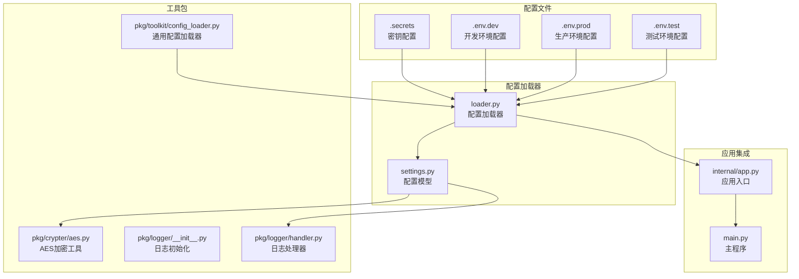
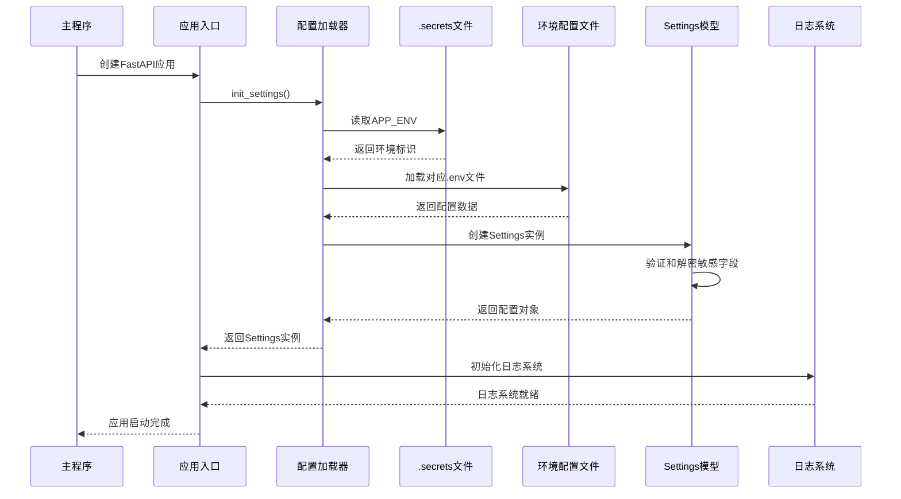
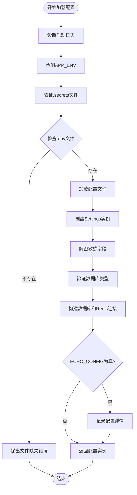
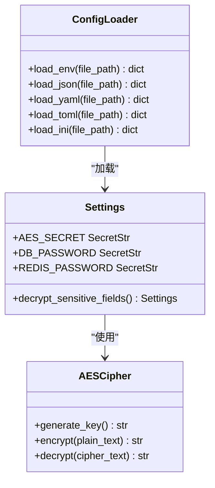
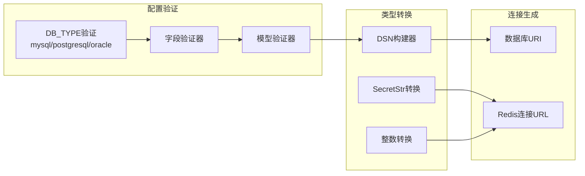
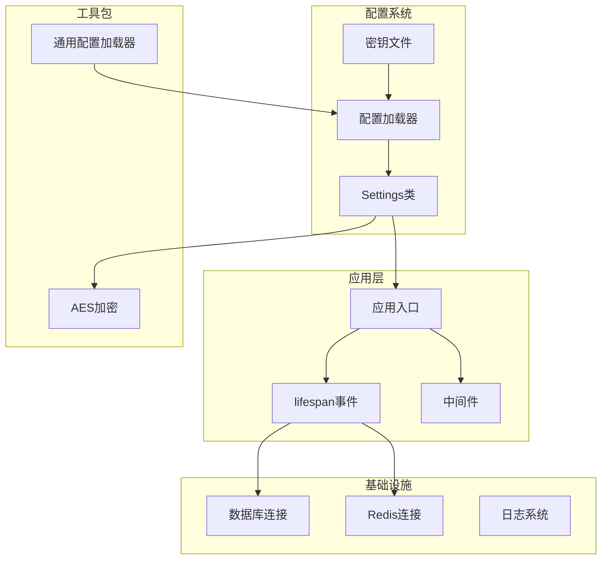

# 配置系统

<cite>
**本文档引用的文件**
- [internal/config/settings.py](file://internal/config/settings.py)
- [internal/config/loader.py](file://internal/config/loader.py)
- [configs/.secrets](file://configs/.secrets)
- [configs/.secrets.example](file://configs/.secrets.example)
- [configs/.env.dev](file://configs/.env.dev)
- [configs/.env.prod](file://configs/.env.prod)
- [configs/.env.test](file://configs/.env.test)
- [internal/app.py](file://internal/app.py)
- [main.py](file://main.py)
- [pkg/toolkit/config_loader.py](file://pkg/toolkit/config_loader.py)
- [pkg/crypter/aes.py](file://pkg/crypter/aes.py)
- [pkg/logger/__init__.py](file://pkg/logger/__init__.py)
- [pkg/logger/handler.py](file://pkg/logger/handler.py)
- [pyproject.toml](file://pyproject.toml)
</cite>

## 目录
1. [简介](#简介)
2. [项目结构](#项目结构)
3. [核心组件](#核心组件)
4. [架构概览](#架构概览)
5. [详细组件分析](#详细组件分析)
6. [依赖关系分析](#依赖关系分析)
7. [性能考虑](#性能考虑)
8. [故障排除指南](#故障排除指南)
9. [结论](#结论)

## 简介

这是一个基于Python FastAPI框架的后端项目，其配置系统采用多环境、多格式的配置管理方案。系统通过.env文件和.secrets文件分离环境配置和敏感配置，使用Pydantic Settings进行配置验证和类型转换，支持AES加密解密敏感信息，提供灵活的日志格式化选项。

## 项目结构

配置系统主要分布在以下目录和文件中：

**图表来源**
- [internal/config/loader.py](file://internal/config/loader.py#L1-L165)
- [internal/config/settings.py](file://internal/config/settings.py#L1-L159)
- [configs/.secrets](file://configs/.secrets#L1-L14)

**章节来源**
- [internal/config/loader.py](file://internal/config/loader.py#L1-L165)
- [internal/config/settings.py](file://internal/config/settings.py#L1-L159)
- [configs/.secrets](file://configs/.secrets#L1-L14)

## 核心组件

### 配置模型类 (Settings)

Settings类是整个配置系统的核心，使用Pydantic Settings进行配置管理和验证：

- **环境配置**: APP_ENV、DEBUG、LOG_FORMAT
- **密钥配置**: AES_SECRET、JWT_SECRET、JWT_ALGORITHM、ACCESS_TOKEN_EXPIRE_MINUTES
- **数据库配置**: DB_TYPE、DB_HOST、DB_PORT、DB_USERNAME、DB_PASSWORD、DB_DATABASE、DB_SERVICE_NAME、DB_ECHO
- **Redis配置**: REDIS_HOST、REDIS_PORT、REDIS_PASSWORD、REDIS_DB
- **CORS配置**: BACKEND_CORS_ORIGINS

### 配置加载器 (ConfigLoader)

提供多种配置文件格式的支持：
- JSON (.json)
- YAML (.yaml, .yml)  
- TOML (.toml)
- INI (.ini, .cfg)
- ENV (.env)

### 环境检测器 (detect_app_env)

通过检查`.secrets`文件中的APP_ENV变量来确定当前运行环境。

**章节来源**
- [internal/config/settings.py](file://internal/config/settings.py#L27-L159)
- [pkg/toolkit/config_loader.py](file://pkg/toolkit/config_loader.py#L24-L215)

## 架构概览

配置系统的整体架构采用分层设计：

**图表来源**
- [internal/app.py](file://internal/app.py#L84-L101)
- [internal/config/loader.py](file://internal/config/loader.py#L79-L132)

## 详细组件分析

### 配置加载流程

配置加载过程遵循严格的顺序和验证机制：

**图表来源**
- [internal/config/loader.py](file://internal/config/loader.py#L79-L132)
- [internal/config/settings.py](file://internal/config/settings.py#L82-L101)

### 敏感配置加密解密

系统支持对敏感配置进行AES加密存储：

**图表来源**
- [pkg/crypter/aes.py](file://pkg/crypter/aes.py#L6-L59)
- [internal/config/settings.py](file://internal/config/settings.py#L82-L101)
- [pkg/toolkit/config_loader.py](file://pkg/toolkit/config_loader.py#L24-L139)

### 环境配置管理

系统支持四种标准环境配置：

| 环境 | 文件名 | 主要用途 | 特殊配置 |
|------|--------|----------|----------|
| 本地开发 | `.env.local` | 本地开发调试 | DEBUG=true, LOG_FORMAT=text |
| 开发环境 | `.env.dev` | 开发服务器 | DEBUG=true, LOG_FORMAT=text |
| 测试环境 | `.env.test` | 自动化测试 | DEBUG=true, LOG_FORMAT=text |
| 生产环境 | `.env.prod` | 生产部署 | DEBUG=false, LOG_FORMAT=json |

**章节来源**
- [configs/.env.dev](file://configs/.env.dev#L1-L22)
- [configs/.env.prod](file://configs/.env.prod#L1-L22)
- [configs/.env.test](file://configs/.env.test#L1-L22)

### 配置验证和类型转换

Settings类使用Pydantic进行严格的配置验证：

**图表来源**
- [internal/config/settings.py](file://internal/config/settings.py#L71-L101)
- [internal/config/settings.py](file://internal/config/settings.py#L104-L159)

**章节来源**
- [internal/config/settings.py](file://internal/config/settings.py#L71-L159)

## 依赖关系分析

配置系统与其他模块的依赖关系：

**图表来源**
- [internal/app.py](file://internal/app.py#L84-L101)
- [internal/config/loader.py](file://internal/config/loader.py#L138-L165)
- [pkg/toolkit/config_loader.py](file://pkg/toolkit/config_loader.py#L1-L215)

**章节来源**
- [internal/app.py](file://internal/app.py#L1-L110)
- [pyproject.toml](file://pyproject.toml#L61-L62)

## 性能考虑

配置系统在性能方面的优化措施：

1. **单例模式**: 配置实例采用全局单例，避免重复加载
2. **延迟初始化**: 日志系统采用延迟初始化机制
3. **文件缓存**: 配置文件只在应用启动时加载
4. **内存优化**: 使用SecretStr类型减少敏感信息的内存占用
5. **异步处理**: 配置加载支持异步操作

## 故障排除指南

### 常见配置问题

| 问题类型 | 症状 | 解决方案 |
|----------|------|----------|
| 环境文件缺失 | 启动时报错"配置文件缺失" | 检查对应.env文件是否存在 |
| 密钥文件格式错误 | 验证失败或解密错误 | 确认.secrets文件格式正确 |
| 数据库连接失败 | SQLAlchemy连接错误 | 检查数据库配置和网络连通性 |
| AES解密失败 | 解密异常或密钥错误 | 验证AES密钥格式和有效性 |
| 日志格式问题 | 日志输出格式异常 | 检查LOG_FORMAT配置 |

### 调试配置

启用配置回显功能进行调试：
1. 设置`ECHO_CONFIG=true`在.secrets文件中
2. 启动应用查看完整配置输出
3. 检查敏感字段是否正确解密

**章节来源**
- [internal/config/loader.py](file://internal/config/loader.py#L116-L127)
- [configs/.secrets](file://configs/.secrets#L15-L16)

## 结论

该配置系统采用了现代化的配置管理最佳实践，具有以下特点：

1. **安全性**: 支持敏感配置加密存储和传输
2. **灵活性**: 支持多环境配置和多种配置文件格式
3. **可靠性**: 严格的配置验证和错误处理机制
4. **可维护性**: 清晰的代码结构和详细的文档说明
5. **性能**: 优化的加载流程和资源管理

系统通过合理的架构设计，为FastAPI应用提供了稳定可靠的配置管理解决方案，适用于从开发到生产的各种场景。