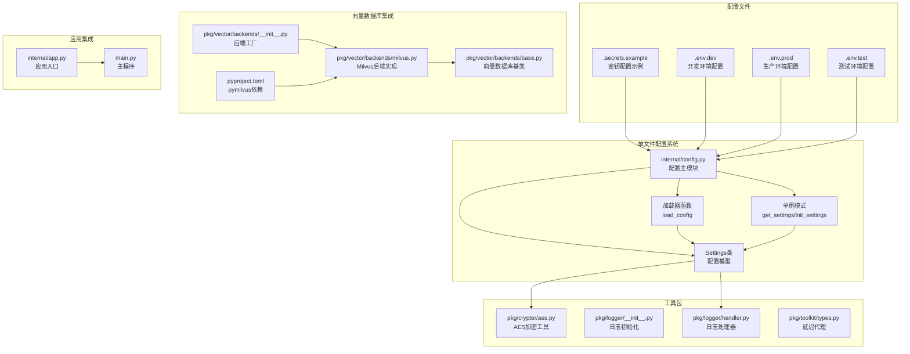
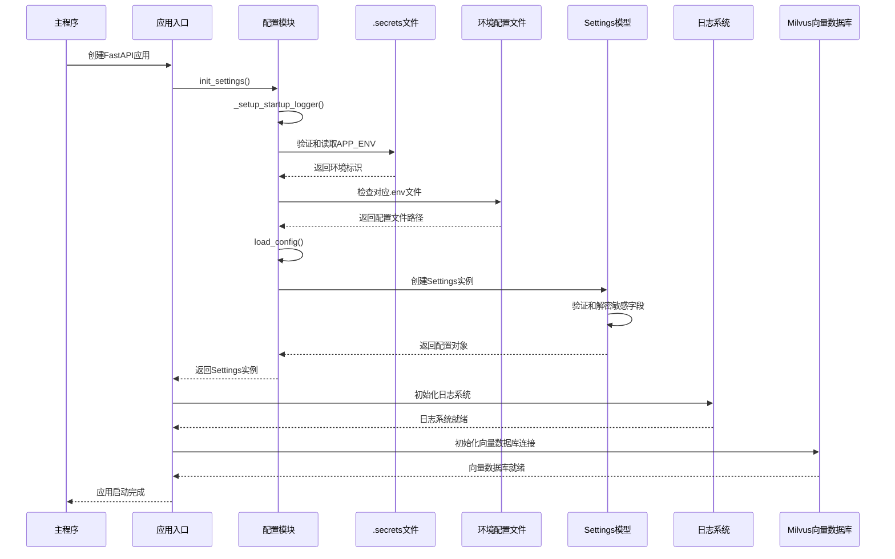
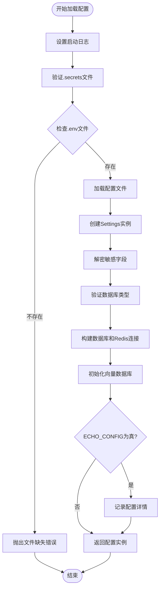
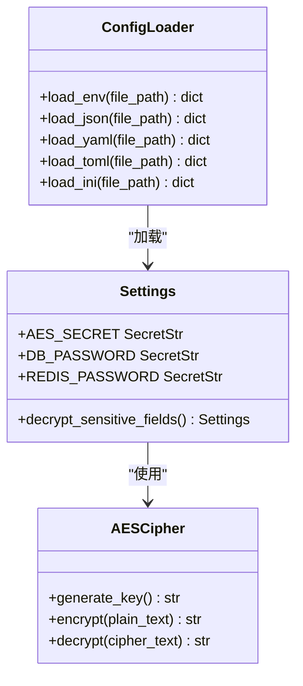
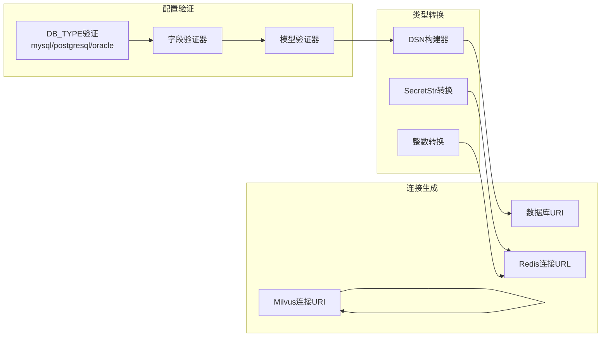
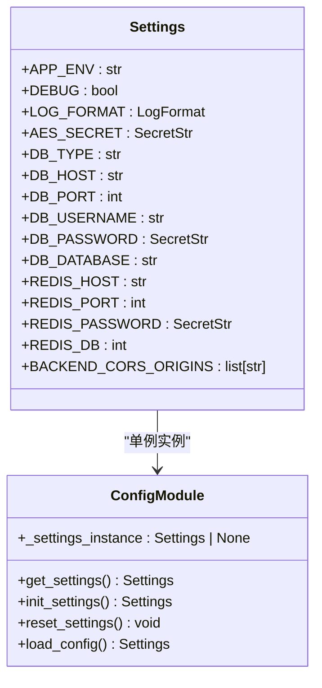
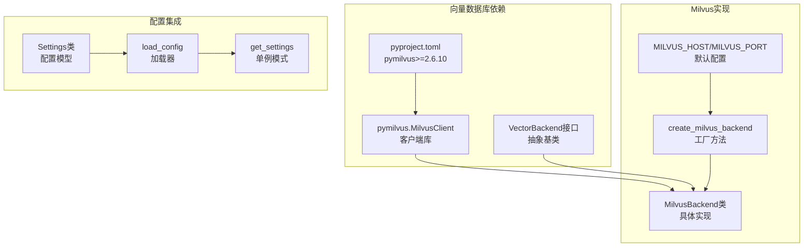
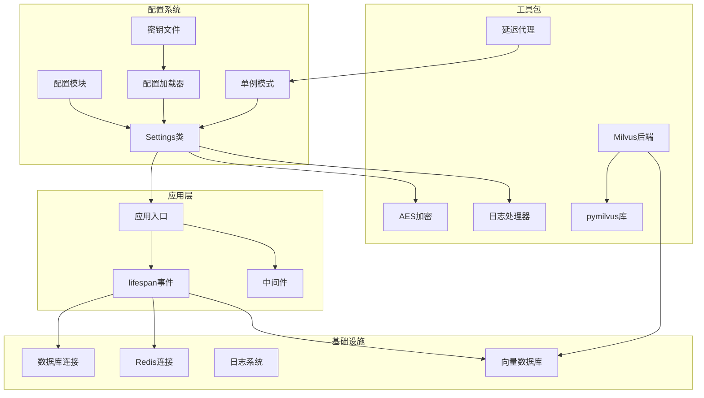

# 配置系统

<cite>
**本文档引用的文件**
- [internal/config.py](file://internal/config.py)
- [configs/.secrets.example](file://configs/.secrets.example)
- [pkg/vector/backends/milvus.py](file://pkg/vector/backends/milvus.py)
- [pkg/vector/backends/base.py](file://pkg/vector/backends/base.py)
- [pkg/vector/backends/__init__.py](file://pkg/vector/backends/__init__.py)
- [pyproject.toml](file://pyproject.toml)
</cite>

## 更新摘要
**变更内容**
- 新增pymilvus依赖配置支持Milvus向量数据库集成
- 在依赖管理中添加pymilvus>=2.6.10版本要求
- 集成Milvus向量数据库后端支持
- 更新配置系统以支持向量数据库相关配置

## 目录
1. [简介](#简介)
2. [项目结构](#项目结构)
3. [核心组件](#核心组件)
4. [架构概览](#架构概览)
5. [详细组件分析](#详细组件分析)
6. [Milvus向量数据库配置](#milvus向量数据库配置)
7. [依赖关系分析](#依赖关系分析)
8. [性能考虑](#性能考虑)
9. [故障排除指南](#故障排除指南)
10. [结论](#结论)

## 简介

这是一个基于Python FastAPI框架的后端项目，其配置系统采用单文件结构和现代化的设计理念。系统通过.env文件和.secrets文件分离环境配置和敏感配置，使用Pydantic Settings进行配置验证和类型转换，支持AES加密解密敏感信息，提供线程安全的单例模式和延迟加载机制，集成日志系统并支持多种日志格式。

**更新** 新增对Milvus向量数据库的支持，通过pymilvus依赖实现向量数据的存储和检索功能。

## 项目结构

配置系统主要分布在以下目录和文件中：

```mermaid
graph TB
subgraph "配置文件"
Secrets[".secrets.example<br/>密钥配置示例"]
EnvDev[".env.dev<br/>开发环境配置"]
EnvProd[".env.prod<br/>生产环境配置"]
EnvTest[".env.test<br/>测试环境配置"]
end
subgraph "单文件配置系统"
Config[internal/config.py<br/>配置主模块]
Settings[Settings类<br/>配置模型]
Loader[加载器函数<br/>load_config]
Singleton[单例模式<br/>get_settings/init_settings]
end
subgraph "向量数据库集成"
MilvusBackend[pkg/vector/backends/milvus.py<br/>Milvus后端实现]
MilvusBase[pkg/vector/backends/base.py<br/>向量数据库基类]
MilvusFactory[pkg/vector/backends/__init__.py<br/>后端工厂]
PymilvusDep[pyproject.toml<br/>pymilvus依赖]
end
subgraph "应用集成"
App[internal/app.py<br/>应用入口]
Main[main.py<br/>主程序]
end
subgraph "工具包"
AES[pkg/crypter/aes.py<br/>AES加密工具]
LoggerInit[pkg/logger/__init__.py<br/>日志初始化]
LoggerHandler[pkg/logger/handler.py<br/>日志处理器]
LazyProxy[pkg/toolkit/types.py<br/>延迟代理]
end
Secrets --> Config
EnvDev --> Config
EnvProd --> Config
EnvTest --> Config
Config --> Settings
Config --> Loader
Config --> Singleton
Loader --> Settings
Singleton --> Settings
Settings --> LoggerHandler
Settings --> AES
MilvusBackend --> MilvusBase
MilvusFactory --> MilvusBackend
PymilvusDep --> MilvusBackend
App --> Main
```

**图表来源**
- [internal/config.py:1-400](file://internal/config.py#L1-L400)
- [configs/.secrets.example:1-33](file://configs/.secrets.example#L1-L33)
- [pkg/vector/backends/milvus.py:1-502](file://pkg/vector/backends/milvus.py#L1-L502)
- [pyproject.toml](file://pyproject.toml#L71)

**章节来源**
- [internal/config.py:1-400](file://internal/config.py#L1-L400)
- [configs/.secrets.example:1-33](file://configs/.secrets.example#L1-L33)

## 核心组件

### 配置模型类 (Settings)

Settings类是整个配置系统的核心，使用Pydantic Settings进行配置管理和验证：

- **环境配置**: APP_ENV、DEBUG、LOG_FORMAT
- **密钥配置**: AES_SECRET、JWT_SECRET、JWT_ALGORITHM、ACCESS_TOKEN_EXPIRE_MINUTES
- **数据库配置**: DB_TYPE、DB_HOST、DB_PORT、DB_USERNAME、DB_PASSWORD、DB_DATABASE、DB_SERVICE_NAME、DB_ECHO
- **数据库读副本**: DB_READ_HOST、DB_READ_PORT、DB_READ_USERNAME、DB_READ_PASSWORD、DB_READ_DATABASE、DB_READ_SERVICE_NAME
- **Redis配置**: REDIS_HOST、REDIS_PORT、REDIS_PASSWORD、REDIS_DB
- **CORS配置**: BACKEND_CORS_ORIGINS

### 配置加载器 (load_config)

提供完整的配置加载流程：
- 环境检测和验证
- 配置文件加载和合并
- 敏感字段解密
- 配置验证和类型转换

### 单例模式 (get_settings/init_settings)

提供线程安全的配置实例管理：
- 延迟初始化机制
- 全局单例模式
- 测试环境重置功能

### 环境检测器 (detect_app_env)

通过检查.secrets文件中的APP_ENV变量来确定当前运行环境。

**章节来源**
- [internal/config.py:34-235](file://internal/config.py#L34-L235)
- [internal/config.py:257-279](file://internal/config.py#L257-L279)

## 架构概览

配置系统的整体架构采用单文件设计和分层架构：

```mermaid
sequenceDiagram
participant Main as 主程序
participant App as 应用入口
participant Config as 配置模块
participant Secrets as .secrets文件
participant EnvFile as 环境配置文件
participant Settings as Settings模型
participant Logger as 日志系统
participant Milvus as Milvus向量数据库
Main->>App : 创建FastAPI应用
App->>Config : init_settings()
Config->>Config : _setup_startup_logger()
Config->>Secrets : 验证和读取APP_ENV
Secrets-->>Config : 返回环境标识
Config->>EnvFile : 检查对应.env文件
EnvFile-->>Config : 返回配置文件路径
Config->>Config : load_config()
Config->>Settings : 创建Settings实例
Settings->>Settings : 验证和解密敏感字段
Settings-->>Config : 返回配置对象
Config-->>App : 返回Settings实例
App->>Logger : 初始化日志系统
Logger-->>App : 日志系统就绪
App->>Milvus : 初始化向量数据库连接
Milvus-->>App : 向量数据库就绪
App-->>Main : 应用启动完成
```

**图表来源**
- [internal/app.py:82-90](file://internal/app.py#L82-L90)
- [internal/config.py:309-362](file://internal/config.py#L309-L362)

## 详细组件分析

### 配置加载流程

配置加载过程遵循严格的顺序和验证机制：

```mermaid
flowchart TD
Start([开始加载配置]) --> SetupLogger["设置启动日志"]
SetupLogger --> ValidateSecrets["验证.secrets文件"]
ValidateSecrets --> CheckEnvFile{"检查.env文件"}
CheckEnvFile --> |存在| LoadFiles["加载配置文件"]
CheckEnvFile --> |不存在| Error["抛出文件缺失错误"]
LoadFiles --> CreateSettings["创建Settings实例"]
CreateSettings --> DecryptFields["解密敏感字段"]
DecryptFields --> ValidateDBType["验证数据库类型"]
ValidateDBType --> BuildConnections["构建数据库和Redis连接"]
BuildConnections --> InitVectorDB["初始化向量数据库"]
InitVectorDB --> PrintConfig{"ECHO_CONFIG为真?"}
PrintConfig --> |是| LogConfig["记录配置详情"]
PrintConfig --> |否| ReturnSettings["返回配置实例"]
LogConfig --> ReturnSettings
Error --> End([结束])
ReturnSettings --> End
```

**图表来源**
- [internal/config.py:309-362](file://internal/config.py#L309-L362)
- [internal/config.py:97-118](file://internal/config.py#L97-L118)

### 敏感配置加密解密

系统支持对敏感配置进行AES加密存储：

```mermaid
classDiagram
class AESCipher {
+generate_key() str
+encrypt(plain_text) str
+decrypt(cipher_text) str
}
class Settings {
+AES_SECRET SecretStr
+DB_PASSWORD SecretStr
+REDIS_PASSWORD SecretStr
+decrypt_sensitive_fields() Settings
}
class ConfigLoader {
+load_env(file_path) dict
+load_json(file_path) dict
+load_yaml(file_path) dict
+load_toml(file_path) dict
+load_ini(file_path) dict
}
Settings --> AESCipher : "使用"
ConfigLoader --> Settings : "加载"
```

**图表来源**
- [pkg/crypter/aes.py:6-59](file://pkg/crypter/aes.py#L6-L59)
- [internal/config.py:97-118](file://internal/config.py#L97-L118)

### 环境配置管理

系统支持四种标准环境配置：

| 环境 | 文件名 | 主要用途 | 特殊配置 |
|------|--------|----------|----------|
| 本地开发 | `.env.local` | 本地开发调试 | DEBUG=true, LOG_FORMAT=text |
| 开发环境 | `.env.dev` | 开发服务器 | DEBUG=true, LOG_FORMAT=text |
| 测试环境 | `.env.test` | 自动化测试 | DEBUG=true, LOG_FORMAT=text |
| 生产环境 | `.env.prod` | 生产部署 | DEBUG=false, LOG_FORMAT=json |

**章节来源**
- [configs/.env.dev:1-22](file://configs/.env.dev#L1-L22)
- [configs/.env.prod:1-22](file://configs/.env.prod#L1-L22)
- [configs/.env.test:1-22](file://configs/.env.test#L1-L22)

### 配置验证和类型转换

Settings类使用Pydantic进行严格的配置验证：

```mermaid
graph LR
subgraph "配置验证"
DBType["DB_TYPE验证<br/>mysql/postgresql/oracle"]
FieldValidator["字段验证器"]
ModelValidator["模型验证器"]
end
subgraph "类型转换"
DSNBuilder["DSN构建器"]
SecretConverter["SecretStr转换"]
IntConverter["整数转换"]
end
subgraph "连接生成"
DBURI["数据库URI"]
RedisURL["Redis连接URL"]
MilvusURI["Milvus连接URI"]
end
DBType --> FieldValidator
FieldValidator --> ModelValidator
ModelValidator --> DSNBuilder
DSNBuilder --> DBURI
SecretConverter --> RedisURL
IntConverter --> RedisURL
MilvusURI --> MilvusURI
```

**图表来源**
- [internal/config.py:86-96](file://internal/config.py#L86-L96)
- [internal/config.py:120-235](file://internal/config.py#L120-L235)

**章节来源**
- [internal/config.py:86-235](file://internal/config.py#L86-L235)

### 线程安全单例模式

配置系统采用线程安全的单例模式：

```mermaid
classDiagram
class Settings {
+APP_ENV : str
+DEBUG : bool
+LOG_FORMAT : LogFormat
+AES_SECRET : SecretStr
+DB_TYPE : str
+DB_HOST : str
+DB_PORT : int
+DB_USERNAME : str
+DB_PASSWORD : SecretStr
+DB_DATABASE : str
+REDIS_HOST : str
+REDIS_PORT : int
+REDIS_PASSWORD : SecretStr
+REDIS_DB : int
+BACKEND_CORS_ORIGINS : list[str]
}
class ConfigModule {
+_settings_instance : Settings | None
+get_settings() Settings
+init_settings() Settings
+reset_settings() void
+load_config() Settings
}
Settings --> ConfigModule : "单例实例"
```

**图表来源**
- [internal/config.py:364-395](file://internal/config.py#L364-L395)

**章节来源**
- [internal/config.py:364-395](file://internal/config.py#L364-L395)

## Milvus向量数据库配置

### pymilvus依赖配置

系统已集成pymilvus向量数据库支持，版本要求为>=2.6.10：

```mermaid
graph TB
subgraph "向量数据库依赖"
Pymilvus[pyproject.toml<br/>pymilvus>=2.6.10]
MilvusClient[pymilvus.MilvusClient<br/>客户端库]
BackendInterface[VectorBackend接口<br/>抽象基类]
end
subgraph "Milvus实现"
MilvusBackendClass[MilvusBackend类<br/>具体实现]
MilvusFactory[create_milvus_backend<br/>工厂方法]
HostConfig[MILVUS_HOST/MILVUS_PORT<br/>默认配置]
end
subgraph "配置集成"
SettingsConfig[Settings类<br/>配置模型]
ConfigLoader[load_config<br/>加载器]
Singleton[get_settings<br/>单例模式]
end
Pymilvus --> MilvusClient
MilvusClient --> MilvusBackendClass
BackendInterface --> MilvusBackendClass
MilvusFactory --> MilvusBackendClass
HostConfig --> MilvusFactory
SettingsConfig --> ConfigLoader
ConfigLoader --> Singleton
```

**图表来源**
- [pyproject.toml](file://pyproject.toml#L71)
- [pkg/vector/backends/milvus.py:1-502](file://pkg/vector/backends/milvus.py#L1-L502)
- [pkg/vector/backends/base.py:122-185](file://pkg/vector/backends/base.py#L122-L185)

### 向量数据库配置选项

Milvus向量数据库支持以下配置选项：

- **连接配置**: uri、token、db_name、timeout
- **默认搜索参数**: default_search_params
- **主机配置**: MILVUS_HOST=localhost、MILVUS_PORT=19530
- **后端提供者**: BackendProvider.MILVUS

### 向量数据库后端实现

Milvus后端实现支持以下核心功能：

- **集合管理**: ensure_collection、load_collection、release_collection
- **数据操作**: upsert、delete、fetch、search
- **健康检查**: healthcheck
- **索引管理**: _build_index_params、_build_search_params
- **数据验证**: validate_record、validate_records、validate_search_request

**章节来源**
- [pyproject.toml](file://pyproject.toml#L71)
- [pkg/vector/backends/milvus.py:27-501](file://pkg/vector/backends/milvus.py#L27-L501)
- [pkg/vector/backends/base.py:122-185](file://pkg/vector/backends/base.py#L122-L185)

## 依赖关系分析

配置系统与其他模块的依赖关系：

```mermaid
graph TB
subgraph "配置系统"
Settings[Settings类]
Config[配置模块]
Singleton[单例模式]
Loader[配置加载器]
Secrets[密钥文件]
end
subgraph "应用层"
App[应用入口]
Lifespan[lifespan事件]
Middlewares[中间件]
end
subgraph "基础设施"
Database[数据库连接]
Redis[Redis连接]
Logger[日志系统]
Milvus[向量数据库]
end
subgraph "工具包"
AES[AES加密]
Toolkit[延迟代理]
LoggerHandler[日志处理器]
MilvusBackend[Milvus后端]
Pymilvus[pymilvus库]
end
Settings --> App
Config --> Settings
Singleton --> Settings
Loader --> Settings
Secrets --> Loader
App --> Lifespan
Lifespan --> Database
Lifespan --> Redis
Lifespan --> Milvus
App --> Middlewares
Settings --> AES
Settings --> LoggerHandler
Toolkit --> Singleton
MilvusBackend --> Pymilvus
MilvusBackend --> Milvus
```

**图表来源**
- [internal/app.py:82-110](file://internal/app.py#L82-L110)
- [internal/config.py:309-395](file://internal/config.py#L309-L395)
- [pyproject.toml](file://pyproject.toml#L71)

**章节来源**
- [internal/app.py:1-111](file://internal/app.py#L1-L111)
- [pyproject.toml:61-72](file://pyproject.toml#L61-L72)

## 性能考虑

配置系统在性能方面的优化措施：

1. **单例模式**: 配置实例采用全局单例，避免重复加载
2. **延迟初始化**: 使用lazy_proxy实现延迟加载，减少启动时间
3. **线程安全**: 通过全局变量和函数级别的锁确保线程安全
4. **文件缓存**: 配置文件只在应用启动时加载
5. **内存优化**: 使用SecretStr类型减少敏感信息的内存占用
6. **启动日志**: 提供启动阶段的日志记录，便于性能监控
7. **向量数据库连接池**: Milvus后端使用连接池优化数据库访问
8. **异步操作**: 向量数据库操作采用异步模式提高并发性能

## 故障排除指南

### 常见配置问题

| 问题类型 | 症状 | 解决方案 |
|----------|------|----------|
| 环境文件缺失 | 启动时报错"配置文件缺失" | 检查对应.env文件是否存在 |
| 密钥文件格式错误 | 验证失败或解密错误 | 确认.secrets文件格式正确 |
| 数据库连接失败 | SQLAlchemy连接错误 | 检查数据库配置和网络连通性 |
| AES解密失败 | 解密异常或密钥错误 | 验证AES密钥格式和有效性 |
| 日志格式问题 | 日志输出格式异常 | 检查LOG_FORMAT配置 |
| Milvus连接失败 | 向量数据库连接错误 | 检查Milvus服务状态和连接配置 |
| pymilvus版本不兼容 | 导入错误或功能异常 | 确认pymilvus版本>=2.6.10 |

### 调试配置

启用配置回显功能进行调试：
1. 设置`ECHO_CONFIG=true`在.secrets文件中
2. 启动应用查看完整配置输出
3. 检查敏感字段是否正确解密
4. 验证Milvus连接配置是否正确

**章节来源**
- [internal/config.py:330-362](file://internal/config.py#L330-L362)
- [configs/.secrets.example:31-33](file://configs/.secrets.example#L31-L33)

## 结论

该配置系统采用了现代化的配置管理最佳实践，具有以下特点：

1. **安全性**: 支持敏感配置加密存储和传输
2. **灵活性**: 支持多环境配置和多种配置文件格式
3. **可靠性**: 严格的配置验证和错误处理机制
4. **性能**: 优化的加载流程和资源管理，支持线程安全的单例模式
5. **可维护性**: 清晰的代码结构和详细的文档说明
6. **集成度**: 深度集成日志系统，支持多种日志格式
7. **扩展性**: 支持向量数据库集成，具备良好的扩展能力

**更新** 新增的pymilvus依赖配置为系统增加了强大的向量数据库支持，通过Milvus后端实现了高效的向量数据存储和检索功能。配置系统现已支持完整的向量数据库集成，包括连接配置、索引管理、数据操作等功能，为构建AI应用提供了坚实的基础。

系统通过合理的架构设计，为FastAPI应用提供了稳定可靠的配置管理解决方案，适用于从开发到生产的各种场景。单文件结构简化了配置管理，线程安全的单例模式确保了应用的稳定性，而集成的日志系统和向量数据库支持为运维和AI应用开发提供了强大的支持。