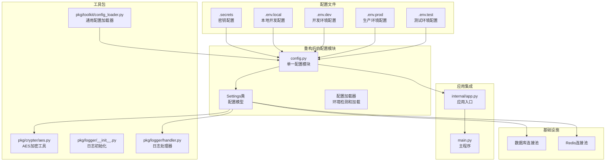
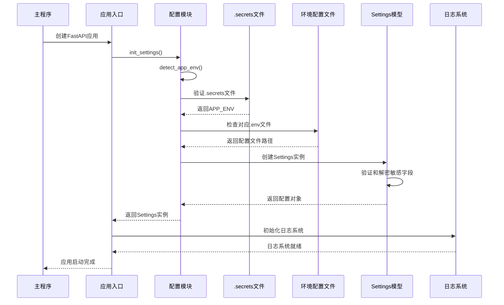
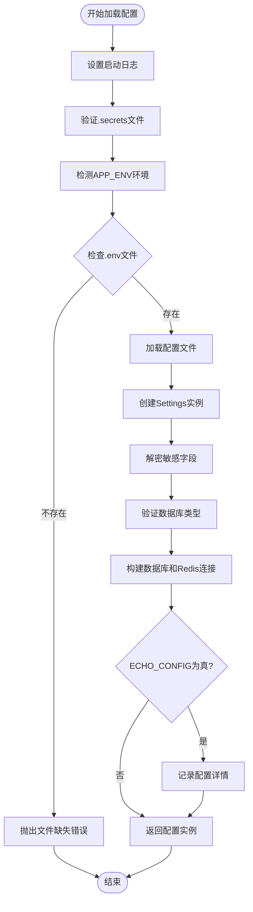
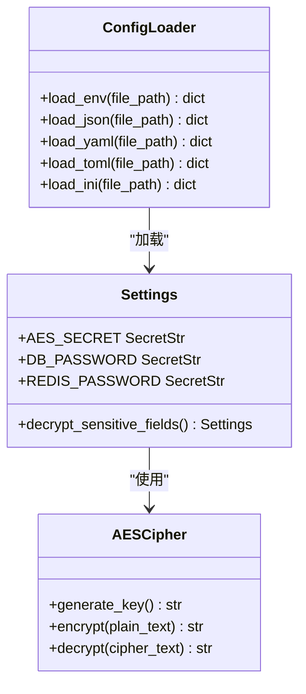
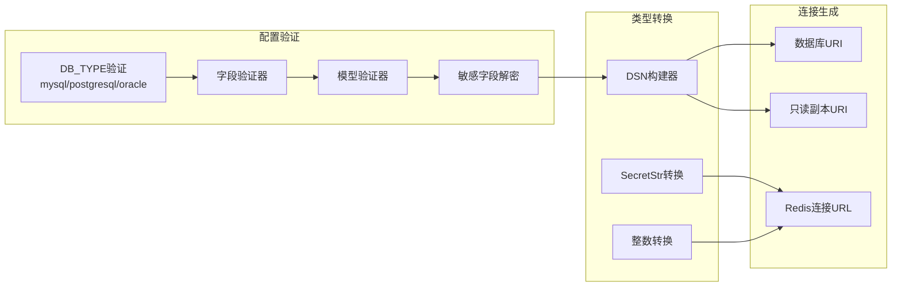
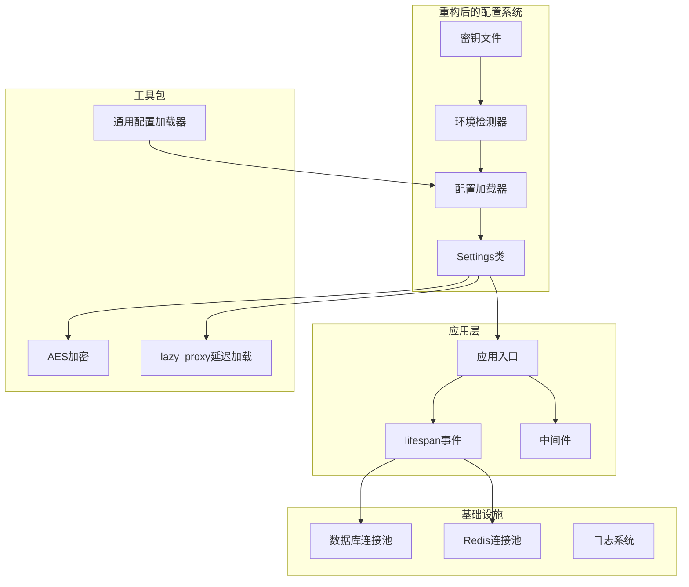

# 配置系统

<cite>
**本文档引用的文件**
- [internal/config.py](file://internal/config.py)
- [configs/.secrets](file://configs/.secrets)
- [configs/.secrets.example](file://configs/.secrets.example)
- [internal/app.py](file://internal/app.py)
- [main.py](file://main.py)
- [pkg/crypter/aes.py](file://pkg/crypter/aes.py)
- [pkg/logger/__init__.py](file://pkg/logger/__init__.py)
- [pkg/logger/handler.py](file://pkg/logger/handler.py)
- [pkg/toolkit/config_loader.py](file://pkg/toolkit/config_loader.py)
- [internal/infra/database/connection.py](file://internal/infra/database/connection.py)
- [internal/infra/redis/connection.py](file://internal/infra/redis/connection.py)
- [pyproject.toml](file://pyproject.toml)
</cite>

## 更新摘要
**所做更改**
- 更新配置模块架构：从settings.py和loader.py合并为单一config.py文件
- 新增环境检测功能：detect_app_env函数用于检测应用运行环境
- 增强敏感字段解密：Settings类内置AES解密功能
- 扩展数据库连接池：支持主库和只读副本连接池配置
- 更新配置加载流程：简化配置加载和验证机制
- 新增延迟初始化：使用lazy_proxy实现配置的延迟加载

## 目录
1. [简介](#简介)
2. [项目结构](#项目结构)
3. [核心组件](#核心组件)
4. [架构概览](#架构概览)
5. [详细组件分析](#详细组件分析)
6. [依赖关系分析](#依赖关系分析)
7. [性能考虑](#性能考虑)
8. [故障排除指南](#故障排除指南)
9. [结论](#结论)

## 简介

这是一个基于Python FastAPI框架的后端项目，其配置系统经过重构后采用单一模块设计。系统通过.env文件和.secrets文件分离环境配置和敏感配置，使用Pydantic Settings进行配置验证和类型转换，支持AES加密解密敏感信息，提供灵活的日志格式化选项和数据库连接池管理。

**更新** 配置系统已从原来的settings.py和loader.py分离架构重构为单一config.py模块，集成了配置定义、加载逻辑和全局配置实例管理。

## 项目结构

配置系统主要分布在以下目录和文件中：

```mermaid
graph TB
subgraph "配置文件"
Secrets[".secrets<br/>密钥配置"]
EnvLocal[".env.local<br/>本地开发配置"]
EnvDev[".env.dev<br/>开发环境配置"]
EnvProd[".env.prod<br/>生产环境配置"]
EnvTest[".env.test<br/>测试环境配置"]
end
subgraph "重构后的配置模块"
Config[config.py<br/>单一配置模块]
Settings[Settings类<br/>配置模型]
Loader[配置加载器<br/>环境检测和加载]
end
subgraph "应用集成"
App[internal/app.py<br/>应用入口]
Main[main.py<br/>主程序]
end
subgraph "工具包"
Toolkit[pkg/toolkit/config_loader.py<br/>通用配置加载器]
AES[pkg/crypter/aes.py<br/>AES加密工具]
LoggerInit[pkg/logger/__init__.py<br/>日志初始化]
LoggerHandler[pkg/logger/handler.py<br/>日志处理器]
end
subgraph "基础设施"
DBConnection[数据库连接池]
RedisConnection[Redis连接池]
end
Secrets --> Config
EnvLocal --> Config
EnvDev --> Config
EnvProd --> Config
EnvTest --> Config
Config --> Settings
Config --> App
App --> Main
Settings --> LoggerHandler
Settings --> AES
Settings --> DBConnection
Settings --> RedisConnection
Toolkit --> Config
```

**图表来源**
- [internal/config.py](file://internal/config.py#L1-L401)
- [configs/.secrets](file://configs/.secrets#L1-L14)

**章节来源**
- [internal/config.py](file://internal/config.py#L1-L401)
- [configs/.secrets](file://configs/.secrets#L1-L14)

## 核心组件

### 配置模型类 (Settings)

Settings类是整个配置系统的核心，使用Pydantic Settings进行配置管理和验证：

- **环境配置**: APP_ENV、DEBUG、LOG_FORMAT
- **密钥配置**: AES_SECRET、JWT_SECRET、JWT_ALGORITHM、ACCESS_TOKEN_EXPIRE_MINUTES
- **数据库配置**: DB_TYPE、DB_HOST、DB_PORT、DB_USERNAME、DB_PASSWORD、DB_DATABASE、DB_SERVICE_NAME、DB_ECHO
- **数据库读副本**: DB_READ_HOST、DB_READ_PORT、DB_READ_USERNAME、DB_READ_PASSWORD、DB_READ_DATABASE、DB_READ_SERVICE_NAME
- **Redis配置**: REDIS_HOST、REDIS_PORT、REDIS_PASSWORD、REDIS_DB
- **CORS配置**: BACKEND_CORS_ORIGINS

**更新** 新增数据库读副本配置支持，提供主库和只读副本的连接管理。

### 配置加载器 (detect_app_env, load_config)

提供环境检测和配置加载功能：
- **环境检测**: detect_app_env函数通过检查.secrets文件中的APP_ENV变量来确定当前运行环境
- **配置加载**: load_config函数负责验证.secrets文件、检查环境配置文件、加载配置并创建Settings实例
- **延迟初始化**: 使用lazy_proxy实现配置的延迟加载，避免不必要的初始化

### 环境检测器 (detect_app_env)

通过检查`.secrets`文件中的APP_ENV变量来确定当前运行环境，支持四种标准环境：
- 本地开发: local
- 开发环境: dev  
- 测试环境: test
- 生产环境: prod

**更新** 环境检测功能已集成到单一配置模块中，提供更简洁的API接口。

**章节来源**
- [internal/config.py](file://internal/config.py#L34-L235)
- [internal/config.py](file://internal/config.py#L257-L278)

## 架构概览

配置系统的整体架构采用分层设计，经过重构后更加简洁高效：

```mermaid
sequenceDiagram
participant Main as 主程序
participant App as 应用入口
participant Config as 配置模块
participant Secrets as .secrets文件
participant EnvFile as 环境配置文件
participant Settings as Settings模型
participant Logger as 日志系统
Main->>App : 创建FastAPI应用
App->>Config : init_settings()
Config->>Config : detect_app_env()
Config->>Secrets : 验证.secrets文件
Secrets-->>Config : 返回APP_ENV
Config->>EnvFile : 检查对应.env文件
EnvFile-->>Config : 返回配置文件路径
Config->>Settings : 创建Settings实例
Settings->>Settings : 验证和解密敏感字段
Settings-->>Config : 返回配置对象
Config-->>App : 返回Settings实例
App->>Logger : 初始化日志系统
Logger-->>App : 日志系统就绪
App-->>Main : 应用启动完成
```

**图表来源**
- [internal/app.py](file://internal/app.py#L84-L94)
- [internal/config.py](file://internal/config.py#L309-L386)

## 详细组件分析

### 配置加载流程

配置加载过程遵循严格的顺序和验证机制，经过重构后更加简洁：

```mermaid
flowchart TD
Start([开始加载配置]) --> SetupLogger["设置启动日志"]
SetupLogger --> ValidateSecrets["验证.secrets文件"]
ValidateSecrets --> DetectEnv["检测APP_ENV环境"]
DetectEnv --> CheckEnvFile{"检查.env文件"}
CheckEnvFile --> |存在| LoadFiles["加载配置文件"]
CheckEnvFile --> |不存在| Error["抛出文件缺失错误"]
LoadFiles --> CreateSettings["创建Settings实例"]
CreateSettings --> DecryptFields["解密敏感字段"]
DecryptFields --> ValidateDBType["验证数据库类型"]
ValidateDBType --> BuildConnections["构建数据库和Redis连接"]
BuildConnections --> PrintConfig{"ECHO_CONFIG为真?"}
PrintConfig --> |是| LogConfig["记录配置详情"]
PrintConfig --> |否| ReturnSettings["返回配置实例"]
LogConfig --> ReturnSettings
Error --> End([结束])
ReturnSettings --> End
```

**图表来源**
- [internal/config.py](file://internal/config.py#L309-L386)
- [internal/config.py](file://internal/config.py#L97-L118)

### 敏感配置加密解密

系统支持对敏感配置进行AES加密存储，经过重构后集成到Settings类中：

```mermaid
classDiagram
class AESCipher {
+generate_key() str
+encrypt(plain_text) str
+decrypt(cipher_text) str
}
class Settings {
+AES_SECRET SecretStr
+DB_PASSWORD SecretStr
+REDIS_PASSWORD SecretStr
+decrypt_sensitive_fields() Settings
}
class ConfigLoader {
+load_env(file_path) dict
+load_json(file_path) dict
+load_yaml(file_path) dict
+load_toml(file_path) dict
+load_ini(file_path) dict
}
Settings --> AESCipher : "使用"
ConfigLoader --> Settings : "加载"
```

**图表来源**
- [pkg/crypter/aes.py](file://pkg/crypter/aes.py#L6-L59)
- [internal/config.py](file://internal/config.py#L97-L118)
- [pkg/toolkit/config_loader.py](file://pkg/toolkit/config_loader.py#L24-L139)

**更新** 敏感字段解密功能已集成到Settings类的model_validator中，自动处理DB_PASSWORD、DB_READ_PASSWORD和REDIS_PASSWORD的解密。

### 环境配置管理

系统支持四种标准环境配置，配置文件结构保持不变：

| 环境 | 文件名 | 主要用途 | 特殊配置 |
|------|--------|----------|----------|
| 本地开发 | `.env.local` | 本地开发调试 | DEBUG=true, LOG_FORMAT=text |
| 开发环境 | `.env.dev` | 开发服务器 | DEBUG=true, LOG_FORMAT=text |
| 测试环境 | `.env.test` | 自动化测试 | DEBUG=true, LOG_FORMAT=text |
| 生产环境 | `.env.prod` | 生产部署 | DEBUG=false, LOG_FORMAT=json |

**章节来源**
- [configs/.secrets.example](file://configs/.secrets.example#L6-L7)

### 配置验证和类型转换

Settings类使用Pydantic进行严格的配置验证，经过重构后功能更加完善：

```mermaid
graph LR
subgraph "配置验证"
DBType["DB_TYPE验证<br/>mysql/postgresql/oracle"]
FieldValidator["字段验证器"]
ModelValidator["模型验证器"]
SensitiveDecrypt["敏感字段解密"]
end
subgraph "类型转换"
DSNBuilder["DSN构建器"]
SecretConverter["SecretStr转换"]
IntConverter["整数转换"]
end
subgraph "连接生成"
DBURI["数据库URI"]
ReadDBURI["只读副本URI"]
RedisURL["Redis连接URL"]
end
DBType --> FieldValidator
FieldValidator --> ModelValidator
ModelValidator --> SensitiveDecrypt
SensitiveDecrypt --> DSNBuilder
DSNBuilder --> DBURI
DSNBuilder --> ReadDBURI
SecretConverter --> RedisURL
IntConverter --> RedisURL
```

**图表来源**
- [internal/config.py](file://internal/config.py#L86-L95)
- [internal/config.py](file://internal/config.py#L97-L118)
- [internal/config.py](file://internal/config.py#L120-L234)

**更新** 新增敏感字段解密验证器，自动处理ENC(encrypted_value)格式的加密字段。

**章节来源**
- [internal/config.py](file://internal/config.py#L86-L234)

## 依赖关系分析

配置系统与其他模块的依赖关系经过重构后更加清晰：

```mermaid
graph TB
subgraph "重构后的配置系统"
Settings[Settings类]
ConfigLoader[配置加载器]
EnvDetector[环境检测器]
Secrets[密钥文件]
end
subgraph "应用层"
App[应用入口]
Lifespan[lifespan事件]
Middlewares[中间件]
end
subgraph "基础设施"
Database[数据库连接池]
Redis[Redis连接池]
Logger[日志系统]
end
subgraph "工具包"
AES[AES加密]
Toolkit[通用配置加载器]
LazyProxy[lazy_proxy延迟加载]
end
Settings --> App
ConfigLoader --> Settings
EnvDetector --> ConfigLoader
Secrets --> EnvDetector
App --> Lifespan
Lifespan --> Database
Lifespan --> Redis
App --> Middlewares
Settings --> AES
Settings --> LazyProxy
Toolkit --> ConfigLoader
```

**图表来源**
- [internal/app.py](file://internal/app.py#L84-L94)
- [internal/config.py](file://internal/config.py#L368-L398)
- [pkg/toolkit/config_loader.py](file://pkg/toolkit/config_loader.py#L1-L215)

**更新** 新增lazy_proxy延迟加载机制，Settings类现在通过lazy_proxy进行延迟初始化。

**章节来源**
- [internal/app.py](file://internal/app.py#L1-L111)
- [internal/config.py](file://internal/config.py#L368-L398)
- [pyproject.toml](file://pyproject.toml#L61-L62)

## 性能考虑

配置系统在性能方面的优化措施经过重构后更加完善：

1. **延迟初始化**: 使用lazy_proxy实现配置的延迟加载，避免应用启动时的额外开销
2. **单例模式**: 配置实例采用全局单例，避免重复加载
3. **文件缓存**: 配置文件只在应用启动时加载，后续访问使用内存中的实例
4. **内存优化**: 使用SecretStr类型减少敏感信息的内存占用
5. **异步处理**: 配置加载支持异步操作，与FastAPI的异步特性保持一致
6. **连接池优化**: 数据库连接池支持主库和只读副本的独立配置

**更新** 新增数据库连接池的主库和只读副本分离配置，提供更好的读写分离支持。

## 故障排除指南

### 常见配置问题

| 问题类型 | 症状 | 解决方案 |
|----------|------|----------|
| 环境文件缺失 | 启动时报错"配置文件缺失" | 检查对应.env文件是否存在 |
| 密钥文件格式错误 | 验证失败或解密错误 | 确认.secrets文件格式正确 |
| AES解密失败 | 解密异常或密钥错误 | 验证AES密钥格式和有效性 |
| 数据库连接失败 | SQLAlchemy连接错误 | 检查数据库配置和网络连通性 |
| 环境检测失败 | APP_ENV未找到或为空 | 检查.secrets文件中的APP_ENV设置 |
| 配置回显问题 | ECHO_CONFIG设置无效 | 确认ECHO_CONFIG布尔值设置正确 |

### 调试配置

启用配置回显功能进行调试：
1. 设置`ECHO_CONFIG=true`在.secrets文件中
2. 启动应用查看完整配置输出
3. 检查敏感字段是否正确解密

**更新** 新增环境检测失败的故障排除项，帮助开发者快速定位环境配置问题。

**章节来源**
- [internal/config.py](file://internal/config.py#L257-L278)
- [configs/.secrets](file://configs/.secrets#L31-L32)

## 结论

该配置系统经过重构后采用了更加现代化和高效的配置管理架构，具有以下特点：

1. **简洁性**: 从分离的settings.py和loader.py合并为单一config.py模块，减少了文件间的耦合
2. **安全性**: 支持敏感配置加密存储和传输，内置AES解密功能
3. **灵活性**: 支持多环境配置和多种配置文件格式，新增环境检测功能
4. **可靠性**: 严格的配置验证和错误处理机制，支持延迟初始化
5. **性能**: 优化的加载流程和资源管理，支持数据库连接池
6. **可维护性**: 清晰的代码结构和详细的文档说明，便于维护和扩展

**更新** 重构后的配置系统通过集成环境检测、敏感字段解密和连接池管理等功能，为FastAPI应用提供了更加完整和强大的配置管理解决方案，适用于从开发到生产的各种场景。

系统通过合理的架构设计和功能集成，为FastAPI应用提供了稳定可靠、性能优异的配置管理解决方案，显著提升了开发体验和系统可维护性。