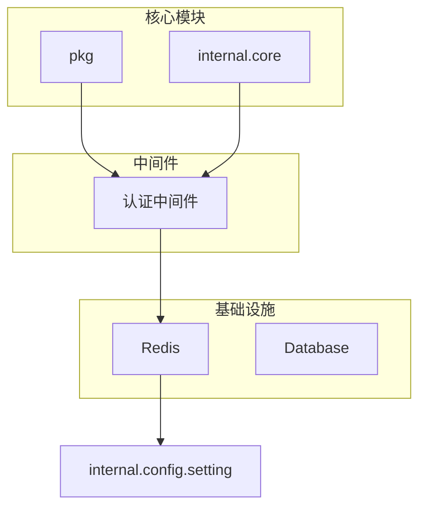
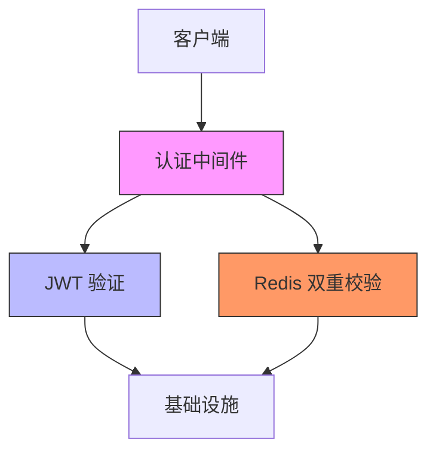
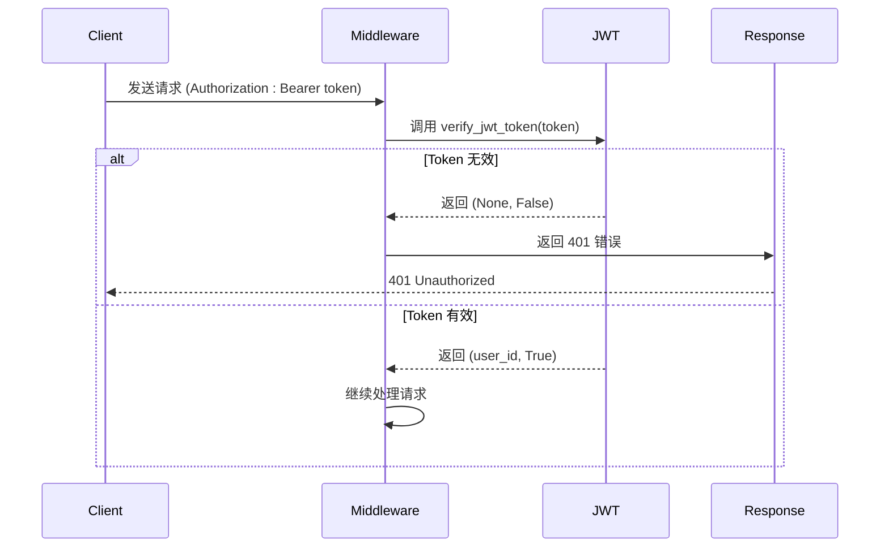
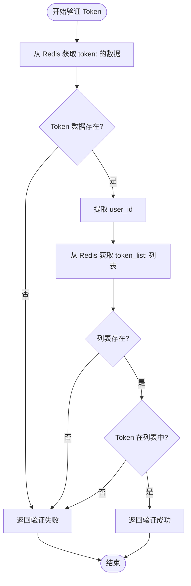
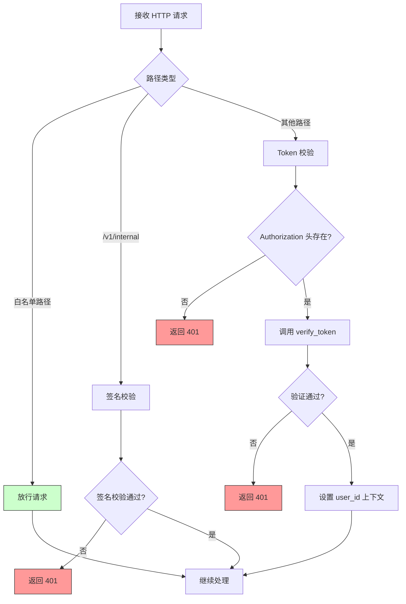
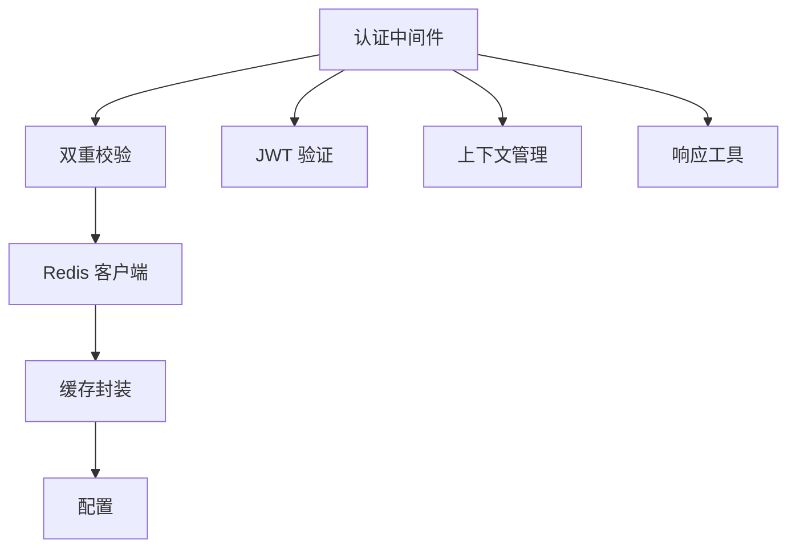

# JWT 认证与 Token 管理

<cite>
**本文档引用文件**  
- [jwt.py](file://pkg/jwt.py)
- [auth_token.py](file://internal/core/auth_token.py)
- [auth.py](file://internal/middleware/auth.py)
- [redis.py](file://internal/infra/redis.py)
- [cache.py](file://pkg/cache.py)
- [setting.py](file://internal/config/setting.py)
- [__init__.py](file://pkg/__init__.py)
</cite>

## 目录
1. [简介](#简介)
2. [项目结构](#项目结构)
3. [核心组件](#核心组件)
4. [架构概述](#架构概述)
5. [详细组件分析](#详细组件分析)
6. [依赖分析](#依赖分析)
7. [性能考虑](#性能考虑)
8. [故障排除指南](#故障排除指南)
9. [结论](#结论)

## 简介
本文档详细说明了 FastAPI 后端项目中的 JWT 认证机制，重点阐述了 JWT Token 的生成、验证与失效管理流程。文档分析了 `pkg.jwt` 模块中 `verify_jwt_token` 函数如何解析 Bearer Token 并校验签名和过期时间，以及 `internal.core.auth_token.verify_token` 如何结合 Redis 缓存进行双重校验。同时，文档描述了中间件 `internal.middleware.auth` 如何拦截请求并实现白名单路径放行策略，并提供了实际代码示例展示登录后 Token 存储、接口调用及登出时的 token 清理逻辑。

## 项目结构
本项目采用分层架构设计，将配置、核心逻辑、数据访问、服务层和控制器分离。认证相关的核心逻辑分布在 `pkg` 和 `internal.core` 模块中，中间件位于 `internal.middleware` 目录下，Redis 基础设施在 `internal.infra` 中实现。

**Diagram sources**
- [internal/middleware/auth.py](file://internal/middleware/auth.py#L1-L93)
- [internal/infra/redis.py](file://internal/infra/redis.py#L1-L86)

**Section sources**
- [internal/middleware/auth.py](file://internal/middleware/auth.py#L1-L93)
- [internal/infra/redis.py](file://internal/infra/redis.py#L1-L86)

## 核心组件
系统的核心认证组件包括 JWT 工具模块、Redis 缓存客户端、认证中间件和双重校验逻辑。`pkg.jwt` 模块负责 JWT Token 的基础生成与验证，`internal.core.auth_token` 实现了基于 Redis 的双重校验机制，而 `internal.middleware.auth` 作为入口点拦截所有 HTTP 请求并执行认证逻辑。

**Section sources**
- [pkg/jwt.py](file://pkg/jwt.py#L1-L39)
- [internal/core/auth_token.py](file://internal/core/auth_token.py#L1-L20)
- [internal/middleware/auth.py](file://internal/middleware/auth.py#L1-L93)

## 架构概述
系统的认证架构采用分层设计，从外到内依次为：请求拦截层（中间件）、JWT 解码层、Redis 双重校验层和基础设施层。这种设计实现了关注点分离，确保了认证逻辑的可维护性和可扩展性。

**Diagram sources**
- [internal/middleware/auth.py](file://internal/middleware/auth.py#L1-L93)
- [pkg/jwt.py](file://pkg/jwt.py#L1-L39)
- [internal/core/auth_token.py](file://internal/core/auth_token.py#L1-L20)

## 详细组件分析

### JWT 生成与验证分析
`pkg.jwt` 模块提供了 JWT Token 的生成和验证功能。`create_jwt_token` 函数根据用户信息生成带有过期时间的 JWT Token，而 `verify_jwt_token` 函数负责解析和验证 Bearer Token 的签名和有效期。

**Diagram sources**
- [pkg/jwt.py](file://pkg/jwt.py#L7-L38)

**Section sources**
- [pkg/jwt.py](file://pkg/jwt.py#L1-L39)

### Redis 双重校验分析
`internal.core.auth_token.verify_token` 函数实现了双重校验机制：首先通过 Redis 获取 Token 对应的用户数据，然后检查该 Token 是否存在于用户的 Token 列表中。这种设计支持主动登出功能，即使 JWT 尚未过期，只要从 Redis 列表中移除，该 Token 就会失效。

**Diagram sources**
- [internal/core/auth_token.py](file://internal/core/auth_token.py#L6-L19)
- [pkg/cache.py](file://pkg/cache.py#L22-L35)

**Section sources**
- [internal/core/auth_token.py](file://internal/core/auth_token.py#L1-L20)
- [pkg/cache.py](file://pkg/cache.py#L1-L280)

### 认证中间件分析
`internal.middleware.auth.ASGIAuthMiddleware` 是系统的主要认证入口，它拦截所有 HTTP 请求并根据路径执行不同的认证策略。中间件首先检查请求路径是否在白名单中，然后根据路径前缀选择相应的认证方式。

**Diagram sources**
- [internal/middleware/auth.py](file://internal/middleware/auth.py#L22-L93)

**Section sources**
- [internal/middleware/auth.py](file://internal/middleware/auth.py#L1-L93)

## 依赖分析
认证系统各组件之间存在明确的依赖关系。中间件依赖于核心认证逻辑，核心逻辑又依赖于 Redis 基础设施和 JWT 工具模块。这种分层依赖确保了系统的模块化和可测试性。

**Diagram sources**
- [internal/middleware/auth.py](file://internal/middleware/auth.py#L1-L93)
- [internal/core/auth_token.py](file://internal/core/auth_token.py#L1-L20)
- [internal/infra/redis.py](file://internal/infra/redis.py#L1-L86)

**Section sources**
- [internal/middleware/auth.py](file://internal/middleware/auth.py#L1-L93)
- [internal/core/auth_token.py](file://internal/core/auth_token.py#L1-L20)
- [internal/infra/redis.py](file://internal/infra/redis.py#L1-L86)

## 性能考虑
系统的认证机制在性能方面进行了多项优化。Redis 缓存的使用大大减少了数据库查询，Token 列表的长度限制（最多3个）防止了内存无限增长。同时，白名单路径的快速放行策略减少了不必要的认证开销。

- **缓存 TTL 设置**：Token 缓存默认设置为 10800 秒（3 小时），平衡了安全性和性能
- **Token 列表管理**：每个用户最多保存 3 个有效 Token，旧 Token 会被自动淘汰
- **白名单优化**：对文档、登录等公共路径进行快速放行，减少认证开销
- **连接池管理**：Redis 使用连接池，避免了频繁创建和销毁连接的开销

**Section sources**
- [pkg/cache.py](file://pkg/cache.py#L22-L53)
- [internal/infra/redis.py](file://internal/infra/redis.py#L17-L44)

## 故障排除指南
### 常见问题及解决方案
1. **Token 过期问题**：当用户遇到 401 错误时，应提示用户重新登录。建议实现刷新 Token 机制。
2. **Redis 连接失败**：检查 `setting.py` 中的 `redis_url` 配置是否正确，确保 Redis 服务正在运行。
3. **Token 无法登出**：确认 `cache_client.set_token_list` 和 `cache_client.delete_key` 方法被正确调用。
4. **签名校验失败**：检查 `/v1/internal` 接口的 `X-Signature`、`X-Timestamp` 和 `X-Nonce` 头部是否正确生成。

### 调试建议
- 启用详细的日志记录，监控 `verify_jwt_token` 和 `verify_token` 函数的执行情况
- 使用 Redis CLI 检查 `token:<token>` 和 `token_list:<user_id>` 键的存在和内容
- 在开发环境中使用 `/docs` 路径测试 API，该路径在白名单中无需认证

**Section sources**
- [pkg/jwt.py](file://pkg/jwt.py#L1-L39)
- [internal/core/auth_token.py](file://internal/core/auth_token.py#L1-L20)
- [internal/middleware/auth.py](file://internal/middleware/auth.py#L1-L93)

## 结论
本项目实现了一个安全、高效的 JWT 认证系统，通过结合 JWT 的无状态特性和 Redis 的有状态管理，既享受了 JWT 的性能优势，又实现了主动登出等传统会话管理功能。系统的分层架构和清晰的依赖关系使其易于维护和扩展。建议未来可以增加刷新 Token 机制，进一步提升用户体验。