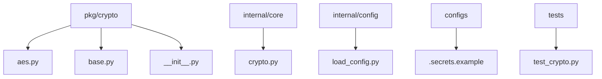
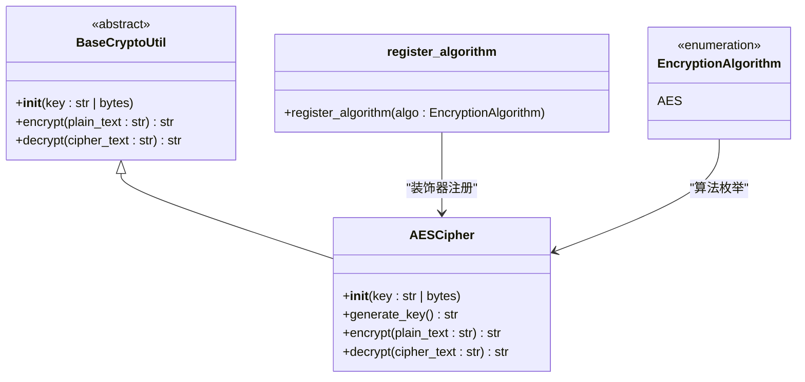
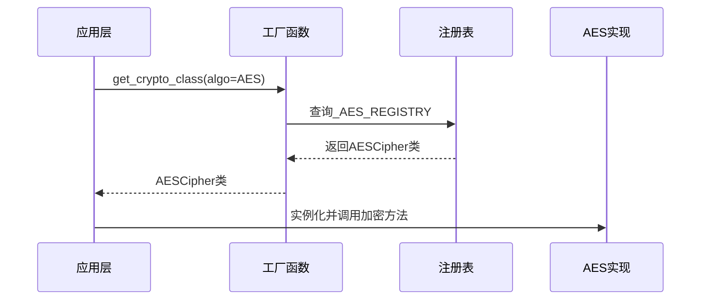
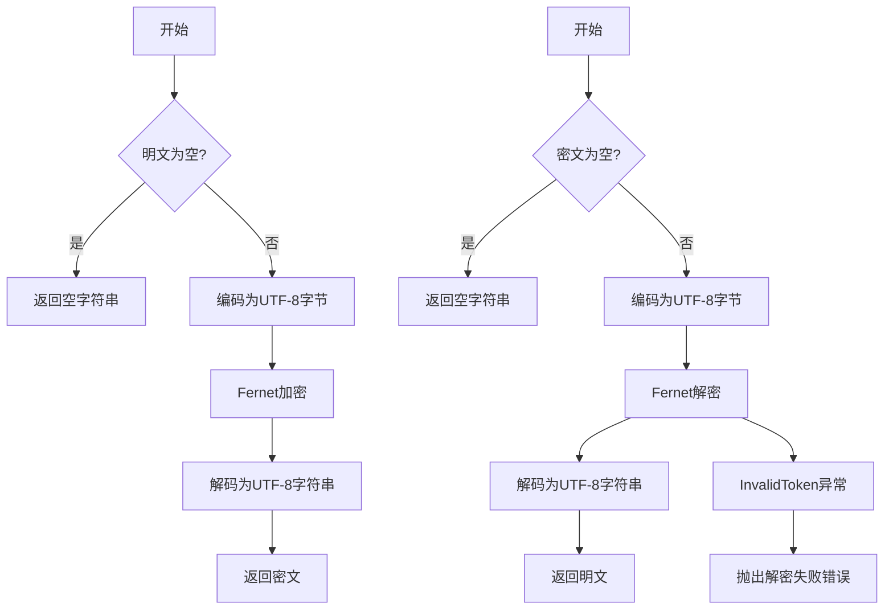
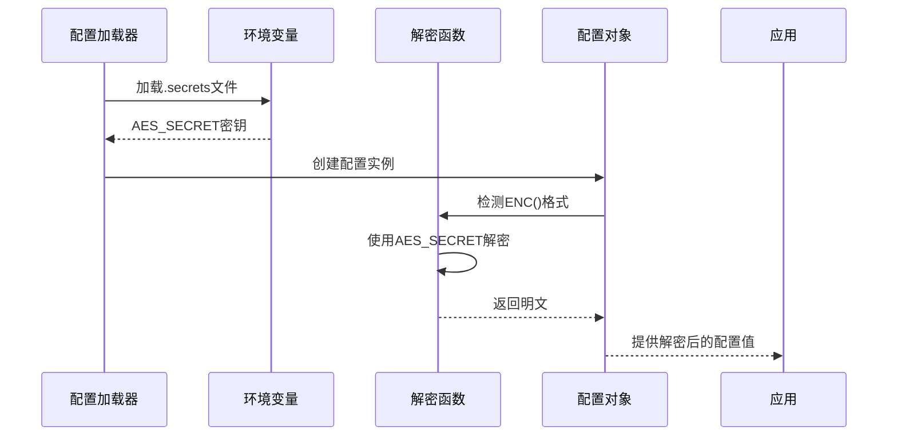
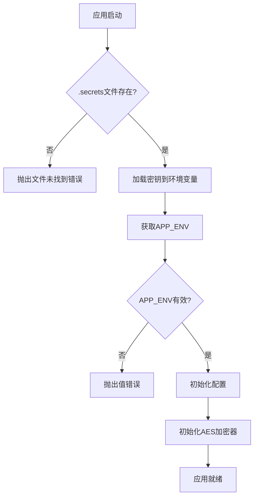
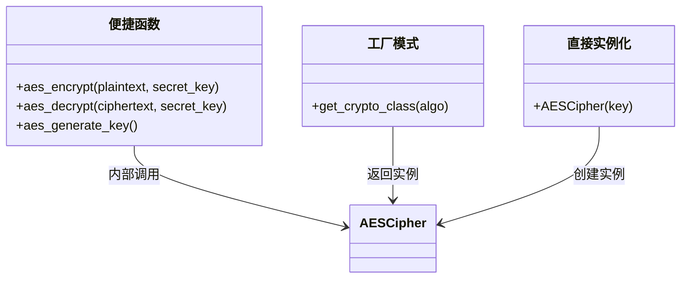
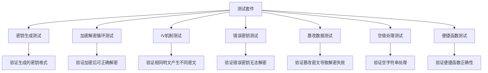

# 加密工具

<cite>
**本文档引用的文件**   
- [crypto.py](file://internal/core/crypto.py)
- [aes.py](file://pkg/crypto/aes.py)
- [base.py](file://pkg/crypto/base.py)
- [.secrets.example](file://configs/.secrets.example)
- [load_config.py](file://internal/config/load_config.py)
- [test_crypto.py](file://tests/test_crypto.py)
</cite>

## 目录
1. [项目结构](#项目结构)
2. [核心加密组件](#核心加密组件)
3. [加密架构与设计模式](#加密架构与设计模式)
4. [AES加密实现](#aes加密实现)
5. [配置文件中的加密支持](#配置文件中的加密支持)
6. [密钥管理与初始化](#密钥管理与初始化)
7. [加密工具的使用方法](#加密工具的使用方法)
8. [测试与验证](#测试与验证)

## 项目结构

该项目采用分层架构设计，加密相关功能主要分布在`pkg/crypto`和`internal/core`目录下。`pkg/crypto`包提供了通用的加密算法实现，而`internal/core`则负责与应用核心逻辑的集成。

**图示来源**
- [aes.py](file://pkg/crypto/aes.py)
- [base.py](file://pkg/crypto/base.py)
- [crypto.py](file://internal/core/crypto.py)
- [load_config.py](file://internal/config/load_config.py)
- [.secrets.example](file://configs/.secrets.example)
- [test_crypto.py](file://tests/test_crypto.py)

## 核心加密组件

系统中的加密功能由多个核心组件构成，形成了一个完整的加密解决方案。这些组件包括基础加密类、具体算法实现、工厂模式和便捷函数。

**图示来源**
- [base.py](file://pkg/crypto/base.py#L26-L38)
- [aes.py](file://pkg/crypto/aes.py#L7-L44)
- [base.py](file://pkg/crypto/base.py#L6-L8)

**本节来源**
- [base.py](file://pkg/crypto/base.py)
- [aes.py](file://pkg/crypto/aes.py)

## 加密架构与设计模式

系统采用了工厂模式和策略模式相结合的设计，通过注册表机制实现了加密算法的灵活扩展。这种设计允许在不修改现有代码的情况下添加新的加密算法。

**图示来源**
- [__init__.py](file://pkg/crypto/__init__.py#L23-L34)
- [base.py](file://pkg/crypto/base.py#L11-L23)
- [aes.py](file://pkg/crypto/aes.py#L6-L7)

**本节来源**
- [__init__.py](file://pkg/crypto/__init__.py)
- [base.py](file://pkg/crypto/base.py)

## AES加密实现

AES加密实现基于`cryptography`库的Fernet方案，提供了安全的对称加密功能。该实现具有自动密钥验证、空值处理和异常处理等特性。

**图示来源**
- [aes.py](file://pkg/crypto/aes.py#L30-L43)

**本节来源**
- [aes.py](file://pkg/crypto/aes.py)

## 配置文件中的加密支持

系统支持在配置文件中使用加密值，通过ENC()格式标记加密内容。配置加载器会自动识别并解密这些值，确保敏感信息的安全存储。

**图示来源**
- [load_config.py](file://internal/config/load_config.py#L129-L160)
- [.secrets.example](file://configs/.secrets.example)

**本节来源**
- [load_config.py](file://internal/config/load_config.py)
- [.secrets.example](file://configs/.secrets.example)

## 密钥管理与初始化

系统的密钥管理遵循安全最佳实践，密钥存储在独立的.secrets文件中，不纳入版本控制。应用启动时会自动加载密钥并初始化加密组件。

**图示来源**
- [load_config.py](file://internal/config/load_config.py#L17-L74)
- [crypto.py](file://internal/core/crypto.py#L6-L8)

**本节来源**
- [load_config.py](file://internal/config/load_config.py)
- [crypto.py](file://internal/core/crypto.py)

## 加密工具的使用方法

系统提供了多种方式使用加密功能，包括直接实例化、工厂函数和便捷函数。开发者可以根据具体场景选择最适合的使用方式。

**图示来源**
- [aes.py](file://pkg/crypto/aes.py#L46-L58)
- [__init__.py](file://pkg/crypto/__init__.py#L23-L34)
- [aes.py](file://pkg/crypto/aes.py#L13-L19)

**本节来源**
- [aes.py](file://pkg/crypto/aes.py)
- [__init__.py](file://pkg/crypto/__init__.py)

## 测试与验证

系统包含完整的加密功能测试套件，覆盖了加密解密循环、密钥验证、异常处理等多个方面，确保加密功能的正确性和可靠性。

**图示来源**
- [test_crypto.py](file://tests/test_crypto.py#L102-L211)

**本节来源**
- [test_crypto.py](file://tests/test_crypto.py)