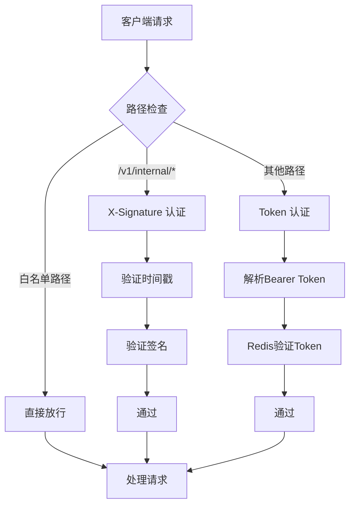
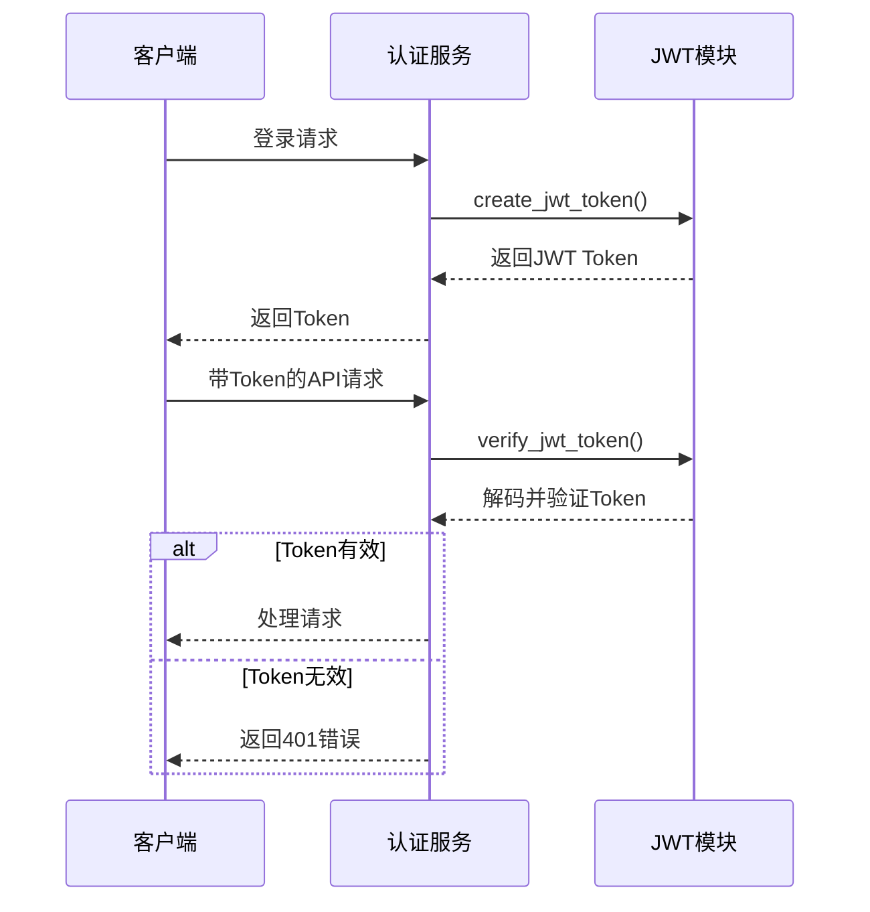
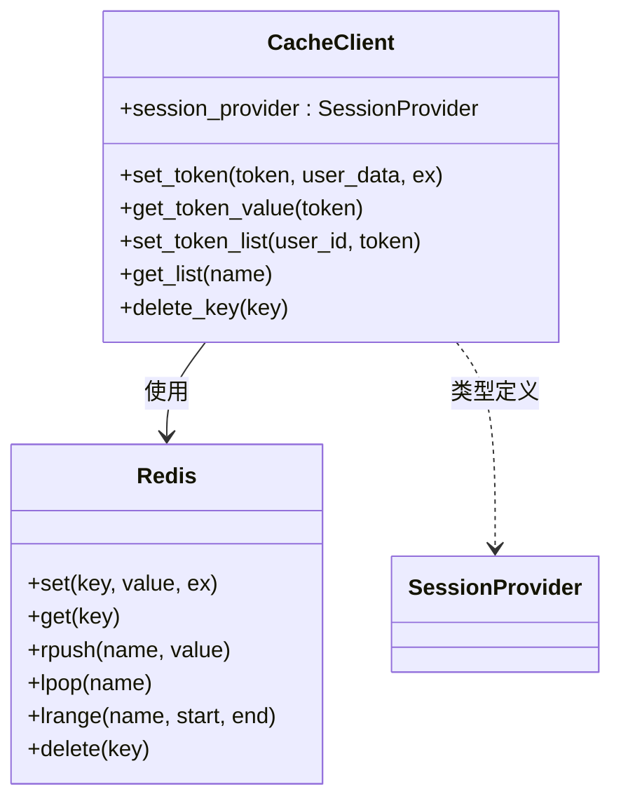
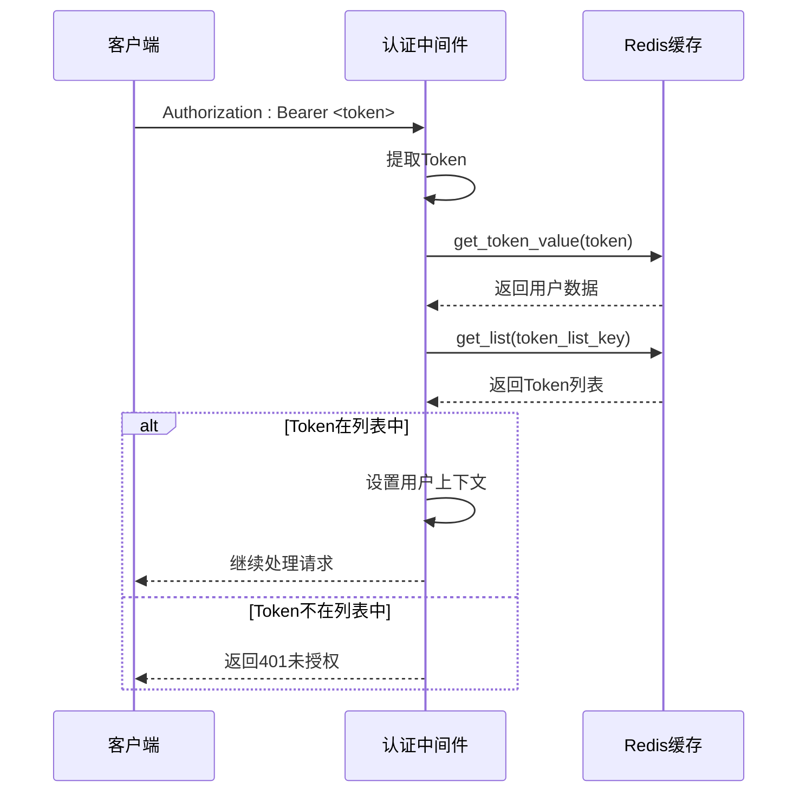
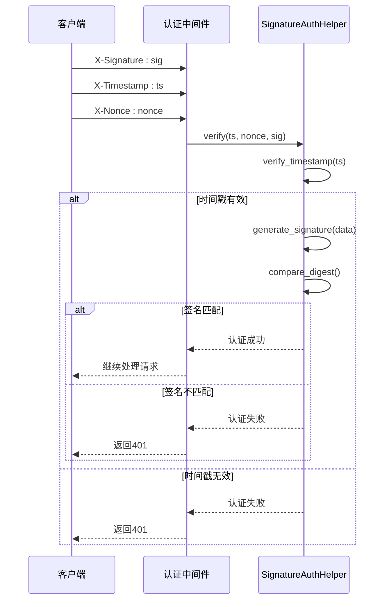
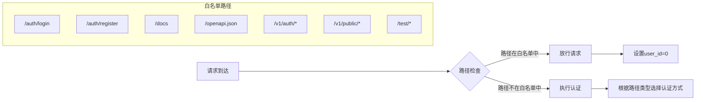

# 安全机制

<cite>
**本文档引用的文件**   
- [jwt.py](file://pkg/jwt.py)
- [auth_token.py](file://internal/core/auth_token.py)
- [bcrypt.py](file://pkg/bcrypt.py)
- [signature.py](file://pkg/signature.py)
- [auth.py](file://internal/middleware/auth.py)
- [redis.py](file://internal/infra/redis.py)
- [cache.py](file://pkg/cache.py)
- [setting.py](file://internal/config/setting.py)
- [.env.dev](file://configs/.env.dev)
- [.env.prod](file://configs/.env.prod)
</cite>

## 目录
1. [简介](#简介)
2. [认证与授权机制概述](#认证与授权机制概述)
3. [JWT Token 生成与验证](#jwt-token-生成与验证)
4. [基于 Redis 的 Token 管理](#基于-redis-的-token-管理)
5. [密码存储与哈希处理](#密码存储与哈希处理)
6. [双重认证机制](#双重认证机制)
7. [白名单路径放行策略](#白名单路径放行策略)
8. [安全最佳实践建议](#安全最佳实践建议)

## 简介
本项目采用多层次的安全机制来保障系统的安全性，包括基于 JWT 的 Token 认证、基于签名的防重放攻击机制、密码哈希存储以及 Redis 缓存支持的会话管理。系统通过中间件统一处理所有请求的认证流程，并根据接口类型应用不同的安全策略。

## 认证与授权机制概述
系统实现了两种主要的认证方式：基于 Bearer Token 的 JWT 认证用于普通 API 接口，以及基于时间戳、随机数和签名的 X-Signature 机制用于 internalapi 接口以防止重放攻击。同时，系统利用 Redis 缓存实现 Token 列表管理，支持主动登出和会话控制功能。



**图示来源**
- [auth.py](file://internal/middleware/auth.py#L11-L19)
- [signature.py](file://pkg/signature.py#L84-L101)
- [auth_token.py](file://internal/core/auth_token.py#L6-L19)

**本节来源**
- [auth.py](file://internal/middleware/auth.py#L1-L93)
- [signature.py](file://pkg/signature.py#L1-L102)

## JWT Token 生成与验证
系统使用 `pkg.jwt` 模块处理 JWT Token 的生成和验证。Token 包含用户名、用户ID和过期时间等信息，使用 HS256 算法进行签名。Token 的有效期由配置文件中的 `ACCESS_TOKEN_EXPIRE_MINUTES` 参数控制，默认为30分钟。



**图示来源**
- [jwt.py](file://pkg/jwt.py#L31-L38)
- [jwt.py](file://pkg/jwt.py#L7-L28)

**本节来源**
- [jwt.py](file://pkg/jwt.py#L1-L39)
- [setting.py](file://internal/config/setting.py#L35)

## 基于 Redis 的 Token 管理
系统通过 Redis 实现 Token 的主动管理和会话控制。每个用户的 Token 被存储在 Redis 中，并维护一个 Token 列表，最多保存3个有效 Token。当用户登出时，可以从列表中移除对应的 Token，实现主动失效。



**图示来源**
- [cache.py](file://pkg/cache.py#L18-L280)
- [redis.py](file://internal/infra/redis.py#L4-L86)

**本节来源**
- [cache.py](file://pkg/cache.py#L1-L280)
- [auth_token.py](file://internal/core/auth_token.py#L1-L20)
- [redis.py](file://internal/infra/redis.py#L1-L86)

## 密码存储与哈希处理
系统使用 bcrypt 算法对用户密码进行哈希处理，确保即使数据库泄露也无法直接获取明文密码。bcrypt 是一种自适应哈希函数，具有内置的盐值生成机制，能有效抵御彩虹表攻击。

```mermaid
flowchart TD
A[用户注册] --> B[输入密码]
B --> C[调用hash_password()]
C --> D[生成盐值]
D --> E[执行bcrypt哈希]
E --> F[存储哈希值到数据库]
G[用户登录] --> H[输入密码]
H --> I[从数据库获取哈希值]
I --> J[调用verify_password()]
J --> K{密码匹配?}
K --> |是| L[认证成功]
K --> |否| M[认证失败]
```

**图示来源**
- [bcrypt.py](file://pkg/bcrypt.py#L4-L19)

**本节来源**
- [bcrypt.py](file://pkg/bcrypt.py#L1-L20)
- [uv.lock](file://uv.lock#L92-L93)

## 双重认证机制
系统针对不同类型的接口采用不同的认证机制。普通 API 接口使用基于 Token 的 Bearer 认证，而 internalapi 接口则使用更严格的 X-Signature 机制，包含时间戳、随机数和签名三个要素，有效防止重放攻击。

### Bearer Token 认证流程


**图示来源**
- [auth.py](file://internal/middleware/auth.py#L60-L86)
- [auth_token.py](file://internal/core/auth_token.py#L6-L19)

### X-Signature 防重放认证流程


**图示来源**
- [auth.py](file://internal/middleware/auth.py#L43-L58)
- [signature.py](file://pkg/signature.py#L84-L101)

**本节来源**
- [auth.py](file://internal/middleware/auth.py#L1-L93)
- [signature.py](file://pkg/signature.py#L1-L102)

## 白名单路径放行策略
系统定义了一系列白名单路径，这些路径无需认证即可访问。主要包括登录注册接口、文档页面和其他公共接口。白名单通过集合数据结构存储，确保快速查询性能。



**图示来源**
- [auth.py](file://internal/middleware/auth.py#L11-L19)
- [auth.py](file://internal/middleware/auth.py#L34)

**本节来源**
- [auth.py](file://internal/middleware/auth.py#L1-L93)

## 安全最佳实践建议
### 密钥管理
- **环境变量管理**: 所有敏感密钥（如 `SECRET_KEY`）应通过环境变量配置，避免硬编码在代码中
- **环境隔离**: 不同环境（开发、测试、生产）应使用不同的密钥，如 `.env.dev` 和 `.env.prod` 文件所示
- **定期轮换**: 生产环境的密钥应定期更换，降低泄露风险

### Token 管理
- **合理设置过期时间**: 根据业务需求平衡安全性和用户体验，当前配置为30分钟
- **限制并发会话**: 通过 Redis Token 列表限制每个用户最多3个有效会话
- **主动登出机制**: 用户登出时应及时从 Redis 中清除 Token

### 防暴力破解
- **登录尝试限制**: 建议增加登录失败次数限制机制
- **验证码保护**: 对频繁失败的登录尝试可引入验证码验证
- **监控告警**: 记录异常登录行为并设置告警

### 其他建议
- **HTTPS 强制**: 生产环境应强制使用 HTTPS 加密传输
- **日志脱敏**: 记录日志时避免记录敏感信息如完整 Token 或密码
- **定期审计**: 定期审查安全配置和依赖库版本，及时更新已知漏洞

**本节来源**
- [setting.py](file://internal/config/setting.py#L13)
- [.env.dev](file://configs/.env.dev#L1)
- [.env.prod](file://configs/.env.prod#L13)
- [auth.py](file://internal/middleware/auth.py#L11-L19)