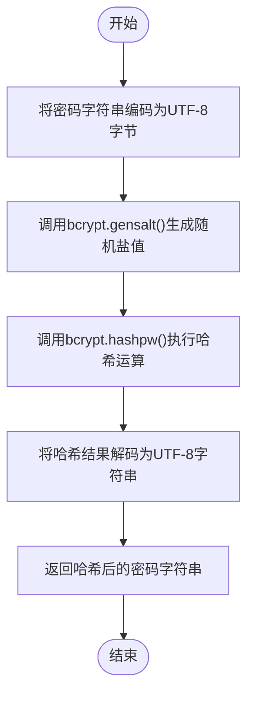
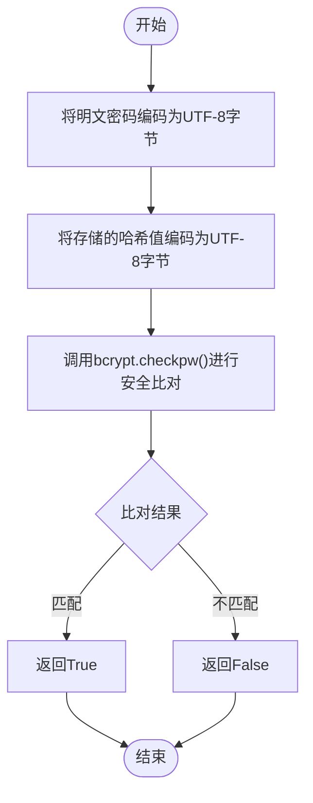
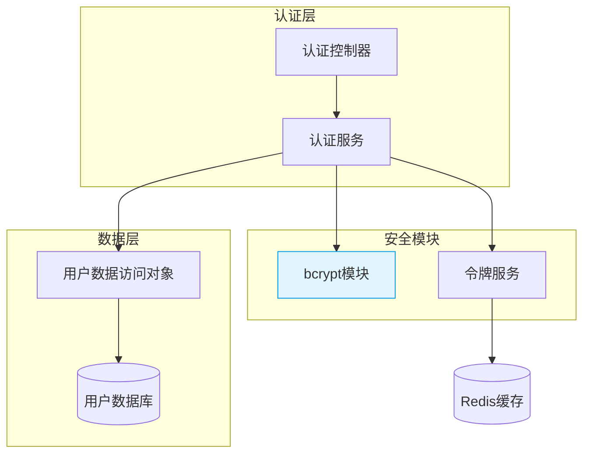
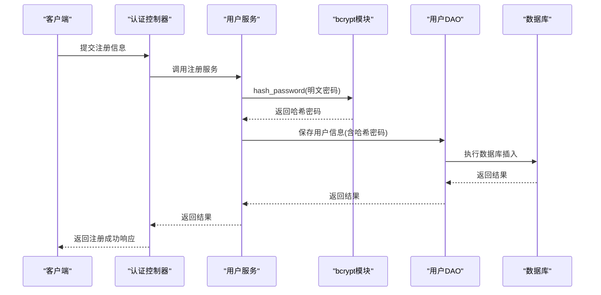
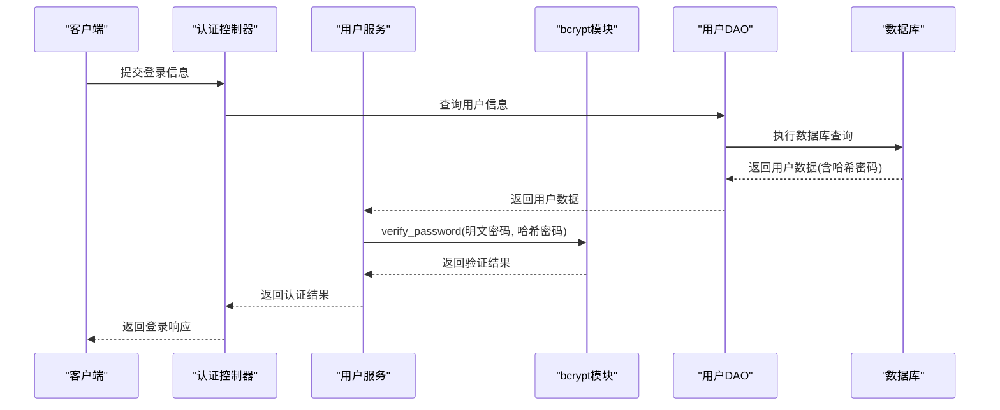

# 密码哈希与存储

<cite>
**本文档引用的文件**   
- [bcrypt.py](file://pkg/bcrypt.py)
- [user.py](file://internal/models/user.py)
- [dao/user.py](file://internal/dao/user.py)
- [auth.py](file://internal/middleware/auth.py)
- [auth_token.py](file://internal/core/auth_token.py)
- [app.py](file://internal/app.py)
</cite>

## 目录
1. [引言](#引言)
2. [密码哈希机制概述](#密码哈希机制概述)
3. [核心哈希函数分析](#核心哈希函数分析)
4. [系统架构与组件关系](#系统架构与组件关系)
5. [用户认证流程](#用户认证流程)
6. [安全最佳实践](#安全最佳实践)
7. [结论](#结论)

## 引言
本文档详细阐述了 FastAPI 后端系统中密码安全存储的实现机制。系统采用业界标准的 bcrypt 算法对用户密码进行哈希处理，确保敏感信息在存储和验证过程中的安全性。文档将深入分析密码哈希函数的实现原理、调用流程以及系统整体的认证架构，为开发人员提供全面的安全实践指导。

## 密码哈希机制概述
本系统通过 `pkg.bcrypt` 模块实现了基于 bcrypt 算法的密码安全存储方案。bcrypt 是一种专门为密码哈希设计的自适应哈希函数，具有以下核心优势：

- **盐值自动生成**：每次哈希操作都会生成唯一的随机盐值，确保相同密码产生不同的哈希结果
- **计算强度可调**：通过 work factor（轮数）控制哈希计算的复杂度，抵御暴力破解攻击
- **抗彩虹表攻击**：内置盐值机制有效防止预计算攻击
- **广泛验证**：经过长期安全验证，被广泛应用于各类安全系统

系统在用户注册时对明文密码进行哈希处理并存储，在用户登录时通过安全比对机制验证密码正确性，整个过程不涉及明文密码的存储或传输。

**Section sources**
- [bcrypt.py](file://pkg/bcrypt.py#L1-L19)

## 核心哈希函数分析
系统在 `pkg/bcrypt.py` 模块中实现了两个核心密码处理函数：`hash_password` 和 `verify_password`。

### 密码哈希函数 (hash_password)
该函数负责在用户注册或修改密码时对明文密码进行安全哈希处理。

**Diagram sources**
- [bcrypt.py](file://pkg/bcrypt.py#L4-L12)

### 密码验证函数 (verify_password)
该函数在用户登录时用于安全地比对用户输入的明文密码与数据库中存储的哈希值。

**Diagram sources**
- [bcrypt.py](file://pkg/bcrypt.py#L15-L19)

**Section sources**
- [bcrypt.py](file://pkg/bcrypt.py#L4-L19)

## 系统架构与组件关系
系统采用分层架构设计，密码处理功能与其他组件协同工作，形成完整的用户认证体系。

**Diagram sources**
- [bcrypt.py](file://pkg/bcrypt.py)
- [dao/user.py](file://internal/dao/user.py)
- [auth_token.py](file://internal/core/auth_token.py)

**Section sources**
- [app.py](file://internal/app.py)
- [auth.py](file://internal/middleware/auth.py)

## 用户认证流程
系统的用户认证流程涉及多个组件的协同工作，确保从请求到验证的每个环节都符合安全标准。

### 用户注册流程

**Diagram sources**
- [bcrypt.py](file://pkg/bcrypt.py#L4-L12)
- [dao/user.py](file://internal/dao/user.py)

### 用户登录验证流程

**Diagram sources**
- [bcrypt.py](file://pkg/bcrypt.py#L15-L19)
- [dao/user.py](file://internal/dao/user.py)

## 安全最佳实践
基于系统实现和行业标准，以下是密码安全存储的最佳实践建议：

### 配置建议
- **工作因子（Work Factor）**：建议设置为 10-12 之间，在安全性和性能间取得平衡
- **算法更新策略**：定期评估 bcrypt 的安全性，必要时迁移至更先进的算法
- **密码策略**：强制要求用户使用强密码（最小长度、复杂度要求）

### 运行时安全
- **禁止明文日志记录**：确保密码、哈希值等敏感信息不会被记录到日志中
- **防止高频尝试攻击**：实现账户锁定或延迟机制，限制连续失败登录尝试
- **传输安全**：始终通过 HTTPS 传输认证数据，防止中间人攻击
- **定期安全审计**：定期审查认证代码和配置，及时发现潜在漏洞

### 系统级防护
- **多因素认证**：对于敏感操作，考虑引入多因素认证机制
- **会话管理**：实现安全的会话管理，包括令牌过期、刷新和撤销机制
- **监控与告警**：监控异常登录行为，及时发现潜在的安全威胁

**Section sources**
- [bcrypt.py](file://pkg/bcrypt.py)
- [auth.py](file://internal/middleware/auth.py)
- [auth_token.py](file://internal/core/auth_token.py)

## 结论
本系统通过 bcrypt 算法实现了安全的密码存储机制，有效保护了用户凭证的安全。`pkg.bcrypt` 模块提供的 `hash_password` 和 `verify_password` 函数构成了密码安全的核心，结合分层架构设计，确保了从用户注册到登录验证的全流程安全。建议持续关注密码学领域的最新发展，定期评估和升级系统的安全防护措施，以应对不断演变的安全威胁。