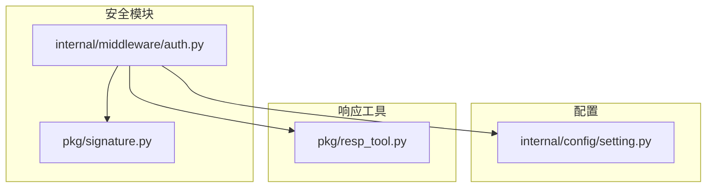
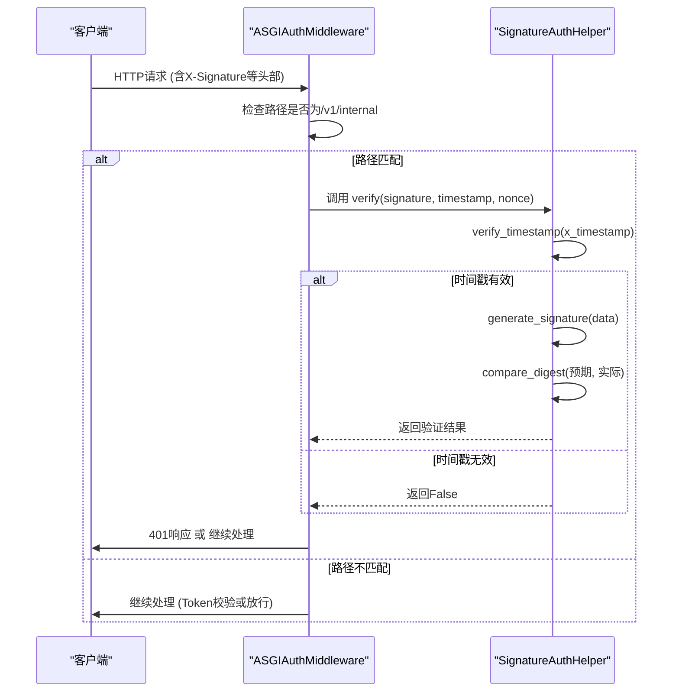
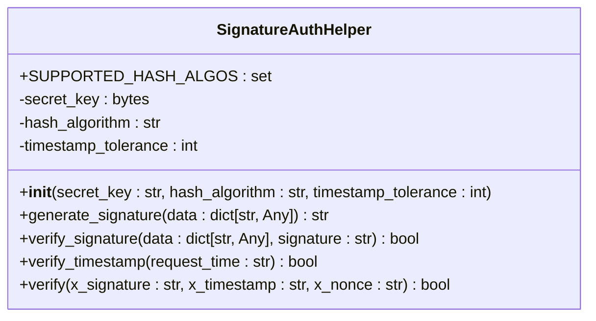
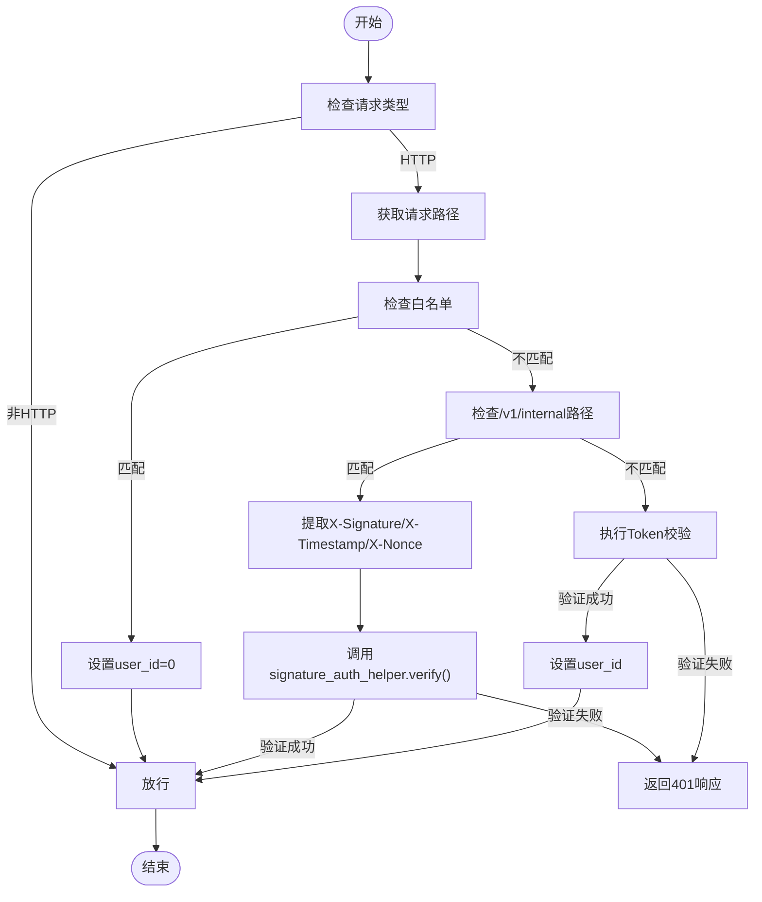
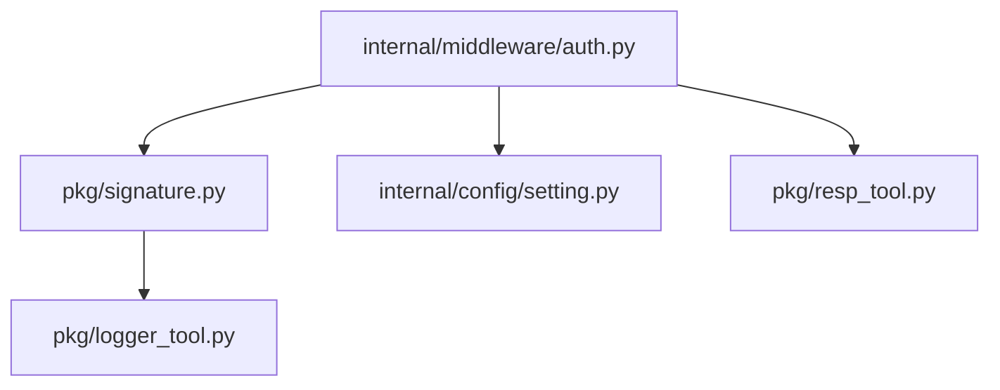

# 接口签名认证（X-Signature）

<cite>
**本文档引用的文件**
- [signature.py](file://pkg/signature.py)
- [auth.py](file://internal/middleware/auth.py)
- [setting.py](file://internal/config/setting.py)
- [resp_tool.py](file://pkg/resp_tool.py)
</cite>

## 目录
1. [简介](#简介)
2. [项目结构](#项目结构)
3. [核心组件](#核心组件)
4. [架构概述](#架构概述)
5. [详细组件分析](#详细组件分析)
6. [依赖分析](#依赖分析)
7. [性能考虑](#性能考虑)
8. [故障排除指南](#故障排除指南)
9. [结论](#结论)

## 简介
本文档深入解析了 FastAPI 后端项目中用于保障 internalapi 接口安全性的 X-Signature 机制。该机制通过时间戳、随机数（nonce）和密钥生成请求签名，有效防止重放攻击。文档详细说明了 `pkg.signature` 模块如何实现签名算法，包括参数排序、拼接、HMAC-SHA256 加密与 Base64 编码，并描述了 `internal.middleware.auth` 中的验证逻辑，包括时间窗口检查与 nonce 去重。同时提供客户端生成签名的示例和常见错误排查方法。

## 项目结构
项目采用分层架构，核心安全逻辑位于 `pkg` 和 `internal/middleware` 目录下。`pkg/signature.py` 负责签名的生成与验证，`internal/middleware/auth.py` 负责在请求处理流程中执行签名校验。

**Diagram sources**
- [signature.py](file://pkg/signature.py)
- [auth.py](file://internal/middleware/auth.py)
- [setting.py](file://internal/config/setting.py)
- [resp_tool.py](file://pkg/resp_tool.py)

**Section sources**
- [signature.py](file://pkg/signature.py)
- [auth.py](file://internal/middleware/auth.py)

## 核心组件
本系统的核心安全组件是 `SignatureAuthHelper` 类，它实现了基于 HMAC 的请求签名机制。该类被实例化为全局变量 `signature_auth_helper`，并在认证中间件中被调用以验证 incoming 请求。

**Section sources**
- [signature.py](file://pkg/signature.py#L9-L102)

## 架构概述
系统的认证流程遵循一个清晰的顺序：首先检查请求路径是否在白名单中，然后根据路径前缀决定使用签名校验还是 Token 校验。对于 `/v1/internal` 路径，系统会提取 `X-Signature`、`X-Timestamp` 和 `X-Nonce` 头部，并调用 `signature_auth_helper` 进行验证。

**Diagram sources**
- [auth.py](file://internal/middleware/auth.py#L44-L55)
- [signature.py](file://pkg/signature.py#L84-L101)

## 详细组件分析

### 签名生成与验证分析
`SignatureAuthHelper` 类是实现安全性的核心。

#### 类结构与方法

**Diagram sources**
- [signature.py](file://pkg/signature.py#L9-L102)

**Section sources**
- [signature.py](file://pkg/signature.py#L9-L102)

### 认证中间件分析
`ASGIAuthMiddleware` 负责拦截请求并执行相应的认证逻辑。

#### 请求处理流程

**Diagram sources**
- [auth.py](file://internal/middleware/auth.py#L22-L92)

**Section sources**
- [auth.py](file://internal/middleware/auth.py#L22-L92)

## 依赖分析
系统依赖关系清晰，`auth` 中间件依赖 `signature` 模块进行核心验证，同时依赖 `setting` 获取配置和 `resp_tool` 生成响应。

**Diagram sources**
- [auth.py](file://internal/middleware/auth.py#L4-L8)
- [signature.py](file://pkg/signature.py#L6)

**Section sources**
- [auth.py](file://internal/middleware/auth.py)
- [signature.py](file://pkg/signature.py)

## 性能考虑
签名验证是一个计算密集型操作，但 HMAC-SHA256 在现代硬件上性能良好。主要性能开销在于字符串处理和排序。建议将 `timestamp_tolerance` 设置为合理值（如300秒），以平衡安全性和时钟同步要求。避免在高频率接口上使用过于复杂的签名逻辑。

## 故障排除指南
当遇到签名认证失败时，应按以下步骤排查：

**Section sources**
- [auth.py](file://internal/middleware/auth.py#L50-L52)
- [signature.py](file://pkg/signature.py#L75-L77)

### 常见错误场景
| 错误场景 | 可能原因 | 排查路径 |
| :--- | :--- | :--- |
| `signature_auth failed` | 签名不匹配 | 检查客户端签名算法是否与服务端一致，确认密钥正确 |
| `Timestamp not in tolerance` | 时钟偏移过大 | 检查客户端和服务端系统时间，确保NTP同步 |
| `get empty token from Authorization` | Token缺失 | 检查请求头部，确认Authorization字段存在 |
| `verify_signature error` | 数据处理异常 | 检查日志中的具体错误信息，确认输入数据格式 |

### 调试技巧
1. **启用详细日志**：确保 `pkg.logger_tool` 记录了足够的调试信息。
2. **比对签名字符串**：在客户端和服务端分别打印出用于生成签名的 `message` 字符串，确保完全一致。
3. **使用固定值测试**：在开发环境中，使用固定的 `timestamp` 和 `nonce` 进行测试，排除随机性干扰。

## 结论
该项目的 X-Signature 机制设计合理，通过 `pkg.signature` 模块和 `internal.middleware.auth` 中间件的协同工作，有效保障了 internalapi 接口的安全性。该机制通过时间戳和 nonce 防止重放攻击，并通过 HMAC-SHA256 确保请求的完整性和来源可信。建议定期轮换密钥并结合请求频率限制，以进一步增强系统安全性。