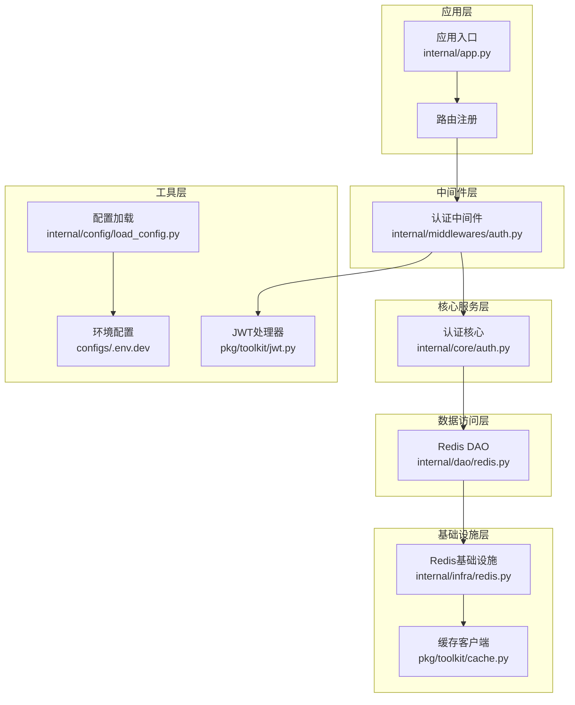
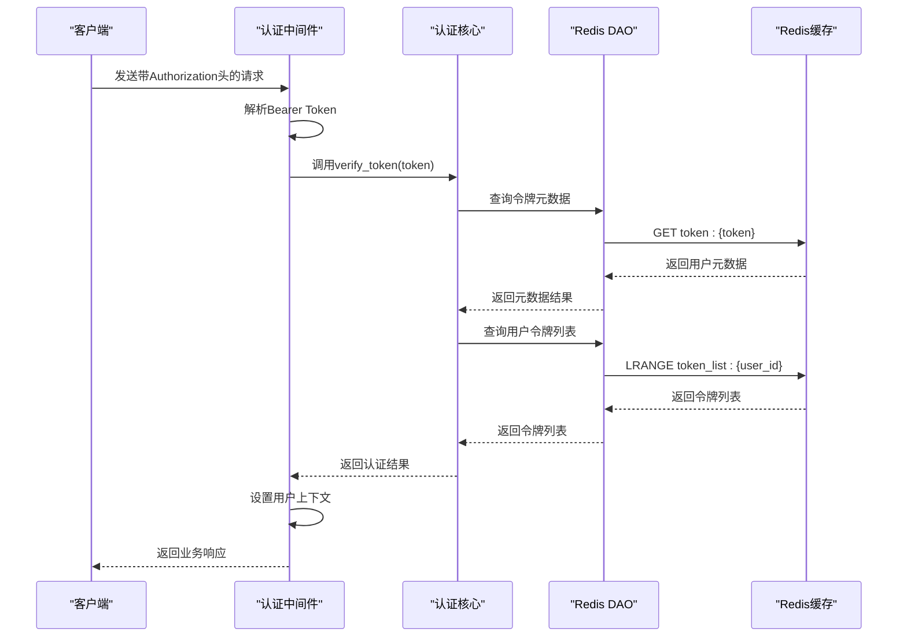
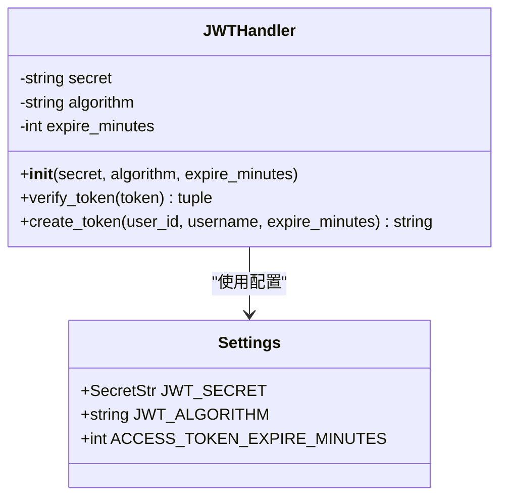
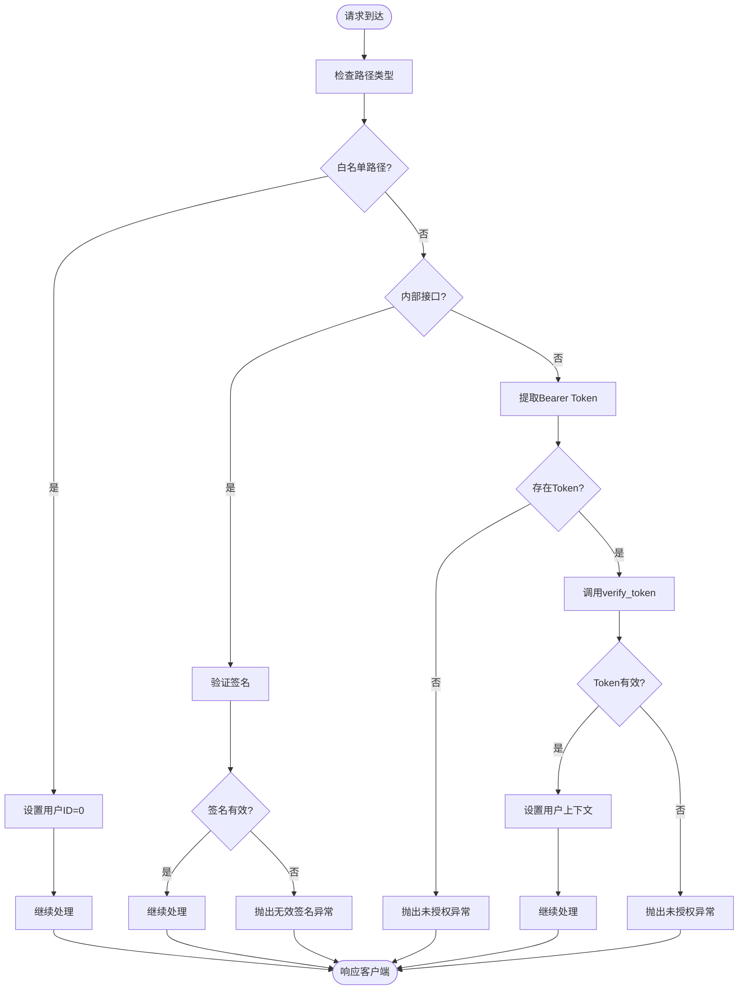
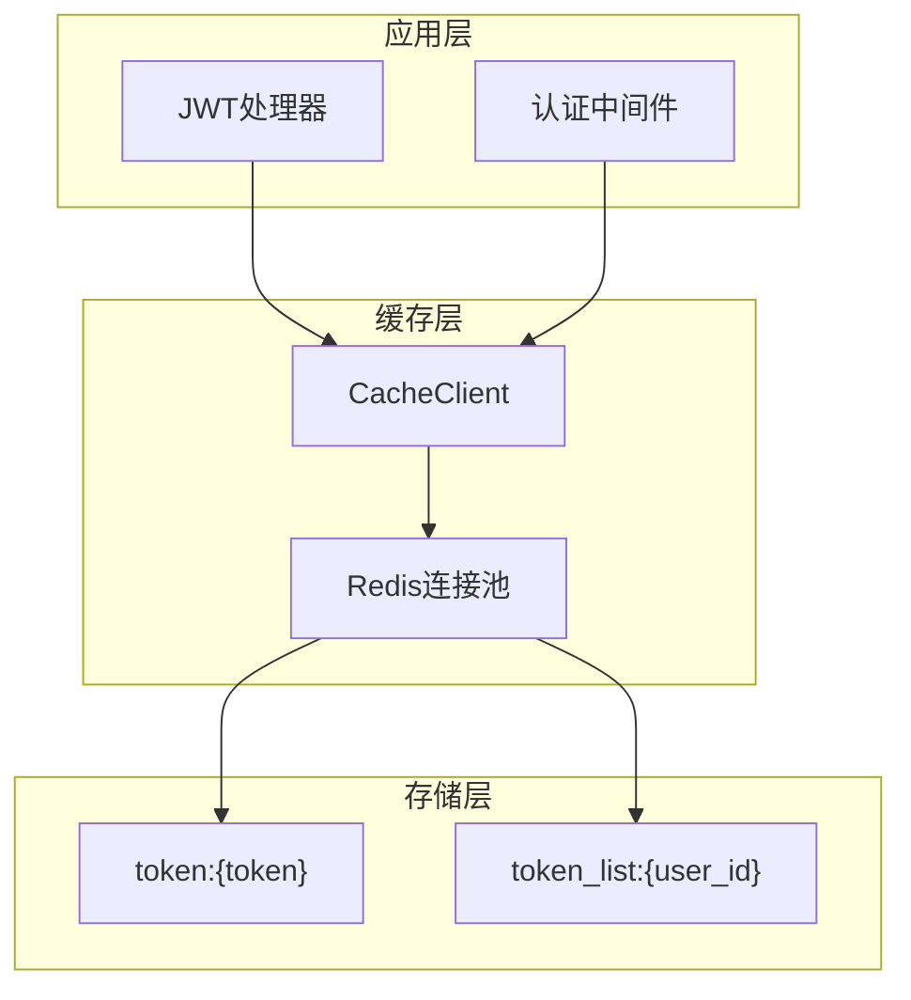
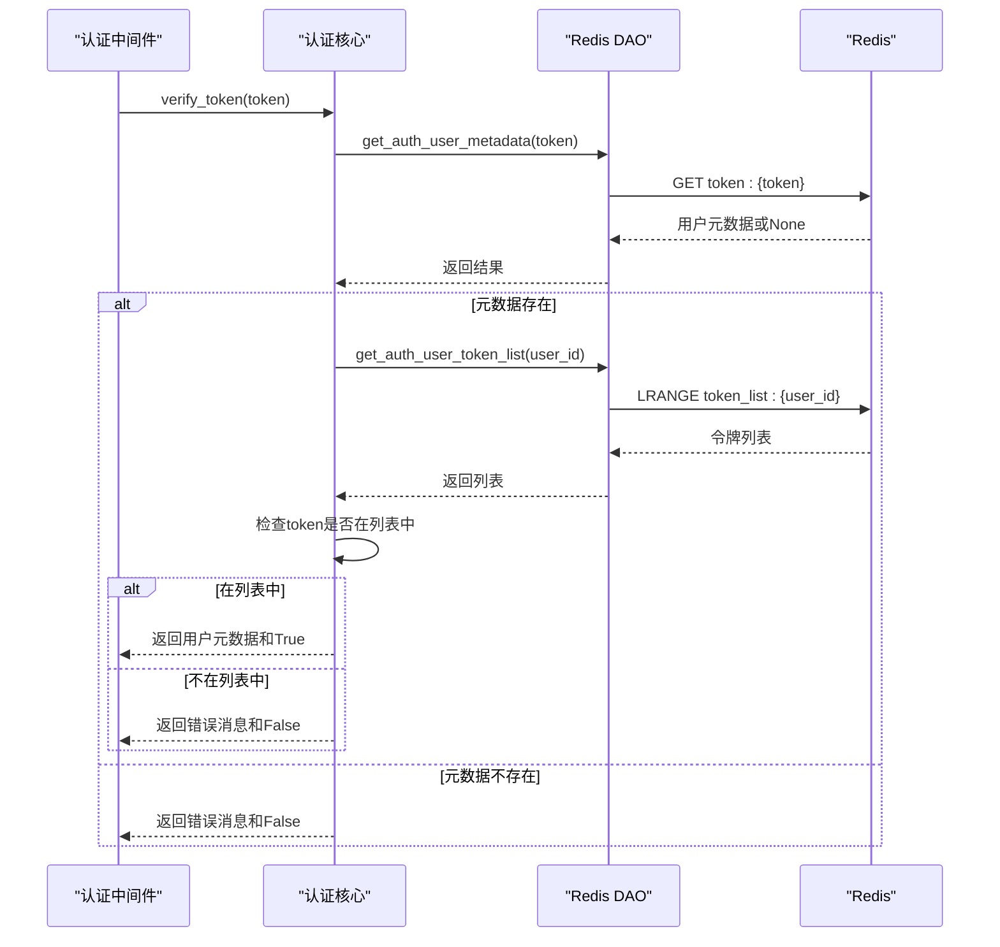
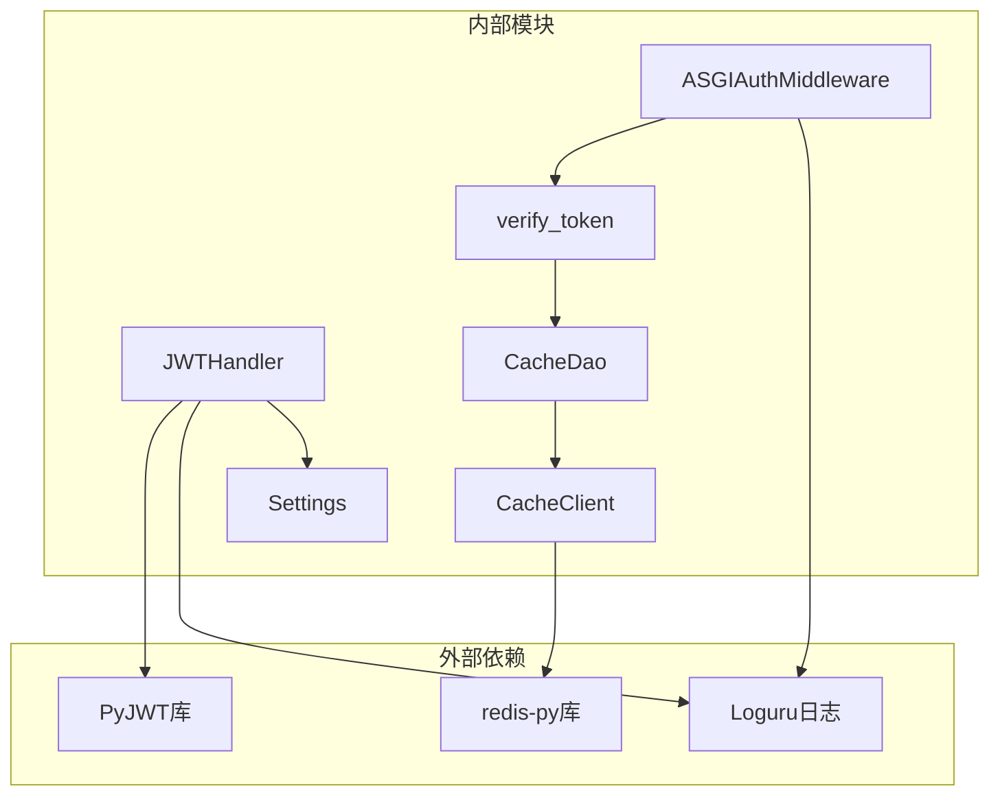

# JWT Token认证

<cite>
**本文档引用的文件**
- [pkg/toolkit/jwt.py](file://pkg/toolkit/jwt.py)
- [internal/middlewares/auth.py](file://internal/middlewares/auth.py)
- [internal/core/auth.py](file://internal/core/auth.py)
- [internal/dao/redis.py](file://internal/dao/redis.py)
- [internal/infra/redis.py](file://internal/infra/redis.py)
- [pkg/toolkit/cache.py](file://pkg/toolkit/cache.py)
- [internal/config/load_config.py](file://internal/config/load_config.py)
- [configs/.env.dev](file://configs/.env.dev)
- [tests/toolkit/test_jwt.py](file://tests/toolkit/test_jwt.py)
- [internal/app.py](file://internal/app.py)
</cite>

## 目录
1. [简介](#简介)
2. [项目结构](#项目结构)
3. [核心组件](#核心组件)
4. [架构概览](#架构概览)
5. [详细组件分析](#详细组件分析)
6. [依赖关系分析](#依赖关系分析)
7. [性能考虑](#性能考虑)
8. [故障排除指南](#故障排除指南)
9. [结论](#结论)

## 简介
本文件详细说明了FastAPI后端项目中的JWT Token认证实现。内容涵盖JWT令牌的生成、验证和刷新机制，文档化令牌结构、签名算法和有效期管理，包含用户身份验证流程、令牌存储和撤销机制，提供JWT配置选项、密钥管理和安全参数设置，展示具体的JWT实现代码示例和使用方法，解释与Redis缓存系统的集成关系，包含令牌过期处理、刷新策略和安全最佳实践，并解决常见的JWT安全问题和解决方案。

## 项目结构
该项目采用分层架构，JWT认证相关的核心代码分布在以下模块：
- pkg/toolkit/jwt.py：JWT处理器，负责令牌的生成和验证
- internal/middlewares/auth.py：ASGI认证中间件，拦截HTTP请求进行认证
- internal/core/auth.py：认证核心逻辑，结合Redis进行令牌校验
- internal/dao/redis.py：Redis数据访问对象，提供令牌元数据和令牌列表查询
- internal/infra/redis.py：Redis基础设施，提供连接池和缓存客户端
- pkg/toolkit/cache.py：通用缓存客户端，封装Redis操作
- internal/config/load_config.py：配置加载，提供JWT密钥、算法和过期时间等配置
- configs/.env.dev：环境配置文件，包含JWT相关配置项
- tests/toolkit/test_jwt.py：JWT功能测试，验证令牌生成和验证行为
- internal/app.py：应用入口，注册中间件和路由

**图表来源**
- [internal/app.py](file://internal/app.py#L55-L82)
- [internal/middlewares/auth.py](file://internal/middlewares/auth.py#L88-L150)
- [internal/core/auth.py](file://internal/core/auth.py#L5-L19)
- [internal/dao/redis.py](file://internal/dao/redis.py#L6-L37)
- [internal/infra/redis.py](file://internal/infra/redis.py#L18-L98)
- [pkg/toolkit/cache.py](file://pkg/toolkit/cache.py#L41-L249)
- [pkg/toolkit/jwt.py](file://pkg/toolkit/jwt.py#L7-L58)
- [internal/config/load_config.py](file://internal/config/load_config.py#L46-L84)
- [configs/.env.dev](file://configs/.env.dev#L1-L20)

**章节来源**
- [internal/app.py](file://internal/app.py#L55-L82)
- [internal/middlewares/auth.py](file://internal/middlewares/auth.py#L88-L150)
- [internal/core/auth.py](file://internal/core/auth.py#L5-L19)
- [internal/dao/redis.py](file://internal/dao/redis.py#L6-L37)
- [internal/infra/redis.py](file://internal/infra/redis.py#L18-L98)
- [pkg/toolkit/cache.py](file://pkg/toolkit/cache.py#L41-L249)
- [pkg/toolkit/jwt.py](file://pkg/toolkit/jwt.py#L7-L58)
- [internal/config/load_config.py](file://internal/config/load_config.py#L46-L84)
- [configs/.env.dev](file://configs/.env.dev#L1-L20)

## 核心组件
本节深入分析JWT认证系统的关键组件及其职责：

### JWT处理器 (JWTHandler)
JWT处理器是认证系统的核心，负责：
- 令牌生成：创建包含用户标识和过期时间的JWT
- 令牌验证：解析并验证JWT的有效性
- 配置管理：支持自定义签名算法和过期时间

主要特性：
- 支持HS256签名算法
- 可配置的过期时间（分钟）
- 自动处理UTC时间戳
- 完整的错误处理机制

**章节来源**
- [pkg/toolkit/jwt.py](file://pkg/toolkit/jwt.py#L7-L58)

### 认证中间件 (ASGIAuthMiddleware)
认证中间件拦截所有HTTP请求，执行以下流程：
- 白名单路径放行（无需认证）
- 内部接口签名验证
- 用户令牌验证和上下文设置

关键功能：
- 路径匹配和白名单管理
- Bearer Token提取和验证
- 用户上下文注入
- 统一异常处理

**章节来源**
- [internal/middlewares/auth.py](file://internal/middlewares/auth.py#L88-L150)

### 认证核心 (verify_token)
认证核心逻辑结合Redis进行令牌验证：
- 令牌元数据查询
- 用户令牌列表校验
- 完整的错误处理和日志记录

**章节来源**
- [internal/core/auth.py](file://internal/core/auth.py#L5-L19)

### Redis数据访问对象 (CacheDao)
Redis DAO提供以下功能：
- 令牌元数据存储和查询
- 用户令牌列表管理
- 键命名规范定义

**章节来源**
- [internal/dao/redis.py](file://internal/dao/redis.py#L6-L37)

## 架构概览
JWT认证系统采用分层架构设计，实现了完整的令牌生命周期管理：

**图表来源**
- [internal/middlewares/auth.py](file://internal/middlewares/auth.py#L132-L149)
- [internal/core/auth.py](file://internal/core/auth.py#L5-L19)
- [internal/dao/redis.py](file://internal/dao/redis.py#L19-L33)
- [internal/infra/redis.py](file://internal/infra/redis.py#L70-L84)

## 详细组件分析

### JWT处理器类图

**图表来源**
- [pkg/toolkit/jwt.py](file://pkg/toolkit/jwt.py#L7-L58)
- [internal/config/load_config.py](file://internal/config/load_config.py#L55-L59)

**章节来源**
- [pkg/toolkit/jwt.py](file://pkg/toolkit/jwt.py#L7-L58)
- [internal/config/load_config.py](file://internal/config/load_config.py#L55-L59)

### 认证中间件流程图

**图表来源**
- [internal/middlewares/auth.py](file://internal/middlewares/auth.py#L92-L149)

**章节来源**
- [internal/middlewares/auth.py](file://internal/middlewares/auth.py#L92-L149)

### Redis集成架构

**图表来源**
- [pkg/toolkit/cache.py](file://pkg/toolkit/cache.py#L41-L123)
- [internal/dao/redis.py](file://internal/dao/redis.py#L12-L17)
- [internal/infra/redis.py](file://internal/infra/redis.py#L18-L45)

**章节来源**
- [pkg/toolkit/cache.py](file://pkg/toolkit/cache.py#L41-L123)
- [internal/dao/redis.py](file://internal/dao/redis.py#L12-L17)
- [internal/infra/redis.py](file://internal/infra/redis.py#L18-L45)

### 令牌验证流程

**图表来源**
- [internal/core/auth.py](file://internal/core/auth.py#L5-L19)
- [internal/dao/redis.py](file://internal/dao/redis.py#L19-L33)

**章节来源**
- [internal/core/auth.py](file://internal/core/auth.py#L5-L19)
- [internal/dao/redis.py](file://internal/dao/redis.py#L19-L33)

## 依赖关系分析
JWT认证系统的依赖关系清晰，遵循单一职责原则：

**图表来源**
- [pkg/toolkit/jwt.py](file://pkg/toolkit/jwt.py#L3-L4)
- [internal/infra/redis.py](file://internal/infra/redis.py#L4)
- [pkg/toolkit/cache.py](file://pkg/toolkit/cache.py#L9)

**章节来源**
- [pkg/toolkit/jwt.py](file://pkg/toolkit/jwt.py#L3-L4)
- [internal/infra/redis.py](file://internal/infra/redis.py#L4)
- [pkg/toolkit/cache.py](file://pkg/toolkit/cache.py#L9)

## 性能考虑
基于代码分析，JWT认证系统在性能方面具有以下特点：

### Redis连接优化
- 使用连接池避免频繁建立连接
- 异步操作减少阻塞
- 批量操作支持（列表操作）

### 缓存策略
- 令牌元数据缓存：token:{token}
- 用户令牌列表缓存：token_list:{user_id}
- TTL设置支持（可通过CacheClient扩展）

### 并发处理
- 异步中间件设计
- 非阻塞Redis操作
- 连接复用机制

## 故障排除指南
常见JWT认证问题及解决方案：

### 令牌验证失败
**问题症状**：返回"invalid or missing token"错误
**可能原因**：
- 缺少Authorization头
- Token格式不正确（缺少Bearer前缀）
- Token已过期
- 签名验证失败

**排查步骤**：
1. 检查请求头是否包含Authorization字段
2. 确认Token格式为"Bearer {token}"
3. 验证Token是否在Redis中存在
4. 检查用户令牌列表中是否包含该Token

**章节来源**
- [internal/middlewares/auth.py](file://internal/middlewares/auth.py#L136-L142)
- [internal/core/auth.py](file://internal/core/auth.py#L7-L17)

### Redis连接问题
**问题症状**：Redis操作失败或连接超时
**可能原因**：
- Redis服务器不可达
- 连接池配置不当
- 密码认证失败

**解决方案**：
1. 检查Redis服务器状态
2. 验证连接URL配置
3. 确认密码和端口设置
4. 查看连接池最大连接数配置

**章节来源**
- [internal/infra/redis.py](file://internal/infra/redis.py#L18-L45)
- [internal/infra/redis.py](file://internal/infra/redis.py#L70-L84)

### 配置问题
**问题症状**：JWT密钥或算法配置错误
**可能原因**：
- JWT_SECRET未正确设置
- JWT_ALGORITHM不支持
- ACCESS_TOKEN_EXPIRE_MINUTES配置不当

**解决方案**：
1. 检查.env文件中的JWT配置
2. 确认密钥长度符合要求（建议至少256位）
3. 验证算法支持情况
4. 测试配置加载是否正确

**章节来源**
- [configs/.env.dev](file://configs/.env.dev#L3-L19)
- [internal/config/load_config.py](file://internal/config/load_config.py#L55-L59)

## 结论
本JWT认证系统实现了完整的令牌生命周期管理，包括生成、验证、存储和撤销机制。系统采用分层架构设计，具有良好的可维护性和扩展性。通过Redis缓存实现了高性能的令牌验证，支持异步操作和连接池优化。配置系统提供了灵活的安全参数设置，包括签名算法、密钥管理和过期时间控制。

主要优势：
- 完整的错误处理和日志记录
- 异步非阻塞的Redis操作
- 灵活的配置管理
- 清晰的分层架构
- 全面的功能测试覆盖

改进建议：
- 实现令牌刷新机制
- 添加令牌撤销列表
- 增强安全审计日志
- 优化Redis键命名策略
- 添加令牌黑名单机制