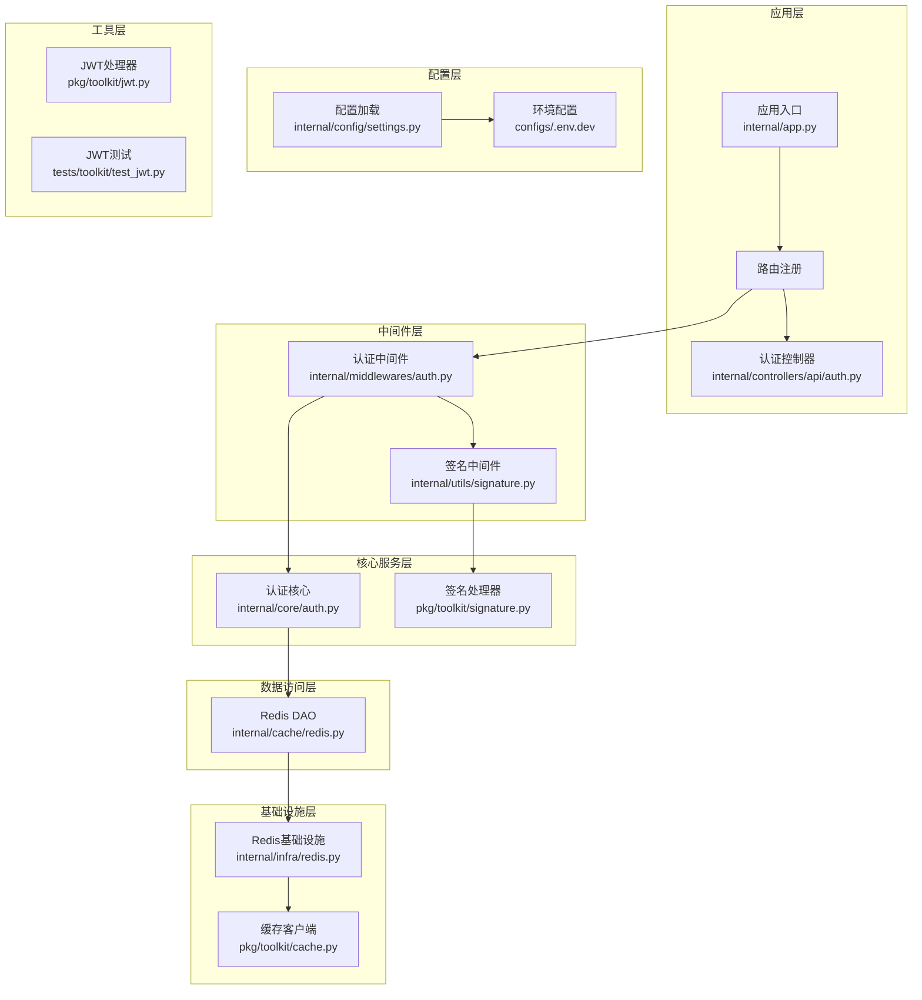
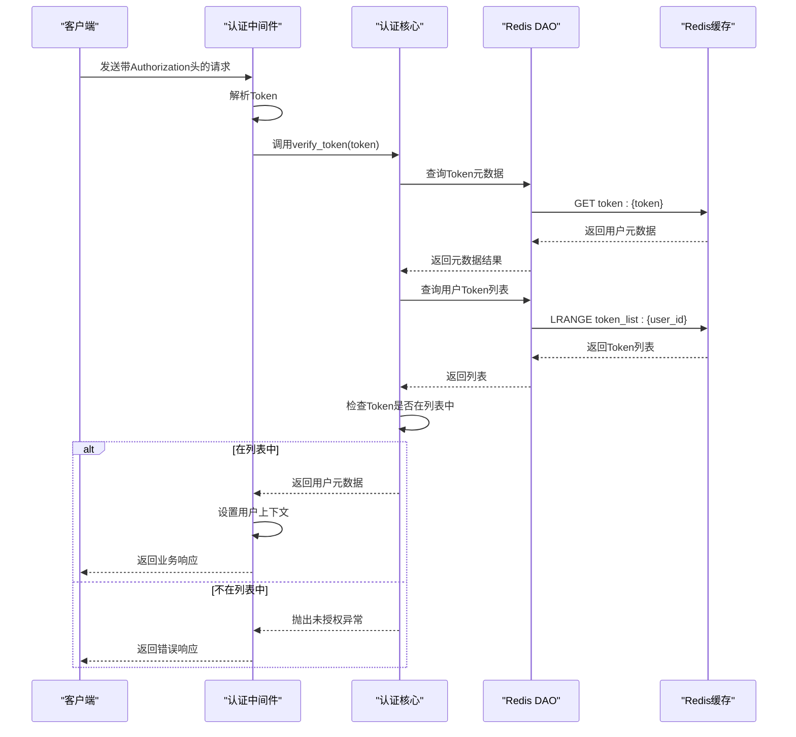
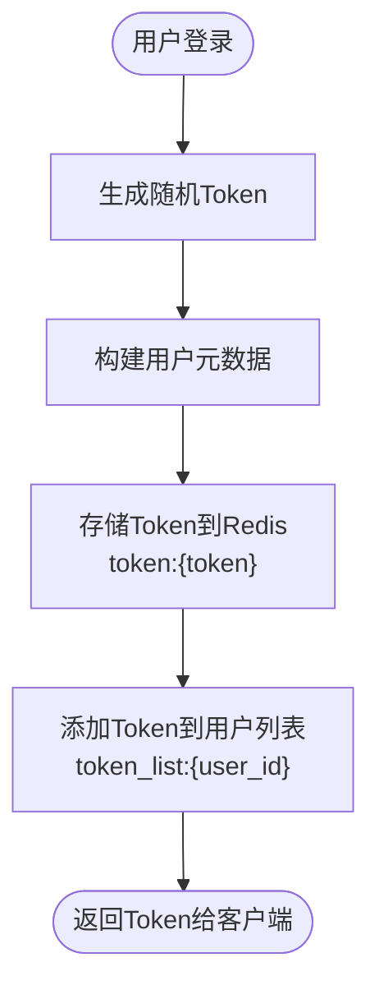
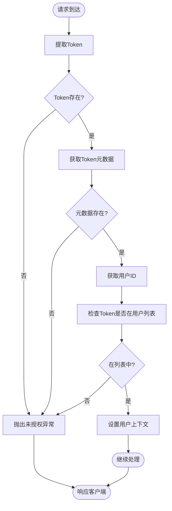
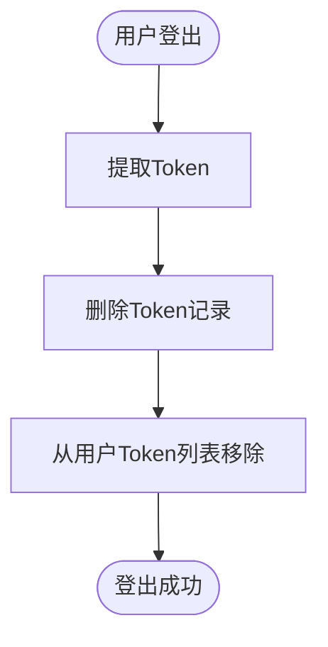
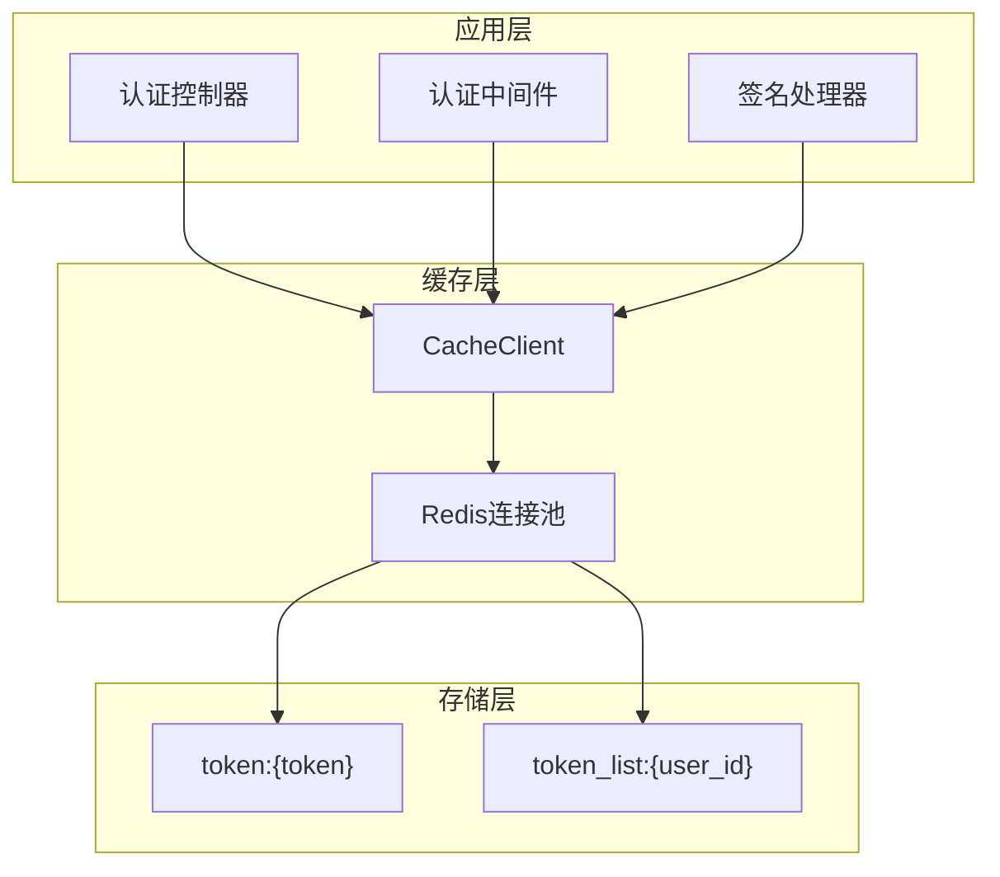
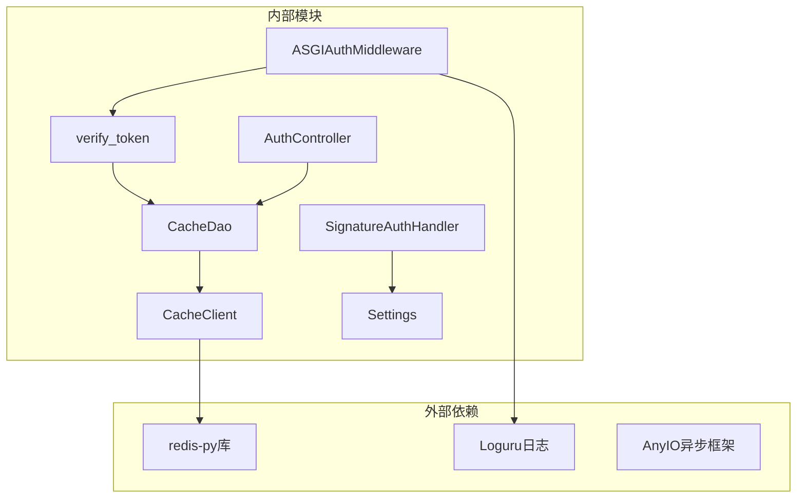

# JWT Token认证

<cite>
**本文档引用的文件**
- [pkg/toolkit/jwt.py](file://pkg/toolkit/jwt.py)
- [internal/middlewares/auth.py](file://internal/middlewares/auth.py)
- [internal/core/auth.py](file://internal/core/auth.py)
- [internal/cache/redis.py](file://internal/cache/redis.py)
- [internal/infra/redis.py](file://internal/infra/redis.py)
- [pkg/toolkit/cache.py](file://pkg/toolkit/cache.py)
- [internal/config/settings.py](file://internal/config/settings.py)
- [configs/.env.dev](file://configs/.env.dev)
- [tests/toolkit/test_jwt.py](file://tests/toolkit/test_jwt.py)
- [internal/app.py](file://internal/app.py)
- [internal/controllers/api/auth.py](file://internal/controllers/api/auth.py)
- [internal/utils/signature.py](file://internal/utils/signature.py)
- [pkg/toolkit/signature.py](file://pkg/toolkit/signature.py)
</cite>

## 更新摘要
**所做更改**
- 更新架构概览以反映从JWT认证到基于Redis的Token认证系统的迁移
- 修改核心组件分析以体现新的认证流程和数据结构
- 更新依赖关系分析以展示新的认证体系
- 修订故障排除指南以适应新的认证机制
- 新增签名认证机制的说明和集成

## 目录
1. [简介](#简介)
2. [项目结构](#项目结构)
3. [核心组件](#核心组件)
4. [架构概览](#架构概览)
5. [详细组件分析](#详细组件分析)
6. [依赖关系分析](#依赖关系分析)
7. [性能考虑](#性能考虑)
8. [故障排除指南](#故障排除指南)
9. [结论](#结论)

## 简介
本文件详细说明了FastAPI后端项目中的基于Redis的Token认证实现。内容涵盖Redis Token的生成、验证和管理机制，文档化Token结构、存储策略和有效期管理，包含用户身份验证流程、Token存储和撤销机制，提供Redis配置选项、密钥管理和安全参数设置，展示具体的Redis Token实现代码示例和使用方法，解释与Redis缓存系统的深度集成关系，包含Token过期处理、批量管理策略和安全最佳实践，并解决常见的Token安全问题和解决方案。

**重要更新**：系统已从传统的JWT Token认证迁移到基于Redis的Token认证系统。新系统采用自定义Token格式，通过Redis进行Token存储和验证，提供更好的安全性控制和管理能力。

## 项目结构
该项目采用分层架构，基于Redis的Token认证相关的核心代码分布在以下模块：
- pkg/toolkit/jwt.py：JWT处理器（保留用于兼容性，现已弃用）
- internal/middlewares/auth.py：ASGI认证中间件，拦截HTTP请求进行认证
- internal/core/auth.py：认证核心逻辑，结合Redis进行Token校验
- internal/cache/redis.py：Redis数据访问对象，提供Token元数据和Token列表查询
- internal/infra/redis.py：Redis基础设施，提供连接池和缓存客户端
- pkg/toolkit/cache.py：通用缓存客户端，封装Redis操作
- internal/config/settings.py：配置加载，提供JWT密钥、算法和过期时间等配置
- configs/.env.dev：环境配置文件，包含JWT相关配置项
- tests/toolkit/test_jwt.py：JWT功能测试（兼容性测试）
- internal/app.py：应用入口，注册中间件和路由
- internal/controllers/api/auth.py：认证控制器，处理登录、登出和用户信息获取
- internal/utils/signature.py：签名认证处理器
- pkg/toolkit/signature.py：签名认证工具类

```mermaid
graph TB
subgraph "应用层"
APP["应用入口<br/>internal/app.py"]
ROUTER["路由注册"]
AUTH_CONTROLLER["认证控制器<br/>internal/controllers/api/auth.py"]
end
subgraph "中间件层"
AUTH_MIDDLEWARE["认证中间件<br/>internal/middlewares/auth.py"]
SIGNATURE_MIDDLEWARE["签名中间件<br/>internal/utils/signature.py"]
end
subgraph "核心服务层"
CORE_AUTH["认证核心<br/>internal/core/auth.py"]
SIGNATURE_HANDLER["签名处理器<br/>pkg/toolkit/signature.py"]
end
subgraph "数据访问层"
CACHE_DAO["Redis DAO<br/>internal/cache/redis.py"]
end
subgraph "基础设施层"
REDIS_INFRA["Redis基础设施<br/>internal/infra/redis.py"]
CACHE_CLIENT["缓存客户端<br/>pkg/toolkit/cache.py"]
end
subgraph "配置层"
SETTINGS["配置加载<br/>internal/config/settings.py"]
ENV["环境配置<br/>configs/.env.dev"]
end
subgraph "工具层"
JWT_HANDLER["JWT处理器<br/>pkg/toolkit/jwt.py"]
SIGNATURE_HANDLER["签名处理器<br/>pkg/toolkit/signature.py"]
TEST_JWT["JWT测试<br/>tests/toolkit/test_jwt.py"]
end
APP --> ROUTER
ROUTER --> AUTH_CONTROLLER
ROUTER --> AUTH_MIDDLEWARE
AUTH_MIDDLEWARE --> CORE_AUTH
CORE_AUTH --> CACHE_DAO
CACHE_DAO --> REDIS_INFRA
REDIS_INFRA --> CACHE_CLIENT
SETTINGS --> ENV
AUTH_MIDDLEWARE --> SIGNATURE_MIDDLEWARE
SIGNATURE_MIDDLEWARE --> SIGNATURE_HANDLER
```

**图表来源**
- [internal/app.py](file://internal/app.py#L50-L77)
- [internal/middlewares/auth.py](file://internal/middlewares/auth.py#L84-L147)
- [internal/core/auth.py](file://internal/core/auth.py#L5-L24)
- [internal/cache/redis.py](file://internal/cache/redis.py#L6-L41)
- [internal/infra/redis.py](file://internal/infra/redis.py#L18-L98)
- [pkg/toolkit/cache.py](file://pkg/toolkit/cache.py#L41-L261)
- [internal/config/settings.py](file://internal/config/settings.py#L27-L44)
- [configs/.env.dev](file://configs/.env.dev#L1-L22)
- [internal/controllers/api/auth.py](file://internal/controllers/api/auth.py#L1-L214)
- [internal/utils/signature.py](file://internal/utils/signature.py#L1-L27)
- [pkg/toolkit/signature.py](file://pkg/toolkit/signature.py#L1-L95)
- [pkg/toolkit/jwt.py](file://pkg/toolkit/jwt.py#L1-L58)
- [tests/toolkit/test_jwt.py](file://tests/toolkit/test_jwt.py#L1-L113)

**章节来源**
- [internal/app.py](file://internal/app.py#L50-L77)
- [internal/middlewares/auth.py](file://internal/middlewares/auth.py#L84-L147)
- [internal/core/auth.py](file://internal/core/auth.py#L5-L24)
- [internal/cache/redis.py](file://internal/cache/redis.py#L6-L41)
- [internal/infra/redis.py](file://internal/infra/redis.py#L18-L98)
- [pkg/toolkit/cache.py](file://pkg/toolkit/cache.py#L41-L261)
- [internal/config/settings.py](file://internal/config/settings.py#L27-L44)
- [configs/.env.dev](file://configs/.env.dev#L1-L22)
- [internal/controllers/api/auth.py](file://internal/controllers/api/auth.py#L1-L214)
- [internal/utils/signature.py](file://internal/utils/signature.py#L1-L27)
- [pkg/toolkit/signature.py](file://pkg/toolkit/signature.py#L1-L95)
- [pkg/toolkit/jwt.py](file://pkg/toolkit/jwt.py#L1-L58)
- [tests/toolkit/test_jwt.py](file://tests/toolkit/test_jwt.py#L1-L113)

## 核心组件
本节深入分析基于Redis的Token认证系统的关键组件及其职责：

### 认证中间件 (ASGIAuthMiddleware)
认证中间件拦截所有HTTP请求，执行以下流程：
- 白名单路径放行（无需认证）
- 内部接口签名验证
- 用户Token验证和上下文设置

关键功能：
- 路径匹配和白名单管理
- Bearer Token提取和验证
- 用户上下文注入
- 统一异常处理

**章节来源**
- [internal/middlewares/auth.py](file://internal/middlewares/auth.py#L84-L147)

### 认证核心 (verify_token)
认证核心逻辑结合Redis进行Token验证：
- Token元数据查询
- 用户Token列表校验
- 完整的错误处理和日志记录

**章节来源**
- [internal/core/auth.py](file://internal/core/auth.py#L5-L24)

### Redis数据访问对象 (CacheDao)
Redis DAO提供以下功能：
- Token元数据存储和查询
- 用户Token列表管理
- 键命名规范定义

**章节来源**
- [internal/cache/redis.py](file://internal/cache/redis.py#L6-L41)

### 签名认证处理器 (SignatureAuthHandler)
签名认证处理器提供内部接口的安全认证：
- HMAC签名验证
- 时间戳防重放保护
- 随机串nonce验证

**章节来源**
- [pkg/toolkit/signature.py](file://pkg/toolkit/signature.py#L1-L95)

### 认证控制器 (AuthController)
认证控制器处理用户认证相关接口：
- 用户登录和Token生成
- 用户登出和Token撤销
- 用户信息获取

**章节来源**
- [internal/controllers/api/auth.py](file://internal/controllers/api/auth.py#L1-L214)

## 架构概览
基于Redis的Token认证系统采用分层架构设计，实现了完整的Token生命周期管理：

```mermaid
sequenceDiagram
participant Client as "客户端"
participant Middleware as "认证中间件"
participant CoreAuth as "认证核心"
participant CacheDao as "Redis DAO"
participant Redis as "Redis缓存"
Client->>Middleware : 发送带Authorization头的请求
Middleware->>Middleware : 解析Token
Middleware->>CoreAuth : 调用verify_token(token)
CoreAuth->>CacheDao : 查询Token元数据
CacheDao->>Redis : GET token : {token}
Redis-->>CacheDao : 返回用户元数据
CacheDao-->>CoreAuth : 返回元数据结果
CoreAuth->>CacheDao : 查询用户Token列表
CacheDao->>Redis : LRANGE token_list : {user_id}
Redis-->>CacheDao : 返回Token列表
CacheDao-->>CoreAuth : 返回列表
CoreAuth->>CoreAuth : 检查Token是否在列表中
alt 在列表中
CoreAuth-->>Middleware : 返回用户元数据
Middleware->>Middleware : 设置用户上下文
Middleware-->>Client : 返回业务响应
else 不在列表中
CoreAuth-->>Middleware : 抛出未授权异常
Middleware-->>Client : 返回错误响应
end
```

**图表来源**
- [internal/middlewares/auth.py](file://internal/middlewares/auth.py#L128-L146)
- [internal/core/auth.py](file://internal/core/auth.py#L5-L24)
- [internal/cache/redis.py](file://internal/cache/redis.py#L19-L33)

## 详细组件分析

### Token生成和存储流程

```mermaid
flowchart TD
Start([用户登录]) --> GenerateToken["生成随机Token"]
GenerateToken --> BuildMetadata["构建用户元数据"]
BuildMetadata --> StoreToken["存储Token到Redis<br/>token:{token}"]
StoreToken --> StoreList["添加Token到用户列表<br/>token_list:{user_id}"]
StoreList --> Success([返回Token给客户端])
```

**图表来源**
- [internal/controllers/api/auth.py](file://internal/controllers/api/auth.py#L69-L93)

**章节来源**
- [internal/controllers/api/auth.py](file://internal/controllers/api/auth.py#L69-L93)

### Token验证流程

```mermaid
flowchart TD
Start([请求到达]) --> ExtractToken["提取Token"]
ExtractToken --> CheckToken{"Token存在?"}
CheckToken --> |否| Unauthorized["抛出未授权异常"]
CheckToken --> |是| GetMetadata["获取Token元数据"]
GetMetadata --> MetadataFound{"元数据存在?"}
MetadataFound --> |否| Unauthorized
MetadataFound --> |是| GetUser["获取用户ID"]
GetUser --> CheckList["检查Token是否在用户列表"]
CheckList --> InList{"在列表中?"}
InList --> |是| SetContext["设置用户上下文"]
SetContext --> Success([继续处理])
InList --> |否| Unauthorized
Unauthorized --> End([响应客户端])
Success --> End
```

**图表来源**
- [internal/middlewares/auth.py](file://internal/middlewares/auth.py#L128-L146)
- [internal/core/auth.py](file://internal/core/auth.py#L5-L24)

**章节来源**
- [internal/middlewares/auth.py](file://internal/middlewares/auth.py#L128-L146)
- [internal/core/auth.py](file://internal/core/auth.py#L5-L24)

### 登出和Token撤销流程

```mermaid
flowchart TD
Start([用户登出]) --> ExtractToken["提取Token"]
ExtractToken --> DeleteToken["删除Token记录"]
DeleteToken --> RemoveFromList["从用户Token列表移除"]
RemoveFromList --> Success([登出成功])
```

**图表来源**
- [internal/controllers/api/auth.py](file://internal/controllers/api/auth.py#L96-L130)

**章节来源**
- [internal/controllers/api/auth.py](file://internal/controllers/api/auth.py#L96-L130)

### Redis集成架构

```mermaid
graph TB
subgraph "应用层"
AuthController["认证控制器"]
AuthMiddleware["认证中间件"]
SignatureHandler["签名处理器"]
end
subgraph "缓存层"
CacheClient["CacheClient"]
RedisPool["Redis连接池"]
end
subgraph "存储层"
TokenKey["token:{token}"]
TokenListKey["token_list:{user_id}"]
end
AuthController --> CacheClient
AuthMiddleware --> CacheClient
SignatureHandler --> CacheClient
CacheClient --> RedisPool
RedisPool --> TokenKey
RedisPool --> TokenListKey
```

**图表来源**
- [pkg/toolkit/cache.py](file://pkg/toolkit/cache.py#L41-L261)
- [internal/cache/redis.py](file://internal/cache/redis.py#L11-L17)
- [internal/infra/redis.py](file://internal/infra/redis.py#L18-L98)

**章节来源**
- [pkg/toolkit/cache.py](file://pkg/toolkit/cache.py#L41-L261)
- [internal/cache/redis.py](file://internal/cache/redis.py#L11-L17)
- [internal/infra/redis.py](file://internal/infra/redis.py#L18-L98)

## 依赖关系分析
基于Redis的Token认证系统的依赖关系清晰，遵循单一职责原则：

```mermaid
graph TD
subgraph "外部依赖"
RedisLib["redis-py库"]
Loguru["Loguru日志"]
AnyIO["AnyIO异步框架"]
end
subgraph "内部模块"
AuthMiddleware["ASGIAuthMiddleware"]
CoreAuth["verify_token"]
CacheDao["CacheDao"]
CacheClient["CacheClient"]
Settings["Settings"]
SignatureHandler["SignatureAuthHandler"]
AuthController["AuthController"]
end
AuthMiddleware --> CoreAuth
CoreAuth --> CacheDao
CacheDao --> CacheClient
CacheClient --> RedisLib
AuthMiddleware --> Loguru
AuthController --> CacheDao
SignatureHandler --> Settings
```

**图表来源**
- [internal/infra/redis.py](file://internal/infra/redis.py#L4)
- [pkg/toolkit/cache.py](file://pkg/toolkit/cache.py#L9)
- [internal/middlewares/auth.py](file://internal/middlewares/auth.py#L6)
- [internal/controllers/api/auth.py](file://internal/controllers/api/auth.py#L9)

**章节来源**
- [internal/infra/redis.py](file://internal/infra/redis.py#L4)
- [pkg/toolkit/cache.py](file://pkg/toolkit/cache.py#L9)
- [internal/middlewares/auth.py](file://internal/middlewares/auth.py#L6)
- [internal/controllers/api/auth.py](file://internal/controllers/api/auth.py#L9)

## 性能考虑
基于Redis的Token认证系统在性能方面具有以下特点：

### Redis连接优化
- 使用连接池避免频繁建立连接
- 异步操作减少阻塞
- 批量操作支持（列表操作）

### 缓存策略
- Token元数据缓存：token:{token}
- 用户Token列表缓存：token_list:{user_id}
- TTL设置支持（通过TOKEN_EXPIRE_MINUTES配置）

### 并发处理
- 异步中间件设计
- 非阻塞Redis操作
- 连接复用机制

### 内存优化
- 自定义Token格式，比JWT更小
- 列表存储支持批量管理
- 原子操作保证数据一致性

## 故障排除指南
常见基于Redis的Token认证问题及解决方案：

### Token验证失败
**问题症状**：返回"Token verification failed"错误
**可能原因**：
- 缺少Authorization头
- Token格式不正确
- Token已过期或被撤销
- Token不在用户Token列表中

**排查步骤**：
1. 检查请求头是否包含Authorization字段
2. 确认Token格式正确
3. 验证Token是否在Redis中存在
4. 检查用户Token列表中是否包含该Token

**章节来源**
- [internal/middlewares/auth.py](file://internal/middlewares/auth.py#L132-L140)
- [internal/core/auth.py](file://internal/core/auth.py#L8-L21)

### Redis连接问题
**问题症状**：Redis操作失败或连接超时
**可能原因**：
- Redis服务器不可达
- 连接池配置不当
- 密码认证失败

**解决方案**：
1. 检查Redis服务器状态
2. 验证连接URL配置
3. 确认密码和端口设置
4. 查看连接池最大连接数配置

**章节来源**
- [internal/infra/redis.py](file://internal/infra/redis.py#L29-L34)
- [internal/infra/redis.py](file://internal/infra/redis.py#L70-L84)

### 配置问题
**问题症状**：JWT密钥或算法配置错误
**可能原因**：
- JWT_SECRET未正确设置
- ACCESS_TOKEN_EXPIRE_MINUTES配置不当

**解决方案**：
1. 检查.env文件中的JWT配置
2. 确认密钥长度符合要求
3. 验证算法支持情况
4. 测试配置加载是否正确

**章节来源**
- [configs/.env.dev](file://configs/.env.dev#L4-L21)
- [internal/config/settings.py](file://internal/config/settings.py#L40-L44)

### Token生成问题
**问题症状**：Token生成失败或格式不正确
**可能原因**：
- secrets模块不可用
- Token长度不符合预期

**解决方案**：
1. 检查Python版本和secrets模块可用性
2. 验证Token生成逻辑
3. 确认Token格式为'tk_'前缀加32字符十六进制

**章节来源**
- [internal/controllers/api/auth.py](file://internal/controllers/api/auth.py#L27-L40)

## 结论
本基于Redis的Token认证系统实现了完整的Token生命周期管理，包括生成、验证、存储和撤销机制。系统采用分层架构设计，具有良好的可维护性和扩展性。通过Redis缓存实现了高性能的Token验证，支持异步操作和连接池优化。配置系统提供了灵活的安全参数设置，包括Token过期时间和存储策略控制。

主要优势：
- 完整的错误处理和日志记录
- 异步非阻塞的Redis操作
- 灵活的配置管理
- 清晰的分层架构
- 全面的功能测试覆盖
- 支持签名认证的混合认证模式

**架构迁移优势**：
- 更好的安全性控制，支持Token撤销
- 更灵活的Token管理，支持批量操作
- 更小的Token大小，节省存储空间
- 更好的性能表现，适合高并发场景
- 更完善的审计和监控能力

改进建议：
- 实现Token刷新机制
- 添加Token黑名单机制
- 增强安全审计日志
- 优化Redis键命名策略
- 添加Token统计和监控功能