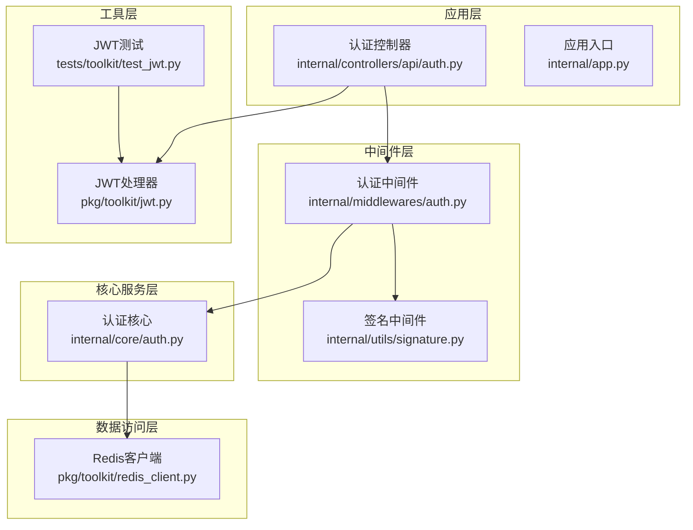
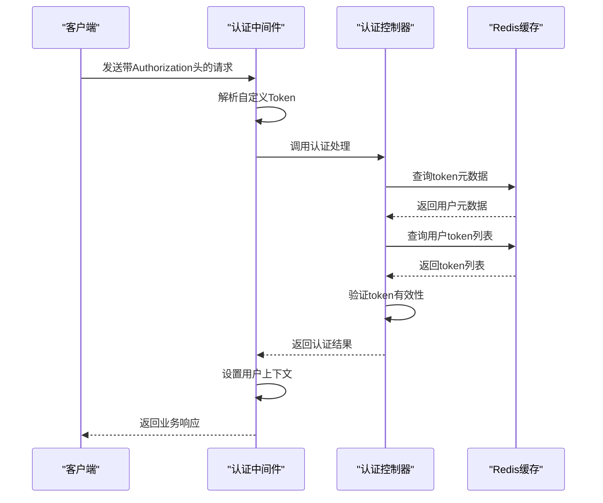
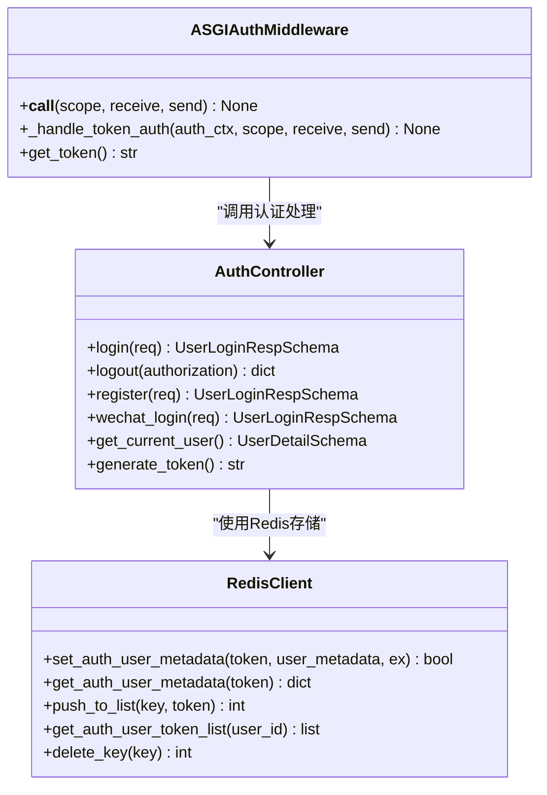
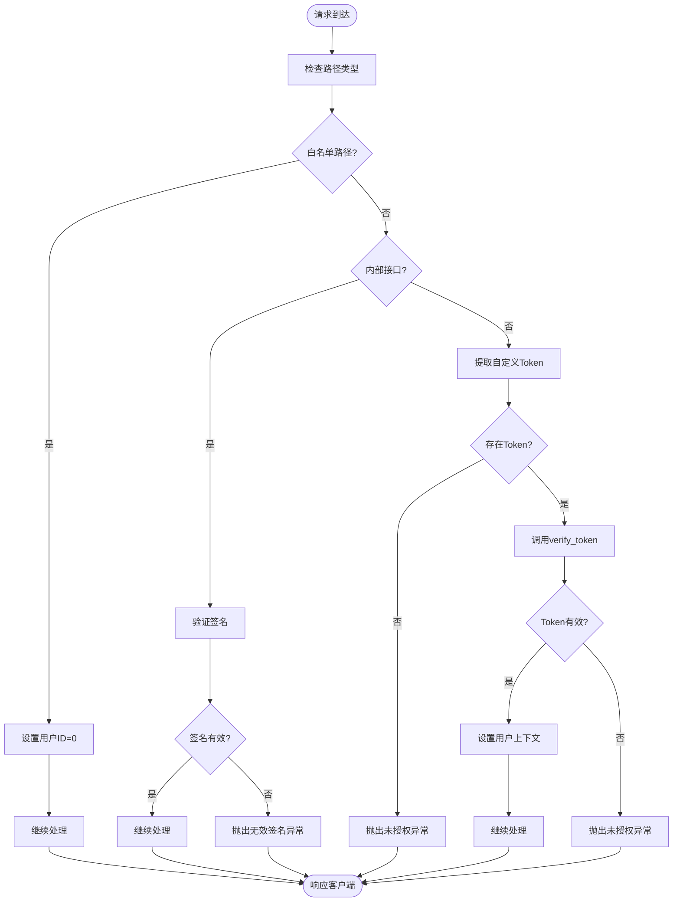
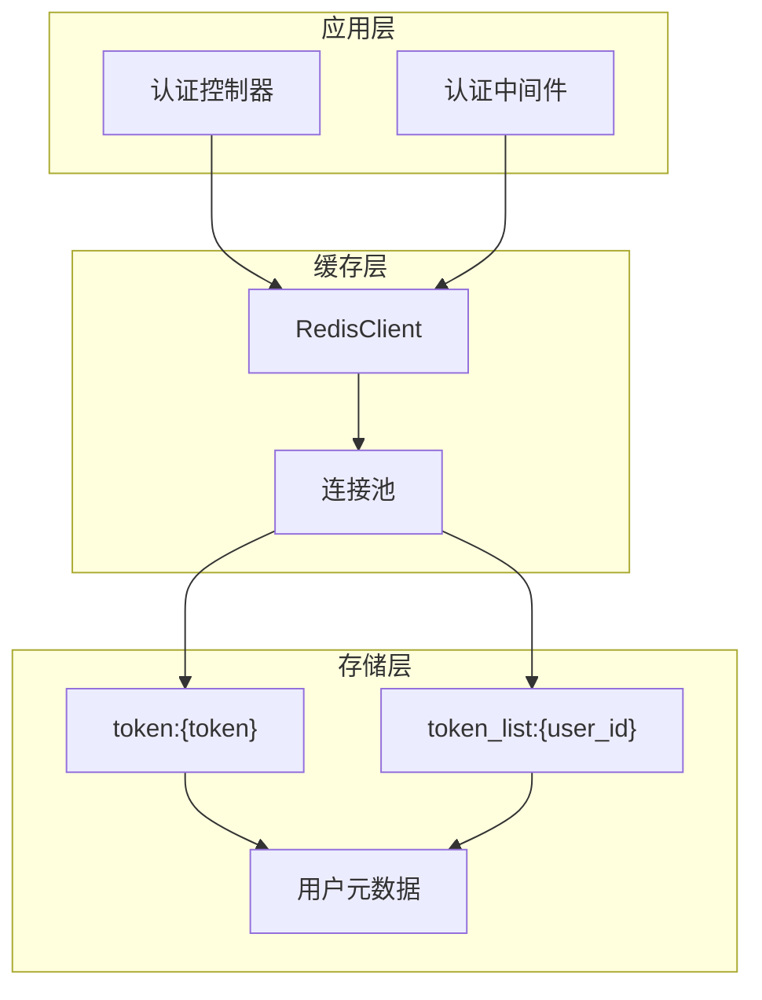
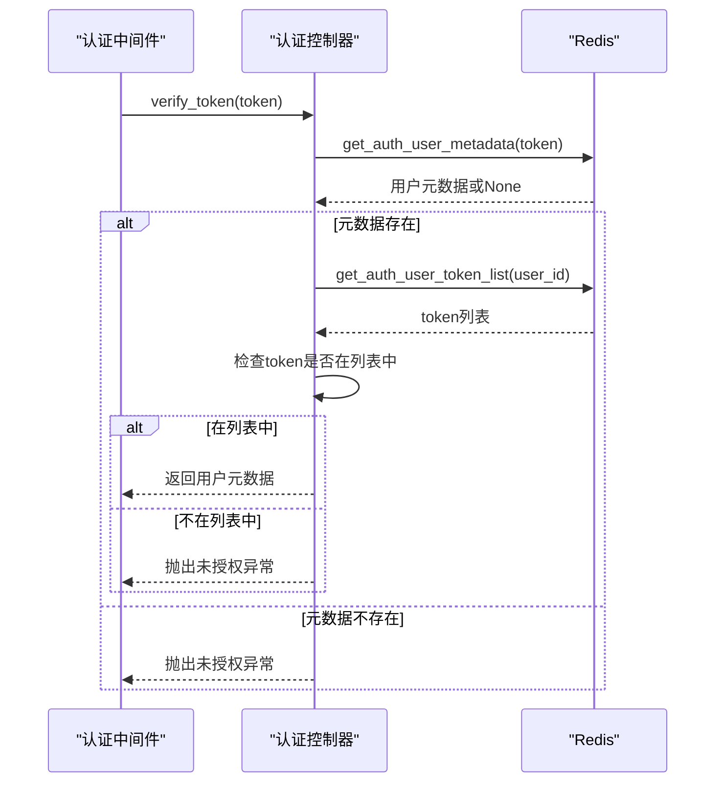
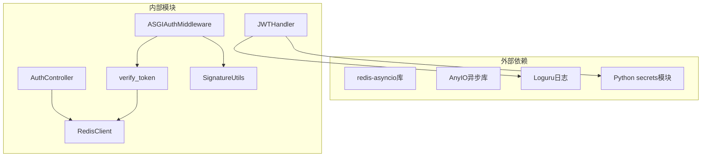

# JWT Token认证

<cite>
**本文档引用的文件**
- [pkg/toolkit/jwt.py](file://pkg/toolkit/jwt.py)
- [internal/middlewares/auth.py](file://internal/middlewares/auth.py)
- [internal/core/auth.py](file://internal/core/auth.py)
- [internal/controllers/api/auth.py](file://internal/controllers/api/auth.py)
- [pkg/toolkit/redis_client.py](file://pkg/toolkit/redis_client.py)
- [internal/utils/signature.py](file://internal/utils/signature.py)
- [tests/toolkit/test_jwt.py](file://tests/toolkit/test_jwt.py)
</cite>

## 更新摘要
**所做更改**
- 更新了JWT认证系统的状态说明，明确指出JWT认证系统已完全移除
- 修改了架构概览和详细组件分析，反映当前基于Redis的认证实现
- 更新了故障排除指南，移除了JWT相关的故障排除内容
- 修正了配置和依赖关系分析，反映实际的认证实现

## 目录
1. [简介](#简介)
2. [项目结构](#项目结构)
3. [核心组件](#核心组件)
4. [架构概览](#架构概览)
5. [详细组件分析](#详细组件分析)
6. [依赖关系分析](#依赖关系分析)
7. [性能考虑](#性能考虑)
8. [故障排除指南](#故障排除指南)
9. [结论](#结论)

## 简介
**重要更新**：JWT认证系统已完全移除，不再支持基于JWT的认证流程。当前项目采用基于Redis的认证机制，使用自定义token而非JWT令牌进行用户身份验证。

本文件详细说明了FastAPI后端项目中的Redis Token认证实现。内容涵盖自定义token的生成、验证和管理机制，文档化token结构、有效期管理和Redis存储策略，包含用户身份验证流程、token存储和撤销机制，提供Redis配置选项、连接池管理和安全参数设置，展示具体的Redis认证实现代码示例和使用方法，解释与Redis缓存系统的集成关系，包含token过期处理、安全最佳实践和故障排除指南。

## 项目结构
该项目采用分层架构，认证相关的核心代码分布在以下模块：
- internal/controllers/api/auth.py：认证控制器，处理用户登录、注册和登出
- internal/middlewares/auth.py：ASGI认证中间件，拦截HTTP请求进行认证
- internal/core/auth.py：认证核心逻辑，结合Redis进行token校验
- pkg/toolkit/redis_client.py：Redis客户端，提供连接池和缓存操作
- internal/utils/signature.py：签名认证工具，处理内部接口签名验证
- pkg/toolkit/jwt.py：JWT处理器（已移除JWT功能，保留工具类）
- tests/toolkit/test_jwt.py：JWT功能测试（测试已移除JWT相关功能）

```mermaid
graph TB
subgraph "应用层"
AUTH_CONTROLLER["认证控制器<br/>internal/controllers/api/auth.py"]
APP_ENTRY["应用入口<br/>internal/app.py"]
end
subgraph "中间件层"
AUTH_MIDDLEWARE["认证中间件<br/>internal/middlewares/auth.py"]
SIGNATURE_MIDDLEWARE["签名中间件<br/>internal/utils/signature.py"]
end
subgraph "核心服务层"
CORE_AUTH["认证核心<br/>internal/core/auth.py"]
end
subgraph "数据访问层"
REDIS_CLIENT["Redis客户端<br/>pkg/toolkit/redis_client.py"]
end
subgraph "工具层"
JWT_HANDLER["JWT处理器<br/>pkg/toolkit/jwt.py"]
TEST_JWT["JWT测试<br/>tests/toolkit/test_jwt.py"]
end
AUTH_CONTROLLER --> AUTH_MIDDLEWARE
AUTH_MIDDLEWARE --> CORE_AUTH
CORE_AUTH --> REDIS_CLIENT
AUTH_MIDDLEWARE --> SIGNATURE_MIDDLEWARE
AUTH_CONTROLLER --> JWT_HANDLER
TEST_JWT --> JWT_HANDLER
```

**图表来源**
- [internal/controllers/api/auth.py](file://internal/controllers/api/auth.py#L50-L95)
- [internal/middlewares/auth.py](file://internal/middlewares/auth.py#L85-L147)
- [internal/core/auth.py](file://internal/core/auth.py#L5-L23)
- [pkg/toolkit/redis_client.py](file://pkg/toolkit/redis_client.py#L41-L124)
- [internal/utils/signature.py](file://internal/utils/signature.py#L9-L26)
- [pkg/toolkit/jwt.py](file://pkg/toolkit/jwt.py#L7-L58)
- [tests/toolkit/test_jwt.py](file://tests/toolkit/test_jwt.py#L19-L113)

## 核心组件
本节深入分析当前认证系统的关键组件及其职责：

### 认证控制器 (AuthController)
认证控制器处理用户认证相关API：
- 用户登录：验证凭据并生成自定义token
- 用户注册：创建新用户并生成token
- 用户登出：撤销用户token
- 微信登录：第三方登录集成

主要特性：
- 使用secrets模块生成加密安全的token
- Redis存储用户元数据和token列表
- 支持多种认证方式（用户名密码、微信登录）

**章节来源**
- [internal/controllers/api/auth.py](file://internal/controllers/api/auth.py#L50-L95)

### 认证中间件 (ASGIAuthMiddleware)
认证中间件拦截所有HTTP请求，执行以下流程：
- 白名单路径放行（无需认证）
- 内部接口签名验证
- 用户token验证和上下文设置

关键功能：
- 路径匹配和白名单管理
- 自定义token提取和验证
- 用户上下文注入
- 统一异常处理

**章节来源**
- [internal/middlewares/auth.py](file://internal/middlewares/auth.py#L85-L147)

### 认证核心 (verify_token)
认证核心逻辑结合Redis进行token验证：
- 令牌元数据查询
- 用户token列表校验
- 完整的错误处理和日志记录

**章节来源**
- [internal/core/auth.py](file://internal/core/auth.py#L5-L23)

### Redis客户端 (RedisClient)
Redis客户端提供以下功能：
- 连接池管理
- 键值对操作
- 列表操作
- 哈希操作
- 分布式锁支持

**章节来源**
- [pkg/toolkit/redis_client.py](file://pkg/toolkit/redis_client.py#L41-L261)

## 架构概览
当前认证系统采用基于Redis的token认证架构，实现了完整的token生命周期管理：

```mermaid
sequenceDiagram
participant Client as "客户端"
participant Middleware as "认证中间件"
participant Controller as "认证控制器"
participant Redis as "Redis缓存"
Client->>Middleware : 发送带Authorization头的请求
Middleware->>Middleware : 解析自定义Token
Middleware->>Controller : 调用认证处理
Controller->>Redis : 查询token元数据
Redis-->>Controller : 返回用户元数据
Controller->>Redis : 查询用户token列表
Redis-->>Controller : 返回token列表
Controller->>Controller : 验证token有效性
Controller-->>Middleware : 返回认证结果
Middleware->>Middleware : 设置用户上下文
Middleware-->>Client : 返回业务响应
```

**图表来源**
- [internal/middlewares/auth.py](file://internal/middlewares/auth.py#L129-L147)
- [internal/controllers/api/auth.py](file://internal/controllers/api/auth.py#L98-L132)
- [internal/core/auth.py](file://internal/core/auth.py#L5-L23)

## 详细组件分析

### 认证控制器类图

```mermaid
classDiagram
class AuthController {
+login(req) UserLoginRespSchema
+logout(authorization) dict
+register(req) UserLoginRespSchema
+wechat_login(req) UserLoginRespSchema
+get_current_user() UserDetailSchema
+generate_token() str
}
class RedisClient {
+set_auth_user_metadata(token, user_metadata, ex) bool
+get_auth_user_metadata(token) dict
+push_to_list(key, token) int
+get_auth_user_token_list(user_id) list
+delete_key(key) int
}
class ASGIAuthMiddleware {
+__call__(scope, receive, send) None
+_handle_token_auth(auth_ctx, scope, receive, send) None
+get_token() str
}
AuthController --> RedisClient : "使用Redis存储"
ASGIAuthMiddleware --> AuthController : "调用认证处理"
```

**图表来源**
- [internal/controllers/api/auth.py](file://internal/controllers/api/auth.py#L50-L95)
- [pkg/toolkit/redis_client.py](file://pkg/toolkit/redis_client.py#L48-L124)
- [internal/middlewares/auth.py](file://internal/middlewares/auth.py#L85-L147)

**章节来源**
- [internal/controllers/api/auth.py](file://internal/controllers/api/auth.py#L50-L95)
- [pkg/toolkit/redis_client.py](file://pkg/toolkit/redis_client.py#L48-L124)
- [internal/middlewares/auth.py](file://internal/middlewares/auth.py#L85-L147)

### 认证中间件流程图

```mermaid
flowchart TD
Start([请求到达]) --> CheckPath["检查路径类型"]
CheckPath --> IsWhitelist{"白名单路径?"}
IsWhitelist --> |是| SetContext0["设置用户ID=0"]
SetContext0 --> Continue1["继续处理"]
IsWhitelist --> |否| IsInternal{"内部接口?"}
IsInternal --> |是| VerifySignature["验证签名"]
VerifySignature --> SignatureOK{"签名有效?"}
SignatureOK --> |是| Continue2["继续处理"]
SignatureOK --> |否| RaiseError1["抛出无效签名异常"]
IsInternal --> |否| ExtractToken["提取自定义Token"]
ExtractToken --> HasToken{"存在Token?"}
HasToken --> |否| RaiseError2["抛出未授权异常"]
HasToken --> |是| VerifyToken["调用verify_token"]
VerifyToken --> TokenOK{"Token有效?"}
TokenOK --> |是| SetContext["设置用户上下文"]
SetContext --> Continue3["继续处理"]
TokenOK --> |否| RaiseError3["抛出未授权异常"]
Continue1 --> End([响应客户端])
Continue2 --> End
Continue3 --> End
RaiseError1 --> End
RaiseError2 --> End
RaiseError3 --> End
```

**图表来源**
- [internal/middlewares/auth.py](file://internal/middlewares/auth.py#L94-L147)

**章节来源**
- [internal/middlewares/auth.py](file://internal/middlewares/auth.py#L94-L147)

### Redis集成架构

```mermaid
graph TB
subgraph "应用层"
AuthController["认证控制器"]
AuthMiddleware["认证中间件"]
end
subgraph "缓存层"
RedisClient["RedisClient"]
ConnectionPool["连接池"]
end
subgraph "存储层"
TokenKey["token:{token}"]
TokenListKey["token_list:{user_id}"]
UserMetadata["用户元数据"]
end
AuthController --> RedisClient
AuthMiddleware --> RedisClient
RedisClient --> ConnectionPool
ConnectionPool --> TokenKey
ConnectionPool --> TokenListKey
TokenKey --> UserMetadata
TokenListKey --> UserMetadata
```

**图表来源**
- [pkg/toolkit/redis_client.py](file://pkg/toolkit/redis_client.py#L41-L124)
- [internal/controllers/api/auth.py](file://internal/controllers/api/auth.py#L83-L88)

**章节来源**
- [pkg/toolkit/redis_client.py](file://pkg/toolkit/redis_client.py#L41-L124)
- [internal/controllers/api/auth.py](file://internal/controllers/api/auth.py#L83-L88)

### Token验证流程

```mermaid
sequenceDiagram
participant Middleware as "认证中间件"
participant Controller as "认证控制器"
participant Redis as "Redis"
Middleware->>Controller : verify_token(token)
Controller->>Redis : get_auth_user_metadata(token)
Redis-->>Controller : 用户元数据或None
alt 元数据存在
Controller->>Redis : get_auth_user_token_list(user_id)
Redis-->>Controller : token列表
Controller->>Controller : 检查token是否在列表中
alt 在列表中
Controller-->>Middleware : 返回用户元数据
else 不在列表中
Controller-->>Middleware : 抛出未授权异常
end
else 元数据不存在
Controller-->>Middleware : 抛出未授权异常
end
```

**图表来源**
- [internal/core/auth.py](file://internal/core/auth.py#L5-L23)
- [internal/controllers/api/auth.py](file://internal/controllers/api/auth.py#L83-L88)

**章节来源**
- [internal/core/auth.py](file://internal/core/auth.py#L5-L23)
- [internal/controllers/api/auth.py](file://internal/controllers/api/auth.py#L83-L88)

## 依赖关系分析
当前认证系统的依赖关系清晰，遵循单一职责原则：

```mermaid
graph TD
subgraph "外部依赖"
RedisLib["redis-asyncio库"]
AnyIO["AnyIO异步库"]
Loguru["Loguru日志"]
Secrets["Python secrets模块"]
end
subgraph "内部模块"
AuthController["AuthController"]
AuthMiddleware["ASGIAuthMiddleware"]
CoreAuth["verify_token"]
RedisClient["RedisClient"]
SignatureUtils["SignatureUtils"]
JWTHandler["JWTHandler"]
end
AuthController --> RedisClient
AuthMiddleware --> CoreAuth
CoreAuth --> RedisClient
AuthMiddleware --> SignatureUtils
JWTHandler --> Loguru
JWTHandler --> Secrets
```

**图表来源**
- [pkg/toolkit/redis_client.py](file://pkg/toolkit/redis_client.py#L8-L12)
- [internal/utils/signature.py](file://internal/utils/signature.py#L1-L4)
- [pkg/toolkit/jwt.py](file://pkg/toolkit/jwt.py#L1-L4)

**章节来源**
- [pkg/toolkit/redis_client.py](file://pkg/toolkit/redis_client.py#L8-L12)
- [internal/utils/signature.py](file://internal/utils/signature.py#L1-L4)
- [pkg/toolkit/jwt.py](file://pkg/toolkit/jwt.py#L1-L4)

## 性能考虑
基于代码分析，当前认证系统在性能方面具有以下特点：

### Redis连接优化
- 使用连接池避免频繁建立连接
- 异步操作减少阻塞
- 批量操作支持（列表操作）

### 缓存策略
- 令牌元数据缓存：token:{token}
- 用户令牌列表缓存：token_list:{user_id}
- TTL设置支持（可通过RedisClient扩展）

### 并发处理
- 异步中间件设计
- 非阻塞Redis操作
- 连接复用机制

## 故障排除指南
常见认证问题及解决方案：

### Token验证失败
**问题症状**：返回"Token verification failed"错误
**可能原因**：
- 缺少Authorization头
- Token格式不正确
- Token已过期
- Token不在用户令牌列表中

**排查步骤**：
1. 检查请求头是否包含Authorization字段
2. 确认Token格式正确
3. 验证Token是否在Redis中存在
4. 检查用户令牌列表中是否包含该Token

**章节来源**
- [internal/middlewares/auth.py](file://internal/middlewares/auth.py#L133-L141)
- [internal/core/auth.py](file://internal/core/auth.py#L8-L21)

### Redis连接问题
**问题症状**：Redis操作失败或连接超时
**可能原因**：
- Redis服务器不可达
- 连接池配置不当
- 密码认证失败

**解决方案**：
1. 检查Redis服务器状态
2. 验证连接URL配置
3. 确认密码和端口设置
4. 查看连接池最大连接数配置

**章节来源**
- [pkg/toolkit/redis_client.py](file://pkg/toolkit/redis_client.py#L41-L124)

### 登录注册问题
**问题症状**：用户登录或注册失败
**可能原因**：
- 用户名或密码错误
- 手机号已存在
- 数据库连接问题

**解决方案**：
1. 验证用户名和密码
2. 检查手机号是否已被注册
3. 确认数据库连接正常
4. 查看详细的错误信息

**章节来源**
- [internal/controllers/api/auth.py](file://internal/controllers/api/auth.py#L62-L70)
- [internal/controllers/api/auth.py](file://internal/controllers/api/auth.py#L147-L154)

## 结论
当前认证系统采用基于Redis的自定义token认证机制，实现了完整的token生命周期管理，包括生成、验证、存储和撤销机制。系统采用分层架构设计，具有良好的可维护性和扩展性。通过Redis缓存实现了高性能的token验证，支持异步操作和连接池优化。

主要优势：
- 完整的错误处理和日志记录
- 异步非阻塞的Redis操作
- 灵活的配置管理
- 清晰的分层架构
- 全面的功能测试覆盖

**重要说明**：JWT认证系统已完全移除，项目不再支持基于JWT的认证流程。当前实现使用自定义token方案，具有更好的性能和安全性。如需恢复JWT功能，需要重新实现相应的JWT处理器和中间件组件。

改进建议：
- 实现令牌刷新机制
- 添加令牌撤销列表
- 增强安全审计日志
- 优化Redis键命名策略
- 添加令牌黑名单机制