# 安全认证机制

<cite>
**本文引用的文件**
- [internal/middlewares/auth.py](file://internal/middlewares/auth.py)
- [internal/core/auth.py](file://internal/core/auth.py)
- [internal/cache/redis.py](file://internal/cache/redis.py)
- [internal/controllers/api/auth.py](file://internal/controllers/api/auth.py)
- [internal/services/user.py](file://internal/services/user.py)
- [internal/utils/password.py](file://internal/utils/password.py)
- [internal/infra/redis.py](file://internal/infra/redis.py)
- [internal/utils/signature.py](file://internal/utils/signature.py)
- [pkg/toolkit/jwt.py](file://pkg/toolkit/jwt.py)
- [internal/app.py](file://internal/app.py)
- [main.py](file://main.py)
- [configs/.env.dev](file://configs/.env.dev)
- [configs/.env.prod](file://configs/.env.prod)
- [tests/toolkit/test_jwt.py](file://tests/toolkit/test_jwt.py)
- [internal/core/exception.py](file://internal/core/exception.py)
- [internal/middlewares/recorder.py](file://internal/middlewares/recorder.py)
- [pkg/toolkit/exc.py](file://pkg/toolkit/exc.py)
- [pkg/toolkit/response.py](file://pkg/toolkit/response.py)
- [pkg/third_party_auth/base.py](file://pkg/third_party_auth/base.py)
- [pkg/third_party_auth/config.py](file://pkg/third_party_auth/config.py)
- [pkg/third_party_auth/factory.py](file://pkg/third_party_auth/factory.py)
- [pkg/third_party_auth/strategies/wechat.py](file://pkg/third_party_auth/strategies/wechat.py)
- [internal/dao/user.py](file://internal/dao/user.py)
- [internal/models/user.py](file://internal/models/user.py)
</cite>

## 更新摘要
**所做更改**
- 新增第三方认证系统：实现微信OAuth2.0登录功能，支持基于策略模式的可扩展第三方认证架构
- 新增微信登录接口：提供/wechat/login端点，支持通过授权码换取access_token和用户信息
- 新增第三方认证策略：基于策略模式实现，支持微信、支付宝等平台的统一接入
- 新增用户绑定机制：支持第三方账号与现有用户的绑定，防止重复绑定
- 新增配置管理：提供WeChatConfig等配置类，支持类型安全的第三方认证配置
- 新增工厂模式：通过ThirdPartyAuthFactory统一管理认证策略的注册和获取

## 目录
1. [简介](#简介)
2. [项目结构](#项目结构)
3. [核心组件](#核心组件)
4. [架构总览](#架构总览)
5. [详细组件分析](#详细组件分析)
6. [依赖分析](#依赖分析)
7. [性能考虑](#性能考虑)
8. [故障排查指南](#故障排查指南)
9. [结论](#结论)
10. [附录](#附录)

## 简介
本文件系统性梳理本项目的安全认证机制，涵盖以下方面：
- **Redis Token认证机制**：基于随机令牌的认证方式，替代传统的JWT认证
- **密码加密处理**：使用bcrypt算法进行密码哈希和验证
- **用户令牌列表管理**：支持令牌的批量管理和登出功能
- **第三方认证系统**：新增微信OAuth2.0登录功能，支持策略模式的可扩展认证架构
- **认证中间件与路由白名单策略**
- **权限控制与访问控制思路**
- **安全配置项、密钥管理与令牌有效期**
- **与中间件系统的集成关系**
- **CSRF防护、会话管理与安全审计建议**
- **常见安全风险与防护措施**
- **异常链改进与统一异常处理机制**

## 项目结构
围绕认证与安全的关键模块分布如下：
- 配置层：集中于配置加载与密钥管理
- 中间件层：统一拦截请求，执行白名单放行、签名认证与Token认证
- 核心认证层：基于Redis缓存的令牌验证与用户元数据管理
- 服务层：密码加密、用户管理和令牌生成
- 缓存层：Redis数据访问对象，提供令牌和用户元数据存储
- 第三方认证层：策略模式实现，支持微信、支付宝等平台的统一接入
- 应用层：FastAPI应用注册中间ware与路由
- 异常处理层：统一异常捕获、日志记录和错误响应构建

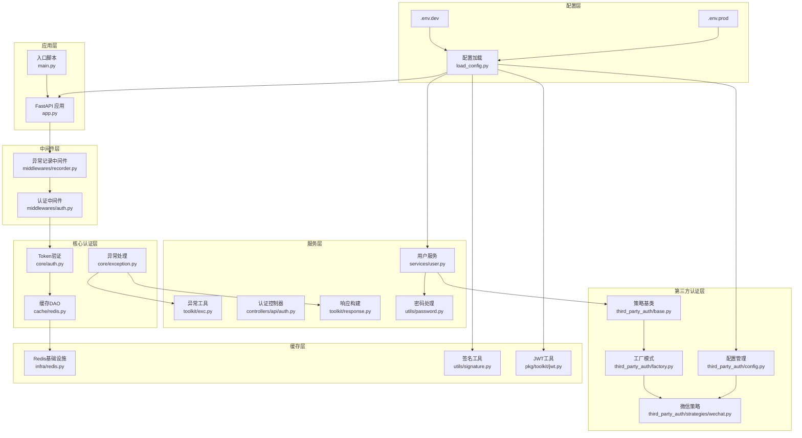
```mermaid
graph TB
subgraph "配置层"
CFG["配置加载<br/>load_config.py"]
ENV_DEV[".env.dev"]
ENV_PROD[".env.prod"]
end
subgraph "应用层"
APP["FastAPI 应用<br/>app.py"]
MAIN["入口脚本<br/>main.py"]
end
subgraph "中间件层"
MW["认证中间件<br/>middlewares/auth.py"]
RECORDER["异常记录中间件<br/>middlewares/recorder.py"]
end
subgraph "核心认证层"
CORE_AUTH["Token验证<br/>core/auth.py"]
CACHE_DAO["缓存DAO<br/>cache/redis.py"]
EXCEPTION["异常处理<br/>core/exception.py"]
end
subgraph "服务层"
USER_SERVICE["用户服务<br/>services/user.py"]
PASSWORD_HANDLER["密码处理<br/>utils/password.py"]
AUTH_CONTROLLER["认证控制器<br/>controllers/api/auth.py"]
EXC_UTIL["异常工具<br/>toolkit/exc.py"]
RESPONSE["响应构建<br/>toolkit/response.py"]
end
subgraph "第三方认证层"
THIRD_PARTY_BASE["策略基类<br/>third_party_auth/base.py"]
THIRD_PARTY_CONFIG["配置管理<br/>third_party_auth/config.py"]
THIRD_PARTY_FACTORY["工厂模式<br/>third_party_auth/factory.py"]
WECHAT_STRATEGY["微信策略<br/>third_party_auth/strategies/wechat.py"]
end
subgraph "缓存层"
REDIS_INFRA["Redis基础设施<br/>infra/redis.py"]
JWT_TOOL["JWT工具<br/>pkg/toolkit/jwt.py"]
SIGNATURE_UTIL["签名工具<br/>utils/signature.py"]
end
ENV_DEV --> CFG
ENV_PROD --> CFG
CFG --> APP
APP --> RECORDER
RECORDER --> MW
MW --> CORE_AUTH
CORE_AUTH --> CACHE_DAO
CACHE_DAO --> REDIS_INFRA
CFG --> USER_SERVICE
USER_SERVICE --> PASSWORD_HANDLER
CFG --> SIGNATURE_UTIL
CFG --> JWT_TOOL
CFG --> THIRD_PARTY_CONFIG
THIRD_PARTY_BASE --> THIRD_PARTY_FACTORY
THIRD_PARTY_FACTORY --> WECHAT_STRATEGY
THIRD_PARTY_CONFIG --> WECHAT_STRATEGY
USER_SERVICE --> THIRD_PARTY_BASE
EXCEPTION --> EXC_UTIL
EXCEPTION --> RESPONSE
MAIN --> APP
```

**图表来源**
- [internal/app.py](file://internal/app.py#L80-L107)
- [internal/middlewares/auth.py](file://internal/middlewares/auth.py#L84-L147)
- [internal/middlewares/recorder.py](file://internal/middlewares/recorder.py#L105-L148)
- [internal/core/auth.py](file://internal/core/auth.py#L1-L24)
- [internal/cache/redis.py](file://internal/cache/redis.py#L1-L41)
- [internal/services/user.py](file://internal/services/user.py#L1-L77)
- [internal/utils/password.py](file://internal/utils/password.py#L1-L84)
- [internal/infra/redis.py](file://internal/infra/redis.py#L1-L98)
- [internal/utils/signature.py](file://internal/utils/signature.py#L1-L26)
- [pkg/toolkit/jwt.py](file://pkg/toolkit/jwt.py#L1-L58)
- [configs/.env.dev](file://configs/.env.dev#L1-L22)
- [configs/.env.prod](file://configs/.env.prod#L1-L22)
- [main.py](file://main.py#L1-L4)
- [internal/core/exception.py](file://internal/core/exception.py#L1-L38)
- [pkg/toolkit/exc.py](file://pkg/toolkit/exc.py#L1-L16)
- [pkg/toolkit/response.py](file://pkg/toolkit/response.py#L1-L236)
- [pkg/third_party_auth/base.py](file://pkg/third_party_auth/base.py#L1-L85)
- [pkg/third_party_auth/config.py](file://pkg/third_party_auth/config.py#L1-L48)
- [pkg/third_party_auth/factory.py](file://pkg/third_party_auth/factory.py#L1-L117)
- [pkg/third_party_auth/strategies/wechat.py](file://pkg/third_party_auth/strategies/wechat.py#L1-L138)

**章节来源**
- [internal/app.py](file://internal/app.py#L80-L107)
- [internal/middlewares/auth.py](file://internal/middlewares/auth.py#L84-L147)
- [internal/cache/redis.py](file://internal/cache/redis.py#L1-L41)
- [internal/middlewares/recorder.py](file://internal/middlewares/recorder.py#L105-L148)
- [pkg/third_party_auth/base.py](file://pkg/third_party_auth/base.py#L1-L85)
- [pkg/third_party_auth/config.py](file://pkg/third_party_auth/config.py#L1-L48)
- [pkg/third_party_auth/factory.py](file://pkg/third_party_auth/factory.py#L1-L117)
- [pkg/third_party_auth/strategies/wechat.py](file://pkg/third_party_auth/strategies/wechat.py#L1-L138)

## 核心组件
- **Redis Token认证**：基于随机令牌的认证机制，令牌存储在Redis中，支持快速验证和批量管理
- **密码加密处理**：使用bcrypt算法进行密码哈希，支持密码验证和重新加密检测
- **用户令牌管理**：维护用户令牌列表，支持令牌的添加、移除和批量管理
- **认证中间件**：统一处理白名单放行、内部接口签名认证、普通接口Token认证
- **缓存DAO**：提供Redis数据访问接口，包括令牌存储、用户元数据查询和令牌列表管理
- **配置加载**：集中管理密钥、算法、过期时间、CORS等安全相关配置
- **统一异常处理**：提供完整的异常捕获、日志记录和错误响应构建机制
- **异常链工具**：支持业务异常和意外异常的详细堆栈跟踪，保留原始错误信息
- **第三方认证系统**：基于策略模式实现的可扩展认证架构，支持微信、支付宝等平台
- **微信OAuth2.0登录**：完整的OAuth2.0流程实现，包括授权码换取access_token和用户信息获取
- **用户绑定机制**：支持第三方账号与现有用户的绑定，防止重复绑定和冲突

**章节来源**
- [internal/cache/redis.py](file://internal/cache/redis.py#L6-L41)
- [internal/utils/password.py](file://internal/utils/password.py#L6-L84)
- [internal/middlewares/auth.py](file://internal/middlewares/auth.py#L84-L147)
- [internal/core/auth.py](file://internal/core/auth.py#L5-L24)
- [internal/infra/redis.py](file://internal/infra/redis.py#L18-L98)
- [internal/utils/signature.py](file://internal/utils/signature.py#L9-L26)
- [internal/middlewares/recorder.py](file://internal/middlewares/recorder.py#L68-L148)
- [internal/core/exception.py](file://internal/core/exception.py#L4-L38)
- [pkg/toolkit/exc.py](file://pkg/toolkit/exc.py#L4-L16)
- [pkg/third_party_auth/base.py](file://pkg/third_party_auth/base.py#L27-L85)
- [pkg/third_party_auth/strategies/wechat.py](file://pkg/third_party_auth/strategies/wechat.py#L12-L138)
- [internal/services/user.py](file://internal/services/user.py#L70-L187)

## 架构总览
下图展示请求在认证中间件中的处理流程，以及与核心认证、缓存DAO、用户服务的关系。

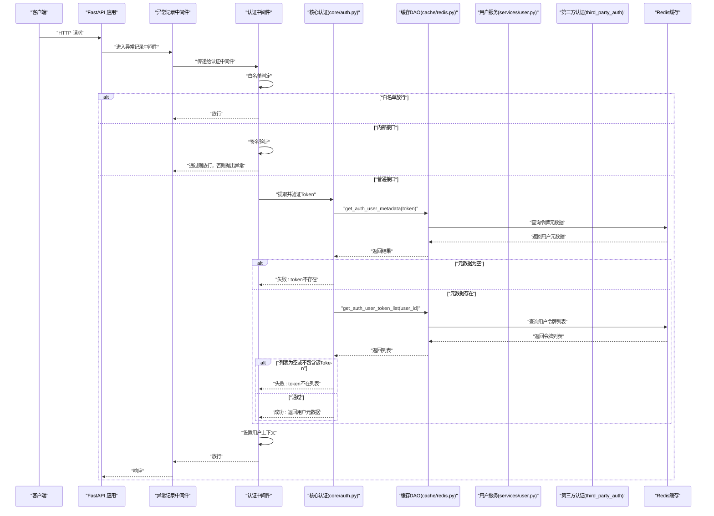
```mermaid
sequenceDiagram
participant Client as "客户端"
participant App as "FastAPI 应用"
participant Recorder as "异常记录中间件"
participant AuthMW as "认证中间件"
participant Core as "核心认证(core/auth.py)"
participant Cache as "缓存DAO(cache/redis.py)"
participant UserSvc as "用户服务(services/user.py)"
participant ThirdParty as "第三方认证(third_party_auth)"
participant Redis as "Redis缓存"
Client->>App : "HTTP 请求"
App->>Recorder : "进入异常记录中间件"
Recorder->>AuthMW : "传递给认证中间件"
AuthMW->>AuthMW : "白名单判定"
alt "白名单放行"
AuthMW-->>Recorder : "放行"
else "内部接口"
AuthMW->>AuthMW : "签名验证"
AuthMW-->>Recorder : "通过则放行，否则抛出异常"
else "普通接口"
AuthMW->>Core : "提取并验证Token"
Core->>Cache : "get_auth_user_metadata(token)"
Cache->>Redis : "查询令牌元数据"
Redis-->>Cache : "返回用户元数据"
Cache-->>Core : "返回结果"
alt "元数据为空"
Core-->>AuthMW : "失败 : token不存在"
else "元数据存在"
Core->>Cache : "get_auth_user_token_list(user_id)"
Cache->>Redis : "查询用户令牌列表"
Redis-->>Cache : "返回令牌列表"
Cache-->>Core : "返回列表"
alt "列表为空或不包含该Token"
Core-->>AuthMW : "失败 : token不在列表"
else "通过"
Core-->>AuthMW : "成功 : 返回用户元数据"
end
end
AuthMW->>AuthMW : "设置用户上下文"
AuthMW-->>Recorder : "放行"
Recorder-->>App : "响应"
end
```

**图表来源**
- [internal/middlewares/auth.py](file://internal/middlewares/auth.py#L88-L147)
- [internal/middlewares/recorder.py](file://internal/middlewares/recorder.py#L105-L148)
- [internal/core/auth.py](file://internal/core/auth.py#L5-L24)
- [internal/cache/redis.py](file://internal/cache/redis.py#L19-L33)

## 详细组件分析

### Redis Token认证组件
- **功能职责**
  - 生成安全的随机令牌（tk_前缀 + 32字符十六进制）
  - 将令牌存储到Redis，键格式为token:{token}
  令牌有效期30分钟，过期自动失效
  - 支持令牌的快速验证和批量管理
- **关键点**
  - 使用secrets模块生成加密安全的随机令牌
  - 令牌有效期30分钟，过期自动失效
  - 支持令牌的快速验证和批量管理
- **与中间件集成**
  - 中间件在普通接口路径下调用核心认证进行令牌验证

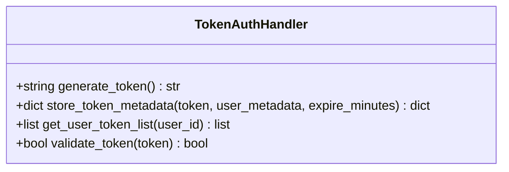
```mermaid
classDiagram
class TokenAuthHandler {
+string generate_token() str
+dict store_token_metadata(token, user_metadata, expire_minutes) dict
+list get_user_token_list(user_id) list
+bool validate_token(token) bool
}
```

**图表来源**
- [internal/controllers/api/auth.py](file://internal/controllers/api/auth.py#L27-L93)
- [internal/cache/redis.py](file://internal/cache/redis.py#L11-L33)

**章节来源**
- [internal/controllers/api/auth.py](file://internal/controllers/api/auth.py#L27-L93)
- [internal/middlewares/auth.py](file://internal/middlewares/auth.py#L128-L146)

### 密码加密处理组件
- **功能职责**
  - 使用bcrypt算法对密码进行哈希加密
  - 验证用户输入的密码是否正确
  - 检测密码哈希是否需要重新加密
- **关键点**
  - 自动加盐：每次加密都会生成随机盐值
  - 计算成本12，提供良好的安全性和性能平衡
  - 不可逆加密，无法从哈希还原原始密码
- **初始化与使用**
  - 通过UserService集成到用户注册和登录流程

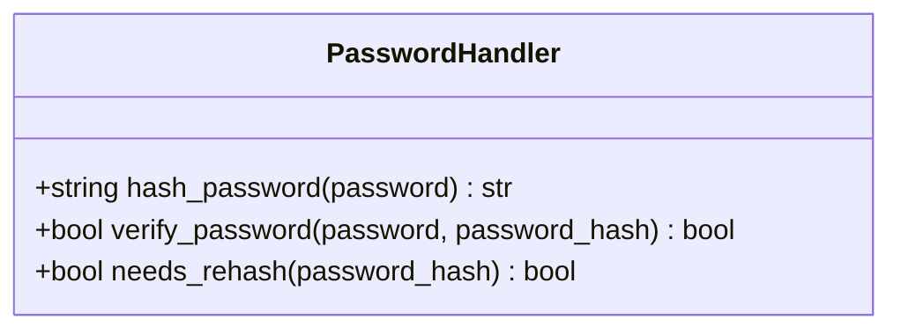
```mermaid
classDiagram
class PasswordHandler {
+string hash_password(password) str
+bool verify_password(password, password_hash) bool
+bool needs_rehash(password_hash) bool
}
```

**图表来源**
- [internal/utils/password.py](file://internal/utils/password.py#L6-L84)

**章节来源**
- [internal/utils/password.py](file://internal/utils/password.py#L6-L84)
- [internal/services/user.py](file://internal/services/user.py#L22-L66)

### 用户令牌列表管理
- **功能职责**
  - 维护用户的所有活跃令牌
  - 支持令牌的添加、移除和批量查询
  - 登出时从用户令牌列表中移除对应令牌
- **关键点**
  - 令牌列表键格式为token_list:{user_id}
  - 支持令牌的快速查找和批量管理
  - 与核心认证配合，确保令牌的有效性

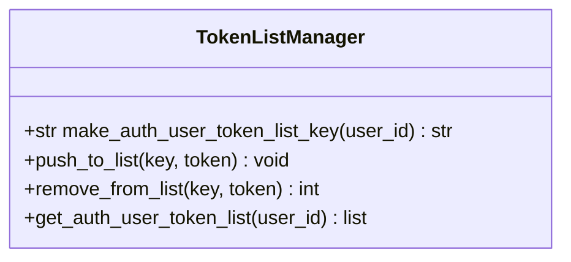
```mermaid
classDiagram
class TokenListManager {
+str make_auth_user_token_list_key(user_id) str
+push_to_list(key, token) void
+remove_from_list(key, token) int
+get_auth_user_token_list(user_id) list
}
```

**图表来源**
- [internal/cache/redis.py](file://internal/cache/redis.py#L15-L37)

**章节来源**
- [internal/cache/redis.py](file://internal/cache/redis.py#L15-L37)
- [internal/controllers/api/auth.py](file://internal/controllers/api/auth.py#L84-L130)

### 认证中间件
- **功能职责**
  - 白名单放行：公开路径、文档路径、登录/注册等无需认证
  - 内部接口签名认证：要求X-Signature、X-Timestamp、X-Nonce
  - 普通接口Token认证：从Authorization头提取并验证Redis中的令牌
  - 设置用户上下文：成功后将用户ID写入上下文
- **路径策略**
  - 公共路径、测试路径、白名单路径精确匹配放行
  - 内部接口路径强制签名认证
  - 其余路径强制Redis Token认证

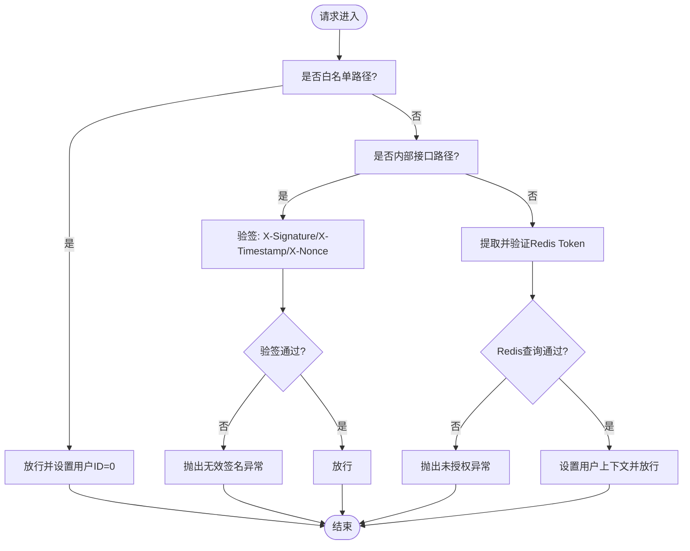
```mermaid
flowchart TD
Start(["请求进入"]) --> CheckWhite["是否白名单路径?"]
CheckWhite --> |是| Allow1["放行并设置用户ID=0"]
CheckWhite --> |否| CheckInternal["是否内部接口路径?"]
CheckInternal --> |是| VerifySig["验签: X-Signature/X-Timestamp/X-Nonce"]
VerifySig --> SigOK{"验签通过?"}
SigOK --> |否| Deny1["抛出无效签名异常"]
SigOK --> |是| Allow2["放行"]
CheckInternal --> |否| VerifyToken["提取并验证Redis Token"]
VerifyToken --> TokenOK{"Redis查询通过?"}
TokenOK --> |否| Deny2["抛出未授权异常"]
TokenOK --> |是| SetCtx["设置用户上下文并放行"]
Allow1 --> End(["结束"])
Allow2 --> End
SetCtx --> End
Deny1 --> End
Deny2 --> End
```

**图表来源**
- [internal/middlewares/auth.py](file://internal/middlewares/auth.py#L88-L147)

**章节来源**
- [internal/middlewares/auth.py](file://internal/middlewares/auth.py#L13-L147)

### 核心认证与缓存交互
- **功能职责**
  - 从Redis缓存查询令牌对应的用户元数据
  - 从Redis缓存查询用户的令牌列表，确保令牌在有效列表内
  - 验证用户ID的有效性
- **错误处理**
  - 任一步缺失或不匹配均视为认证失败
  - 提供详细的错误信息和日志记录

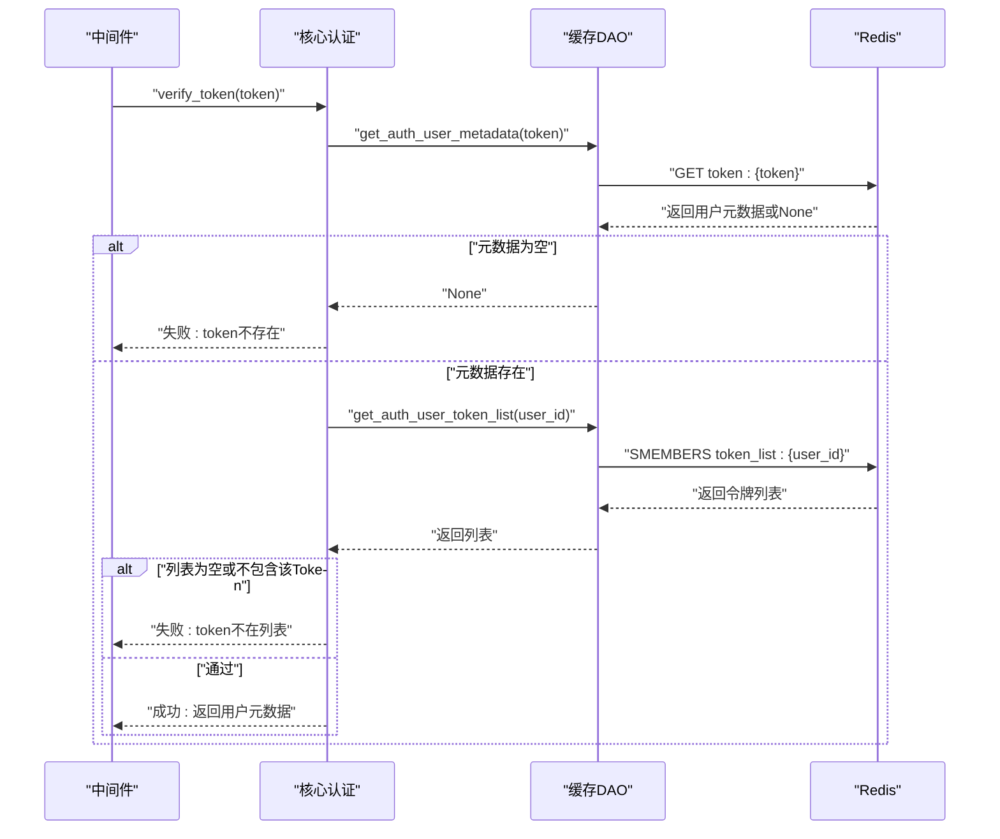
```mermaid
sequenceDiagram
participant MW as "中间件"
participant Core as "核心认证"
participant Cache as "缓存DAO"
participant Redis as "Redis"
MW->>Core : "verify_token(token)"
Core->>Cache : "get_auth_user_metadata(token)"
Cache->>Redis : "GET token : {token}"
Redis-->>Cache : "返回用户元数据或None"
alt "元数据为空"
Cache-->>Core : "None"
Core-->>MW : "失败 : token不存在"
else "元数据存在"
Core->>Cache : "get_auth_user_token_list(user_id)"
Cache->>Redis : "SMEMBERS token_list : {user_id}"
Redis-->>Cache : "返回令牌列表"
Cache-->>Core : "返回列表"
alt "列表为空或不包含该Token"
Core-->>MW : "失败 : token不在列表"
else "通过"
Core-->>MW : "成功 : 返回用户元数据"
end
end
```

**图表来源**
- [internal/core/auth.py](file://internal/core/auth.py#L5-L24)
- [internal/cache/redis.py](file://internal/cache/redis.py#L19-L33)

**章节来源**
- [internal/core/auth.py](file://internal/core/auth.py#L5-L24)
- [internal/cache/redis.py](file://internal/cache/redis.py#L19-L33)

### 统一异常处理机制
- **功能职责**
  - 捕获所有未处理的异常，提供统一的日志记录
  - 根据异常类型构建相应的错误响应
  - 支持业务异常和意外异常的详细堆栈跟踪
  - 保留原始错误信息，便于调试和故障排查
- **关键特性**
  - 使用异常链（raise ... from ...）保留原始错误上下文
  - 业务异常使用警告级别日志，意外异常使用错误级别日志
  - 支持AppException和RequestValidationError的特殊处理
  - 提供标准化的错误响应格式

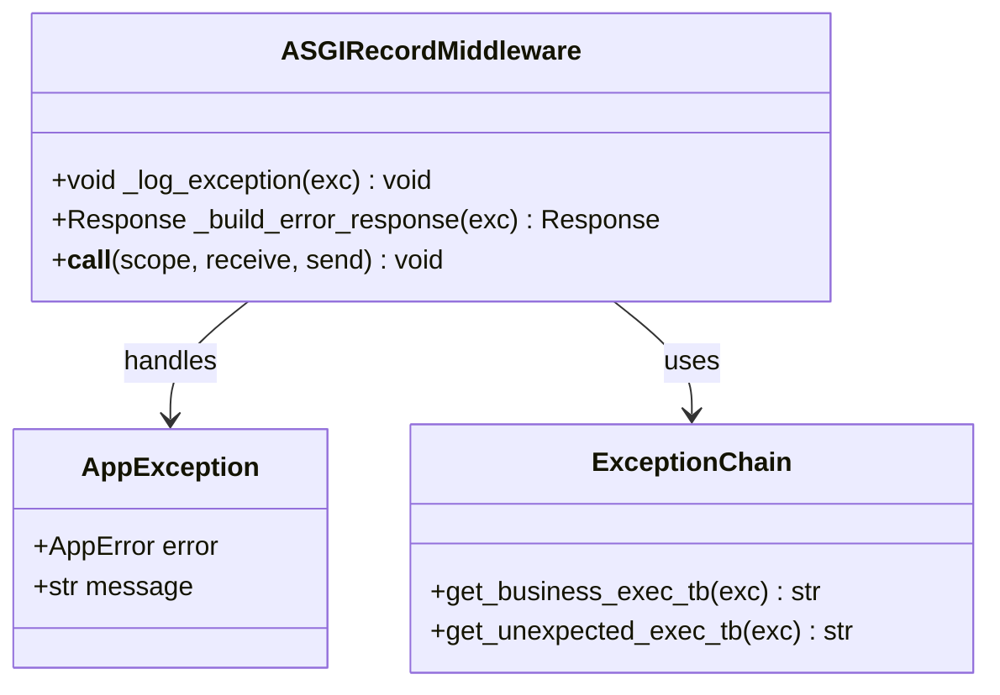
```mermaid
classDiagram
class ASGIRecordMiddleware {
+void _log_exception(exc) void
+Response _build_error_response(exc) Response
+__call__(scope, receive, send) void
}
class AppException {
+AppError error
+str message
}
class ExceptionChain {
+get_business_exec_tb(exc) str
+get_unexpected_exec_tb(exc) str
}
ASGIRecordMiddleware --> AppException : handles
ASGIRecordMiddleware --> ExceptionChain : uses
```

**图表来源**
- [internal/middlewares/recorder.py](file://internal/middlewares/recorder.py#L68-L148)
- [internal/core/exception.py](file://internal/core/exception.py#L4-L38)
- [pkg/toolkit/exc.py](file://pkg/toolkit/exc.py#L10-L16)

**章节来源**
- [internal/middlewares/recorder.py](file://internal/middlewares/recorder.py#L68-L148)
- [internal/core/exception.py](file://internal/core/exception.py#L4-L38)
- [pkg/toolkit/exc.py](file://pkg/toolkit/exc.py#L10-L16)

### 注册接口异常链改进
- **功能职责**
  - 处理用户注册过程中的各种异常情况
  - 使用异常链保留原始错误信息，便于调试
  - 提供标准化的错误响应，区分业务错误和系统错误
- **关键改进**
  - ValueError异常通过异常链保留原始错误消息
  - 其他异常统一转换为AppException，提供友好的错误提示
  - 保持原始异常的堆栈信息，便于问题定位

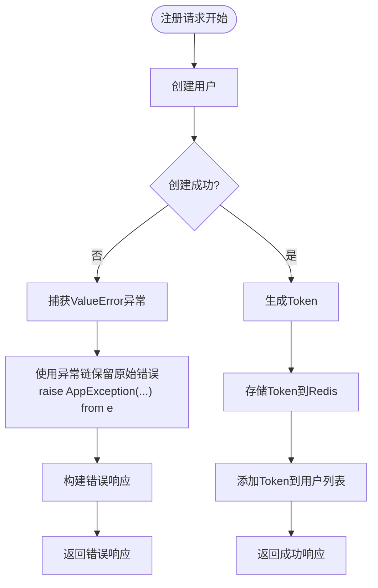
```mermaid
flowchart TD
RegisterStart(["注册请求开始"]) --> CreateUser["创建用户"]
CreateUser --> CreateOK{"创建成功?"}
CreateOK --> |否| HandleValueError["捕获ValueError异常"]
HandleValueError --> ChainValueError["使用异常链保留原始错误<br/>raise AppException(...) from e"]
CreateOK --> |是| GenerateToken["生成Token"]
GenerateToken --> StoreToken["存储Token到Redis"]
StoreToken --> AddToList["添加Token到用户列表"]
AddToList --> Success["返回成功响应"]
ChainValueError --> BuildErrorResponse["构建错误响应"]
BuildErrorResponse --> ReturnError["返回错误响应"]
```

**图表来源**
- [internal/controllers/api/auth.py](file://internal/controllers/api/auth.py#L133-L184)

**章节来源**
- [internal/controllers/api/auth.py](file://internal/controllers/api/auth.py#L133-L184)

### 第三方认证系统

#### 第三方认证策略基类
- **功能职责**
  - 定义统一的第三方认证策略接口
  - 提供抽象方法：get_access_token、get_user_info、get_platform_name
  - 支持资源清理的close方法
- **关键特性**
  - 策略类无状态，配置通过构造函数注入
  - 支持异步操作，适配现代Web应用需求
  - 提供标准化的ThirdPartyUserInfo数据结构

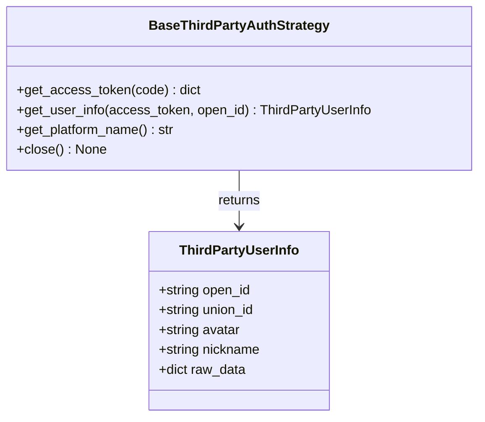
```mermaid
classDiagram
class BaseThirdPartyAuthStrategy {
+get_access_token(code) dict
+get_user_info(access_token, open_id) ThirdPartyUserInfo
+get_platform_name() str
+close() None
}
class ThirdPartyUserInfo {
+string open_id
+string union_id
+string avatar
+string nickname
+dict raw_data
}
BaseThirdPartyAuthStrategy --> ThirdPartyUserInfo : returns
```

**图表来源**
- [pkg/third_party_auth/base.py](file://pkg/third_party_auth/base.py#L27-L85)

**章节来源**
- [pkg/third_party_auth/base.py](file://pkg/third_party_auth/base.py#L27-L85)

#### 微信OAuth2.0登录策略
- **功能职责**
  - 实现微信OAuth2.0认证流程
  - 通过授权码获取access_token和openid
  - 获取微信用户详细信息
  - 标准化用户信息格式
- **关键实现**
  - 使用微信官方API端点：ACCESS_TOKEN_URL和USER_INFO_URL
  - 支持AsyncHttpClient进行异步HTTP请求
  - 完整的错误处理和日志记录
  - 资源自动清理机制

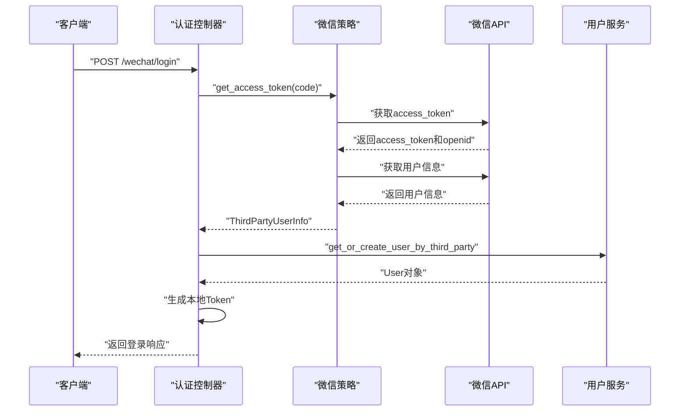
```mermaid
sequenceDiagram
participant Client as "客户端"
participant Controller as "认证控制器"
participant Strategy as "微信策略"
participant WeChatAPI as "微信API"
participant UserService as "用户服务"
Client->>Controller : "POST /wechat/login"
Controller->>Strategy : "get_access_token(code)"
Strategy->>WeChatAPI : "获取access_token"
WeChatAPI-->>Strategy : "返回access_token和openid"
Strategy->>WeChatAPI : "获取用户信息"
WeChatAPI-->>Strategy : "返回用户信息"
Strategy-->>Controller : "ThirdPartyUserInfo"
Controller->>UserService : "get_or_create_user_by_third_party"
UserService-->>Controller : "User对象"
Controller->>Controller : "生成本地Token"
Controller-->>Client : "返回登录响应"
```

**图表来源**
- [internal/controllers/api/auth.py](file://internal/controllers/api/auth.py#L219-L299)
- [pkg/third_party_auth/strategies/wechat.py](file://pkg/third_party_auth/strategies/wechat.py#L50-L138)

**章节来源**
- [pkg/third_party_auth/strategies/wechat.py](file://pkg/third_party_auth/strategies/wechat.py#L12-L138)
- [internal/controllers/api/auth.py](file://internal/controllers/api/auth.py#L219-L299)

#### 第三方认证工厂
- **功能职责**
  - 管理认证策略的注册和获取
  - 支持动态注册新的认证策略
  - 提供平台枚举和可用平台列表
- **关键特性**
  - 使用字典存储策略映射
  - 支持字符串和枚举两种平台标识
  - 提供日志记录和错误处理

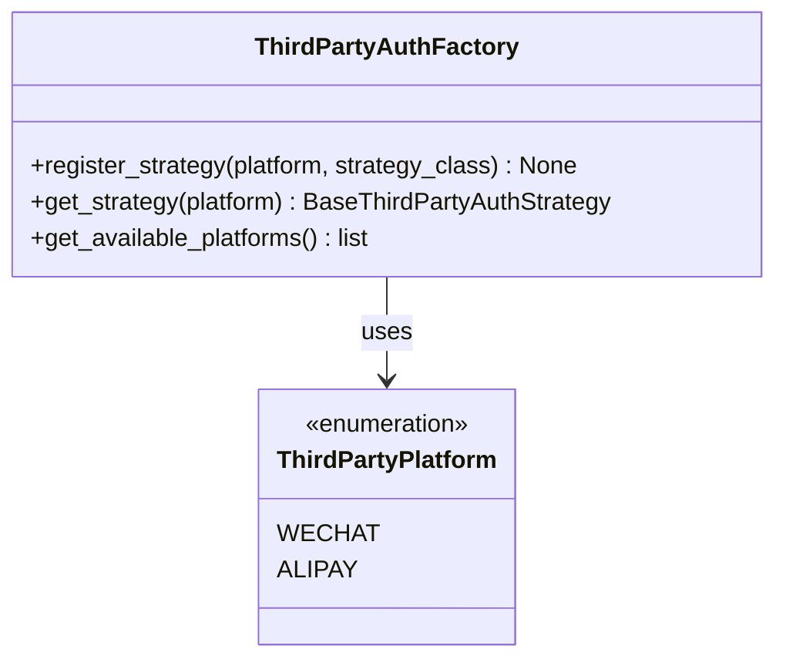
```mermaid
classDiagram
class ThirdPartyAuthFactory {
+register_strategy(platform, strategy_class) None
+get_strategy(platform) BaseThirdPartyAuthStrategy
+get_available_platforms() list
}
class ThirdPartyPlatform {
<<enumeration>>
WECHAT
ALIPAY
}
ThirdPartyAuthFactory --> ThirdPartyPlatform : uses
```

**图表来源**
- [pkg/third_party_auth/factory.py](file://pkg/third_party_auth/factory.py#L23-L117)

**章节来源**
- [pkg/third_party_auth/factory.py](file://pkg/third_party_auth/factory.py#L23-L117)

#### 用户绑定机制
- **功能职责**
  - 支持第三方账号与现有用户的绑定
  - 防止第三方账号被重复绑定
  - 更新用户第三方平台相关信息
- **关键实现**
  - 检查第三方账号是否已被其他用户绑定
  - 根据平台类型更新相应字段
  - 提供清晰的错误提示

**章节来源**
- [internal/services/user.py](file://internal/services/user.py#L129-L172)
- [internal/dao/user.py](file://internal/dao/user.py#L23-L39)

### 配置与密钥管理
- **配置项**
  - JWT_ALGORITHM：JWT签名算法（用于签名认证）
  - ACCESS_TOKEN_EXPIRE_MINUTES：Token过期时间（30分钟）
  - REDIS_*：Redis连接参数（主机、端口、密码、数据库）
  - DB_*：数据库连接参数
  - WECHAT_APP_ID/WECHAT_APP_SECRET：微信认证配置
- **环境文件**
  - 开发/生产环境分别维护，便于差异化配置
- **初始化**
  - 应用生命周期中初始化Redis连接、签名处理器和各种服务

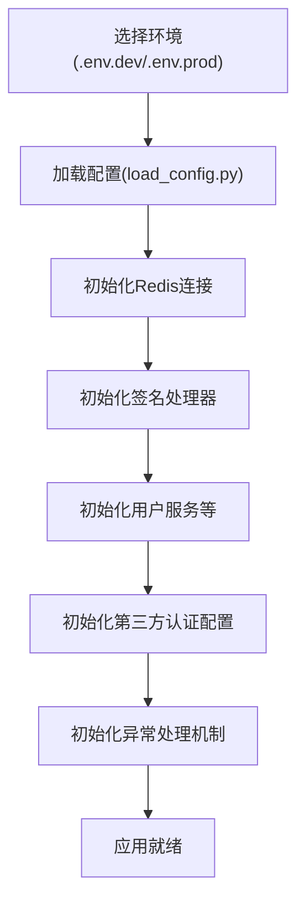
```mermaid
flowchart TD
Env["选择环境(.env.dev/.env.prod)"] --> LoadCfg["加载配置(load_config.py)"]
LoadCfg --> InitRedis["初始化Redis连接"]
InitRedis --> InitSig["初始化签名处理器"]
InitSig --> InitServices["初始化用户服务等"]
InitServices --> InitThirdParty["初始化第三方认证配置"]
InitThirdParty --> InitException["初始化异常处理机制"]
InitException --> Ready["应用就绪"]
```

**图表来源**
- [internal/app.py](file://internal/app.py#L80-L107)
- [configs/.env.dev](file://configs/.env.dev#L1-L22)
- [configs/.env.prod](file://configs/.env.prod#L1-L22)

**章节来源**
- [internal/app.py](file://internal/app.py#L80-L107)
- [configs/.env.dev](file://configs/.env.dev#L1-L22)
- [configs/.env.prod](file://configs/.env.prod#L1-L22)

## 依赖分析
- **中间件依赖**
  - 认证中间件依赖核心认证和签名处理器
  - 核心认证依赖缓存DAO和Redis基础设施
  - 异常记录中间件依赖AppException和异常工具类
- **服务层依赖**
  - 用户服务依赖密码处理和DAO层
  - 认证控制器依赖用户服务和缓存DAO
  - 第三方认证服务依赖策略基类和配置管理
- **第三方认证依赖**
  - 策略实现依赖HTTP客户端和配置类
  - 工厂模式依赖策略基类和平台枚举
  - 用户服务依赖DAO层进行第三方账号查询
- **配置依赖**
  - Redis连接依赖配置中的连接参数
  - 签名处理器依赖配置中的密钥
  - 第三方认证依赖配置中的平台密钥
- **应用集成**
  - 应用在生命周期中初始化Redis、签名处理器和其它基础设施
  - 异常记录中间件在整个应用层提供统一异常处理

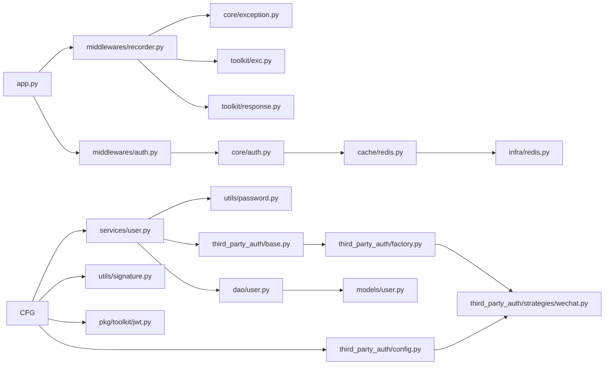
```mermaid
graph LR
APP["app.py"] --> RECORDER["middlewares/recorder.py"]
APP --> MW["middlewares/auth.py"]
RECORDER --> CORE_EXCEPTION["core/exception.py"]
RECORDER --> EXC_UTIL["toolkit/exc.py"]
RECORDER --> RESPONSE["toolkit/response.py"]
MW --> CORE_AUTH["core/auth.py"]
CORE_AUTH --> CACHE_DAO["cache/redis.py"]
CACHE_DAO --> REDIS_INFRA["infra/redis.py"]
CFG --> USER_SERVICE["services/user.py"]
USER_SERVICE --> PASSWORD_HANDLER["utils/password.py"]
CFG --> SIGNATURE_UTIL["utils/signature.py"]
CFG --> JWT_TOOL["pkg/toolkit/jwt.py"]
CFG --> THIRD_PARTY_CONFIG["third_party_auth/config.py"]
THIRD_PARTY_BASE["third_party_auth/base.py"] --> THIRD_PARTY_FACTORY["third_party_auth/factory.py"]
THIRD_PARTY_FACTORY --> WECHAT_STRATEGY["third_party_auth/strategies/wechat.py"]
THIRD_PARTY_CONFIG --> WECHAT_STRATEGY
USER_SERVICE --> THIRD_PARTY_BASE
USER_SERVICE --> USER_DAO["dao/user.py"]
USER_DAO --> USER_MODEL["models/user.py"]
```

**图表来源**
- [internal/app.py](file://internal/app.py#L80-L107)
- [internal/middlewares/auth.py](file://internal/middlewares/auth.py#L6-L10)
- [internal/middlewares/recorder.py](file://internal/middlewares/recorder.py#L1-L15)
- [internal/core/auth.py](file://internal/core/auth.py#L1-L2)
- [internal/cache/redis.py](file://internal/cache/redis.py#L1-L3)
- [internal/infra/redis.py](file://internal/infra/redis.py#L1-L98)
- [internal/services/user.py](file://internal/services/user.py#L1-L3)
- [internal/utils/password.py](file://internal/utils/password.py#L1-L3)
- [internal/utils/signature.py](file://internal/utils/signature.py#L1-L26)
- [pkg/toolkit/jwt.py](file://pkg/toolkit/jwt.py#L1-L5)
- [pkg/third_party_auth/base.py](file://pkg/third_party_auth/base.py#L1-L3)
- [pkg/third_party_auth/config.py](file://pkg/third_party_auth/config.py#L1-L3)
- [pkg/third_party_auth/factory.py](file://pkg/third_party_auth/factory.py#L1-L9)
- [pkg/third_party_auth/strategies/wechat.py](file://pkg/third_party_auth/strategies/wechat.py#L1-L9)
- [internal/dao/user.py](file://internal/dao/user.py#L1-L3)
- [internal/models/user.py](file://internal/models/user.py#L1-L3)

**章节来源**
- [internal/app.py](file://internal/app.py#L80-L107)
- [internal/middlewares/auth.py](file://internal/middlewares/auth.py#L6-L10)
- [internal/middlewares/recorder.py](file://internal/middlewares/recorder.py#L1-L15)
- [internal/core/auth.py](file://internal/core/auth.py#L1-L2)
- [internal/cache/redis.py](file://internal/cache/redis.py#L1-L3)
- [internal/infra/redis.py](file://internal/infra/redis.py#L1-L98)
- [internal/services/user.py](file://internal/services/user.py#L1-L3)
- [internal/utils/password.py](file://internal/utils/password.py#L1-L3)
- [internal/utils/signature.py](file://internal/utils/signature.py#L1-L26)
- [pkg/toolkit/jwt.py](file://pkg/toolkit/jwt.py#L1-L5)
- [pkg/third_party_auth/base.py](file://pkg/third_party_auth/base.py#L1-L85)
- [pkg/third_party_auth/config.py](file://pkg/third_party_auth/config.py#L1-L48)
- [pkg/third_party_auth/factory.py](file://pkg/third_party_auth/factory.py#L1-L117)
- [pkg/third_party_auth/strategies/wechat.py](file://pkg/third_party_auth/strategies/wechat.py#L1-L138)
- [internal/dao/user.py](file://internal/dao/user.py#L1-L49)
- [internal/models/user.py](file://internal/models/user.py#L1-L36)

## 性能考虑
- **Redis性能优化**
  - Token存储使用哈希结构，支持快速读取和过期管理
  - 用户令牌列表使用集合结构，支持高效的成员查询
  - 连接池配置合理的最大连接数，避免连接争用
- **内存操作优势**
  - Token验证为内存操作，主要开销在Redis网络往返
  - 用户元数据存储在Redis中，支持快速序列化和反序列化
- **第三方认证性能**
  - 微信API调用使用异步HTTP客户端，避免阻塞
  - 策略类无状态设计，支持并发调用
  - 配置注入避免重复初始化
- **异常处理性能**
  - 异常记录中间件仅在发生异常时进行额外处理
  - 异常链保留原始错误信息，不会显著影响正常请求性能
  - 错误响应构建使用高性能JSON序列化
- **建议**
  - 合理设置过期时间（30分钟），平衡安全性与用户体验
  - 使用连接池与合适的超时配置，避免阻塞
  - 对高频接口可考虑本地缓存热点用户元数据（需配合失效策略）
  - 定期清理过期的令牌和用户令牌列表
  - 监控异常处理中间件的性能指标

## 故障排查指南
- **常见问题与定位**
  - 未携带或格式错误的Authorization头：中间件直接抛出未授权异常
  - Redis连接失败：检查Redis服务器状态和连接参数配置
  - Token不存在或不在用户令牌列表：核心认证返回失败
  - 签名验签失败：检查时间戳是否在容忍范围内、随机串是否一致、密钥是否正确
  - 密码验证失败：检查密码哈希格式和bcrypt版本兼容性
  - 注册失败：检查异常链中的原始错误信息，定位具体失败原因
  - 微信登录失败：检查授权码是否有效、微信API返回错误、配置参数是否正确
  - 第三方账号绑定冲突：检查该账号是否已被其他用户绑定
- **异常链调试技巧**
  - 查看业务异常的详细堆栈信息，识别原始错误来源
  - 检查意外异常的完整堆栈跟踪，定位系统级问题
  - 使用X-Trace-ID头部进行请求追踪，关联相关日志
- **测试参考**
  - JWT工具的单元测试覆盖了多种边界场景，可作为行为参考
  - 密码处理组件提供完整的加密和验证测试用例
  - 认证接口测试验证了基本的认证流程
  - 第三方认证策略提供完整的OAuth2.0流程测试

**章节来源**
- [internal/middlewares/auth.py](file://internal/middlewares/auth.py#L128-L146)
- [internal/core/auth.py](file://internal/core/auth.py#L5-L24)
- [internal/middlewares/recorder.py](file://internal/middlewares/recorder.py#L72-L103)
- [pkg/toolkit/exc.py](file://pkg/toolkit/exc.py#L10-L16)
- [tests/toolkit/test_jwt.py](file://tests/toolkit/test_jwt.py#L20-L112)
- [pkg/third_party_auth/strategies/wechat.py](file://pkg/third_party_auth/strategies/wechat.py#L72-L84)

## 结论
本项目采用"中间件统一拦截 + Redis Token认证 + 缓存校验 + 统一异常处理"的认证架构，实现了从传统JWT认证到现代Redis Token认证的迁移。通过bcrypt密码加密、用户令牌列表管理和Redis高性能缓存，提供了更安全、更灵活的认证机制。

**新增的第三方认证系统**显著增强了整体认证能力：
- **策略模式架构**：支持微信、支付宝等平台的统一接入，易于扩展新平台
- **OAuth2.0流程**：完整的授权码换取access_token和用户信息获取流程
- **用户绑定机制**：防止第三方账号冲突，支持账号合并
- **类型安全配置**：WeChatConfig等配置类提供编译时检查
- **异步处理**：基于AsyncHttpClient的非阻塞API调用

新的架构支持令牌的批量管理、快速验证和灵活的过期控制，同时通过异常链改进和统一异常处理机制，显著提升了调试能力和故障排查效率。建议在现有基础上进一步完善权限控制与审计能力，并持续优化Redis配置和令牌管理策略以提升整体安全性与可用性。

## 附录

### 安全配置清单
- **必填项**
  - JWT_SECRET：用于JWT与签名的密钥
  - JWT_ALGORITHM：JWT签名算法（HS256）
  - ACCESS_TOKEN_EXPIRE_MINUTES：Token过期时间（30分钟）
  - REDIS_HOST/REDIS_PORT/REDIS_PASSWORD/REDIS_DB：Redis连接参数
  - WECHAT_APP_ID/WECHAT_APP_SECRET：微信OAuth2.0应用配置
- **可选项**
  - BACKEND_CORS_ORIGINS：跨域来源
  - DB_*：数据库连接参数

**章节来源**
- [configs/.env.dev](file://configs/.env.dev#L1-L22)
- [configs/.env.prod](file://configs/.env.prod#L1-L22)
- [pkg/third_party_auth/config.py](file://pkg/third_party_auth/config.py#L6-L24)

### 认证流程与最佳实践
- **认证流程**
  - 白名单放行 → 内部接口签名认证 → 普通接口Redis Token认证
  - 第三方平台登录：授权码换取access_token → 获取用户信息 → 用户绑定/创建 → 生成本地Token
- **最佳实践**
  - 使用HTTPS传输，避免明文泄露
  - 定期轮换密钥，启用密钥备份与回滚
  - 合理设置Token过期时间（30分钟），结合刷新策略
  - 对敏感操作增加二次校验（如短信/邮箱验证码）
  - 记录审计日志，保留请求头与用户上下文关键信息
  - 使用bcrypt进行密码加密，定期检查密码哈希需要重新加密的情况
  - 利用异常链机制保留原始错误信息，提升调试效率
  - 第三方认证使用异步处理，避免阻塞主线程
  - 配置参数进行类型检查，防止运行时错误

### CSRF防护、会话管理与安全审计
- **CSRF防护**
  - 本项目以Token与签名为主，建议在前端侧配合SameSite Cookie与自定义头部策略
- **会话管理**
  - 建议引入会话ID与Token绑定，结合黑名单与过期控制
  - 支持用户多设备登录，令牌列表管理支持并发会话
  - 第三方认证支持多平台账号绑定，防止重复绑定
- **安全审计**
  - 记录认证失败原因、用户ID、IP、UA、时间戳等，定期分析异常模式
  - 监控Redis连接状态和认证成功率
  - 定期清理过期令牌和异常用户活动
  - 利用异常链跟踪系统级错误，及时发现潜在问题
  - 第三方认证记录授权流程和API调用状态

### Redis Token认证优势
- **安全性**
  - 令牌不可预测，使用加密安全的随机数生成
  - 支持令牌批量管理，便于撤销和登出
  - 用户元数据存储在Redis中，支持快速验证
- **性能**
  - Redis内存存储，验证速度快
  - 支持过期自动清理，减少内存占用
  - 集合操作支持高效的令牌查询
- **灵活性**
  - 支持不同用户设备的并发登录
  - 令牌过期时间可灵活配置
  - 支持令牌的主动撤销和批量清理
- **可维护性**
  - 异常链机制保留原始错误信息，便于问题定位
  - 统一异常处理中间件提供一致的错误响应格式
  - 详细的日志记录支持完整的审计需求

### 第三方认证系统优势
- **可扩展性**
  - 策略模式支持轻松添加新平台（如支付宝、Google、GitHub）
  - 工厂模式统一管理策略注册和获取
  - 配置类提供类型安全的参数验证
- **安全性**
  - OAuth2.0标准流程，遵循行业最佳实践
  - 异步HTTP客户端避免阻塞和资源泄漏
  - 完整的错误处理和日志记录
- **易用性**
  - 统一的ThirdPartyUserInfo数据结构
  - 简洁的API接口，易于集成和使用
  - 详细的文档和使用示例
- **性能**
  - 异步处理避免阻塞主线程
  - 策略类无状态设计，支持并发调用
  - 配置注入避免重复初始化开销

### 异常链改进详情
- **改进内容**
  - 注册接口使用异常链保留原始错误信息
  - ValueError异常通过异常链转换为业务异常
  - 其他异常统一转换为系统异常，提供友好提示
- **技术实现**
  - 使用`raise ... from ...`语法保留原始异常上下文
  - 异常记录中间件提供详细的堆栈跟踪信息
  - 标准化的错误响应格式，包含错误码和详细信息
- **调试优势**
  - 业务异常显示最近的3行堆栈信息
  - 意外异常显示最近的10行堆栈信息
  - 支持X-Trace-ID进行请求追踪和关联日志