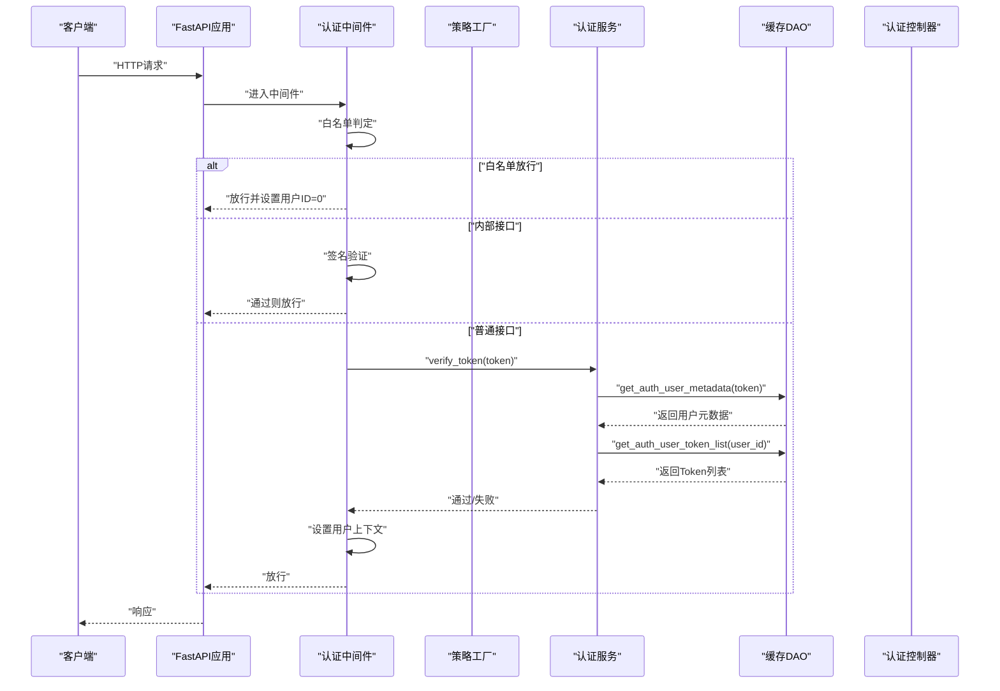
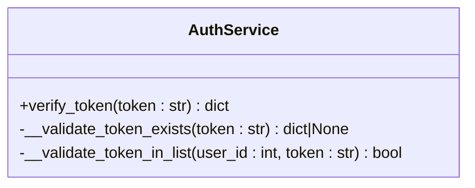
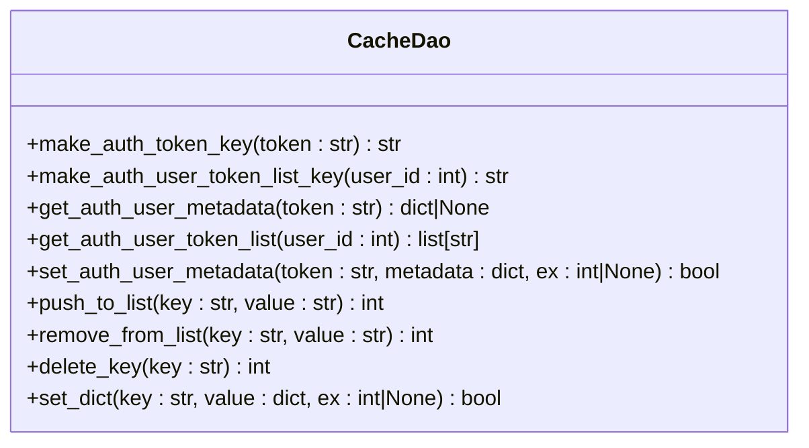
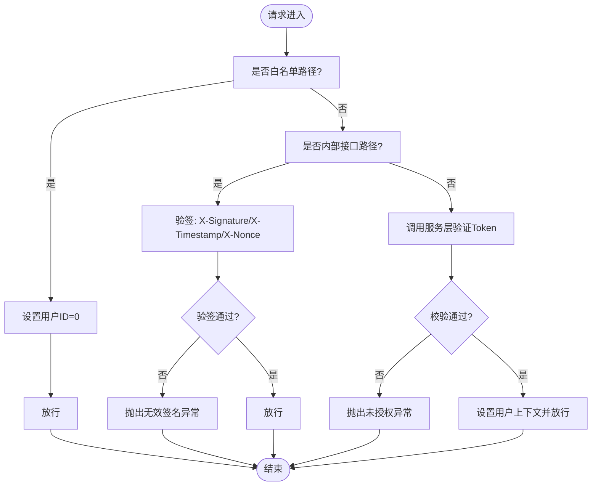
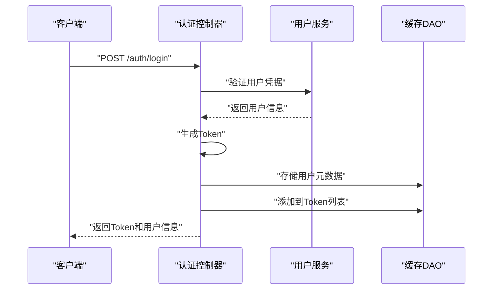
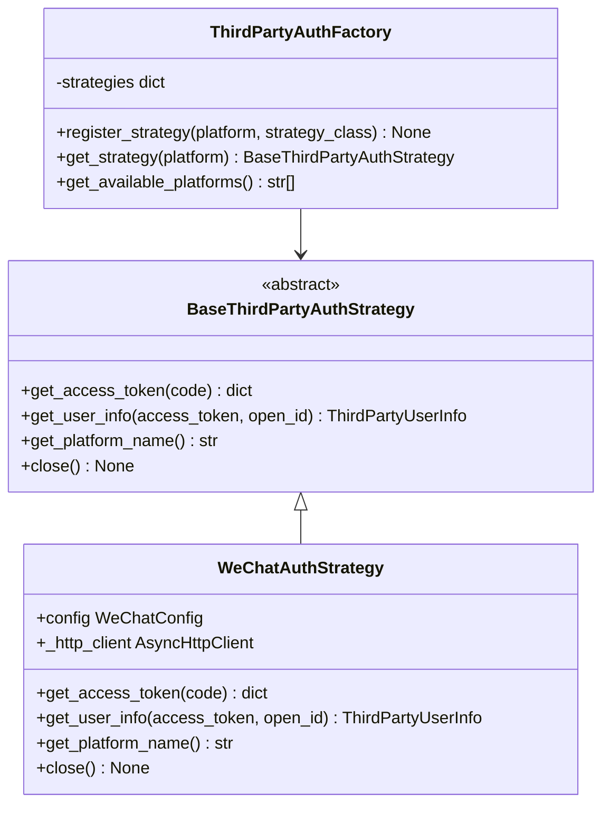
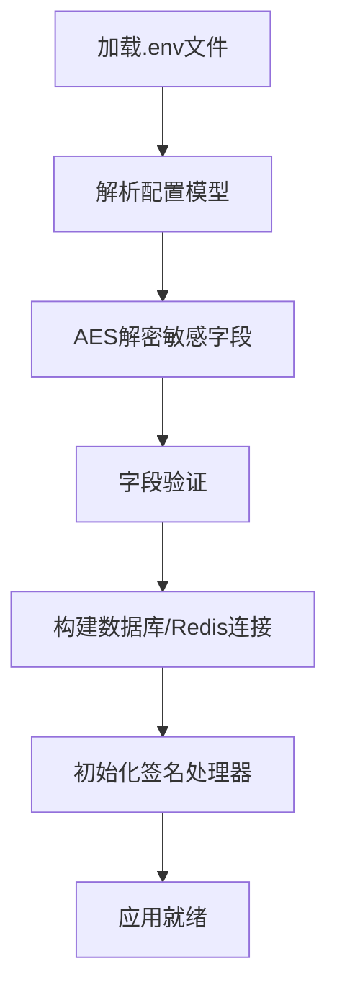
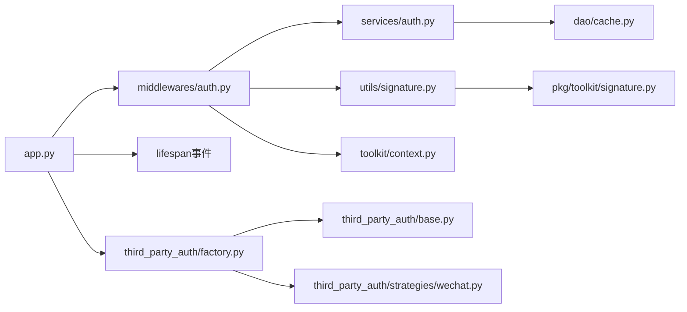

# 安全认证机制

<cite>
**本文引用的文件**
- [internal/middlewares/auth.py](file://internal/middlewares/auth.py)
- [internal/services/auth.py](file://internal/services/auth.py)
- [internal/dao/cache.py](file://internal/dao/cache.py)
- [internal/controllers/api/auth.py](file://internal/controllers/api/auth.py)
- [pkg/toolkit/jwt.py](file://pkg/toolkit/jwt.py)
- [pkg/toolkit/signature.py](file://pkg/toolkit/signature.py)
- [internal/utils/signature.py](file://internal/utils/signature.py)
- [internal/config/settings.py](file://internal/config/settings.py)
- [internal/app.py](file://internal/app.py)
- [pkg/third_party_auth/factory.py](file://pkg/third_party_auth/factory.py)
- [pkg/third_party_auth/base.py](file://pkg/third_party_auth/base.py)
- [pkg/third_party_auth/strategies/wechat.py](file://pkg/third_party_auth/strategies/wechat.py)
- [docs/auth_module_guide.md](file://docs/auth_module_guide.md)
- [tests/api/test_auth.py](file://tests/api/test_auth.py)
- [tests/toolkit/test_jwt.py](file://tests/toolkit/test_jwt.py)
- [internal/core/errors.py](file://internal/core/errors.py)
- [internal/core/exception.py](file://internal/core/exception.py)
- [pkg/toolkit/context.py](file://pkg/toolkit/context.py)
</cite>

## 更新摘要
**所做更改**
- 完全重构认证系统架构，从JWT迁移到Redis Token认证机制
- **新增服务层架构**：认证逻辑从 `internal/core/auth.py` 移动到 `internal/services/auth.py`
- 新增第三方认证框架支持，包括微信登录等策略
- 更新认证中间件实现，支持多层级认证策略
- 重新设计Redis缓存结构，优化Token存储和管理
- 新增第三方认证策略工厂模式，支持动态注册和扩展
- **引入DAO层分离**：缓存操作通过专门的DAO类进行管理

## 目录
1. [简介](#简介)
2. [项目结构](#项目结构)
3. [核心组件](#核心组件)
4. [架构总览](#架构总览)
5. [详细组件分析](#详细组件分析)
6. [依赖分析](#依赖分析)
7. [性能考虑](#性能考虑)
8. [故障排查指南](#故障排查指南)
9. [结论](#结论)
10. [附录](#附录)

## 简介
本文件系统性梳理本项目的安全认证机制，涵盖以下方面：
- **Redis Token认证机制**：基于Redis的Token存储与验证，替代传统的JWT方案
- **服务层架构设计**：采用分层架构，将认证逻辑从核心层分离到服务层
- **第三方认证框架**：支持微信、支付宝等第三方平台的统一认证策略
- **多层级认证中间件**：白名单放行、内部接口签名认证、普通接口Token认证
- **权限控制与访问控制**：基于用户上下文的权限管理和访问控制
- **安全配置与密钥管理**：集中配置管理、AES加密、密钥轮换
- **Redis缓存优化**：Token存储结构、用户元数据缓存、批量登出支持
- **CSRF防护与会话管理**：前端SameSite策略、会话绑定与黑名单机制
- **安全审计与监控**：认证日志记录、异常监控、安全事件追踪

## 项目结构
围绕认证与安全的关键模块分布如下：
- **配置层**：集中于配置加载与密钥管理，支持AES解密
- **中间件层**：统一拦截请求，执行白名单放行、签名认证与Token认证
- **服务层**：认证逻辑处理，包括Token验证、用户上下文管理
- **DAO层**：数据访问对象，负责Redis缓存的底层操作
- **控制器层**：API接口实现，处理用户登录、注册、登出等业务逻辑
- **第三方认证层**：策略工厂模式，支持动态注册和扩展
- **应用层**：FastAPI应用注册中间件与路由，初始化安全组件

```mermaid
graph TB
subgraph "配置层"
CFG["配置模型<br/>settings.py"]
AES["AES解密<br/>aes_decrypt"]
ENV["环境变量<br/>.env文件"]
end
subgraph "应用层"
APP["FastAPI应用<br/>app.py"]
LIFECYCLE["生命周期管理<br/>lifespan事件"]
MAIN["入口脚本<br/>main.py"]
end
subgraph "中间件层"
AUTH_MW["认证中间件<br/>middlewares/auth.py"]
SIG_UTIL["签名工具<br/>utils/signature.py"]
CONTEXT["用户上下文<br/>toolkit/context.py"]
end
subgraph "服务层"
SERVICES_AUTH["认证服务<br/>services/auth.py"]
THIRD_PARTY_AUTH["第三方认证<br/>third_party_auth/*"]
end
subgraph "DAO层"
CACHE_DAO["缓存DAO<br/>dao/cache.py"]
REDIS_DAO["RedisDAO<br/>infra/redis/dao.py"]
CACHE["Redis缓存<br/>连接管理"]
end
subgraph "控制器层"
CONTROLLER_AUTH["认证控制器<br/>controllers/api/auth.py"]
USER_SERVICE["用户服务<br/>services/user.py"]
end
subgraph "工具层"
JWT_TOOL["JWT工具<br/>pkg/toolkit/jwt.py"]
SIGNATURE_TOOL["签名工具<br/>pkg/toolkit/signature.py"]
```

**图表来源**
- [internal/config/settings.py](file://internal/config/settings.py#L27-L112)
- [internal/app.py](file://internal/app.py#L80-L107)
- [internal/middlewares/auth.py](file://internal/middlewares/auth.py#L85-L148)
- [internal/services/auth.py](file://internal/services/auth.py#L1-L26)
- [internal/dao/cache.py](file://internal/dao/cache.py#L9-L68)
- [internal/controllers/api/auth.py](file://internal/controllers/api/auth.py#L1-L299)
- [pkg/third_party_auth/factory.py](file://pkg/third_party_auth/factory.py#L23-L117)
- [pkg/third_party_auth/base.py](file://pkg/third_party_auth/base.py#L27-L85)
- [pkg/third_party_auth/strategies/wechat.py](file://pkg/third_party_auth/strategies/wechat.py#L12-L138)

**章节来源**
- [internal/config/settings.py](file://internal/config/settings.py#L27-L112)
- [internal/app.py](file://internal/app.py#L80-L107)
- [internal/middlewares/auth.py](file://internal/middlewares/auth.py#L85-L148)

## 核心组件
- **Redis Token认证**：基于Redis的Token存储与验证，支持自动过期和批量管理
- **服务层认证逻辑**：封装认证验证的核心业务逻辑，提供清晰的接口定义
- **DAO层缓存管理**：提供Token元数据存储、用户Token列表管理、缓存操作
- **第三方认证框架**：策略工厂模式，支持微信、支付宝等平台的统一认证
- **多层级认证中间件**：白名单放行、内部接口签名认证、普通接口Token认证
- **签名认证工具**：基于HMAC的签名生成与校验，支持时间戳容忍度
- **配置管理系统**：集中管理密钥、算法、过期时间、CORS等安全配置

**章节来源**
- [internal/middlewares/auth.py](file://internal/middlewares/auth.py#L13-L148)
- [internal/services/auth.py](file://internal/services/auth.py#L7-L25)
- [internal/dao/cache.py](file://internal/dao/cache.py#L9-L68)
- [pkg/third_party_auth/factory.py](file://pkg/third_party_auth/factory.py#L23-L117)
- [internal/utils/signature.py](file://internal/utils/signature.py#L9-L27)

## 架构总览
下图展示请求在认证中间件中的处理流程，以及与服务层、DAO层、第三方认证的关系。

```mermaid
sequenceDiagram
participant Client as "客户端"
participant App as "FastAPI应用"
participant AuthMW as "认证中间件"
participant StrategyFactory as "策略工厂"
participant ServicesAuth as "认证服务"
participant CacheDAO as "缓存DAO"
participant ControllerAuth as "认证控制器"
Client->>App : "HTTP请求"
App->>AuthMW : "进入中间件"
AuthMW->>AuthMW : "白名单判定"
alt "白名单放行"
AuthMW-->>App : "放行并设置用户ID=0"
else "内部接口"
AuthMW->>AuthMW : "签名验证"
AuthMW-->>App : "通过则放行"
else "普通接口"
AuthMW->>ServicesAuth : "verify_token(token)"
ServicesAuth->>CacheDAO : "get_auth_user_metadata(token)"
CacheDAO-->>ServicesAuth : "返回用户元数据"
ServicesAuth->>CacheDAO : "get_auth_user_token_list(user_id)"
CacheDAO-->>ServicesAuth : "返回Token列表"
ServicesAuth-->>AuthMW : "通过/失败"
AuthMW->>AuthMW : "设置用户上下文"
AuthMW-->>App : "放行"
end
App-->>Client : "响应"
```

**图表来源**
- [internal/middlewares/auth.py](file://internal/middlewares/auth.py#L89-L147)
- [internal/services/auth.py](file://internal/services/auth.py#L7-L25)
- [internal/dao/cache.py](file://internal/dao/cache.py#L29-L43)

## 详细组件分析

### 服务层认证组件
- **功能职责**
  - **Token验证**：验证用户提供的Token有效性，返回用户元数据
  - **双重验证**：检查Token是否存在且在用户有效的Token列表中
  - **异常处理**：提供明确的错误信息，便于调试和安全审计
- **关键特性**
  - **异步处理**：支持异步认证流程，提升并发性能
  - **清晰接口**：提供简洁的 `verify_token()` 函数接口
  - **错误隔离**：将认证失败的原因明确区分，便于用户理解
- **服务层优势**
  - **职责分离**：认证逻辑与中间件解耦，便于测试和维护
  - **可复用性**：服务层可以被多个控制器和中间件复用
  - **可扩展性**：支持未来添加更多认证策略和验证规则

```mermaid
classDiagram
class AuthService {
+verify_token(token : str) dict
-__validate_token_exists(token : str) dict|None
-__validate_token_in_list(user_id : int, token : str) bool
}
```

**图表来源**
- [internal/services/auth.py](file://internal/services/auth.py#L7-L25)

**章节来源**
- [internal/services/auth.py](file://internal/services/auth.py#L7-L25)

### DAO层缓存管理组件
- **功能职责**
  - **Token元数据存储**：将用户元数据以JSON格式存储到Redis
  - **用户Token列表管理**：维护用户的Token列表，支持批量登出
  - **Redis操作封装**：提供统一的Redis操作接口，隐藏底层细节
- **关键特性**
  - **键命名规范**：`token:{token}` 和 `token_list:{user_id}` 标准化
  - **JSON序列化**：自动处理用户元数据的序列化和反序列化
  - **异步操作**：支持异步Redis操作，提升性能
- **DAO层优势**
  - **数据抽象**：隐藏Redis操作细节，提供高层数据访问接口
  - **一致性保证**：统一的键命名和数据格式，确保数据一致性
  - **可测试性**：可以轻松模拟DAO层进行单元测试

```mermaid
classDiagram
class CacheDao {
+make_auth_token_key(token : str) str
+make_auth_user_token_list_key(user_id : int) str
+get_auth_user_metadata(token : str) dict|None
+get_auth_user_token_list(user_id : int) list[str]
+set_auth_user_metadata(token : str, metadata : dict, ex : int|None) bool
+push_to_list(key : str, value : str) int
+remove_from_list(key : str, value : str) int
+delete_key(key : str) int
+set_dict(key : str, value : dict, ex : int|None) bool
}
```

**图表来源**
- [internal/dao/cache.py](file://internal/dao/cache.py#L9-L68)

**章节来源**
- [internal/dao/cache.py](file://internal/dao/cache.py#L9-L68)

### 认证中间件
- **功能职责**
  - **白名单放行**：公开路径、文档路径、登录/注册等无需认证
  - **内部接口签名认证**：要求X-Signature、X-Timestamp、X-Nonce头部
  - **普通接口Token认证**：从Authorization头提取并调用服务层验证
  - **用户上下文设置**：成功后将用户ID写入上下文供后续处理
- **路径策略**
  - 公共路径前缀：/v1/public（精确匹配放行）
  - 内部接口前缀：/v1/internal（强制签名认证）
  - 其他所有路径：强制Token认证
  - 精确匹配白名单：/auth/login、/auth/register、/auth/wechat/login等
- **错误处理**
  - 详细的错误消息记录，便于调试和安全审计
  - 统一的异常处理，返回标准的错误响应

```mermaid
flowchart TD
Start(["请求进入"]) --> CheckWhite["是否白名单路径?"]
CheckWhite --> |是| SetZero["设置用户ID=0"] --> Allow1["放行"]
CheckWhite --> |否| CheckInternal["是否内部接口路径?"]
CheckInternal --> |是| VerifySig["验签: X-Signature/X-Timestamp/X-Nonce"]
VerifySig --> SigOK{"验签通过?"}
SigOK --> |否| Deny1["抛出无效签名异常"]
SigOK --> |是| Allow2["放行"]
CheckInternal --> |否| VerifyToken["调用服务层验证Token"]
VerifyToken --> TokenOK{"校验通过?"}
TokenOK --> |否| Deny2["抛出未授权异常"]
TokenOK --> |是| SetCtx["设置用户上下文并放行"]
Allow1 --> End(["结束"])
Allow2 --> End
SetCtx --> End
Deny1 --> End
Deny2 --> End
```

**图表来源**
- [internal/middlewares/auth.py](file://internal/middlewares/auth.py#L89-L147)

**章节来源**
- [internal/middlewares/auth.py](file://internal/middlewares/auth.py#L13-L148)

### 控制器层认证接口
- **功能职责**
  - **用户登录**：验证用户名密码，生成Token并存储到Redis
  - **用户注册**：验证手机号唯一性，创建用户并自动登录
  - **用户登出**：从Redis删除Token，支持批量登出
  - **微信登录**：第三方认证流程，支持UnionID识别
- **关键特性**
  - **Token生成**：使用secrets模块生成加密安全的随机Token
  - **用户元数据**：包含用户ID、用户名、手机号等必要信息
  - **Redis存储**：Token和用户元数据的标准化存储格式
- **业务流程**
  - 登录/注册：生成Token → 存储用户元数据 → 添加到Token列表
  - 登出：删除Token → 从Token列表移除
  - 微信登录：获取access_token → 查询用户信息 → 创建/获取用户 → 生成Token

```mermaid
sequenceDiagram
participant Client as "客户端"
participant Controller as "认证控制器"
participant UserService as "用户服务"
participant CacheDAO as "缓存DAO"
Client->>Controller : "POST /auth/login"
Controller->>UserService : "验证用户凭据"
UserService-->>Controller : "返回用户信息"
Controller->>Controller : "生成Token"
Controller->>CacheDAO : "存储用户元数据"
Controller->>CacheDAO : "添加到Token列表"
Controller-->>Client : "返回Token和用户信息"
```

**图表来源**
- [internal/controllers/api/auth.py](file://internal/controllers/api/auth.py#L50-L96)

**章节来源**
- [internal/controllers/api/auth.py](file://internal/controllers/api/auth.py#L1-L299)

### 第三方认证框架
- **功能职责**
  - 策略工厂模式：统一管理第三方认证策略的注册和获取
  - 抽象基类：定义标准的第三方认证接口，支持扩展新平台
  - 微信登录：完整的OAuth2.0流程，支持UnionID识别
  - 异步HTTP客户端：处理第三方API调用，支持超时和错误处理
- **支持平台**
  - 微信：WeChatAuthStrategy，支持access_token获取和用户信息查询
  - 支付宝：预留AlipayAuthStrategy位置
  - 可扩展：Google、GitHub等平台的策略实现
- **配置管理**
  - 通过WeChatConfig注入配置参数
  - 支持异步资源管理，自动关闭HTTP客户端

```mermaid
classDiagram
class ThirdPartyAuthFactory {
+register_strategy(platform, strategy_class) None
+get_strategy(platform) BaseThirdPartyAuthStrategy
+get_available_platforms() str[]
-strategies dict
}
class BaseThirdPartyAuthStrategy {
<<abstract>>
+get_access_token(code) dict
+get_user_info(access_token, open_id) ThirdPartyUserInfo
+get_platform_name() str
+close() None
}
class WeChatAuthStrategy {
+config WeChatConfig
+_http_client AsyncHttpClient
+get_access_token(code) dict
+get_user_info(access_token, open_id) ThirdPartyUserInfo
+get_platform_name() str
+close() None
}
ThirdPartyAuthFactory --> BaseThirdPartyAuthStrategy
BaseThirdPartyAuthStrategy <|-- WeChatAuthStrategy
```

**图表来源**
- [pkg/third_party_auth/factory.py](file://pkg/third_party_auth/factory.py#L23-L117)
- [pkg/third_party_auth/base.py](file://pkg/third_party_auth/base.py#L27-L85)
- [pkg/third_party_auth/strategies/wechat.py](file://pkg/third_party_auth/strategies/wechat.py#L12-L138)

**章节来源**
- [pkg/third_party_auth/factory.py](file://pkg/third_party_auth/factory.py#L23-L117)
- [pkg/third_party_auth/base.py](file://pkg/third_party_auth/base.py#L27-L85)
- [pkg/third_party_auth/strategies/wechat.py](file://pkg/third_party_auth/strategies/wechat.py#L12-L138)

### 配置与密钥管理
- **配置项**
  - **密钥配置**：JWT_SECRET（用于签名认证）、AES_SECRET（AES解密）
  - **安全配置**：JWT_ALGORITHM、ACCESS_TOKEN_EXPIRE_MINUTES、BACKEND_CORS_ORIGINS
  - **数据库配置**：DB_TYPE、DB_HOST、DB_PORT、DB_USERNAME、DB_PASSWORD
  - **Redis配置**：REDIS_HOST、REDIS_PORT、REDIS_PASSWORD、REDIS_DB
- **AES解密机制**
  - 敏感字段自动解密：DB_PASSWORD、DB_READ_PASSWORD、REDIS_PASSWORD
  - ENC(encrypted_value)格式的加密值处理
  - 解密失败时抛出详细错误信息
- **环境管理**
  - 支持local、dev、test、prod多环境配置
  - .env文件加载，支持不同环境的差异化配置
- **初始化流程**
  - 应用启动时自动初始化配置
  - Redis连接、数据库连接、签名处理器的统一初始化

```mermaid
flowchart TD
Env["加载.env文件"] --> LoadSettings["解析配置模型"]
LoadSettings --> Decrypt["AES解密敏感字段"]
Decrypt --> Validate["字段验证"]
Validate --> BuildConnections["构建数据库/Redis连接"]
BuildConnections --> InitComponents["初始化签名处理器"]
InitComponents --> Ready["应用就绪"]
```

**图表来源**
- [internal/config/settings.py](file://internal/config/settings.py#L91-L112)
- [internal/app.py](file://internal/app.py#L80-L98)

**章节来源**
- [internal/config/settings.py](file://internal/config/settings.py#L27-L112)
- [internal/app.py](file://internal/app.py#L80-L98)

## 依赖分析
- **中间件依赖**
  - 认证中间件依赖服务层认证和签名工具
  - 服务层认证依赖DAO层缓存操作
  - DAO层依赖Redis连接客户端
  - 第三方认证依赖策略工厂和HTTP客户端
- **配置依赖**
  - 签名工具依赖配置中的密钥
  - 第三方策略依赖配置注入的平台参数
- **应用集成**
  - 应用在生命周期中初始化所有安全组件
  - 中间件注册顺序：GZip -> 认证中间件 -> CORS -> 日志中间件

```mermaid
graph LR
APP["app.py"] --> AUTH_MW["middlewares/auth.py"]
APP --> LIFECYCLE["lifespan事件"]
AUTH_MW --> SERVICES_AUTH["services/auth.py"]
SERVICES_AUTH --> CACHE_DAO["dao/cache.py"]
AUTH_MW --> SIG_UTIL["utils/signature.py"]
SIG_UTIL --> SIGNATURE_TOOL["pkg/toolkit/signature.py"]
AUTH_MW --> CONTEXT["toolkit/context.py"]
APP --> STRATEGY_FACTORY["third_party_auth/factory.py"]
STRATEGY_FACTORY --> BASE_STRATEGY["third_party_auth/base.py"]
STRATEGY_FACTORY --> WECHAT_STRATEGY["third_party_auth/strategies/wechat.py"]
```

**图表来源**
- [internal/app.py](file://internal/app.py#L50-L77)
- [internal/middlewares/auth.py](file://internal/middlewares/auth.py#L6-L10)
- [internal/services/auth.py](file://internal/services/auth.py#L3-L4)
- [internal/dao/cache.py](file://internal/dao/cache.py#L3-L6)
- [internal/utils/signature.py](file://internal/utils/signature.py#L1-L4)
- [pkg/third_party_auth/factory.py](file://pkg/third_party_auth/factory.py#L7-L8)

**章节来源**
- [internal/app.py](file://internal/app.py#L50-L77)
- [internal/middlewares/auth.py](file://internal/middlewares/auth.py#L6-L10)
- [internal/services/auth.py](file://internal/services/auth.py#L3-L4)
- [internal/dao/cache.py](file://internal/dao/cache.py#L3-L6)
- [internal/utils/signature.py](file://internal/utils/signature.py#L1-L4)
- [pkg/third_party_auth/factory.py](file://pkg/third_party_auth/factory.py#L7-L8)

## 性能考虑
- **Redis性能优化**
  - Token存储采用JSON序列化，减少网络传输开销
  - 用户Token列表使用Redis List，支持O(1)的添加和删除操作
  - TTL自动过期机制，避免内存泄漏和垃圾数据积累
- **认证性能**
  - Redis读取为内存操作，主要开销在网络往返和JSON解析
  - 支持连接池和合适的超时配置，避免阻塞
  - 高频接口可考虑本地缓存热点用户元数据（需配合失效策略）
- **服务层性能**
  - 异步认证处理，提升并发性能
  - DAO层统一的数据访问接口，减少重复代码
  - 清晰的职责分离，便于性能优化和扩展
- **第三方认证优化**
  - 异步HTTP客户端，支持并发请求处理
  - 策略工厂单例模式，避免重复创建昂贵对象
  - 超时控制和错误重试机制

## 故障排查指南
- **常见问题与定位**
  - **Token认证失败**：检查Redis中token:{token}是否存在，确认用户token_list:{user_id}包含该Token
  - **服务层认证异常**：检查服务层verify_token函数的调用链，确认DAO层操作正常
  - **DAO层缓存异常**：验证Redis连接状态，检查键命名规范和数据格式
  - **第三方登录失败**：验证微信配置参数，检查access_token获取和用户信息查询接口
  - **签名认证失败**：检查时间戳是否在容忍范围内、随机串是否一致、密钥是否正确
  - **Redis连接问题**：确认Redis服务器可达，检查密码和端口配置
  - **配置加载失败**：确认环境文件与密钥文件存在且格式正确
- **调试建议**
  - 启用DEBUG模式查看详细日志
  - 使用Redis客户端直接查询Token存储状态
  - 检查应用生命周期初始化顺序
  - 验证各组件的依赖注入是否正确
  - 检查服务层和DAO层的异常处理机制

**章节来源**
- [internal/middlewares/auth.py](file://internal/middlewares/auth.py#L129-L147)
- [internal/services/auth.py](file://internal/services/auth.py#L7-L25)
- [internal/dao/cache.py](file://internal/dao/cache.py#L29-L43)
- [tests/api/test_auth.py](file://tests/api/test_auth.py#L10-L33)

## 结论
本项目采用"中间件统一拦截 + 服务层认证 + DAO层缓存 + 第三方认证框架"的全新认证架构，相比传统JWT方案具有以下优势：
- **更好的架构分离**：服务层和DAO层的职责分离，提升代码可维护性
- **更强的扩展性**：策略工厂模式支持动态注册新平台，易于扩展
- **更高的性能**：Redis内存存储和异步处理机制，提升认证效率
- **更完善的生态**：支持多种第三方认证平台，满足不同业务需求
- **更好的可测试性**：清晰的服务层接口，便于单元测试和集成测试

建议在现有基础上进一步完善权限控制与审计能力，持续优化Redis缓存策略和第三方认证的错误处理机制。

## 附录

### 安全配置清单
- **必需配置项**
  - `JWT_SECRET`：用于签名认证的密钥
  - `AES_SECRET`：用于AES解密的密钥
  - `REDIS_HOST/PORT/PASSWORD/DB`：Redis连接配置
  - `DB_TYPE/HOST/PORT/USERNAME/PASSWORD/DATABASE`：数据库连接配置
- **可选配置项**
  - `JWT_ALGORITHM`：JWT算法，默认HS256
  - `ACCESS_TOKEN_EXPIRE_MINUTES`：Token过期时间，默认30分钟
  - `BACKEND_CORS_ORIGINS`：跨域来源，默认*
  - `LOG_FORMAT`：日志格式，支持TEXT和JSON

**章节来源**
- [internal/config/settings.py](file://internal/config/settings.py#L39-L72)
- [internal/app.py](file://internal/app.py#L80-L98)

### 认证流程与最佳实践
- **认证流程**
  - 白名单放行 → 内部接口签名认证 → 普通接口服务层认证
- **最佳实践**
  - 使用HTTPS传输，避免明文泄露
  - 定期轮换密钥，启用密钥备份与回滚
  - 合理设置Token过期时间，平衡安全性和用户体验
  - 对敏感操作增加二次校验（如短信/邮箱验证码）
  - 实施Redis集群和持久化策略，确保高可用性
  - 记录详细的认证日志，支持安全审计和问题追踪

### CSRF防护、会话管理与安全审计
- **CSRF防护**
  - 建议在前端侧配合SameSite Cookie策略
  - 使用自定义头部验证，如X-Requested-With
  - 实施Token绑定和随机数机制
- **会话管理**
  - Redis Token列表支持多设备登录
  - 批量登出功能，支持安全退出
  - 会话超时和自动续期机制
- **安全审计**
  - 记录认证失败原因、用户ID、IP、UA、时间戳
  - 监控异常登录模式和频繁认证尝试
  - 定期分析认证日志，识别潜在安全威胁

### Redis数据结构设计
- **Token存储**
  - Key: `token:{token_value}`
  - Type: String (JSON)
  - Value: 用户元数据JSON
  - TTL: 1800秒 (30分钟)
- **用户Token列表**
  - Key: `token_list:{user_id}`
  - Type: List
  - Value: ["token1", "token2", ...]
  - TTL: 与Token相同或更长

**章节来源**
- [docs/auth_module_guide.md](file://docs/auth_module_guide.md#L101-L126)
- [internal/dao/cache.py](file://internal/dao/cache.py#L21-L27)

### 错误处理与异常管理
- **错误码定义**
  - 客户端错误：40000-49999范围内的错误码
  - 服务端错误：50000-59999范围内的错误码
  - 统一的错误响应格式，支持多语言
- **异常处理机制**
  - AppException提供灵活的异常处理
  - 中间件统一捕获和处理认证相关的异常
  - 详细的错误日志记录，便于调试和审计

**章节来源**
- [internal/core/errors.py](file://internal/core/errors.py#L6-L25)
- [internal/core/exception.py](file://internal/core/exception.py#L4-L17)