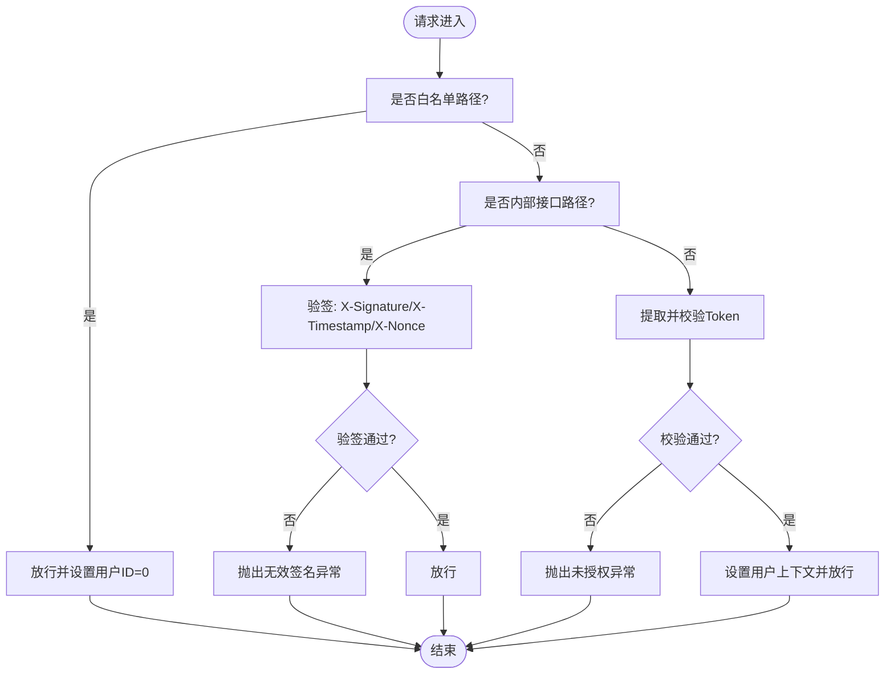

# 安全认证机制

<cite>
**本文引用的文件**
- [internal/middlewares/auth.py](file://internal/middlewares/auth.py)
- [internal/core/auth.py](file://internal/core/auth.py)
- [internal/dao/redis.py](file://internal/dao/redis.py)
- [pkg/toolkit/jwt.py](file://pkg/toolkit/jwt.py)
- [pkg/toolkit/signature.py](file://pkg/toolkit/signature.py)
- [internal/core/signature.py](file://internal/core/signature.py)
- [internal/config/load_config.py](file://internal/config/load_config.py)
- [configs/.env.dev](file://configs/.env.dev)
- [configs/.env.prod](file://configs/.env.prod)
- [internal/app.py](file://internal/app.py)
- [main.py](file://main.py)
- [tests/toolkit/test_jwt.py](file://tests/toolkit/test_jwt.py)
</cite>

## 目录
1. [简介](#简介)
2. [项目结构](#项目结构)
3. [核心组件](#核心组件)
4. [架构总览](#架构总览)
5. [详细组件分析](#详细组件分析)
6. [依赖分析](#依赖分析)
7. [性能考虑](#性能考虑)
8. [故障排查指南](#故障排查指南)
9. [结论](#结论)
10. [附录](#附录)

## 简介
本文件系统性梳理本项目的安全认证机制，涵盖以下方面：
- JWT Token 认证与签名认证的实现与流程
- 认证中间件与路由白名单策略
- 权限控制与访问控制思路
- 安全配置项、密钥管理与令牌有效期
- 与中间件系统的集成关系
- CSRF 防护、会话管理与安全审计建议
- 常见安全风险与防护措施

## 项目结构
围绕认证与安全的关键模块分布如下：
- 配置层：集中于配置加载与密钥管理
- 中间件层：统一拦截请求，执行白名单放行、签名认证与 Token 认证
- 核心认证层：Token 校验与 Redis 缓存交互
- 工具层：JWT 与签名工具类
- 应用层：FastAPI 应用注册中间件与路由

图表来源
- [internal/config/load_config.py](file://internal/config/load_config.py#L46-L117)
- [configs/.env.dev](file://configs/.env.dev#L1-L20)
- [configs/.env.prod](file://configs/.env.prod#L1-L20)
- [internal/app.py](file://internal/app.py#L55-L82)
- [internal/middlewares/auth.py](file://internal/middlewares/auth.py#L88-L150)
- [internal/core/auth.py](file://internal/core/auth.py#L5-L19)
- [internal/dao/redis.py](file://internal/dao/redis.py#L6-L37)
- [pkg/toolkit/jwt.py](file://pkg/toolkit/jwt.py#L7-L41)
- [pkg/toolkit/signature.py](file://pkg/toolkit/signature.py#L9-L95)
- [internal/core/signature.py](file://internal/core/signature.py#L9-L26)
- [main.py](file://main.py#L1-L18)

章节来源
- [internal/config/load_config.py](file://internal/config/load_config.py#L46-L117)
- [internal/app.py](file://internal/app.py#L55-L82)
- [internal/middlewares/auth.py](file://internal/middlewares/auth.py#L88-L150)

## 核心组件
- JWT 工具：负责 Token 的生成与验证，包含算法、过期时间等配置
- 签名工具：基于 HMAC 的签名生成与校验，支持时间戳容忍度
- 认证中间件：统一处理白名单放行、内部接口签名认证、普通接口 Token 认证
- 核心认证：从 Redis 缓存读取用户元数据与 Token 列表，完成二次校验
- 配置加载：集中管理密钥、算法、过期时间、CORS 等安全相关配置

章节来源
- [pkg/toolkit/jwt.py](file://pkg/toolkit/jwt.py#L7-L41)
- [pkg/toolkit/signature.py](file://pkg/toolkit/signature.py#L9-L95)
- [internal/middlewares/auth.py](file://internal/middlewares/auth.py#L88-L150)
- [internal/core/auth.py](file://internal/core/auth.py#L5-L19)
- [internal/dao/redis.py](file://internal/dao/redis.py#L6-L37)
- [internal/config/load_config.py](file://internal/config/load_config.py#L46-L117)

## 架构总览
下图展示请求在认证中间件中的处理流程，以及与核心认证、签名处理器、配置的关系。

图表来源
- [internal/middlewares/auth.py](file://internal/middlewares/auth.py#L88-L150)
- [internal/core/auth.py](file://internal/core/auth.py#L5-L19)
- [internal/dao/redis.py](file://internal/dao/redis.py#L19-L33)
- [internal/core/signature.py](file://internal/core/signature.py#L9-L26)
- [internal/config/load_config.py](file://internal/config/load_config.py#L46-L117)

## 详细组件分析

### JWT 认证组件
- 功能职责
  - 生成带过期时间的 JWT Token，包含用户标识
  - 从请求头解析并验证 Token，处理过期与无效等情况
- 关键点
  - 算法与密钥来自配置；默认过期分钟数可按需调整
  - 验证时严格检查 Bearer 前缀与用户标识字段
- 与中间件集成
  - 中间件在非内部接口路径下调用核心认证进行 Token 校验

图表来源
- [pkg/toolkit/jwt.py](file://pkg/toolkit/jwt.py#L7-L41)

章节来源
- [pkg/toolkit/jwt.py](file://pkg/toolkit/jwt.py#L7-L41)
- [internal/middlewares/auth.py](file://internal/middlewares/auth.py#L132-L149)

### 签名认证组件
- 功能职责
  - 基于 HMAC 的签名生成与校验
  - 时间戳容忍度校验，防止重放攻击
  - 统一验签入口，兼容随机串 nonce
- 初始化与使用
  - 通过配置加载的密钥初始化签名处理器
  - 中间件在内部接口路径下调用统一验签

图表来源
- [pkg/toolkit/signature.py](file://pkg/toolkit/signature.py#L9-L95)
- [internal/core/signature.py](file://internal/core/signature.py#L9-L26)

章节来源
- [pkg/toolkit/signature.py](file://pkg/toolkit/signature.py#L9-L95)
- [internal/core/signature.py](file://internal/core/signature.py#L9-L26)
- [internal/middlewares/auth.py](file://internal/middlewares/auth.py#L119-L131)

### 认证中间件
- 功能职责
  - 白名单放行：公开路径、文档路径、登录/注册等无需认证
  - 内部接口签名认证：要求 X-Signature、X-Timestamp、X-Nonce
  - 普通接口 Token 认证：从 Authorization 头提取并校验 Token
  - 设置用户上下文：成功后将用户 ID 写入上下文
- 路径策略
  - 公共路径、测试路径、白名单路径精确匹配放行
  - 内部接口路径强制签名认证
  - 其余路径强制 Token 认证

图表来源
- [internal/middlewares/auth.py](file://internal/middlewares/auth.py#L88-L150)

章节来源
- [internal/middlewares/auth.py](file://internal/middlewares/auth.py#L13-L150)

### 核心认证与缓存交互
- 功能职责
  - 从 Redis 读取 Token 对应的用户元数据
  - 从 Redis 读取用户的 Token 列表，确保 Token 在有效列表内
- 错误处理
  - 任一步缺失或不匹配均视为认证失败

图表来源
- [internal/core/auth.py](file://internal/core/auth.py#L5-L19)
- [internal/dao/redis.py](file://internal/dao/redis.py#L19-L33)

章节来源
- [internal/core/auth.py](file://internal/core/auth.py#L5-L19)
- [internal/dao/redis.py](file://internal/dao/redis.py#L19-L33)

### 配置与密钥管理
- 配置项
  - JWT 算法、密钥、过期时间、CORS、数据库与 Redis 连接等
  - 敏感字段支持 AES 解密，避免明文存储
- 环境文件
  - 开发/生产环境分别维护，便于差异化配置
- 初始化
  - 应用生命周期中初始化签名处理器与各类服务

图表来源
- [internal/config/load_config.py](file://internal/config/load_config.py#L179-L242)
- [configs/.env.dev](file://configs/.env.dev#L1-L20)
- [configs/.env.prod](file://configs/.env.prod#L1-L20)
- [internal/app.py](file://internal/app.py#L85-L109)

章节来源
- [internal/config/load_config.py](file://internal/config/load_config.py#L46-L117)
- [configs/.env.dev](file://configs/.env.dev#L1-L20)
- [configs/.env.prod](file://configs/.env.prod#L1-L20)
- [internal/app.py](file://internal/app.py#L85-L109)

## 依赖分析
- 中间件依赖
  - 认证中间件依赖核心认证与签名处理器
  - 核心认证依赖缓存 DAO
- 配置依赖
  - 签名处理器依赖配置中的密钥
  - JWT 工具依赖配置中的算法与过期时间
- 应用集成
  - 应用在生命周期中初始化签名处理器与其它基础设施

图表来源
- [internal/app.py](file://internal/app.py#L55-L82)
- [internal/middlewares/auth.py](file://internal/middlewares/auth.py#L6-L8)
- [internal/core/auth.py](file://internal/core/auth.py#L1-L2)
- [internal/dao/redis.py](file://internal/dao/redis.py#L1-L3)
- [internal/core/signature.py](file://internal/core/signature.py#L1-L4)
- [internal/config/load_config.py](file://internal/config/load_config.py#L46-L117)
- [pkg/toolkit/jwt.py](file://pkg/toolkit/jwt.py#L1-L5)
- [pkg/toolkit/signature.py](file://pkg/toolkit/signature.py#L1-L6)

章节来源
- [internal/app.py](file://internal/app.py#L55-L82)
- [internal/middlewares/auth.py](file://internal/middlewares/auth.py#L6-L8)
- [internal/core/auth.py](file://internal/core/auth.py#L1-L2)
- [internal/dao/redis.py](file://internal/dao/redis.py#L1-L3)
- [internal/core/signature.py](file://internal/core/signature.py#L1-L4)
- [internal/config/load_config.py](file://internal/config/load_config.py#L46-L117)
- [pkg/toolkit/jwt.py](file://pkg/toolkit/jwt.py#L1-L5)
- [pkg/toolkit/signature.py](file://pkg/toolkit/signature.py#L1-L6)

## 性能考虑
- Token 校验为内存操作，主要开销在 Redis 读取与序列化解析
- 建议
  - 合理设置过期时间，平衡安全性与用户体验
  - 使用连接池与合适的超时配置，避免阻塞
  - 对高频接口可考虑本地缓存热点用户元数据（需配合失效策略）

## 故障排查指南
- 常见问题与定位
  - 未携带或格式错误的 Authorization 头：中间件直接抛出未授权异常
  - Token 不存在或不在用户 Token 列表：核心认证返回失败
  - 签名验签失败：检查时间戳是否在容忍范围内、随机串是否一致、密钥是否正确
  - 配置加载失败：确认环境文件与密钥文件存在且格式正确
- 测试参考
  - JWT 工具的单元测试覆盖了多种边界场景，可作为行为参考

章节来源
- [internal/middlewares/auth.py](file://internal/middlewares/auth.py#L132-L149)
- [internal/core/auth.py](file://internal/core/auth.py#L5-L19)
- [tests/toolkit/test_jwt.py](file://tests/toolkit/test_jwt.py#L20-L112)

## 结论
本项目采用“中间件统一拦截 + 核心认证 + 缓存校验”的认证架构，结合 JWT 与签名两种机制，满足公开接口、内部接口与普通用户接口的不同安全需求。通过集中配置与生命周期初始化，确保密钥与算法的一致性与可维护性。建议在现有基础上进一步完善权限控制与审计能力，并持续优化过期与刷新策略以提升安全性与可用性。

## 附录

### 安全配置清单
- 必填项
  - JWT_SECRET：用于 JWT 与签名的密钥
  - JWT_ALGORITHM：JWT 签名算法
  - ACCESS_TOKEN_EXPIRE_MINUTES：Token 过期时间（分钟）
  - AES_SECRET：用于解密敏感字段的 AES 密钥
- 可选项
  - BACKEND_CORS_ORIGINS：跨域来源
  - REDIS_*：Redis 连接参数
  - DB_*：数据库连接参数

章节来源
- [internal/config/load_config.py](file://internal/config/load_config.py#L46-L117)
- [configs/.env.dev](file://configs/.env.dev#L1-L20)
- [configs/.env.prod](file://configs/.env.prod#L1-L20)

### 认证流程与最佳实践
- 认证流程
  - 白名单放行 → 内部接口签名认证 → 普通接口 Token 认证
- 最佳实践
  - 使用 HTTPS 传输，避免明文泄露
  - 定期轮换密钥，启用密钥备份与回滚
  - 限制 Token 过期时间，结合刷新策略
  - 对敏感操作增加二次校验（如短信/邮箱验证码）
  - 记录审计日志，保留请求头与用户上下文关键信息

### CSRF 防护、会话管理与安全审计
- CSRF 防护
  - 本项目以 Token 与签名为主，建议在前端侧配合 SameSite Cookie 与自定义头部策略
- 会话管理
  - 建议引入会话 ID 与 Token 绑定，结合黑名单与过期控制
- 安全审计
  - 记录认证失败原因、用户 ID、IP、UA、时间戳等，定期分析异常模式