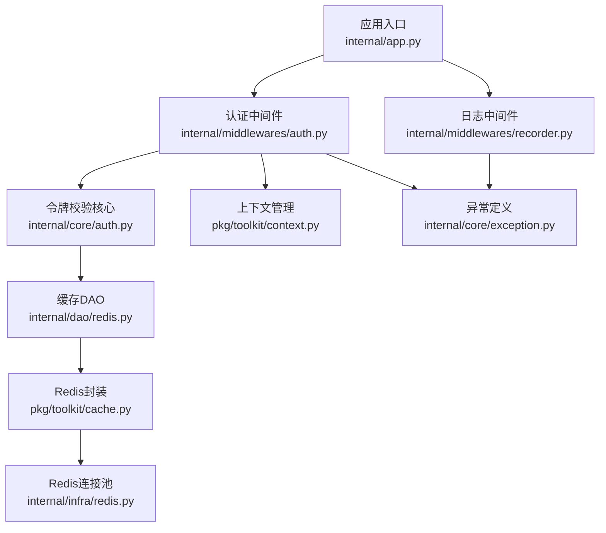
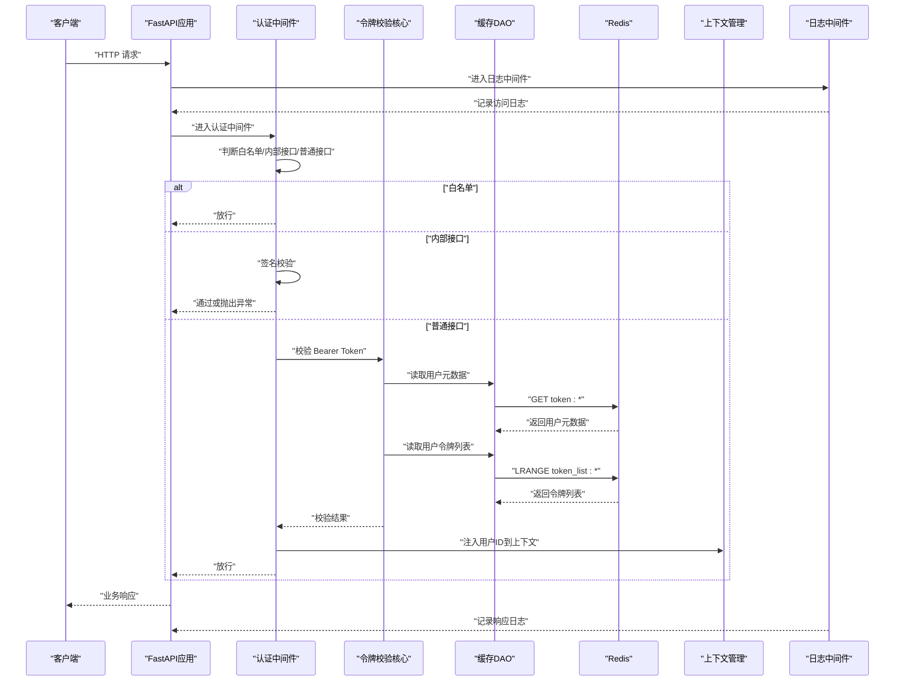
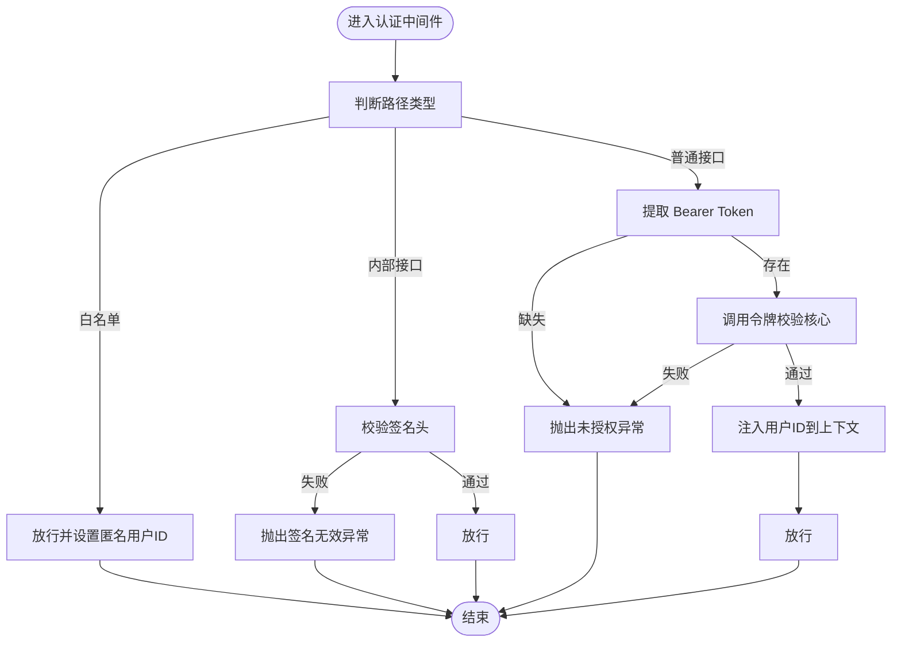
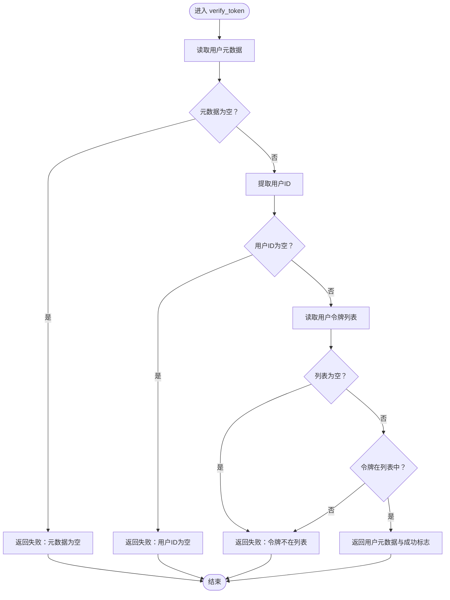
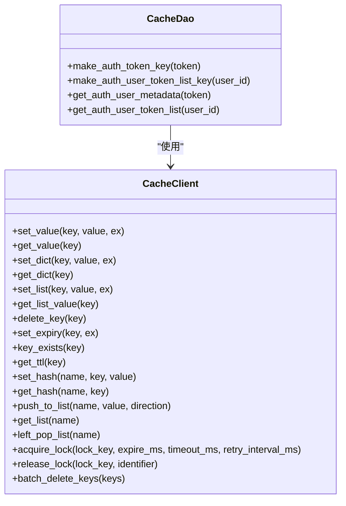
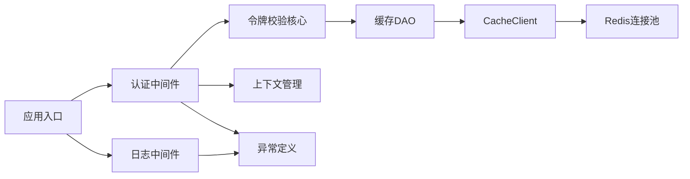

# 权限控制与访问管理

<cite>
**本文档引用的文件**
- [internal/app.py](file://internal/app.py)
- [internal/middlewares/auth.py](file://internal/middlewares/auth.py)
- [internal/middlewares/recorder.py](file://internal/middlewares/recorder.py)
- [internal/core/auth.py](file://internal/core/auth.py)
- [internal/dao/redis.py](file://internal/dao/redis.py)
- [internal/infra/redis.py](file://internal/infra/redis.py)
- [pkg/toolkit/cache.py](file://pkg/toolkit/cache.py)
- [pkg/toolkit/context.py](file://pkg/toolkit/context.py)
- [internal/core/exception.py](file://internal/core/exception.py)
- [internal/controllers/web/user.py](file://internal/controllers/web/user.py)
- [internal/controllers/internalapi/user.py](file://internal/controllers/internalapi/user.py)
- [internal/controllers/publicapi/test.py](file://internal/controllers/publicapi/test.py)
- [internal/services/user.py](file://internal/services/user.py)
- [internal/dao/user.py](file://internal/dao/user.py)
- [internal/models/user.py](file://internal/models/user.py)
</cite>

## 目录
1. [引言](#引言)
2. [项目结构](#项目结构)
3. [核心组件](#核心组件)
4. [架构总览](#架构总览)
5. [详细组件分析](#详细组件分析)
6. [依赖分析](#依赖分析)
7. [性能考虑](#性能考虑)
8. [故障排查指南](#故障排查指南)
9. [结论](#结论)
10. [附录](#附录)

## 引言
本文件面向权限控制与访问管理主题，聚焦于当前代码库中已实现的认证与访问控制机制。根据现有实现，系统采用“基于令牌的访问控制”（以 Bearer Token 为核心）与“基于路径的访问控制”（白名单、内部接口签名）相结合的方式，尚未实现完整的基于角色的访问控制（RBAC）或基于属性的访问控制（ABAC）。本文将系统梳理认证中间件、令牌校验、访问日志与异常处理流程，并给出扩展 RBAC/ABAC 的建议与最佳实践。

## 项目结构
围绕权限控制与访问管理的关键模块如下：
- 应用入口与中间件注册：负责加载认证中间件、日志中间件以及路由注册
- 认证中间件：解析请求头、识别白名单/内部接口/普通接口，分别进行处理
- 令牌校验：从缓存读取用户元数据与令牌列表，完成用户上下文注入
- 缓存层：Redis 封装与键空间设计，支撑令牌与用户元数据存储
- 上下文管理：通过 contextvars 注入用户标识，贯穿后续业务处理
- 异常与日志：统一异常处理与访问日志记录，便于审计与排障

图表来源
- [internal/app.py](file://internal/app.py#L55-L81)
- [internal/middlewares/auth.py](file://internal/middlewares/auth.py#L88-L149)
- [internal/middlewares/recorder.py](file://internal/middlewares/recorder.py#L66-L122)
- [internal/core/auth.py](file://internal/core/auth.py#L4-L18)
- [internal/dao/redis.py](file://internal/dao/redis.py#L6-L36)
- [pkg/toolkit/cache.py](file://pkg/toolkit/cache.py#L41-L249)
- [internal/infra/redis.py](file://internal/infra/redis.py#L18-L98)
- [pkg/toolkit/context.py](file://pkg/toolkit/context.py#L78-L106)
- [internal/core/exception.py](file://internal/core/exception.py#L19-L37)

章节来源
- [internal/app.py](file://internal/app.py#L17-L82)

## 核心组件
- 认证中间件（ASGIAuthMiddleware）
  - 负责白名单放行、内部接口签名校验、普通接口 Bearer Token 校验
  - 提取 Authorization 头，兼容 Bearer 前缀
  - 将用户标识注入上下文，供后续业务使用
- 令牌校验核心（verify_token）
  - 从缓存读取用户元数据与用户令牌列表
  - 校验令牌有效性与归属
- 缓存层（CacheDao + CacheClient）
  - 提供键空间设计与 Redis 操作封装
  - 支持字符串、字典、列表、哈希、分布式锁等常用能力
- 上下文管理（context）
  - 通过 contextvars 注入/读取用户标识与追踪 ID
- 日志与异常（ASGIRecordMiddleware + AppException）
  - 记录访问日志与响应日志，统一异常处理与错误响应

章节来源
- [internal/middlewares/auth.py](file://internal/middlewares/auth.py#L88-L149)
- [internal/core/auth.py](file://internal/core/auth.py#L4-L18)
- [internal/dao/redis.py](file://internal/dao/redis.py#L6-L36)
- [pkg/toolkit/cache.py](file://pkg/toolkit/cache.py#L41-L249)
- [pkg/toolkit/context.py](file://pkg/toolkit/context.py#L78-L106)
- [internal/middlewares/recorder.py](file://internal/middlewares/recorder.py#L66-L122)
- [internal/core/exception.py](file://internal/core/exception.py#L4-L37)

## 架构总览
下图展示一次典型 HTTP 请求在权限控制链路中的流转：

图表来源
- [internal/middlewares/auth.py](file://internal/middlewares/auth.py#L88-L149)
- [internal/core/auth.py](file://internal/core/auth.py#L4-L18)
- [internal/dao/redis.py](file://internal/dao/redis.py#L19-L33)
- [pkg/toolkit/cache.py](file://pkg/toolkit/cache.py#L54-L98)
- [internal/infra/redis.py](file://internal/infra/redis.py#L70-L98)
- [pkg/toolkit/context.py](file://pkg/toolkit/context.py#L78-L106)
- [internal/middlewares/recorder.py](file://internal/middlewares/recorder.py#L91-L102)

## 详细组件分析

### 认证中间件（ASGIAuthMiddleware）
- 白名单路径：对公开接口与文档接口直接放行，并设置匿名用户上下文
- 内部接口：要求携带签名头并通过签名处理器校验
- 普通接口：要求携带 Bearer Token，交由令牌校验核心完成校验
- 用户上下文：校验通过后将用户 ID 注入上下文，供后续业务使用

图表来源
- [internal/middlewares/auth.py](file://internal/middlewares/auth.py#L88-L149)
- [internal/core/exception.py](file://internal/core/exception.py#L24-L31)

章节来源
- [internal/middlewares/auth.py](file://internal/middlewares/auth.py#L13-L149)

### 令牌校验核心（verify_token）
- 从缓存读取用户元数据；若为空则判定为无效令牌
- 从缓存读取用户令牌列表；若令牌不在列表中则判定为无效
- 返回用户元数据与校验结果，供中间件注入上下文

图表来源
- [internal/core/auth.py](file://internal/core/auth.py#L4-L18)
- [internal/dao/redis.py](file://internal/dao/redis.py#L19-L33)

章节来源
- [internal/core/auth.py](file://internal/core/auth.py#L4-L18)
- [internal/dao/redis.py](file://internal/dao/redis.py#L19-L33)

### 缓存层（CacheDao + CacheClient）
- 键空间设计
  - token:<token>：存储用户元数据（JSON）
  - token_list:<user_id>：存储用户有效令牌列表（JSON 列表）
- 能力范围
  - 字符串/字典/列表读写、TTL、哈希、分布式锁、批量删除等
- 与 Redis 的交互通过连接池与会话提供器管理

图表来源
- [internal/dao/redis.py](file://internal/dao/redis.py#L6-L36)
- [pkg/toolkit/cache.py](file://pkg/toolkit/cache.py#L41-L249)
- [internal/infra/redis.py](file://internal/infra/redis.py#L18-L98)

章节来源
- [internal/dao/redis.py](file://internal/dao/redis.py#L6-L36)
- [pkg/toolkit/cache.py](file://pkg/toolkit/cache.py#L41-L249)
- [internal/infra/redis.py](file://internal/infra/redis.py#L18-L98)

### 上下文管理（context）
- 提供 init/get/set/clear 等方法，通过 contextvars 存储请求级上下文
- 提供 set_user_id/get_user_id 等便捷方法，用于在中间件中注入用户标识
- 在业务层可通过 get_user_id 获取当前用户标识

章节来源
- [pkg/toolkit/context.py](file://pkg/toolkit/context.py#L78-L106)

### 日志与异常（ASGIRecordMiddleware + AppException）
- 日志中间件
  - 记录请求与响应日志，注入处理耗时与追踪 ID
  - 统一异常捕获，区分业务异常与系统异常，构造标准错误响应
- 异常定义
  - 定义全局错误码与消息模板，支持中英文提示
  - 认证中间件在不同场景抛出相应错误

章节来源
- [internal/middlewares/recorder.py](file://internal/middlewares/recorder.py#L66-L122)
- [internal/core/exception.py](file://internal/core/exception.py#L19-L37)

### 控制器与服务示例
- 控制器示例
  - web/user.py：演示普通接口路由与依赖注入
  - internalapi/user.py：演示内部接口路由
  - publicapi/test.py：演示异常抛出与 SSE 流式输出
- 服务示例
  - user.py：演示 DAO 层调用与简单业务方法

章节来源
- [internal/controllers/web/user.py](file://internal/controllers/web/user.py#L13-L16)
- [internal/controllers/internalapi/user.py](file://internal/controllers/internalapi/user.py#L8-L10)
- [internal/controllers/publicapi/test.py](file://internal/controllers/publicapi/test.py#L15-L24)
- [internal/services/user.py](file://internal/services/user.py#L9-L16)

## 依赖分析
- 中间件注册顺序
  - GZip → 认证中间件 → CORS → 日志中间件
  - 认证中间件位于日志中间件之前，确保异常与访问日志覆盖认证阶段
- 认证中间件依赖
  - 令牌校验核心：verify_token
  - 缓存 DAO：CacheDao
  - 上下文管理：context
  - 异常定义：AppException/GlobalErrors
- 缓存依赖
  - CacheClient 依赖 Redis 连接池
  - CacheDao 依赖 CacheClient

图表来源
- [internal/app.py](file://internal/app.py#L55-L81)
- [internal/middlewares/auth.py](file://internal/middlewares/auth.py#L6-L10)
- [internal/core/auth.py](file://internal/core/auth.py#L1)
- [internal/dao/redis.py](file://internal/dao/redis.py#L1-L3)
- [pkg/toolkit/cache.py](file://pkg/toolkit/cache.py#L41-L46)
- [internal/infra/redis.py](file://internal/infra/redis.py#L18-L44)
- [pkg/toolkit/context.py](file://pkg/toolkit/context.py#L78-L106)
- [internal/core/exception.py](file://internal/core/exception.py#L4-L14)

章节来源
- [internal/app.py](file://internal/app.py#L55-L81)

## 性能考虑
- 缓存命中与热点优化
  - 将用户元数据与令牌列表放入缓存，减少数据库压力
  - 合理设置 TTL，结合失效策略与主动刷新
- 批量操作
  - 使用批量删除键能力，降低网络往返
  - 列表操作支持左右两端插入与弹出，满足队列/栈式场景
- 分布式锁
  - 提供 acquire_lock/release_lock，适用于并发场景下的互斥控制
- 日志与异常
  - 日志中间件仅在响应头注入处理耗时与追踪 ID，避免阻塞业务逻辑
  - 异常统一处理，避免重复封装

章节来源
- [pkg/toolkit/cache.py](file://pkg/toolkit/cache.py#L171-L249)
- [internal/middlewares/recorder.py](file://internal/middlewares/recorder.py#L91-L102)

## 故障排查指南
- 常见问题与定位
  - 未携带或携带无效 Bearer Token：认证中间件会抛出未授权异常
  - 令牌不在用户令牌列表：校验失败，返回未授权
  - 签名头缺失或校验失败：内部接口拒绝访问
  - Redis 未初始化或连接异常：缓存读取失败，需检查 Redis 初始化流程
- 日志与追踪
  - 访问日志包含 IP、方法、路径、查询串
  - 响应日志包含处理耗时
  - 异常日志包含业务异常与系统异常的区分与堆栈信息
- 上下文缺失
  - 若在业务层调用 get_user_id 抛出异常，检查中间件是否正确注入用户 ID

章节来源
- [internal/middlewares/auth.py](file://internal/middlewares/auth.py#L119-L149)
- [internal/core/auth.py](file://internal/core/auth.py#L4-L18)
- [internal/middlewares/recorder.py](file://internal/middlewares/recorder.py#L91-L122)
- [pkg/toolkit/context.py](file://pkg/toolkit/context.py#L82-L86)

## 结论
当前系统实现了以 Bearer Token 为核心的认证与访问控制基础能力，并通过中间件链路完成了白名单放行、内部接口签名校验与统一异常处理。缓存层提供了高可用的键空间设计与丰富的 Redis 操作封装。为进一步增强权限体系，可在现有基础上扩展 RBAC/ABAC 能力，实现角色与权限的精细化管理与动态更新。

## 附录

### RBAC/ABAC 扩展建议
- 角色与权限模型
  - 引入角色表与权限表，建立多对多关系
  - 用户与角色、角色与权限的关联表
- 权限检查流程
  - 在业务层增加权限检查装饰器或中间件，按资源与动作进行校验
  - 支持权限继承与组合规则
- 动态权限更新
  - 通过缓存同步角色/权限变更，设置合理 TTL 并提供主动刷新
- 审计与日志
  - 记录权限决策日志，便于审计与回溯

### 配置与部署要点
- 中间件顺序不可颠倒：认证中间件应在日志中间件之前
- Redis 初始化需在应用生命周期内完成
- 白名单路径应明确维护，避免误放敏感接口