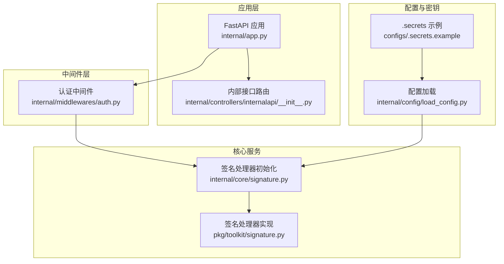
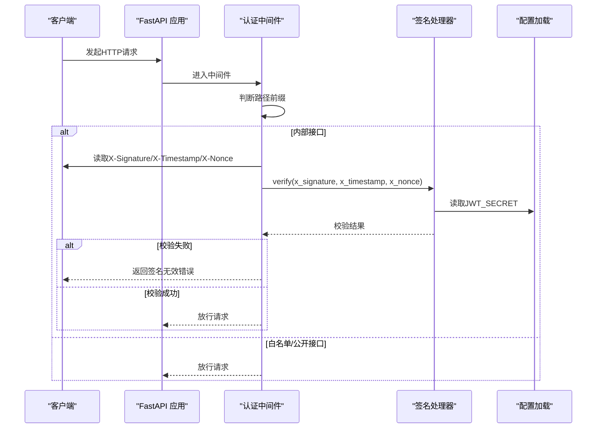
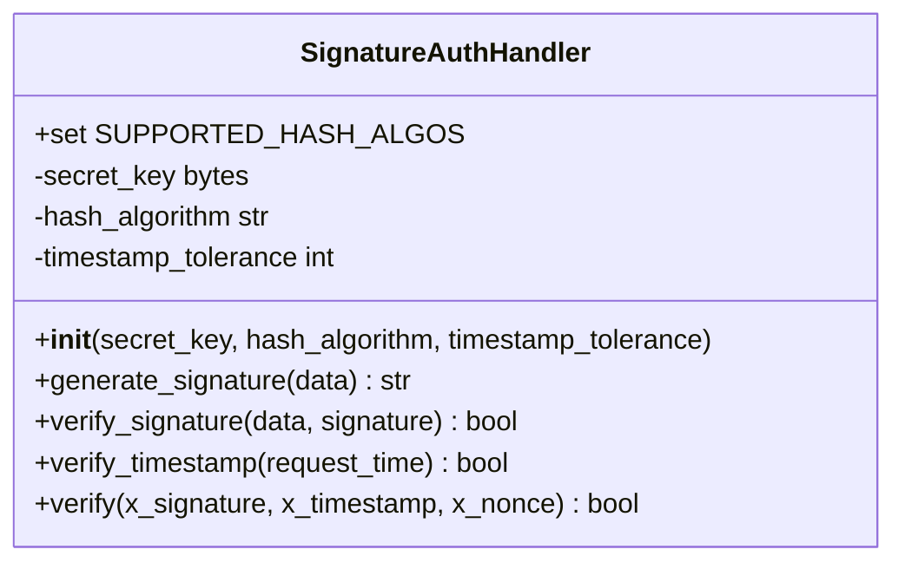
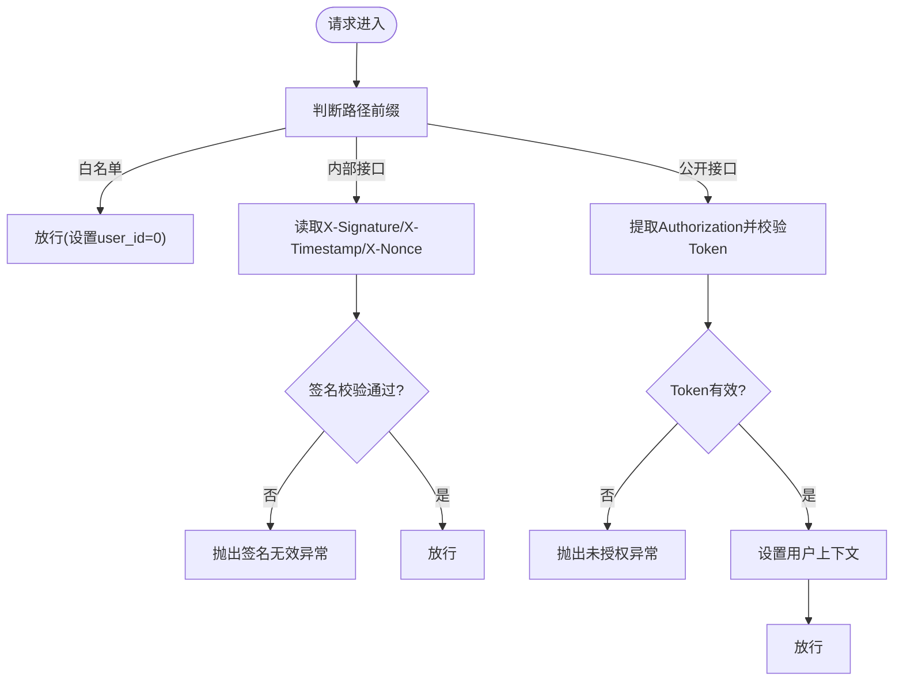
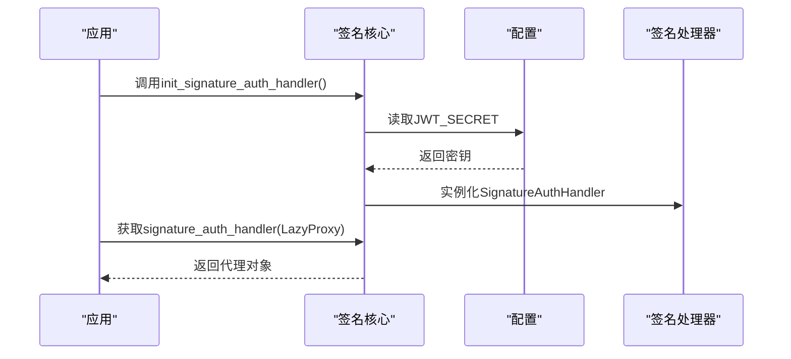
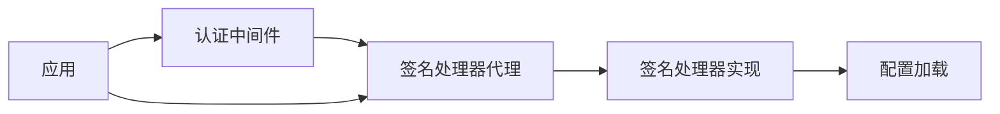

# 签名认证机制

<cite>
**本文引用的文件**
- [internal/core/signature.py](file://internal/core/signature.py)
- [pkg/toolkit/signature.py](file://pkg/toolkit/signature.py)
- [internal/middlewares/auth.py](file://internal/middlewares/auth.py)
- [internal/app.py](file://internal/app.py)
- [internal/config/load_config.py](file://internal/config/load_config.py)
- [configs/.secrets.example](file://configs/.secrets.example)
- [internal/core/exception.py](file://internal/core/exception.py)
- [pkg/toolkit/context.py](file://pkg/toolkit/context.py)
- [internal/controllers/internalapi/__init__.py](file://internal/controllers/internalapi/__init__.py)
- [internal/controllers/serviceapi/user.py](file://internal/controllers/serviceapi/user.py)
</cite>

## 目录
1. [简介](#简介)
2. [项目结构](#项目结构)
3. [核心组件](#核心组件)
4. [架构总览](#架构总览)
5. [详细组件分析](#详细组件分析)
6. [依赖关系分析](#依赖关系分析)
7. [性能考量](#性能考量)
8. [故障排查指南](#故障排查指南)
9. [结论](#结论)
10. [附录](#附录)

## 简介
本文件系统性阐述本项目的签名认证机制，涵盖数字签名的生成与验证、密钥管理、哈希与HMAC计算、请求签名流程、时间戳校验与防重放策略、签名参数构造与编码规范、校验规则、与HTTP请求处理的集成方式、签名失效处理、密钥轮换与安全审计建议，以及常见问题与安全威胁防护。

## 项目结构
签名认证相关代码主要分布在以下模块：
- 核心签名处理器：pkg/toolkit/signature.py
- 签名处理器初始化与代理：internal/core/signature.py
- ASGI认证中间件：internal/middlewares/auth.py
- 应用生命周期注册：internal/app.py
- 配置加载与密钥来源：internal/config/load_config.py、configs/.secrets.example
- 异常与错误码：internal/core/exception.py
- 请求上下文：pkg/toolkit/context.py
- 内部接口路由示例：internal/controllers/internalapi/__init__.py、internal/controllers/serviceapi/user.py

图表来源
- [internal/app.py](file://internal/app.py#L55-L64)
- [internal/middlewares/auth.py](file://internal/middlewares/auth.py#L88-L118)
- [internal/core/signature.py](file://internal/core/signature.py#L9-L26)
- [pkg/toolkit/signature.py](file://pkg/toolkit/signature.py#L9-L26)
- [internal/config/load_config.py](file://internal/config/load_config.py#L46-L84)
- [configs/.secrets.example](file://configs/.secrets.example#L12-L13)
- [internal/controllers/internalapi/__init__.py](file://internal/controllers/internalapi/__init__.py#L1-L11)

章节来源
- [internal/app.py](file://internal/app.py#L55-L64)
- [internal/middlewares/auth.py](file://internal/middlewares/auth.py#L88-L118)
- [internal/core/signature.py](file://internal/core/signature.py#L9-L26)
- [pkg/toolkit/signature.py](file://pkg/toolkit/signature.py#L9-L26)
- [internal/config/load_config.py](file://internal/config/load_config.py#L46-L84)
- [configs/.secrets.example](file://configs/.secrets.example#L12-L13)
- [internal/controllers/internalapi/__init__.py](file://internal/controllers/internalapi/__init__.py#L1-L11)

## 核心组件
- SignatureAuthHandler：负责签名生成、签名验证、时间戳校验与统一验签入口。
- ASGIAuthMiddleware：在ASGI层拦截HTTP请求，按路径前缀区分白名单、内部接口与公开接口，并对内部接口进行签名校验。
- 签名处理器初始化与代理：通过LazyProxy延迟获取签名处理器实例，避免重复初始化与循环依赖。
- 配置与密钥：从环境配置中读取JWT_SECRET作为签名密钥，支持多环境配置文件与密钥示例。

章节来源
- [pkg/toolkit/signature.py](file://pkg/toolkit/signature.py#L9-L94)
- [internal/middlewares/auth.py](file://internal/middlewares/auth.py#L88-L149)
- [internal/core/signature.py](file://internal/core/signature.py#L9-L26)
- [internal/config/load_config.py](file://internal/config/load_config.py#L46-L84)
- [configs/.secrets.example](file://configs/.secrets.example#L12-L13)

## 架构总览
签名认证在应用启动时完成初始化，随后在请求进入时由认证中间件根据路径前缀决定是否进行签名校验。内部接口要求提供X-Signature、X-Timestamp、X-Nonce三个头部，统一由签名处理器进行时间戳与签名校验。

图表来源
- [internal/middlewares/auth.py](file://internal/middlewares/auth.py#L88-L130)
- [pkg/toolkit/signature.py](file://pkg/toolkit/signature.py#L77-L94)
- [internal/core/signature.py](file://internal/core/signature.py#L9-L26)
- [internal/config/load_config.py](file://internal/config/load_config.py#L46-L84)

## 详细组件分析

### 签名处理器 SignatureAuthHandler
- 支持的哈希算法集合与初始化参数：构造时接收secret_key、hash_algorithm与timestamp_tolerance；校验hash_algorithm合法性。
- 签名生成：将输入字典键值对转换为字符串并排序，拼接为“k=v”形式的UTF-8字节串，使用HMAC与指定哈希算法生成十六进制摘要。
- 签名验证：先生成期望签名，再使用常量时间比较函数进行对比，避免时序攻击。
- 时间戳校验：将请求时间戳与当前时间戳取绝对差值，超过容忍范围则判定失败。
- 统一验签入口：先校验时间戳，再基于“timestamp+nonce”构造数据进行签名验证。

图表来源
- [pkg/toolkit/signature.py](file://pkg/toolkit/signature.py#L9-L94)

章节来源
- [pkg/toolkit/signature.py](file://pkg/toolkit/signature.py#L9-L94)

### 认证中间件 ASGIAuthMiddleware
- 常量配置：定义HTTP头字段名（X-Signature、X-Timestamp、X-Nonce）、Authorization头与Bearer前缀、路径前缀（/v1/public、/v1/internal、/test）与白名单路径集合。
- 请求上下文：封装path、method、headers，提供路径判断与头部读取能力。
- 流程控制：
  - 白名单放行：设置用户上下文为0并放行。
  - 内部接口：读取签名相关头部，调用签名处理器进行统一校验，失败抛出业务异常。
  - 公开接口：提取Authorization头，进行Token校验并通过后设置用户上下文。

图表来源
- [internal/middlewares/auth.py](file://internal/middlewares/auth.py#L88-L149)

章节来源
- [internal/middlewares/auth.py](file://internal/middlewares/auth.py#L13-L149)

### 签名处理器初始化与代理
- 初始化：在应用生命周期内调用init_signature_auth_handler，从配置中读取JWT_SECRET并创建签名处理器实例。
- 代理获取：通过LazyProxy延迟获取签名处理器，避免提前初始化与循环依赖；若未初始化则抛出运行时错误。

图表来源
- [internal/app.py](file://internal/app.py#L94-L94)
- [internal/core/signature.py](file://internal/core/signature.py#L9-L26)
- [internal/config/load_config.py](file://internal/config/load_config.py#L46-L84)

章节来源
- [internal/app.py](file://internal/app.py#L94-L94)
- [internal/core/signature.py](file://internal/core/signature.py#L9-L26)
- [internal/config/load_config.py](file://internal/config/load_config.py#L46-L84)

### 配置与密钥管理
- 配置模型：Settings类定义APP_ENV、DEBUG、AES_SECRET、JWT_SECRET、JWT_ALGORITHM、ACCESS_TOKEN_EXPIRE_MINUTES等关键配置项。
- 密钥来源：JWT_SECRET用于签名密钥；.secrets.example提供密钥配置示例，需复制为实际使用的密钥文件。
- 加载流程：应用启动时加载.env.<env>与.secrets，校验环境与文件存在性，最终实例化Settings并缓存。

章节来源
- [internal/config/load_config.py](file://internal/config/load_config.py#L46-L84)
- [configs/.secrets.example](file://configs/.secrets.example#L12-L13)
- [internal/config/load_config.py](file://internal/config/load_config.py#L179-L242)

### 错误与异常处理
- 自定义异常：AppException承载业务错误与消息；GlobalErrors定义标准错误码，包括签名无效等。
- 中间件异常：签名校验失败时抛出AppException，由全局异常处理统一输出。

章节来源
- [internal/core/exception.py](file://internal/core/exception.py#L4-L38)
- [internal/middlewares/auth.py](file://internal/middlewares/auth.py#L123-L127)

### 请求上下文与审计
- 上下文管理：通过context模块设置与获取用户ID、trace_id等，便于审计与日志追踪。
- 审计建议：结合日志中间件与上下文，记录请求路径、时间戳、签名校验结果与用户ID，形成可追溯的审计链。

章节来源
- [pkg/toolkit/context.py](file://pkg/toolkit/context.py#L78-L106)
- [internal/middlewares/recorder.py](file://internal/middlewares/recorder.py#L85-L122)

### 接口路由与签名集成
- 内部接口路由：/v1/internal前缀下的接口默认启用签名校验。
- 示例接口：serviceapi/user.py提供示例GET接口，可作为签名校验的测试目标。

章节来源
- [internal/controllers/internalapi/__init__.py](file://internal/controllers/internalapi/__init__.py#L1-L11)
- [internal/controllers/serviceapi/user.py](file://internal/controllers/serviceapi/user.py#L14-L20)

## 依赖关系分析
- 中间件依赖签名处理器代理，签名处理器依赖配置加载以获取密钥。
- 应用在生命周期中注册中间件与初始化签名处理器，确保请求处理链路正确。

图表来源
- [internal/middlewares/auth.py](file://internal/middlewares/auth.py#L88-L118)
- [internal/core/signature.py](file://internal/core/signature.py#L9-L26)
- [pkg/toolkit/signature.py](file://pkg/toolkit/signature.py#L9-L26)
- [internal/app.py](file://internal/app.py#L55-L64)

章节来源
- [internal/middlewares/auth.py](file://internal/middlewares/auth.py#L88-L118)
- [internal/core/signature.py](file://internal/core/signature.py#L9-L26)
- [pkg/toolkit/signature.py](file://pkg/toolkit/signature.py#L9-L26)
- [internal/app.py](file://internal/app.py#L55-L64)

## 性能考量
- HMAC与哈希计算：签名生成与验证为O(n)线性复杂度，其中n为参数数量与字符串长度；整体开销较小。
- 时间戳校验：常数时间复杂度，仅涉及整数运算与比较。
- 建议：
  - 使用SHA-256作为默认哈希算法，兼顾安全性与性能。
  - 控制timestamp_tolerance在合理范围（如300秒），避免过宽导致重放风险增加。
  - 对高频接口可考虑缓存签名处理器实例，减少重复初始化成本。

## 故障排查指南
- 签名无效
  - 检查请求头是否包含X-Signature、X-Timestamp、X-Nonce。
  - 确认时间戳格式为UTC秒级字符串且在容忍范围内。
  - 核对签名参数构造与编码规范（键值对排序、UTF-8编码、HMAC+SHA-256）。
  - 确认JWT_SECRET一致且未被修改。
- 时间戳过期
  - 校准客户端系统时间，确保与服务端时间偏差在容忍范围内。
  - 检查网络延迟与NTP同步情况。
- 中间件未生效
  - 确认请求路径属于/v1/internal前缀。
  - 检查应用是否正确注册认证中间件。
- 密钥问题
  - 确认.env.<env>与.secrets文件存在且包含JWT_SECRET。
  - 避免在生产环境使用示例密钥。

章节来源
- [internal/middlewares/auth.py](file://internal/middlewares/auth.py#L119-L130)
- [pkg/toolkit/signature.py](file://pkg/toolkit/signature.py#L57-L75)
- [internal/core/exception.py](file://internal/core/exception.py#L27-L27)
- [internal/config/load_config.py](file://internal/config/load_config.py#L184-L213)

## 结论
本项目的签名认证机制通过ASGI中间件与签名处理器实现，采用HMAC+SHA-256对关键参数进行签名，结合时间戳校验与nonce机制有效防范重放攻击。通过配置中心集中管理密钥，配合严格的异常处理与审计日志，形成完整的安全闭环。建议在生产环境中持续优化密钥轮换策略与日志审计能力，以应对不断演进的安全威胁。

## 附录

### 签名参数构造与编码规范
- 参数来源：X-Timestamp与X-Nonce构成待签名数据集。
- 编码步骤：
  - 将所有键值对转换为字符串。
  - 按键排序后拼接为“k=v&k=v...”形式。
  - 使用UTF-8编码为字节串。
  - 使用HMAC与选定哈希算法生成十六进制摘要。
- 校验规则：
  - 时间戳必须为UTC秒级整数字符串，且在容忍范围内。
  - 使用常量时间比较函数比对签名，避免时序攻击。

章节来源
- [pkg/toolkit/signature.py](file://pkg/toolkit/signature.py#L27-L56)
- [pkg/toolkit/signature.py](file://pkg/toolkit/signature.py#L77-L94)

### API调用方法与示例
- 内部接口示例：/v1/service/user/hello_world
- 调用要点：
  - 在请求头中添加X-Signature、X-Timestamp、X-Nonce。
  - 确保时间戳与服务端时间偏差在容忍范围内。
  - 使用相同的密钥与算法生成签名。

章节来源
- [internal/controllers/serviceapi/user.py](file://internal/controllers/serviceapi/user.py#L14-L20)
- [internal/controllers/internalapi/__init__.py](file://internal/controllers/internalapi/__init__.py#L1-L11)

### 安全审计与密钥轮换
- 审计建议：
  - 记录签名校验结果、时间戳、nonce与用户ID。
  - 对异常签名与时间戳过期进行告警。
- 密钥轮换：
  - 通过配置中心更新JWT_SECRET并重启应用。
  - 在过渡期内支持双密钥验证，逐步切换至新密钥。

章节来源
- [pkg/toolkit/context.py](file://pkg/toolkit/context.py#L78-L106)
- [internal/config/load_config.py](file://internal/config/load_config.py#L46-L84)