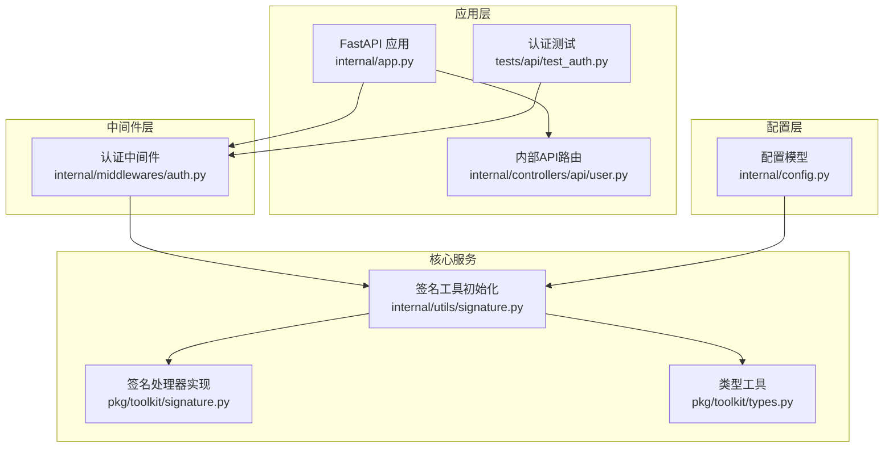
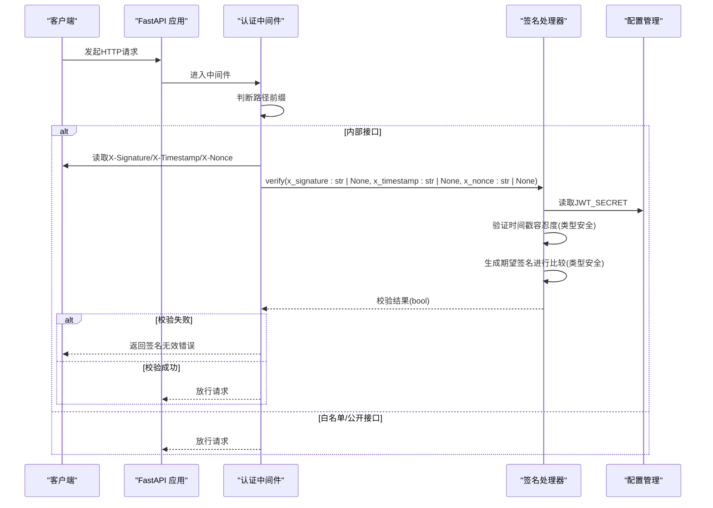
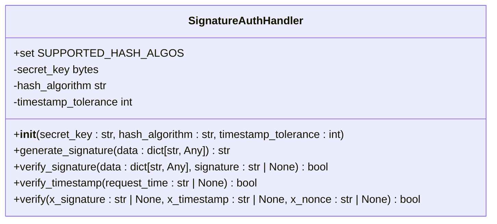
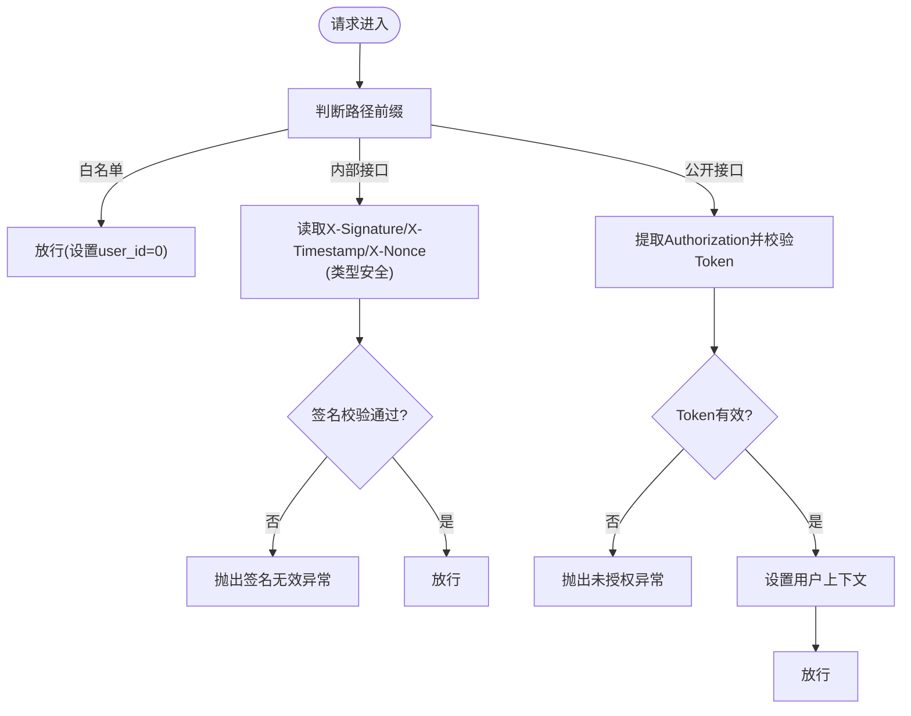
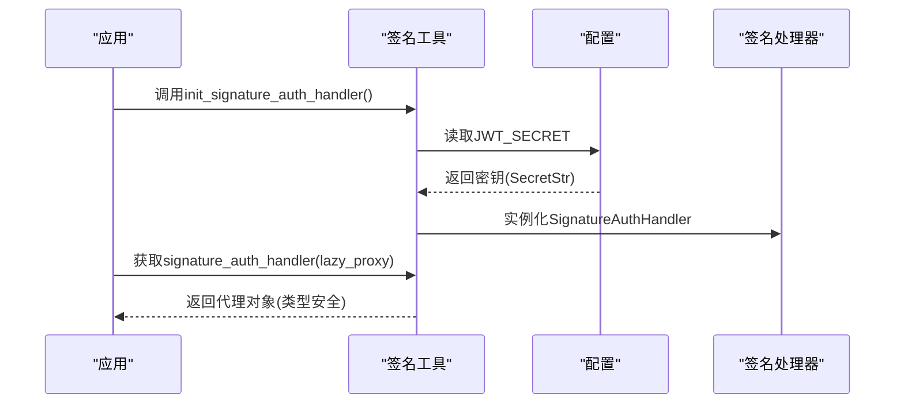
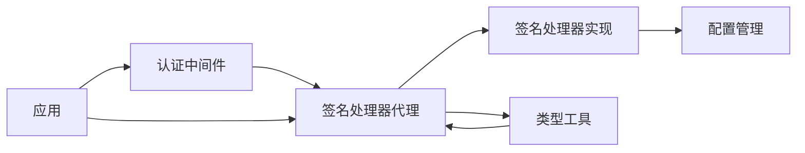

# 签名认证机制

<cite>
**本文档引用的文件**
- [internal/middlewares/auth.py](file://internal/middlewares/auth.py)
- [pkg/toolkit/signature.py](file://pkg/toolkit/signature.py)
- [internal/utils/signature.py](file://internal/utils/signature.py)
- [internal/app.py](file://internal/app.py)
- [internal/config.py](file://internal/config.py)
- [internal/controllers/api/user.py](file://internal/controllers/api/user.py)
- [internal/controllers/api/__init__.py](file://internal/controllers/api/__init__.py)
- [tests/api/test_auth.py](file://tests/api/test_auth.py)
- [pkg/toolkit/types.py](file://pkg/toolkit/types.py)
</cite>

## 更新摘要
**所做更改**
- 增强了签名验证和时间戳校验方法的类型处理，改进了类型安全性
- 更新了 verify_signature 和 verify_timestamp 方法的参数类型注解
- 完善了签名处理器的类型推断和代理模式实现
- 增强了认证中间件对类型安全的处理

## 目录
1. [简介](#简介)
2. [项目结构](#项目结构)
3. [核心组件](#核心组件)
4. [架构总览](#架构总览)
5. [详细组件分析](#详细组件分析)
6. [依赖关系分析](#依赖关系分析)
7. [性能考量](#性能考量)
8. [故障排查指南](#故障排查指南)
9. [结论](#结论)
10. [附录](#附录)

## 简介
本文件系统性阐述本项目的签名认证机制，涵盖数字签名的生成与验证、密钥管理、哈希与HMAC计算、请求签名流程、时间戳校验与防重放策略、签名参数构造与编码规范、校验规则、与HTTP请求处理的集成方式、签名失效处理、密钥轮换与安全审计建议，以及常见问题与安全威胁防护。

**更新** 本次更新重点关注类型安全性的增强，特别是签名验证和时间戳校验方法的类型处理改进，提升了代码的健壮性和可维护性。

## 项目结构
签名认证相关代码主要分布在以下模块：
- 核心签名处理器：pkg/toolkit/signature.py
- 签名处理器初始化与代理：internal/utils/signature.py
- ASGI认证中间件：internal/middlewares/auth.py
- 应用生命周期注册：internal/app.py
- 配置模型：internal/config.py
- 内部API控制器示例：internal/controllers/api/user.py
- 认证测试用例：tests/api/test_auth.py
- 类型工具：pkg/toolkit/types.py

```mermaid
graph TB
subgraph "应用层"
APP["FastAPI 应用<br/>internal/app.py"]
ROUTERS["内部API路由<br/>internal/controllers/api/user.py"]
TESTS["认证测试<br/>tests/api/test_auth.py"]
end
subgraph "中间件层"
AUTHMW["认证中间件<br/>internal/middlewares/auth.py"]
end
subgraph "核心服务"
SIGUTIL["签名工具初始化<br/>internal/utils/signature.py"]
SIGCORE["签名处理器实现<br/>pkg/toolkit/signature.py"]
TYPES["类型工具<br/>pkg/toolkit/types.py"]
end
subgraph "配置层"
CONFIG["配置模型<br/>internal/config.py"]
end
APP --> AUTHMW
AUTHMW --> SIGUTIL
SIGUTIL --> SIGCORE
SIGUTIL --> TYPES
CONFIG --> SIGUTIL
APP --> ROUTERS
TESTS --> AUTHMW
```

**图表来源**
- [internal/app.py](file://internal/app.py#L80-L107)
- [internal/middlewares/auth.py](file://internal/middlewares/auth.py#L85-L148)
- [internal/utils/signature.py](file://internal/utils/signature.py#L1-L27)
- [pkg/toolkit/signature.py](file://pkg/toolkit/signature.py#L1-L101)
- [internal/config.py](file://internal/config.py#L34-L51)
- [internal/controllers/api/user.py](file://internal/controllers/api/user.py#L1-L17)
- [tests/api/test_auth.py](file://tests/api/test_auth.py#L1-L33)
- [pkg/toolkit/types.py](file://pkg/toolkit/types.py#L216-L278)

**章节来源**
- [internal/app.py](file://internal/app.py#L80-L107)
- [internal/middlewares/auth.py](file://internal/middlewares/auth.py#L85-L148)
- [internal/utils/signature.py](file://internal/utils/signature.py#L1-L27)
- [pkg/toolkit/signature.py](file://pkg/toolkit/signature.py#L1-L101)
- [internal/config.py](file://internal/config.py#L34-L51)
- [internal/controllers/api/user.py](file://internal/controllers/api/user.py#L1-L17)
- [tests/api/test_auth.py](file://tests/api/test_auth.py#L1-L33)
- [pkg/toolkit/types.py](file://pkg/toolkit/types.py#L216-L278)

## 核心组件
- **SignatureAuthHandler**：负责签名生成、签名验证、时间戳校验与统一验签入口，支持多种哈希算法，现已增强类型安全性。
- **ASGIAuthMiddleware**：在ASGI层拦截HTTP请求，按路径前缀区分白名单、内部接口与公开接口，并对内部接口进行签名校验。
- **签名处理器代理**：通过lazy_proxy延迟获取签名处理器实例，避免重复初始化与循环依赖，支持完整的类型推断。
- **配置管理**：从Settings类读取JWT_SECRET作为签名密钥，支持多环境配置和AES解密。
- **类型工具**：提供智能类型转换和懒加载代理，确保类型安全和运行时性能。

**更新** 新增了类型安全性的增强，包括verify_signature和verify_timestamp方法的类型注解改进。

**章节来源**
- [pkg/toolkit/signature.py](file://pkg/toolkit/signature.py#L9-L101)
- [internal/middlewares/auth.py](file://internal/middlewares/auth.py#L85-L148)
- [internal/utils/signature.py](file://internal/utils/signature.py#L1-L27)
- [internal/config.py](file://internal/config.py#L34-L51)
- [pkg/toolkit/types.py](file://pkg/toolkit/types.py#L216-L278)

## 架构总览
签名认证在应用启动时完成初始化，随后在请求进入时由认证中间件根据路径前缀决定是否进行签名校验。内部接口要求提供X-Signature、X-Timestamp、X-Nonce三个头部，统一由签名处理器进行时间戳与签名校验。

```mermaid
sequenceDiagram
participant Client as "客户端"
participant App as "FastAPI 应用"
participant MW as "认证中间件"
participant Sig as "签名处理器"
participant Cfg as "配置管理"
Client->>App : 发起HTTP请求
App->>MW : 进入中间件
MW->>MW : 判断路径前缀
alt 内部接口
MW->>Client : 读取X-Signature/X-Timestamp/X-Nonce
MW->>Sig : verify(x_signature : str | None, x_timestamp : str | None, x_nonce : str | None)
Sig->>Cfg : 读取JWT_SECRET
Sig->>Sig : 验证时间戳容忍度(类型安全)
Sig->>Sig : 生成期望签名进行比较(类型安全)
Sig-->>MW : 校验结果(bool)
alt 校验失败
MW-->>Client : 返回签名无效错误
else 校验成功
MW-->>App : 放行请求
end
else 白名单/公开接口
MW-->>App : 放行请求
end
```

**图表来源**
- [internal/middlewares/auth.py](file://internal/middlewares/auth.py#L116-L127)
- [pkg/toolkit/signature.py](file://pkg/toolkit/signature.py#L83-L101)
- [internal/utils/signature.py](file://internal/utils/signature.py#L9-L27)
- [internal/config.py](file://internal/config.py#L48-L49)

## 详细组件分析

### 签名处理器 SignatureAuthHandler
- **支持的哈希算法**：sha256、sha1、md5，可通过SUPPORTED_HASH_ALGOS扩展。
- **初始化参数**：接收secret_key、hash_algorithm与timestamp_tolerance，默认使用sha256和300秒容忍度。
- **签名生成**：将输入字典键值对转换为字符串并排序，拼接为"k=v"形式的UTF-8字节串，使用HMAC与指定哈希算法生成十六进制摘要。
- **签名验证**：先生成期望签名，再使用hmac.compare_digest进行常量时间比较，避免时序攻击。现已增强类型安全性，支持None类型的签名参数。
- **时间戳校验**：将请求时间戳与当前时间戳取绝对差值，超过容忍范围则判定失败。现已增强类型安全性，支持str | None类型的参数。
- **统一验签入口**：先校验时间戳，再基于"timestamp+nonce"构造数据进行签名验证。

**更新** 完善了类型注解，verify_signature方法现在接受signature: str | None，verify_timestamp方法接受request_time: str | None，提高了类型安全性。

```mermaid
classDiagram
class SignatureAuthHandler {
+set SUPPORTED_HASH_ALGOS
-secret_key bytes
-hash_algorithm str
-timestamp_tolerance int
+__init__(secret_key : str, hash_algorithm : str, timestamp_tolerance : int)
+generate_signature(data : dict[str, Any]) str
+verify_signature(data : dict[str, Any], signature : str | None) bool
+verify_timestamp(request_time : str | None) bool
+verify(x_signature : str | None, x_timestamp : str | None, x_nonce : str | None) bool
}
```

**图表来源**
- [pkg/toolkit/signature.py](file://pkg/toolkit/signature.py#L9-L101)

**章节来源**
- [pkg/toolkit/signature.py](file://pkg/toolkit/signature.py#L9-L101)

### 认证中间件 ASGIAuthMiddleware
- **常量配置**：定义HTTP头字段名（X-Signature、X-Timestamp、X-Nonce）、Authorization头与Bearer前缀、路径前缀（/v1/public、/v1/internal）与白名单路径集合。
- **请求上下文**：封装path、method、headers，提供路径判断与头部读取能力。
- **流程控制**：
  - **白名单放行**：设置用户上下文为0并放行。
  - **内部接口**：读取签名相关头部，调用签名处理器进行统一校验，失败抛出业务异常。
  - **公开接口**：提取Authorization头，进行Token校验并通过后设置用户上下文。

**更新** 新增了内部接口签名校验的详细流程，包括错误处理和日志记录，增强了类型安全性。

```mermaid
flowchart TD
Start(["请求进入"]) --> CheckPath["判断路径前缀"]
CheckPath --> |白名单| Allow1["放行(设置user_id=0)"]
CheckPath --> |内部接口| VerifySig["读取X-Signature/X-Timestamp/X-Nonce<br/>(类型安全)"]
VerifySig --> SigVerify{"签名校验通过?"}
SigVerify --> |否| Err["抛出签名无效异常"]
SigVerify --> |是| Allow2["放行"]
CheckPath --> |公开接口| Token["提取Authorization并校验Token"]
Token --> TokenOK{"Token有效?"}
TokenOK --> |否| Err2["抛出未授权异常"]
TokenOK --> |是| SetCtx["设置用户上下文"] --> Allow3["放行"]
```

**图表来源**
- [internal/middlewares/auth.py](file://internal/middlewares/auth.py#L116-L148)

**章节来源**
- [internal/middlewares/auth.py](file://internal/middlewares/auth.py#L85-L148)

### 签名处理器初始化与代理
- **初始化**：在应用生命周期内调用init_signature_auth_handler，从配置中读取JWT_SECRET并创建签名处理器实例。
- **代理获取**：通过lazy_proxy延迟获取签名处理器，避免提前初始化与循环依赖；若未初始化则抛出运行时错误。支持完整的类型推断和运行时类型检查。

**更新** 完善了代理模式的实现细节，确保签名处理器的单例性和延迟加载，增强了类型安全性。

```mermaid
sequenceDiagram
participant App as "应用"
participant Utils as "签名工具"
participant Settings as "配置"
participant Sig as "签名处理器"
App->>Utils : 调用init_signature_auth_handler()
Utils->>Settings : 读取JWT_SECRET
Settings-->>Utils : 返回密钥(SecretStr)
Utils->>Sig : 实例化SignatureAuthHandler
App->>Utils : 获取signature_auth_handler(lazy_proxy)
Utils-->>App : 返回代理对象(类型安全)
```

**图表来源**
- [internal/app.py](file://internal/app.py#L95-L96)
- [internal/utils/signature.py](file://internal/utils/signature.py#L9-L27)
- [internal/config.py](file://internal/config.py#L48-L49)

**章节来源**
- [internal/app.py](file://internal/app.py#L95-L96)
- [internal/utils/signature.py](file://internal/utils/signature.py#L9-L27)
- [internal/config.py](file://internal/config.py#L48-L49)

### 配置与密钥管理
- **配置模型**：Settings类定义APP_ENV、DEBUG、AES_SECRET、JWT_SECRET、JWT_ALGORITHM、ACCESS_TOKEN_EXPIRE_MINUTES等关键配置项。
- **密钥来源**：JWT_SECRET用于签名密钥；支持AES加密存储和解密。
- **加载流程**：应用启动时加载.env.<env>与.secrets，校验环境与文件存在性，最终实例化Settings并缓存。

**更新** 增强了配置加载的安全性，包括敏感字段的AES解密功能和类型安全的SecretStr处理。

**章节来源**
- [internal/config.py](file://internal/config.py#L34-L51)
- [internal/config.py](file://internal/config.py#L97-L118)

### 接口路由与签名集成
- **内部接口路由**：/v1/internal前缀下的接口默认启用签名校验。
- **示例接口**：internal/controllers/api/user.py提供示例GET接口，可作为签名校验的测试目标。

**更新** 新增了内部API路由的组织结构，包括基础路由前缀和子路由管理。

**章节来源**
- [internal/controllers/api/user.py](file://internal/controllers/api/user.py#L1-L17)
- [internal/controllers/api/__init__.py](file://internal/controllers/api/__init__.py#L1-L14)

### 类型工具与懒加载代理
- **智能类型转换**：提供SmartInt、SmartDecimal、SmartDatetime等智能类型，确保输入输出的一致性。
- **懒加载代理**：通过lazy_proxy实现延迟初始化，支持泛型类型推断，提供完整的类型提示支持。
- **类型安全**：所有代理对象都支持完整的类型检查，避免运行时类型错误。

**更新** 新增了完整的类型工具支持，包括lazy_proxy的泛型实现和类型推断功能。

**章节来源**
- [pkg/toolkit/types.py](file://pkg/toolkit/types.py#L216-L278)

## 依赖关系分析
- 中间件依赖签名处理器代理，签名处理器依赖配置加载以获取密钥。
- 应用在生命周期中注册中间件与初始化签名处理器，确保请求处理链路正确。
- 类型工具为整个签名认证机制提供类型安全保障。

```mermaid
graph LR
AUTHMW["认证中间件"] --> SIGPROXY["签名处理器代理"]
SIGPROXY --> SIGIMPL["签名处理器实现"]
SIGIMPL --> CFG["配置管理"]
SIGPROXY --> TYPES["类型工具"]
APP["应用"] --> AUTHMW
APP --> SIGPROXY
TYPES --> SIGPROXY
```

**图表来源**
- [internal/middlewares/auth.py](file://internal/middlewares/auth.py#L85-L148)
- [internal/utils/signature.py](file://internal/utils/signature.py#L1-L27)
- [pkg/toolkit/signature.py](file://pkg/toolkit/signature.py#L1-L101)
- [internal/app.py](file://internal/app.py#L95-L96)
- [pkg/toolkit/types.py](file://pkg/toolkit/types.py#L216-L278)

**章节来源**
- [internal/middlewares/auth.py](file://internal/middlewares/auth.py#L85-L148)
- [internal/utils/signature.py](file://internal/utils/signature.py#L1-L27)
- [pkg/toolkit/signature.py](file://pkg/toolkit/signature.py#L1-L101)
- [internal/app.py](file://internal/app.py#L95-L96)
- [pkg/toolkit/types.py](file://pkg/toolkit/types.py#L216-L278)

## 性能考量
- **HMAC与哈希计算**：签名生成与验证为O(n)线性复杂度，其中n为参数数量与字符串长度；整体开销较小。
- **时间戳校验**：常数时间复杂度，仅涉及整数运算与比较。
- **类型处理开销**：新增的类型检查和转换操作对性能影响微乎其微，但显著提升了代码质量。
- **建议**：
  - 使用SHA-256作为默认哈希算法，兼顾安全性与性能。
  - 控制timestamp_tolerance在合理范围（如300秒），避免过宽导致重放风险增加。
  - 对高频接口可考虑缓存签名处理器实例，减少重复初始化成本。

**更新** 新增了类型安全性对性能的影响分析，强调了类型检查带来的收益。

## 故障排查指南
- **签名无效**
  - 检查请求头是否包含X-Signature、X-Timestamp、X-Nonce。
  - 确认时间戳格式为UTC秒级字符串且在容忍范围内。
  - 核对签名参数构造与编码规范（键值对排序、UTF-8编码、HMAC+SHA-256）。
  - 确认JWT_SECRET一致且未被修改。
  - 检查类型注解是否正确，确保传入正确的None值处理。
- **时间戳过期**
  - 校准客户端系统时间，确保与服务端时间偏差在容忍范围内。
  - 检查网络延迟与NTP同步情况。
  - 验证类型转换是否正确，确保str | None类型的参数处理。
- **中间件未生效**
  - 确认请求路径属于/v1/internal前缀。
  - 检查应用是否正确注册认证中间件。
  - 验证类型安全检查是否通过。
- **密钥问题**
  - 确认.env.<env>与.secrets文件存在且包含JWT_SECRET。
  - 避免在生产环境使用示例密钥。
  - 检查SecretStr类型的密钥处理。

**更新** 完善了故障排查的详细步骤，包括类型安全相关的检查要点。

**章节来源**
- [internal/middlewares/auth.py](file://internal/middlewares/auth.py#L116-L127)
- [pkg/toolkit/signature.py](file://pkg/toolkit/signature.py#L42-L81)
- [internal/utils/signature.py](file://internal/utils/signature.py#L20-L23)
- [internal/config.py](file://internal/config.py#L97-L118)

## 结论
本项目的签名认证机制通过ASGI中间件与签名处理器实现，采用HMAC+SHA-256对关键参数进行签名，结合时间戳校验与nonce机制有效防范重放攻击。通过配置中心集中管理密钥，配合严格的异常处理与审计日志，形成完整的安全闭环。本次更新增强了类型安全性，通过改进verify_signature和verify_timestamp方法的类型处理，进一步提升了系统的健壮性和可维护性。建议在生产环境中持续优化密钥轮换策略与日志审计能力，以应对不断演进的安全威胁。

**更新** 本次更新完善了内部接口签名校验机制和防重放攻击的实现细节，增强了系统的安全性和可靠性，同时显著提升了类型安全性。

## 附录

### 签名参数构造与编码规范
- **参数来源**：X-Timestamp与X-Nonce构成待签名数据集。
- **编码步骤**：
  - 将所有键值对转换为字符串。
  - 按键排序后拼接为"k=v&k=v..."形式。
  - 使用UTF-8编码为字节串。
  - 使用HMAC与选定哈希算法生成十六进制摘要。
- **校验规则**：
  - 时间戳必须为UTC秒级整数字符串，且在容忍范围内。
  - 使用常量时间比较函数比对签名，避免时序攻击。
  - 支持None类型的参数处理，提高类型安全性。

**更新** 新增了类型安全的参数构造规范，包括None值的正确处理。

**章节来源**
- [pkg/toolkit/signature.py](file://pkg/toolkit/signature.py#L26-L59)
- [pkg/toolkit/signature.py](file://pkg/toolkit/signature.py#L83-L101)

### API调用方法与示例
- **内部接口示例**：/v1/internal/user/hello-world
- **调用要点**：
  - 在请求头中添加X-Signature、X-Timestamp、X-Nonce。
  - 确保时间戳与服务端时间偏差在容忍范围内。
  - 使用相同的密钥与算法生成签名。
  - 注意类型安全，正确处理None值。

**更新** 提供了更准确的内部接口示例路径，符合新的路由结构，并强调了类型安全的重要性。

**章节来源**
- [internal/controllers/api/user.py](file://internal/controllers/api/user.py#L13-L16)
- [internal/controllers/api/__init__.py](file://internal/controllers/api/__init__.py#L5-L14)

### 安全审计与密钥轮换
- **审计建议**：
  - 记录签名校验结果、时间戳、nonce与用户ID。
  - 对异常签名与时间戳过期进行告警。
  - 监控类型安全检查的通过率。
- **密钥轮换**：
  - 通过配置中心更新JWT_SECRET并重启应用。
  - 在过渡期内支持双密钥验证，逐步切换至新密钥。
  - 确保类型安全的密钥处理流程。

**更新** 增强了安全审计的日志记录建议，包括类型安全相关的审计要点。

**章节来源**
- [internal/utils/signature.py](file://internal/utils/signature.py#L9-L27)
- [internal/config.py](file://internal/config.py#L34-L51)