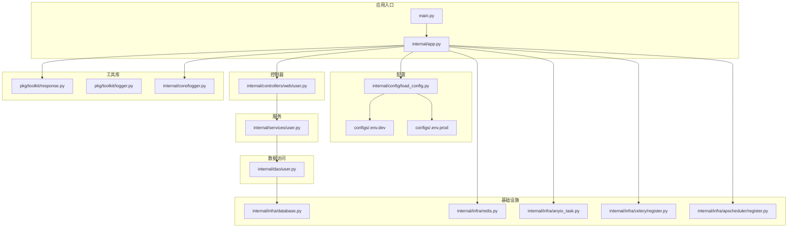
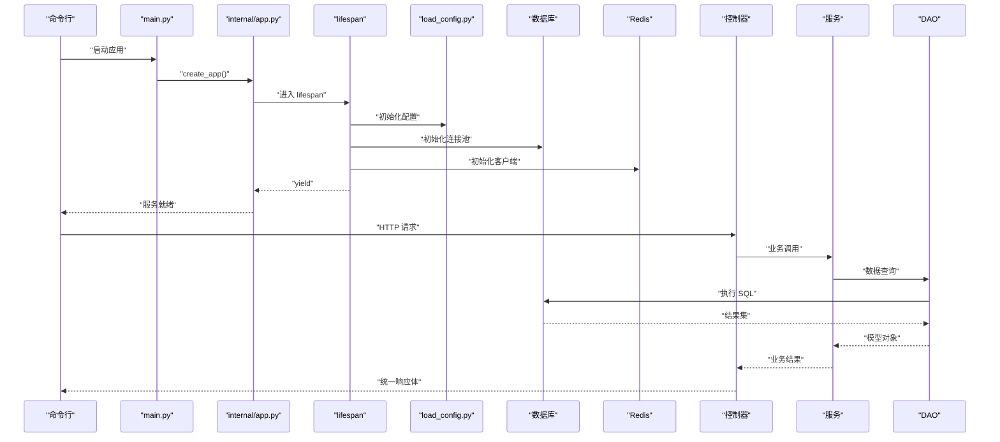
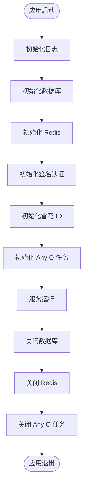
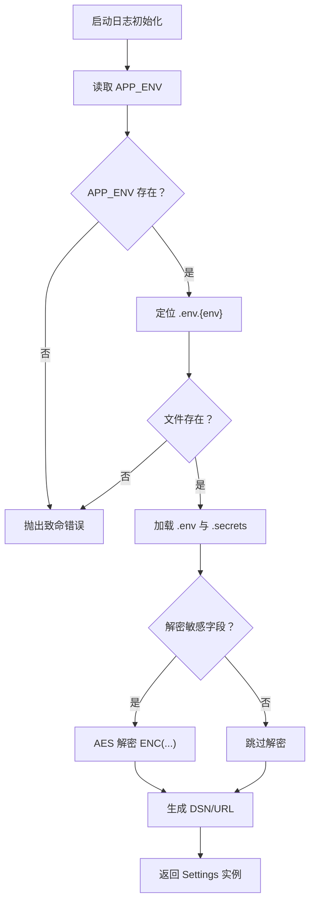
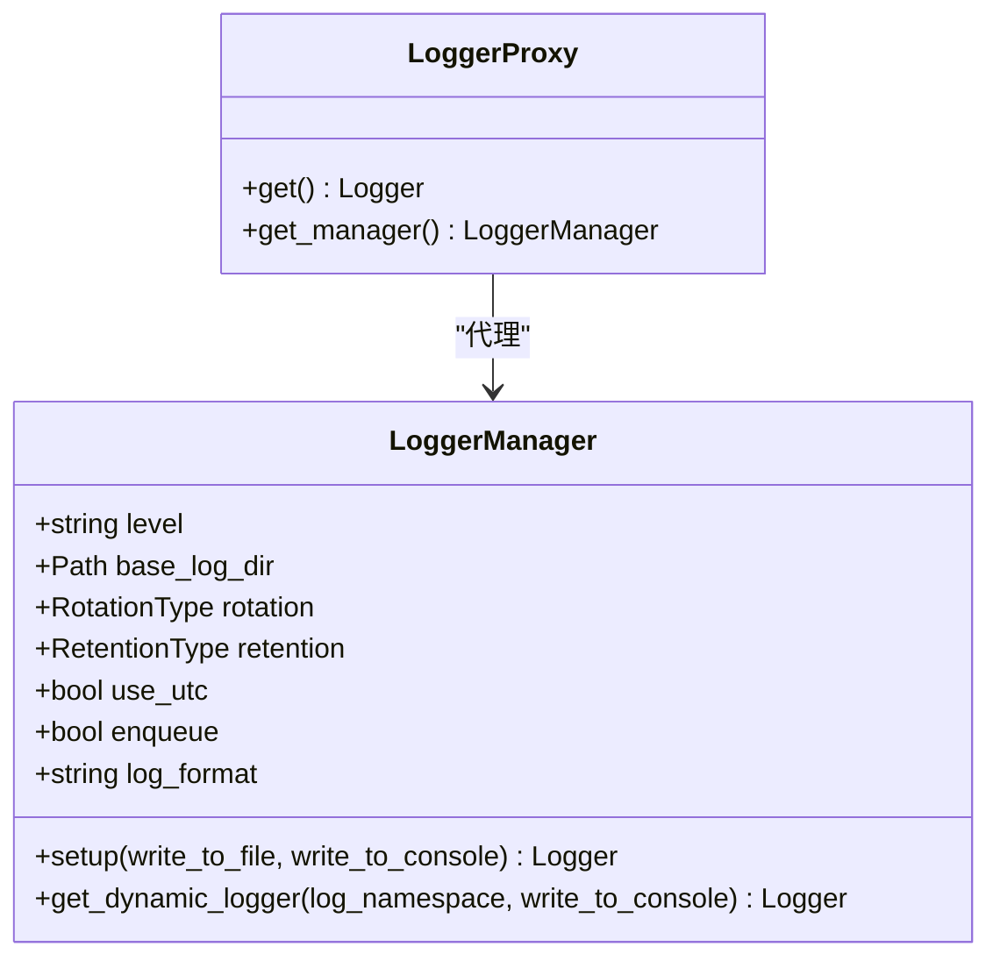
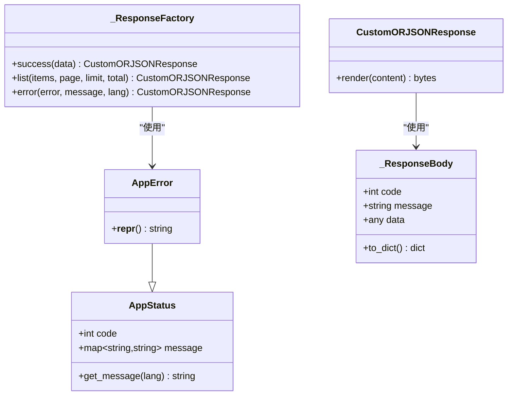
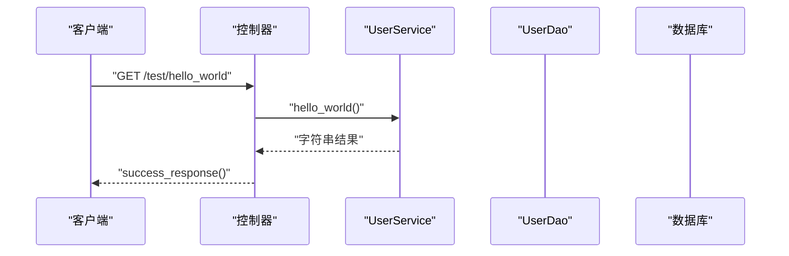
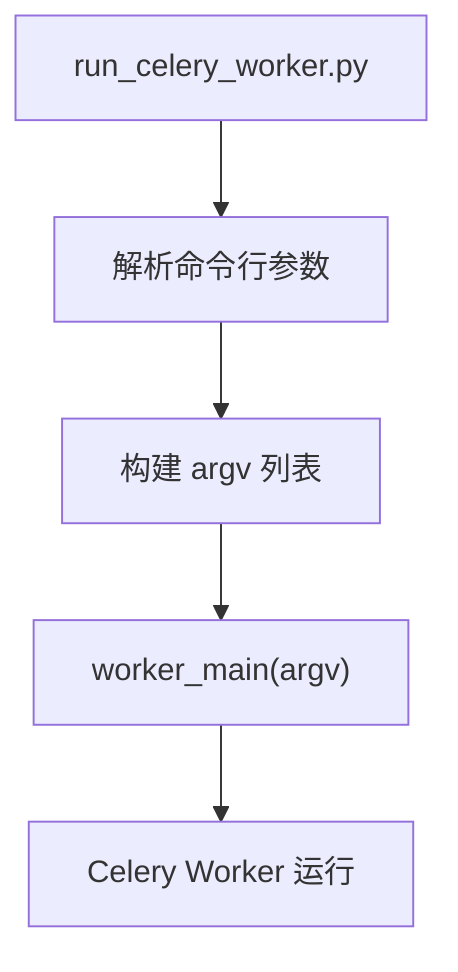
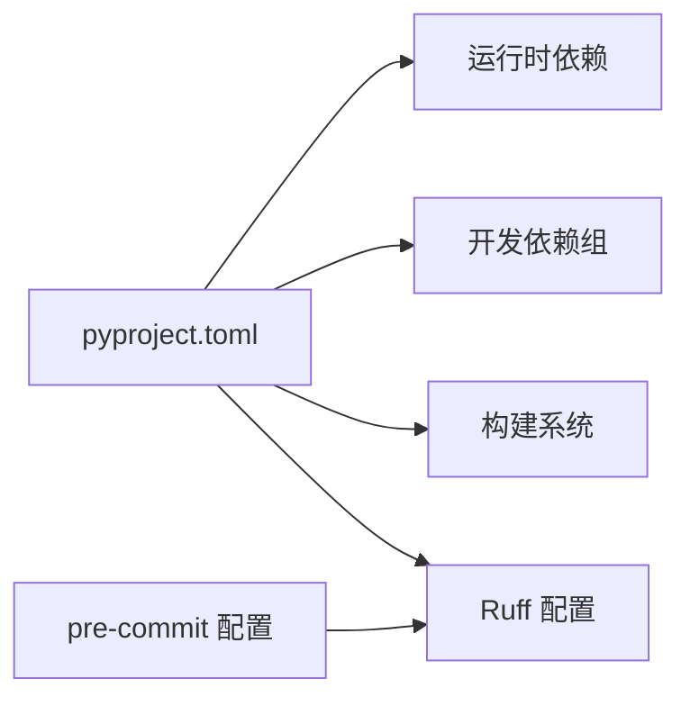

# 开发者指南

<cite>
**本文引用的文件**
- [README.md](file://README.md)
- [pyproject.toml](file://pyproject.toml)
- [main.py](file://main.py)
- [internal/app.py](file://internal/app.py)
- [.pre-commit-config.yaml](file://.pre-commit-config.yaml)
- [configs/.env.dev](file://configs/.env.dev)
- [configs/.env.prod](file://configs/.env.prod)
- [internal/config/load_config.py](file://internal/config/load_config.py)
- [internal/core/logger.py](file://internal/core/logger.py)
- [pkg/toolkit/response.py](file://pkg/toolkit/response.py)
- [internal/controllers/web/user.py](file://internal/controllers/web/user.py)
- [internal/services/user.py](file://internal/services/user.py)
- [internal/dao/user.py](file://internal/dao/user.py)
- [pkg/toolkit/logger.py](file://pkg/toolkit/logger.py)
- [scripts/run_celery_worker.py](file://scripts/run_celery_worker.py)
- [tests/logger/test_logger.py](file://tests/logger/test_logger.py)
- [tests/toolkit/test_crypto.py](file://tests/toolkit/test_crypto.py)
- [tests/toolkit/test_jwt.py](file://tests/toolkit/test_jwt.py)
- [tests/orm/test_orm.py](file://tests/orm/test_orm.py)
- [tests/test_celery_tasks.py](file://tests/test_celery_tasks.py)
- [tests/test_http_cli.py](file://tests/test_http_cli.py)
- [tests/test_json_response.py](file://tests/test_json_response.py)
- [tests/test_openai_client.py](file://tests/test_openai_client.py)
- [Dockerfile](file://Dockerfile)
- [docs/dataclass_use_guide.md](file://docs/dataclass_use_guide.md)
- [docs/md_use_guide.md](file://docs/md_use_guide.md)
- [docs/uv_use_guide.md](file://docs/uv_use_guide.md)
</cite>

## 目录
1. [简介](#简介)
2. [项目结构](#项目结构)
3. [核心组件](#核心组件)
4. [架构总览](#架构总览)
5. [详细组件分析](#详细组件分析)
6. [依赖关系分析](#依赖关系分析)
7. [性能考虑](#性能考虑)
8. [故障排查指南](#故障排查指南)
9. [结论](#结论)
10. [附录](#附录)

## 简介
本指南面向参与本 FastAPI 后端项目的开发者，系统阐述代码规范、贡献流程、最佳实践与开发工具链配置。内容涵盖编码标准与命名约定、文档规范、Git 工作流与分支管理、代码审查流程、开发工具与 IDE 设置、调试技巧、具体示例与重构指导、架构决策与设计原则、性能优化建议、安全编码实践以及测试驱动开发方法。目标是帮助新成员快速上手，同时为长期维护提供一致的工程标准。

## 项目结构
项目采用“分层+领域模型”组织方式，核心层次包括：
- 应用入口与生命周期：入口脚本负责创建应用实例；应用生命周期负责初始化/关闭基础设施。
- 配置层：集中管理环境变量与敏感信息解密。
- 控制器层：对外暴露 API 路由，负责请求编排与响应封装。
- 服务层：业务逻辑单元，专注职责单一、便于测试。
- 数据访问层：DAO 层抽象数据库操作，统一查询器与计数器接口。
- 基础设施层：数据库、Redis、定时任务、异步任务等外部依赖。
- 工具库与公共组件：日志、响应体、HTTP 客户端、加密、缓存等。
- 测试：覆盖日志、ORM、工具库、Celery 任务、HTTP 客户端、JSON 响应、OpenAI 客户端等。

图表来源
- [main.py](file://main.py#L1-L18)
- [internal/app.py](file://internal/app.py#L1-L109)
- [internal/config/load_config.py](file://internal/config/load_config.py#L1-L243)
- [configs/.env.dev](file://configs/.env.dev#L1-L20)
- [configs/.env.prod](file://configs/.env.prod#L1-L20)
- [internal/controllers/web/user.py](file://internal/controllers/web/user.py#L1-L17)
- [internal/services/user.py](file://internal/services/user.py#L1-L21)
- [internal/dao/user.py](file://internal/dao/user.py#L1-L24)
- [pkg/toolkit/response.py](file://pkg/toolkit/response.py#L1-L233)
- [pkg/toolkit/logger.py](file://pkg/toolkit/logger.py#L1-L339)
- [internal/core/logger.py](file://internal/core/logger.py#L1-L59)

章节来源
- [README.md](file://README.md#L1-L2)
- [pyproject.toml](file://pyproject.toml#L1-L155)
- [main.py](file://main.py#L1-L18)
- [internal/app.py](file://internal/app.py#L1-L109)

## 核心组件
- 应用创建与生命周期：应用工厂负责注册路由、异常处理与中间件，并通过 lifespan 管理数据库、Redis、签名认证、雪花 ID 生成器与 AnyIO 任务管理器的初始化与关闭。
- 配置加载：基于 Pydantic Settings 的 Settings 类，支持敏感字段解密、动态数据库 DSN 与 Redis URL 生成，并通过 .secrets 与 .env.{env} 文件加载。
- 日志系统：LoggerManager 提供统一日志配置、命名空间隔离、轮转与保留策略，并支持 JSON/文本两种格式。
- 响应体系：统一响应体结构与高性能 ORJSON 响应类，保证 Web 与任务序列化一致性。
- 控制器-服务-DAO：清晰分层，控制器仅做编排，服务专注业务，DAO 封装查询与计数。

章节来源
- [internal/app.py](file://internal/app.py#L17-L109)
- [internal/config/load_config.py](file://internal/config/load_config.py#L46-L243)
- [internal/core/logger.py](file://internal/core/logger.py#L31-L59)
- [pkg/toolkit/logger.py](file://pkg/toolkit/logger.py#L21-L339)
- [pkg/toolkit/response.py](file://pkg/toolkit/response.py#L14-L233)

## 架构总览
下图展示应用启动到请求处理的关键交互：

图表来源
- [main.py](file://main.py#L10-L18)
- [internal/app.py](file://internal/app.py#L84-L109)
- [internal/config/load_config.py](file://internal/config/load_config.py#L179-L243)
- [internal/dao/user.py](file://internal/dao/user.py#L6-L24)
- [internal/services/user.py](file://internal/services/user.py#L5-L21)
- [internal/controllers/web/user.py](file://internal/controllers/web/user.py#L13-L17)
- [pkg/toolkit/response.py](file://pkg/toolkit/response.py#L62-L81)

## 详细组件分析

### 应用生命周期与中间件
- 生命周期：在 lifespan 中完成日志、数据库、Redis、签名认证、雪花 ID、AnyIO 任务管理器的初始化与关闭。
- 中间件：GZip 压缩、认证、CORS、请求记录等，按优先级叠加。
- 异常处理：对请求验证异常统一转换为业务错误响应。

图表来源
- [internal/app.py](file://internal/app.py#L84-L109)

章节来源
- [internal/app.py](file://internal/app.py#L17-L109)

### 配置加载与敏感信息解密
- 环境检测：优先从系统环境变量读取 APP_ENV，否则从 .secrets 读取；随后定位 .env.{env} 并加载。
- 敏感字段：AES 解密 ENC(...) 包裹的密码字段，失败即报错。
- 动态 DSN：根据 DB_TYPE 生成 SQLAlchemy/Redis DSN，支持 MySQL、PostgreSQL、Oracle。

图表来源
- [internal/config/load_config.py](file://internal/config/load_config.py#L179-L243)

章节来源
- [internal/config/load_config.py](file://internal/config/load_config.py#L46-L243)
- [configs/.env.dev](file://configs/.env.dev#L1-L20)
- [configs/.env.prod](file://configs/.env.prod#L1-L20)

### 日志系统与命名空间
- LoggerManager：统一配置日志级别、轮转、保留、UTC 时间、队列写入与格式（JSON/文本），支持系统日志与动态命名空间。
- 内部代理：通过 LazyProxy 暴露 logger 与 logger_manager，避免未初始化访问。
- Trace ID：优先从 extra 传递，其次从上下文获取，最后回退。

图表来源
- [pkg/toolkit/logger.py](file://pkg/toolkit/logger.py#L21-L339)
- [internal/core/logger.py](file://internal/core/logger.py#L31-L59)

章节来源
- [pkg/toolkit/logger.py](file://pkg/toolkit/logger.py#L21-L339)
- [internal/core/logger.py](file://internal/core/logger.py#L31-L59)

### 响应体系与统一错误码
- 统一响应体：包含 code、message、data；支持分页列表与 SSE 包装。
- 高性能响应：基于 ORJSONResponse，render 直接返回 bytes，避免二次编码。
- 错误码：AppError 与 AppStatus 绑定多语言文案，错误响应可拼接自定义消息。

图表来源
- [pkg/toolkit/response.py](file://pkg/toolkit/response.py#L14-L233)

章节来源
- [pkg/toolkit/response.py](file://pkg/toolkit/response.py#L14-L233)

### 控制器-服务-DAO 分层
- 控制器：定义路由前缀与标签，使用依赖注入获取服务实例，返回统一响应。
- 服务：封装业务逻辑，避免直接依赖框架对象，便于单元测试。
- DAO：基于 BaseDao 封装查询与计数，使用 querier/counter 简化条件表达。

图表来源
- [internal/controllers/web/user.py](file://internal/controllers/web/user.py#L13-L17)
- [internal/services/user.py](file://internal/services/user.py#L10-L11)
- [pkg/toolkit/response.py](file://pkg/toolkit/response.py#L181-L185)

章节来源
- [internal/controllers/web/user.py](file://internal/controllers/web/user.py#L1-L17)
- [internal/services/user.py](file://internal/services/user.py#L1-L21)
- [internal/dao/user.py](file://internal/dao/user.py#L1-L24)

### Celery 工作线程与任务
- 工作线程脚本：提供默认队列、日志级别、进程池与并发度配置，支持命令行追加参数。
- 任务注册：通过 infra/celery/register.py 注册任务，配合 APScheduler 与 AnyIO 任务管理。

图表来源
- [scripts/run_celery_worker.py](file://scripts/run_celery_worker.py#L6-L35)

章节来源
- [scripts/run_celery_worker.py](file://scripts/run_celery_worker.py#L1-L38)

## 依赖关系分析
- 语言与构建：Python 3.12+，构建系统 setuptools/wheel，包管理 uv（非默认组）。
- 运行时依赖：FastAPI、Uvicorn、SQLAlchemy、aiomysql、Celery、APScheduler、Redis、loguru、PyJWT、bcrypt、openai、orjson、grpcio 等。
- 开发依赖：pytest、pytest-asyncio、black、ruff、mypy、各类 types stubs、twisted/trio/twisted 测试扩展。
- Lint 与格式化：Ruff 配置规则组合、导入排序、行宽限制、格式化风格；pre-commit 钩子集成。

图表来源
- [pyproject.toml](file://pyproject.toml#L1-L155)
- [.pre-commit-config.yaml](file://.pre-commit-config.yaml#L1-L7)

章节来源
- [pyproject.toml](file://pyproject.toml#L1-L155)
- [.pre-commit-config.yaml](file://.pre-commit-config.yaml#L1-L7)

## 性能考虑
- 响应序列化：使用 ORJSONResponse，避免重复编码，提升吞吐。
- 压缩传输：启用 GZip 中间件，降低带宽占用。
- 日志轮转：合理设置轮转与保留策略，避免磁盘膨胀。
- 异步与事件循环：使用 uvloop（非 Windows）与 httptools，提升网络 I/O 性能。
- ORM 与连接池：通过 SQLAlchemy 异步驱动与连接池参数优化数据库访问。
- 缓存与限流：结合 Redis 与速率限制中间件，减少重复计算与请求压力。

## 故障排查指南
- 配置加载失败：检查 .secrets 与 .env.{env} 是否存在，确认 APP_ENV 正确；查看启动日志中的配置加载信息。
- 敏感字段解密失败：确认 AES_SECRET 有效且 ENC(...) 格式正确；关注解密异常日志。
- 数据库连接异常：核对 DB_TYPE、主机、端口、用户名、密码与数据库名；检查 DSN 生成逻辑。
- Redis 连接异常：核对主机、端口、密码与数据库编号；确认连接 URL 生成。
- 日志不可写：检查 base_log_dir 目录权限与存在性；确认轮转与保留策略未导致目录缺失。
- 响应异常：确认返回类型符合 _process_success_data 约束；避免返回不被允许的类型。
- Celery Worker 启动失败：确认 POSIX 环境；检查队列名称、日志级别与并发参数；通过命令行追加参数调试。

章节来源
- [internal/config/load_config.py](file://internal/config/load_config.py#L179-L243)
- [pkg/toolkit/logger.py](file://pkg/toolkit/logger.py#L312-L315)
- [pkg/toolkit/response.py](file://pkg/toolkit/response.py#L114-L132)
- [scripts/run_celery_worker.py](file://scripts/run_celery_worker.py#L7-L10)

## 结论
本指南提供了从架构到实现细节的完整开发参考，强调分层清晰、配置集中、日志统一、响应一致与工具链完备。遵循本文档的规范与流程，可显著提升开发效率、代码质量与系统稳定性。

## 附录

### 代码规范与命名约定
- 文件与模块：小写下划线命名，模块名与目录名一致。
- 类与方法：PascalCase 类名，snake_case 方法名；私有方法以下划线开头。
- 常量：全大写下划线；敏感常量使用 SecretStr。
- 路由与标签：控制器前缀与标签清晰表达版本与功能。
- 异常与错误码：统一使用 AppError 与 AppStatus，错误文案多语言化。

### 文档规范
- Markdown：使用 docs/uv_use_guide.md、docs/md_use_guide.md、docs/dataclass_use_guide.md 等作为参考格式。
- 示例：在响应与日志模块中提供使用示例与注意事项。

章节来源
- [docs/uv_use_guide.md](file://docs/uv_use_guide.md)
- [docs/md_use_guide.md](file://docs/md_use_guide.md)
- [docs/dataclass_use_guide.md](file://docs/dataclass_use_guide.md)
- [pkg/toolkit/response.py](file://pkg/toolkit/response.py#L212-L232)
- [pkg/toolkit/logger.py](file://pkg/toolkit/logger.py#L224-L300)

### Git 工作流与分支管理
- 分支策略：采用 feature/*、release/*、hotfix/* 等命名，主分支保护，合并前必须通过 CI。
- 提交信息：采用动词开头、简短描述、必要时补充背景与影响范围。
- 合并与审查：开启 PR，至少一名 reviewer 通过；修复冲突后重新审查。

### 代码审查流程
- 覆盖面：功能变更需配套单元测试；性能改动需提供基准对比。
- 安全性：敏感字段必须加密存储；输入校验与权限控制必须完善。
- 可维护性：避免魔法数字与字符串；注释与文档同步更新。

### 开发工具配置与 IDE 设置
- Python 版本：3.12+；推荐使用虚拟环境。
- 包管理：pyproject.toml 定义依赖与分组；使用 uv 管理索引与安装。
- Lint 与格式化：Ruff 作为 linter 与 formatter；pre-commit 自动化执行。
- 测试：pytest 配置 markers；支持 trio、twisted、tornado 等异步生态。

章节来源
- [pyproject.toml](file://pyproject.toml#L108-L155)
- [.pre-commit-config.yaml](file://.pre-commit-config.yaml#L1-L7)

### 调试技巧
- 启动参数：main.py 支持 --port 指定端口；开发环境可开启 reload。
- 日志：使用 LoggerManager 的动态命名空间隔离不同模块日志；JSON 格式便于检索。
- 响应：统一响应体结构，便于前端与监控系统消费；SSE 场景使用 wrap_sse_data。

章节来源
- [main.py](file://main.py#L11-L17)
- [pkg/toolkit/logger.py](file://pkg/toolkit/logger.py#L145-L222)
- [pkg/toolkit/response.py](file://pkg/toolkit/response.py#L202-L209)

### 具体示例与重构指导
- 控制器示例：参考 internal/controllers/web/user.py 的路由定义与依赖注入。
- 服务示例：参考 internal/services/user.py 的业务方法与依赖注入工厂。
- DAO 示例：参考 internal/dao/user.py 的查询封装与单例模式。
- 重构建议：将复杂路由拆分为多个子路由；将重复逻辑抽取为工具函数；为服务方法增加类型注解与异常处理。

章节来源
- [internal/controllers/web/user.py](file://internal/controllers/web/user.py#L1-L17)
- [internal/services/user.py](file://internal/services/user.py#L1-L21)
- [internal/dao/user.py](file://internal/dao/user.py#L1-L24)

### 架构决策与设计原则
- 分层清晰：控制器、服务、DAO、基础设施职责分离，便于测试与演进。
- 配置集中：Settings 统一加载与解密，避免散落的硬编码。
- 日志统一：LoggerManager 提供一致的日志体验与可观测性。
- 响应一致：统一响应体与高性能序列化，保障前后端契约稳定。
- 可扩展性：中间件与生命周期钩子便于接入新能力（如认证、CORS、监控）。

### 性能优化建议
- I/O 优化：使用异步数据库驱动与连接池；启用 GZip 压缩。
- 序列化优化：ORJSON 响应减少 CPU 与内存开销。
- 日志优化：按需开启 JSON 格式与控制台输出；合理设置轮转与保留。
- 任务调度：Celery 与 APScheduler 配合，避免阻塞主线程。

### 安全编码实践
- 敏感信息：使用 ENC(...) 包裹并在 Settings 中解密；避免明文存储。
- 输入校验：使用 Pydantic 模型与 RequestValidationError 统一处理。
- 权限控制：中间件校验 Token，拒绝未授权访问。
- 依赖安全：定期更新依赖与扫描漏洞；使用受信镜像源。

### 测试驱动开发方法
- 单元测试：覆盖服务与 DAO 的核心逻辑；使用 mock 与 fixtures。
- 集成测试：使用 pytest 标记 integration，需要完整环境（如 Celery Worker 与 Redis）。
- 响应与日志：验证统一响应体结构与日志格式；SSE 场景验证数据包装。
- 工具库：覆盖加密、JWT、HTTP 客户端、JSON 序列化等工具函数。

章节来源
- [tests/logger/test_logger.py](file://tests/logger/test_logger.py)
- [tests/toolkit/test_crypto.py](file://tests/toolkit/test_crypto.py)
- [tests/toolkit/test_jwt.py](file://tests/toolkit/test_jwt.py)
- [tests/orm/test_orm.py](file://tests/orm/test_orm.py)
- [tests/test_celery_tasks.py](file://tests/test_celery_tasks.py)
- [tests/test_http_cli.py](file://tests/test_http_cli.py)
- [tests/test_json_response.py](file://tests/test_json_response.py)
- [tests/test_openai_client.py](file://tests/test_openai_client.py)

### Docker 与部署
- Dockerfile：用于容器化打包与部署；结合环境变量与配置文件使用。
- 环境：区分 local/dev/test/prod；敏感信息通过 .secrets 与 .env.{env} 管理。

章节来源
- [Dockerfile](file://Dockerfile)
- [configs/.env.dev](file://configs/.env.dev#L1-L20)
- [configs/.env.prod](file://configs/.env.prod#L1-L20)