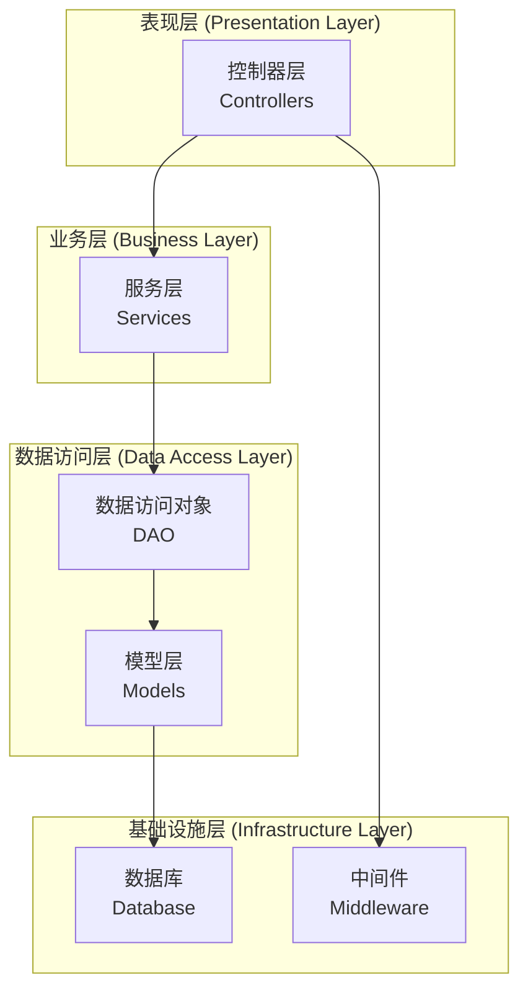
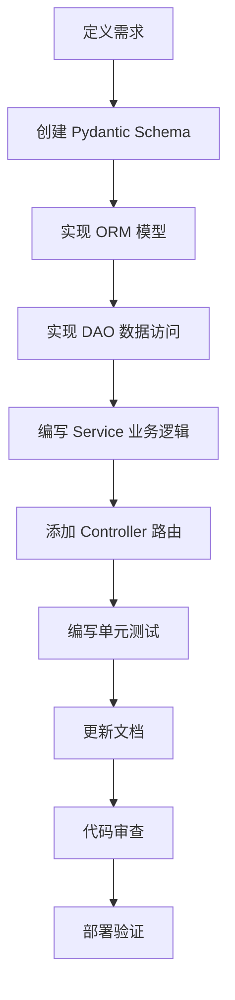
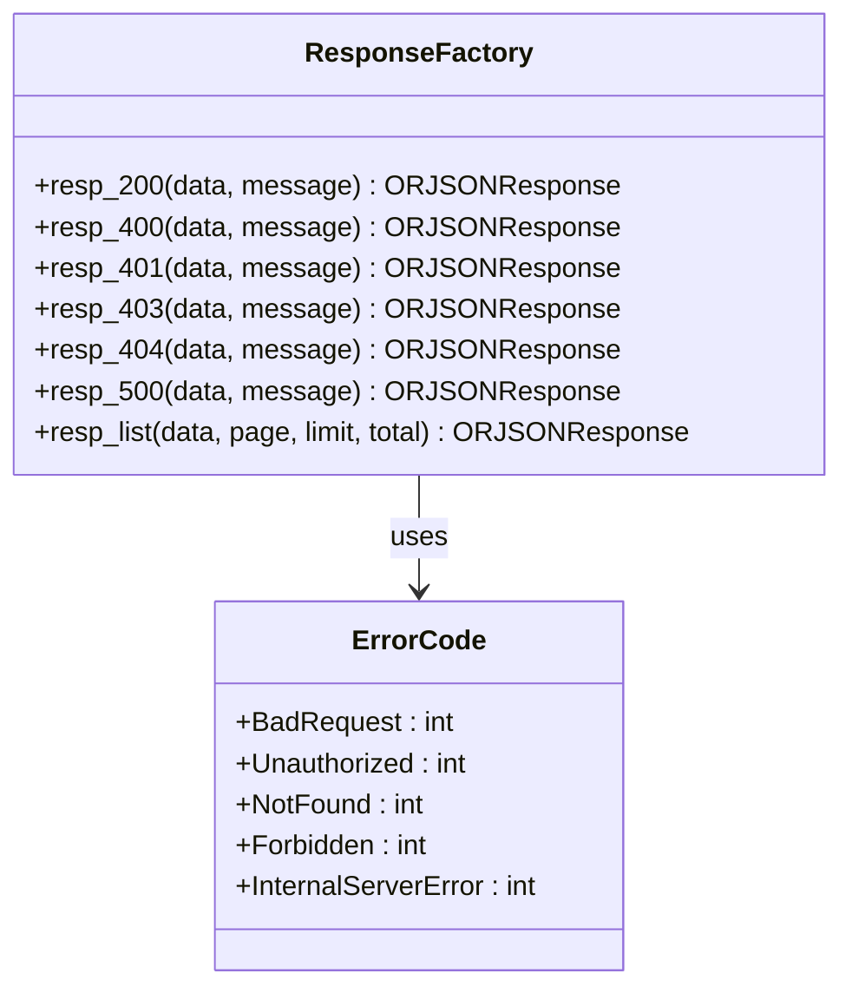
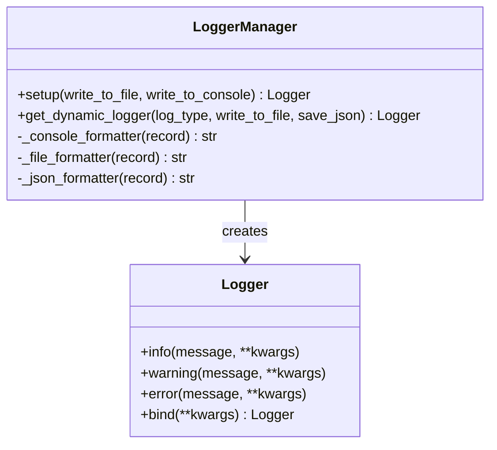
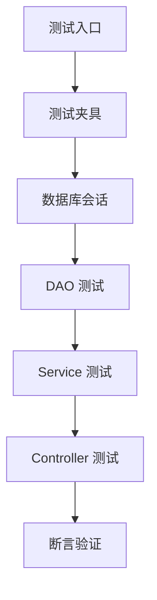
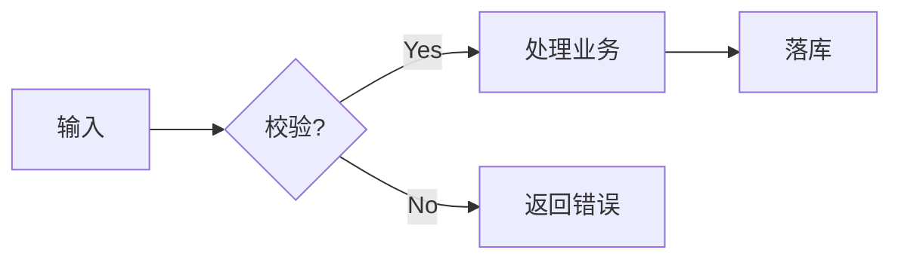

# 开发者指南

<cite>
**本文档中引用的文件**
- [internal/app.py](file://internal/app.py)
- [internal/schemas/user.py](file://internal/schemas/user.py)
- [internal/models/user.py](file://internal/models/user.py)
- [internal/dao/user.py](file://internal/dao/user.py)
- [internal/services/user.py](file://internal/services/user.py)
- [internal/controllers/web/user.py](file://internal/controllers/web/user.py)
- [pkg/resp_tool.py](file://pkg/resp_tool.py)
- [pkg/logger_tool.py](file://pkg/logger_tool.py)
- [internal/infra/database.py](file://internal/infra/database.py)
- [pyproject.toml](file://pyproject.toml)
- [tests/test_orm.py](file://tests/test_orm.py)
- [docs/md_use_guide.md](file://docs/md_use_guide.md)
- [pkg/database.py](file://pkg/database.py)
</cite>

## 目录
1. [项目概述](#项目概述)
2. [开发环境配置](#开发环境配置)
3. [代码风格规范](#代码风格规范)
4. [标准开发流程](#标准开发流程)
5. [功能开发示例：用户地址管理](#功能开发示例用户地址管理)
6. [异常处理机制](#异常处理机制)
7. [日志记录规范](#日志记录规范)
8. [测试编写指南](#测试编写指南)
9. [文档编写规范](#文档编写规范)
10. [代码提交检查清单](#代码提交检查清单)

## 项目概述

本项目采用 FastAPI 框架构建，遵循分层架构设计，包含以下核心层次：



**图表来源**
- [internal/app.py](file://internal/app.py#L17-L42)
- [internal/controllers/web/user.py](file://internal/controllers/web/user.py#L1-L13)

## 开发环境配置

### 环境要求
- Python >= 3.12
- uv 包管理器
- MySQL 数据库

### 依赖安装

项目使用 `uv` 作为包管理器，通过 `pyproject.toml` 配置依赖：

```bash
# 安装开发依赖
uv sync --group dev

# 安装生产依赖
uv sync
```

### 环境配置

复制环境配置文件：
```bash
cp configs/.env.local.example configs/.env.local
```

编辑 `.env.local` 文件，设置必要的环境变量。

**节来源**
- [pyproject.toml](file://pyproject.toml#L1-L113)

## 代码风格规范

### 代码格式化工具

项目使用以下工具保证代码风格一致性：

| 工具 | 用途 | 配置 |
|------|------|------|
| ruff | 代码检查和格式化 | `[tool.ruff]` |
| black | 代码格式化 | 自动集成 |
| mypy | 类型检查 | `[dependency-groups.dev]` |

### 代码风格要求

1. **导入顺序**：标准库 → 第三方库 → 项目内部模块
2. **类型注解**：所有函数参数和返回值必须添加类型注解
3. **命名规范**：
   - 类名：PascalCase
   - 函数和变量：snake_case
   - 常量：UPPER_CASE
4. **文档字符串**：每个公共函数和类必须包含文档字符串

### Ruff 配置

项目使用以下 Ruff 配置：
```toml
[tool.ruff]
target-version = "py312"
line-length = 120
exclude = ["venv", ".venv", "build", "dist"]
```

**节来源**
- [pyproject.toml](file://pyproject.toml#L105-L113)

## 标准开发流程

### 开发步骤

按照以下标准流程开发新功能：



### 1. 定义 Pydantic Schema

在 `internal/schemas/` 目录下创建对应的 Schema 文件。

**示例：用户地址 Schema**
```python
# internal/schemas/address.py
from pydantic import BaseModel, Field
from typing import Optional

class AddressCreateSchema(BaseModel):
    user_id: int
    province: str = Field(..., min_length=1, max_length=50)
    city: str = Field(..., min_length=1, max_length=50)
    district: str = Field(..., min_length=1, max_length=50)
    detail_address: str = Field(..., min_length=1, max_length=200)
    is_default: bool = False

class AddressUpdateSchema(BaseModel):
    province: Optional[str] = Field(None, min_length=1, max_length=50)
    city: Optional[str] = Field(None, min_length=1, max_length=50)
    district: Optional[str] = Field(None, min_length=1, max_length=50)
    detail_address: Optional[str] = Field(None, min_length=1, max_length=200)
    is_default: Optional[bool] = None

class AddressDetailSchema(BaseModel):
    id: int
    user_id: int
    province: str
    city: str
    district: str
    detail_address: str
    is_default: bool
    created_at: datetime
    updated_at: datetime
```

### 2. 创建 ORM 模型

在 `internal/models/` 目录下创建对应的模型文件。

**示例：用户地址模型**
```python
# internal/models/address.py
from sqlalchemy import Column, String, Boolean
from sqlalchemy.orm import Mapped, mapped_column
from pkg.database import Base, ModelMixin

class Address(Base, ModelMixin):
    __tablename__ = "address"
    
    user_id: Mapped[int] = mapped_column(BigInteger)
    province: Mapped[str] = mapped_column(String(50))
    city: Mapped[str] = mapped_column(String(50))
    district: Mapped[str] = mapped_column(String(50))
    detail_address: Mapped[str] = mapped_column(String(200))
    is_default: Mapped[bool] = mapped_column(Boolean, default=False)
```

### 3. 实现 DAO 数据访问

在 `internal/dao/` 目录下创建对应的 DAO 文件。

**示例：地址 DAO**
```python
# internal/dao/address.py
from internal.infra.database import get_session
from internal.models.address import Address
from pkg.database import BaseDao

class AddressDao(BaseDao[Address]):
    _model_cls: type[Address] = Address
    
    async def get_by_user_id(self, user_id: int) -> list[Address]:
        return await self.querier.eq_(Address.user_id, user_id).all()
    
    async def get_default_address(self, user_id: int) -> Address | None:
        return await self.querier.eq_(Address.user_id, user_id).eq_(Address.is_default, True).first()
    
    async def update_default_status(self, user_id: int, address_id: int) -> None:
        # 更新其他地址为非默认
        await self.updater.eq_(Address.user_id, user_id).update(is_default=False).execute()
        # 设置当前地址为默认
        await self.updater.eq_(Address.id, address_id).update(is_default=True).execute()

# 单例模式
address_dao = AddressDao(session_provider=get_session)
```

### 4. 编写 Service 业务逻辑

在 `internal/services/` 目录下创建对应的 Service 文件。

**示例：地址 Service**
```python
# internal/services/address.py
from fastapi import Request
from typing import Optional

from internal.dao.address import address_dao
from internal.models.address import Address
from internal.schemas.address import AddressCreateSchema, AddressUpdateSchema

class AddressService:
    
    @staticmethod
    async def create_address(request: Request, schema: AddressCreateSchema) -> Address:
        address = Address.create(
            user_id=request.state.user_id,
            province=schema.province,
            city=schema.city,
            district=schema.district,
            detail_address=schema.detail_address,
            is_default=schema.is_default
        )
        
        # 如果是默认地址，先更新其他地址为非默认
        if schema.is_default:
            await address_dao.update_default_status(request.state.user_id, address.id)
            
        await address.save(get_session)
        return address
    
    @staticmethod
    async def update_address(address_id: int, schema: AddressUpdateSchema) -> Address:
        address = await address_dao.query_by_primary_id(address_id)
        if not address:
            raise ValueError("Address not found")
        
        # 检查是否要更新默认状态
        if schema.is_default is not None:
            if schema.is_default:
                await address_dao.update_default_status(address.user_id, address_id)
            else:
                # 如果取消默认，检查是否有其他默认地址
                default_addr = await address_dao.get_default_address(address.user_id)
                if not default_addr:
                    raise ValueError("Cannot remove default address without setting another")
        
        await address.update(get_session, **schema.dict(exclude_unset=True))
        return address
    
    @staticmethod
    async def get_user_addresses(user_id: int) -> list[Address]:
        return await address_dao.get_by_user_id(user_id)
    
    @staticmethod
    async def delete_address(address_id: int) -> None:
        address = await address_dao.query_by_primary_id(address_id)
        if not address:
            raise ValueError("Address not found")
        
        # 如果是默认地址，需要设置其他地址为默认
        if address.is_default:
            other_addresses = await address_dao.get_by_user_id(address.user_id)
            if other_addresses:
                await address_dao.update_default_status(address.user_id, other_addresses[0].id)
        
        await address.soft_delete(get_session)

address_svc = AddressService()
```

### 5. 添加 Controller 路由

在 `internal/controllers/` 目录下添加对应的路由文件。

**示例：地址 Controller**
```python
# internal/controllers/web/address.py
from fastapi import APIRouter, Request
from typing import List

from internal.services.address import address_svc
from internal.schemas.address import AddressCreateSchema, AddressUpdateSchema, AddressDetailSchema
from pkg.resp_tool import response_factory

router = APIRouter(prefix="/addresses", tags=["Addresses"])

@router.post("")
async def create_address(request: Request, schema: AddressCreateSchema):
    """创建新地址"""
    address = await address_svc.create_address(request, schema)
    return response_factory.resp_200(data=address.to_dict())

@router.get("")
async def get_user_addresses(request: Request):
    """获取用户地址列表"""
    addresses = await address_svc.get_user_addresses(request.state.user_id)
    return response_factory.resp_200(data=[addr.to_dict() for addr in addresses])

@router.put("/{address_id}")
async def update_address(request: Request, address_id: int, schema: AddressUpdateSchema):
    """更新地址信息"""
    address = await address_svc.update_address(address_id, schema)
    return response_factory.resp_200(data=address.to_dict())

@router.delete("/{address_id}")
async def delete_address(request: Request, address_id: int):
    """删除地址"""
    await address_svc.delete_address(address_id)
    return response_factory.resp_200()
```

**节来源**
- [internal/controllers/web/user.py](file://internal/controllers/web/user.py#L1-L13)
- [internal/services/user.py](file://internal/services/user.py#L1-L17)
- [internal/dao/user.py](file://internal/dao/user.py#L1-L24)

## 功能开发示例：用户地址管理

### 数据库迁移脚本

创建地址表的 SQL 脚本：

```sql
-- ddl/1.0.1-address.sql
DROP TABLE IF EXISTS `address`;
CREATE TABLE `address`
(
    `id`             bigint unsigned NOT NULL AUTO_INCREMENT,
    `user_id`        bigint unsigned NOT NULL,
    `province`       varchar(50) COLLATE utf8mb4_general_ci NOT NULL,
    `city`           varchar(50) COLLATE utf8mb4_general_ci NOT NULL,
    `district`       varchar(50) COLLATE utf8mb4_general_ci NOT NULL,
    `detail_address` varchar(200) COLLATE utf8mb4_general_ci NOT NULL,
    `is_default`     tinyint(1) NOT NULL DEFAULT 0,
    `created_at`     datetime                               NOT NULL,
    `updated_at`     datetime                               NOT NULL,
    `deleted_at`     datetime DEFAULT NULL,
    `creator_id`     bigint unsigned NOT NULL,
    `updater_id`     bigint unsigned DEFAULT NULL,
    PRIMARY KEY (`id`),
    KEY              `user_id` (`user_id`) USING BTREE
) ENGINE=InnoDB DEFAULT CHARSET=utf8mb4 COLLATE=utf8mb4_general_ci;
```

### 完整的功能实现

#### 1. Schema 定义
```python
# internal/schemas/address.py
from pydantic import BaseModel, Field
from typing import Optional
from datetime import datetime

class AddressCreateSchema(BaseModel):
    user_id: int
    province: str = Field(..., min_length=1, max_length=50)
    city: str = Field(..., min_length=1, max_length=50)
    district: str = Field(..., min_length=1, max_length=50)
    detail_address: str = Field(..., min_length=1, max_length=200)
    is_default: bool = False

class AddressUpdateSchema(BaseModel):
    province: Optional[str] = Field(None, min_length=1, max_length=50)
    city: Optional[str] = Field(None, min_length=1, max_length=50)
    district: Optional[str] = Field(None, min_length=1, max_length=50)
    detail_address: Optional[str] = Field(None, min_length=1, max_length=200)
    is_default: Optional[bool] = None

class AddressDetailSchema(BaseModel):
    id: int
    user_id: int
    province: str
    city: str
    district: str
    detail_address: str
    is_default: bool
    created_at: datetime
    updated_at: datetime
```

#### 2. 模型定义
```python
# internal/models/address.py
from sqlalchemy import BigInteger, String, Boolean
from sqlalchemy.orm import Mapped, mapped_column
from pkg.database import Base, ModelMixin

class Address(Base, ModelMixin):
    __tablename__ = "address"
    
    user_id: Mapped[int] = mapped_column(BigInteger)
    province: Mapped[str] = mapped_column(String(50))
    city: Mapped[str] = mapped_column(String(50))
    district: Mapped[str] = mapped_column(String(50))
    detail_address: Mapped[str] = mapped_column(String(200))
    is_default: Mapped[bool] = mapped_column(Boolean, default=False)
```

#### 3. DAO 实现
```python
# internal/dao/address.py
from internal.infra.database import get_session
from internal.models.address import Address
from pkg.database import BaseDao

class AddressDao(BaseDao[Address]):
    _model_cls: type[Address] = Address
    
    async def get_by_user_id(self, user_id: int) -> list[Address]:
        return await self.querier.eq_(Address.user_id, user_id).all()
    
    async def get_default_address(self, user_id: int) -> Address | None:
        return await self.querier.eq_(Address.user_id, user_id).eq_(Address.is_default, True).first()
    
    async def update_default_status(self, user_id: int, address_id: int) -> None:
        # 更新其他地址为非默认
        await self.updater.eq_(Address.user_id, user_id).update(is_default=False).execute()
        # 设置当前地址为默认
        await self.updater.eq_(Address.id, address_id).update(is_default=True).execute()

address_dao = AddressDao(session_provider=get_session)
```

#### 4. Service 层实现
```python
# internal/services/address.py
from fastapi import Request
from typing import Optional

from internal.dao.address import address_dao
from internal.models.address import Address
from internal.schemas.address import AddressCreateSchema, AddressUpdateSchema

class AddressService:
    
    @staticmethod
    async def create_address(request: Request, schema: AddressCreateSchema) -> Address:
        address = Address.create(
            user_id=request.state.user_id,
            province=schema.province,
            city=schema.city,
            district=schema.district,
            detail_address=schema.detail_address,
            is_default=schema.is_default
        )
        
        # 如果是默认地址，先更新其他地址为非默认
        if schema.is_default:
            await address_dao.update_default_status(request.state.user_id, address.id)
            
        await address.save(get_session)
        return address
    
    @staticmethod
    async def update_address(address_id: int, schema: AddressUpdateSchema) -> Address:
        address = await address_dao.query_by_primary_id(address_id)
        if not address:
            raise ValueError("Address not found")
        
        # 检查是否要更新默认状态
        if schema.is_default is not None:
            if schema.is_default:
                await address_dao.update_default_status(address.user_id, address_id)
            else:
                # 如果取消默认，检查是否有其他默认地址
                default_addr = await address_dao.get_default_address(address.user_id)
                if not default_addr:
                    raise ValueError("Cannot remove default address without setting another")
        
        await address.update(get_session, **schema.dict(exclude_unset=True))
        return address
    
    @staticmethod
    async def get_user_addresses(user_id: int) -> list[Address]:
        return await address_dao.get_by_user_id(user_id)
    
    @staticmethod
    async def delete_address(address_id: int) -> None:
        address = await address_dao.query_by_primary_id(address_id)
        if not address:
            raise ValueError("Address not found")
        
        # 如果是默认地址，需要设置其他地址为默认
        if address.is_default:
            other_addresses = await address_dao.get_by_user_id(address.user_id)
            if other_addresses:
                await address_dao.update_default_status(address.user_id, other_addresses[0].id)
        
        await address.soft_delete(get_session)

address_svc = AddressService()
```

#### 5. Controller 实现
```python
# internal/controllers/web/address.py
from fastapi import APIRouter, Request
from typing import List

from internal.services.address import address_svc
from internal.schemas.address import AddressCreateSchema, AddressUpdateSchema, AddressDetailSchema
from pkg.resp_tool import response_factory

router = APIRouter(prefix="/addresses", tags=["Addresses"])

@router.post("")
async def create_address(request: Request, schema: AddressCreateSchema):
    """创建新地址"""
    address = await address_svc.create_address(request, schema)
    return response_factory.resp_200(data=address.to_dict())

@router.get("")
async def get_user_addresses(request: Request):
    """获取用户地址列表"""
    addresses = await address_svc.get_user_addresses(request.state.user_id)
    return response_factory.resp_200(data=[addr.to_dict() for addr in addresses])

@router.put("/{address_id}")
async def update_address(request: Request, address_id: int, schema: AddressUpdateSchema):
    """更新地址信息"""
    address = await address_svc.update_address(address_id, schema)
    return response_factory.resp_200(data=address.to_dict())

@router.delete("/{address_id}")
async def delete_address(request: Request, address_id: int):
    """删除地址"""
    await address_svc.delete_address(address_id)
    return response_factory.resp_200()
```

## 异常处理机制

### resp_tool 响应工厂

项目使用 `pkg/resp_tool.py` 提供统一的响应处理机制：



**图表来源**
- [pkg/resp_tool.py](file://pkg/resp_tool.py#L75-L209)

### 异常处理最佳实践

1. **统一响应格式**：
```python
{
    "code": 20000,
    "message": "成功",
    "data": {...}
}
```

2. **错误码定义**：
```python
# 错误码常量
class ErrorCode:
    BadRequest: int = 40000
    Unauthorized: int = 40001
    NotFound: int = 40004
    Forbidden: int = 40003
    InternalServerError: int = 50000
```

3. **控制器中的异常处理**：
```python
@router.post("")
async def create_address(request: Request, schema: AddressCreateSchema):
    try:
        address = await address_svc.create_address(request, schema)
        return response_factory.resp_200(data=address.to_dict())
    except ValueError as e:
        return response_factory.resp_400(message=str(e))
    except Exception as e:
        logger.error(f"Failed to create address: {e}")
        return response_factory.resp_500(message="Internal server error")
```

**节来源**
- [pkg/resp_tool.py](file://pkg/resp_tool.py#L59-L209)

## 日志记录规范

### LoggerManager 使用

项目使用 `pkg/logger_tool.py` 提供统一的日志管理：



**图表来源**
- [pkg/logger_tool.py](file://pkg/logger_tool.py#L15-L275)

### 日志使用示例

1. **基本日志记录**：
```python
from pkg.logger_tool import logger

logger.info("用户地址创建成功", user_id=user_id, address_id=address_id)
logger.error("地址更新失败", error=str(e), address_id=address_id)
```

2. **绑定上下文信息**：
```python
from pkg.logger_tool import get_dynamic_logger

# 创建带类型标识的日志器
address_logger = get_dynamic_logger("address_management")

# 记录带上下文的日志
address_logger.info("地址操作", operation="create", user_id=user_id)
```

3. **JSON 格式日志**：
```python
# 启用 JSON 格式的日志记录
logger = logger_manager.get_dynamic_logger("api_requests", save_json=True)
logger.info("API 请求", request_info=request_data, response_info=response_data)
```

### 日志配置

项目默认配置：
- 日志级别：INFO
- 轮转策略：每天午夜 UTC 时间
- 保留期限：30 天
- 支持控制台和文件输出

**节来源**
- [pkg/logger_tool.py](file://pkg/logger_tool.py#L15-L275)

## 测试编写指南

### 测试框架

项目使用 pytest 作为测试框架，支持异步测试：



### 测试文件结构

测试文件位于 `tests/` 目录，遵循命名规范：
- `test_<module>.py`：对应模块的测试文件
- `conftest.py`：共享测试配置

### 测试示例

**示例：地址 DAO 测试**
```python
# tests/test_address_dao.py
import pytest
from unittest.mock import MagicMock
from sqlalchemy import String
from sqlalchemy.orm import Mapped, mapped_column

from pkg.database import ModelMixin, BaseDao, Base, new_async_session_maker
from internal.models.address import Address
from internal.dao.address import AddressDao

@pytest.mark.asyncio
async def test_create_and_save_address(address_dao, db_session):
    """测试创建和保存地址"""
    # 1. Create (Transient)
    address = Address.create(
        user_id=1,
        province="北京",
        city="北京市",
        district="朝阳区",
        detail_address="望京SOHO",
        is_default=True
    )
    
    assert address.id is not None
    assert address.creator_id == 999
    
    # 2. Save (Insert)
    await address.save(db_session)
    
    # 验证数据库
    db_address = await address_dao.query_by_primary_id(address.id)
    assert db_address is not None
    assert db_address.province == "北京"
    assert db_address.is_default is True

@pytest.mark.asyncio
async def test_update_address(address_dao, db_session):
    """测试更新地址"""
    # 准备测试数据
    address = Address.create(
        user_id=1,
        province="上海",
        city="上海市",
        district="浦东新区",
        detail_address="陆家嘴",
        is_default=True
    )
    await address.save(db_session)
    
    # 1. Update Persistent Object
    db_address = await address_dao.query_by_primary_id(address.id)
    await db_address.update(db_session, city="新城市", is_default=False)
    
    reloaded = await address_dao.query_by_primary_id(address.id)
    assert reloaded.city == "新城市"
    assert reloaded.is_default is False
    assert reloaded.updater_id == 999
```

### 测试夹具

项目提供了数据库测试夹具：

```python
@pytest_asyncio.fixture(loop_scope="function")
async def db_session():
    """异步数据库会话夹具"""
    engine = create_async_engine("sqlite+aiosqlite:///:memory:", echo=False)
    
    # 建表
    async with engine.begin() as conn:
        await conn.run_sync(Base.metadata.create_all)
    
    session_maker = new_async_session_maker(engine)
    
    yield session_maker
    
    await engine.dispose()

@pytest.fixture
def address_dao(db_session):
    """地址 DAO 夹具"""
    return AddressDao(session_provider=db_session, model_cls=Address)
```

**节来源**
- [tests/test_orm.py](file://tests/test_orm.py#L1-L227)

## 文档编写规范

### 文档结构

项目使用 `docs/` 目录维护文档，包含：

| 文件 | 用途 | 格式 |
|------|------|------|
| md_use_guide.md | Markdown 使用指南 | Markdown |
| dataclass_use_guide.md | Dataclass 使用指南 | Markdown |
| uv_use_guide.md | UV 包管理器使用指南 | Markdown |

### 文档模板

参考 `docs/md_use_guide.md` 的模板：

```markdown
# [文档标题]

> 简介：一句话说明该文档的目标受众与核心价值。

## 1. 背景与目标
* **背景**：为什么要做这件事？
* **目标**：预期达成什么效果？

## 2. 快速开始 (Quick Start)

### 环境依赖
* Python >= 3.8
* Node.js >= 16

### 安装与运行

```bash
# 安装依赖
npm install

# 启动服务
npm run dev
```

## 3. 架构/流程设计



## 4. API 示例

```python
import requests

res = requests.get("https://api.example.com/v1/data")
print(res.json())
```

## 5. 常见问题 (FAQ)

* **Q: 遇到权限报错怎么办？**
    * A: 请检查 `.env` 文件中的 token 是否过期。

## 6. 参考资料
* [需求文档 (Jira)](https://...)
* [技术方案 (Wiki)](https://...)
```

### 文档编写最佳实践

1. **语义化换行**：建议"一句话占一行"，不要在段落中间硬回车
2. **相对路径**：引用仓库内图片时使用 `./assets/img.png`
3. **代码块语言**：务必标注语言（如 `json`, `bash`, `sql`）
4. **格式化工具**：推荐使用 `Prettier` 或 `markdownlint`

**节来源**
- [docs/md_use_guide.md](file://docs/md_use_guide.md#L1-L238)

## 代码提交检查清单

### 开发前检查

- [ ] 确认需求文档已评审通过
- [ ] 设计数据库表结构
- [ ] 确定 API 接口规范
- [ ] 创建数据库迁移脚本

### 开发阶段检查

- [ ] ✅ 遵循项目代码风格规范
- [ ] ✅ 使用 ruff 和 black 格式化代码
- [ ] ✅ 添加完整的类型注解
- [ ] ✅ 编写清晰的文档字符串
- [ ] ✅ 实现完整的异常处理
- [ ] ✅ 使用项目提供的日志工具
- [ ] ✅ 遵循分层架构设计原则

### 测试检查

- [ ] ✅ 编写单元测试覆盖核心功能
- [ ] ✅ 测试边界条件和异常情况
- [ ] ✅ 验证数据库操作的事务性
- [ ] ✅ 测试异步操作的正确性

### 文档检查

- [ ] ✅ 更新相关的技术文档
- [ ] ✅ 添加 API 文档注释
- [ ] ✅ 更新数据库迁移记录

### 提交前检查

- [ ] ✅ 运行所有测试用例
- [ ] ✅ 检查代码静态分析结果
- [ ] ✅ 验证日志输出格式
- [ ] ✅ 测试 API 接口功能

### 部署检查

- [ ] ✅ 验证数据库迁移脚本
- [ ] ✅ 检查环境配置文件
- [ ] ✅ 测试生产环境兼容性

## 结语

本开发者指南涵盖了从环境配置到功能开发的完整流程，以及项目特有的代码风格、异常处理、日志记录和文档规范。遵循这些指导原则，可以帮助团队成员高效协作，确保代码质量和项目稳定性。

记住，良好的代码不仅仅是功能正确，更重要的是可读性、可维护性和可扩展性。在开发过程中，始终考虑代码的长期价值和团队协作效率。