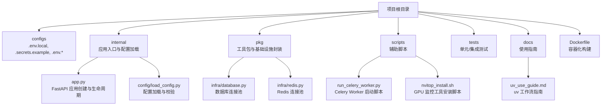
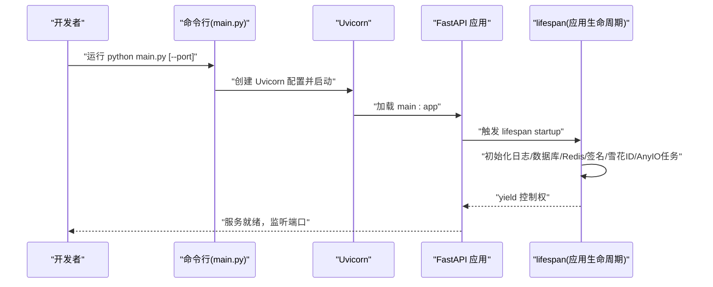
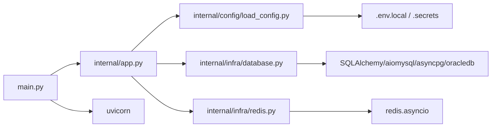

# 快速开始

<cite>
**本文引用的文件**
- [README.md](file://README.md)
- [pyproject.toml](file://pyproject.toml)
- [.env.local](file://configs/.env.local)
- [.secrets.example](file://configs/.secrets.example)
- [main.py](file://main.py)
- [internal/app.py](file://internal/app.py)
- [internal/config/load_config.py](file://internal/config/load_config.py)
- [docs/uv_use_guide.md](file://docs/uv_use_guide.md)
- [scripts/run_celery_worker.py](file://scripts/run_celery_worker.py)
- [Dockerfile](file://Dockerfile)
- [internal/infra/database.py](file://internal/infra/database.py)
- [internal/infra/redis.py](file://internal/infra/redis.py)
- [pkg/toolkit/config_loader.py](file://pkg/toolkit/config_loader.py)
- [scripts/nvitop_install.sh](file://scripts/nvitop_install.sh)
</cite>

## 目录
1. [简介](#简介)
2. [项目结构](#项目结构)
3. [核心组件](#核心组件)
4. [架构总览](#架构总览)
5. [详细组件分析](#详细组件分析)
6. [依赖关系分析](#依赖关系分析)
7. [性能注意事项](#性能注意事项)
8. [故障排查指南](#故障排查指南)
9. [结论](#结论)
10. [附录](#附录)

## 简介
本指南面向首次接触本项目的开发者，帮助你在最短时间内完成环境准备、依赖安装、配置设置与本地启动。你将获得：
- 环境要求与工具链（Python 3.12+、Git、uv）
- 依赖安装与同步（uv 工具链）
- 配置文件设置（.env.local、.secrets.example）
- 本地开发环境启动流程与命令示例
- 常见初始化问题与解决方案
- 不同操作系统（macOS/Linux/Windows）的安装与运行建议

## 项目结构
该项目采用“分层 + 功能模块”组织方式，核心入口与配置加载位于 internal 子目录，应用服务与基础设施在 pkg 与 internal 下实现，配置文件集中在 configs 目录。

图表来源
- [internal/app.py](file://internal/app.py#L1-L109)
- [internal/config/load_config.py](file://internal/config/load_config.py#L1-L243)
- [internal/infra/database.py](file://internal/infra/database.py#L1-L154)
- [internal/infra/redis.py](file://internal/infra/redis.py#L1-L98)
- [scripts/run_celery_worker.py](file://scripts/run_celery_worker.py#L1-L38)
- [scripts/nvitop_install.sh](file://scripts/nvitop_install.sh#L1-L39)
- [docs/uv_use_guide.md](file://docs/uv_use_guide.md#L1-L361)
- [Dockerfile](file://Dockerfile#L1-L38)

章节来源
- [internal/app.py](file://internal/app.py#L1-L109)
- [internal/config/load_config.py](file://internal/config/load_config.py#L1-L243)

## 核心组件
- 应用入口与生命周期
  - 应用通过内部工厂函数创建，注册路由、异常处理与中间件，并在 lifespan 中初始化日志、数据库、Redis、签名认证、Snowflake ID 生成器与 AnyIO 任务管理器。
- 配置加载
  - 通过 Pydantic Settings 从 .env.local 与 .secrets 中加载环境变量，支持敏感字段解密（AES），并动态生成数据库与 Redis 连接串。
- 基础设施
  - 数据库：基于 SQLAlchemy AsyncEngine 与 async_sessionmaker，内置 SQL 监听与慢查询日志。
  - Redis：基于 redis.asyncio 连接池，提供统一缓存客户端封装。
- 启动与运行
  - 本地通过 main.py 启动 Uvicorn；Dockerfile 使用 uv 作为包管理器与虚拟环境；Celery Worker 通过脚本启动。

章节来源
- [internal/app.py](file://internal/app.py#L17-L109)
- [internal/config/load_config.py](file://internal/config/load_config.py#L46-L243)
- [internal/infra/database.py](file://internal/infra/database.py#L26-L154)
- [internal/infra/redis.py](file://internal/infra/redis.py#L18-L98)
- [main.py](file://main.py#L1-L18)
- [Dockerfile](file://Dockerfile#L1-L38)

## 架构总览
下图展示了本地开发启动的关键流程：命令行参数解析、Uvicorn 启动、应用生命周期初始化与中间件注册。

图表来源
- [main.py](file://main.py#L10-L17)
- [internal/app.py](file://internal/app.py#L84-L109)

章节来源
- [main.py](file://main.py#L1-L18)
- [internal/app.py](file://internal/app.py#L17-L109)

## 详细组件分析

### 环境与工具要求
- Python 版本
  - 项目要求 Python >= 3.12，推荐使用 3.12.x。
- 必备工具
  - Git：版本控制与代码拉取
  - uv：包管理、虚拟环境与依赖锁定
- 可选工具
  - Docker：容器化构建与部署
  - Celery：后台任务队列（POSIX 系统）

章节来源
- [pyproject.toml](file://pyproject.toml#L6-L6)
- [docs/uv_use_guide.md](file://docs/uv_use_guide.md#L94-L111)
- [Dockerfile](file://Dockerfile#L1-L11)

### 依赖安装与同步（uv 工作流）
- 初始化与同步
  - 新人或切换分支后，执行依赖同步以创建虚拟环境并安装锁定版本依赖。
- 依赖更新与提交
  - 添加/删除/升级依赖后，uv 会自动更新 pyproject.toml 与 uv.lock，随后同步到本地虚拟环境。
- Python 版本管理
  - 通过 uv 列表可用版本并在指定版本创建虚拟环境，确保本地与 CI 一致。
- CI/CD 可复现构建
  - 使用冻结模式强制使用锁定版本，保证构建一致性。
- 分组依赖
  - 主依赖与开发依赖分离，按需安装，减少生产镜像体积。
- 运行与清理
  - 使用 uv run 在隔离环境中运行命令；必要时清理缓存或重建虚拟环境。

章节来源
- [docs/uv_use_guide.md](file://docs/uv_use_guide.md#L23-L91)
- [docs/uv_use_guide.md](file://docs/uv_use_guide.md#L114-L191)
- [docs/uv_use_guide.md](file://docs/uv_use_guide.md#L194-L214)
- [docs/uv_use_guide.md](file://docs/uv_use_guide.md#L216-L254)

### 配置文件设置
- .secrets 配置
  - 必填项：APP_ENV（local/dev/test/prod）、AES_SECRET、JWT_SECRET
  - 可选项：ECHO_CONFIG（调试时打印配置详情）
  - 重要：复制 .secrets.example 为 .secrets 并填写真实值。
- .env.local 配置
  - 包含调试开关、JWT 算法、数据库类型与连接信息、Redis 连接信息、Token 过期时间等。
  - 该文件会被配置加载器按顺序加载并覆盖更高优先级的配置。
- 配置加载流程
  - 读取 APP_ENV → 校验对应 .env.{env} 文件是否存在 → 合并 .env.{env} 与 .secrets → 实例化 Settings → 可选打印配置详情。
  - 敏感字段支持 AES 解密（ENC(...) 格式）。

章节来源
- [.secrets.example](file://configs/.secrets.example#L1-L17)
- [.env.local](file://configs/.env.local#L1-L20)
- [internal/config/load_config.py](file://internal/config/load_config.py#L179-L243)
- [pkg/toolkit/config_loader.py](file://pkg/toolkit/config_loader.py#L24-L140)

### 本地开发环境启动流程
- 步骤概览
  - 安装 uv 并初始化虚拟环境
  - 同步依赖（uv sync）
  - 准备配置文件（.secrets 与 .env.local）
  - 启动应用（python main.py [--port N]）
  - 可选：启动 Celery Worker（POSIX 系统）
- 命令示例
  - 安装 uv 并初始化：参考 uv 安装与初始化命令
  - 同步依赖：uv sync
  - 启动应用：python main.py --port 8090
  - 启动 Celery Worker：python scripts/run_celery_worker.py
- 预期输出
  - 应用启动后输出生命周期初始化日志（如数据库、Redis 初始化成功），随后监听指定端口。
  - Celery Worker 输出工作进程启动与队列消费日志。

章节来源
- [docs/uv_use_guide.md](file://docs/uv_use_guide.md#L257-L360)
- [main.py](file://main.py#L10-L17)
- [scripts/run_celery_worker.py](file://scripts/run_celery_worker.py#L6-L35)

### 数据库与 Redis 初始化
- 数据库
  - 初始化时创建 AsyncEngine 与 async_sessionmaker，开启 pre_ping、连接池大小与超时配置，并注册 SQL 执行事件监听。
  - 提供 get_session 上下文管理器，支持自动回滚与异常处理。
- Redis
  - 初始化连接池与 Redis 客户端，提供 get_redis 上下文管理器与统一缓存客户端封装。

章节来源
- [internal/infra/database.py](file://internal/infra/database.py#L26-L154)
- [internal/infra/redis.py](file://internal/infra/redis.py#L18-L98)

### 关键文件作用说明
- main.py：应用入口，解析命令行参数，创建并启动 Uvicorn 服务器。
- internal/app.py：应用工厂函数，注册路由、异常处理、中间件与生命周期钩子。
- internal/config/load_config.py：配置加载与校验，敏感字段解密，动态生成数据库/Redis 连接串。
- configs/.env.local 与 .secrets：运行时配置与密钥文件。
- Dockerfile：基于 uv 的容器化构建，使用 frozen 锁定版本安装依赖。
- scripts/run_celery_worker.py：Celery Worker 启动脚本（POSIX 系统）。
- pkg/toolkit/config_loader.py：通用配置文件加载器（JSON/YAML/TOML/INI/ENV）。

章节来源
- [main.py](file://main.py#L1-L18)
- [internal/app.py](file://internal/app.py#L17-L109)
- [internal/config/load_config.py](file://internal/config/load_config.py#L46-L243)
- [.env.local](file://configs/.env.local#L1-L20)
- [.secrets.example](file://configs/.secrets.example#L1-L17)
- [Dockerfile](file://Dockerfile#L1-L38)
- [scripts/run_celery_worker.py](file://scripts/run_celery_worker.py#L1-L38)
- [pkg/toolkit/config_loader.py](file://pkg/toolkit/config_loader.py#L24-L140)

## 依赖关系分析
- 应用启动依赖
  - main.py 依赖 internal.app.create_app，后者在 lifespan 中依赖数据库、Redis、日志、签名与任务管理器初始化。
- 配置依赖
  - 配置加载依赖 dotenv 与 pydantic-settings，敏感字段依赖 AES 解密工具。
- 基础设施依赖
  - 数据库依赖 SQLAlchemy 与 aiomysql/asyncpg/oracledb，Redis 依赖 redis.asyncio。
- 工具链依赖
  - uv 作为包管理与虚拟环境工具，Dockerfile 使用 uvx 安装 uv 并在容器内同步依赖。

图表来源
- [main.py](file://main.py#L1-L18)
- [internal/app.py](file://internal/app.py#L1-L109)
- [internal/config/load_config.py](file://internal/config/load_config.py#L1-L243)
- [internal/infra/database.py](file://internal/infra/database.py#L1-L154)
- [internal/infra/redis.py](file://internal/infra/redis.py#L1-L98)

章节来源
- [pyproject.toml](file://pyproject.toml#L8-L70)

## 性能注意事项
- 连接池与超时
  - 数据库连接池大小、溢出数量与超时时间已在初始化中配置，建议结合实际负载调整。
- SQL 监控
  - 通过事件监听记录慢查询与调试 SQL，便于定位性能瓶颈。
- 日志与中间件
  - GZip 响应压缩与日志中间件有助于提升传输效率与可观测性。
- 运行时循环
  - 容器镜像使用 uvloop 与 httptools，提升异步 I/O 性能。

章节来源
- [internal/infra/database.py](file://internal/infra/database.py#L38-L56)
- [internal/infra/database.py](file://internal/infra/database.py#L116-L154)
- [internal/app.py](file://internal/app.py#L55-L82)
- [Dockerfile](file://Dockerfile#L31-L38)

## 故障排查指南
- 缺少 .secrets 或 .env.local
  - 现象：配置加载失败，抛出关键错误日志。
  - 处理：复制 .secrets.example 为 .secrets 并填写必要字段；确保 .env.local 与 APP_ENV 对应的 .env.{env} 文件存在。
- APP_ENV 未设置或为空
  - 现象：无法确定环境，配置加载失败。
  - 处理：在系统环境或 .secrets 中设置 APP_ENV。
- 敏感字段解密失败
  - 现象：AES 解密异常，提示字段解密失败。
  - 处理：确认 AES_SECRET 正确，敏感字段格式为 ENC(...)。
- 数据库连接失败
  - 现象：初始化数据库时报错。
  - 处理：核对 .env.local 中 DB_* 字段，确认数据库服务可达；检查驱动与连接串。
- Redis 连接失败
  - 现象：初始化 Redis 报错。
  - 处理：核对 .env.local 中 REDIS_* 字段，确认 Redis 服务可达。
- Windows 不支持 Celery Worker
  - 现象：脚本报错，提示不支持 Windows。
  - 处理：在 POSIX 系统（Linux/macOS）运行 Celery Worker。
- Docker 构建失败
  - 现象：依赖安装或健康检查失败。
  - 处理：确保 uv.lock 与 pyproject.toml 一致；使用 --frozen 强制锁定版本；检查网络镜像源。

章节来源
- [internal/config/load_config.py](file://internal/config/load_config.py#L184-L214)
- [internal/config/load_config.py](file://internal/config/load_config.py#L98-L116)
- [internal/infra/database.py](file://internal/infra/database.py#L26-L56)
- [internal/infra/redis.py](file://internal/infra/redis.py#L18-L45)
- [scripts/run_celery_worker.py](file://scripts/run_celery_worker.py#L7-L10)
- [Dockerfile](file://Dockerfile#L27-L34)

## 结论
按照本指南完成环境准备、依赖同步与配置设置后，你可以在本地快速启动应用并验证服务可用性。建议在开发过程中：
- 使用 uv 维护依赖一致性
- 通过 .secrets 与 .env.local 管理密钥与环境变量
- 在 POSIX 系统上运行 Celery Worker
- 结合日志与慢查询监控优化性能

## 附录

### 常用命令清单
- 安装 uv 并初始化
  - 参考：[安装与初始化命令](file://docs/uv_use_guide.md#L257-L266)
- 同步依赖
  - 参考：[uv sync](file://docs/uv_use_guide.md#L27-L29)
- 运行应用
  - 参考：[启动命令](file://docs/uv_use_guide.md#L176-L190)
- 运行 Celery Worker（POSIX）
  - 参考：[Worker 启动脚本](file://scripts/run_celery_worker.py#L6-L35)
- Docker 构建
  - 参考：[Dockerfile](file://Dockerfile#L15-L38)

### 不同操作系统安装建议
- macOS/Linux
  - 安装 uv：参考安装脚本与初始化命令
  - 启动应用与 Celery Worker：使用上述命令
- Windows
  - 不支持 Celery Worker（POSIX 限制）
  - 建议使用 WSL2 或容器化方案运行 Worker

章节来源
- [docs/uv_use_guide.md](file://docs/uv_use_guide.md#L257-L360)
- [scripts/run_celery_worker.py](file://scripts/run_celery_worker.py#L7-L10)