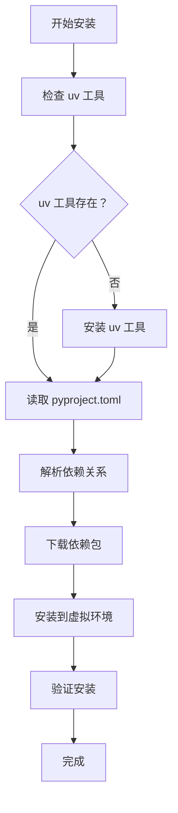
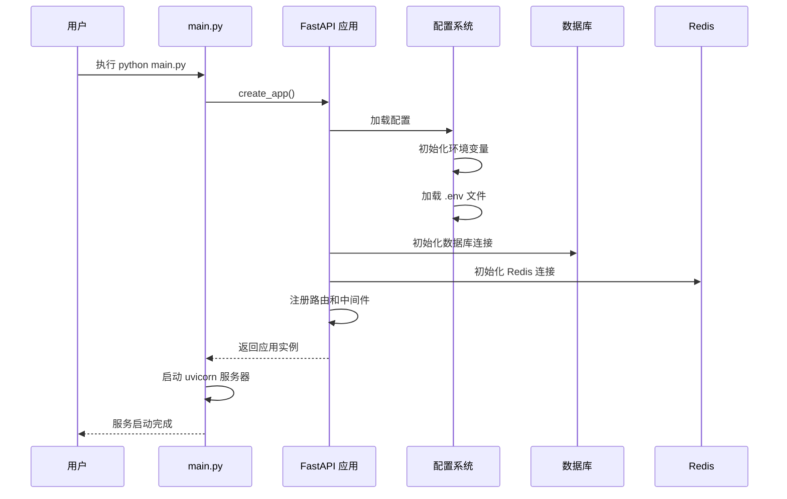
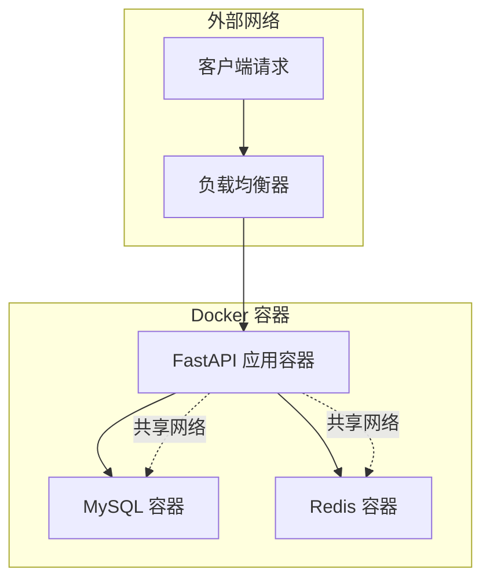
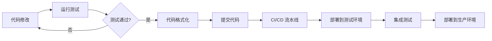

# 快速开始

<cite>
**本文档引用的文件**
- [README.md](file://README.md)
- [main.py](file://main.py)
- [pyproject.toml](file://pyproject.toml)
- [Dockerfile](file://Dockerfile)
- [configs/.env.dev](file://configs/.env.dev)
- [configs/.env.local](file://configs/.env.local)
- [configs/.env.prod](file://configs/.env.prod)
- [configs/.env.test](file://configs/.env.test)
- [internal/app.py](file://internal/app.py)
- [internal/config/setting.py](file://internal/config/setting.py)
- [internal/config/__init__.py](file://internal/config/__init__.py)
- [pkg/__init__.py](file://pkg/__init__.py)
- [docs/uv_use_guide.md](file://docs/uv_use_guide.md)
</cite>

## 目录
1. [项目简介](#项目简介)
2. [系统要求](#系统要求)
3. [环境准备](#环境准备)
4. [项目克隆与初始化](#项目克隆与初始化)
5. [Python 环境配置](#python-环境配置)
6. [依赖安装](#依赖安装)
7. [配置文件设置](#配置文件设置)
8. [启动应用程序](#启动应用程序)
9. [Docker 方式启动](#docker-方式启动)
10. [验证服务](#验证服务)
11. [常见问题解决](#常见问题解决)
12. [开发环境配置](#开发环境配置)

## 项目简介

FastAPI Backend 是一个基于 FastAPI 框架构建的企业级后端服务项目，采用现代化的 Python 3.12+ 技术栈，集成了多种企业级功能特性。项目使用 uv 包管理工具，支持多环境配置，具备完整的数据库连接、Redis 缓存、任务调度等功能。

### 主要特性
- **高性能 Web 框架**：基于 FastAPI，提供异步 API 支持
- **现代化包管理**：使用 uv 工具进行依赖管理和虚拟环境控制
- **多环境支持**：支持 local、dev、test、prod 四种环境配置
- **数据库集成**：使用 SQLAlchemy ORM 进行数据库操作
- **缓存支持**：集成 Redis 缓存系统
- **任务调度**：支持 Celery 和 APScheduler 任务调度
- **Docker 支持**：提供完整的容器化部署方案

## 系统要求

### 基础要求
- **Python 版本**：3.12 或更高版本
- **操作系统**：Windows、Linux、macOS
- **内存**：至少 2GB RAM
- **磁盘空间**：至少 1GB 可用空间

### 可选依赖
- **MySQL 数据库**：用于生产环境数据存储
- **Redis 服务器**：用于缓存和会话存储
- **Docker**：用于容器化部署（可选）

## 环境准备

### 1. 安装 Python 3.12+

#### Windows 系统
```bash
# 方法1：下载官方安装包
# 访问 https://www.python.org/downloads/ 下载 Python 3.12.x

# 方法2：使用 Chocolatey
choco install python --version=3.12.9

# 方法3：使用 Scoop
scoop install python@3.12.9
```

#### Linux 系统
```bash
# Ubuntu/Debian
sudo apt update
sudo apt install python3.12 python3.12-venv python3.12-dev

# CentOS/RHEL/Fedora
sudo yum install python3.12 python3.12-devel
# 或
sudo dnf install python3.12 python3.12-devel

# Arch Linux
sudo pacman -S python
```

#### macOS 系统
```bash
# 使用 Homebrew
brew install python@3.12

# 或使用 MacPorts
sudo port install python312
```

### 2. 验证 Python 安装

```bash
python --version
# 应输出 Python 3.12.x

python3 --version
# 应输出 Python 3.12.x
```

## 项目克隆与初始化

### 克隆项目

```bash
# 使用 HTTPS
git clone https://github.com/your-repository/fastapi-backend.git
cd fastapi-backend

# 或使用 SSH（需要配置 SSH 密钥）
git clone git@github.com:your-repository/fastapi-backend.git
cd fastapi-backend
```

### 检查项目结构

```bash
# 查看项目目录结构
ls  # Windows: dir
tree  # Windows: tree /f
```

项目应该包含以下关键目录和文件：
- `configs/` - 配置文件目录
- `internal/` - 核心业务逻辑
- `pkg/` - 公共工具包
- `tests/` - 测试文件
- `main.py` - 应用程序入口
- `pyproject.toml` - 项目配置文件
- `Dockerfile` - 容器化配置

## Python 环境配置

### 1. 安装 uv 包管理工具

uv 是一个快速的 Python 包管理器，专为现代 Python 开发设计。

```bash
# 安装 uv（推荐方法）
curl -LsSf https://astral.sh/uv/install.sh | sh

# 或使用 pip 安装
pip install uv

# 验证安装
uv --version
```

### 2. 设置 Python 版本

项目要求 Python 3.12+，确保使用正确的 Python 版本：

```bash
# 查看可用的 Python 版本
uv python list

# 创建虚拟环境（如果需要）
uv venv .venv --python 3.12
```

### 3. 激活虚拟环境

```bash
# Windows PowerShell
.\.venv\Scripts\Activate

# Windows CMD
\.venv\Scripts\activate.bat

# Linux/macOS
source .venv/bin/activate
```

## 依赖安装

### 使用 uv 安装依赖

项目使用 uv 工具进行依赖管理，这是最推荐的方式：

```bash
# 安装所有生产依赖
uv sync

# 安装开发依赖（可选）
uv sync --group dev

# 安装特定环境的依赖
uv sync --group dev --group test
```

### 依赖安装流程详解



**图表来源**
- [pyproject.toml](file://pyproject.toml#L1-L113)
- [docs/uv_use_guide.md](file://docs/uv_use_guide.md#L25-L30)

### 依赖安装验证

```bash
# 检查安装的包
uv pip list

# 验证核心依赖
python -c "import fastapi; import uvicorn; import sqlalchemy; print('依赖安装成功')"
```

**章节来源**
- [pyproject.toml](file://pyproject.toml#L1-L113)
- [docs/uv_use_guide.md](file://docs/uv_use_guide.md#L25-L30)

## 配置文件设置

### 1. 环境变量配置

项目使用环境变量进行配置管理，支持四种环境：local、dev、test、prod。

#### 设置 SYS_ENV 环境变量

```bash
# Windows PowerShell
$env:APP_ENV="local"

# Windows CMD
set APP_ENV=local

# Linux/macOS
export APP_ENV=local
```

#### 验证环境变量

```bash
echo $APP_ENV  # Linux/macOS
echo %APP_ENV% # Windows CMD
Get-ChildItem Env:APP_ENV # Windows PowerShell
```

### 2. 创建本地配置文件

根据项目需求，复制相应的环境配置文件：

```bash
# 复制开发环境配置
cp configs/.env.dev configs/.env.local

# 或直接编辑 .env.local 文件
# Windows
copy configs\.env.dev configs\.env.local

# Linux/macOS
cp configs/.env.dev configs/.env.local
```

### 3. 配置文件内容说明

以下是关键配置项的说明：

| 配置项 | 描述 | 默认值 | 必填 |
|--------|------|--------|------|
| `SECRET_KEY` | JWT 密钥 | `dev-SECRET_KEY` | 是 |
| `BACKEND_CORS_ORIGINS` | CORS 允许的域名 | `["*"]` | 否 |
| `MYSQL_USERNAME` | MySQL 用户名 | `root` | 是 |
| `MYSQL_PASSWORD` | MySQL 密码 | `123456` | 是 |
| `MYSQL_HOST` | MySQL 主机地址 | `mysql` | 是 |
| `MYSQL_PORT` | MySQL 端口 | `3306` | 是 |
| `MYSQL_DATABASE` | 数据库名称 | `xxx_db_dev` | 是 |
| `REDIS_HOST` | Redis 主机地址 | `127.0.0.1` | 是 |
| `REDIS_PASSWORD` | Redis 密码 | `""` | 否 |
| `REDIS_DB` | Redis 数据库编号 | `0` | 是 |
| `REDIS_PORT` | Redis 端口 | `6379` | 是 |

### 4. 数据库配置

#### MySQL 配置
```bash
# 开发环境配置
MYSQL_HOST="mysql"
MYSQL_PORT=3306
MYSQL_DATABASE="xxx_db_dev"
MYSQL_USERNAME="root"
MYSQL_PASSWORD="123456"
```

#### Redis 配置
```bash
# 开发环境配置
REDIS_HOST="127.0.0.1"
REDIS_PORT=6379
REDIS_DB=0
REDIS_PASSWORD=""
```

**章节来源**
- [configs/.env.dev](file://configs/.env.dev#L1-L14)
- [configs/.env.local](file://configs/.env.local#L1-L14)
- [configs/.env.prod](file://configs/.env.prod#L1-L13)
- [configs/.env.test](file://configs/.env.test#L1-L14)
- [pkg/__init__.py](file://pkg/__init__.py#L29-L40)

## 启动应用程序

### 1. 直接运行方式

```bash
# 方法1：使用 Python 直接运行
python main.py

# 方法2：使用 uv 运行
uv run python main.py
```

### 2. 运行参数说明

应用程序启动时使用以下配置：

```python
# uvicorn 配置参数
host="0.0.0.0"      # 监听所有网络接口
port=8000           # 默认端口
reload=False        # 开发模式下可启用自动重载
```

### 3. 启动流程图



**图表来源**
- [main.py](file://main.py#L1-L19)
- [internal/app.py](file://internal/app.py#L17-L30)

### 4. 启动验证

```bash
# 检查端口占用
netstat -an | findstr 8000  # Windows
lsof -i :8000               # macOS/Linux

# 查看进程
ps aux | grep uvicorn       # Linux/macOS
tasklist | findstr uvicorn  # Windows
```

**章节来源**
- [main.py](file://main.py#L1-L19)
- [internal/app.py](file://internal/app.py#L17-L30)

## Docker 方式启动

### 1. 构建 Docker 镜像

```bash
# 构建镜像
docker build -t fastapi-backend .

# 使用自定义标签
docker build -t fastapi-backend:v1.0 .
```

### 2. 运行容器

```bash
# 基础运行
docker run -d \
  --name fastapi-backend \
  -p 8000:8000 \
  -e APP_ENV=local \
  fastapi-backend

# 挂载配置文件（推荐）
docker run -d \
  --name fastapi-backend \
  -p 8000:8000 \
  -e APP_ENV=local \
  -v $(pwd)/configs/.env.local:/app/configs/.env.local \
  fastapi-backend

# 完整配置
docker run -d \
  --name fastapi-backend \
  -p 8000:8000 \
  --network backend-network \
  -e MYSQL_HOST=mysql \
  -e REDIS_HOST=redis \
  fastapi-backend
```

### 3. Docker Compose 方式

创建 `docker-compose.yml` 文件：

```yaml
version: '3.8'
services:
  app:
    build: .
    ports:
      - "8000:8000"
    environment:
      - APP_ENV=local
    depends_on:
      - mysql
      - redis
    volumes:
      - ./configs/.env.local:/app/configs/.env.local
      
  mysql:
    image: mysql:8.0
    environment:
      MYSQL_ROOT_PASSWORD: 123456
      MYSQL_DATABASE: xxx_db_dev
    ports:
      - "3306:3306"
    volumes:
      - mysql_data:/var/lib/mysql
      
  redis:
    image: redis:7.0-alpine
    ports:
      - "6379:6379"
    volumes:
      - redis_data:/data

volumes:
  mysql_data:
  redis_data:
```

启动服务：
```bash
docker-compose up -d
```

### 4. Docker 部署架构



**图表来源**
- [Dockerfile](file://Dockerfile#L1-L40)

**章节来源**
- [Dockerfile](file://Dockerfile#L1-L40)

## 验证服务

### 1. 访问 Swagger UI

启动服务后，可以通过以下地址验证服务是否正常运行：

- **Swagger UI**: `http://localhost:8000/docs`
- **ReDoc 文档**: `http://localhost:8000/redoc`

### 2. API 健康检查

```bash
# 检查服务状态
curl -X GET "http://localhost:8000/docs" -H "accept: text/html"

# 检查 API 响应
curl -X GET "http://localhost:8000/api/v1/test" -H "accept: application/json"

# 检查数据库连接
curl -X GET "http://localhost:8000/api/v1/db/status" -H "accept: application/json"
```

### 3. 日志验证

检查应用启动日志：

```bash
# 查看实时日志
tail -f logs/system/*.log

# Docker 容器日志
docker logs -f fastapi-backend
```

### 4. 功能验证清单

- [ ] **服务启动成功**：确认端口 8000 可访问
- [ ] **Swagger UI 可用**：页面正常加载
- [ ] **API 路由正常**：各端点响应正常
- [ ] **数据库连接**：数据库连接状态正常
- [ ] **Redis 连接**：Redis 连接状态正常
- [ ] **配置加载**：环境变量正确加载

**章节来源**
- [internal/app.py](file://internal/app.py#L18-L23)

## 常见问题解决

### 1. 依赖安装失败

#### 问题：uv sync 失败
```bash
# 错误：Failed to download package
# 解决方案：更换镜像源
uv sync --index-url https://pypi.org/simple
```

#### 问题：Python 版本不匹配
```bash
# 错误：Python 3.12 required
# 解决方案：安装正确版本
uv python install 3.12.9
uv sync --python 3.12.9
```

### 2. 端口冲突

#### 问题：端口 8000 被占用
```bash
# 查找占用进程
netstat -ano | findstr :8000  # Windows
lsof -i :8000                 # macOS/Linux

# 终止占用进程
taskkill /PID <PID> /F        # Windows
kill -9 <PID>                 # macOS/Linux

# 使用其他端口
uvicorn main:app --port 8001
```

### 3. 数据库连接错误

#### 问题：MySQL 连接失败
```bash
# 检查 MySQL 服务状态
# Windows
sc query mysql

# Linux
systemctl status mysql

# macOS
brew services list

# 解决方案：检查配置
# configs/.env.local
MYSQL_HOST=localhost
MYSQL_PORT=3306
MYSQL_DATABASE=xxx_db_dev
MYSQL_USERNAME=root
MYSQL_PASSWORD=your_password
```

#### 问题：Redis 连接失败
```bash
# 检查 Redis 服务
redis-cli ping

# 解决方案：检查配置
# configs/.env.local
REDIS_HOST=localhost
REDIS_PORT=6379
REDIS_DB=0
```

### 4. 环境变量问题

#### 问题：APP_ENV 未设置
```bash
# 设置环境变量
export APP_ENV=local  # Linux/macOS
set APP_ENV=local     # Windows CMD
$env:APP_ENV="local"  # Windows PowerShell
```

#### 问题：配置文件未找到
```bash
# 检查文件路径
ls configs/.env.local

# 创建配置文件
cp configs/.env.dev configs/.env.local
```

### 5. 权限问题

#### 问题：权限不足
```bash
# Linux/macOS
chmod +x main.py
chmod 644 configs/.env.local

# Windows
icacls main.py /grant Everyone:F
```

### 6. 性能优化建议

#### 1. 使用 uvloop 提升性能
```bash
# Dockerfile 中已配置
--loop uvloop --http httptools
```

#### 2. 配置生产环境
```bash
# 设置生产环境
export APP_ENV=prod
uv sync --frozen
```

### 7. 调试技巧

#### 启用调试模式
```bash
# 修改配置
DEBUG=true

# 或通过环境变量
export DEBUG=true
```

#### 查看详细日志
```bash
# 设置日志级别
export LOG_LEVEL=DEBUG
```

**章节来源**
- [pyproject.toml](file://pyproject.toml#L56-L57)
- [Dockerfile](file://Dockerfile#L38-L40)

## 开发环境配置

### 1. 开发工具推荐

#### VS Code 配置
```json
{
    "python.defaultInterpreterPath": "./.venv/bin/python",
    "python.envFile": "${workspaceFolder}/.env",
    "python.linting.enabled": true,
    "python.linting.pylintEnabled": true,
    "python.formatting.provider": "black",
    "python.testing.pytestEnabled": true
}
```

#### PyCharm 配置
1. 设置解释器：`./.venv/bin/python`
2. 配置环境变量：`APP_ENV=local`
3. 启用 pylint 和 black

### 2. 代码格式化

```bash
# 使用 black 格式化代码
uv run black .

# 使用 ruff 检查代码
uv run ruff check .

# 使用 mypy 类型检查
uv run mypy .
```

### 3. 测试环境配置

```bash
# 运行测试
uv sync --group test
uv run pytest

# 生成测试覆盖率报告
uv run pytest --cov=. --cov-report=html
```

### 4. 开发工作流



### 5. 项目结构说明

```
fastapi-backend/
├── configs/           # 配置文件
├── internal/          # 核心业务逻辑
│   ├── app.py         # 应用程序入口
│   ├── config/        # 配置管理
│   ├── controllers/   # 控制器层
│   ├── infra/         # 基础设施层
│   ├── models/        # 数据模型
│   └── services/      # 业务服务层
├── pkg/              # 公共工具包
├── tests/            # 测试文件
├── main.py           # 主入口文件
├── pyproject.toml    # 项目配置
└── Dockerfile        # 容器化配置
```

### 6. 最佳实践

#### 1. 代码组织
- 使用清晰的模块划分
- 遵循 SOLID 原则
- 保持单一职责

#### 2. 配置管理
- 不要将敏感信息提交到版本控制
- 使用环境变量管理配置
- 提供默认配置值

#### 3. 错误处理
- 使用适当的异常处理
- 记录详细的错误日志
- 提供有意义的错误消息

#### 4. 性能优化
- 使用异步编程
- 实施缓存策略
- 优化数据库查询

**章节来源**
- [internal/app.py](file://internal/app.py#L1-L105)
- [internal/config/setting.py](file://internal/config/setting.py#L1-L59)
- [pkg/__init__.py](file://pkg/__init__.py#L1-L362)