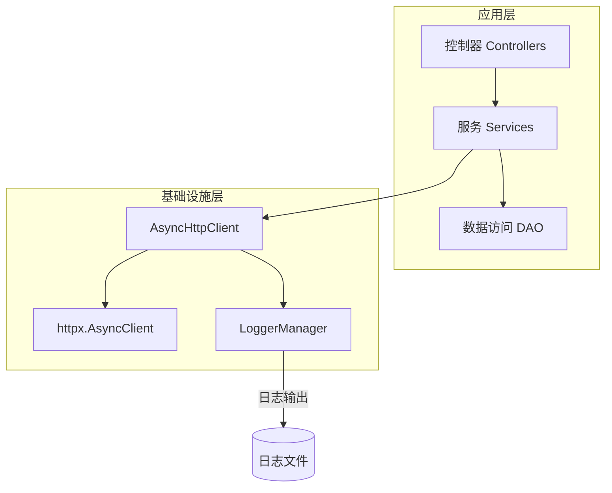
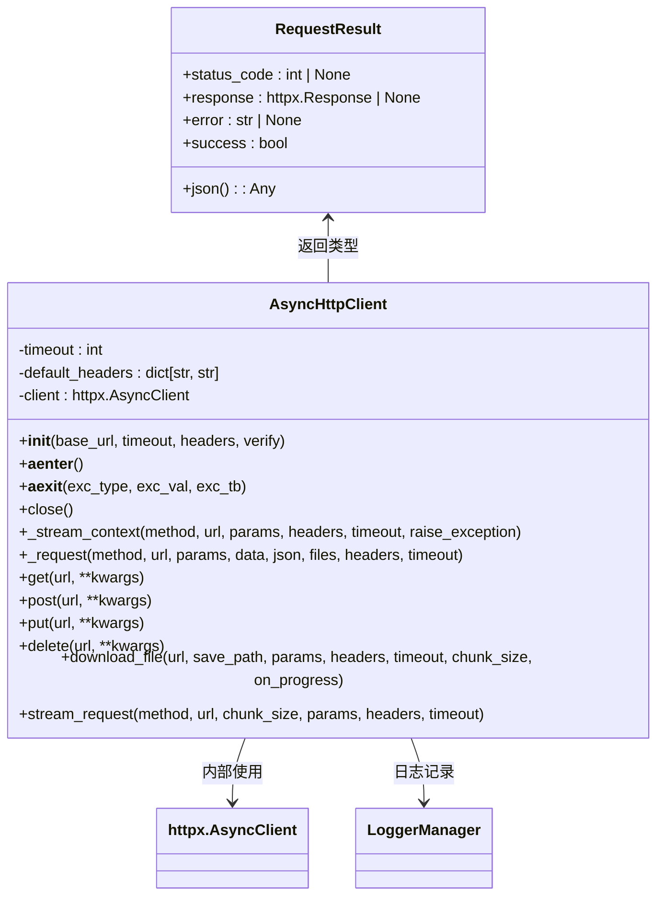
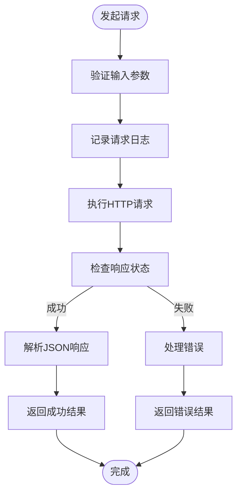
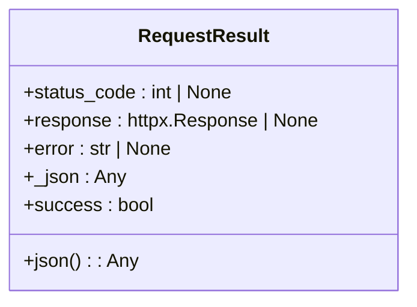
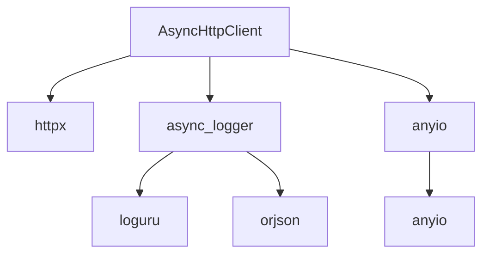

# 异步HTTP客户端

<cite>
**本文档引用的文件**   
- [async_http_cli.py](file://pkg/async_http_cli.py)
- [async_logger.py](file://pkg/async_logger.py)
- [anyio_task.py](file://pkg/anyio_task.py)
- [app.py](file://internal/app.py)
</cite>

## 目录
1. [简介](#简介)
2. [核心组件](#核心组件)
3. [架构概述](#架构概述)
4. [详细组件分析](#详细组件分析)
5. [依赖分析](#依赖分析)
6. [性能考虑](#性能考虑)
7. [故障排除指南](#故障排除指南)
8. [结论](#结论)

## 简介
本项目是一个基于 FastAPI 的后端服务，其中 `pkg/async_http_cli.py` 模块实现了基于 `httpx` 的异步 HTTP 客户端封装。该客户端支持常规请求、流式下载和流式响应处理，具备完整的错误处理和日志记录机制，适用于需要高效处理外部 HTTP 通信的场景。

## 核心组件

`AsyncHttpClient` 类是异步 HTTP 通信的核心实现，提供统一的接口用于执行 GET、POST、PUT、DELETE 等 HTTP 方法，并返回标准化的 `RequestResult` 结果对象。该类基于 `httpx.AsyncClient` 构建，支持连接复用和超时控制。

**核心功能包括：**
- 基于 `httpx` 的异步请求
- 统一的结果封装 (`RequestResult`)
- 流式上下文管理器支持
- 文件下载功能
- 自动 JSON 解析
- 完善的异常处理和日志记录

**本节来源**
- [async_http_cli.py](file://pkg/async_http_cli.py#L38-L173)

## 架构概述

**图示来源**
- [async_http_cli.py](file://pkg/async_http_cli.py#L38-L173)
- [async_logger.py](file://pkg/async_logger.py#L18-L267)

## 详细组件分析

### AsyncHttpClient 分析

`AsyncHttpClient` 是一个基于 `httpx` 封装的异步 HTTP 客户端，旨在提供更简洁、健壮的 HTTP 调用接口。

#### 类结构与方法

**图示来源**
- [async_http_cli.py](file://pkg/async_http_cli.py#L14-L259)

#### 请求流程分析

**本节来源**
- [async_http_cli.py](file://pkg/async_http_cli.py#L109-L162)

### RequestResult 分析

`RequestResult` 是一个数据类，用于封装 HTTP 请求的结果，提供统一的访问接口。

**图示来源**
- [async_http_cli.py](file://pkg/async_http_cli.py#L14-L35)

## 依赖分析

**图示来源**
- [async_http_cli.py](file://pkg/async_http_cli.py#L1-L259)
- [async_logger.py](file://pkg/async_logger.py#L1-L268)

**本节来源**
- [async_http_cli.py](file://pkg/async_http_cli.py#L1-L259)
- [async_logger.py](file://pkg/async_logger.py#L1-L268)

## 性能考虑

- **连接复用**：使用 `httpx.AsyncClient` 实现长连接，避免重复建立 TCP 连接的开销。
- **异步非阻塞**：所有操作均为异步，不会阻塞事件循环，适合高并发场景。
- **流式处理**：支持流式下载和流式响应，减少内存占用，适合处理大文件。
- **超时控制**：每个请求都可配置超时时间，防止请求无限等待。
- **并发限制**：通过 `anyio_task_manager` 可以控制并发任务数量，避免资源耗尽。

## 故障排除指南

- **网络连接错误**：检查目标 URL 是否可达，网络是否正常。
- **SSL 证书错误**：在初始化客户端时设置 `verify=False`（仅限测试环境）。
- **超时问题**：适当增加 `timeout` 参数值。
- **JSON 解析失败**：响应可能不是有效的 JSON，可通过 `response.text` 查看原始内容。
- **流式下载中断**：检查网络稳定性，确保目标路径可写。

**本节来源**
- [async_http_cli.py](file://pkg/async_http_cli.py#L149-L161)
- [async_logger.py](file://pkg/async_logger.py#L177-L179)

## 结论

`AsyncHttpClient` 提供了一个功能完整、易于使用的异步 HTTP 客户端解决方案，集成于 FastAPI 项目中，能够高效处理各种 HTTP 通信需求。其设计注重错误处理、日志记录和资源管理，适合在生产环境中使用。