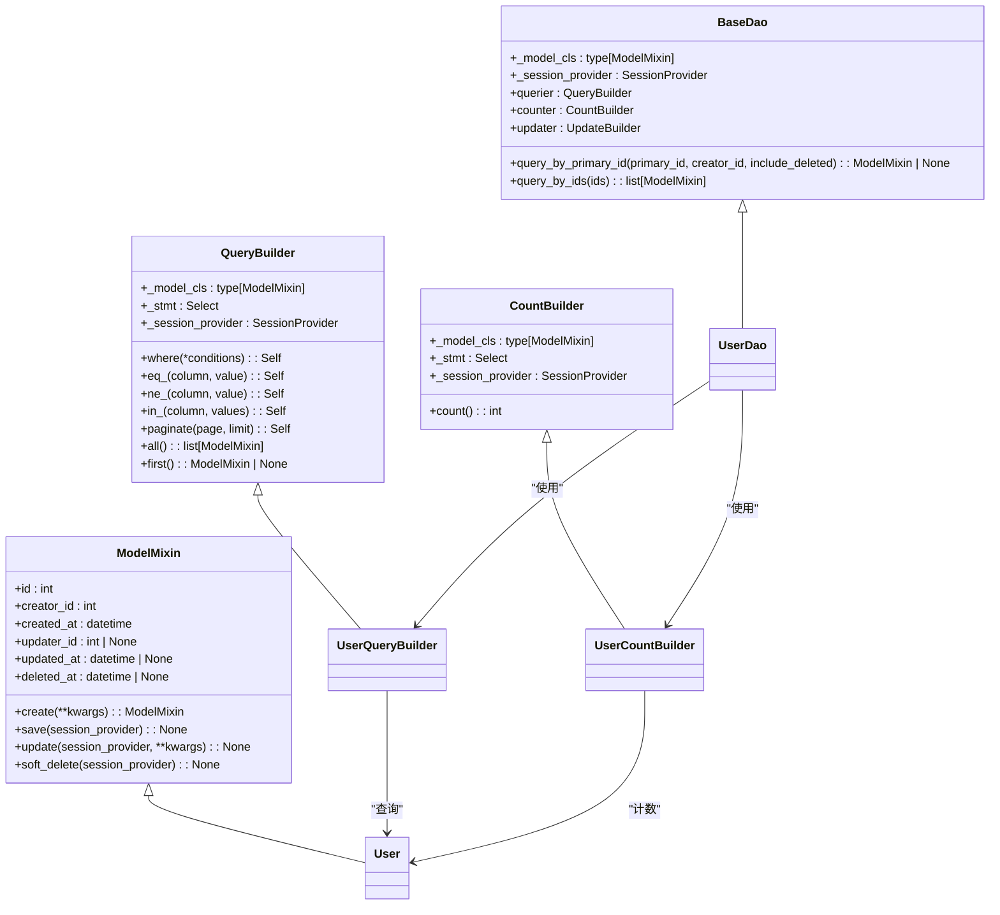

# 技术栈与依赖

<cite>
**本文档中引用的文件**  
- [pyproject.toml](file://pyproject.toml)
- [Dockerfile](file://Dockerfile)
- [main.py](file://main.py)
- [internal/app.py](file://internal/app.py)
- [internal/infra/database.py](file://internal/infra/database.py)
- [internal/infra/redis.py](file://internal/infra/redis.py)
- [internal/infra/celery.py](file://internal/infra/celery.py)
- [internal/infra/apscheduler.py](file://internal/infra/apscheduler.py)
- [pkg/jwt.py](file://pkg/jwt.py)
- [pkg/bcrypt.py](file://pkg/bcrypt.py)
- [pkg/snowflake_tool.py](file://pkg/snowflake_tool.py)
- [pkg/cache.py](file://pkg/cache.py)
- [pkg/grpc.py](file://pkg/grpc.py)
- [pkg/httpx_tool.py](file://pkg/httpx_tool.py)
- [pkg/logger_tool.py](file://pkg/logger_tool.py)
- [pkg/database.py](file://pkg/database.py)
- [pkg/celery_task.py](file://pkg/celery_task.py)
- [pkg/aps_task.py](file://pkg/aps_task.py)
- [internal/config/setting.py](file://internal/config/setting.py)
</cite>

## 目录
1. [Web 框架](#web-框架)
2. [数据库](#数据库)
3. [缓存](#缓存)
4. [任务队列](#任务队列)
5. [安全](#安全)
6. [日志](#日志)
7. [配置管理](#配置管理)
8. [ID 生成](#id-生成)
9. [HTTP 客户端](#http-客户端)
10. [gRPC](#grpc)
11. [包管理器 uv](#包管理器-uv)
12. [异步性能优化](#异步性能优化)

## Web 框架

项目采用 FastAPI 作为核心 Web 框架，结合 Uvicorn 作为 ASGI 服务器。FastAPI 提供了现代化的 API 开发体验，支持 Pydantic 模型进行数据验证和序列化，自动生成 OpenAPI 文档，并具有出色的类型提示支持。Uvicorn 则作为高性能的 ASGI 服务器，负责处理 HTTP 请求和响应。

在 `main.py` 中，项目通过 `uvicorn` 模块启动服务器，并在 `internal/app.py` 中通过 `FastAPI` 类创建应用实例。应用实例配置了生命周期事件处理器（lifespan），用于在应用启动时初始化数据库、Redis 等资源，并在关闭时进行清理。

**Diagram sources**
- [main.py](file://main.py#L1-L19)
- [internal/app.py](file://internal/app.py#L1-L105)

**Section sources**
- [main.py](file://main.py#L1-L19)
- [internal/app.py](file://internal/app.py#L1-L105)
- [pyproject.toml](file://pyproject.toml#L10-L15)

## 数据库

项目使用 SQLAlchemy 作为 ORM 框架，结合 aiomysql 和 PyMySQL 驱动实现异步数据库操作。SQLAlchemy 提供了强大的 ORM 功能和原生 SQL 查询支持，而 aiomysql 则确保了数据库操作的异步非阻塞特性，提升了应用的整体性能。

在 `internal/infra/database.py` 文件中，定义了数据库连接池的初始化和关闭逻辑。通过 `init_db()` 函数创建 `AsyncEngine` 并配置连接池参数，如连接大小、超时时间等。同时，项目还实现了 SQL 监控事件，用于记录慢查询和调试信息。

`pkg/database.py` 文件中定义了 `ModelMixin` 基类，为所有数据库模型提供了通用字段（如 `id`、`created_at`、`updated_at`）和操作方法（如 `save`、`update`、`soft_delete`）。此外，还提供了 `QueryBuilder`、`CountBuilder` 等查询构建器，简化了复杂查询的编写。

**Diagram sources**
- [internal/infra/database.py](file://internal/infra/database.py#L1-L140)
- [pkg/database.py](file://pkg/database.py#L1-L612)

**Section sources**
- [internal/infra/database.py](file://internal/infra/database.py#L1-L140)
- [pkg/database.py](file://pkg/database.py#L1-L612)
- [pyproject.toml](file://pyproject.toml#L20-L23)

## 缓存

项目使用 Redis 作为缓存和消息中间件。Redis 被用于存储会话信息、分布式锁、临时数据等，有效减轻了数据库的压力，提升了系统的响应速度。

在 `internal/infra/redis.py` 文件中，实现了 Redis 连接池的初始化和管理。通过 `init_redis()` 函数创建 `ConnectionPool` 并初始化 `Redis` 客户端。同时，项目还封装了 `CacheClient` 类，提供了对 Redis 操作的高级封装，如设置/获取缓存、分布式锁管理等。

`pkg/cache.py` 文件中的 `CacheClient` 类提供了丰富的缓存操作方法，包括 `set_value`、`get_value`、`delete_key`、`set_hash`、`get_hash` 等。此外，还实现了基于 Lua 脚本的原子性分布式锁机制，确保了在高并发场景下的数据一致性。

**Diagram sources**
- [internal/infra/redis.py](file://internal/infra/redis.py#L1-L86)
- [pkg/cache.py](file://pkg/cache.py#L1-L280)

**Section sources**
- [internal/infra/redis.py](file://internal/infra/redis.py#L1-L86)
- [pkg/cache.py](file://pkg/cache.py#L1-L280)
- [pyproject.toml](file://pyproject.toml#L32)

## 任务队列

项目采用 Celery 和 APScheduler 两种任务队列机制，以满足不同场景的需求。Celery 用于处理耗时较长的异步任务和分布式任务调度，而 APScheduler 则用于处理应用内部的定时任务。

在 `internal/infra/celery.py` 文件中，定义了 Celery 客户端的配置和初始化。项目使用 Redis 作为 Celery 的 Broker 和 Backend，实现了任务的可靠传递和结果存储。通过 `CeleryClient` 类封装了任务提交、编排（chain、group、chord）、状态查询等功能。同时，还实现了 Worker 生命周期钩子，确保在 Worker 启动时初始化数据库连接，在关闭时进行资源清理。

`internal/infra/apscheduler.py` 文件中，使用 `ApsSchedulerManager` 封装了 APScheduler 的异步调度器。通过 `init_apscheduler()` 函数注册定时任务，如每 15 分钟执行一次的 `number_sum` 任务。APScheduler 适用于应用内部的轻量级定时任务，无需依赖外部 Broker。

**Diagram sources**
- [internal/infra/celery.py](file://internal/infra/celery.py#L1-L152)
- [internal/infra/apscheduler.py](file://internal/infra/apscheduler.py#L1-L21)
- [pkg/celery_task.py](file://pkg/celery_task.py#L1-L287)
- [pkg/aps_task.py](file://pkg/aps_task.py#L1-L256)

**Section sources**
- [internal/infra/celery.py](file://internal/infra/celery.py#L1-L152)
- [internal/infra/apscheduler.py](file://internal/infra/apscheduler.py#L1-L21)
- [pkg/celery_task.py](file://pkg/celery_task.py#L1-L287)
- [pkg/aps_task.py](file://pkg/aps_task.py#L1-L256)
- [pyproject.toml](file://pyproject.toml#L25-L30)

## 安全

项目在安全方面采用了 PyJWT 和 bcrypt 两种关键技术。PyJWT 用于生成和验证 JSON Web Token (JWT)，实现用户身份认证和授权。bcrypt 则用于对用户密码进行哈希加密，确保密码存储的安全性。

在 `pkg/jwt.py` 文件中，实现了 JWT 的生成和验证逻辑。`create_jwt_token()` 函数根据用户 ID、用户名等信息生成 JWT，`verify_jwt_token()` 函数则用于验证 Token 的有效性，包括检查签名、过期时间等。JWT 被用作 API 请求的认证凭证，通过 `Authorization` 头传递。

`pkg/bcrypt.py` 文件中，封装了密码哈希和验证功能。`hash_password()` 函数使用 bcrypt 算法对明文密码进行哈希，`verify_password()` 函数则用于验证用户输入的密码是否与存储的哈希值匹配。bcrypt 是一种强加密算法，能够有效抵御彩虹表攻击。

**Diagram sources**
- [pkg/jwt.py](file://pkg/jwt.py#L1-L39)
- [pkg/bcrypt.py](file://pkg/bcrypt.py#L1-L20)

**Section sources**
- [pkg/jwt.py](file://pkg/jwt.py#L1-L39)
- [pkg/bcrypt.py](file://pkg/bcrypt.py#L1-L20)
- [pyproject.toml](file://pyproject.toml#L34-L35)

## 日志

项目使用 loguru 作为日志框架，提供了简洁而强大的日志记录功能。loguru 支持结构化日志、日志轮转、多进程安全写入等特性，能够满足生产环境的高要求。

在 `pkg/logger_tool.py` 文件中，定义了 `LoggerManager` 类，用于统一管理日志配置。通过 `setup()` 方法初始化日志系统，配置日志级别、输出格式、轮转策略等。项目支持将日志输出到控制台和文件，并可根据日志类型（如系统日志、业务日志）进行分类存储。

`LoggerManager` 还支持动态创建不同类型的 Logger，通过 `get_dynamic_logger()` 方法获取。日志格式化器支持文本和 JSON 两种格式，便于日志的解析和分析。此外，项目还实现了 UTC 时间戳补丁，确保日志时间的一致性。

**Diagram sources**
- [pkg/logger_tool.py](file://pkg/logger_tool.py#L1-L275)

**Section sources**
- [pkg/logger_tool.py](file://pkg/logger_tool.py#L1-L275)
- [pyproject.toml](file://pyproject.toml#L33)

## 配置管理

项目使用 python-dotenv 进行配置管理，通过环境变量加载配置文件。这种做法将配置与代码分离，便于在不同环境（开发、测试、生产）中使用不同的配置。

在 `internal/config/setting.py` 文件中，定义了配置类的加载逻辑。项目采用策略模式，根据环境变量 `SYS_ENV` 选择相应的配置类（如 `DevelopmentConfig`、`ProductionConfig`）。配置文件路径由 `BASE_DIR / "configs" / f".env.{SYS_NAMESPACE}"` 确定，支持 `.env.dev`、`.env.prod` 等不同环境的配置文件。

配置类继承自 `BaseConfig`，通过 Pydantic 的 `BaseSettings` 实现类型安全的配置管理。配置项包括数据库连接字符串、Redis URL、JWT 密钥等敏感信息，这些信息通过环境变量注入，避免硬编码在代码中。

**Diagram sources**
- [internal/config/setting.py](file://internal/config/setting.py#L1-L59)

**Section sources**
- [internal/config/setting.py](file://internal/config/setting.py#L1-L59)
- [pyproject.toml](file://pyproject.toml#L36)

## ID 生成

项目使用 snowflake-id 生成分布式唯一 ID。Snowflake 算法生成的 ID 是一个 64 位的整数，包含时间戳、机器 ID、序列号等信息，具有全局唯一性、趋势递增和高性能的特点。

在 `pkg/snowflake_tool.py` 文件中，创建了 `SnowflakeGenerator` 实例，并封装了 `generate_snowflake_id()` 函数。该函数通过调用生成器的 `next()` 方法获取下一个 ID。生成的 ID 被用作数据库主键，确保了在分布式环境下的数据一致性。

**Diagram sources**
- [pkg/snowflake_tool.py](file://pkg/snowflake_tool.py#L1-L9)

**Section sources**
- [pkg/snowflake_tool.py](file://pkg/snowflake_tool.py#L1-L9)
- [pyproject.toml](file://pyproject.toml#L38)

## HTTP 客户端

项目使用 httpx 作为 HTTP 客户端，用于与其他服务进行 HTTP 通信。httpx 支持同步和异步模式，提供了丰富的功能，如流式请求、文件上传、超时控制等。

在 `pkg/httpx_tool.py` 文件中，封装了 `HTTPXClient` 类，提供了对 httpx 的高级封装。`HTTPXClient` 支持 GET、POST、PUT、DELETE 等 HTTP 方法，并自动处理 JSON 序列化、错误转换等。此外，还实现了流式下载和上传功能，适用于处理大文件。

`HTTPXClient` 还提供了 `download_bytes()` 方法，用于下载文件并返回文件名、内容和 MIME 类型。`stream_get()` 和 `stream_post()` 方法则支持流式处理响应，节省内存占用。

**Diagram sources**
- [pkg/httpx_tool.py](file://pkg/httpx_tool.py#L1-L396)

**Section sources**
- [pkg/httpx_tool.py](file://pkg/httpx_tool.py#L1-L396)
- [pyproject.toml](file://pyproject.toml#L16)

## gRPC

项目使用 grpcio 实现 gRPC 通信，用于服务间的高性能 RPC 调用。gRPC 基于 HTTP/2 和 Protocol Buffers，提供了强类型、高效、低延迟的通信机制。

在 `pkg/grpc.py` 文件中，实现了 `AsyncGrpcChannelPool` 类，用于管理 gRPC 异步通道的连接池。通过 `get_channel()` 方法获取或创建 gRPC 通道，并实现了健康检查和连接复用机制。项目还定义了 `BaseGrpcClient` 基类和 `AsyncUserClient` 具体客户端，封装了 gRPC 调用的通用逻辑。

`AsyncGrpcChannelPool` 配置了丰富的通道选项，如最大并发流、Keep-Alive 时间、消息长度限制等，确保了连接的稳定性和性能。通过 `build_grpc_metadata()` 方法，可以在请求中添加认证信息和应用 ID。

**Diagram sources**
- [pkg/grpc.py](file://pkg/grpc.py#L1-L151)

**Section sources**
- [pkg/grpc.py](file://pkg/grpc.py#L1-L151)
- [pyproject.toml](file://pyproject.toml#L44-L45)

## 包管理器 uv

项目选择 uv 作为包管理器，主要基于其卓越的性能和与现代 Python 生态的兼容性。uv 是一个用 Rust 编写的超快 Python 包安装器和解析器，其性能远超传统的 pip 工具。

在 `pyproject.toml` 文件中，通过 `[tool.uv]` 配置了 uv 的行为。项目使用阿里云镜像源作为默认索引，加速了依赖包的下载速度。在 `Dockerfile` 中，通过 `COPY --from=ghcr.io/astral-sh/uv:latest /uv /uvx /bin/` 命令将 uv 工具复制到镜像中，并使用 `uv sync --frozen --no-cache --no-default-groups` 命令安装依赖。

uv 在 Docker 构建中的优势显著：
1. **速度极快**：uv 的解析和安装速度比 pip 快数倍，大幅缩短了 Docker 镜像的构建时间。
2. **确定性安装**：`uv sync --frozen` 确保安装过程完全基于 `uv.lock` 文件，避免了依赖解析的不确定性。
3. **无缓存构建**：`--no-cache` 选项避免了缓存带来的潜在问题，确保了构建的纯净性。
4. **轻量级**：uv 本身是一个静态编译的二进制文件，无需额外的 Python 依赖，减少了镜像体积。

**Diagram sources**
- [pyproject.toml](file://pyproject.toml#L95-L104)
- [Dockerfile](file://Dockerfile#L16-L28)

**Section sources**
- [pyproject.toml](file://pyproject.toml#L95-L104)
- [Dockerfile](file://Dockerfile#L16-L28)

## 异步性能优化

项目通过 uvloop 和 httptools 显著提升了异步性能。uvloop 是一个基于 libuv 的 asyncio 事件循环的替代品，提供了比标准事件循环快数倍的性能。httptools 则是一个用 Cython 编写的高性能 HTTP 解析器，能够高效处理 HTTP 请求和响应。

在 `Dockerfile` 的启动命令中，通过 `--loop uvloop --http httptools` 参数明确指定了使用 uvloop 作为事件循环和 httptools 作为 HTTP 解析器。这使得 Uvicorn 服务器能够充分发挥异步 I/O 的优势，处理高并发请求。

在 `pyproject.toml` 文件中，`uvloop>=0.22.1; sys_platform != 'win32'` 依赖确保了在非 Windows 平台上安装 uvloop。httptools 作为 Uvicorn 的可选依赖，被自动包含在项目依赖中。

uvloop 和 httptools 的结合使用，使得项目在高负载场景下仍能保持低延迟和高吞吐量，是构建高性能异步 Web 服务的关键技术。

**Diagram sources**
- [Dockerfile](file://Dockerfile#L38-L39)
- [pyproject.toml](file://pyproject.toml#L56-L57)

**Section sources**
- [Dockerfile](file://Dockerfile#L38-L39)
- [pyproject.toml](file://pyproject.toml#L56-L57)