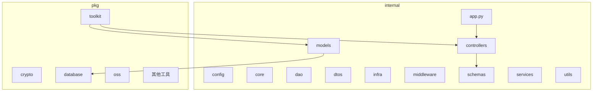
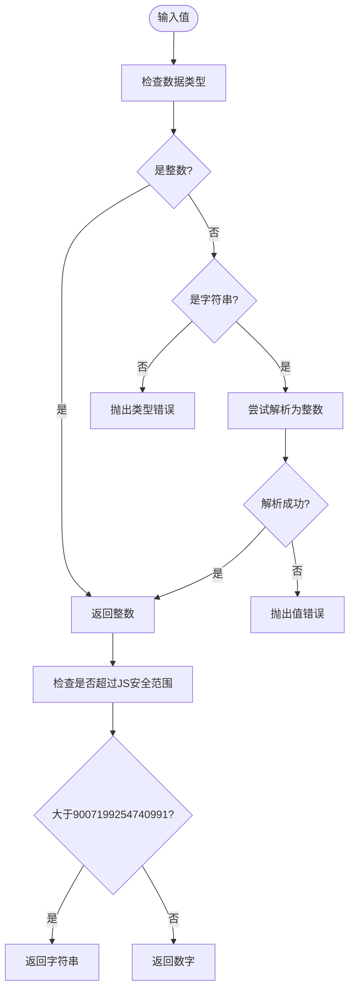
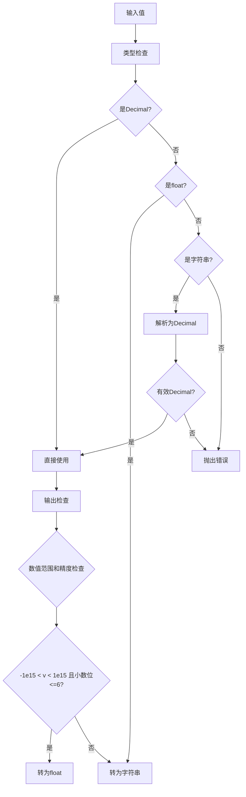
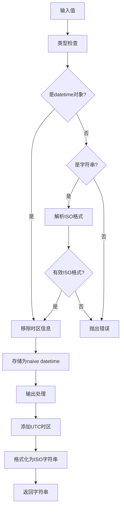
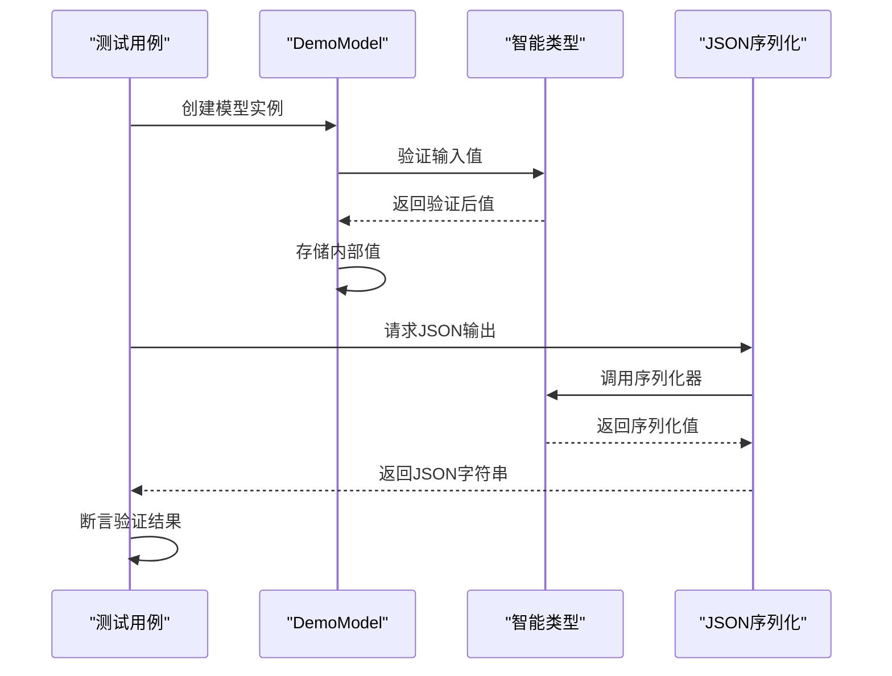
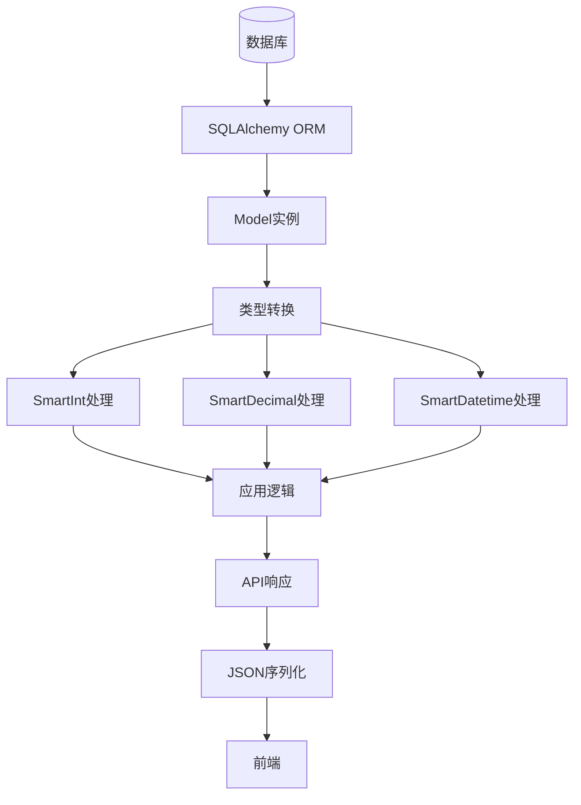
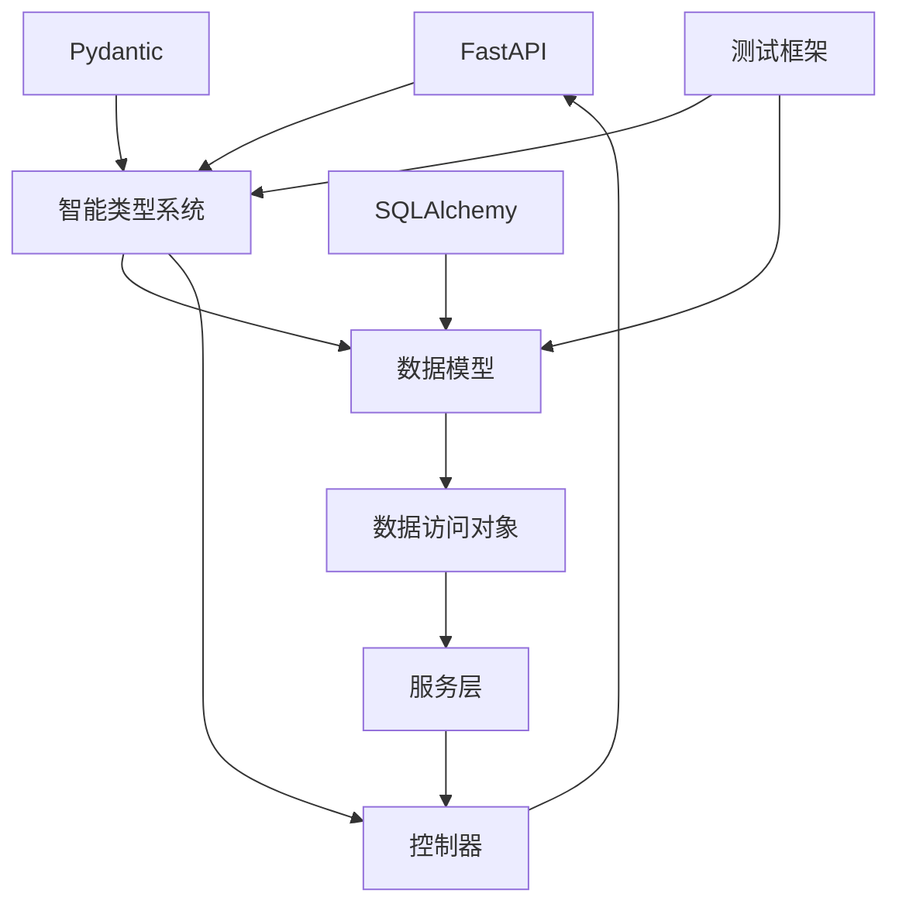

# 智能类型转换

<cite>
**本文档引用的文件**   
- [types.py](file://pkg/toolkit/types.py)
- [test_smart_types.py](file://tests/test_smart_types.py)
- [test.py](file://internal/controllers/publicapi/test.py)
- [base.py](file://pkg/database/base.py)
- [user.py](file://internal/models/user.py)
- [load_config.py](file://internal/config/load_config.py)
- [main.py](file://main.py)
- [app.py](file://internal/app.py)
</cite>

## 目录
1. [简介](#简介)
2. [项目结构](#项目结构)
3. [核心组件](#核心组件)
4. [智能类型转换机制](#智能类型转换机制)
5. [详细组件分析](#详细组件分析)
6. [依赖分析](#依赖分析)
7. [性能考虑](#性能考虑)
8. [故障排除指南](#故障排除指南)
9. [结论](#结论)

## 简介
本项目是一个基于FastAPI的后端服务框架，实现了智能类型转换功能，旨在解决前后端数据交互中的类型安全和精度问题。该系统通过自定义类型注解，实现了在Python内部处理和JSON序列化输出之间的智能转换，确保了数据在不同系统间的准确传递。

## 项目结构
项目采用分层架构设计，主要分为internal（内部核心逻辑）和pkg（公共工具包）两大模块。internal目录包含应用的核心业务逻辑、控制器、数据模型和服务；pkg目录则提供了跨项目可复用的工具组件。这种结构清晰地分离了业务逻辑和通用功能，提高了代码的可维护性和复用性。



**图示来源**
- [app.py](file://internal/app.py#L1-L121)
- [models/user.py](file://internal/models/user.py#L1-L13)

**本节来源**
- [internal/app.py](file://internal/app.py#L1-L121)
- [internal/models/user.py](file://internal/models/user.py#L1-L13)

## 核心组件
项目的核心组件包括智能类型系统、数据库访问层、配置管理系统和API控制器。智能类型系统位于pkg/toolkit/types.py，提供了SmartInt、SmartDecimal和SmartDatetime等智能类型，解决了前后端数据交互中的精度和格式问题。数据库访问层基于SQLAlchemy 2.0实现，提供了高效的异步数据库操作能力。

**本节来源**
- [types.py](file://pkg/toolkit/types.py#L1-L184)
- [base.py](file://pkg/database/base.py#L1-L361)

## 智能类型转换机制
智能类型转换机制是本项目的核心创新点，通过Pydantic的BeforeValidator和PlainSerializer功能，实现了输入验证和输出序列化的智能处理。该机制确保了数据在Python内部处理时的精度和类型安全，同时在JSON输出时根据前端需求进行适当的格式转换。

### 智能整数(SmartInt)
智能整数类型解决了JavaScript安全整数范围问题。当数值超过JS_MAX_SAFE_INTEGER(9007199254740991)时，自动转换为字符串输出，避免前端精度丢失；在安全范围内则保持为数字类型，便于前端计算。



**图示来源**
- [types.py](file://pkg/toolkit/types.py#L15-L57)

### 智能浮点数(SmartDecimal)
智能浮点数类型使用Python的Decimal类型保证计算精度，避免了浮点数计算中的精度丢失问题。在输出时，根据数值大小和小数位数决定是否转换为字符串：简单数值转为float，高精度数值保持为字符串。



**图示来源**
- [types.py](file://pkg/toolkit/types.py#L64-L108)

### 智能时间(SmartDatetime)
智能时间类型统一处理ISO 8601格式的时间字符串和datetime对象，内部转换为无时区的naive datetime对象，简化了时间处理逻辑。输出时自动转换为标准的ISO格式字符串，确保前后端时间格式的一致性。



**图示来源**
- [types.py](file://pkg/toolkit/types.py#L115-L166)

**本节来源**
- [types.py](file://pkg/toolkit/types.py#L1-L184)
- [test_smart_types.py](file://tests/test_smart_types.py#L1-L141)

## 详细组件分析
### 类型系统组件分析
智能类型系统通过组合Pydantic的验证器和序列化器，实现了灵活的数据转换机制。该系统不仅解决了具体的技术问题，还提供了良好的开发者体验，通过清晰的类型注解和自动化的转换逻辑，减少了手动类型转换的错误。

#### 类型定义结构
```mermaid
classDiagram
class SmartInt {
+int value
+_parse_smart_int(v Any) int
+_serialize_smart_int(v int) int | str
}
class SmartDecimal {
+Decimal value
+_parse_smart_decimal(v Any) Decimal
+_serialize_smart_decimal(v Decimal) float | str
}
class SmartDatetime {
+datetime value
+_parse_smart_datetime(v Any) datetime
+_serialize_smart_datetime(v datetime) str
}
class IntStr {
+str value
+_parse_int_str(v Any) str
}
SmartInt --> "BeforeValidator" : uses
SmartInt --> "PlainSerializer" : uses
SmartInt --> "WithJsonSchema" : uses
SmartDecimal --> "BeforeValidator" : uses
SmartDecimal --> "PlainSerializer" : uses
SmartDecimal --> "WithJsonSchema" : uses
SmartDatetime --> "BeforeValidator" : uses
SmartDatetime --> "PlainSerializer" : uses
SmartDatetime --> "WithJsonSchema" : uses
```

**图示来源**
- [types.py](file://pkg/toolkit/types.py#L1-L184)

#### 测试验证流程


**图示来源**
- [test_smart_types.py](file://tests/test_smart_types.py#L1-L141)

**本节来源**
- [types.py](file://pkg/toolkit/types.py#L1-L184)
- [test_smart_types.py](file://tests/test_smart_types.py#L1-L141)

### 数据库集成分析
智能类型系统与数据库访问层紧密集成，确保了从数据库读取的数据能够正确地转换为相应的智能类型。ModelMixin基类中的字段定义与智能类型协同工作，实现了数据持久化和应用逻辑之间的无缝衔接。



**图示来源**
- [base.py](file://pkg/database/base.py#L59-L360)
- [types.py](file://pkg/toolkit/types.py#L1-L184)

**本节来源**
- [base.py](file://pkg/database/base.py#L1-L361)
- [types.py](file://pkg/toolkit/types.py#L1-L184)

## 依赖分析
项目依赖关系清晰，核心依赖包括FastAPI、SQLAlchemy、Pydantic等现代Python Web开发常用库。智能类型系统作为基础工具，被多个上层组件所依赖，包括API控制器、数据模型和测试模块，形成了稳定的技术栈。



**图示来源**
- [pyproject.toml](file://pyproject.toml#L1-L144)
- [types.py](file://pkg/toolkit/types.py#L1-L184)

**本节来源**
- [pyproject.toml](file://pyproject.toml#L1-L144)
- [types.py](file://pkg/toolkit/types.py#L1-L184)

## 性能考虑
智能类型转换机制在保证功能完整性的同时，也考虑了性能影响。类型转换操作主要在请求处理的验证阶段和响应生成的序列化阶段执行，这些操作的时间复杂度均为O(1)，对整体性能影响较小。对于高频调用的API，建议在必要时进行性能测试和优化。

## 故障排除指南
当遇到类型转换相关问题时，首先检查输入数据的格式是否符合预期。对于SmartInt类型，确保输入为整数或纯数字字符串；对于SmartDecimal类型，检查数值是否在有效范围内；对于SmartDatetime类型，验证时间字符串是否符合ISO 8601格式。查看日志中的错误信息可以帮助快速定位问题根源。

**本节来源**
- [types.py](file://pkg/toolkit/types.py#L1-L184)
- [test_smart_types.py](file://tests/test_smart_types.py#L1-L141)

## 结论
智能类型转换系统有效地解决了前后端数据交互中的常见问题，通过自动化和智能化的类型处理，提高了系统的可靠性和开发效率。该设计模式可作为类似项目的参考，特别是在需要处理复杂数据类型和跨平台数据交换的场景中具有重要价值。