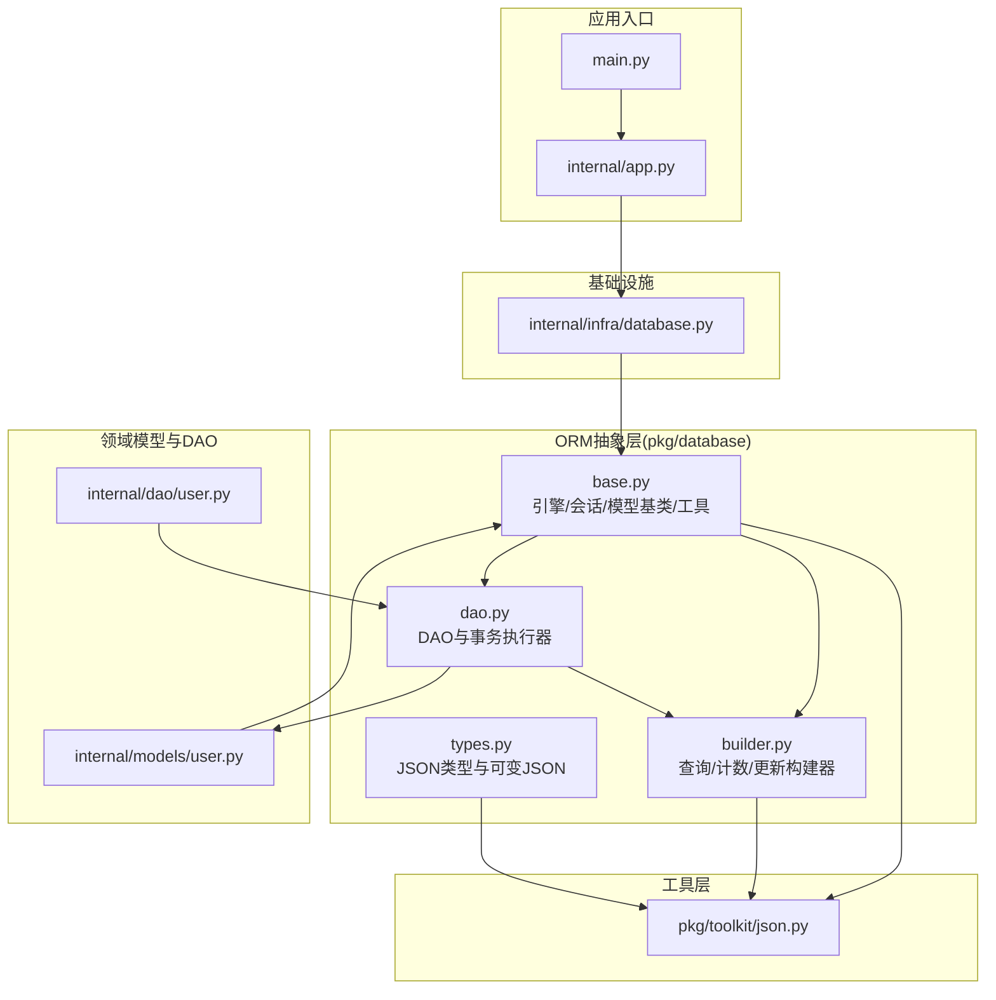
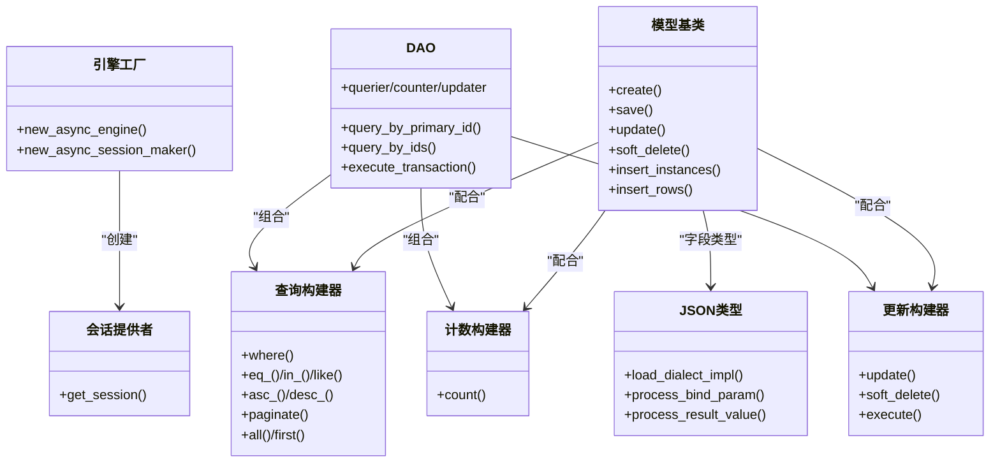
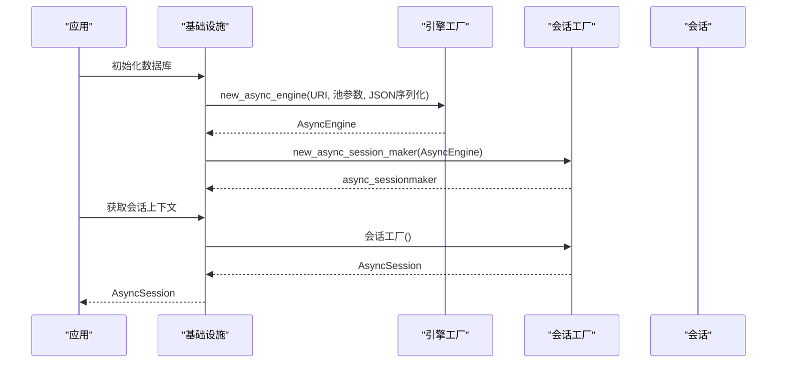
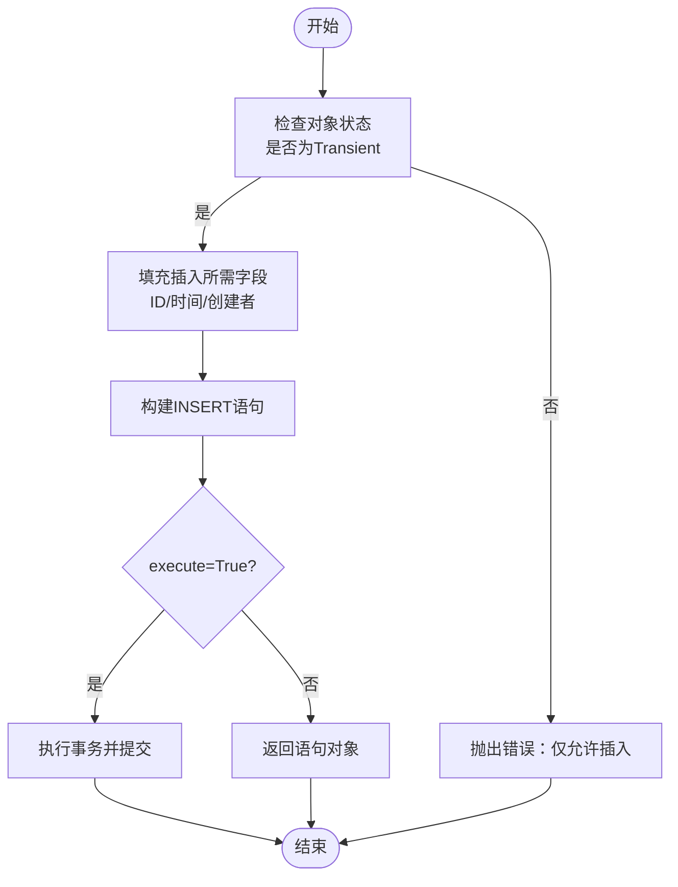
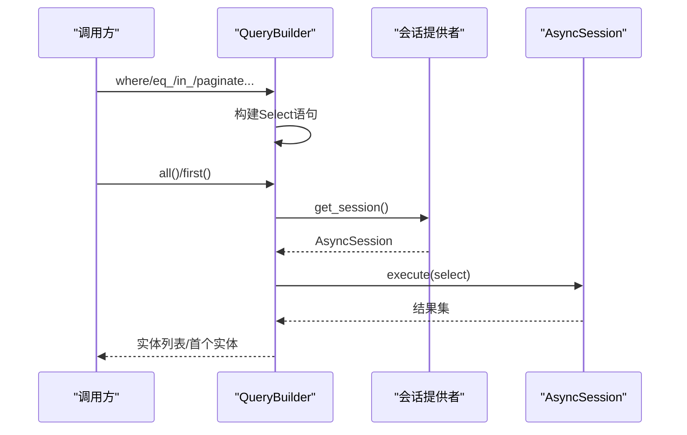
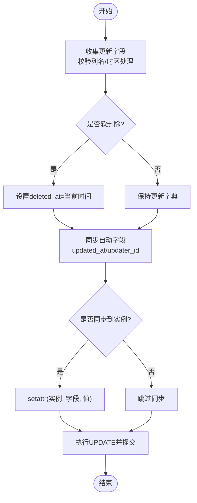
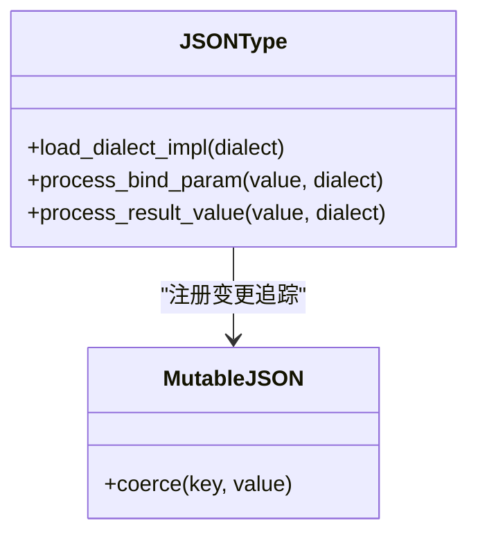
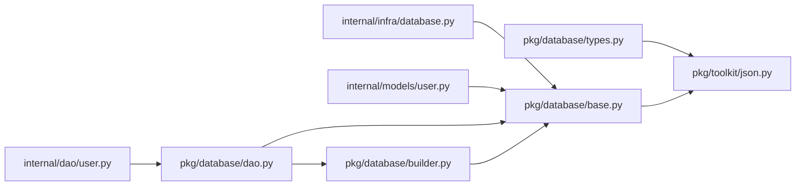

# ORM抽象层

<cite>
**本文引用的文件**
- [pkg/database/base.py](file://pkg/database/base.py)
- [pkg/database/builder.py](file://pkg/database/builder.py)
- [pkg/database/types.py](file://pkg/database/types.py)
- [pkg/database/dao.py](file://pkg/database/dao.py)
- [internal/infra/database.py](file://internal/infra/database.py)
- [internal/models/user.py](file://internal/models/user.py)
- [internal/dao/user.py](file://internal/dao/user.py)
- [pkg/toolkit/json.py](file://pkg/toolkit/json.py)
- [tests/orm/test_orm.py](file://tests/orm/test_orm.py)
- [tests/orm/test_orm_json_type.py](file://tests/orm/test_orm_json_type.py)
- [internal/app.py](file://internal/app.py)
- [main.py](file://main.py)
- [pyproject.toml](file://pyproject.toml)
</cite>

## 目录
1. [简介](#简介)
2. [项目结构](#项目结构)
3. [核心组件](#核心组件)
4. [架构总览](#架构总览)
5. [组件详解](#组件详解)
6. [依赖关系分析](#依赖关系分析)
7. [性能考量](#性能考量)
8. [故障排查指南](#故障排查指南)
9. [结论](#结论)
10. [附录](#附录)

## 简介
本文件系统化梳理并文档化本项目的ORM抽象层，围绕SQLAlchemy Async ORM展开，重点阐释以下主题：
- 引擎创建、会话工厂与数据库连接的抽象实现
- 适配器模式在数据库连接与JSON类型中的应用
- 自定义数据类型与序列化机制（JSONType、MutableJSON）
- ORM Builder模式的设计思路与使用方法（QueryBuilder、CountBuilder、UpdateBuilder）
- 数据访问对象（DAO）的抽象与事务执行器
- 数据库抽象层的扩展指南与自定义适配器开发方法
- ORM性能优化与查询构建的最佳实践
- 在不同数据库类型间的抽象转换策略

## 项目结构
本项目采用“分层+领域模型”组织方式，ORM抽象层位于pkg/database，基础设施连接位于internal/infra，领域模型与DAO位于internal/models与internal/dao，工具层位于pkg/toolkit。

图表来源
- [main.py](file://main.py#L1-L18)
- [internal/app.py](file://internal/app.py#L1-L109)
- [internal/infra/database.py](file://internal/infra/database.py#L1-L154)
- [pkg/database/base.py](file://pkg/database/base.py#L1-L364)
- [pkg/database/builder.py](file://pkg/database/builder.py#L1-L273)
- [pkg/database/types.py](file://pkg/database/types.py#L1-L183)
- [pkg/database/dao.py](file://pkg/database/dao.py#L1-L203)
- [internal/models/user.py](file://internal/models/user.py#L1-L13)
- [internal/dao/user.py](file://internal/dao/user.py#L1-L24)
- [pkg/toolkit/json.py](file://pkg/toolkit/json.py#L1-L108)

章节来源
- [main.py](file://main.py#L1-L18)
- [internal/app.py](file://internal/app.py#L1-L109)
- [internal/infra/database.py](file://internal/infra/database.py#L1-L154)
- [pkg/database/base.py](file://pkg/database/base.py#L1-L364)
- [pkg/database/builder.py](file://pkg/database/builder.py#L1-L273)
- [pkg/database/types.py](file://pkg/database/types.py#L1-L183)
- [pkg/database/dao.py](file://pkg/database/dao.py#L1-L203)
- [internal/models/user.py](file://internal/models/user.py#L1-L13)
- [internal/dao/user.py](file://internal/dao/user.py#L1-L24)
- [pkg/toolkit/json.py](file://pkg/toolkit/json.py#L1-L108)

## 核心组件
- 引擎与会话工厂：通过工厂函数创建异步引擎与会话工厂，统一连接池参数与JSON序列化策略。
- 模型基类与混入：提供统一的模型字段、默认值填充、严格CRUD、软删除、批量插入等能力。
- 查询构建器：QueryBuilder、CountBuilder、UpdateBuilder，提供链式条件、分页、排序、软删除、自动字段同步等。
- DAO：面向模型的访问层，暴露查询、计数、更新构建器与常用查询方法，提供事务执行器。
- 自定义类型：JSONType与MutableJSON，实现跨数据库兼容的JSON存储与变更追踪。
- 基础设施连接：生命周期管理、SQL慢查询监控、会话获取上下文管理器。

章节来源
- [pkg/database/base.py](file://pkg/database/base.py#L19-L46)
- [pkg/database/base.py](file://pkg/database/base.py#L48-L364)
- [pkg/database/builder.py](file://pkg/database/builder.py#L18-L273)
- [pkg/database/dao.py](file://pkg/database/dao.py#L15-L203)
- [pkg/database/types.py](file://pkg/database/types.py#L12-L183)
- [internal/infra/database.py](file://internal/infra/database.py#L26-L154)

## 架构总览
ORM抽象层采用“工厂 + 适配器 + Builder + DAO”的分层设计：
- 工厂层：负责引擎与会话工厂的创建与配置
- 适配器层：对SQLAlchemy的异步引擎与JSON类型进行适配，屏蔽数据库差异
- Builder层：以Builder模式封装查询、计数、更新的DSL
- DAO层：面向领域模型的数据访问接口，提供事务与常用查询
- 基础设施层：连接生命周期、SQL监控、会话上下文

图表来源
- [pkg/database/base.py](file://pkg/database/base.py#L19-L46)
- [pkg/database/base.py](file://pkg/database/base.py#L60-L364)
- [pkg/database/builder.py](file://pkg/database/builder.py#L18-L273)
- [pkg/database/dao.py](file://pkg/database/dao.py#L15-L203)
- [pkg/database/types.py](file://pkg/database/types.py#L12-L183)
- [internal/infra/database.py](file://internal/infra/database.py#L85-L111)

## 组件详解

### 引擎创建与会话工厂
- 引擎工厂函数集中配置连接池参数与JSON序列化/反序列化策略，确保跨数据库一致性。
- 会话工厂提供异步会话与过期控制策略，保证事务边界与资源释放。

图表来源
- [internal/infra/database.py](file://internal/infra/database.py#L26-L56)
- [pkg/database/base.py](file://pkg/database/base.py#L19-L46)

章节来源
- [internal/infra/database.py](file://internal/infra/database.py#L26-L56)
- [pkg/database/base.py](file://pkg/database/base.py#L19-L46)

### 模型基类与混入（ModelMixin）
- 统一字段：主键、创建/更新/删除时间、创建者/更新者ID
- 工厂方法：create()自动清洗列、填充默认值
- 批量插入：insert_rows()与insert_instances()，支持字典与实例两种输入
- 严格CRUD：save()仅用于插入，update()仅用于已存在对象
- 软删除：soft_delete()/restore()，自动同步updated_at与updater_id
- 字段补全：插入/更新时自动填充时间戳与用户ID
- 反射工具：列名、是否存在某列、InstrumentedAttribute获取

图表来源
- [pkg/database/base.py](file://pkg/database/base.py#L156-L174)
- [pkg/database/base.py](file://pkg/database/base.py#L283-L304)

章节来源
- [pkg/database/base.py](file://pkg/database/base.py#L60-L364)

### 查询构建器（QueryBuilder）
- 条件链式构建：where()/eq_()/ne_()/gt_()/lt_()/ge_()/le_()/in_()/like()/is_null()/or_()
- 排序与去重：distinct_()/asc_()/desc_()
- 分页：paginate(page, limit)
- 结果获取：all()/first()
- 软删除过滤：默认排除deleted_at非空的记录

图表来源
- [pkg/database/builder.py](file://pkg/database/builder.py#L111-L162)
- [pkg/database/builder.py](file://pkg/database/builder.py#L29-L92)

章节来源
- [pkg/database/builder.py](file://pkg/database/builder.py#L111-L162)
- [pkg/database/builder.py](file://pkg/database/builder.py#L29-L92)

### 计数构建器（CountBuilder）
- 支持普通计数与去重计数
- 可选择是否包含软删除项
- 提供count()结果获取

章节来源
- [pkg/database/builder.py](file://pkg/database/builder.py#L164-L190)

### 更新构建器（UpdateBuilder）
- update()动态构建更新字典，自动过滤非列字段
- 软删除：soft_delete()自动写入deleted_at与updated_at
- 自动字段同步：更新时自动同步updated_at、updater_id、deleted_at
- execute()执行更新并提交事务

图表来源
- [pkg/database/builder.py](file://pkg/database/builder.py#L192-L273)

章节来源
- [pkg/database/builder.py](file://pkg/database/builder.py#L192-L273)

### DAO与事务执行器
- BaseDao：提供查询、计数、更新构建器属性，以及常用查询方法
- execute_transaction：统一事务入口，支持复杂业务逻辑与混合ORM/原生SQL

章节来源
- [pkg/database/dao.py](file://pkg/database/dao.py#L15-L203)

### 自定义数据类型与序列化机制（JSONType、MutableJSON）
- JSONType：根据数据库方言选择最优存储类型（PostgreSQL JSONB、MySQL JSON、SQLite JSON、Oracle原生/LOB），并在必要时使用orjson进行序列化/反序列化，支持空值与容错处理
- MutableJSON：为JSONType注册变更追踪，使对dict/list的内层修改也能被SQLAlchemy感知

图表来源
- [pkg/database/types.py](file://pkg/database/types.py#L12-L183)

章节来源
- [pkg/database/types.py](file://pkg/database/types.py#L12-L183)
- [pkg/toolkit/json.py](file://pkg/toolkit/json.py#L1-L108)

### 适配器模式的应用
- 数据库适配：JSONType在不同dialect下选择impl与序列化策略，屏蔽数据库差异
- 会话适配：SessionProvider作为抽象的会话提供者，DAO与Builder通过它获取会话，便于替换实现（如测试Mock）

章节来源
- [pkg/database/types.py](file://pkg/database/types.py#L78-L146)
- [pkg/database/base.py](file://pkg/database/base.py#L16-L16)

### ORM Builder模式的设计思路与使用方法
- 设计要点：将SQL构建过程封装为链式DSL，Builder持有模型类与会话提供者，最终在执行阶段才获取会话并执行
- 使用方法：通过DAO属性获取QueryBuilder/CountBuilder/UpdateBuilder，链式拼接条件，最后调用all()/first()/count()/execute()

章节来源
- [pkg/database/builder.py](file://pkg/database/builder.py#L18-L273)
- [pkg/database/dao.py](file://pkg/database/dao.py#L47-L91)

### 数据库抽象层的扩展指南与自定义适配器开发
- 扩展方向：新增方言适配、自定义类型、查询扩展（如聚合、窗口函数）、事务策略定制
- 自定义适配器：遵循SessionProvider接口，提供异步上下文管理器；自定义类型需实现TypeDecorator的bind/result处理与dialect适配

章节来源
- [pkg/database/base.py](file://pkg/database/base.py#L16-L16)
- [pkg/database/types.py](file://pkg/database/types.py#L78-L146)

## 依赖关系分析
ORM抽象层内部依赖清晰，耦合度低，主要依赖关系如下：
- internal/infra/database依赖pkg/database/base的工厂函数
- internal/models与internal/dao依赖pkg/database/base与pkg/database/dao
- pkg/database/builder与pkg/database/dao依赖pkg/database/base
- pkg/database/types依赖pkg/toolkit/json

图表来源
- [internal/infra/database.py](file://internal/infra/database.py#L14-L16)
- [internal/models/user.py](file://internal/models/user.py#L4-L4)
- [internal/dao/user.py](file://internal/dao/user.py#L1-L24)
- [pkg/database/dao.py](file://pkg/database/dao.py#L1-L203)
- [pkg/database/builder.py](file://pkg/database/builder.py#L1-L273)
- [pkg/database/types.py](file://pkg/database/types.py#L1-L183)
- [pkg/toolkit/json.py](file://pkg/toolkit/json.py#L1-L108)

章节来源
- [internal/infra/database.py](file://internal/infra/database.py#L14-L16)
- [internal/models/user.py](file://internal/models/user.py#L4-L4)
- [internal/dao/user.py](file://internal/dao/user.py#L1-L24)
- [pkg/database/dao.py](file://pkg/database/dao.py#L1-L203)
- [pkg/database/builder.py](file://pkg/database/builder.py#L1-L273)
- [pkg/database/types.py](file://pkg/database/types.py#L1-L183)
- [pkg/toolkit/json.py](file://pkg/toolkit/json.py#L1-L108)

## 性能考量
- 连接池参数：合理设置池大小、超时与回收周期，避免连接泄漏与抖动
- JSON序列化：统一使用高性能orjson，减少序列化开销
- 查询优化：优先使用索引列进行过滤，避免SELECT *
- 批量操作：使用insert_instances()/insert_rows()进行批量插入，减少往返
- 事务粒度：将相关操作放在同一事务中，减少commit次数
- 监控与告警：利用SQL慢查询监控，定位热点SQL并优化

[本节为通用指导，不直接分析具体文件]

## 故障排查指南
- 严格CRUD错误：对象状态不符导致save()/update()抛错，检查对象是否Transient/Persistent
- 会话未初始化：调用get_session()前需确保init_async_db()已执行
- 空列表IN条件：in_()不允许空列表，需在上层校验或使用or_()组合
- JSON反序列化异常：数据库中存在非JSON文本时，JSONType具备容错，但仍建议检查数据源
- 事务失败：execute_transaction()会捕获异常并回滚，查看错误堆栈定位问题

章节来源
- [pkg/database/base.py](file://pkg/database/base.py#L156-L200)
- [internal/infra/database.py](file://internal/infra/database.py#L85-L111)
- [pkg/database/builder.py](file://pkg/database/builder.py#L70-L83)
- [pkg/database/types.py](file://pkg/database/types.py#L140-L146)
- [pkg/database/dao.py](file://pkg/database/dao.py#L106-L203)

## 结论
本ORM抽象层通过工厂、适配器、Builder与DAO的分层设计，实现了：
- 统一的引擎与会话管理
- 跨数据库的JSON类型适配与变更追踪
- 链式查询DSL与严格的CRUD约束
- 易于扩展的DAO与事务执行器
- 可观测的SQL监控与性能优化空间

该设计既满足快速开发需求，又为后续扩展与迁移提供了良好基础。

[本节为总结性内容，不直接分析具体文件]

## 附录

### 使用示例与最佳实践
- 初始化与生命周期：在应用启动时调用init_async_db()，在关闭时调用close_async_db()
- 会话获取：通过get_session()获取上下文管理器，确保异常时自动回滚
- 查询与更新：优先使用DAO提供的属性（querier/counter/updater），链式构建条件
- 批量插入：使用insert_instances()/insert_rows()，避免逐条插入
- 软删除：使用soft_delete()/restore()，配合QueryBuilder的默认过滤

章节来源
- [internal/app.py](file://internal/app.py#L85-L109)
- [internal/infra/database.py](file://internal/infra/database.py#L26-L111)
- [pkg/database/dao.py](file://pkg/database/dao.py#L47-L91)
- [pkg/database/base.py](file://pkg/database/base.py#L100-L150)

### 测试参考
- ORM单元测试覆盖：严格CRUD、批量插入、查询构建器、软删除、更新构建器逻辑
- JSON类型测试覆盖：MutableJSON变更追踪、跨数据库序列化/反序列化、空值与容错

章节来源
- [tests/orm/test_orm.py](file://tests/orm/test_orm.py#L1-L238)
- [tests/orm/test_orm_json_type.py](file://tests/orm/test_orm_json_type.py#L1-L217)