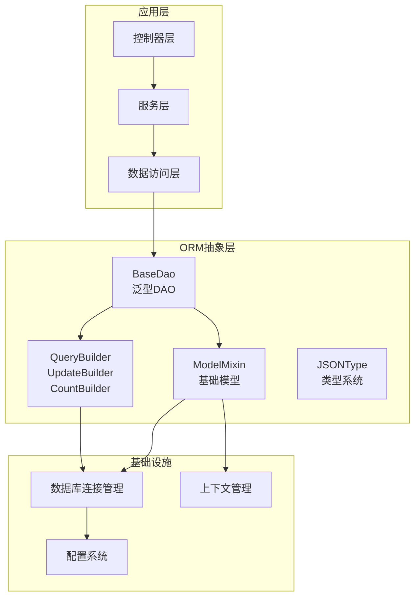
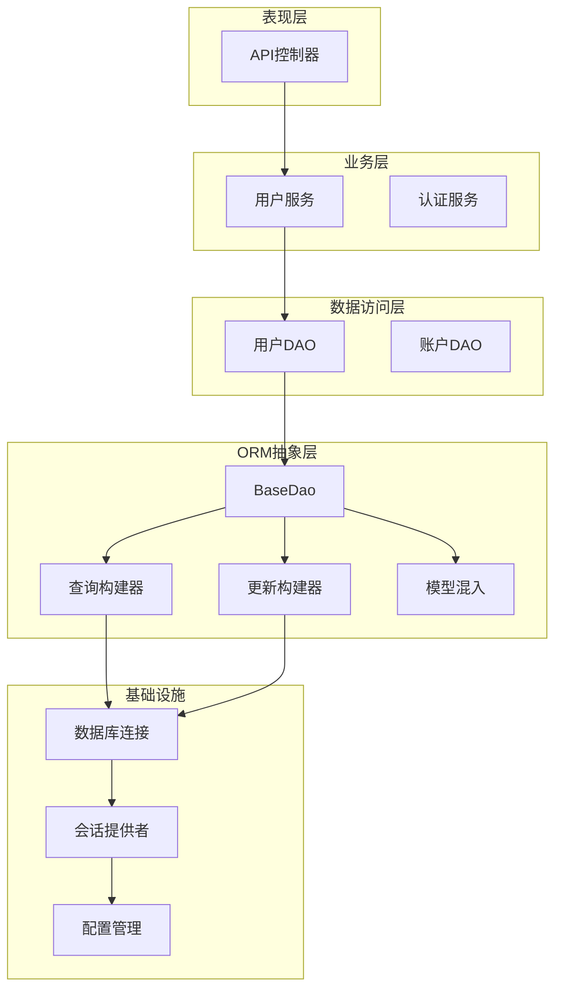
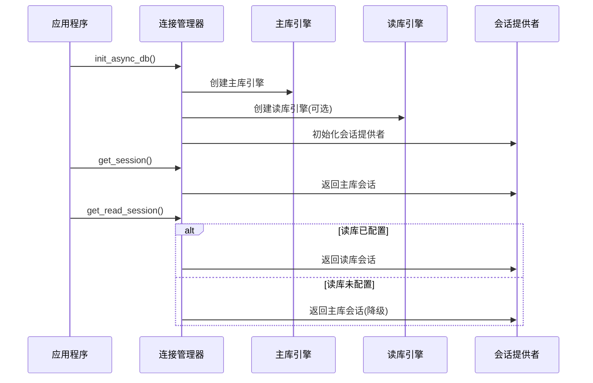
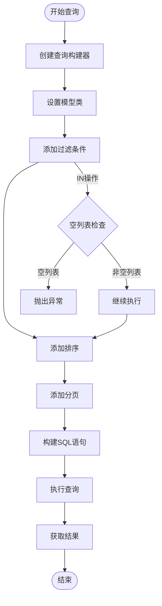
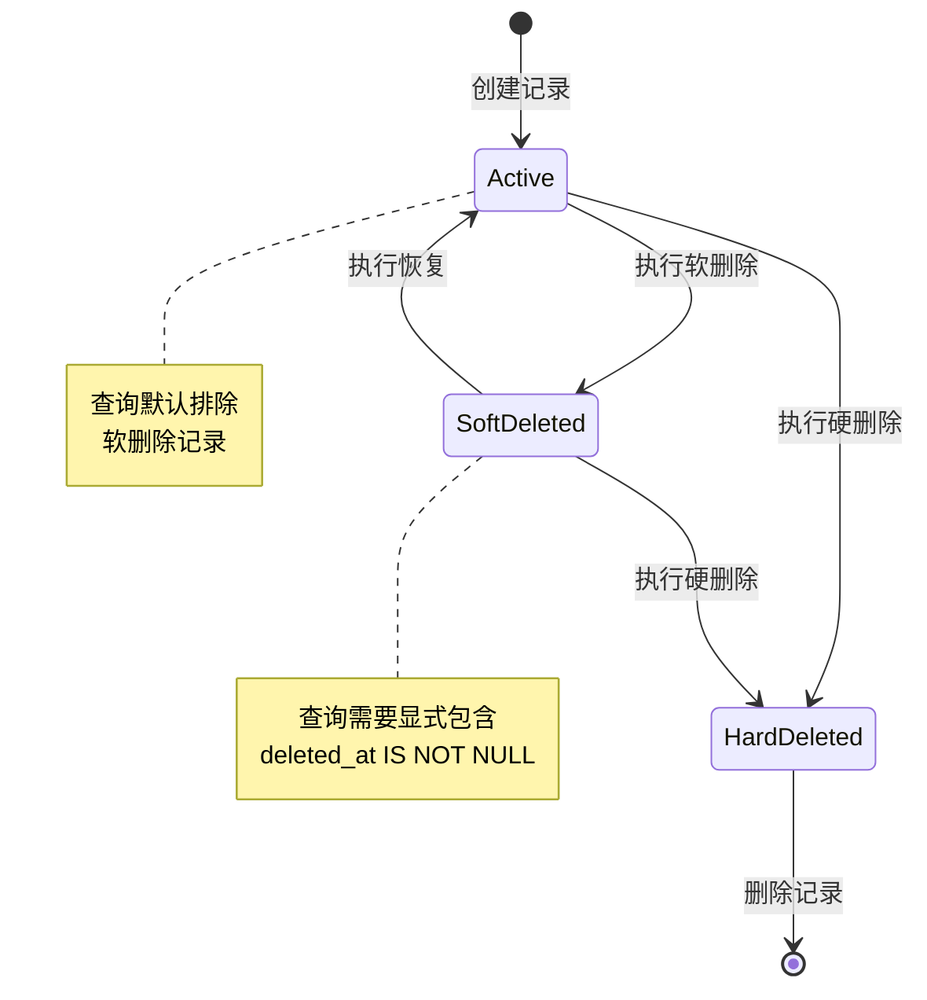
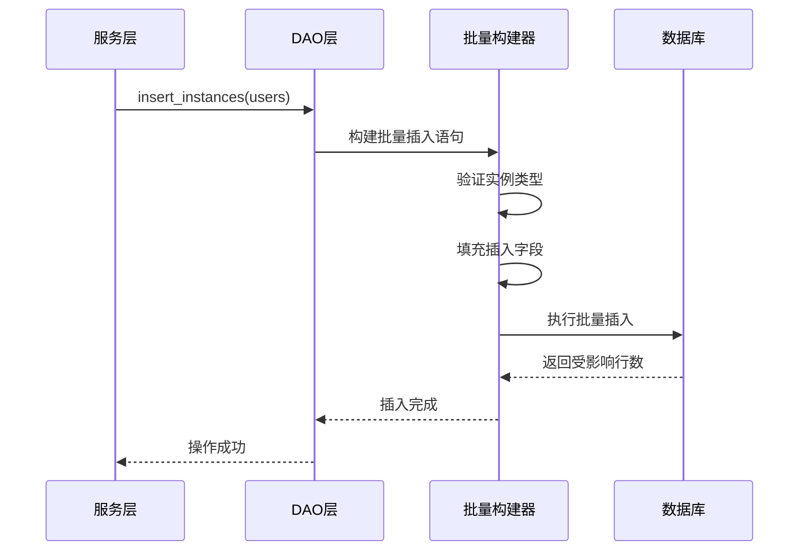
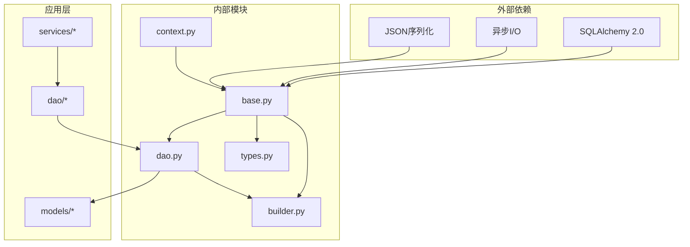

# ORM抽象层

<cite>
**本文档引用的文件**
- [pkg/database/dao.py](file://pkg/database/dao.py)
- [pkg/database/base.py](file://pkg/database/base.py)
- [pkg/database/builder.py](file://pkg/database/builder.py)
- [pkg/database/types.py](file://pkg/database/types.py)
- [internal/infra/database/connection.py](file://internal/infra/database/connection.py)
- [internal/models/user.py](file://internal/models/user.py)
- [internal/dao/user.py](file://internal/dao/user.py)
- [internal/dao/third_party_account.py](file://internal/dao/third_party_account.py)
- [internal/services/user.py](file://internal/services/user.py)
- [internal/config.py](file://internal/config.py)
- [pkg/toolkit/context.py](file://pkg/toolkit/context.py)
- [tests/orm/test_orm.py](file://tests/orm/test_orm.py)
- [tests/orm/test_orm_json_type.py](file://tests/orm/test_orm_json_type.py)
</cite>

## 目录
1. [简介](#简介)
2. [项目结构](#项目结构)
3. [核心组件](#核心组件)
4. [架构概览](#架构概览)
5. [详细组件分析](#详细组件分析)
6. [依赖关系分析](#依赖关系分析)
7. [性能考虑](#性能考虑)
8. [故障排除指南](#故障排除指南)
9. [结论](#结论)

## 简介

本项目实现了一个完整的ORM抽象层，基于SQLAlchemy 2.0构建，提供了统一的数据访问接口和强大的查询构建器。该抽象层采用分层设计，将数据访问逻辑与业务逻辑分离，支持读写分离、软删除、批量操作等功能。

主要特性包括：
- 类型安全的泛型DAO基类
- 灵活的查询构建器系统
- 支持读写分离的数据库连接管理
- 软删除和硬删除的统一处理
- 批量插入和更新操作
- 跨数据库兼容的JSON类型支持

## 项目结构

项目采用清晰的分层架构，ORM抽象层位于pkg/database目录下：


```mermaid
graph TB
subgraph "应用层"
Controllers[控制器层]
Services[服务层]
DAOs[数据访问层]
end
subgraph "ORM抽象层"
Base[ModelMixin<br/>基础模型]
Builders[QueryBuilder<br/>UpdateBuilder<br/>CountBuilder]
DAO[BaseDao<br/>泛型DAO]
Types[JSONType<br/>类型系统]
end
subgraph "基础设施"
DBConn[数据库连接管理]
Config[配置系统]
Context[上下文管理]
end
Controllers --> Services
Services --> DAOs
DAOs --> DAO
DAO --> Builders
DAO --> Base
Builders --> DBConn
Base --> DBConn
DBConn --> Config
Base --> Context
```

**图表来源**
- [pkg/database/dao.py](file://pkg/database/dao.py#L17-L456)
- [pkg/database/base.py](file://pkg/database/base.py#L61-L309)
- [pkg/database/builder.py](file://pkg/database/builder.py#L20-L351)

**章节来源**
- [pkg/database/dao.py](file://pkg/database/dao.py#L1-L456)
- [pkg/database/base.py](file://pkg/database/base.py#L1-L309)
- [pkg/database/builder.py](file://pkg/database/builder.py#L1-L351)

## 核心组件

### ModelMixin - 基础模型类

ModelMixin是所有数据库模型的基类，提供了以下核心功能：

- **自动字段管理**：包含id、created_at、updated_at、deleted_at等标准字段
- **工厂方法**：提供create()方法用于创建新实例
- **CRUD操作**：内置插入、更新、软删除语句构建
- **上下文集成**：自动处理用户ID和时间戳

### BaseDao - 泛型DAO基类

BaseDao提供了完整的数据访问接口：

- **查询器系统**：包含默认查询器、包含删除项查询器、强制主库查询器
- **计数器**：提供灵活的计数功能
- **更新器**：支持多种更新场景
- **批量操作**：高效的批量插入和更新

### 查询构建器系统

系统包含三种核心构建器：

- **QueryBuilder**：用于SELECT查询构建
- **UpdateBuilder**：用于UPDATE操作构建  
- **CountBuilder**：用于COUNT统计构建

**章节来源**
- [pkg/database/base.py](file://pkg/database/base.py#L61-L309)
- [pkg/database/dao.py](file://pkg/database/dao.py#L17-L456)
- [pkg/database/builder.py](file://pkg/database/builder.py#L20-L351)

## 架构概览

ORM抽象层采用分层设计，确保各层职责清晰：


```mermaid
graph TB
subgraph "表现层"
API[API控制器]
end
subgraph "业务层"
UserService[用户服务]
AuthService[认证服务]
end
subgraph "数据访问层"
UserDao[用户DAO]
AccountDao[账户DAO]
end
subgraph "ORM抽象层"
BaseDao[BaseDao]
QueryBuilder[查询构建器]
UpdateBuilder[更新构建器]
ModelMixin[模型混入]
end
subgraph "基础设施"
DBConnection[数据库连接]
SessionProvider[会话提供者]
Config[配置管理]
end
API --> UserService
UserService --> UserDao
UserDao --> BaseDao
BaseDao --> QueryBuilder
BaseDao --> UpdateBuilder
BaseDao --> ModelMixin
QueryBuilder --> DBConnection
UpdateBuilder --> DBConnection
DBConnection --> SessionProvider
SessionProvider --> Config
```

**图表来源**
- [internal/services/user.py](file://internal/services/user.py#L8-L173)
- [internal/dao/user.py](file://internal/dao/user.py#L6-L31)
- [pkg/database/dao.py](file://pkg/database/dao.py#L17-L456)

## 详细组件分析

### 数据库连接管理

数据库连接管理实现了读写分离和连接池优化：


```mermaid
sequenceDiagram
participant App as 应用程序
participant Conn as 连接管理器
participant Master as 主库引擎
participant Replica as 读库引擎
participant Session as 会话提供者
App->>Conn : init_async_db()
Conn->>Master : 创建主库引擎
Conn->>Replica : 创建读库引擎(可选)
Conn->>Session : 初始化会话提供者
App->>Conn : get_session()
Conn->>Session : 返回主库会话
App->>Conn : get_read_session()
alt 读库已配置
Conn->>Session : 返回读库会话
else 读库未配置
Conn->>Session : 返回主库会话(降级)
end
```

**图表来源**
- [internal/infra/database/connection.py](file://internal/infra/database/connection.py#L32-L180)

### 查询构建器工作流程

查询构建器提供了流畅的API来构建复杂的SQL查询：


```mermaid
flowchart TD
Start([开始查询]) --> NewBuilder[创建查询构建器]
NewBuilder --> SetModel[设置模型类]
SetModel --> AddConditions[添加过滤条件]
AddConditions --> AddOrder[添加排序]
AddOrder --> AddPagination[添加分页]
AddPagination --> BuildStmt[构建SQL语句]
BuildStmt --> ExecuteQuery[执行查询]
ExecuteQuery --> GetResults[获取结果]
GetResults --> End([结束])
AddConditions --> |IN操作| HandleEmptyList{空列表检查}
HandleEmptyList --> |空列表| ThrowError[抛出异常]
HandleEmptyList --> |非空列表| Continue[继续执行]
Continue --> AddOrder
```

**图表来源**
- [pkg/database/builder.py](file://pkg/database/builder.py#L107-L211)

### 软删除机制

系统支持软删除功能，通过标记deleted_at字段实现：


```mermaid
stateDiagram-v2
[*] --> Active : 创建记录
Active --> SoftDeleted : 执行软删除
SoftDeleted --> Active : 执行恢复
Active --> HardDeleted : 执行硬删除
SoftDeleted --> HardDeleted : 执行硬删除
HardDeleted --> [*] : 删除记录
note right of Active
查询默认排除
软删除记录
end note
note right of SoftDeleted
查询需要显式包含
deleted_at IS NOT NULL
end note
```

**图表来源**
- [pkg/database/base.py](file://pkg/database/base.py#L161-L171)
- [pkg/database/builder.py](file://pkg/database/builder.py#L102-L105)

### 批量操作优化

系统提供了高效的批量操作功能：


```mermaid
sequenceDiagram
participant Service as 服务层
participant DAO as DAO层
participant Builder as 批量构建器
participant DB as 数据库
Service->>DAO : insert_instances(users)
DAO->>Builder : 构建批量插入语句
Builder->>Builder : 验证实例类型
Builder->>Builder : 填充插入字段
Builder->>DB : 执行批量插入
DB-->>Builder : 返回受影响行数
Builder-->>DAO : 插入完成
DAO-->>Service : 操作成功
```

**图表来源**
- [pkg/database/dao.py](file://pkg/database/dao.py#L332-L358)

**章节来源**
- [internal/infra/database/connection.py](file://internal/infra/database/connection.py#L1-L223)
- [pkg/database/builder.py](file://pkg/database/builder.py#L1-L351)
- [pkg/database/dao.py](file://pkg/database/dao.py#L304-L358)

## 依赖关系分析

ORM抽象层的依赖关系清晰明确：


```mermaid
graph TB
subgraph "外部依赖"
SQLAlchemy[SQLAlchemy 2.0]
AsyncIO[异步I/O]
Orjson[JSON序列化]
end
subgraph "内部模块"
Base[base.py]
DAO[dao.py]
Builder[builder.py]
Types[types.py]
Context[context.py]
end
subgraph "应用层"
Models[models/*]
DAOs[dao/*]
Services[services/*]
end
SQLAlchemy --> Base
AsyncIO --> Base
Orjson --> Base
Base --> DAO
Base --> Builder
Base --> Types
Context --> Base
DAO --> Builder
DAO --> Models
DAOs --> DAO
Services --> DAOs
```

**图表来源**
- [pkg/database/base.py](file://pkg/database/base.py#L1-L16)
- [pkg/database/dao.py](file://pkg/database/dao.py#L1-L11)
- [pkg/database/builder.py](file://pkg/database/builder.py#L1-L14)

**章节来源**
- [pkg/database/base.py](file://pkg/database/base.py#L1-L16)
- [pkg/database/dao.py](file://pkg/database/dao.py#L1-L11)
- [pkg/database/builder.py](file://pkg/database/builder.py#L1-L14)

## 性能考虑

### 连接池优化

系统实现了智能的连接池配置：

- **主库连接池**：10个连接，最大溢出20个
- **读库连接池**：20个连接，最大溢出30个（承载更多查询负载）
- **连接预检测**：启用pool_pre_ping确保连接有效性
- **连接回收**：1800秒自动回收，避免长时间占用

### 查询优化策略

- **默认排除软删除记录**：减少不必要的数据传输
- **智能IN操作**：空列表直接抛出异常而非忽略条件
- **批量操作**：使用原生批量插入提升性能
- **连接降级**：读库不可用时自动回退到主库

### 缓存和监控

- **慢查询监控**：超过阈值的SQL自动记录警告日志
- **SQL格式化**：支持参数化查询的格式化显示
- **性能统计**：记录查询执行时间和参数

**章节来源**
- [internal/infra/database/connection.py](file://internal/infra/database/connection.py#L50-L88)
- [pkg/database/builder.py](file://pkg/database/builder.py#L83-L92)

## 故障排除指南

### 常见问题及解决方案

#### 1. 数据库连接问题

**症状**：初始化数据库时抛出RuntimeError
**原因**：数据库连接池未正确初始化
**解决方案**：
- 确保调用`init_async_db()`函数
- 检查配置文件中的数据库连接信息
- 验证网络连通性和权限设置

#### 2. 查询构建器异常

**症状**：IN操作抛出ValueError
**原因**：传入了空列表
**解决方案**：
```python
# 错误的做法
await dao.querier.in_(User.username, []).all()

# 正确的做法
if user_list:
    await dao.querier.in_(User.username, user_list).all()
```

#### 3. 软删除查询问题

**症状**：查询不到软删除的记录
**原因**：默认查询器会自动排除软删除记录
**解决方案**：
```python
# 查询时包含软删除记录
await dao.querier_inc_deleted.eq_(User.id, user_id).first()

# 或者在查询构建器中显式包含
qb = dao.querier
qb._apply_delete_at_is_none()  # 移除软删除过滤
```

#### 4. 批量操作性能问题

**症状**：大批量插入性能不佳
**原因**：使用了逐条插入而非批量插入
**解决方案**：
```python
# 使用批量插入
rows = [{"username": f"user_{i}"} for i in range(1000)]
await dao.insert_rows(rows=rows)

# 或使用实例批量插入
users = [User.create(username=f"user_{i}") for i in range(1000)]
await dao.insert_instances(items=users)
```

**章节来源**
- [tests/orm/test_orm.py](file://tests/orm/test_orm.py#L240-L245)
- [pkg/database/builder.py](file://pkg/database/builder.py#L83-L92)

## 结论

本ORM抽象层设计合理，具有以下优势：

1. **类型安全**：使用Python泛型确保编译时类型检查
2. **功能完整**：涵盖CRUD、查询、批量操作等所有常见需求
3. **性能优化**：连接池、批量操作、查询优化等多重优化
4. **扩展性强**：清晰的分层设计便于功能扩展
5. **易用性好**：流畅的API设计降低使用门槛

通过合理的架构设计和完善的错误处理机制，该ORM抽象层能够满足大多数Web应用的数据访问需求，同时为未来的功能扩展提供了良好的基础。