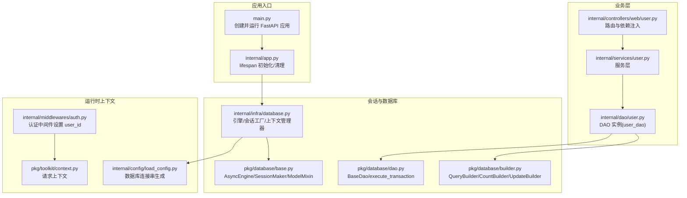
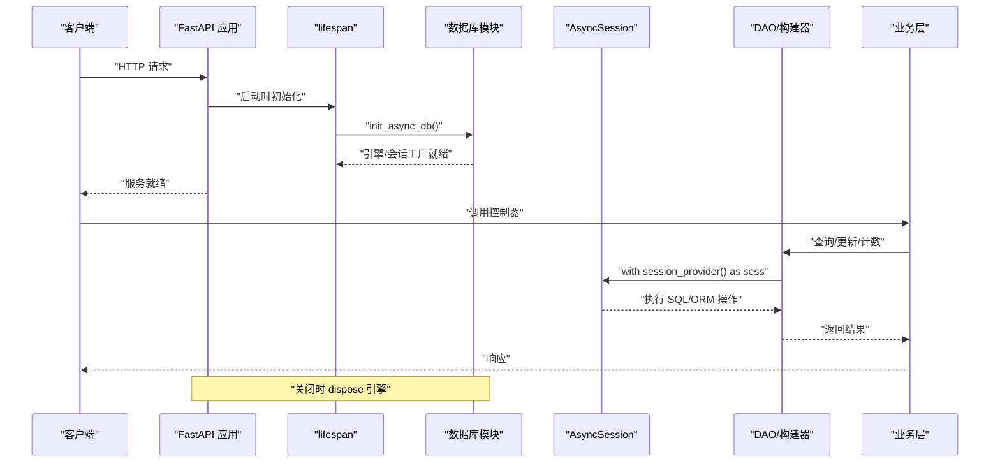
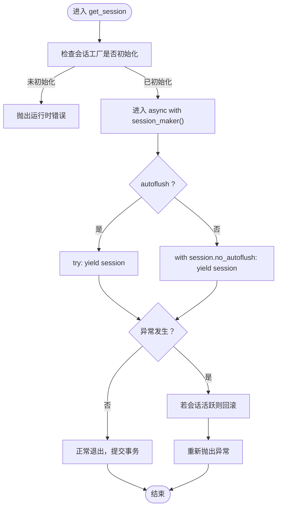
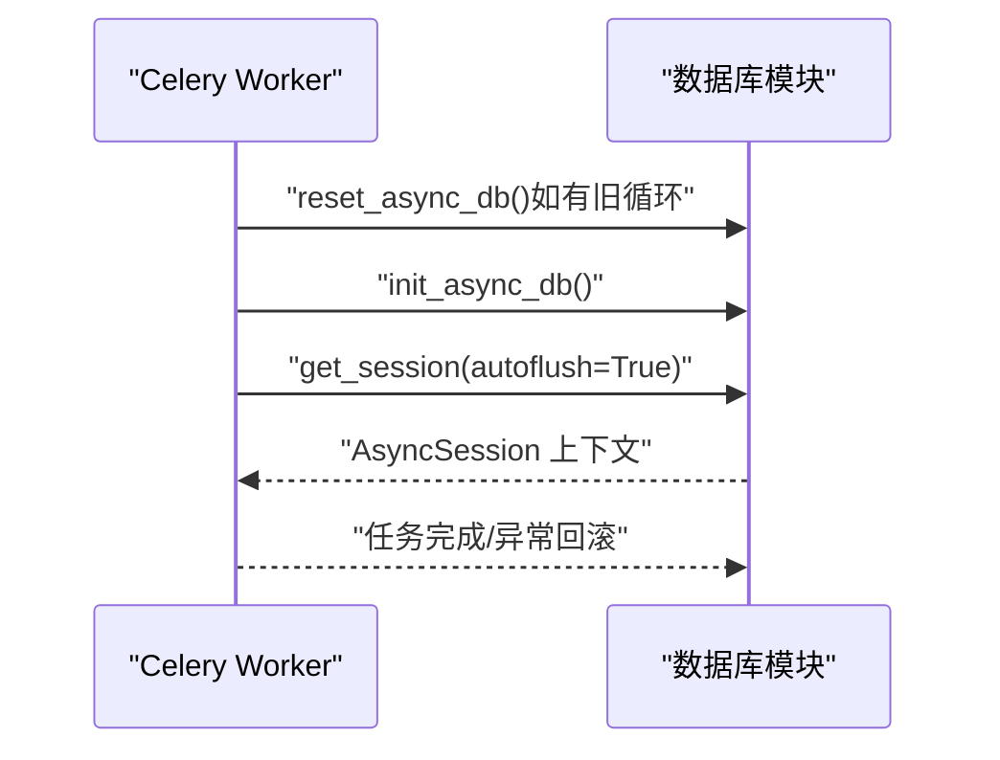
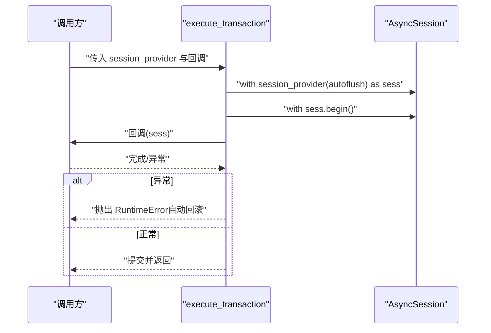
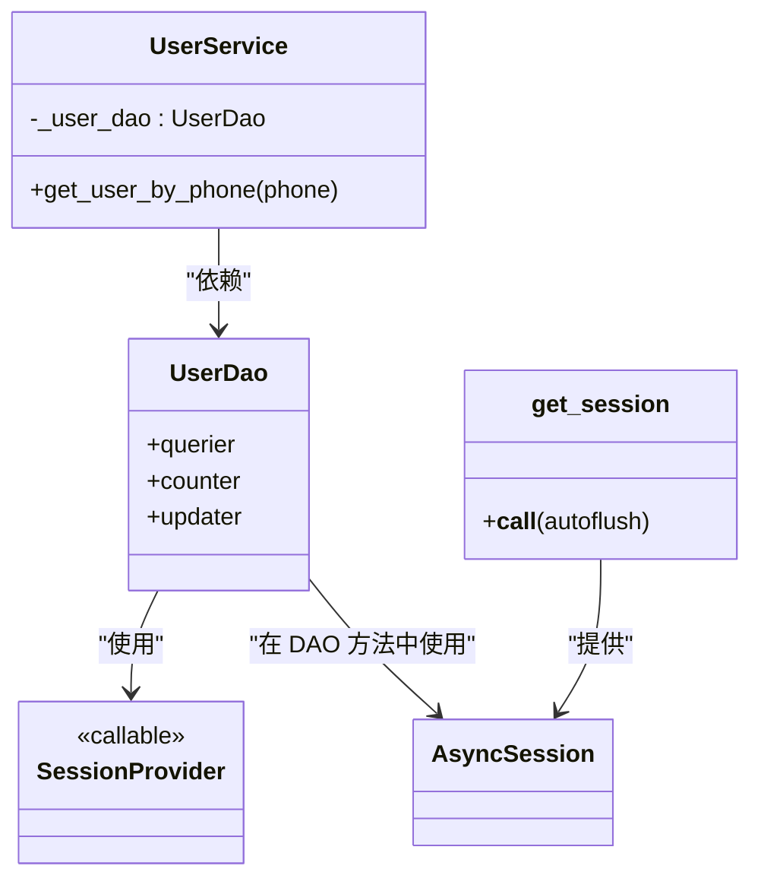
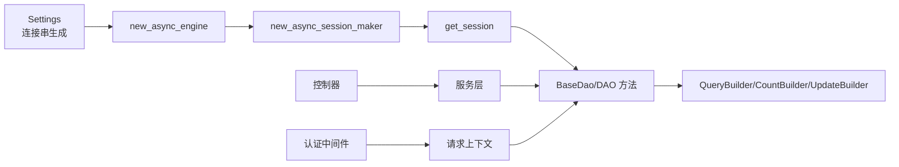

# 会话管理

<cite>
**本文引用的文件**
- [internal/infra/database.py](file://internal/infra/database.py)
- [pkg/database/base.py](file://pkg/database/base.py)
- [pkg/database/dao.py](file://pkg/database/dao.py)
- [pkg/database/builder.py](file://pkg/database/builder.py)
- [internal/dao/user.py](file://internal/dao/user.py)
- [internal/services/user.py](file://internal/services/user.py)
- [internal/controllers/web/user.py](file://internal/controllers/web/user.py)
- [internal/app.py](file://internal/app.py)
- [main.py](file://main.py)
- [pkg/toolkit/context.py](file://pkg/toolkit/context.py)
- [internal/middlewares/auth.py](file://internal/middlewares/auth.py)
- [internal/config/load_config.py](file://internal/config/load_config.py)
</cite>

## 目录
1. [简介](#简介)
2. [项目结构](#项目结构)
3. [核心组件](#核心组件)
4. [架构总览](#架构总览)
5. [组件详解](#组件详解)
6. [依赖关系分析](#依赖关系分析)
7. [性能考量](#性能考量)
8. [故障排查指南](#故障排查指南)
9. [结论](#结论)
10. [附录](#附录)

## 简介
本文件系统性阐述本项目的会话管理方案，围绕 AsyncSession 的使用模式与生命周期进行深入解析，重点覆盖：
- 上下文管理器模式与异常处理机制
- autoflush 与 no_autoflush 的区别及适用场景
- 在 FastAPI、Celery、AnyIO 等异步环境中的正确使用方法
- 事务管理最佳实践与错误回滚策略
- 会话状态监控与调试技巧
- 会话提供者与依赖注入的关系，以及在 FastAPI 中的集成方式

## 项目结构
本项目采用分层架构，数据库相关能力集中在 pkg/database 与 internal/infra 下，会话提供者与生命周期管理集中在 internal/infra/database.py，ORM 基类与 DAO/构建器位于 pkg/database，业务层通过依赖注入使用 DAO。

图表来源
- [internal/infra/database.py](file://internal/infra/database.py#L1-L154)
- [pkg/database/base.py](file://pkg/database/base.py#L1-L364)
- [pkg/database/dao.py](file://pkg/database/dao.py#L1-L203)
- [pkg/database/builder.py](file://pkg/database/builder.py#L1-L273)
- [internal/dao/user.py](file://internal/dao/user.py#L1-L24)
- [internal/services/user.py](file://internal/services/user.py#L1-L21)
- [internal/controllers/web/user.py](file://internal/controllers/web/user.py#L1-L17)
- [internal/app.py](file://internal/app.py#L1-L109)
- [main.py](file://main.py#L1-L18)
- [pkg/toolkit/context.py](file://pkg/toolkit/context.py#L1-L107)
- [internal/middlewares/auth.py](file://internal/middlewares/auth.py#L1-L150)
- [internal/config/load_config.py](file://internal/config/load_config.py#L1-L243)

章节来源
- [internal/infra/database.py](file://internal/infra/database.py#L1-L154)
- [pkg/database/base.py](file://pkg/database/base.py#L1-L364)
- [pkg/database/dao.py](file://pkg/database/dao.py#L1-L203)
- [pkg/database/builder.py](file://pkg/database/builder.py#L1-L273)
- [internal/dao/user.py](file://internal/dao/user.py#L1-L24)
- [internal/services/user.py](file://internal/services/user.py#L1-L21)
- [internal/controllers/web/user.py](file://internal/controllers/web/user.py#L1-L17)
- [internal/app.py](file://internal/app.py#L1-L109)
- [main.py](file://main.py#L1-L18)
- [pkg/toolkit/context.py](file://pkg/toolkit/context.py#L1-L107)
- [internal/middlewares/auth.py](file://internal/middlewares/auth.py#L1-L150)
- [internal/config/load_config.py](file://internal/config/load_config.py#L1-L243)

## 核心组件
- AsyncEngine/SessionMaker：由 pkg/database/base.py 提供，统一创建异步引擎与会话工厂，默认关闭自动过期、开启自动刷新。
- 会话提供者 get_session：由 internal/infra/database.py 提供，支持上下文管理器模式与异常回滚，支持 autoflush/no_autoflush 两种模式。
- DAO 层：pkg/database/dao.py 提供 BaseDao 与 execute_transaction，支持在单事务内执行复杂逻辑。
- 查询/计数/更新构建器：pkg/database/builder.py 提供 QueryBuilder、CountBuilder、UpdateBuilder，统一会话使用与事务提交。
- 业务集成：internal/dao/user.py 通过 user_dao 将 get_session 注入 DAO；internal/services/user.py 通过依赖注入使用 DAO；internal/controllers/web/user.py 通过 FastAPI Depends 注入服务。

章节来源
- [pkg/database/base.py](file://pkg/database/base.py#L19-L46)
- [internal/infra/database.py](file://internal/infra/database.py#L85-L111)
- [pkg/database/dao.py](file://pkg/database/dao.py#L15-L203)
- [pkg/database/builder.py](file://pkg/database/builder.py#L18-L273)
- [internal/dao/user.py](file://internal/dao/user.py#L1-L24)
- [internal/services/user.py](file://internal/services/user.py#L1-L21)
- [internal/controllers/web/user.py](file://internal/controllers/web/user.py#L1-L17)

## 架构总览
会话生命周期与控制流如下：

图表来源
- [internal/app.py](file://internal/app.py#L84-L109)
- [internal/infra/database.py](file://internal/infra/database.py#L26-L56)
- [pkg/database/dao.py](file://pkg/database/dao.py#L106-L203)
- [pkg/database/builder.py](file://pkg/database/builder.py#L145-L161)

## 组件详解

### 1) AsyncSession 使用模式与生命周期
- 引擎与会话工厂
  - 通过 new_async_engine 创建 AsyncEngine，配置连接池参数与 JSON 编解码器。
  - 通过 new_async_session_maker 创建 async_sessionmaker，设置 expire_on_commit=False、autoflush=True。
- 生命周期管理
  - init_async_db：幂等初始化，注册 SQL 监听事件，创建会话工厂。
  - close_async_db：释放引擎资源。
  - reset_async_db：在 Celery 等场景中重置全局状态，避免事件循环绑定冲突。
- 会话获取上下文管理器
  - get_session(autoflush=True|False)：返回 AsyncGenerator，进入上下文时创建会话；退出时自动提交或回滚。
  - 异常处理：捕获异常并在会话活跃时执行回滚，保证一致性。

图表来源
- [internal/infra/database.py](file://internal/infra/database.py#L85-L111)

章节来源
- [internal/infra/database.py](file://internal/infra/database.py#L26-L111)
- [pkg/database/base.py](file://pkg/database/base.py#L19-L46)

### 2) autoflush 与 no_autoflush 的区别与使用场景
- 默认 autoflush=True
  - 适合大多数 CRUD 场景，ORM 会在必要时自动刷新变更，便于立即获取自增 ID 或验证约束。
- no_autoflush
  - 适合批量插入/更新、复杂事务中需要手动控制刷新时机的场景，减少不必要的 flush 开销。
- 使用建议
  - 需要立即获取数据库生成的自增 ID：保持 autoflush=True。
  - 批量写入、无须立即可见性：可考虑 no_autoflush，但需显式 flush 获取 ID。
  - 事务内混合 ORM 与原生 SQL：保持 autoflush=True，必要时显式 flush。

章节来源
- [pkg/database/dao.py](file://pkg/database/dao.py#L106-L203)
- [pkg/database/builder.py](file://pkg/database/builder.py#L145-L161)

### 3) 在不同异步环境中的正确使用
- FastAPI
  - 在 lifespan 中初始化数据库，在关闭时清理。
  - 控制器通过 Depends 注入服务，服务通过 DAO 访问数据库，DAO 通过 user_dao 使用 get_session。
- Celery
  - 在 worker_process_init 中调用 init_async_db；如需在新事件循环中使用，先 reset_async_db 再 init_async_db。
- AnyIO
  - 通过 get_session 的上下文管理器在任意异步环境中获取会话，遵循相同的异常回滚策略。

图表来源
- [internal/infra/database.py](file://internal/infra/database.py#L69-L80)
- [internal/infra/database.py](file://internal/infra/database.py#L26-L56)

章节来源
- [internal/infra/database.py](file://internal/infra/database.py#L69-L80)
- [internal/app.py](file://internal/app.py#L84-L109)

### 4) 事务管理最佳实践与错误回滚策略
- 单次操作
  - QueryBuilder/CountBuilder/UpdateBuilder 在执行时内部开启事务并提交，适合简单 CRUD。
- 复杂事务
  - 使用 execute_transaction(session_provider, callback, autoflush=True)，在单个事务中执行复杂逻辑，异常自动回滚。
- 手动事务
  - 在 get_session 上下文中，使用 sess.begin() 显式开启/提交/回滚，适用于细粒度控制。

图表来源
- [pkg/database/dao.py](file://pkg/database/dao.py#L106-L203)

章节来源
- [pkg/database/dao.py](file://pkg/database/dao.py#L106-L203)

### 5) 会话状态监控与调试技巧
- SQL 监控
  - init_async_db 中注册事件监听，在 before/after 执行时记录耗时与 SQL，慢查询阈值与调试开关来自配置。
- 日志输出
  - INFO/WARNING 级别输出 SQL 与慢查询，便于定位性能瓶颈。
- 调试建议
  - 在开发环境开启 DEBUG，观察每条 SQL 的执行时间。
  - 使用 SLOW_SQL_THRESHOLD 调整慢查询阈值，结合日志定位热点。

章节来源
- [internal/infra/database.py](file://internal/infra/database.py#L116-L154)
- [internal/config/load_config.py](file://internal/config/load_config.py#L118-L160)

### 6) 会话与依赖注入的关系及在 FastAPI 中的集成
- 会话提供者
  - get_session 作为 SessionProvider，被 DAO 使用；user_dao 通过 get_session 注入。
- 服务层依赖注入
  - new_user_service 返回 UserService 实例，其构造函数注入 UserDao。
- 控制器依赖注入
  - 通过 Depends(new_user_service) 注入 UserService，控制器方法中直接调用服务。
- 请求上下文
  - 认证中间件在请求进入时设置 user_id 到上下文，模型混入在插入/更新时读取上下文字段。

图表来源
- [pkg/database/base.py](file://pkg/database/base.py#L16-L16)
- [internal/dao/user.py](file://internal/dao/user.py#L1-L24)
- [internal/services/user.py](file://internal/services/user.py#L1-L21)
- [internal/controllers/web/user.py](file://internal/controllers/web/user.py#L1-L17)

章节来源
- [internal/dao/user.py](file://internal/dao/user.py#L1-L24)
- [internal/services/user.py](file://internal/services/user.py#L1-L21)
- [internal/controllers/web/user.py](file://internal/controllers/web/user.py#L1-L17)
- [pkg/toolkit/context.py](file://pkg/toolkit/context.py#L78-L86)
- [internal/middlewares/auth.py](file://internal/middlewares/auth.py#L132-L149)

## 依赖关系分析
- 组件耦合
  - DAO 依赖 SessionProvider，不直接依赖具体实现，便于替换与测试。
  - 控制器依赖服务，服务依赖 DAO，形成清晰的单向依赖链。
- 外部依赖
  - SQLAlchemy AsyncEngine/AsyncSession、事件系统
  - FastAPI 的 lifespan、Depends
  - Pydantic Settings 生成数据库连接串

图表来源
- [internal/config/load_config.py](file://internal/config/load_config.py#L118-L160)
- [pkg/database/base.py](file://pkg/database/base.py#L19-L46)
- [internal/infra/database.py](file://internal/infra/database.py#L85-L111)
- [pkg/database/dao.py](file://pkg/database/dao.py#L15-L203)
- [pkg/database/builder.py](file://pkg/database/builder.py#L18-L273)
- [internal/middlewares/auth.py](file://internal/middlewares/auth.py#L132-L149)
- [pkg/toolkit/context.py](file://pkg/toolkit/context.py#L78-L86)

章节来源
- [internal/config/load_config.py](file://internal/config/load_config.py#L118-L160)
- [pkg/database/base.py](file://pkg/database/base.py#L19-L46)
- [internal/infra/database.py](file://internal/infra/database.py#L85-L111)
- [pkg/database/dao.py](file://pkg/database/dao.py#L15-L203)
- [pkg/database/builder.py](file://pkg/database/builder.py#L18-L273)
- [internal/middlewares/auth.py](file://internal/middlewares/auth.py#L132-L149)
- [pkg/toolkit/context.py](file://pkg/toolkit/context.py#L78-L86)

## 性能考量
- 连接池参数
  - pool_pre_ping、pool_size、max_overflow、pool_timeout、pool_recycle 等参数已在引擎创建时配置，有助于稳定连接与回收。
- SQL 监控
  - 通过事件监听记录慢查询，结合 SLOW_SQL_THRESHOLD 与 DEBUG 控制日志级别，便于识别热点。
- 批量操作
  - 使用 ModelMixin.insert_rows/insert_instances 与 Builder 的批量插入，减少往返次数。
- 自动刷新策略
  - 默认 autoflush=True 便于获取自增 ID，但在高吞吐场景可评估使用 no_autoflush 降低 flush 成本。

章节来源
- [internal/infra/database.py](file://internal/infra/database.py#L38-L49)
- [internal/infra/database.py](file://internal/infra/database.py#L116-L154)
- [pkg/database/base.py](file://pkg/database/base.py#L99-L150)
- [pkg/database/builder.py](file://pkg/database/builder.py#L100-L150)

## 故障排查指南
- 初始化问题
  - 若未调用 init_async_db 就使用 get_session，会抛出运行时错误。请在应用启动时调用 lifespan 中的初始化。
- 异常回滚
  - get_session 在异常时会尝试回滚，若仍出现脏数据，检查是否在外部手动提交或绕过了上下文管理器。
- 慢查询定位
  - 开启 DEBUG 或调整 SLOW_SQL_THRESHOLD，查看 WARNING/INFO 日志中的 SQL 与耗时。
- 事务冲突
  - 使用 execute_transaction 或 sess.begin() 明确事务边界，避免跨方法的隐式事务导致锁竞争。
- 上下文缺失
  - 若模型混入需要 user_id/now 等上下文字段，请确认认证中间件已设置 user_id，否则会触发异常。

章节来源
- [internal/infra/database.py](file://internal/infra/database.py#L92-L111)
- [internal/infra/database.py](file://internal/infra/database.py#L134-L142)
- [pkg/toolkit/context.py](file://pkg/toolkit/context.py#L78-L86)
- [internal/middlewares/auth.py](file://internal/middlewares/auth.py#L132-L149)

## 结论
本项目通过统一的 AsyncEngine/SessionMaker、上下文管理器与事件监听，提供了稳定可靠的会话管理方案。结合 DAO/构建器与依赖注入，实现了清晰的分层与可测试性。在 FastAPI、Celery、AnyIO 等异步环境中均可正确使用。建议在需要立即获取自增 ID 的场景保持 autoflush=True，在批量写入场景评估 no_autoflush 以优化性能。配合 SQL 监控与事务最佳实践，可有效提升系统稳定性与可观测性。

## 附录
- 配置项参考
  - SLOW_SQL_THRESHOLD：慢查询阈值（秒）
  - DEBUG：是否输出 SQL 日志
  - sqlalchemy_database_uri：数据库连接串（由 Settings 动态生成）

章节来源
- [internal/config/load_config.py](file://internal/config/load_config.py#L118-L160)
- [internal/infra/database.py](file://internal/infra/database.py#L134-L142)