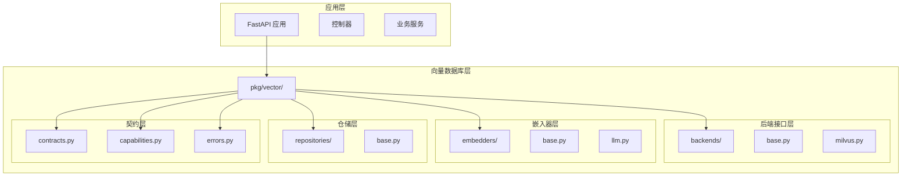
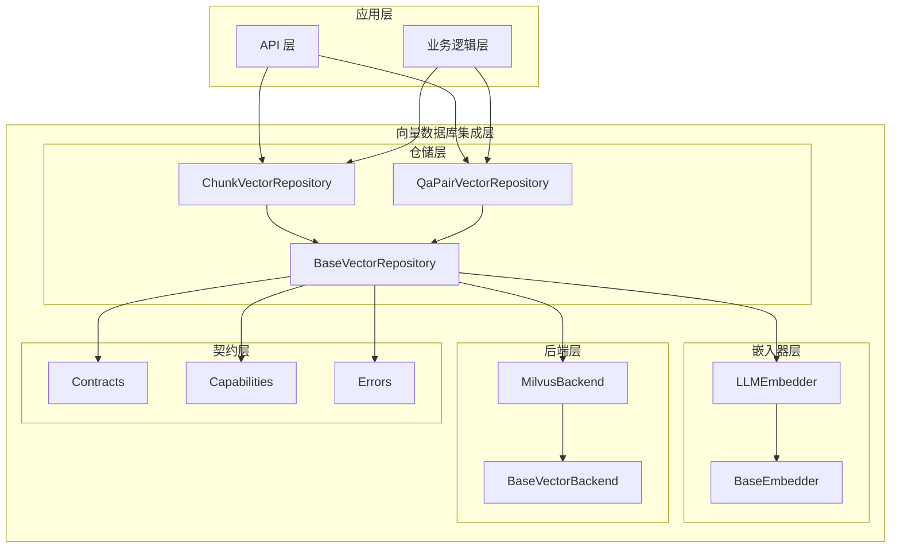
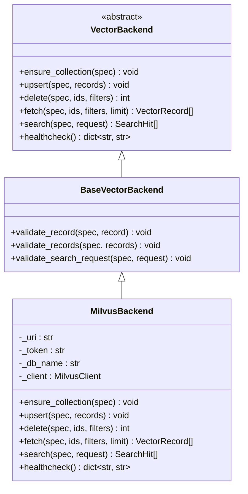
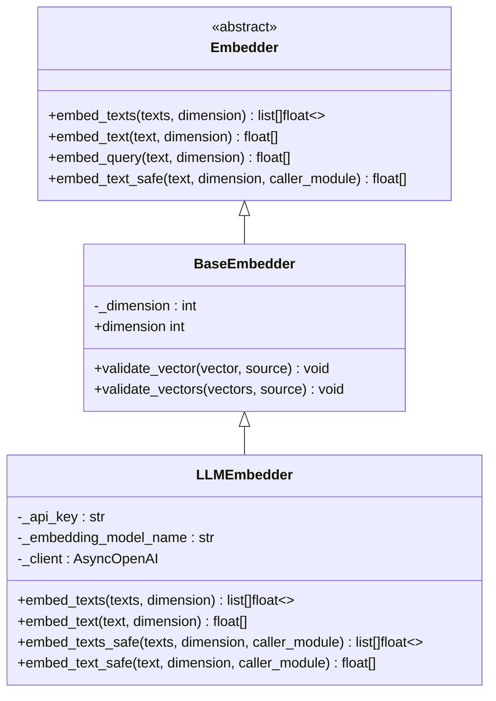
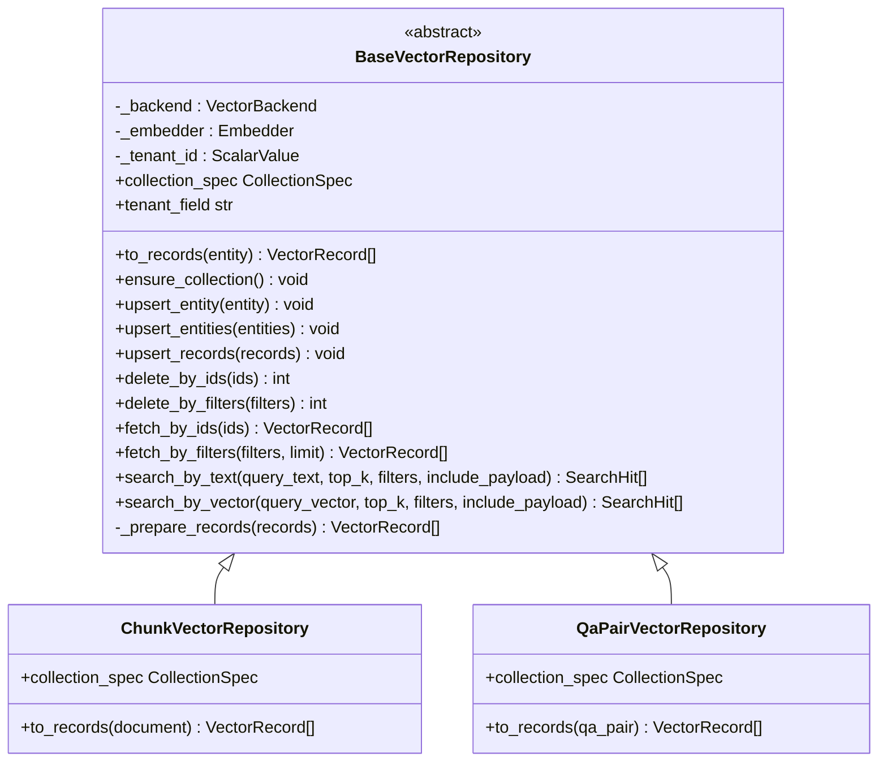
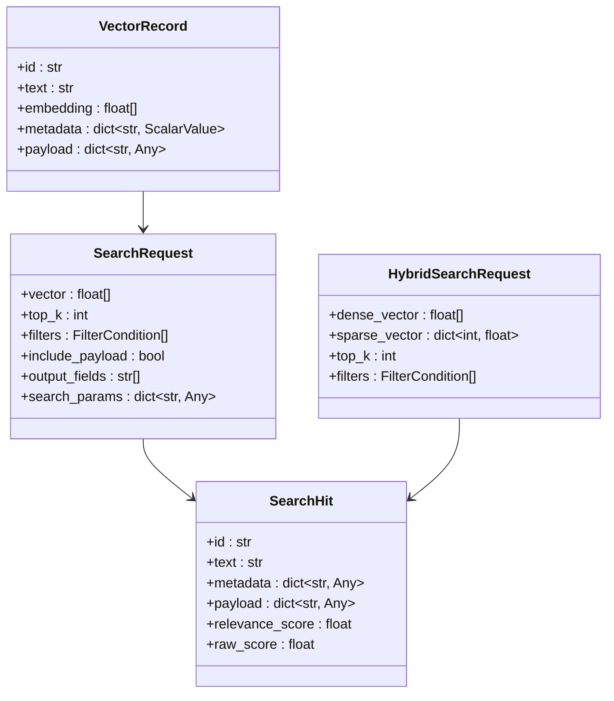
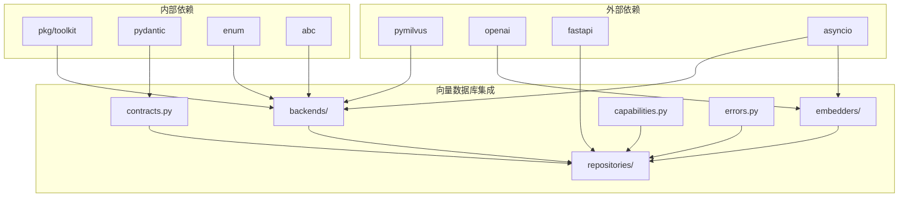

# 向量数据库集成

<cite>
**本文档引用的文件**
- [README.md](file://README.md)
- [main.py](file://main.py)
- [internal/app.py](file://internal/app.py)
- [pkg/vector/__init__.py](file://pkg/vector/__init__.py)
- [pkg/vector/backends/base.py](file://pkg/vector/backends/base.py)
- [pkg/vector/backends/milvus.py](file://pkg/vector/backends/milvus.py)
- [pkg/vector/backends/__init__.py](file://pkg/vector/backends/__init__.py)
- [pkg/vector/embedders/base.py](file://pkg/vector/embedders/base.py)
- [pkg/vector/embedders/llm.py](file://pkg/vector/embedders/llm.py)
- [pkg/vector/embedders/__init__.py](file://pkg/vector/embedders/__init__.py)
- [pkg/vector/repositories/base.py](file://pkg/vector/repositories/base.py)
- [pkg/vector/repositories/__init__.py](file://pkg/vector/repositories/__init__.py)
- [pkg/vector/contracts.py](file://pkg/vector/contracts.py)
- [pkg/vector/capabilities.py](file://pkg/vector/capabilities.py)
- [pkg/vector/errors.py](file://pkg/vector/errors.py)
</cite>

## 目录
1. [简介](#简介)
2. [项目结构](#项目结构)
3. [核心组件](#核心组件)
4. [架构概览](#架构概览)
5. [详细组件分析](#详细组件分析)
6. [依赖关系分析](#依赖关系分析)
7. [性能考虑](#性能考虑)
8. [故障排除指南](#故障排除指南)
9. [结论](#结论)

## 简介

这是一个基于 FastAPI 构建的高性能后端应用，专门集成了向量数据库功能。该系统采用分层架构设计，支持异步数据库操作、分布式任务队列和定时任务调度，同时提供了完整的向量数据库解决方案。

向量数据库集成是该项目的核心特性之一，它提供了以下关键能力：

- **向量相似性搜索**：支持基于嵌入向量的语义搜索
- **多租户隔离**：通过不同的隔离策略确保数据安全
- **灵活的后端支持**：目前支持 Milvus 向量数据库
- **智能嵌入生成**：集成 OpenAI 等 LLM 提供商的嵌入服务
- **企业级功能**：支持混合搜索、批量导入、命名空间隔离等高级特性

## 项目结构

项目采用清晰的分层架构，向量数据库集成位于 `pkg/vector/` 目录下，包含以下主要模块：

**图表来源**
- [pkg/vector/__init__.py:1-86](file://pkg/vector/__init__.py#L1-L86)
- [internal/app.py:1-111](file://internal/app.py#L1-L111)

**章节来源**
- [README.md:73-105](file://README.md#L73-L105)
- [pkg/vector/__init__.py:1-86](file://pkg/vector/__init__.py#L1-L86)

## 核心组件

向量数据库集成系统由四个核心层次组成，每个层次都有明确的职责分工：

### 1. 后端接口层 (Backends)
负责与具体的向量数据库产品交互，当前实现了 Milvus 后端。

### 2. 嵌入器层 (Embedders)
负责将文本转换为向量表示，当前集成了 LLM 嵌入器。

### 3. 仓储层 (Repositories)
提供面向业务的向量数据操作接口，封装了复杂的向量数据库操作。

### 4. 契约层 (Contracts)
定义了系统中使用的数据结构和接口规范。

**章节来源**
- [pkg/vector/backends/base.py:122-185](file://pkg/vector/backends/base.py#L122-L185)
- [pkg/vector/embedders/base.py:14-55](file://pkg/vector/embedders/base.py#L14-L55)
- [pkg/vector/repositories/base.py:18-87](file://pkg/vector/repositories/base.py#L18-L87)
- [pkg/vector/contracts.py:11-51](file://pkg/vector/contracts.py#L11-L51)

## 架构概览

整个向量数据库集成系统采用了清晰的分层架构，确保了良好的可扩展性和可维护性：

**图表来源**
- [pkg/vector/repositories/base.py:18-183](file://pkg/vector/repositories/base.py#L18-L183)
- [pkg/vector/backends/base.py:122-185](file://pkg/vector/backends/base.py#L122-L185)
- [pkg/vector/embedders/base.py:14-55](file://pkg/vector/embedders/base.py#L14-L55)

## 详细组件分析

### 向量后端接口 (VectorBackend)

向量后端接口定义了所有向量数据库操作的标准接口：

**图表来源**
- [pkg/vector/backends/base.py:122-185](file://pkg/vector/backends/base.py#L122-L185)
- [pkg/vector/backends/milvus.py:27-175](file://pkg/vector/backends/milvus.py#L27-L175)

#### 核心功能特性

1. **集合管理**：自动创建和验证向量集合的结构
2. **批量操作**：支持高效的批量插入、更新和删除
3. **灵活查询**：支持基于 ID 和过滤条件的查询
4. **向量搜索**：提供语义相似性搜索功能
5. **健康检查**：监控向量数据库的运行状态

**章节来源**
- [pkg/vector/backends/base.py:122-185](file://pkg/vector/backends/base.py#L122-L185)
- [pkg/vector/backends/milvus.py:57-175](file://pkg/vector/backends/milvus.py#L57-L175)

### 嵌入器系统 (Embedders)

嵌入器系统负责将文本转换为向量表示，当前实现了基于 LLM 的嵌入器：

**图表来源**
- [pkg/vector/embedders/base.py:14-55](file://pkg/vector/embedders/base.py#L14-L55)
- [pkg/vector/embedders/llm.py:22-171](file://pkg/vector/embedders/llm.py#L22-L171)

#### LLM 嵌入器特性

1. **异步处理**：使用 asyncio 提供非阻塞的嵌入生成
2. **错误处理**：内置完善的异常捕获和处理机制
3. **缓存机制**：使用 LRU 缓存优化嵌入器实例管理
4. **维度控制**：支持动态调整嵌入向量的维度
5. **安全配置**：自动脱敏 API 密钥信息

**章节来源**
- [pkg/vector/embedders/llm.py:22-171](file://pkg/vector/embedders/llm.py#L22-L171)
- [pkg/vector/embedders/base.py:14-55](file://pkg/vector/embedders/base.py#L14-L55)

### 仓储模式 (Repositories)

仓储模式提供了面向业务的向量数据操作接口，封装了复杂的向量数据库操作：

**图表来源**
- [pkg/vector/repositories/base.py:18-207](file://pkg/vector/repositories/base.py#L18-L207)

#### 仓储模式优势

1. **实体映射**：将业务实体转换为向量记录
2. **自动嵌入**：为缺失嵌入的记录自动生成向量
3. **多租户隔离**：通过租户字段实现数据隔离
4. **统一接口**：提供一致的 CRUD 和搜索接口
5. **批量处理**：优化批量操作的性能

**章节来源**
- [pkg/vector/repositories/base.py:18-207](file://pkg/vector/repositories/base.py#L18-L207)

### 数据契约和能力协议

系统定义了完整的数据契约和可选能力协议：

**图表来源**
- [pkg/vector/contracts.py:27-51](file://pkg/vector/contracts.py#L27-L51)
- [pkg/vector/capabilities.py:18-39](file://pkg/vector/capabilities.py#L18-L39)

**章节来源**
- [pkg/vector/contracts.py:11-51](file://pkg/vector/contracts.py#L11-L51)
- [pkg/vector/capabilities.py:18-71](file://pkg/vector/capabilities.py#L18-L71)

## 依赖关系分析

向量数据库集成系统的依赖关系呈现清晰的分层结构：

**图表来源**
- [pkg/vector/backends/milvus.py:6-24](file://pkg/vector/backends/milvus.py#L6-L24)
- [pkg/vector/embedders/llm.py:7-11](file://pkg/vector/embedders/llm.py#L7-L11)
- [pkg/vector/repositories/base.py:5-15](file://pkg/vector/repositories/base.py#L5-L15)

**章节来源**
- [pkg/vector/backends/milvus.py:1-502](file://pkg/vector/backends/milvus.py#L1-L502)
- [pkg/vector/embedders/llm.py:1-171](file://pkg/vector/embedders/llm.py#L1-L171)

## 性能考虑

向量数据库集成系统在设计时充分考虑了性能优化：

### 1. 异步操作
- 所有向量数据库操作都是异步的
- 使用 asyncio 提供非阻塞的嵌入生成
- 集成 anyio_run_in_thread 处理同步客户端

### 2. 批量处理
- 支持批量插入和更新操作
- 自动合并缺失嵌入的记录进行批量嵌入生成
- 优化网络请求频率

### 3. 缓存机制
- LRU 缓存嵌入器实例
- 避免重复创建昂贵的对象
- 自动处理配置变更后的实例替换

### 4. 连接管理
- 懒加载 Milvus 客户端连接
- 复用连接池减少资源消耗
- 智能的连接生命周期管理

## 故障排除指南

### 常见问题及解决方案

#### 1. 向量维度不匹配
**问题**：嵌入向量维度与集合配置不一致
**解决方案**：
- 确保嵌入模型输出维度与集合配置一致
- 使用 validate_vector 方法进行维度验证
- 检查嵌入器的 dimension 参数设置

#### 2. 集合结构不匹配
**问题**：现有集合的字段结构与期望不符
**解决方案**：
- 使用 ensure_collection 自动验证和修复集合结构
- 检查 CollectionSpec 的字段定义
- 确认向量字段的维度配置正确

#### 3. 过滤条件不支持
**问题**：某些过滤操作在当前后端不被支持
**解决方案**：
- 检查过滤条件的操作符是否被支持
- 确认过滤值的数据类型正确
- 使用 SupportsHybridSearch 等能力协议进行能力探测

#### 4. 嵌入生成失败
**问题**：LLM 嵌入器调用失败
**解决方案**：
- 检查 API 密钥和基础 URL 配置
- 验证网络连接和超时设置
- 查看详细的错误信息和日志

**章节来源**
- [pkg/vector/errors.py:1-24](file://pkg/vector/errors.py#L1-L24)
- [pkg/vector/backends/base.py:162-181](file://pkg/vector/backends/base.py#L162-L181)
- [pkg/vector/embedders/llm.py:124-139](file://pkg/vector/embedders/llm.py#L124-L139)

## 结论

向量数据库集成系统是一个设计精良、功能完整的解决方案，具有以下显著特点：

### 技术优势
1. **模块化设计**：清晰的分层架构，易于维护和扩展
2. **异步支持**：充分利用 Python 异步特性，提供高性能
3. **企业级功能**：支持多租户隔离、混合搜索等高级特性
4. **错误处理**：完善的异常处理和恢复机制

### 架构特色
1. **可插拔后端**：支持多种向量数据库后端
2. **智能嵌入**：自动处理嵌入生成和缓存
3. **统一接口**：提供一致的业务操作接口
4. **能力协议**：通过协议实现可选功能的动态检测

### 应用价值
该系统为构建现代 AI 应用提供了坚实的基础，特别适合需要语义搜索、知识检索和智能推荐的场景。通过合理的架构设计和性能优化，能够满足生产环境的各种需求。