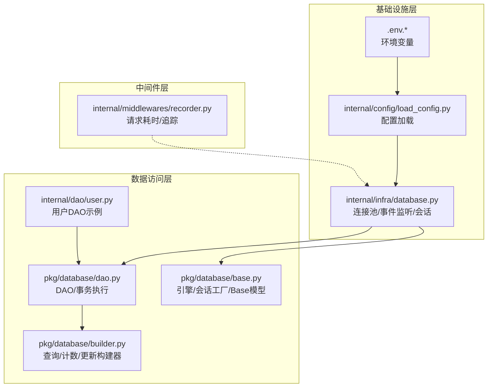
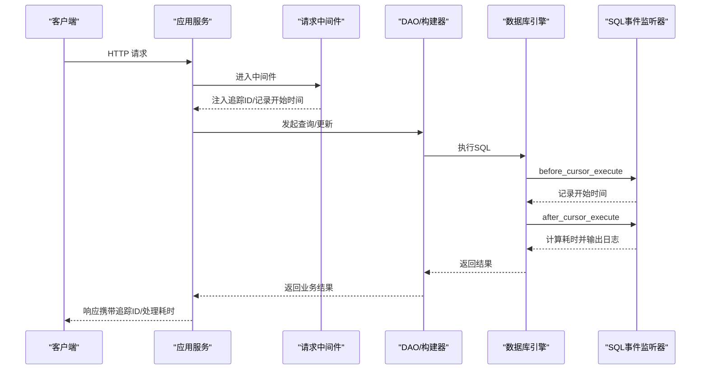
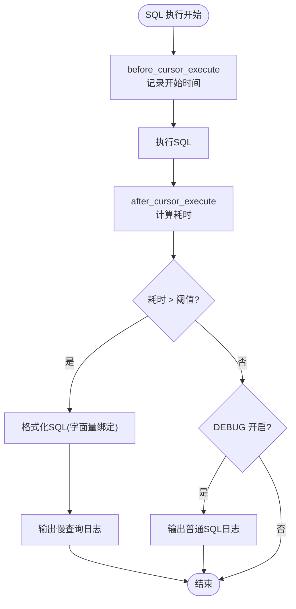
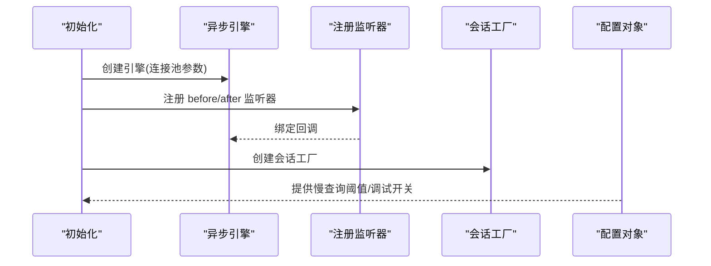
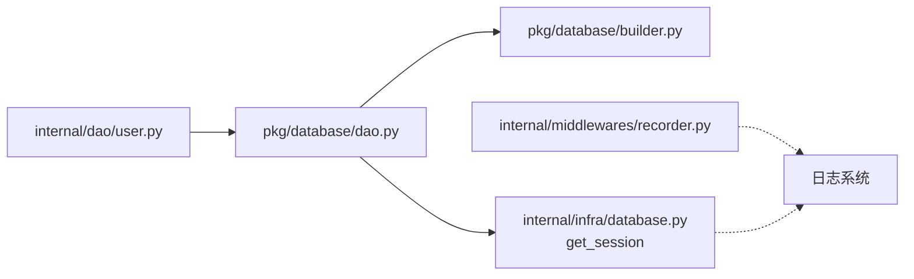

# 性能监控

<cite>
**本文引用的文件**
- [internal/infra/database.py](file://internal/infra/database.py)
- [pkg/database/base.py](file://pkg/database/base.py)
- [pkg/database/dao.py](file://pkg/database/dao.py)
- [pkg/database/builder.py](file://pkg/database/builder.py)
- [internal/dao/user.py](file://internal/dao/user.py)
- [internal/middlewares/recorder.py](file://internal/middlewares/recorder.py)
- [internal/config/load_config.py](file://internal/config/load_config.py)
- [configs/.env.dev](file://configs/.env.dev)
- [pkg/toolkit/logger.py](file://pkg/toolkit/logger.py)
</cite>

## 目录
1. [简介](#简介)
2. [项目结构](#项目结构)
3. [核心组件](#核心组件)
4. [架构总览](#架构总览)
5. [组件详解](#组件详解)
6. [依赖关系分析](#依赖关系分析)
7. [性能考量](#性能考量)
8. [故障排查指南](#故障排查指南)
9. [结论](#结论)
10. [附录](#附录)

## 简介
本文件围绕数据库性能监控进行系统化文档化，重点解释以下内容：
- SQL 执行时间监控与慢查询检测机制
- SQL 事件监听器的实现与配置方法
- 慢查询阈值设置与告警策略
- SQL 格式化与参数绑定的实现细节
- 数据库性能指标采集与分析方法
- 连接池使用率监控与资源消耗统计
- 基于日志的性能瓶颈定位与优化建议

## 项目结构
本项目采用分层架构，数据库相关能力集中在基础设施层与数据访问层：
- 基础设施层：负责连接池初始化、事件监听器注册、会话管理
- 数据访问层：DAO 与查询构建器，封装 ORM 查询与事务执行
- 中间件层：请求级性能记录与追踪
- 配置层：环境变量与运行时配置加载

图表来源
- [internal/infra/database.py](file://internal/infra/database.py#L26-L154)
- [pkg/database/base.py](file://pkg/database/base.py#L19-L46)
- [pkg/database/dao.py](file://pkg/database/dao.py#L15-L120)
- [pkg/database/builder.py](file://pkg/database/builder.py#L111-L190)
- [internal/dao/user.py](file://internal/dao/user.py#L6-L24)
- [internal/middlewares/recorder.py](file://internal/middlewares/recorder.py#L66-L123)
- [internal/config/load_config.py](file://internal/config/load_config.py#L179-L242)
- [configs/.env.dev](file://configs/.env.dev#L1-L20)

章节来源
- [internal/infra/database.py](file://internal/infra/database.py#L26-L154)
- [pkg/database/base.py](file://pkg/database/base.py#L19-L46)
- [pkg/database/dao.py](file://pkg/database/dao.py#L15-L120)
- [pkg/database/builder.py](file://pkg/database/builder.py#L111-L190)
- [internal/dao/user.py](file://internal/dao/user.py#L6-L24)
- [internal/middlewares/recorder.py](file://internal/middlewares/recorder.py#L66-L123)
- [internal/config/load_config.py](file://internal/config/load_config.py#L179-L242)
- [configs/.env.dev](file://configs/.env.dev#L1-L20)

## 核心组件
- 数据库连接池与生命周期管理：负责创建异步引擎、注册事件监听器、提供会话工厂
- SQL 事件监听器：在“执行前/执行后”钩子中计算耗时并输出慢查询日志
- SQL 格式化与参数绑定：尝试编译带字面量绑定的 SQL，或回退到字符串拼接
- DAO 与查询构建器：封装查询、计数、更新与事务执行，统一会话提供方式
- 请求级性能中间件：记录请求处理耗时与追踪 ID，便于端到端性能分析

章节来源
- [internal/infra/database.py](file://internal/infra/database.py#L26-L154)
- [pkg/database/dao.py](file://pkg/database/dao.py#L15-L120)
- [pkg/database/builder.py](file://pkg/database/builder.py#L111-L190)
- [internal/middlewares/recorder.py](file://internal/middlewares/recorder.py#L66-L123)

## 架构总览
下图展示了从请求进入应用到数据库执行的完整链路，以及性能监控的关键节点。

图表来源
- [internal/middlewares/recorder.py](file://internal/middlewares/recorder.py#L70-L102)
- [pkg/database/dao.py](file://pkg/database/dao.py#L106-L120)
- [pkg/database/builder.py](file://pkg/database/builder.py#L145-L162)
- [internal/infra/database.py](file://internal/infra/database.py#L116-L154)

## 组件详解

### SQL 执行时间监控与慢查询检测
- 监听器注册：在引擎上注册“执行前/执行后”事件，分别记录开始时间与计算耗时
- 慢查询判定：基于配置项阈值比较，超过阈值输出警告日志，否则在调试模式下输出信息日志
- SQL 格式化：优先使用编译器生成带字面量绑定的 SQL；若失败则回退到“原始SQL + 参数串”
- 参数绑定：通过编译参数控制字面量绑定，便于日志可读性与审计

图表来源
- [internal/infra/database.py](file://internal/infra/database.py#L122-L154)

章节来源
- [internal/infra/database.py](file://internal/infra/database.py#L116-L154)

### SQL 事件监听器实现与配置
- 初始化阶段：创建异步引擎并注册事件监听器
- 会话提供：通过统一的会话工厂提供会话，确保监听器作用范围覆盖所有执行路径
- 配置来源：慢查询阈值与调试开关来自全局配置对象；连接池参数在引擎创建时设定

图表来源
- [internal/infra/database.py](file://internal/infra/database.py#L26-L56)
- [internal/config/load_config.py](file://internal/config/load_config.py#L179-L242)

章节来源
- [internal/infra/database.py](file://internal/infra/database.py#L26-L56)
- [internal/config/load_config.py](file://internal/config/load_config.py#L179-L242)

### SQL 格式化与参数绑定细节
- 编译字面量绑定：利用编译器将参数内联到 SQL，提升日志可读性
- 参数回退：当编译失败时，将原始 SQL 与参数字符串拼接输出
- 异常兜底：格式化异常会被捕获并记录，同时保留原始 SQL 以便排查

章节来源
- [internal/infra/database.py](file://internal/infra/database.py#L145-L154)

### 数据库性能指标采集与分析
- 执行耗时：由监听器计算并输出，可用于统计 P50/P95/P99
- SQL 文本与参数：格式化后的 SQL 便于识别重复慢查询与参数化不足
- 日志聚合：结合追踪 ID，可在日志系统中进行端到端关联分析

章节来源
- [internal/infra/database.py](file://internal/infra/database.py#L127-L142)

### 连接池使用率监控与资源消耗统计
- 连接池参数：在引擎创建时设置池大小、溢出数量、超时与回收周期
- 使用建议：结合慢查询日志与中间件请求耗时，评估并发与池容量匹配度
- 资源统计：可通过连接池状态与数据库侧指标进一步补充

章节来源
- [pkg/database/base.py](file://pkg/database/base.py#L19-L41)
- [internal/infra/database.py](file://internal/infra/database.py#L38-L49)

### 基于日志的性能瓶颈定位
- 关联追踪：中间件注入追踪 ID，配合数据库慢查询日志进行端到端定位
- 重复模式：通过 SQL 文本与参数模式识别热点与重复查询
- 调试开关：在开发环境开启调试日志，全面观测 SQL 执行情况

章节来源
- [internal/middlewares/recorder.py](file://internal/middlewares/recorder.py#L70-L102)
- [internal/infra/database.py](file://internal/infra/database.py#L134-L142)

### 性能优化建议与调优策略
- SQL 层
  - 参数化查询：减少 SQL 文本差异，提高缓存命中
  - 索引优化：针对高频过滤/排序列建立索引
  - 分页与限制：避免一次性拉取大量数据
- 连接池层
  - 合理设置池大小与超时，避免排队与频繁创建销毁
  - 结合慢查询与请求峰值，动态调整池参数
- 应用层
  - 批量操作：合并多次请求为批量写入
  - 缓存策略：对热点读取加缓存，降低数据库压力
- 监控与告警
  - 设定阈值分级：区分轻微延迟与严重慢查询
  - 结合中间件请求耗时与数据库执行耗时，定位瓶颈所在

## 依赖关系分析
- DAO 与查询构建器依赖会话提供器，统一通过数据库基础设施提供的会话工厂
- 用户 DAO 作为示例，演示如何使用会话提供器发起查询
- 中间件与数据库层相互独立，但通过追踪 ID 实现跨层关联

图表来源
- [internal/dao/user.py](file://internal/dao/user.py#L6-L24)
- [pkg/database/dao.py](file://pkg/database/dao.py#L15-L120)
- [pkg/database/builder.py](file://pkg/database/builder.py#L111-L190)
- [internal/infra/database.py](file://internal/infra/database.py#L85-L111)
- [internal/middlewares/recorder.py](file://internal/middlewares/recorder.py#L66-L123)

章节来源
- [internal/dao/user.py](file://internal/dao/user.py#L6-L24)
- [pkg/database/dao.py](file://pkg/database/dao.py#L15-L120)
- [pkg/database/builder.py](file://pkg/database/builder.py#L111-L190)
- [internal/infra/database.py](file://internal/infra/database.py#L85-L111)
- [internal/middlewares/recorder.py](file://internal/middlewares/recorder.py#L66-L123)

## 性能考量
- 监听器开销：事件回调在每次 SQL 执行前后触发，需关注对高并发的影响
- 日志级别：慢查询使用警告级别，调试模式下使用信息级别，避免生产环境日志风暴
- 格式化成本：SQL 编译与字面量绑定可能带来额外 CPU 开销，建议在生产环境谨慎启用高频率调试

## 故障排查指南
- 数据库未初始化
  - 现象：获取会话时报错
  - 排查：确认初始化函数已在应用生命周期中调用
- 监听器未生效
  - 现象：无慢查询日志
  - 排查：确认引擎已注册监听器；检查配置对象中阈值与调试开关
- SQL 格式化异常
  - 现象：日志中出现格式化错误提示
  - 排查：检查编译参数与方言配置；必要时回退到参数拼接模式
- 中间件追踪缺失
  - 现象：日志中缺少追踪 ID
  - 排查：确认中间件已正确注入；检查请求头是否传递追踪 ID

章节来源
- [internal/infra/database.py](file://internal/infra/database.py#L92-L93)
- [internal/infra/database.py](file://internal/infra/database.py#L116-L154)
- [internal/middlewares/recorder.py](file://internal/middlewares/recorder.py#L70-L102)

## 结论
本项目通过事件监听器实现了对 SQL 执行时间的细粒度监控，并提供了慢查询检测与日志输出能力。结合中间件的请求级追踪，能够形成从入口到数据库的完整性能视图。建议在生产环境中合理设置阈值与日志级别，配合连接池参数与 SQL 优化策略，持续提升整体性能与稳定性。

## 附录

### 配置项与默认值
- 慢查询阈值：来自配置对象的慢查询阈值，默认值参见实现处
- 调试开关：来自配置对象的调试开关，用于控制是否输出普通 SQL 日志
- 连接池参数：在引擎创建时设定，包括池大小、溢出数量、超时与回收周期

章节来源
- [internal/infra/database.py](file://internal/infra/database.py#L134-L135)
- [internal/infra/database.py](file://internal/infra/database.py#L38-L49)
- [internal/config/load_config.py](file://internal/config/load_config.py#L179-L242)