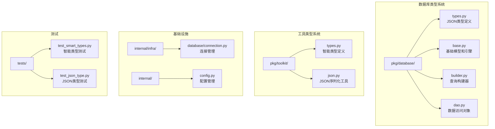
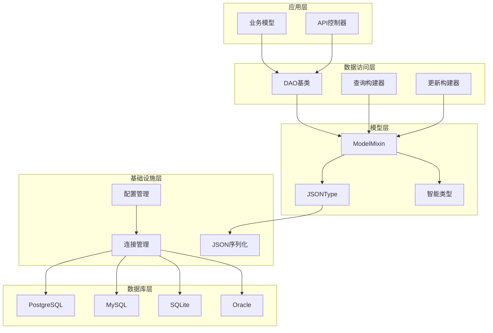
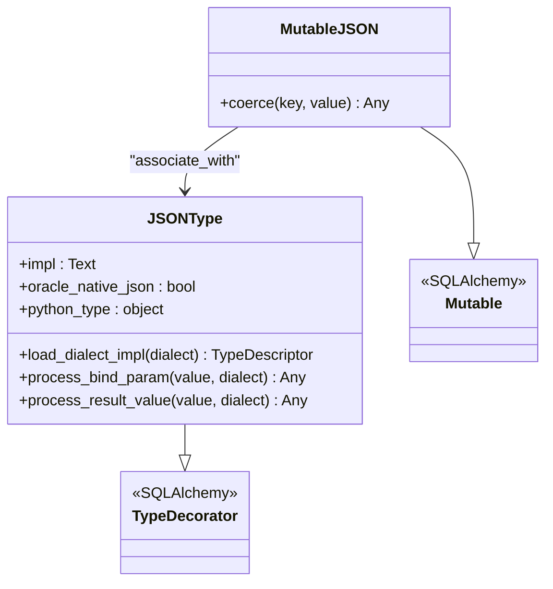
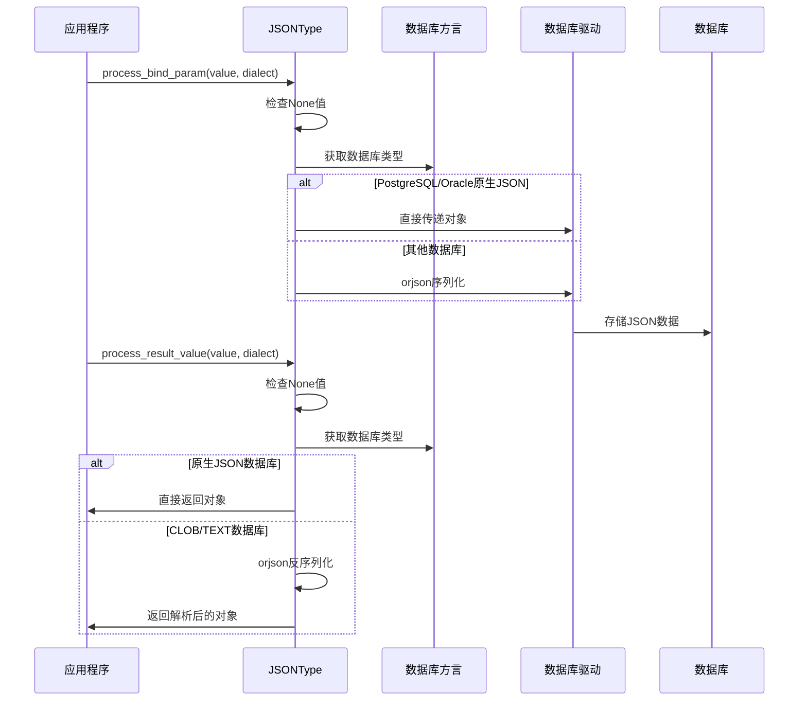
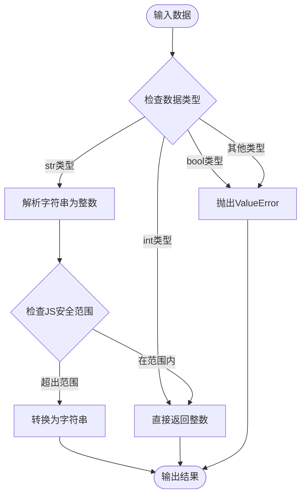
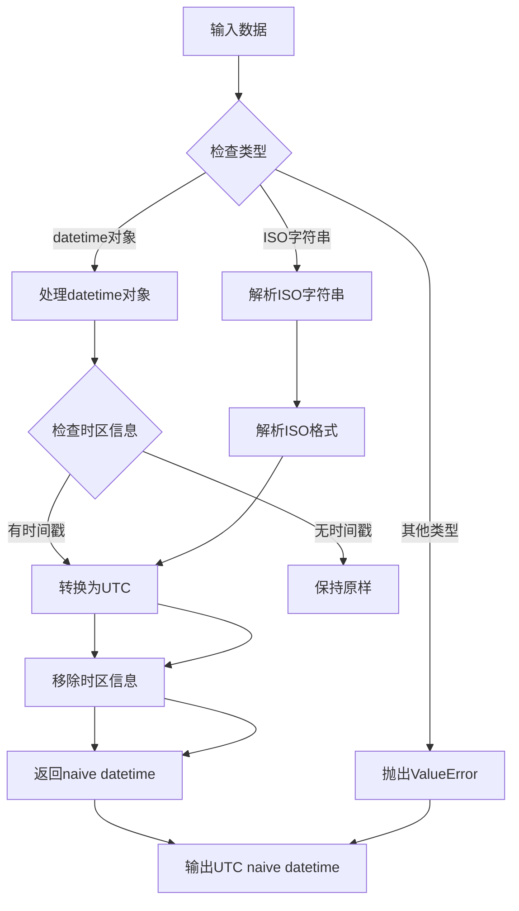
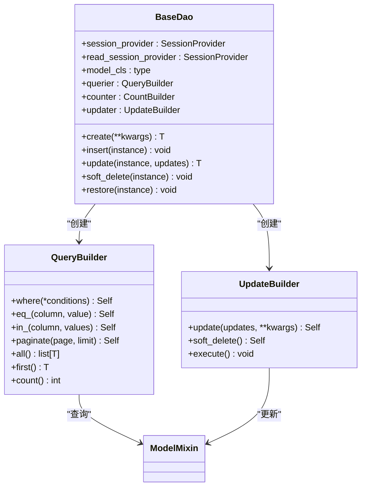
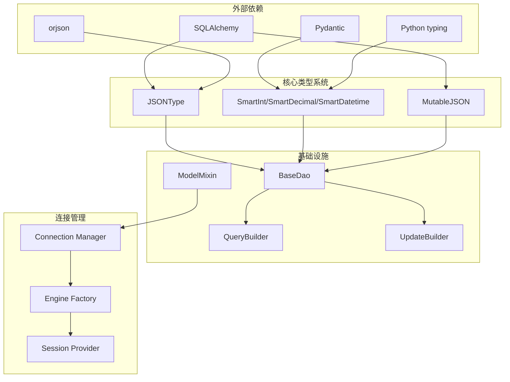

# 数据库类型系统

<cite>
**本文档中引用的文件**
- [pkg/database/types.py](file://pkg/database/types.py)
- [pkg/database/base.py](file://pkg/database/base.py)
- [pkg/database/builder.py](file://pkg/database/builder.py)
- [pkg/database/dao.py](file://pkg/database/dao.py)
- [pkg/toolkit/types.py](file://pkg/toolkit/types.py)
- [pkg/toolkit/json.py](file://pkg/toolkit/json.py)
- [internal/infra/database/connection.py](file://internal/infra/database/connection.py)
- [internal/config.py](file://internal/config.py)
- [tests/toolkit/test_smart_types.py](file://tests/toolkit/test_smart_types.py)
- [tests/test_json_type.py](file://tests/test_json_type.py)
</cite>

## 目录
1. [简介](#简介)
2. [项目结构](#项目结构)
3. [核心组件](#核心组件)
4. [架构概览](#架构概览)
5. [详细组件分析](#详细组件分析)
6. [依赖关系分析](#依赖关系分析)
7. [性能考虑](#性能考虑)
8. [故障排除指南](#故障排除指南)
9. [结论](#结论)

## 简介

数据库类型系统是FastAPI后端项目的核心基础设施，负责提供跨数据库兼容的数据类型支持、智能类型转换以及高性能的JSON序列化功能。该系统通过精心设计的类型装饰器和工具类，实现了以下关键特性：

- **跨数据库兼容性**：支持PostgreSQL、MySQL、SQLite、Oracle等多种数据库的JSON类型处理
- **智能类型转换**：提供SmartInt、SmartDecimal、SmartDatetime等智能类型，确保前后端数据的一致性
- **高性能序列化**：基于orjson的优化序列化方案，支持多种数据类型的高效处理
- **变更追踪机制**：内置MutableJSON支持JSON数据的智能变更检测
- **类型安全保证**：通过Pydantic注解确保运行时类型安全

## 项目结构

数据库类型系统主要分布在以下目录结构中：

**图表来源**
- [pkg/database/types.py](file://pkg/database/types.py#L1-L187)
- [pkg/toolkit/types.py](file://pkg/toolkit/types.py#L1-L278)
- [internal/infra/database/connection.py](file://internal/infra/database/connection.py#L1-L223)

**章节来源**
- [pkg/database/types.py](file://pkg/database/types.py#L1-L187)
- [pkg/database/base.py](file://pkg/database/base.py#L1-L309)
- [pkg/database/builder.py](file://pkg/database/builder.py#L1-L351)
- [pkg/database/dao.py](file://pkg/database/dao.py#L1-L456)

## 核心组件

### JSON类型系统

JSON类型系统是数据库类型系统的核心，提供了跨数据库兼容的JSON存储解决方案：

#### JSONType类
- **跨数据库适配**：根据不同的数据库方言自动选择最优的JSON存储方式
- **序列化策略**：针对不同数据库采用原生序列化或手动序列化
- **Oracle兼容性**：支持Oracle 21c+原生JSON和12c-20c CLOB模式

#### MutableJSON类
- **智能变更追踪**：自动识别dict和list的变更并触发更新
- **类型委派**：根据数据类型委派给MutableDict或MutableList处理

### 智能类型系统

智能类型系统提供前端友好的数据类型转换：

#### SmartInt
- **JavaScript安全范围**：超过JS最大安全整数时自动转换为字符串
- **双向转换**：支持字符串和整数的自动转换

#### SmartDecimal  
- **精度保证**：使用Decimal确保金融计算的精确性
- **范围优化**：在安全范围内输出浮点数，在高精度需求时输出字符串

#### SmartDatetime
- **UTC统一**：所有时间统一转换为UTC并去除时区信息
- **ISO格式**：输出标准化的ISO 8601格式字符串

**章节来源**
- [pkg/database/types.py](file://pkg/database/types.py#L16-L187)
- [pkg/toolkit/types.py](file://pkg/toolkit/types.py#L15-L278)

## 架构概览

数据库类型系统采用分层架构设计，确保了良好的模块化和可扩展性：

**图表来源**
- [pkg/database/dao.py](file://pkg/database/dao.py#L17-L456)
- [pkg/database/base.py](file://pkg/database/base.py#L49-L309)
- [internal/infra/database/connection.py](file://internal/infra/database/connection.py#L1-L223)

## 详细组件分析

### JSONType组件分析

JSONType是整个数据库类型系统的核心组件，实现了跨数据库兼容的JSON存储功能。

#### 类图设计

**图表来源**
- [pkg/database/types.py](file://pkg/database/types.py#L16-L187)

#### 数据库方言适配机制

JSONType通过`load_dialect_impl`方法实现不同数据库的类型适配：

| 数据库 | 类型 | 特性 | 适配方式 |
|--------|------|------|----------|
| PostgreSQL | JSONB | 支持索引和JSON路径查询 | 原生支持，无需序列化 |
| MySQL | JSON | 原生JSON类型 | 原生支持，无需序列化 |
| SQLite | JSON | SQLAlchemy方言支持 | 原生支持，无需序列化 |
| Oracle 21c+ | JSON | 原生JSON类型 | 原生支持，无需序列化 |
| Oracle 12c-20c | CLOB | 兼容模式 | 手动序列化 |
| 其他数据库 | TEXT | 通用模式 | 手动序列化 |

#### 序列化流程

**图表来源**
- [pkg/database/types.py](file://pkg/database/types.py#L100-L150)

**章节来源**
- [pkg/database/types.py](file://pkg/database/types.py#L16-L187)

### 智能类型组件分析

智能类型系统提供前端友好的数据类型转换，确保数据在传输过程中的兼容性和准确性。

#### SmartInt组件

SmartInt专门处理JavaScript安全范围内的整数转换：

**图表来源**
- [pkg/toolkit/types.py](file://pkg/toolkit/types.py#L20-L49)

#### SmartDecimal组件

SmartDecimal确保金融计算的精度要求：

| 输入类型 | 处理方式 | 输出类型 | 说明 |
|----------|----------|----------|------|
| Decimal | 直接使用 | Decimal | 保持原有精度 |
| int | 转换为Decimal | Decimal | 精确转换 |
| float | 转换为字符串后Decimal | Decimal | 避免浮点精度问题 |
| str | 直接解析为Decimal | Decimal | 支持科学计数法 |

#### SmartDatetime组件

SmartDatetime统一时间格式处理：

**图表来源**
- [pkg/toolkit/types.py](file://pkg/toolkit/types.py#L128-L160)

**章节来源**
- [pkg/toolkit/types.py](file://pkg/toolkit/types.py#L15-L278)

### DAO和查询构建器组件

DAO（数据访问对象）和查询构建器提供了完整的数据访问层抽象：

#### BaseDao类

BaseDao提供了统一的数据访问接口：

**图表来源**
- [pkg/database/dao.py](file://pkg/database/dao.py#L17-L456)
- [pkg/database/builder.py](file://pkg/database/builder.py#L20-L351)

**章节来源**
- [pkg/database/dao.py](file://pkg/database/dao.py#L17-L456)
- [pkg/database/builder.py](file://pkg/database/builder.py#L20-L351)

## 依赖关系分析

数据库类型系统具有清晰的依赖层次结构，确保了模块间的松耦合：

**图表来源**
- [pkg/database/types.py](file://pkg/database/types.py#L1-L10)
- [pkg/toolkit/types.py](file://pkg/toolkit/types.py#L1-L10)
- [pkg/database/dao.py](file://pkg/database/dao.py#L1-L10)

### 关键依赖关系

1. **SQLAlchemy集成**：所有数据库类型都继承自SQLAlchemy的TypeDecorator
2. **Pydantic集成**：智能类型使用Pydantic的BeforeValidator和PlainSerializer
3. **orjson依赖**：高性能JSON序列化依赖orjson库
4. **类型系统依赖**：智能类型依赖Python的typing模块进行类型注解

**章节来源**
- [pkg/database/types.py](file://pkg/database/types.py#L1-L10)
- [pkg/toolkit/types.py](file://pkg/toolkit/types.py#L1-L10)

## 性能考虑

数据库类型系统在设计时充分考虑了性能优化：

### JSON序列化性能

- **原生序列化**：PostgreSQL和Oracle 21c+使用原生JSON序列化，避免额外的序列化开销
- **orjson优化**：其他数据库使用orjson进行高性能序列化，支持多种优化选项
- **缓存机制**：JSONType标记为cache_ok，提高重复查询的性能

### 内存优化

- **LazyProxy**：使用懒加载代理减少不必要的对象初始化
- **类型转换最小化**：智能类型只在必要时进行转换，避免不必要的数据复制

### 数据库连接优化

- **连接池管理**：支持主库和只读副本的独立连接池配置
- **连接预检查**：启用pool_pre_ping确保连接有效性
- **连接复用**：通过上下文管理器确保连接正确释放

## 故障排除指南

### 常见问题及解决方案

#### JSON类型相关问题

1. **Oracle CLOB模式问题**
   - **症状**：Oracle 12c-20c环境下JSON数据存储异常
   - **解决方案**：使用`JSONType(oracle_native_json=False)`显式指定CLOB模式

2. **序列化失败**
   - **症状**：JSON序列化抛出TypeError异常
   - **解决方案**：检查数据类型，确保支持的类型（dict、list、str、int、float等）

#### 智能类型相关问题

1. **SmartInt转换错误**
   - **症状**：输入bool类型导致转换失败
   - **解决方案**：确保输入为int或str类型，避免bool类型

2. **SmartDecimal精度问题**
   - **症状**：浮点数转换导致精度丢失
   - **解决方案**：使用字符串表示法或Decimal类型

#### 连接管理问题

1. **数据库连接失败**
   - **症状**：初始化数据库连接时报错
   - **解决方案**：检查配置文件中的数据库连接参数

2. **连接池耗尽**
   - **症状**：应用程序出现连接超时
   - **解决方案**：调整连接池大小配置

**章节来源**
- [pkg/database/types.py](file://pkg/database/types.py#L51-L64)
- [pkg/toolkit/types.py](file://pkg/toolkit/types.py#L28-L37)
- [internal/infra/database/connection.py](file://internal/infra/database/connection.py#L32-L88)

## 结论

数据库类型系统通过精心设计的架构和实现，成功地解决了跨数据库兼容性、类型安全和性能优化等关键挑战。系统的主要优势包括：

1. **高度兼容性**：支持主流数据库的JSON类型处理，确保数据在不同数据库间的无缝迁移
2. **类型安全性**：通过智能类型和Pydantic验证，确保运行时数据的类型正确性
3. **性能优化**：采用原生序列化和连接池管理，最大化系统性能
4. **易于使用**：提供简洁的API和丰富的配置选项，降低开发复杂度

该系统为FastAPI后端项目提供了坚实的数据库类型基础设施，为后续的功能扩展和维护奠定了良好的基础。