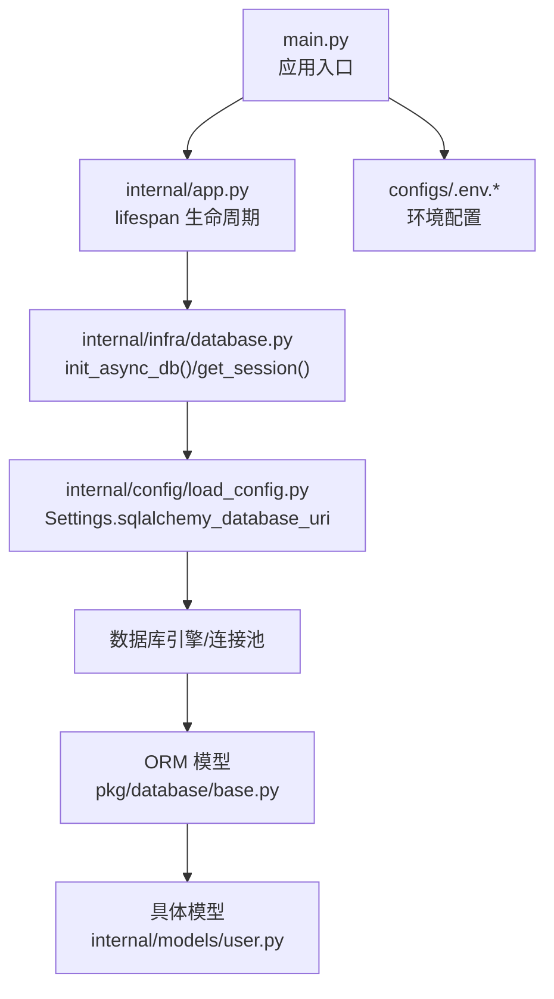
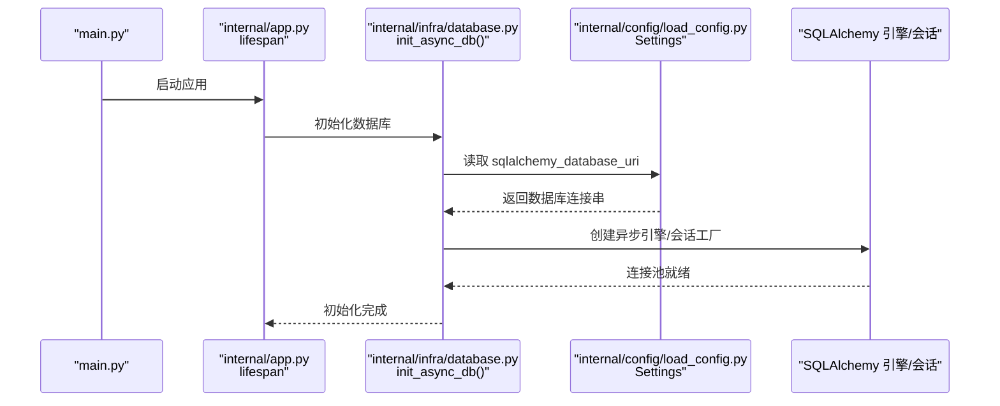
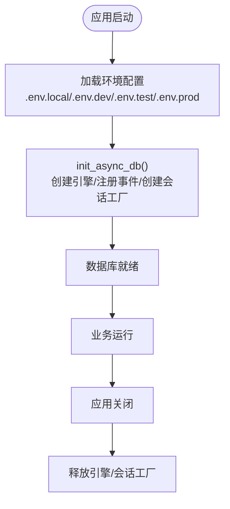
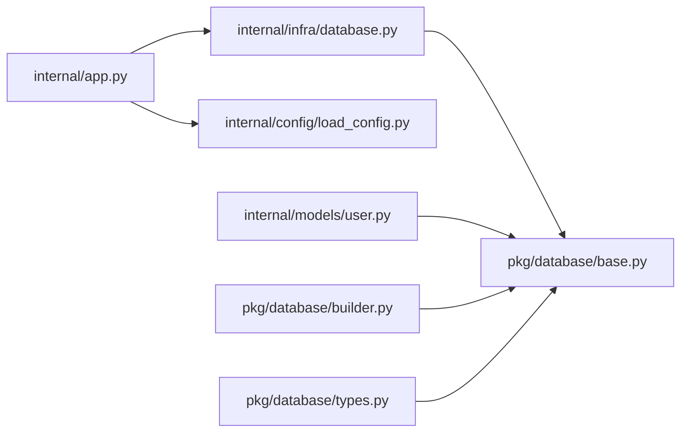

# 数据库迁移

<cite>
**本文引用的文件**
- [ddl/1.0.0.sql](file://ddl/1.0.0.sql)
- [dml/1.0.0.sql](file://dml/1.0.0.sql)
- [internal/infra/database.py](file://internal/infra/database.py)
- [pkg/database/base.py](file://pkg/database/base.py)
- [internal/config/load_config.py](file://internal/config/load_config.py)
- [internal/app.py](file://internal/app.py)
- [configs/.env.dev](file://configs/.env.dev)
- [configs/.env.test](file://configs/.env.test)
- [configs/.env.prod](file://configs/.env.prod)
- [configs/.env.local](file://configs/.env.local)
- [internal/models/user.py](file://internal/models/user.py)
- [pkg/database/builder.py](file://pkg/database/builder.py)
- [pkg/database/types.py](file://pkg/database/types.py)
- [main.py](file://main.py)
</cite>

## 目录
1. [简介](#简介)
2. [项目结构](#项目结构)
3. [核心组件](#核心组件)
4. [架构总览](#架构总览)
5. [详细组件分析](#详细组件分析)
6. [依赖分析](#依赖分析)
7. [性能考虑](#性能考虑)
8. [故障排查指南](#故障排查指南)
9. [结论](#结论)
10. [附录](#附录)

## 简介
本文件面向数据库迁移与版本管理，结合仓库现有 DDL 脚本与 ORM/连接层实现，系统化阐述以下主题：
- DDL 脚本的编写、执行与版本管理策略
- 数据库初始化流程与表结构定义
- SQL 脚本的组织结构与命名规范
- 迁移脚本的执行顺序与依赖关系管理
- 数据库版本控制与回滚策略
- 数据迁移最佳实践与风险控制
- 在不同环境（local/dev/test/prod）中执行迁移脚本的方法
- 从零开始的数据库初始化与数据填充策略

## 项目结构
本项目采用“声明式 ORM + 异步连接池 + 环境化配置”的架构。数据库迁移相关的关键位置如下：
- DDL 脚本：位于 ddl/ 目录，当前版本为 1.0.0.sql
- DML 脚本：位于 dml/ 目录，当前版本为 1.0.0.sql（为空）
- 配置：configs/ 目录下按环境划分 .env.local、.env.dev、.env.test、.env.prod
- 初始化入口：main.py 与 internal/app.py 的 lifespan 生命周期
- 连接与生命周期：internal/infra/database.py
- ORM 基类与模型：pkg/database/base.py、internal/models/user.py
- 查询构建器与 JSON 类型：pkg/database/builder.py、pkg/database/types.py

图表来源
- [main.py](file://main.py#L1-L18)
- [internal/app.py](file://internal/app.py#L84-L109)
- [internal/infra/database.py](file://internal/infra/database.py#L26-L56)
- [internal/config/load_config.py](file://internal/config/load_config.py#L118-L159)
- [configs/.env.dev](file://configs/.env.dev#L1-L20)

章节来源
- [main.py](file://main.py#L1-L18)
- [internal/app.py](file://internal/app.py#L84-L109)
- [internal/infra/database.py](file://internal/infra/database.py#L26-L56)
- [internal/config/load_config.py](file://internal/config/load_config.py#L118-L159)
- [configs/.env.dev](file://configs/.env.dev#L1-L20)

## 核心组件
- 数据库初始化与生命周期
  - 通过 lifespan 在应用启动时初始化数据库连接池，并在关闭时释放资源
  - 提供幂等初始化与重置接口，适配多事件循环场景
- ORM 基类与模型
  - ModelMixin 提供统一的软删、时间戳、创建/更新人字段与批量写入能力
  - 具体模型继承自 ModelMixin，自动获得默认字段与 CRUD 辅助方法
- 查询构建器
  - QueryBuilder/CountBuilder/UpdateBuilder 提供链式条件、分页、计数与软删更新
- JSON 类型与跨数据库兼容
  - JSONType 自动适配 PostgreSQL/MySQL/SQLite/Oracle 的最优存储方式
- 配置与环境
  - Settings 动态生成 SQLAlchemy URI，支持 mysql/postgresql/oracle
  - 按环境加载 .env.local、.env.dev、.env.test、.env.prod

章节来源
- [internal/infra/database.py](file://internal/infra/database.py#L26-L111)
- [pkg/database/base.py](file://pkg/database/base.py#L48-L364)
- [pkg/database/builder.py](file://pkg/database/builder.py#L18-L273)
- [pkg/database/types.py](file://pkg/database/types.py#L12-L183)
- [internal/config/load_config.py](file://internal/config/load_config.py#L46-L174)

## 架构总览
数据库迁移与运行时交互的关键路径如下：

图表来源
- [main.py](file://main.py#L1-L18)
- [internal/app.py](file://internal/app.py#L84-L109)
- [internal/infra/database.py](file://internal/infra/database.py#L26-L56)
- [internal/config/load_config.py](file://internal/config/load_config.py#L118-L159)

## 详细组件分析

### DDL 脚本与表结构定义
- 当前版本 DDL：位于 ddl/1.0.0.sql，定义了 documents 主表，包含文档元数据、状态、语言、存储信息、软删标志与时间戳等字段，并建立组织维度与时间维度索引
- 建议后续版本：在 ddl/ 目录下按语义版本号新增子目录或文件，例如 ddl/1.0.1.sql、ddl/1.1.0.sql，以体现增量演进

章节来源
- [ddl/1.0.0.sql](file://ddl/1.0.0.sql#L1-L22)

### DML 脚本与数据填充
- 当前版本 DML：位于 dml/1.0.0.sql，为空；建议在该文件中按版本填充初始化数据（如基础字典、默认配置、演示数据等）
- 数据填充策略：建议与 DDL 版本一一对应，先执行 DDL，再执行 DML；对生产环境采用只增不改的策略

章节来源
- [dml/1.0.0.sql](file://dml/1.0.0.sql#L1-L1)

### 数据库初始化流程
- 应用启动时通过 lifespan 调用 init_async_db()，创建异步引擎与会话工厂
- 引擎参数包含连接池大小、超时、回收周期等，确保高并发下的稳定性
- 会话上下文管理器提供自动回滚与异常保护

图表来源
- [internal/app.py](file://internal/app.py#L84-L109)
- [internal/infra/database.py](file://internal/infra/database.py#L26-L67)
- [configs/.env.dev](file://configs/.env.dev#L1-L20)

章节来源
- [internal/app.py](file://internal/app.py#L84-L109)
- [internal/infra/database.py](file://internal/infra/database.py#L26-L67)

### SQL 脚本组织结构与命名规范
- 目录结构
  - ddl/：存放所有 DDL 脚本，按版本命名或分目录管理
  - dml/：存放按版本对应的数据初始化脚本
- 命名规范建议
  - 版本化命名：1.0.0.sql、1.0.1.sql、1.1.0.sql
  - 语义化描述：1.0.0-init-schema.sql、1.0.1-add-indexes.sql
  - 分离 DDL 与 DML：避免在一个文件中混杂结构与数据

章节来源
- [ddl/1.0.0.sql](file://ddl/1.0.0.sql#L1-L22)
- [dml/1.0.0.sql](file://dml/1.0.0.sql#L1-L1)

### 迁移脚本执行顺序与依赖关系管理
- 顺序原则
  - 先执行低版本 DDL，再执行高版本 DDL
  - DDL 完成后再执行对应版本 DML
- 依赖管理
  - 通过版本号明确依赖关系（如 1.0.1 依赖 1.0.0）
  - 对于跨表索引、外键约束，应保证被依赖对象先创建
- 幂等性
  - 建议在脚本中加入 IF NOT EXISTS/IF EXISTS 判断，提升重复执行的安全性

章节来源
- [ddl/1.0.0.sql](file://ddl/1.0.0.sql#L1-L22)

### 数据库版本控制与回滚策略
- 版本控制
  - 使用版本号作为迁移版本标识，配合 Git 管理脚本变更
  - 在 CI/CD 中记录当前应用版本与数据库迁移版本的对应关系
- 回滚策略
  - 采用“向前迁移 + 向后回退”脚本对称设计（如 rollback_1.0.1.sql）
  - 回滚前进行数据备份与一致性校验
  - 生产环境回滚需走变更审批流程

章节来源
- [ddl/1.0.0.sql](file://ddl/1.0.0.sql#L1-L22)

### 数据迁移最佳实践与风险控制
- 最佳实践
  - 使用事务包裹 DDL/DML，失败即回滚
  - 对大表变更（如加索引、重命名列）安排在低峰时段
  - 采用“影子表 + 切换”或“在线 DDL”策略降低锁表时间
- 风险控制
  - 执行前校验目标数据库版本与当前版本
  - 对关键字段变更进行数据一致性检查
  - 保留回滚脚本与备份快照

章节来源
- [pkg/database/builder.py](file://pkg/database/builder.py#L192-L273)

### 在不同环境中执行迁移脚本
- 环境配置
  - local/dev/test/prod 分别对应不同的 .env.* 文件，包含 DB_TYPE、DB_HOST、DB_PORT、DB_USERNAME、DB_PASSWORD、DB_DATABASE 等
  - Settings.sqlalchemy_database_uri 根据 DB_TYPE 动态拼装连接串
- 执行步骤
  - local：本地开发，可直接执行 DDL/DML
  - dev/test：预发布验证，建议先在测试环境跑通
  - prod：生产部署，需严格审批与回滚准备

章节来源
- [configs/.env.local](file://configs/.env.local#L1-L20)
- [configs/.env.dev](file://configs/.env.dev#L1-L20)
- [configs/.env.test](file://configs/.env.test#L1-L20)
- [configs/.env.prod](file://configs/.env.prod#L1-L20)
- [internal/config/load_config.py](file://internal/config/load_config.py#L118-L159)

### 从零开始的数据库初始化与数据填充
- 初始化步骤
  - 准备数据库：创建数据库与用户授权
  - 执行 DDL：按顺序执行 ddl/ 下的脚本
  - 执行 DML：执行 dml/ 下的脚本
  - 启动应用：通过 lifespan 初始化连接池并验证连通性
- 数据填充策略
  - 采用只增不改原则，避免破坏历史数据
  - 对于演示数据，建议单独维护在 dml/1.x.x.sql 中

章节来源
- [internal/app.py](file://internal/app.py#L84-L109)
- [internal/infra/database.py](file://internal/infra/database.py#L26-L56)
- [dml/1.0.0.sql](file://dml/1.0.0.sql#L1-L1)

## 依赖分析
- 组件耦合
  - internal/app.py 依赖 internal/infra/database.py 与 internal/config/load_config.py
  - internal/infra/database.py 依赖 pkg/database/base.py 的引擎与会话工厂
  - internal/models/user.py 依赖 pkg/database/base.py 的 ModelMixin
- 外部依赖
  - SQLAlchemy 异步引擎与 ORM
  - aiomysql/postgresql+asyncpg/oracledb 驱动（由 Settings 动态选择）

图表来源
- [internal/app.py](file://internal/app.py#L1-L109)
- [internal/infra/database.py](file://internal/infra/database.py#L1-L154)
- [pkg/database/base.py](file://pkg/database/base.py#L1-L364)
- [internal/models/user.py](file://internal/models/user.py#L1-L13)
- [pkg/database/builder.py](file://pkg/database/builder.py#L1-L273)
- [pkg/database/types.py](file://pkg/database/types.py#L1-L183)

章节来源
- [internal/app.py](file://internal/app.py#L1-L109)
- [internal/infra/database.py](file://internal/infra/database.py#L1-L154)
- [pkg/database/base.py](file://pkg/database/base.py#L1-L364)
- [internal/models/user.py](file://internal/models/user.py#L1-L13)
- [pkg/database/builder.py](file://pkg/database/builder.py#L1-L273)
- [pkg/database/types.py](file://pkg/database/types.py#L1-L183)

## 性能考虑
- 连接池参数
  - pool_pre_ping、pool_size、max_overflow、pool_timeout、pool_recycle 等参数已在引擎创建时配置，有助于减少断连与资源泄露
- SQL 监控
  - 通过事件监听记录慢查询与调试 SQL，便于定位性能瓶颈
- ORM 批量写入
  - ModelMixin.insert_rows/insert_instances 提供高性能批量插入路径，减少往返次数

章节来源
- [internal/infra/database.py](file://internal/infra/database.py#L19-L49)
- [internal/infra/database.py](file://internal/infra/database.py#L116-L154)
- [pkg/database/base.py](file://pkg/database/base.py#L99-L151)

## 故障排查指南
- 连接失败
  - 检查 .env.* 中 DB_TYPE、DB_HOST、DB_PORT、DB_USERNAME、DB_PASSWORD、DB_DATABASE 是否正确
  - 确认 Settings.sqlalchemy_database_uri 生成无误
- 初始化异常
  - 确认 lifespan 已调用 init_async_db()，并在异常时触发回滚
  - 查看慢查询日志与 SQL 执行耗时
- ORM 写入问题
  - 使用 ModelMixin.insert_rows/insert_instances 或 QueryBuilder/UpdateBuilder 验证语句与事务边界
  - 对 JSON 字段使用 JSONType，注意序列化/反序列化差异

章节来源
- [internal/config/load_config.py](file://internal/config/load_config.py#L118-L159)
- [internal/infra/database.py](file://internal/infra/database.py#L85-L111)
- [pkg/database/builder.py](file://pkg/database/builder.py#L111-L162)
- [pkg/database/builder.py](file://pkg/database/builder.py#L192-L273)
- [pkg/database/types.py](file://pkg/database/types.py#L96-L146)

## 结论
本项目提供了完善的数据库初始化与 ORM 基础设施，结合 ddl/ 与 dml/ 的版本化脚本，可形成可追溯、可回滚的数据库迁移体系。建议在现有基础上完善版本命名、依赖管理与回滚脚本，并在 CI/CD 中固化执行流程，确保不同环境的一致性与安全性。

## 附录
- 环境变量参考
  - DB_TYPE、DB_HOST、DB_PORT、DB_USERNAME、DB_PASSWORD、DB_DATABASE、DB_SERVICE_NAME（Oracle 专用）
- 建议的迁移脚本组织
  - ddl/1.0.0.sql → dml/1.0.0.sql
  - ddl/1.0.1.sql → dml/1.0.1.sql
  - 依此类推，保持版本对齐