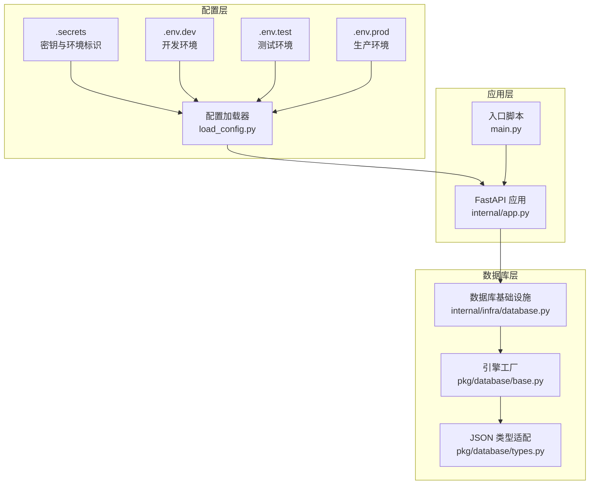
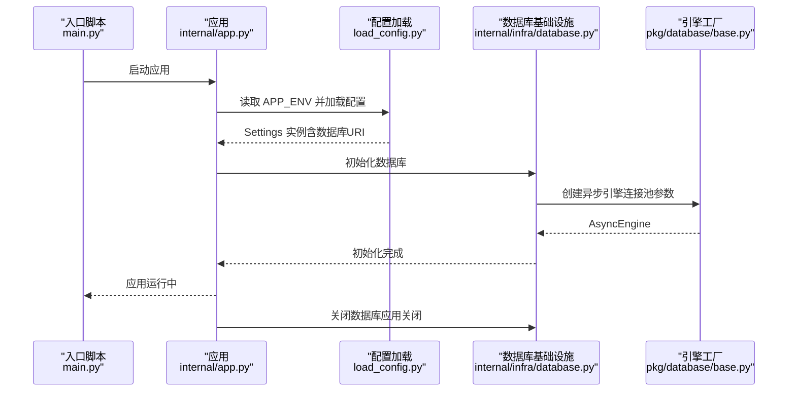
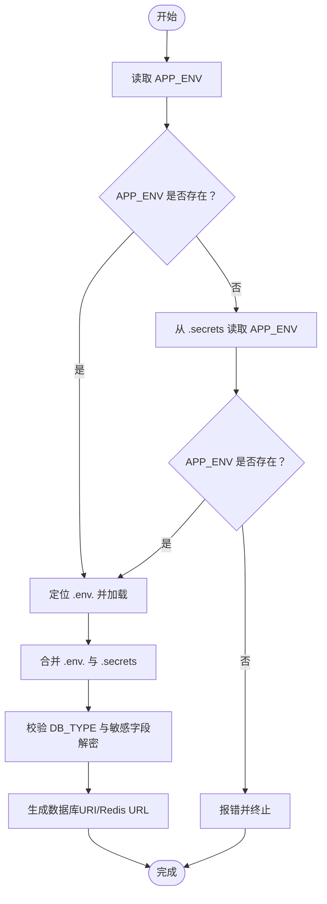
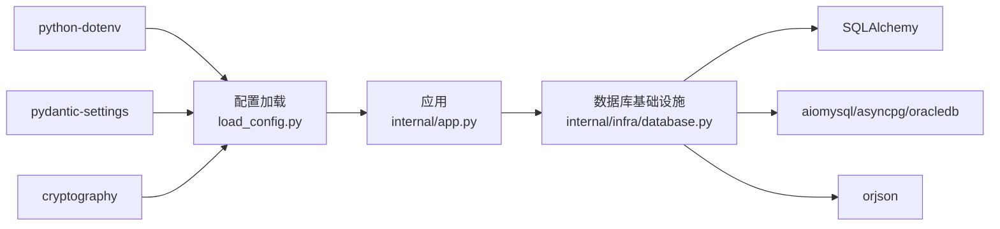

# 数据库配置

<cite>
**本文引用的文件**
- [internal/config/load_config.py](file://internal/config/load_config.py)
- [configs/.env.dev](file://configs/.env.dev)
- [configs/.env.test](file://configs/.env.test)
- [configs/.env.prod](file://configs/.env.prod)
- [configs/.secrets.example](file://configs/.secrets.example)
- [internal/infra/database.py](file://internal/infra/database.py)
- [pkg/database/base.py](file://pkg/database/base.py)
- [pkg/database/types.py](file://pkg/database/types.py)
- [pkg/toolkit/config_loader.py](file://pkg/toolkit/config_loader.py)
- [pyproject.toml](file://pyproject.toml)
- [internal/app.py](file://internal/app.py)
- [main.py](file://main.py)
</cite>

## 目录
1. [简介](#简介)
2. [项目结构](#项目结构)
3. [核心组件](#核心组件)
4. [架构总览](#架构总览)
5. [详细组件分析](#详细组件分析)
6. [依赖关系分析](#依赖关系分析)
7. [性能考量](#性能考量)
8. [故障排除指南](#故障排除指南)
9. [结论](#结论)
10. [附录](#附录)

## 简介
本文件系统化地文档化了本项目的数据库配置体系，涵盖以下方面：
- 数据库连接配置与环境变量设置
- 配置加载机制与验证策略
- 多环境配置（开发、测试、生产）的实现与差异
- 数据库URI的构造方式与参数配置（连接池、超时、回收策略）
- 故障排除与连接失败处理建议

目标是帮助开发者快速理解并正确配置数据库，同时在多环境下稳定运行。

## 项目结构
与数据库配置相关的关键目录与文件如下：
- 配置文件：configs 目录下的 .secrets 与 .env.* 文件
- 配置加载与校验：internal/config/load_config.py
- 数据库引擎与连接池：internal/infra/database.py、pkg/database/base.py
- JSON 类型与数据库兼容：pkg/database/types.py
- 通用配置加载工具：pkg/toolkit/config_loader.py
- 依赖声明：pyproject.toml
- 应用生命周期与初始化：internal/app.py、main.py

图表来源
- [internal/config/load_config.py](file://internal/config/load_config.py#L179-L242)
- [configs/.secrets.example](file://configs/.secrets.example#L6-L16)
- [configs/.env.dev](file://configs/.env.dev#L5-L12)
- [configs/.env.test](file://configs/.env.test#L5-L12)
- [configs/.env.prod](file://configs/.env.prod#L5-L12)
- [internal/app.py](file://internal/app.py#L84-L109)
- [internal/infra/database.py](file://internal/infra/database.py#L26-L56)
- [pkg/database/base.py](file://pkg/database/base.py#L19-L41)

章节来源
- [internal/config/load_config.py](file://internal/config/load_config.py#L179-L242)
- [configs/.secrets.example](file://configs/.secrets.example#L6-L16)
- [configs/.env.dev](file://configs/.env.dev#L5-L12)
- [configs/.env.test](file://configs/.env.test#L5-L12)
- [configs/.env.prod](file://configs/.env.prod#L5-L12)
- [internal/app.py](file://internal/app.py#L84-L109)
- [internal/infra/database.py](file://internal/infra/database.py#L26-L56)
- [pkg/database/base.py](file://pkg/database/base.py#L19-L41)

## 核心组件
- 配置模型与校验：基于 Pydantic Settings 的 Settings 类，负责加载 .env.* 与 .secrets，校验数据库类型，解密敏感字段，并生成数据库URI与Redis URL。
- 多环境配置：通过 APP_ENV 选择对应的 .env.* 文件，实现开发、测试、生产的差异化配置。
- 引擎与连接池：封装 SQLAlchemy 异步引擎创建，统一连接池参数与JSON序列化策略。
- JSON类型适配：跨数据库兼容的JSON类型，自动适配PostgreSQL/MySQL/Oracle/SQLite等方言。

章节来源
- [internal/config/load_config.py](file://internal/config/load_config.py#L46-L174)
- [internal/infra/database.py](file://internal/infra/database.py#L26-L56)
- [pkg/database/base.py](file://pkg/database/base.py#L19-L41)
- [pkg/database/types.py](file://pkg/database/types.py#L12-L146)

## 架构总览
数据库配置的总体流程如下：
- 应用启动时，读取 APP_ENV，定位 .env.* 文件
- 合并 .env.* 与 .secrets，构建 Settings 实例
- 依据 Settings 生成数据库URI与Redis URL
- 初始化数据库引擎与连接池，注册SQL事件监听
- 应用生命周期结束时，释放连接池资源

图表来源
- [main.py](file://main.py#L8-L17)
- [internal/app.py](file://internal/app.py#L84-L109)
- [internal/config/load_config.py](file://internal/config/load_config.py#L179-L242)
- [internal/infra/database.py](file://internal/infra/database.py#L26-L56)
- [pkg/database/base.py](file://pkg/database/base.py#L19-L41)

## 详细组件分析

### 配置加载与验证
- 环境选择：优先读取系统环境变量 APP_ENV，若未设置则从 .secrets 中读取。若两者均无，直接报错。
- 配置文件合并：按顺序加载 .env.<env> 与 .secrets，后者覆盖前者。
- 字段校验：
  - DB_TYPE 必填且必须为 mysql、postgresql、oracle 之一
  - 敏感字段（如 DB_PASSWORD、REDIS_PASSWORD）支持 ENC(...) 形式的加密值，使用 AES_SECRET 解密
- 数据库URI生成：
  - MySQL：使用 aiomysql 驱动，附加 charset=utf8mb4 查询参数
  - PostgreSQL：使用 asyncpg 驱动
  - Oracle：使用 oracledb 驱动，支持 service_name 参数
- Redis URL 生成：基于 REDIS_* 字段拼装

图表来源
- [internal/config/load_config.py](file://internal/config/load_config.py#L179-L242)
- [configs/.secrets.example](file://configs/.secrets.example#L6-L16)
- [configs/.env.dev](file://configs/.env.dev#L5-L12)
- [configs/.env.test](file://configs/.env.test#L5-L12)
- [configs/.env.prod](file://configs/.env.prod#L5-L12)

章节来源
- [internal/config/load_config.py](file://internal/config/load_config.py#L46-L174)
- [configs/.secrets.example](file://configs/.secrets.example#L6-L16)
- [configs/.env.dev](file://configs/.env.dev#L5-L12)
- [configs/.env.test](file://configs/.env.test#L5-L12)
- [configs/.env.prod](file://configs/.env.prod#L5-L12)

### 数据库URI构造与参数
- 驱动映射：mysql->aiomysql，postgresql->asyncpg，oracle->oracledb
- MySQL：附加 charset=utf8mb4
- Oracle：支持 service_name，密码进行URL转义
- 通用参数：echo、pool_pre_ping、pool_size、max_overflow、pool_timeout、pool_recycle、JSON序列化

章节来源
- [internal/config/load_config.py](file://internal/config/load_config.py#L118-L173)
- [internal/infra/database.py](file://internal/infra/database.py#L39-L49)
- [pkg/database/base.py](file://pkg/database/base.py#L19-L41)

### 连接池与超时回收策略
- 连接池参数（默认值）：
  - pool_pre_ping：连接复用前进行健康检查
  - pool_size：连接池大小
  - max_overflow：溢出连接数
  - pool_timeout：获取连接的超时时间
  - pool_recycle：连接回收时间
- JSON序列化：统一使用 orjson 的 dumps/load，提升性能与一致性

章节来源
- [internal/infra/database.py](file://internal/infra/database.py#L39-L49)
- [pkg/database/base.py](file://pkg/database/base.py#L19-L41)

### 多环境配置实现
- 环境文件：
  - .env.dev：开发环境
  - .env.test：测试环境
  - .env.prod：生产环境
- 共同点：均包含 DB_TYPE、DB_HOST、DB_PORT、DB_USERNAME、DB_PASSWORD、DB_DATABASE 等数据库配置项
- 差异点：DB_DATABASE 名称不同，以区分不同环境的数据集
- 密钥与环境标识：通过 .secrets 控制 APP_ENV、AES_SECRET、JWT_SECRET、ECHO_CONFIG 等

章节来源
- [configs/.env.dev](file://configs/.env.dev#L5-L12)
- [configs/.env.test](file://configs/.env.test#L5-L12)
- [configs/.env.prod](file://configs/.env.prod#L5-L12)
- [configs/.secrets.example](file://configs/.secrets.example#L6-L16)

### 配置加载机制与验证方法
- 机制：
  - 通过 get_settings() 读取 APP_ENV，定位 .env.<env> 并加载
  - 使用 Settings 模型进行字段类型与取值校验
  - 支持敏感字段解密（ENC(...)）
- 验证：
  - DB_TYPE 必须为允许值之一
  - 缺失或非法配置会触发错误
  - 可通过 ECHO_CONFIG 输出配置详情（调试用）

章节来源
- [internal/config/load_config.py](file://internal/config/load_config.py#L179-L242)
- [internal/config/load_config.py](file://internal/config/load_config.py#L86-L116)

### JSON类型与数据库兼容
- 自动适配：
  - PostgreSQL：JSONB
  - MySQL：JSON
  - SQLite：JSON（方言）
  - Oracle：JSON（21c+）或CLOB（12c-20c，需禁用原生JSON）
- 序列化策略：在非原生JSON方言下使用 orjson 进行序列化/反序列化
- 变更追踪：通过 MutableJSON 与 JSONType 结合，实现对dict/list的变更感知

章节来源
- [pkg/database/types.py](file://pkg/database/types.py#L12-L146)

### 应用生命周期中的数据库初始化
- 初始化：在应用 lifespan 的 startup 阶段调用 init_async_db()，创建引擎、注册SQL事件监听、创建SessionMaker
- 关闭：在 lifespan 的 shutdown 阶段调用 close_async_db()，释放连接池
- 入口：main.py 启动 uvicorn 服务，间接触发应用生命周期

章节来源
- [internal/app.py](file://internal/app.py#L84-L109)
- [internal/infra/database.py](file://internal/infra/database.py#L26-L66)
- [main.py](file://main.py#L8-L17)

## 依赖关系分析
- 配置层依赖：
  - python-dotenv：加载 .env 文件
  - pydantic-settings：配置模型与加载
  - cryptography：AES解密
- 数据库层依赖：
  - SQLAlchemy：异步引擎与ORM
  - aiomysql/asyncpg/oracledb：数据库驱动
  - orjson：高性能JSON序列化
- 应用层依赖：
  - FastAPI、Uvicorn：应用框架与服务器

图表来源
- [pyproject.toml](file://pyproject.toml#L9-L70)
- [internal/config/load_config.py](file://internal/config/load_config.py#L1-L12)
- [internal/infra/database.py](file://internal/infra/database.py#L1-L16)

章节来源
- [pyproject.toml](file://pyproject.toml#L9-L70)
- [internal/config/load_config.py](file://internal/config/load_config.py#L1-L12)
- [internal/infra/database.py](file://internal/infra/database.py#L1-L16)

## 性能考量
- 连接池参数建议：
  - pool_size：根据并发请求数与数据库承载能力评估
  - max_overflow：控制突发流量的溢出连接数量
  - pool_timeout：避免长时间阻塞等待连接
  - pool_recycle：定期回收连接，降低长连接失效风险
- JSON序列化：统一使用 orjson，减少序列化开销
- SQL监控：通过事件监听记录慢查询，便于优化

章节来源
- [internal/infra/database.py](file://internal/infra/database.py#L39-L49)
- [pkg/database/base.py](file://pkg/database/base.py#L19-L41)

## 故障排除指南
- 配置缺失或错误
  - 症状：启动时报错，提示缺少 .secrets、APP_ENV 未找到或 .env.<env> 不存在
  - 处理：确认 .secrets 与 .env.<env> 文件存在，APP_ENV 设置正确
- 数据库类型不支持
  - 症状：DB_TYPE 非 mysql/postgresql/oracle
  - 处理：修正 DB_TYPE 为允许值之一
- 敏感字段解密失败
  - 症状：ENC(...) 格式解密报错
  - 处理：检查 AES_SECRET 是否正确，确认 ENC(...) 内容格式
- 连接池相关问题
  - 症状：连接超时、连接不足
  - 处理：调整 pool_size、max_overflow、pool_timeout；结合 pool_recycle 与 pool_pre_ping
- SQL性能问题
  - 症状：慢查询频繁
  - 处理：利用SQL事件监听输出的慢查询日志，定位并优化

章节来源
- [internal/config/load_config.py](file://internal/config/load_config.py#L179-L242)
- [internal/config/load_config.py](file://internal/config/load_config.py#L97-L116)
- [internal/infra/database.py](file://internal/infra/database.py#L116-L154)

## 结论
本项目的数据库配置采用“环境文件 + 密钥文件”的双层配置策略，配合严格的字段校验与敏感字段解密机制，实现了在多环境下的安全、可控与可维护的配置管理。通过统一的引擎工厂与连接池参数，保证了数据库连接的稳定性与性能。建议在生产环境中严格管理 .secrets，合理设置连接池参数，并结合慢查询日志持续优化数据库性能。

## 附录

### 环境变量与配置项清单
- 环境标识与密钥
  - APP_ENV：local/dev/test/prod
  - AES_SECRET：AES解密密钥
  - JWT_SECRET：JWT签名密钥
  - JWT_ALGORITHM：JWT算法
  - ACCESS_TOKEN_EXPIRE_MINUTES：访问令牌过期分钟数
  - ECHO_CONFIG：是否输出配置详情（调试用）
- 数据库配置
  - DB_TYPE：数据库类型（mysql/postgresql/oracle）
  - DB_HOST：主机地址
  - DB_PORT：端口
  - DB_USERNAME：用户名
  - DB_PASSWORD：密码（支持 ENC(...)）
  - DB_DATABASE：数据库名
  - DB_SERVICE_NAME：Oracle 专用服务名
- Redis配置
  - REDIS_HOST：主机地址
  - REDIS_PORT：端口
  - REDIS_PASSWORD：密码（支持 ENC(...)）
  - REDIS_DB：数据库编号

章节来源
- [configs/.secrets.example](file://configs/.secrets.example#L6-L16)
- [configs/.env.dev](file://configs/.env.dev#L5-L12)
- [configs/.env.test](file://configs/.env.test#L5-L12)
- [configs/.env.prod](file://configs/.env.prod#L5-L12)