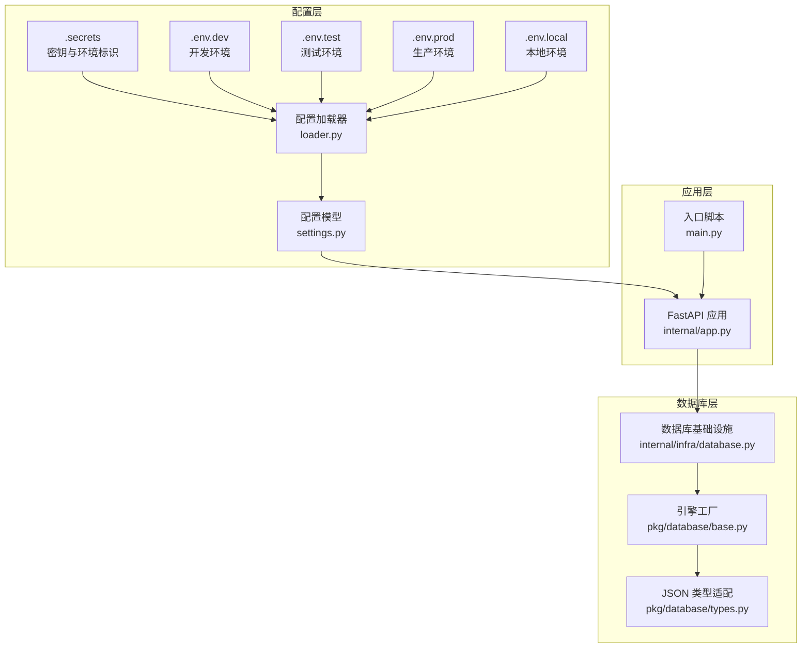
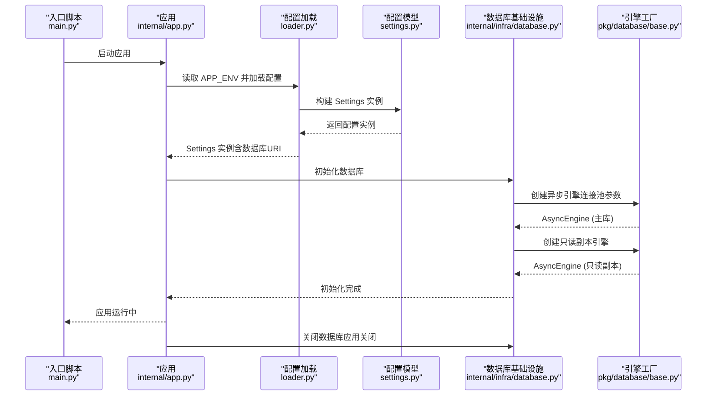
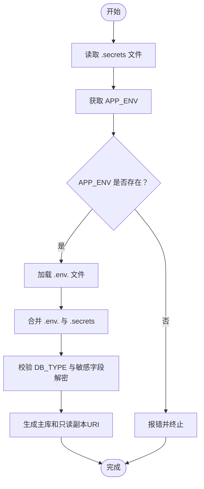
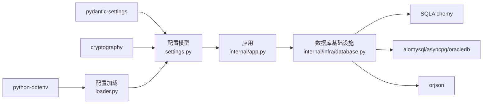

# 数据库配置

<cite>
**本文引用的文件**
- [internal/config/settings.py](file://internal/config/settings.py)
- [internal/config/loader.py](file://internal/config/loader.py)
- [configs/.env.dev](file://configs/.env.dev)
- [configs/.env.test](file://configs/.env.test)
- [configs/.env.prod](file://configs/.env.prod)
- [configs/.env.local](file://configs/.env.local)
- [configs/.secrets.example](file://configs/.secrets.example)
- [internal/infra/database.py](file://internal/infra/database.py)
- [pkg/database/base.py](file://pkg/database/base.py)
- [pkg/database/types.py](file://pkg/database/types.py)
- [internal/app.py](file://internal/app.py)
- [main.py](file://main.py)
</cite>

## 更新摘要
**所做更改**
- 新增读写分离配置章节，详细说明DB_READ_*系列配置字段
- 更新数据库连接配置，包含主库和只读副本的独立配置
- 添加读写分离的连接池参数和优雅降级机制
- 更新配置加载机制，支持读写分离的URI生成
- 新增读写分离的最佳实践和故障排除指南

## 目录
1. [简介](#简介)
2. [项目结构](#项目结构)
3. [核心组件](#核心组件)
4. [架构总览](#架构总览)
5. [详细组件分析](#详细组件分析)
6. [依赖关系分析](#依赖关系分析)
7. [性能考量](#性能考量)
8. [故障排除指南](#故障排除指南)
9. [结论](#结论)
10. [附录](#附录)

## 简介
本文件系统化地文档化了本项目的数据库配置体系，涵盖以下方面：
- 数据库连接配置与环境变量设置
- 读写分离配置与多环境配置实现
- 配置加载机制与验证策略
- 数据库URI的构造方式与参数配置（连接池、超时、回收策略）
- 故障排除与连接失败处理建议

目标是帮助开发者快速理解并正确配置数据库，同时在多环境下稳定运行，特别是支持读写分离的高级配置场景。

## 项目结构
与数据库配置相关的关键目录与文件如下：
- 配置文件：configs 目录下的 .secrets 与 .env.* 文件
- 配置加载与校验：internal/config/settings.py、internal/config/loader.py
- 数据库引擎与连接池：internal/infra/database.py、pkg/database/base.py
- JSON 类型与数据库兼容：pkg/database/types.py
- 应用生命周期与初始化：internal/app.py、main.py

```mermaid
graph TB
subgraph "配置层"
SECRETS[".secrets<br/>密钥与环境标识"]
ENV_DEV[".env.dev<br/>开发环境"]
ENV_TEST[".env.test<br/>测试环境"]
ENV_PROD[".env.prod<br/>生产环境"]
ENV_LOCAL[".env.local<br/>本地环境"]
SETTINGS["配置模型<br/>settings.py"]
LOADER["配置加载器<br/>loader.py"]
end
subgraph "应用层"
APP["FastAPI 应用<br/>internal/app.py"]
MAIN["入口脚本<br/>main.py"]
end
subgraph "数据库层"
INFRA_DB["数据库基础设施<br/>internal/infra/database.py"]
BASE_ENGINE["引擎工厂<br/>pkg/database/base.py"]
TYPES["JSON 类型适配<br/>pkg/database/types.py"]
end
SECRETS --> LOADER
ENV_DEV --> LOADER
ENV_TEST --> LOADER
ENV_PROD --> LOADER
ENV_LOCAL --> LOADER
LOADER --> SETTINGS
SETTINGS --> APP
APP --> INFRA_DB
INFRA_DB --> BASE_ENGINE
BASE_ENGINE --> TYPES
MAIN --> APP
```

**图表来源**
- [internal/config/settings.py](file://internal/config/settings.py#L27-L77)
- [internal/config/loader.py](file://internal/config/loader.py#L79-L132)
- [configs/.env.dev](file://configs/.env.dev#L1-L22)
- [configs/.env.test](file://configs/.env.test#L1-L22)
- [configs/.env.prod](file://configs/.env.prod#L1-L22)
- [configs/.env.local](file://configs/.env.local#L1-L22)
- [internal/app.py](file://internal/app.py#L80-L107)
- [internal/infra/database.py](file://internal/infra/database.py#L30-L86)
- [pkg/database/base.py](file://pkg/database/base.py#L19-L41)

## 核心组件
- 配置模型与校验：基于 Pydantic Settings 的 Settings 类，负责加载 .env.* 与 .secrets，校验数据库类型，解密敏感字段，并生成数据库URI与Redis URL。
- 读写分离配置：支持独立的DB_READ_*配置字段，实现主库写入和只读副本查询的分离。
- 多环境配置：通过 APP_ENV 选择对应的 .env.* 文件，实现开发、测试、生产和本地环境的差异化配置。
- 引擎与连接池：封装 SQLAlchemy 异步引擎创建，统一连接池参数与JSON序列化策略。
- JSON类型适配：跨数据库兼容的JSON类型，自动适配PostgreSQL/MySQL/Oracle/SQLite等方言。

**章节来源**
- [internal/config/settings.py](file://internal/config/settings.py#L27-L77)
- [internal/config/settings.py](file://internal/config/settings.py#L59-L66)
- [internal/infra/database.py](file://internal/infra/database.py#L30-L86)
- [pkg/database/base.py](file://pkg/database/base.py#L19-L41)
- [pkg/database/types.py](file://pkg/database/types.py#L12-L146)

## 架构总览
数据库配置的总体流程如下：
- 应用启动时，读取 APP_ENV，定位 .env.* 文件
- 合并 .env.* 与 .secrets，构建 Settings 实例
- 依据 Settings 生成主库和只读副本的数据库URI
- 初始化数据库引擎与连接池，注册SQL事件监听
- 应用生命周期结束时，释放连接池资源

```mermaid
sequenceDiagram
participant Main as "入口脚本<br/>main.py"
participant App as "应用<br/>internal/app.py"
participant Cfg as "配置加载<br/>loader.py"
participant Settings as "配置模型<br/>settings.py"
participant DBInfra as "数据库基础设施<br/>internal/infra/database.py"
participant Engine as "引擎工厂<br/>pkg/database/base.py"
Main->>App : 启动应用
App->>Cfg : 读取 APP_ENV 并加载配置
Cfg->>Settings : 构建 Settings 实例
Settings-->>Cfg : 返回配置实例
Cfg-->>App : Settings 实例含数据库URI
App->>DBInfra : 初始化数据库
DBInfra->>Engine : 创建异步引擎连接池参数
Engine-->>DBInfra : AsyncEngine (主库)
DBInfra->>Engine : 创建只读副本引擎
Engine-->>DBInfra : AsyncEngine (只读副本)
DBInfra-->>App : 初始化完成
App-->>Main : 应用运行中
App->>DBInfra : 关闭数据库应用关闭
```

**图表来源**
- [main.py](file://main.py#L8-L17)
- [internal/app.py](file://internal/app.py#L80-L107)
- [internal/config/loader.py](file://internal/config/loader.py#L79-L132)
- [internal/config/settings.py](file://internal/config/settings.py#L113-L214)
- [internal/infra/database.py](file://internal/infra/database.py#L30-L86)
- [pkg/database/base.py](file://pkg/database/base.py#L19-L41)

## 详细组件分析

### 配置加载与验证
- 环境选择：优先读取 .secrets 文件中的 APP_ENV，若未设置则从 .secrets 中读取。若两者均无，直接报错。
- 配置文件合并：按顺序加载 .env.<env> 与 .secrets，后者覆盖前者。
- 字段校验：
  - DB_TYPE 必填且必须为 mysql、postgresql、oracle 之一
  - 敏感字段（如 DB_PASSWORD、DB_READ_PASSWORD、REDIS_PASSWORD）支持 ENC(...) 形式的加密值，使用 AES_SECRET 解密
- 数据库URI生成：
  - MySQL：使用 aiomysql 驱动，附加 charset=utf8mb4 查询参数
  - PostgreSQL：使用 asyncpg 驱动
  - Oracle：使用 oracledb 驱动，支持 service_name 参数
- Redis URL 生成：基于 REDIS_* 字段拼装

```mermaid
flowchart TD
Start(["开始"]) --> ReadSecrets["读取 .secrets 文件"]
ReadSecrets --> GetEnv["获取 APP_ENV"]
GetEnv --> EnvFound{"APP_ENV 是否存在？"}
EnvFound -- "否" --> Error["报错并终止"]
EnvFound -- "是" --> LoadEnvFile["加载 .env.<env> 文件"]
LoadEnvFile --> Merge["合并 .env.<env> 与 .secrets"]
Merge --> Validate["校验 DB_TYPE 与敏感字段解密"]
Validate --> BuildURIs["生成主库和只读副本URI"]
BuildURIs --> Done(["完成"])
Error --> Done
```

**图表来源**
- [internal/config/loader.py](file://internal/config/loader.py#L27-L48)
- [internal/config/loader.py](file://internal/config/loader.py#L79-L132)
- [internal/config/settings.py](file://internal/config/settings.py#L79-L111)

**章节来源**
- [internal/config/loader.py](file://internal/config/loader.py#L27-L48)
- [internal/config/loader.py](file://internal/config/loader.py#L79-L132)
- [internal/config/settings.py](file://internal/config/settings.py#L79-L111)
- [configs/.secrets.example](file://configs/.secrets.example#L6-L16)
- [configs/.env.dev](file://configs/.env.dev#L6-L14)
- [configs/.env.test](file://configs/.env.test#L6-L14)
- [configs/.env.prod](file://configs/.env.prod#L6-L14)
- [configs/.env.local](file://configs/.env.local#L6-L14)

### 读写分离配置
- 读写分离配置字段：
  - DB_READ_HOST：只读副本主机地址（可选）
  - DB_READ_PORT：只读副本端口（可选，默认继承主库）
  - DB_READ_USERNAME：只读副本用户名（可选，默认继承主库）
  - DB_READ_PASSWORD：只读副本密码（可选，默认继承主库）
  - DB_READ_DATABASE：只读副本数据库名（可选，默认继承主库）
  - DB_READ_SERVICE_NAME：Oracle 专用只读副本服务名（可选，默认继承主库）
- 配置继承规则：未设置的读库字段自动回退到主库对应字段
- 优雅降级：当 DB_READ_HOST 未设置时，读操作自动降级到主库

**章节来源**
- [internal/config/settings.py](file://internal/config/settings.py#L59-L66)
- [internal/config/settings.py](file://internal/config/settings.py#L156-L214)
- [internal/infra/database.py](file://internal/infra/database.py#L68-L86)
- [internal/infra/database.py](file://internal/infra/database.py#L150-L178)

### 数据库URI构造与参数
- 驱动映射：mysql->aiomysql，postgresql->asyncpg，oracle->oracledb
- 主库URI生成：基于 DB_* 字段生成主库连接字符串
- 只读副本URI生成：基于 DB_READ_* 字段生成只读副本连接字符串，未设置字段回退到主库
- MySQL：附加 charset=utf8mb4
- Oracle：支持 service_name，密码进行URL转义
- 通用参数：echo、pool_pre_ping、pool_size、max_overflow、pool_timeout、pool_recycle、JSON序列化

**章节来源**
- [internal/config/settings.py](file://internal/config/settings.py#L19-L24)
- [internal/config/settings.py](file://internal/config/settings.py#L113-L154)
- [internal/config/settings.py](file://internal/config/settings.py#L156-L214)
- [internal/infra/database.py](file://internal/infra/database.py#L48-L85)
- [pkg/database/base.py](file://pkg/database/base.py#L19-L41)

### 连接池与超时回收策略
- 连接池参数（默认值）：
  - pool_pre_ping：连接复用前进行健康检查
  - pool_size：连接池大小（主库10，只读副本20）
  - max_overflow：溢出连接数（主库20，只读副本30）
  - pool_timeout：获取连接的超时时间
  - pool_recycle：连接回收时间
- JSON序列化：统一使用 orjson 的 dumps/load，提升性能与一致性
- 读写分离连接池：只读副本连接池通常设置更大的 pool_size 以承载更多查询负载

**章节来源**
- [internal/infra/database.py](file://internal/infra/database.py#L48-L85)
- [pkg/database/base.py](file://pkg/database/base.py#L19-L41)

### 多环境配置实现
- 环境文件：
  - .env.dev：开发环境
  - .env.test：测试环境
  - .env.prod：生产环境
  - .env.local：本地环境
- 共同点：均包含 DB_TYPE、DB_HOST、DB_PORT、DB_USERNAME、DB_PASSWORD、DB_DATABASE 等数据库配置项
- 差异点：DB_DATABASE 名称不同，以区分不同环境的数据集
- 读写分离：可在任意环境文件中配置 DB_READ_* 字段实现读写分离
- 密钥与环境标识：通过 .secrets 控制 APP_ENV、AES_SECRET、JWT_SECRET、ECHO_CONFIG 等

**章节来源**
- [configs/.env.dev](file://configs/.env.dev#L6-L14)
- [configs/.env.test](file://configs/.env.test#L6-L14)
- [configs/.env.prod](file://configs/.env.prod#L6-L14)
- [configs/.env.local](file://configs/.env.local#L6-L14)
- [configs/.secrets.example](file://configs/.secrets.example#L6-L16)

### 配置加载机制与验证方法
- 机制：
  - 通过 detect_app_env() 读取 .secrets 文件中的 APP_ENV，定位 .env.<env> 并加载
  - 使用 Settings 模型进行字段类型与取值校验
  - 支持敏感字段解密（ENC(...)）
- 验证：
  - DB_TYPE 必须为允许值之一
  - 缺失或非法配置会触发错误
  - 可通过 ECHO_CONFIG 输出配置详情（调试用）
- 读写分离验证：DB_READ_HOST 为空时不启用读写分离功能

**章节来源**
- [internal/config/loader.py](file://internal/config/loader.py#L27-L48)
- [internal/config/loader.py](file://internal/config/loader.py#L79-L132)
- [internal/config/settings.py](file://internal/config/settings.py#L79-L111)
- [internal/config/settings.py](file://internal/config/settings.py#L156-L214)

### JSON类型与数据库兼容
- 自动适配：
  - PostgreSQL：JSONB
  - MySQL：JSON
  - SQLite：JSON（方言）
  - Oracle：JSON（21c+）或CLOB（12c-20c，需禁用原生JSON）
- 序列化策略：在非原生JSON方言下使用 orjson 进行序列化/反序列化
- 变更追踪：通过 MutableJSON 与 JSONType 结合，实现对dict/list的变更感知

**章节来源**
- [pkg/database/types.py](file://pkg/database/types.py#L12-L146)

### 应用生命周期中的数据库初始化
- 初始化：在应用 lifespan 的 startup 阶段调用 init_async_db()，创建引擎、注册SQL事件监听、创建SessionMaker
- 读写分离：当检测到 DB_READ_HOST 配置时，同时创建只读副本引擎和SessionMaker
- 关闭：在 lifespan 的 shutdown 阶段调用 close_async_db()，释放主库和只读副本连接池
- 入口：main.py 启动 uvicorn 服务，间接触发应用生命周期

**章节来源**
- [internal/app.py](file://internal/app.py#L80-L107)
- [internal/infra/database.py](file://internal/infra/database.py#L30-L102)
- [main.py](file://main.py#L8-L17)

## 依赖关系分析
- 配置层依赖：
  - python-dotenv：加载 .env 文件
  - pydantic-settings：配置模型与加载
  - cryptography：AES解密
- 数据库层依赖：
  - SQLAlchemy：异步引擎与ORM
  - aiomysql/asyncpg/oracledb：数据库驱动
  - orjson：高性能JSON序列化
- 应用层依赖：
  - FastAPI、Uvicorn：应用框架与服务器

```mermaid
graph LR
DOTENV["python-dotenv"] --> LOADER["配置加载<br/>loader.py"]
PYSET["pydantic-settings"] --> SETTINGS["配置模型<br/>settings.py"]
CRYPTO["cryptography"] --> SETTINGS
LOADER --> SETTINGS
SETTINGS --> APP["应用<br/>internal/app.py"]
APP --> DBINFRA["数据库基础设施<br/>internal/infra/database.py"]
DBINFRA --> SQLA["SQLAlchemy"]
DBINFRA --> DRIVERS["aiomysql/asyncpg/oracledb"]
DBINFRA --> ORJSON["orjson"]
```

**图表来源**
- [internal/config/loader.py](file://internal/config/loader.py#L1-L165)
- [internal/config/settings.py](file://internal/config/settings.py#L1-L228)
- [internal/infra/database.py](file://internal/infra/database.py#L1-L221)

**章节来源**
- [internal/config/loader.py](file://internal/config/loader.py#L1-L165)
- [internal/config/settings.py](file://internal/config/settings.py#L1-L228)
- [internal/infra/database.py](file://internal/infra/database.py#L1-L221)

## 性能考量
- 连接池参数建议：
  - 主库 pool_size：根据并发请求数与数据库承载能力评估
  - 只读副本 pool_size：通常设置为主库的2倍，以承载更多查询负载
  - max_overflow：控制突发流量的溢出连接数量
  - pool_timeout：避免长时间阻塞等待连接
  - pool_recycle：定期回收连接，降低长连接失效风险
- 读写分离性能：
  - 读操作分流到只读副本，减轻主库写入压力
  - 只读副本连接池应配置更大的容量
  - 读写分离可显著提升读密集型应用的性能
- JSON序列化：统一使用 orjson，减少序列化开销
- SQL监控：通过事件监听记录慢查询，便于优化

**章节来源**
- [internal/infra/database.py](file://internal/infra/database.py#L48-L85)
- [pkg/database/base.py](file://pkg/database/base.py#L19-L41)

## 故障排除指南
- 配置缺失或错误
  - 症状：启动时报错，提示缺少 .secrets、APP_ENV 未找到或 .env.<env> 不存在
  - 处理：确认 .secrets 与 .env.<env> 文件存在，APP_ENV 设置正确
- 数据库类型不支持
  - 症状：DB_TYPE 非 mysql/postgresql/oracle
  - 处理：修正 DB_TYPE 为允许值之一
- 敏感字段解密失败
  - 症状：ENC(...) 格式解密报错
  - 处理：检查 AES_SECRET 是否正确，确认 ENC(...) 内容格式
- 读写分离配置问题
  - 症状：只读副本无法连接或读操作仍走主库
  - 处理：确认 DB_READ_HOST 已设置，检查只读副本连接参数，验证只读副本可达性
- 连接池相关问题
  - 症状：连接超时、连接不足
  - 处理：调整主库和只读副本的 pool_size、max_overflow、pool_timeout；结合 pool_recycle 与 pool_pre_ping
- SQL性能问题
  - 症状：慢查询频繁
  - 处理：利用SQL事件监听输出的慢查询日志，定位并优化

**章节来源**
- [internal/config/loader.py](file://internal/config/loader.py#L91-L132)
- [internal/config/settings.py](file://internal/config/settings.py#L79-L111)
- [internal/infra/database.py](file://internal/infra/database.py#L183-L221)

## 结论
本项目的数据库配置采用"环境文件 + 密钥文件"的双层配置策略，配合严格的字段校验与敏感字段解密机制，实现了在多环境下的安全、可控与可维护的配置管理。通过统一的引擎工厂与连接池参数，保证了数据库连接的稳定性与性能。新增的读写分离功能进一步提升了系统的扩展性和性能表现，建议在生产环境中严格管理 .secrets，合理设置连接池参数，并结合慢查询日志持续优化数据库性能。

## 附录

### 环境变量与配置项清单
- 环境标识与密钥
  - APP_ENV：local/dev/test/prod
  - AES_SECRET：AES解密密钥
  - JWT_SECRET：JWT签名密钥
  - JWT_ALGORITHM：JWT算法
  - ACCESS_TOKEN_EXPIRE_MINUTES：访问令牌过期分钟数
  - ECHO_CONFIG：是否输出配置详情（调试用）
- 数据库配置
  - DB_TYPE：数据库类型（mysql/postgresql/oracle）
  - DB_HOST：主机地址
  - DB_PORT：端口
  - DB_USERNAME：用户名
  - DB_PASSWORD：密码（支持 ENC(...)）
  - DB_DATABASE：数据库名
  - DB_SERVICE_NAME：Oracle 专用服务名
  - DB_ECHO：是否输出 SQL 日志
- 读写分离配置（可选）
  - DB_READ_HOST：只读副本主机地址
  - DB_READ_PORT：只读副本端口（可选）
  - DB_READ_USERNAME：只读副本用户名（可选）
  - DB_READ_PASSWORD：只读副本密码（支持 ENC(...)）
  - DB_READ_DATABASE：只读副本数据库名（可选）
  - DB_READ_SERVICE_NAME：Oracle 专用只读副本服务名（可选）
- Redis配置
  - REDIS_HOST：主机地址
  - REDIS_PORT：端口
  - REDIS_PASSWORD：密码（支持 ENC(...)）
  - REDIS_DB：数据库编号

**章节来源**
- [configs/.secrets.example](file://configs/.secrets.example#L6-L16)
- [configs/.env.dev](file://configs/.env.dev#L6-L22)
- [configs/.env.test](file://configs/.env.test#L6-L22)
- [configs/.env.prod](file://configs/.env.prod#L6-L22)
- [configs/.env.local](file://configs/.env.local#L6-L22)
- [internal/config/settings.py](file://internal/config/settings.py#L49-L76)
- [internal/config/settings.py](file://internal/config/settings.py#L59-L66)

### 读写分离最佳实践
- 配置建议：
  - 为主库和只读副本分别设置独立的连接池参数
  - 只读副本的 pool_size 通常为主库的2倍
  - 确保只读副本的数据同步延迟在可接受范围内
- 使用建议：
  - 写操作使用主库连接（get_session）
  - 读操作使用只读副本连接（get_read_session），自动降级到主库
  - 对于强一致性的读操作，考虑直接使用主库连接
- 监控建议：
  - 分别监控主库和只读副本的连接池使用率
  - 监控读写分离的查询分布情况
  - 关注只读副本的数据同步延迟指标

**章节来源**
- [internal/infra/database.py](file://internal/infra/database.py#L150-L178)
- [internal/infra/database.py](file://internal/infra/database.py#L68-L86)
- [internal/config/settings.py](file://internal/config/settings.py#L156-L214)