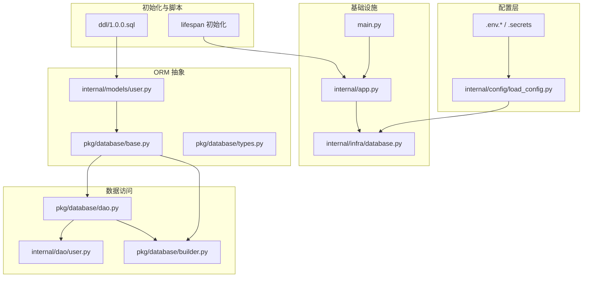
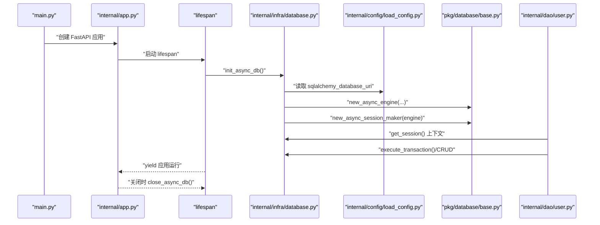
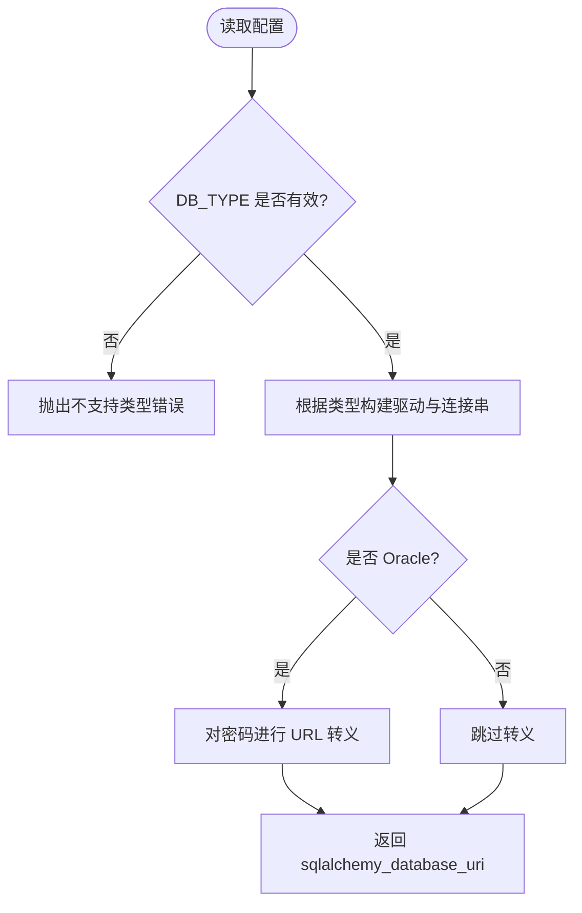
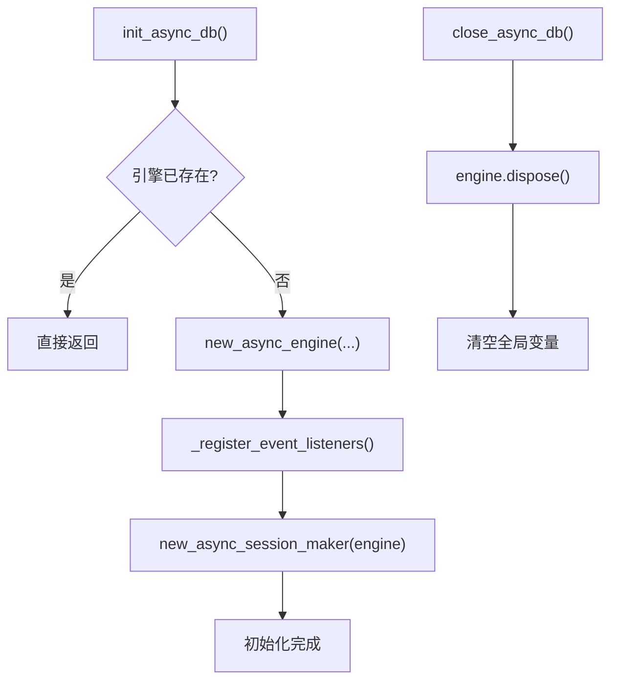
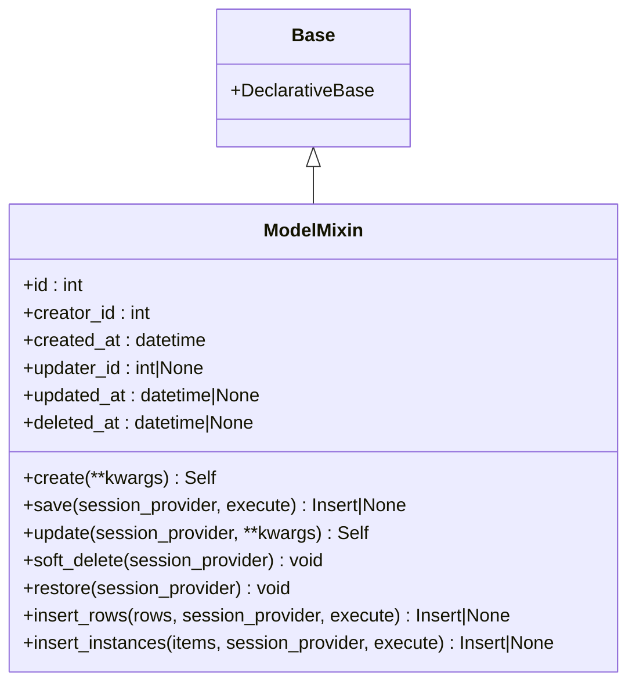
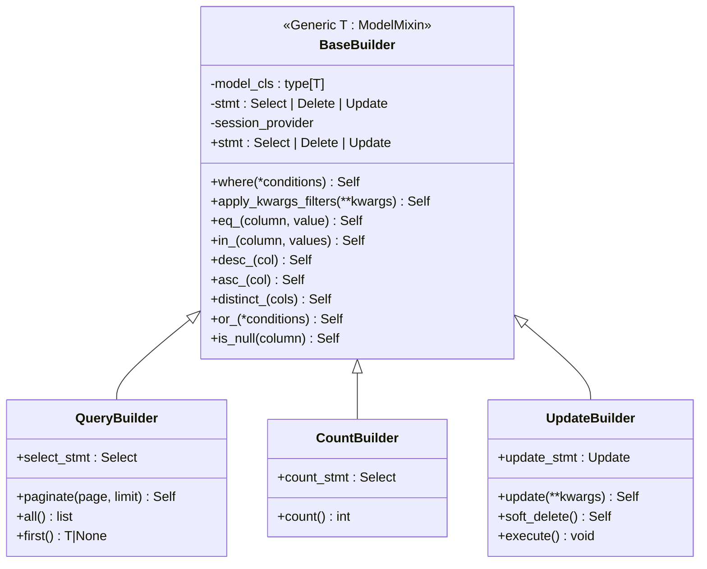
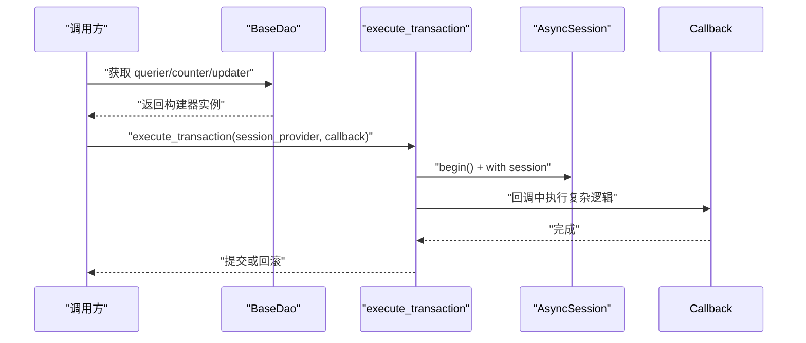

# 数据库集成

<cite>
**本文引用的文件**
- [internal/infra/database.py](file://internal/infra/database.py)
- [pkg/database/base.py](file://pkg/database/base.py)
- [pkg/database/builder.py](file://pkg/database/builder.py)
- [pkg/database/dao.py](file://pkg/database/dao.py)
- [pkg/database/types.py](file://pkg/database/types.py)
- [internal/config/load_config.py](file://internal/config/load_config.py)
- [internal/models/user.py](file://internal/models/user.py)
- [internal/dao/user.py](file://internal/dao/user.py)
- [internal/app.py](file://internal/app.py)
- [main.py](file://main.py)
- [ddl/1.0.0.sql](file://ddl/1.0.0.sql)
- [configs/.env.dev](file://configs/.env.dev)
- [configs/.secrets](file://configs/.secrets)
- [tests/orm/test_orm.py](file://tests/orm/test_orm.py)
</cite>

## 目录
1. [简介](#简介)
2. [项目结构](#项目结构)
3. [核心组件](#核心组件)
4. [架构总览](#架构总览)
5. [组件详解](#组件详解)
6. [依赖关系分析](#依赖关系分析)
7. [性能与优化](#性能与优化)
8. [故障排查指南](#故障排查指南)
9. [结论](#结论)
10. [附录](#附录)

## 简介
本文件系统化梳理本项目的数据库集成方案，涵盖配置与连接池管理、多数据库支持、数据库抽象层设计（适配器模式）、SQLAlchemy Async ORM 使用与配置、DDL 脚本与初始化流程、事务管理、监控与故障恢复等。文档同时提供可操作的连接示例路径与性能优化建议，帮助开发者快速理解并安全地扩展数据库层。

## 项目结构
数据库相关代码主要分布在以下模块：
- 配置与驱动：internal/config/load_config.py
- 引擎与会话：internal/infra/database.py
- ORM 抽象与模型：pkg/database/base.py、internal/models/user.py
- 查询/计数/更新构建器：pkg/database/builder.py
- DAO 层：pkg/database/dao.py、internal/dao/user.py
- JSON 类型与跨数据库适配：pkg/database/types.py
- 初始化入口：internal/app.py、main.py
- DDL 脚本：ddl/1.0.0.sql
- 环境配置：configs/.env.dev、configs/.secrets
- ORM 测试：tests/orm/test_orm.py



图表来源
- [internal/config/load_config.py](file://internal/config/load_config.py#L118-L160)
- [internal/infra/database.py](file://internal/infra/database.py#L26-L56)
- [internal/app.py](file://internal/app.py#L84-L109)
- [pkg/database/base.py](file://pkg/database/base.py#L48-L51)
- [pkg/database/dao.py](file://pkg/database/dao.py#L15-L42)
- [pkg/database/builder.py](file://pkg/database/builder.py#L18-L27)
- [internal/dao/user.py](file://internal/dao/user.py#L6-L24)
- [ddl/1.0.0.sql](file://ddl/1.0.0.sql#L1-L22)

章节来源
- [internal/config/load_config.py](file://internal/config/load_config.py#L35-L160)
- [internal/infra/database.py](file://internal/infra/database.py#L26-L154)
- [internal/app.py](file://internal/app.py#L84-L109)
- [pkg/database/base.py](file://pkg/database/base.py#L48-L364)
- [pkg/database/dao.py](file://pkg/database/dao.py#L15-L203)
- [pkg/database/builder.py](file://pkg/database/builder.py#L18-L295)
- [pkg/database/types.py](file://pkg/database/types.py#L12-L183)
- [internal/models/user.py](file://internal/models/user.py#L7-L13)
- [internal/dao/user.py](file://internal/dao/user.py#L6-L24)
- [ddl/1.0.0.sql](file://ddl/1.0.0.sql#L1-L22)
- [configs/.env.dev](file://configs/.env.dev#L5-L12)
- [configs/.secrets](file://configs/.secrets#L6-L14)
- [tests/orm/test_orm.py](file://tests/orm/test_orm.py#L66-L106)

## 核心组件
- 配置与驱动生成：根据 DB_TYPE 动态拼装 SQLAlchemy 异步驱动 URI，支持 mysql、postgresql、oracle。
- 引擎与会话：统一创建 AsyncEngine 与 async_sessionmaker，提供幂等初始化、关闭与重置。
- ORM 抽象层：Base 与 ModelMixin 提供统一模型基类、默认字段、批量插入、软删/恢复、上下文默认值注入。
- 查询构建器：QueryBuilder、CountBuilder、UpdateBuilder 提供链式条件、分页、去重计数、软删同步更新。
- DAO 层：BaseDao 封装常用查询、计数、更新入口，提供 execute_transaction 手动事务执行器。
- JSON 类型：JSONType 跨数据库适配，自动选择最优存储（JSONB/JSON/CLOB/TEXT），并提供变更追踪。
- 初始化与生命周期：FastAPI lifespan 中初始化数据库，退出时释放资源；支持慢 SQL 监控与日志。

章节来源
- [internal/config/load_config.py](file://internal/config/load_config.py#L35-L160)
- [internal/infra/database.py](file://internal/infra/database.py#L26-L154)
- [pkg/database/base.py](file://pkg/database/base.py#L48-L364)
- [pkg/database/builder.py](file://pkg/database/builder.py#L111-L295)
- [pkg/database/dao.py](file://pkg/database/dao.py#L15-L203)
- [pkg/database/types.py](file://pkg/database/types.py#L12-L183)
- [internal/app.py](file://internal/app.py#L84-L109)

## 架构总览
下图展示从应用启动到数据库交互的关键流程，包括配置加载、引擎创建、会话获取、SQL 监控与事务执行。



图表来源
- [main.py](file://main.py#L8-L18)
- [internal/app.py](file://internal/app.py#L84-L109)
- [internal/infra/database.py](file://internal/infra/database.py#L26-L111)
- [internal/config/load_config.py](file://internal/config/load_config.py#L118-L160)
- [pkg/database/base.py](file://pkg/database/base.py#L19-L46)
- [internal/dao/user.py](file://internal/dao/user.py#L6-L24)

## 组件详解

### 配置与多数据库支持
- 支持数据库类型：mysql、postgresql、oracle。
- 驱动映射：mysql+aiomysql、postgresql+asyncpg、oracle+oracledb。
- 连接 URI 生成：根据 DB_TYPE 动态拼装，支持密码转义与 Oracle Service Name。
- 环境变量：DB_TYPE、DB_HOST、DB_PORT、DB_USERNAME、DB_PASSWORD、DB_DATABASE、DB_SERVICE_NAME。



图表来源
- [internal/config/load_config.py](file://internal/config/load_config.py#L35-L160)

章节来源
- [internal/config/load_config.py](file://internal/config/load_config.py#L35-L160)
- [configs/.env.dev](file://configs/.env.dev#L5-L12)
- [configs/.secrets](file://configs/.secrets#L6-L14)

### 引擎与连接池管理
- 幂等初始化：init_async_db() 检测全局引擎状态，避免重复创建。
- 引擎参数：pool_pre_ping、pool_size、max_overflow、pool_timeout、pool_recycle、json_serializer/json_deserializer。
- 会话工厂：new_async_session_maker(expire_on_commit=False, autoflush=True)。
- 关闭与重置：close_async_db() 异步释放，reset_async_db() 同步重置全局变量（Celery 场景）。
- SQL 监控：注册 before/after 事件，基于 settings.SLOW_SQL_THRESHOLD 与 DEBUG 输出慢查询日志。



图表来源
- [internal/infra/database.py](file://internal/infra/database.py#L26-L80)
- [pkg/database/base.py](file://pkg/database/base.py#L19-L46)

章节来源
- [internal/infra/database.py](file://internal/infra/database.py#L26-L154)
- [pkg/database/base.py](file://pkg/database/base.py#L19-L46)

### ORM 抽象层与模型
- Base 与 ModelMixin：统一声明式基类，提供 id、creator_id、created_at、updater_id、updated_at、deleted_at 等默认字段。
- 工厂方法：create() 自动清洗列、填充默认值；save()/update() 严格区分插入/更新状态。
- 批量操作：insert_rows()（字典）、insert_instances()（实例）高性能批量写入。
- 软删/恢复：soft_delete()/restore() 自动同步 updated_at 与 updater_id。
- 字段反射：has_column()/get_column_names()/has_*_column() 辅助列检测与元数据工具。



图表来源
- [pkg/database/base.py](file://pkg/database/base.py#L48-L364)

章节来源
- [pkg/database/base.py](file://pkg/database/base.py#L48-L364)
- [internal/models/user.py](file://internal/models/user.py#L7-L13)

### 查询/计数/更新构建器
**重大增强**：查询构建器经过重大重构，引入了更安全的语句访问机制和类型安全保障。

- **安全的语句访问**：新增 `stmt` 属性提供受保护的语句访问，未初始化时抛出 `RuntimeError` 异常，防止误用。
- **分离的语句属性**：QueryBulder 和 CountBuilder 分别提供 `select_stmt` 和 `count_stmt` 属性，确保类型安全，避免类型混淆。
- **排序和分组方法分离**：`distinct_()`、`desc_()`、`asc_()` 方法现在专门用于查询构建，不再出现在 UpdateBuilder 中。
- **改进的软删除逻辑**：UpdateBuilder 的 `soft_delete()` 方法现在正确处理软删除字段，自动同步 `deleted_at` 和 `updated_at` 字段。
- **增强的类型注解**：所有构建器类都使用泛型类型注解 `T: ModelMixin`，提供更好的 IDE 支持和类型安全性。
- **改进的错误处理**：每个异步方法都包含详细的异常处理和错误消息，便于调试和问题诊断。



图表来源
- [pkg/database/builder.py](file://pkg/database/builder.py#L18-L295)

章节来源
- [pkg/database/builder.py](file://pkg/database/builder.py#L18-L295)

### DAO 层与事务执行器
- BaseDao：提供 querier/counter/updater 及其变体（包含/排除软删、无排序等），以及 query_by_primary_id()/query_by_ids()。
- execute_transaction：统一事务入口，支持复杂业务逻辑（如先插入后关联、混合 ORM 与原生 SQL、flush 获取自增 ID 等）。



图表来源
- [pkg/database/dao.py](file://pkg/database/dao.py#L15-L203)

章节来源
- [pkg/database/dao.py](file://pkg/database/dao.py#L15-L203)
- [internal/dao/user.py](file://internal/dao/user.py#L6-L24)

### JSON 类型与跨数据库适配
- JSONType：自动适配 PostgreSQL(JSONB)、MySQL(JSON)、SQLite(JSON)、Oracle(原生/LOB)、其他(TEXT)。
- 序列化策略：PostgreSQL/Oracle 原生 JSON 模式无需序列化；其他数据库使用 orjson；空值与 LOB 容错处理。
- MutableJSON：为 JSONType 注册变更追踪，支持 dict/list 的细粒度变更感知。

章节来源
- [pkg/database/types.py](file://pkg/database/types.py#L12-L183)

### 初始化与生命周期
- FastAPI lifespan：启动时 init_async_db()，关闭时 close_async_db()。
- 入口：main.py 通过 uvicorn 启动 create_app()。

章节来源
- [internal/app.py](file://internal/app.py#L84-L109)
- [main.py](file://main.py#L8-L18)

### DDL 脚本与数据库初始化
- DDL 示例：创建 documents 表，包含主键、索引与注释，适合 InnoDB 引擎。
- 初始化流程：ORM Base.metadata 与实际 DDL 结合，确保表结构与模型一致。

章节来源
- [ddl/1.0.0.sql](file://ddl/1.0.0.sql#L1-L22)

## 依赖关系分析
- 配置层依赖：DB_TYPE 映射驱动，生成 sqlalchemy_database_uri。
- 基础设施层依赖：读取配置，创建引擎与会话工厂，注册 SQL 监控事件。
- ORM 层依赖：Base/ModelMixin 作为模型基类，DAO 与构建器依赖其列反射与默认字段。
- DAO 层依赖：通过 session_provider 获取会话，执行 CRUD 与事务。
- 应用层依赖：lifespan 生命周期管理数据库生命周期。


图表来源
- [internal/config/load_config.py](file://internal/config/load_config.py#L35-L160)
- [internal/infra/database.py](file://internal/infra/database.py#L26-L111)
- [pkg/database/base.py](file://pkg/database/base.py#L48-L51)
- [pkg/database/dao.py](file://pkg/database/dao.py#L15-L42)
- [internal/app.py](file://internal/app.py#L84-L109)

章节来源
- [internal/config/load_config.py](file://internal/config/load_config.py#L35-L160)
- [internal/infra/database.py](file://internal/infra/database.py#L26-L154)
- [pkg/database/base.py](file://pkg/database/base.py#L48-L364)
- [pkg/database/dao.py](file://pkg/database/dao.py#L15-L203)
- [internal/app.py](file://internal/app.py#L84-L109)

## 性能与优化
- 连接池参数建议
  - pool_pre_ping：启用以自动剔除失效连接。
  - pool_size：根据并发请求数与数据库承载能力设定。
  - max_overflow：限制溢出连接数量，避免瞬时洪峰。
  - pool_timeout：设置合理超时，避免阻塞等待。
  - pool_recycle：定期回收连接，降低长时间占用导致的资源泄漏风险。
- JSON 序列化
  - PostgreSQL/Oracle 原生 JSON 模式无需额外序列化，减少 CPU 开销。
  - 其他数据库使用 orjson，注意批量写入时的序列化成本。
- SQL 监控
  - 通过 before/after 事件统计耗时，结合 SLOW_SQL_THRESHOLD 与 DEBUG 控制日志级别。
- 批量写入
  - 优先使用 ModelMixin.insert_rows()/insert_instances()，减少往返次数。
- 分页与索引
  - QueryBuilder.paginate() 与 DDL 中的索引配合，提升查询性能。
- 事务与 flush
  - execute_transaction() 中按需 flush 获取自增 ID，避免不必要的提交延迟。

章节来源
- [internal/infra/database.py](file://internal/infra/database.py#L38-L49)
- [pkg/database/types.py](file://pkg/database/types.py#L96-L146)
- [pkg/database/base.py](file://pkg/database/base.py#L100-L151)
- [pkg/database/builder.py](file://pkg/database/builder.py#L135-L144)
- [ddl/1.0.0.sql](file://ddl/1.0.0.sql#L17-L21)

## 故障排查指南
- 初始化失败
  - 确认 DB_TYPE 与驱动映射一致，检查 .env.* 与 .secrets 配置。
  - 核对 sqlalchemy_database_uri 生成逻辑，特别是 Oracle Service Name 与密码转义。
- 连接池问题
  - 观察 pool_timeout 与 max_overflow 设置是否合理；必要时增大或调整。
  - 使用 reset_async_db() 清理 Celery 任务中的事件循环绑定冲突。
- SQL 性能
  - 开启 DEBUG 或调整 SLOW_SQL_THRESHOLD，定位慢查询；结合索引与分页优化。
- 事务异常
  - 使用 execute_transaction() 包裹复杂逻辑，确保异常时自动回滚。
- JSON 类型异常
  - 检查数据库类型与 oracle_native_json 配置；确认容错逻辑生效。
- **构建器异常**
  - **stmt 属性异常**：如果遇到 "Statement not initialized" 错误，确保在使用 `stmt` 属性前已经初始化了相应的查询条件。
  - **类型不匹配异常**：如果 `select_stmt` 或 `count_stmt` 抛出类型错误，检查是否正确使用了对应的构建器类型。
  - **空列表异常**：`in_()` 方法现在会拒绝空列表输入，需要显式处理空值情况。

章节来源
- [internal/config/load_config.py](file://internal/config/load_config.py#L118-L160)
- [internal/infra/database.py](file://internal/infra/database.py#L69-L80)
- [pkg/database/dao.py](file://pkg/database/dao.py#L106-L203)
- [pkg/database/types.py](file://pkg/database/types.py#L12-L183)
- [pkg/database/builder.py](file://pkg/database/builder.py#L28-L33)

## 结论
本项目的数据库集成采用"配置驱动 + 抽象层 + 构建器 + DAO"的分层设计，结合 SQLAlchemy Async ORM 实现高性能、可维护的数据访问。通过多数据库驱动映射、连接池参数化、SQL 监控与事务执行器，满足生产级需求。DDL 脚本与 ORM 基类协同，确保结构演进与代码一致性。

**重大增强总结**：
- **安全性提升**：新增 `stmt` 属性提供受保护的语句访问，防止未初始化使用。
- **类型安全**：分离的 `select_stmt` 和 `count_stmt` 属性确保类型正确性。
- **功能分离**：排序和分组方法专门用于查询构建，避免类型混淆。
- **软删除改进**：UpdateBuilder 的软删除逻辑更加可靠和一致。
- **类型注解增强**：完整的泛型类型支持提供更好的开发体验。

建议在生产环境中进一步完善迁移与版本管理策略，并持续优化连接池与查询性能。

## 附录

### 数据库连接示例（路径指引）
- FastAPI 启动初始化：[lifespan 初始化](file://internal/app.py#L84-L109)
- 数据库引擎创建：[init_async_db()](file://internal/infra/database.py#L26-L56)
- 会话获取上下文：[get_session()](file://internal/infra/database.py#L85-L111)
- 用户 DAO 使用示例：[UserDao](file://internal/dao/user.py#L6-L24)
- ORM 基类与模型：[ModelMixin/User](file://pkg/database/base.py#L48-L51), [internal/models/user.py](file://internal/models/user.py#L7-L13)
- JSON 类型使用：[JSONType](file://pkg/database/types.py#L12-L183)
- DDL 示例：[1.0.0.sql](file://ddl/1.0.0.sql#L1-L22)
- 环境配置示例：[configs/.env.dev](file://configs/.env.dev#L5-L12), [.secrets](file://configs/.secrets#L6-L14)
- ORM 测试（内存 SQLite）：[tests/orm/test_orm.py](file://tests/orm/test_orm.py#L92-L106)

### 查询构建器使用示例
**基础查询**：
```python
# 使用 querier 属性获取查询构建器
users = await user_dao.querier.eq_(User.id, 1).first()

# 使用 where 条件组合
users = await user_dao.querier.where(User.age > 18).and_(User.status == "active").all()
```

**分页查询**：
```python
# 分页查询（推荐方式）
users = await user_dao.querier_unsorted.asc_(User.id).paginate(page=1, limit=20).all()
```

**计数查询**：
```python
# 基础计数
count = await user_dao.counter.count()

# 去重计数
count = await user_dao.col_counter(User.organization_id, is_distinct=True).count()
```

**软删除处理**：
```python
# 软删除（自动同步 updated_at 和 deleted_at）
await (await user_dao.ins_updater(user).soft_delete()).execute()

# 查询时包含已删除记录
users = await user_dao.querier_inc_deleted.all()
```

**事务处理**：
```python
# 复杂事务逻辑
await execute_transaction(session_provider, async def callback(sess):
    # 执行多个数据库操作
    await sess.execute(update_stmt)
    await sess.execute(insert_stmt)
```