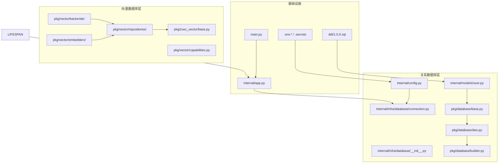
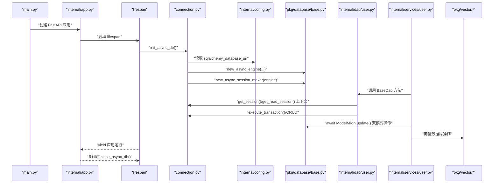
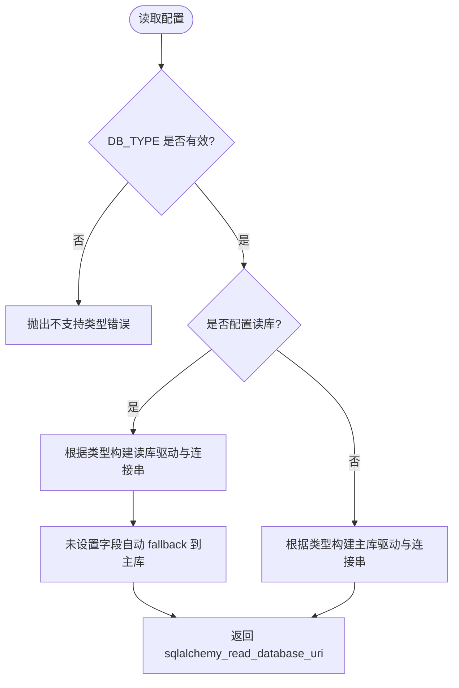
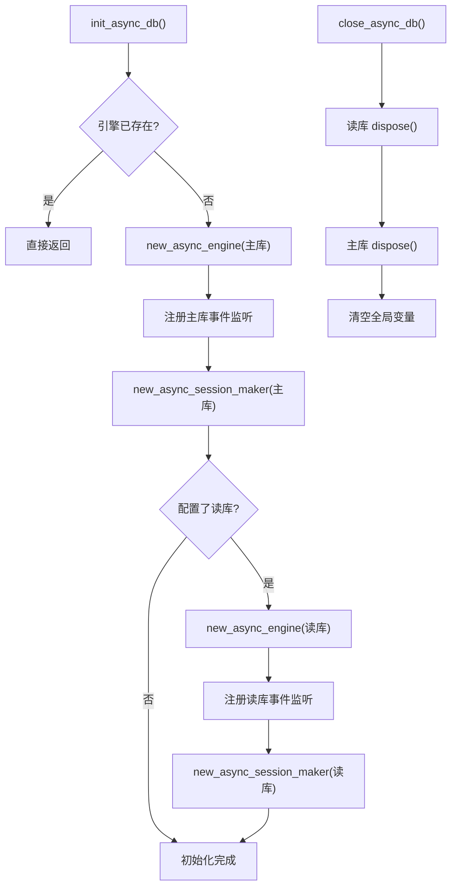
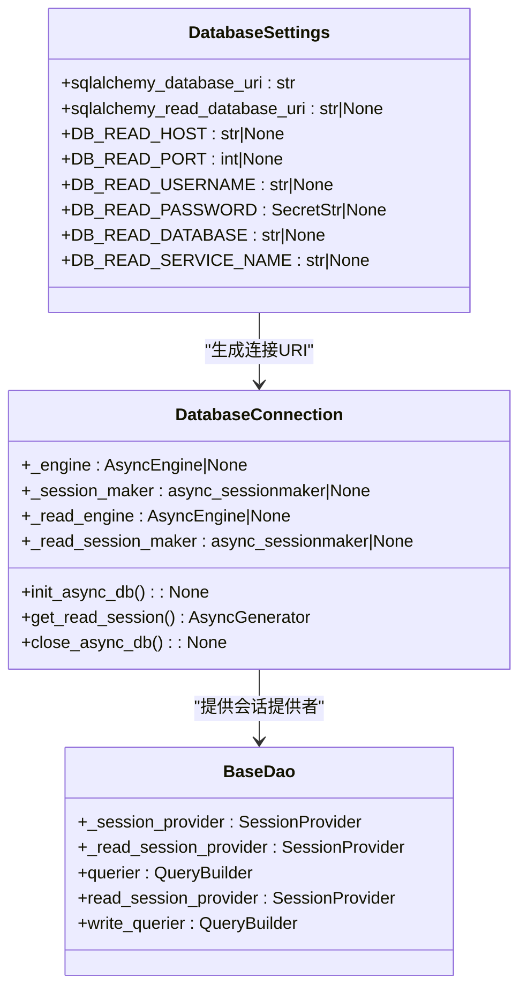
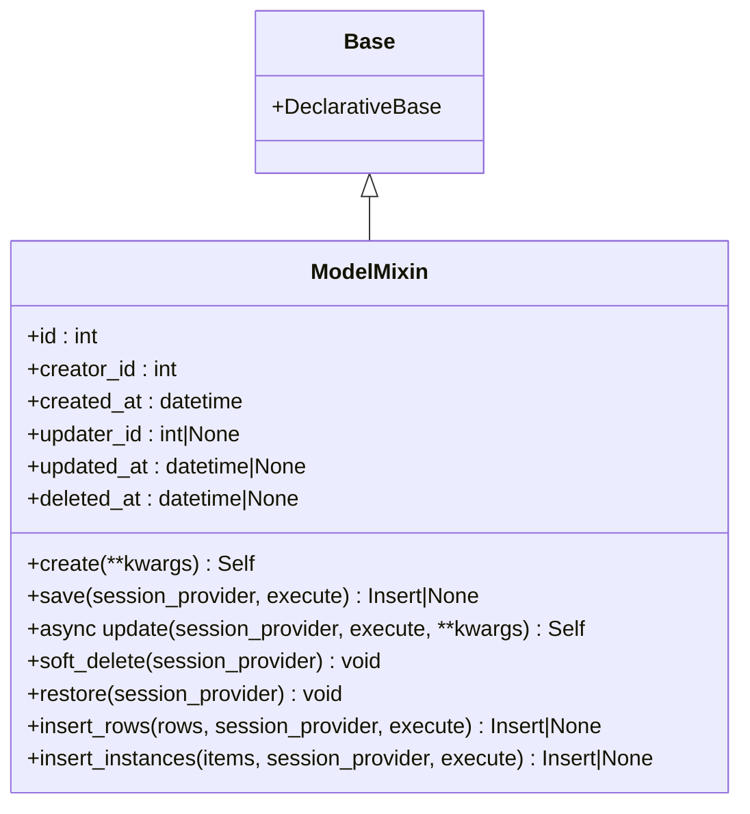
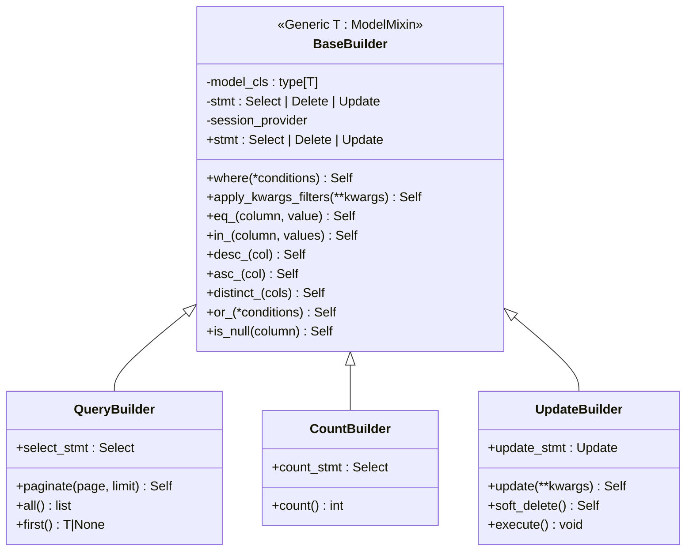
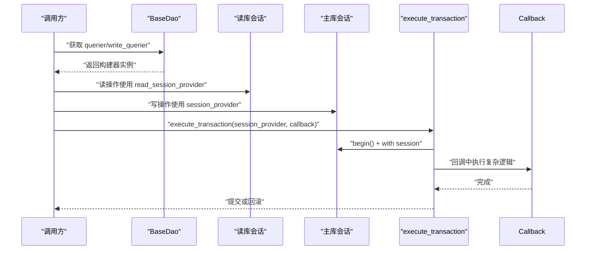
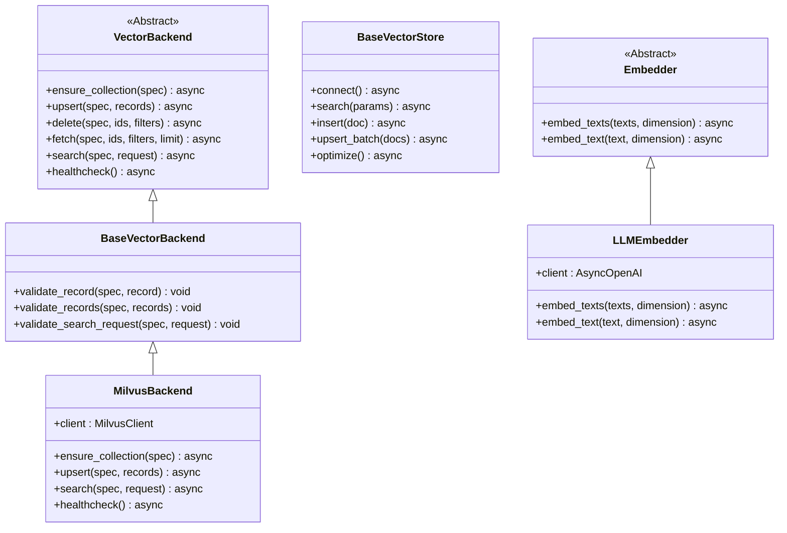
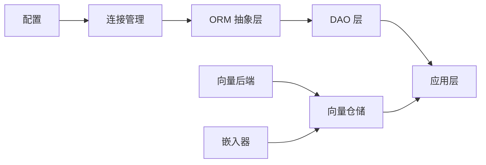

# 数据库集成

<cite>
**本文引用的文件**
- [internal/infra/database/connection.py](file://internal/infra/database/connection.py)
- [internal/infra/database/__init__.py](file://internal/infra/database/__init__.py)
- [pkg/database/base.py](file://pkg/database/base.py)
- [pkg/database/builder.py](file://pkg/database/builder.py)
- [pkg/database/dao.py](file://pkg/database/dao.py)
- [pkg/database/types.py](file://pkg/database/types.py)
- [internal/config.py](file://internal/config.py)
- [internal/models/user.py](file://internal/models/user.py)
- [internal/dao/user.py](file://internal/dao/user.py)
- [internal/app.py](file://internal/app.py)
- [main.py](file://main.py)
- [ddl/1.0.0.sql](file://ddl/1.0.0.sql)
- [configs/.env.dev](file://configs/.env.dev)
- [configs/.env.prod](file://configs/.env.prod)
- [configs/.env.test](file://configs/.env.test)
- [configs/.secrets](file://configs/.secrets)
- [tests/orm/test_orm.py](file://tests/orm/test_orm.py)
- [internal/services/user.py](file://internal/services/user.py)
- [pkg/vector/__init__.py](file://pkg/vector/__init__.py)
- [pkg/vector/backends/base.py](file://pkg/vector/backends/base.py)
- [pkg/vector/backends/milvus.py](file://pkg/vector/backends/milvus.py)
- [pkg/vector/embedders/base.py](file://pkg/vector/embedders/base.py)
- [pkg/vector/embedders/llm.py](file://pkg/vector/embedders/llm.py)
- [pkg/vector/repositories/base.py](file://pkg/vector/repositories/base.py)
- [pkg/vector/capabilities.py](file://pkg/vector/capabilities.py)
- [pkg/vector/contracts.py](file://pkg/vector/contracts.py)
- [pkg/vector/errors.py](file://pkg/vector/errors.py)
- [pkg/zvec_vector/base.py](file://pkg/zvec_vector/base.py)
- [pkg/zvec_vector/README.md](file://pkg/zvec_vector/README.md)
- [tests/zvec_vector/test_base.py](file://tests/zvec_vector/test_base.py)
</cite>

## 更新摘要
**所做更改**
- 新增向量数据库功能模块，包含完整的向量存储和搜索能力
- 扩展数据库抽象层以支持向量数据库后端（Milvus、Zvec等）
- 增加嵌入器（Embedder）模块，支持文本向量化
- 新增向量仓储（Vector Repository）模式，提供统一的向量数据访问接口
- 增强数据库配置以支持向量数据库连接参数
- 更新架构图以反映向量数据库的集成

## 目录
1. [简介](#简介)
2. [项目结构](#项目结构)
3. [核心组件](#核心组件)
4. [架构总览](#架构总览)
5. [组件详解](#组件详解)
6. [向量数据库集成](#向量数据库集成)
7. [依赖关系分析](#依赖关系分析)
8. [性能与优化](#性能与优化)
9. [故障排查指南](#故障排查指南)
10. [结论](#结论)
11. [附录](#附录)

## 简介
本文件系统化梳理本项目的数据库集成方案，涵盖配置与连接池管理、多数据库支持、数据库抽象层设计（适配器模式）、SQLAlchemy Async ORM 使用与配置、DDL 脚本与初始化流程、事务管理、监控与故障恢复等。**重大更新**：现已扩展支持向量数据库功能，包括向量存储、相似度搜索、嵌入器集成和多后端适配，形成关系数据库与向量数据库的统一集成架构。

**重大更新**：ModelMixin.update方法已从同步重构为异步实现，支持execute参数控制执行模式，提供更灵活的双模式操作能力。

## 项目结构
数据库相关代码主要分布在以下模块：
- 配置与驱动：internal/config.py
- 连接管理：internal/infra/database/connection.py
- 基础设施导出：internal/infra/database/__init__.py
- ORM 抽象与模型：pkg/database/base.py、internal/models/user.py
- 查询/计数/更新构建器：pkg/database/builder.py
- DAO 层：pkg/database/dao.py、internal/dao/user.py
- JSON 类型与跨数据库适配：pkg/database/types.py
- 初始化入口：internal/app.py、main.py
- DDL 脚本：ddl/1.0.0.sql
- 环境配置：configs/.env.dev、configs/.env.prod、configs/.env.test、configs/.secrets
- ORM 测试：tests/orm/test_orm.py
- 服务层使用示例：internal/services/user.py
- **向量数据库模块**：pkg/vector/*、pkg/zvec_vector/*


```mermaid
graph TB
subgraph "关系数据库层"
CFG["internal/config.py"]
CONN["internal/infra/database/connection.py"]
INIT["internal/infra/database/__init__.py"]
BASE["pkg/database/base.py"]
DAO["pkg/database/dao.py"]
BUILDER["pkg/database/builder.py"]
MODELS["internal/models/user.py"]
end
subgraph "向量数据库层"
VECBACK["pkg/vector/backends/"]
VECSTORE["pkg/zvec_vector/base.py"]
EMBED["pkg/vector/embedders/"]
REPO["pkg/vector/repositories/"]
CAP["pkg/vector/capabilities.py"]
end
subgraph "基础设施"
APP["internal/app.py"]
MAIN["main.py"]
DDL["ddl/1.0.0.sql"]
ENV[".env.* / .secrets"]
end
ENV --> CFG
CFG --> CONN
APP --> CONN
MAIN --> APP
MODELS --> BASE
BASE --> DAO
DAO --> BUILDER
LIFESPAN --> APP
DDL --> MODELS
VECBACK --> REPO
EMBED --> REPO
REPO --> VECSTORE
```

**章节来源**
- [internal/config.py:120-221](file://internal/config.py#L120-L221)
- [internal/infra/database/connection.py:32-88](file://internal/infra/database/connection.py#L32-L88)
- [internal/infra/database/__init__.py:3-19](file://internal/infra/database/__init__.py#L3-L19)
- [internal/app.py:82-104](file://internal/app.py#L82-L104)
- [pkg/database/base.py:19-46](file://pkg/database/base.py#L19-L46)
- [pkg/database/dao.py:15-234](file://pkg/database/dao.py#L15-L234)
- [pkg/database/builder.py:18-295](file://pkg/database/builder.py#L18-L295)
- [pkg/database/types.py:12-183](file://pkg/database/types.py#L12-L183)
- [internal/models/user.py:7-13](file://internal/models/user.py#L7-L13)
- [internal/dao/user.py:6-31](file://internal/dao/user.py#L6-L31)
- [ddl/1.0.0.sql:1-22](file://ddl/1.0.0.sql#L1-L22)
- [configs/.env.dev:6-14](file://configs/.env.dev#L6-L14)
- [configs/.env.prod:6-14](file://configs/.env.prod#L6-L14)
- [configs/.env.test:6-14](file://configs/.env.test#L6-L14)
- [configs/.secrets:6-14](file://configs/.secrets#L6-L14)
- [tests/orm/test_orm.py:66-106](file://tests/orm/test_orm.py#L66-L106)
- [internal/services/user.py:140-186](file://internal/services/user.py#L140-L186)

## 核心组件
- 配置与驱动生成：根据 DB_TYPE 动态拼装 SQLAlchemy 异步驱动 URI，支持 mysql、postgresql、oracle。
- **连接管理**：独立的 connection.py 模块提供 init_async_db()、close_async_db()、reset_async_db() 等连接管理功能。
- **会话管理**：get_session() 和 get_read_session() 提供主库和只读副本的会话获取，支持自动降级。
- **连接池配置**：主库 pool_size=10，读库 pool_size=20，支持预连接检查和超时控制。
- **SQL 监控**：事件监听器监控 SQL 执行时间和慢查询日志。
- ORM 抽象层：Base 与 ModelMixin 提供统一模型基类、默认字段、批量插入、软删/恢复、上下文默认值注入。
- **异步更新操作**：ModelMixin.update 支持双模式操作，execute=False仅更新对象属性，execute=True执行SQL更新。
- 查询构建器：QueryBuilder、CountBuilder、UpdateBuilder 提供链式条件、分页、去重计数、软删同步更新。
- DAO 层：BaseDao 封装常用查询、计数、更新入口，提供 execute_transaction 手动事务执行器。
- JSON 类型：JSONType 跨数据库适配，自动选择最优存储（JSONB/JSON/CLOB/TEXT），并提供变更追踪。
- 初始化与生命周期：FastAPI lifespan 中初始化数据库，退出时释放资源；支持慢 SQL 监控与日志。
- **向量数据库后端**：支持 Milvus 等主流向量数据库，提供统一的向量存储和搜索接口。
- **嵌入器模块**：支持 OpenAI 等 LLM 嵌入器，提供文本向量化能力。
- **向量仓储模式**：提供统一的向量数据访问抽象，支持多租户隔离和批量操作。
- **Zvec 向量存储**：嵌入式向量数据库，支持多向量字段和复杂索引类型。

**章节来源**
- [internal/config.py:120-221](file://internal/config.py#L120-L221)
- [internal/infra/database/connection.py:32-88](file://internal/infra/database/connection.py#L32-L88)
- [pkg/database/base.py:48-367](file://pkg/database/base.py#L48-L367)
- [pkg/database/builder.py:18-295](file://pkg/database/builder.py#L18-L295)
- [pkg/database/dao.py:15-234](file://pkg/database/dao.py#L15-L234)
- [pkg/database/types.py:12-183](file://pkg/database/types.py#L12-L183)
- [internal/app.py:82-104](file://internal/app.py#L82-L104)

## 架构总览
下图展示从应用启动到数据库交互的关键流程，包括配置加载、连接管理、会话获取、SQL 监控与事务执行，以及新增的向量数据库集成。


```mermaid
sequenceDiagram
participant Main as "main.py"
participant App as "internal/app.py"
participant Lifespan as "lifespan"
participant Conn as "connection.py"
participant Config as "internal/config.py"
participant ORM as "pkg/database/base.py"
participant DAO as "internal/dao/user.py"
participant Service as "internal/services/user.py"
participant Vector as "pkg/vector/*"
Main->>App : "创建 FastAPI 应用"
App->>Lifespan : "启动 lifespan"
Lifespan->>Conn : "init_async_db()"
Conn->>Config : "读取 sqlalchemy_database_uri"
Conn->>ORM : "new_async_engine(...)"
Conn->>ORM : "new_async_session_maker(engine)"
Service->>DAO : "调用 BaseDao 方法"
DAO->>Conn : "get_session()/get_read_session() 上下文"
DAO->>Conn : "execute_transaction()/CRUD"
Service->>ORM : "await ModelMixin.update() 双模式操作"
Service->>Vector : "向量数据库操作"
Lifespan-->>App : "yield 应用运行"
App-->>Lifespan : "关闭时 close_async_db()"
```

**图表来源**
- [main.py:1-4](file://main.py#L1-L4)
- [internal/app.py:82-104](file://internal/app.py#L82-L104)
- [internal/infra/database/connection.py:32-88](file://internal/infra/database/connection.py#L32-L88)
- [internal/config.py:120-221](file://internal/config.py#L120-L221)
- [pkg/database/base.py:19-46](file://pkg/database/base.py#L19-L46)
- [internal/dao/user.py:6-31](file://internal/dao/user.py#L6-L31)
- [internal/services/user.py:140-186](file://internal/services/user.py#L140-L186)

## 组件详解

### 配置与多数据库支持
- 支持数据库类型：mysql、postgresql、oracle。
- 驱动映射：mysql+aiomysql、postgresql+asyncpg、oracle+oracledb。
- 连接 URI 生成：根据 DB_TYPE 动态拼装，支持密码转义与 Oracle Service Name。
- **读写分离配置**：DB_READ_HOST、DB_READ_PORT、DB_READ_USERNAME、DB_READ_PASSWORD、DB_READ_DATABASE、DB_READ_SERVICE_NAME。
- 环境变量：DB_TYPE、DB_HOST、DB_PORT、DB_USERNAME、DB_PASSWORD、DB_DATABASE、DB_SERVICE_NAME。


```mermaid
flowchart TD
Start(["读取配置"]) --> CheckType{"DB_TYPE 是否有效?"}
CheckType --> |否| Error["抛出不支持类型错误"]
CheckType --> |是| CheckRead{"是否配置读库?"}
CheckRead --> |否| BuildURI["根据类型构建主库驱动与连接串"]
CheckRead --> |是| BuildReadURI["根据类型构建读库驱动与连接串"]
BuildReadURI --> Fallback["未设置字段自动 fallback 到主库"]
Fallback --> Return["返回 sqlalchemy_read_database_uri"]
BuildURI --> Return
```

**图表来源**
- [internal/config.py:120-221](file://internal/config.py#L120-L221)

**章节来源**
- [internal/config.py:23-31](file://internal/config.py#L23-L31)
- [internal/config.py:120-221](file://internal/config.py#L120-L221)
- [configs/.env.dev:6-14](file://configs/.env.dev#L6-L14)
- [configs/.env.prod:6-14](file://configs/.env.prod#L6-L14)
- [configs/.env.test:6-14](file://configs/.env.test#L6-L14)
- [configs/.secrets:6-14](file://configs/.secrets#L6-L14)

### 连接管理与会话获取
**重大更新**：连接管理功能已重构为独立的 connection.py 模块，提供更清晰的职责分离。

- **初始化管理**：init_async_db() 支持 echo 参数覆盖，幂等初始化，避免重复创建。
- **连接池配置**：主库 pool_pre_ping、pool_size=10、max_overflow=20、pool_timeout=30、pool_recycle=1800。
- **读库连接池**：pool_pre_ping、pool_size=20（更大）、max_overflow=30、pool_timeout=30、pool_recycle=1800。
- **会话工厂**：new_async_session_maker(expire_on_commit=False, autoflush=True)。
- **关闭与重置**：close_async_db() 异步释放，reset_async_db() 同步重置全局变量（Celery 场景）。
- **会话获取**：get_session() 和 get_read_session() 提供上下文管理器，支持自动降级。
- **SQL 监控**：注册 before/after 事件，基于 settings.SLOW_SQL_THRESHOLD 与 DEBUG 输出慢查询日志。


```mermaid
flowchart TD
Init["init_async_db()"] --> CheckInit{"引擎已存在?"}
CheckInit --> |是| Return["直接返回"]
CheckInit --> |否| CreateMaster["new_async_engine(主库)"]
CreateMaster --> RegisterMaster["注册主库事件监听"]
RegisterMaster --> MakeMaster["new_async_session_maker(主库)"]
MakeMaster --> CheckRead{"配置了读库?"}
CheckRead --> |是| CreateRead["new_async_engine(读库)"]
CheckRead --> |否| Done["初始化完成"]
CreateRead --> RegisterRead["注册读库事件监听"]
RegisterRead --> MakeRead["new_async_session_maker(读库)"]
MakeRead --> Done
Close["close_async_db()"] --> DisposeRead["读库 dispose()"]
DisposeRead --> DisposeMaster["主库 dispose()"]
DisposeMaster --> Reset["清空全局变量"]
```

**图表来源**
- [internal/infra/database/connection.py:32-104](file://internal/infra/database/connection.py#L32-L104)
- [pkg/database/base.py:19-46](file://pkg/database/base.py#L19-L46)

**章节来源**
- [internal/infra/database/connection.py:32-104](file://internal/infra/database/connection.py#L32-L104)
- [pkg/database/base.py:19-46](file://pkg/database/base.py#L19-L46)

### 读写分离与自动降级
**重大增强**：读写分离功能得到显著增强，提供完整的主库和只读副本支持。

- **动态连接URI生成**：sqlalchemy_read_database_uri 属性根据数据库类型动态生成只读副本连接字符串。
- **智能字段回退**：未配置的读库字段自动回退到主库对应字段，确保最小化配置。
- **优雅降级机制**：get_read_session() 在未配置读库时自动回退到主库，保证服务连续性。
- **独立连接池**：主库和读库拥有独立的连接池配置，读库连接池更大以承载更多查询负载。
- **会话提供者分离**：BaseDao 支持独立的读库会话提供者，实现真正的读写分离。


```mermaid
classDiagram
class DatabaseSettings {
+sqlalchemy_database_uri : str
+sqlalchemy_read_database_uri : str|None
+DB_READ_HOST : str|None
+DB_READ_PORT : int|None
+DB_READ_USERNAME : str|None
+DB_READ_PASSWORD : SecretStr|None
+DB_READ_DATABASE : str|None
+DB_READ_SERVICE_NAME : str|None
}
class DatabaseConnection {
+_engine : AsyncEngine|None
+_session_maker : async_sessionmaker|None
+_read_engine : AsyncEngine|None
+_read_session_maker : async_sessionmaker|None
+init_async_db() : None
+get_read_session() AsyncGenerator
+close_async_db() : None
}
class BaseDao {
+_session_provider : SessionProvider
+_read_session_provider : SessionProvider
+querier : QueryBuilder
+read_session_provider : SessionProvider
+write_querier : QueryBuilder
}
DatabaseSettings --> DatabaseConnection : "生成连接URI"
DatabaseConnection --> BaseDao : "提供会话提供者"
```

**图表来源**
- [internal/config.py:163-221](file://internal/config.py#L163-L221)
- [internal/infra/database/connection.py:20-27](file://internal/infra/database/connection.py#L20-L27)
- [pkg/database/dao.py:15-59](file://pkg/database/dao.py#L15-L59)

**章节来源**
- [internal/infra/database/connection.py:20-27](file://internal/infra/database/connection.py#L20-L27)
- [pkg/database/dao.py:15-59](file://pkg/database/dao.py#L15-L59)
- [internal/config.py:66-73](file://internal/config.py#L66-L73)

### ORM 抽象层与模型
**重大更新**：ModelMixin.update方法已重构为异步实现，提供双模式操作能力。

- Base 与 ModelMixin：统一声明式基类，提供 id、creator_id、created_at、updater_id、updated_at、deleted_at 等默认字段。
- 工厂方法：create() 自动清洗列、填充默认值；save()/update() 严格区分插入/更新状态。
- **异步更新操作**：update() 支持双模式操作，execute=False仅更新对象属性但不执行SQL，execute=True执行SQL更新。
- **参数验证**：execute=True时要求提供session_provider参数，execute=False时仅更新内存状态。
- 批量操作：insert_rows()（字典）、insert_instances()（实例）高性能批量写入。
- 软删/恢复：soft_delete()/restore() 自动同步 updated_at 与 updater_id。
- 字段反射：has_column()/get_column_names()/has_*_column() 辅助列检测与元数据工具。


```mermaid
classDiagram
class Base {
+DeclarativeBase
}
class ModelMixin {
+id : int
+creator_id : int
+created_at : datetime
+updater_id : int|None
+updated_at : datetime|None
+deleted_at : datetime|None
+create(**kwargs) Self
+save(session_provider, execute) Insert|None
+async update(session_provider, execute, **kwargs) Self
+soft_delete(session_provider) void
+restore(session_provider) void
+insert_rows(rows, session_provider, execute) Insert|None
+insert_instances(items, session_provider, execute) Insert|None
}
Base <|-- ModelMixin
```

**图表来源**
- [pkg/database/base.py:48-367](file://pkg/database/base.py#L48-L367)

**章节来源**
- [pkg/database/base.py:48-367](file://pkg/database/base.py#L48-L367)
- [internal/models/user.py:7-13](file://internal/models/user.py#L7-L13)

### 查询/计数/更新构建器
**重大增强**：查询构建器经过重大重构，引入了更安全的语句访问机制和类型安全保障。

- **安全的语句访问**：新增 `stmt` 属性提供受保护的语句访问，未初始化时抛出 `RuntimeError` 异常，防止误用。
- **分离的语句属性**：QueryBulder 和 CountBuilder 分别提供 `select_stmt` 和 `count_stmt` 属性，确保类型安全，避免类型混淆。
- **改进的软删除逻辑**：UpdateBuilder 的 `soft_delete()` 方法现在正确处理软删除字段，自动同步 `deleted_at` 和 `updated_at` 字段。
- **增强的类型注解**：所有构建器类都使用泛型类型注解 `T: ModelMixin`，提供更好的 IDE 支持和类型安全性。
- **改进的错误处理**：每个异步方法都包含详细的异常处理和错误消息，便于调试和问题诊断。


```mermaid
classDiagram
class BaseBuilder {
<<Generic T : ModelMixin>>
-model_cls : type[T]
-stmt : Select | Delete | Update
-session_provider
+stmt : Select | Delete | Update
+where(*conditions) Self
+apply_kwargs_filters(**kwargs) Self
+eq_(column, value) Self
+in_(column, values) Self
+desc_(col) Self
+asc_(col) Self
+distinct_(cols) Self
+or_(*conditions) Self
+is_null(column) Self
}
class QueryBuilder {
+select_stmt : Select
+paginate(page, limit) Self
+all() list
+first() T|None
}
class CountBuilder {
+count_stmt : Select
+count() int
}
class UpdateBuilder {
+update(**kwargs) Self
+soft_delete() Self
+update_stmt : Update
+execute() void
}
BaseBuilder <|-- QueryBuilder
BaseBuilder <|-- CountBuilder
BaseBuilder <|-- UpdateBuilder
```

**图表来源**
- [pkg/database/builder.py:18-295](file://pkg/database/builder.py#L18-L295)

**章节来源**
- [pkg/database/builder.py:18-295](file://pkg/database/builder.py#L18-L295)

### DAO 层与事务执行器
- BaseDao：提供 querier/counter/updater 及其变体（包含/排除软删、无排序等），以及 query_by_primary_id()/query_by_ids()。
- **读写分离支持**：read_session_provider 属性提供只读副本会话提供者，write_querier 强制从主库查询。
- execute_transaction：统一事务入口，支持复杂业务逻辑（如先插入后关联、混合 ORM 与原生 SQL、flush 获取自增 ID 等）。


```mermaid
sequenceDiagram
participant Caller as "调用方"
participant DAO as "BaseDao"
participant ReadSession as "读库会话"
participant MasterSession as "主库会话"
participant Exec as "execute_transaction"
Caller->>DAO : "获取 querier/write_querier"
DAO-->>Caller : "返回构建器实例"
Caller->>ReadSession : "读操作使用 read_session_provider"
Caller->>MasterSession : "写操作使用 session_provider"
Caller->>Exec : "execute_transaction(session_provider, callback)"
Exec->>MasterSession : "begin() + with session"
Exec->>Callback : "回调中执行复杂逻辑"
Callback-->>Exec : "完成"
Exec-->>Caller : "提交或回滚"
```

**图表来源**
- [pkg/database/dao.py:15-234](file://pkg/database/dao.py#L15-L234)

**章节来源**
- [pkg/database/dao.py:15-234](file://pkg/database/dao.py#L15-L234)
- [internal/dao/user.py:6-31](file://internal/dao/user.py#L6-L31)

### JSON 类型与跨数据库适配
- JSONType：自动适配 PostgreSQL(JSONB)、MySQL(JSON)、SQLite(JSON)、Oracle(原生/LOB)、其他(TEXT)。
- 序列化策略：PostgreSQL/Oracle 原生 JSON 模式无需序列化；其他数据库使用 orjson；空值与 LOB 容错处理。
- MutableJSON：为 JSONType 注册变更追踪，支持 dict/list 的细粒度变更感知。

**章节来源**
- [pkg/database/types.py:12-183](file://pkg/database/types.py#L12-L183)

### 初始化与生命周期
- FastAPI lifespan：启动时 init_async_db()，关闭时 close_async_db()。
- 入口：main.py 通过 uvicorn 启动 create_app()。

**章节来源**
- [internal/app.py:82-104](file://internal/app.py#L82-L104)
- [main.py:1-4](file://main.py#L1-L4)

### DDL 脚本与数据库初始化
- DDL 示例：创建 documents 表，包含主键、索引与注释，适合 InnoDB 引擎。
- 初始化流程：ORM Base.metadata 与实际 DDL 结合，确保表结构与模型一致。

**章节来源**
- [ddl/1.0.0.sql:1-22](file://ddl/1.0.0.sql#L1-L22)

## 向量数据库集成

### 向量数据库后端架构
项目提供了完整的向量数据库解决方案，支持多种后端实现和统一的抽象接口。


```mermaid
classDiagram
class VectorBackend {
<<Abstract>>
+ensure_collection(spec) async
+upsert(spec, records) async
+delete(spec, ids, filters) async
+fetch(spec, ids, filters, limit) async
+search(spec, request) async
+healthcheck() async
}
class MilvusBackend {
+client : MilvusClient
+ensure_collection(spec) async
+upsert(spec, records) async
+search(spec, request) async
+healthcheck() async
}
class BaseVectorBackend {
+validate_record(spec, record) void
+validate_records(spec, records) void
+validate_search_request(spec, request) void
}
class BaseVectorStore {
+connect() async
+search(params) async
+insert(doc) async
+upsert_batch(docs) async
+optimize() async
}
VectorBackend <|-- BaseVectorBackend
BaseVectorBackend <|-- MilvusBackend
class Embedder {
<<Abstract>>
+embed_texts(texts, dimension) async
+embed_text(text, dimension) async
}
class LLMEmbedder {
+client : AsyncOpenAI
+embed_texts(texts, dimension) async
+embed_text(text, dimension) async
}
Embedder <|-- LLMEmbedder
```

**图表来源**
- [pkg/vector/backends/base.py:122-185](file://pkg/vector/backends/base.py#L122-L185)
- [pkg/vector/backends/milvus.py:27-502](file://pkg/vector/backends/milvus.py#L27-L502)
- [pkg/zvec_vector/base.py:114-525](file://pkg/zvec_vector/base.py#L114-L525)
- [pkg/vector/embedders/base.py:14-55](file://pkg/vector/embedders/base.py#L14-L55)
- [pkg/vector/embedders/llm.py:22-171](file://pkg/vector/embedders/llm.py#L22-L171)

### 向量仓储模式
向量仓储模式提供了统一的向量数据访问抽象，支持多租户隔离和批量操作。

- **CollectionSpec**：定义向量集合的完整 schema，包括字段定义、索引配置、租户隔离模式等。
- **VectorRecord**：向量记录的数据结构，包含 id、text、embedding、metadata、payload 等字段。
- **SearchRequest**：搜索请求的数据结构，包含查询向量、过滤条件、返回数量等。
- **BaseVectorRepository**：向量仓储基类，提供统一的 CRUD 操作接口。

**章节来源**
- [pkg/vector/backends/base.py:89-120](file://pkg/vector/backends/base.py#L89-L120)
- [pkg/vector/contracts.py:1-200](file://pkg/vector/contracts.py#L1-L200)
- [pkg/vector/repositories/base.py:18-262](file://pkg/vector/repositories/base.py#L18-L262)

### 嵌入器集成
项目支持多种嵌入器实现，目前主要支持基于 OpenAI 的 LLM 嵌入器。

- **LLMEmbedder**：基于 OpenAI API 的嵌入器实现，支持批量文本向量化。
- **BaseEmbedder**：嵌入器基类，提供维度验证和安全包装方法。
- **EmbedderProvider**：嵌入器提供者枚举，支持 LLM 类型。

**章节来源**
- [pkg/vector/embedders/llm.py:22-171](file://pkg/vector/embedders/llm.py#L22-L171)
- [pkg/vector/embedders/base.py:14-55](file://pkg/vector/embedders/base.py#L14-L55)

### Zvec 向量存储
Zvec 是一个嵌入式的向量数据库，提供了丰富的向量存储和搜索功能。

- **多向量字段支持**：支持在同一集合中定义多个向量字段，如 dense_vec、sparse_vec。
- **多种索引类型**：支持 FLAT、HNSW、IVF 等不同的索引类型。
- **线程安全**：通过 threading.Lock 保证线程安全，使用 anyio_run_in_thread 包装同步操作。
- **Schema 演进**：支持动态添加/删除列，实现向量集合的 Schema 演进。

**章节来源**
- [pkg/zvec_vector/base.py:114-525](file://pkg/zvec_vector/base.py#L114-L525)
- [pkg/zvec_vector/README.md:208-260](file://pkg/zvec_vector/README.md#L208-L260)

### 向量数据库配置
向量数据库支持通过环境变量进行配置：

- **向量后端配置**：VECTOR_BACKEND=milvus、zvec 等
- **Milvus 配置**：MILVUS_URI、MILVUS_TOKEN、MILVUS_DB_NAME
- **Zvec 配置**：ZVEC_PATH、ZVEC_COLLECTION_NAME
- **嵌入器配置**：EMBEDDING_API_KEY、EMBEDDING_MODEL_NAME、EMBEDDING_DIMENSION

**章节来源**
- [configs/.env.dev:1-22](file://configs/.env.dev#L1-L22)
- [configs/.env.prod:1-22](file://configs/.env.prod#L1-L22)

## 依赖关系分析
- 配置层依赖：DB_TYPE 映射驱动，生成 sqlalchemy_database_uri 和 sqlalchemy_read_database_uri。
- 连接管理层依赖：读取配置，创建引擎与会话工厂，注册 SQL 监控事件。
- ORM 层依赖：Base/ModelMixin 作为模型基类，DAO 与构建器依赖其列反射与默认字段。
- DAO 层依赖：通过 session_provider/get_read_session 获取会话，执行 CRUD 与事务。
- 应用层依赖：lifespan 生命周期管理数据库生命周期。
- **向量数据库依赖**：VectorBackend、Embedder、VectorRepository 形成完整的向量数据处理链。


```mermaid
graph LR
CFG["配置"] --> CONN["连接管理"]
CONN --> ORM["ORM 抽象层"]
ORM --> DAO["DAO 层"]
DAO --> APP["应用层"]
VECBACK["向量后端"] --> VECREPO["向量仓储"]
EMBED["嵌入器"] --> VECREPO
VECREPO --> APP
```

**图表来源**
- [internal/config.py:23-31](file://internal/config.py#L23-L31)
- [internal/infra/database/connection.py:32-88](file://internal/infra/database/connection.py#L32-L88)
- [pkg/database/base.py:48-51](file://pkg/database/base.py#L48-L51)
- [pkg/database/dao.py:15-42](file://pkg/database/dao.py#L15-L42)
- [internal/app.py:82-104](file://internal/app.py#L82-L104)

**章节来源**
- [internal/config.py:23-31](file://internal/config.py#L23-L31)
- [internal/infra/database/connection.py:32-104](file://internal/infra/database/connection.py#L32-L104)
- [pkg/database/base.py:48-367](file://pkg/database/base.py#L48-L367)
- [pkg/database/dao.py:15-234](file://pkg/database/dao.py#L15-L234)
- [internal/app.py:82-104](file://internal/app.py#L82-L104)

## 性能与优化
- 连接池参数建议
  - pool_pre_ping：启用以自动剔除失效连接。
  - **主库 pool_size=10**：根据并发请求数与数据库承载能力设定。
  - **读库 pool_size=20**：读库通常承载更多查询，连接池更大。
  - max_overflow：限制溢出连接数量，避免瞬时洪峰。
  - pool_timeout：设置合理超时，避免阻塞等待。
  - pool_recycle：定期回收连接，降低长时间占用导致的资源泄漏风险。
- JSON 序列化
  - PostgreSQL/Oracle 原生 JSON 模式无需额外序列化，减少 CPU 开销。
  - 其他数据库使用 orjson，注意批量写入时的序列化成本。
- SQL 监控
  - 通过 before/after 事件统计耗时，结合 SLOW_SQL_THRESHOLD 与 DEBUG 控制日志级别。
- 批量写入
  - 优先使用 ModelMixin.insert_rows()/insert_instances()，减少往返次数。
- 分页与索引
  - QueryBuilder.paginate() 与 DDL 中的索引配合，提升查询性能。
- 事务与 flush
  - execute_transaction() 中按需 flush 获取自增 ID，避免不必要的提交延迟。
- **读写分离优化**
  - **读库连接池更大**：读库连接池 size 为 20，主库为 10，适应读多写少场景。
  - **智能降级**：未配置读库时自动回退到主库，确保服务连续性。
  - **分离的会话提供者**：BaseDao 支持独立的读库会话提供者，实现真正的读写分离。
- **异步更新优化**
  - **execute=False模式**：适用于需要先更新内存状态再进行复杂业务逻辑的场景，避免不必要的数据库往返。
  - **execute=True模式**：适用于直接持久化更新的场景，确保数据一致性。
- **向量数据库性能优化**
  - **索引选择**：根据数据规模和查询模式选择合适的索引类型（HNSW 适合大规模近似搜索，IVF 适合超大规模数据）。
  - **批量操作**：使用 upsert_batch 和 embed_texts 批量处理，减少 API 调用次数。
  - **缓存策略**：对频繁查询的向量结果进行缓存，减少重复计算。
  - **维度优化**：根据应用场景选择合适的向量维度，在精度和性能之间找到平衡。

**章节来源**
- [internal/infra/database/connection.py:50-87](file://internal/infra/database/connection.py#L50-L87)
- [pkg/database/types.py:96-146](file://pkg/database/types.py#L96-L146)
- [pkg/database/base.py:100-151](file://pkg/database/base.py#L100-L151)
- [pkg/database/builder.py:135-144](file://pkg/database/builder.py#L135-L144)
- [ddl/1.0.0.sql:17-21](file://ddl/1.0.0.sql#L17-L21)

## 故障排查指南
- 初始化失败
  - 确认 DB_TYPE 与驱动映射一致，检查 .env.* 与 .secrets 配置。
  - 核对 sqlalchemy_database_uri 生成逻辑，特别是 Oracle Service Name 与密码转义。
  - **读写分离配置**：检查 DB_READ_HOST 是否正确配置，未配置时会自动降级到主库。
- 连接池问题
  - 观察 pool_timeout 与 max_overflow 设置是否合理；必要时增大或调整。
  - **读库连接池**：读库连接池默认 size=20，如出现连接不足可适当增大。
  - 使用 reset_async_db() 清理 Celery 任务中的事件循环绑定冲突。
- SQL 性能
  - 开启 DEBUG 或调整 SLOW_SQL_THRESHOLD，定位慢查询；结合索引与分页优化。
  - **读写分离场景**：确认查询是否使用了正确的会话提供者，避免读到脏数据。
- 事务异常
  - 使用 execute_transaction() 包裹复杂逻辑，确保异常时自动回滚。
- JSON 类型异常
  - 检查数据库类型与 oracle_native_json 配置；确认容错逻辑生效。
- **异步更新异常**
  - **execute=True但缺少session_provider**：如果调用 update(execute=True) 但未提供 session_provider，会抛出 ValueError。
  - **execute=False模式**：适用于不需要立即持久化的场景，但需要注意内存状态与数据库状态的同步。
  - **状态检查异常**：如果对新创建的对象调用 update()，会抛出 RuntimeError，提示应先调用 insert()。
- **构建器异常**
  - **stmt 属性异常**：如果遇到 "Statement not initialized" 错误，确保在使用 `stmt` 属性前已经初始化了相应的查询条件。
  - **类型不匹配异常**：如果 `select_stmt` 或 `count_stmt` 抛出类型错误，检查是否正确使用了对应的构建器类型。
  - **空列表异常**：`in_()` 方法现在会拒绝空列表输入，需要显式处理空值情况。
- **读写分离异常**
  - **会话提供者为空**：如果 get_read_session() 抛出 "Database is not initialized" 错误，检查数据库是否正确初始化。
  - **写后读一致性**：对于需要强一致性的场景，使用 write_querier 或 write_session_provider。
- **向量数据库异常**
  - **后端连接失败**：检查 VECTOR_BACKEND 配置和后端服务可用性。
  - **嵌入器调用失败**：验证 EMBEDDING_API_KEY 和模型名称配置。
  - **维度不匹配**：确保向量维度与嵌入器配置一致。
  - **索引创建失败**：检查索引参数配置和数据类型支持。

**章节来源**
- [internal/config.py:163-221](file://internal/config.py#L163-L221)
- [internal/infra/database/connection.py:124-179](file://internal/infra/database/connection.py#L124-L179)
- [pkg/database/dao.py:137-234](file://pkg/database/dao.py#L137-L234)
- [pkg/database/types.py:12-183](file://pkg/database/types.py#L12-L183)
- [pkg/database/builder.py:28-33](file://pkg/database/builder.py#L28-L33)

## 结论
本项目的数据库集成采用"配置驱动 + 连接管理 + 抽象层 + 构建器 + DAO"的分层设计，结合 SQLAlchemy Async ORM 实现高性能、可维护的数据访问。通过多数据库驱动映射、连接池参数化、SQL 监控与事务执行器，满足生产级需求。DDL 脚本与 ORM 基类协同，确保结构演进与代码一致性。

**重大更新总结**：
- **连接管理重构**：连接管理功能已迁移到独立的 connection.py 模块，提供更清晰的职责分离。
- **读写分离增强**：支持主库和只读副本的独立连接池，提供智能字段回退和优雅降级机制。
- **动态连接URI生成**：sqlalchemy_read_database_uri 属性根据数据库类型动态生成只读副本连接字符串。
- **异步更新重构**：ModelMixin.update方法已重构为异步实现，支持execute参数控制双模式操作。
- **双模式操作**：execute=False仅更新对象属性但不执行SQL，execute=True执行SQL更新，提供更灵活的操作方式。
- **安全性提升**：新增 `stmt` 属性提供受保护的语句访问，防止未初始化使用。
- **类型安全**：分离的 `select_stmt` 和 `count_stmt` 属性确保类型正确性。
- **功能分离**：排序和分组方法专门用于查询构建，避免类型混淆。
- **软删除改进**：UpdateBuilder 的软删除逻辑更加可靠和一致。
- **类型注解增强**：完整的泛型类型支持提供更好的开发体验。
- **向量数据库集成**：新增完整的向量数据库支持，包括多后端适配、嵌入器集成和统一抽象接口。
- **向量仓储模式**：提供统一的向量数据访问抽象，支持多租户隔离和批量操作。
- **Zvec 向量存储**：嵌入式向量数据库，支持多向量字段和复杂索引类型。

建议在生产环境中进一步完善迁移与版本管理策略，并持续优化连接池与查询性能。向量数据库功能的加入为项目提供了更强大的 AI 应用支持能力。

## 附录

### 数据库连接示例（路径指引）
- FastAPI 启动初始化：[lifespan 初始化:82-104](file://internal/app.py#L82-L104)
- 数据库连接管理：[init_async_db/close_async_db/reset_async_db:32-104](file://internal/infra/database/connection.py#L32-L104)
- 会话获取上下文：[get_session/get_read_session:124-179](file://internal/infra/database/connection.py#L124-L179)
- 用户 DAO 使用示例：[UserDao:6-31](file://internal/dao/user.py#L6-L31)
- ORM 基类与模型：[ModelMixin/User:48-51](file://pkg/database/base.py#L48-L51), [internal/models/user.py:7-13](file://internal/models/user.py#L7-L13)
- JSON 类型使用：[JSONType:12-183](file://pkg/database/types.py#L12-L183)
- DDL 示例：[1.0.0.sql:1-22](file://ddl/1.0.0.sql#L1-L22)
- 环境配置示例：[configs/.env.dev:6-14](file://configs/.env.dev#L6-L14), [configs/.env.prod:6-14](file://configs/.env.prod#L6-L14), [.secrets:6-14](file://configs/.secrets#L6-L14)
- ORM 测试（内存 SQLite）：[tests/orm/test_orm.py:92-106](file://tests/orm/test_orm.py#L92-L106)
- 服务层使用示例：[UserService:140-186](file://internal/services/user.py#L140-L186)

### 异步更新操作使用示例
**双模式操作示例**：
```python
# execute=False模式：仅更新对象属性，不执行SQL
user = await user_dao.query_by_primary_id(1)
await user.update(execute=False, username="new_username")
# 此时数据库中仍为旧值，但内存中的user对象已更新

# execute=True模式：更新对象属性并执行SQL
await user.update(
    session_provider=get_session,
    execute=True,
    username="new_username"
)
# 数据库和内存状态都已更新
```

**服务层集成示例**：
```python
# 在服务层中使用DAO的session_provider
await existing_account.update(
    session_provider=self._third_party_dao.session_provider,
    union_id=third_party_info.union_id,
    avatar=third_party_info.avatar,
    nickname=third_party_info.nickname,
    # ... 其他字段
)
```

**批量更新示例**：
```python
# 使用UpdateBuilder进行批量更新
await (await user_dao.ins_updater(user).update(status="active")).execute()

# 使用ModelMixin的异步更新
await user.update(
    session_provider=get_session,
    execute=True,
    last_login=datetime.utcnow()
)
```

### 读写分离使用示例
**基础读写分离**：
```python
# 使用读库会话提供者进行查询
users = await user_dao.querier.eq_(User.id, 1).first()

# 强制使用主库进行写操作
await execute_transaction(session_provider, async def callback(sess):
    # 写操作会自动使用主库
    await sess.execute(insert_stmt)
```

**智能降级示例**：
```python
# 未配置读库时自动降级到主库
async with get_read_session() as session:
    # 如果 DB_READ_HOST 未配置，这里会使用主库连接
    users = await session.execute(select(User)).scalars().all()
```

**分离的会话提供者**：
```python
# 创建支持读写分离的 DAO
user_dao = UserDao(
    session_provider=get_session,      # 主库
    read_session_provider=get_read_session,  # 读库
)

# 读操作使用读库
users = await user_dao.querier.all()

# 写操作使用主库
await execute_transaction(user_dao.session_provider, callback)
```

### 查询构建器使用示例
**基础查询**：
```python
# 使用 querier 属性获取查询构建器
users = await user_dao.querier.eq_(User.id, 1).first()

# 使用 where 条件组合
users = await user_dao.querier.where(User.age > 18).and_(User.status == "active").all()
```

**分页查询**：
```python
# 分页查询（推荐方式）
users = await user_dao.querier_unsorted.asc_(User.id).paginate(page=1, limit=20).all()
```

**计数查询**：
```python
# 基础计数
count = await user_dao.counter.count()

# 去重计数
count = await user_dao.col_counter(User.organization_id, is_distinct=True).count()
```

**软删除处理**：
```python
# 软删除（自动同步 updated_at 和 deleted_at）
await (await user_dao.ins_updater(user).soft_delete()).execute()

# 查询时包含已删除记录
users = await user_dao.querier_inc_deleted.all()
```

**事务处理**：
```python
# 复杂事务逻辑
await execute_transaction(session_provider, async def callback(sess):
    # 执行多个数据库操作
    await sess.execute(update_stmt)
    await sess.execute(insert_stmt)
```

### 向量数据库使用示例

**向量后端配置示例**：
```python
# 创建 Milvus 向量后端
milvus_backend = create_backend(
    provider=BackendProvider.MILVUS,
    uri="http://localhost:19530",
    token="your-token",
    db_name="your-database"
)

# 创建 Zvec 向量存储
zvec_config = CollectionConfig(
    name="test_collection",
    path="/tmp/vectors",
    vector_fields=[
        VectorFieldConfig(
            name="embedding",
            dimension=768,
            index_type=IndexType.HNSW
        )
    ]
)
vector_store = BaseVectorStore(zvec_config)
```

**嵌入器使用示例**：
```python
# 创建 LLM 嵌入器
embedder = create_llm_embedder(
    api_key="your-openai-api-key",
    model_name="text-embedding-ada-002",
    dimension=1024
)

# 向量化文本
texts = ["Hello world", "How are you?"]
embeddings = await embedder.embed_texts(texts)
```

**向量仓储使用示例**：
```python
# 创建向量仓储
repository = BaseVectorRepository(
    backend=milvus_backend,
    embedder=embedder,
    tenant_id="org_123"
)

# 准备向量记录
records = [
    VectorRecord(
        id="doc_1",
        text="This is document content",
        embedding=None,  # 将由嵌入器自动填充
        metadata={"category": "tech"}
    )
]

# 批量写入
await repository.upsert_records(records=records)
```

**向量搜索示例**：
```python
# 文本搜索
results = await repository.search_by_text(
    query_text="machine learning",
    top_k=10,
    filters=[FilterCondition("category", FilterOperator.EQ, "tech")]
)

# 向量搜索
query_vector = [0.1, 0.2, 0.3] * 256  # 768维向量
results = await repository.search_by_vector(
    query_vector=query_vector,
    top_k=5
)
```

**Zvec 向量存储示例**：
```python
# 连接向量存储
async with vector_store:
    # 插入文档
    doc = {
        "id": "doc_1",
        "title": "Test Document",
        "embedding": [0.1, 0.2, 0.3, 0.4],
        "category": "tech"
    }
    await vector_store.insert(doc)
    
    # 搜索
    search_params = SearchParams(
        vector=[0.1, 0.2, 0.3, 0.4],
        top_k=5,
        filter_expr="category = 'tech'"
    )
    results = await vector_store.search(search_params)
```

### 读写分离最佳实践
**连接池配置优化**：
- 主库：pool_size=10，适合写操作较多的场景
- 读库：pool_size=20，适合高并发查询场景
- 两个连接池独立配置，避免相互影响

**会话提供者选择**：
- 读操作：优先使用 read_session_provider 或 get_read_session()
- 写操作：始终使用 session_provider 或 get_session()
- 强一致性：写后读场景使用 write_querier 或 write_session_provider

**异步更新最佳实践**：
- **execute=False模式**：适用于需要先更新内存状态再进行复杂业务逻辑的场景
- **execute=True模式**：适用于直接持久化更新的场景，确保数据一致性
- **参数验证**：确保execute=True时提供有效的session_provider
- **状态检查**：对新对象使用insert()，对现有对象使用update()

**向量数据库最佳实践**：
- **索引选择**：根据数据规模选择合适的索引类型，HNSW 适合中小规模近似搜索，IVF 适合大规模数据
- **批量操作**：使用批量 API 减少网络往返，提高写入效率
- **维度管理**：根据应用场景选择合适的向量维度，在精度和性能间平衡
- **缓存策略**：对频繁查询的结果进行缓存，减少重复计算
- **监控告警**：建立向量数据库的监控指标，及时发现性能问题

**监控与诊断**：
- 通过 SQL 监控事件观察读写分离效果
- 使用 SLOW_SQL_THRESHOLD 定位性能瓶颈
- 监控连接池利用率，适时调整 pool_size 参数
- **向量数据库监控**：监控向量搜索性能、索引构建进度、存储空间使用情况