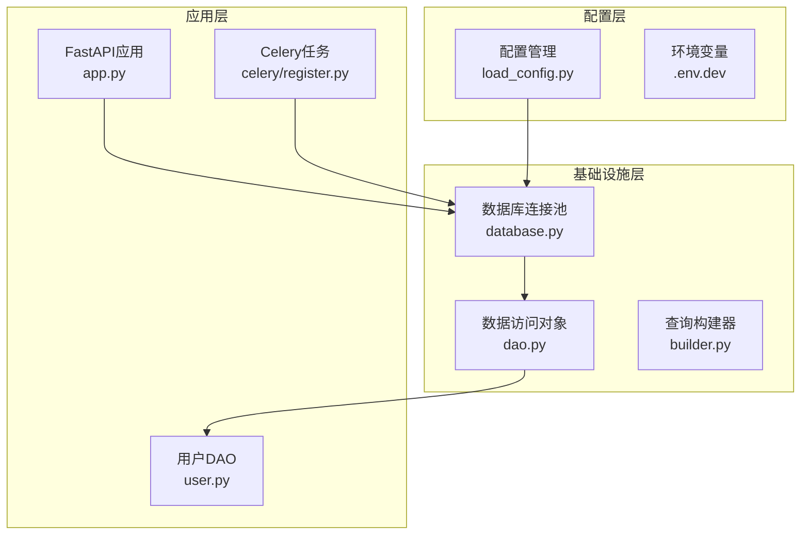
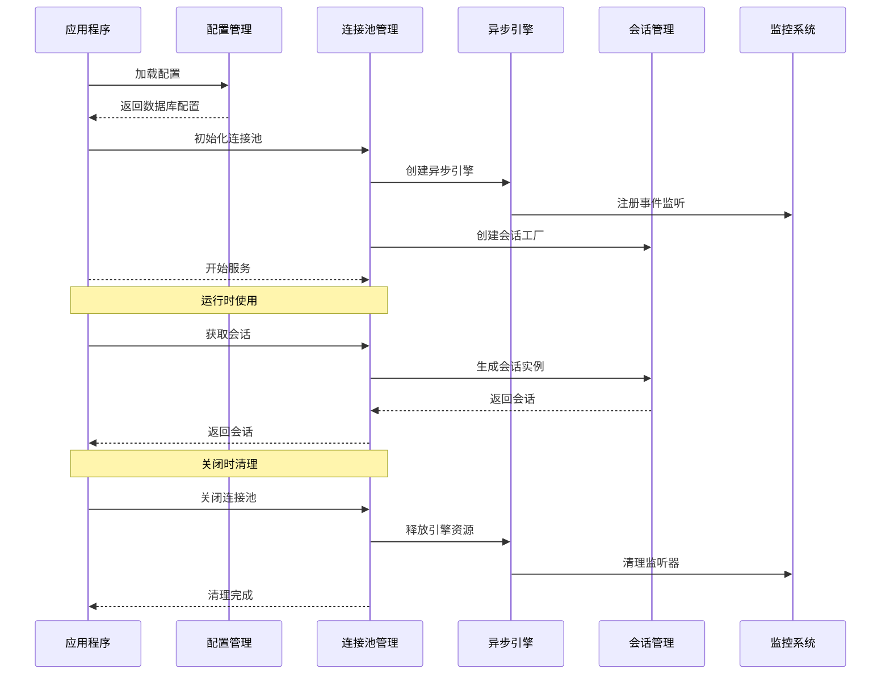
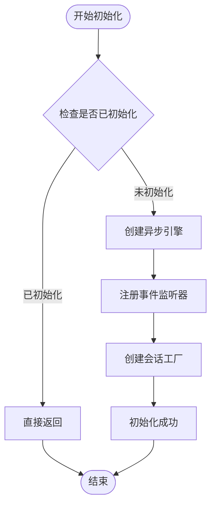
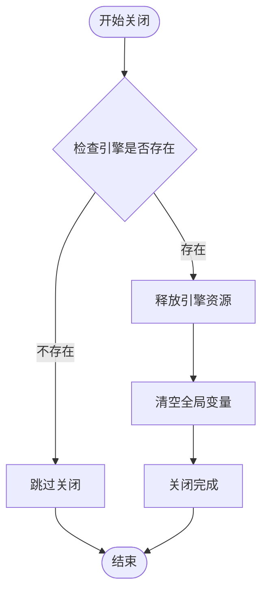
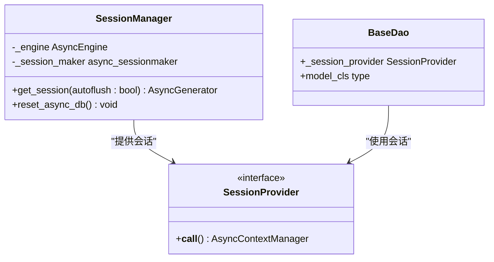
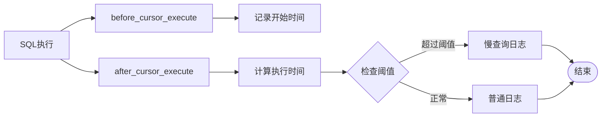
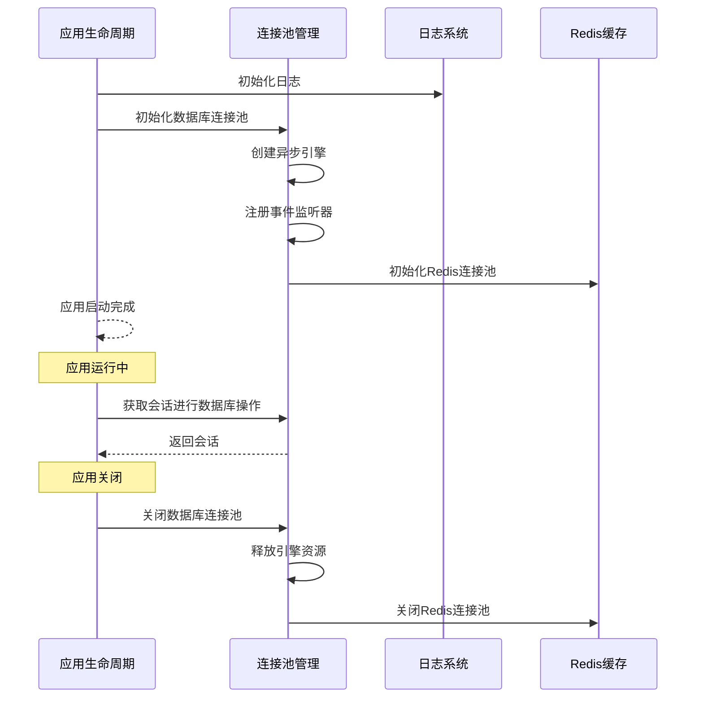
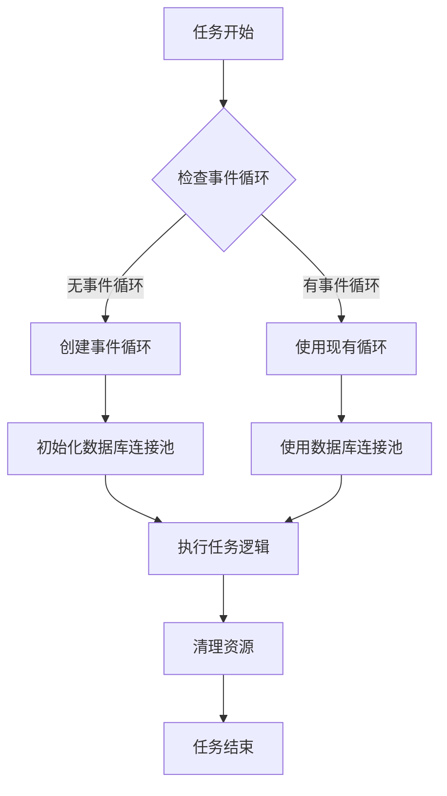
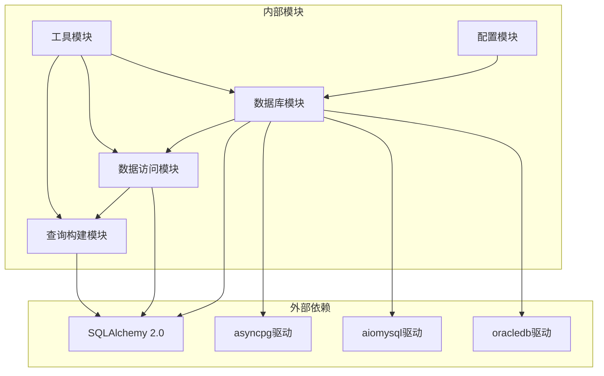
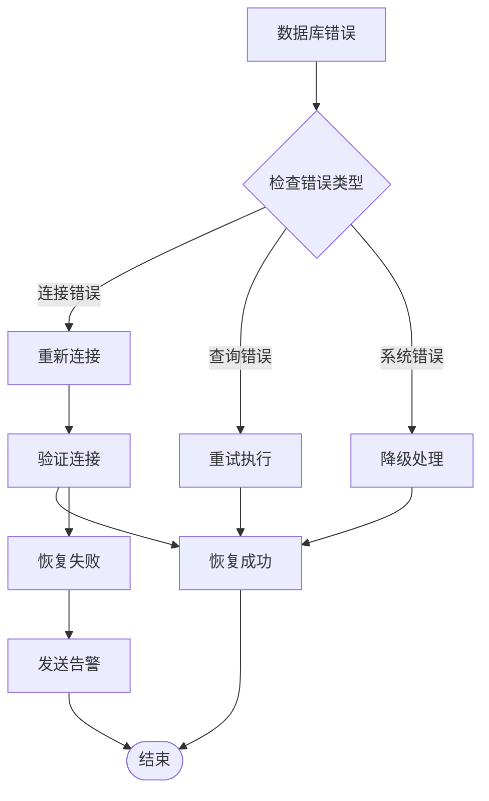

# 连接池管理

<cite>
**本文档引用的文件**
- [internal/infra/database.py](file://internal/infra/database.py)
- [pkg/database/base.py](file://pkg/database/base.py)
- [internal/config/load_config.py](file://internal/config/load_config.py)
- [internal/app.py](file://internal/app.py)
- [internal/dao/user.py](file://internal/dao/user.py)
- [pkg/database/dao.py](file://pkg/database/dao.py)
- [pkg/database/builder.py](file://pkg/database/builder.py)
- [internal/infra/celery/register.py](file://internal/infra/celery/register.py)
- [scripts/run_celery_worker.py](file://scripts/run_celery_worker.py)
- [configs/.env.dev](file://configs/.env.dev)
- [tests/orm/test_orm.py](file://tests/orm/test_orm.py)
</cite>

## 目录
1. [简介](#简介)
2. [项目结构](#项目结构)
3. [核心组件](#核心组件)
4. [架构概览](#架构概览)
5. [详细组件分析](#详细组件分析)
6. [依赖关系分析](#依赖关系分析)
7. [性能考虑](#性能考虑)
8. [故障处理指南](#故障处理指南)
9. [结论](#结论)

## 简介

本项目实现了基于SQLAlchemy的异步连接池管理系统，提供了完整的连接池生命周期管理、监控和故障处理机制。该系统支持FastAPI Web应用和Celery任务队列两种不同的使用场景，具有以下特点：

- **异步连接池**：基于SQLAlchemy 2.0的异步引擎和会话管理
- **生命周期管理**：完整的初始化、重置和关闭机制
- **监控集成**：内置SQL执行时间和慢查询监控
- **多场景支持**：同时支持Web应用和后台任务
- **配置灵活**：支持多种数据库类型和参数调优

## 项目结构

项目采用分层架构设计，连接池管理相关的代码主要分布在以下模块：

**图表来源**
- [internal/infra/database.py](file://internal/infra/database.py#L1-L154)
- [internal/config/load_config.py](file://internal/config/load_config.py#L1-L243)
- [internal/app.py](file://internal/app.py#L1-L109)

**章节来源**
- [internal/infra/database.py](file://internal/infra/database.py#L1-L154)
- [internal/config/load_config.py](file://internal/config/load_config.py#L1-L243)
- [internal/app.py](file://internal/app.py#L1-L109)

## 核心组件

### 异步连接池引擎

系统的核心是基于SQLAlchemy的异步连接池引擎，提供了以下关键功能：

- **全局单例管理**：通过全局变量维护唯一的引擎实例
- **幂等性保证**：初始化过程具有幂等性，避免重复初始化
- **事件监听**：集成SQL执行监控和慢查询检测
- **JSON序列化**：支持高性能的JSON数据类型处理

### 会话管理器

提供统一的会话获取接口，支持两种使用模式：

- **自动刷新模式**：默认启用，适合大多数Web请求场景
- **手动控制模式**：禁用自动刷新，适用于复杂的事务处理

### 监控系统

内置完整的SQL执行监控机制：

- **执行时间统计**：精确测量每个SQL语句的执行时间
- **慢查询告警**：基于阈值的慢查询检测和日志记录
- **调试模式支持**：可配置的详细SQL执行日志

**章节来源**
- [internal/infra/database.py](file://internal/infra/database.py#L26-L154)
- [pkg/database/base.py](file://pkg/database/base.py#L19-L46)

## 架构概览

系统采用分层架构，连接池管理贯穿整个应用生命周期：

**图表来源**
- [internal/app.py](file://internal/app.py#L85-L109)
- [internal/infra/database.py](file://internal/infra/database.py#L26-L80)

## 详细组件分析

### 连接池生命周期管理

#### 初始化流程

连接池的初始化过程遵循严格的生命周期管理：

**图表来源**
- [internal/infra/database.py](file://internal/infra/database.py#L26-L56)

#### 关闭流程

优雅的连接池关闭机制确保资源得到正确释放：

**图表来源**
- [internal/infra/database.py](file://internal/infra/database.py#L59-L67)

#### 重置机制

针对Celery任务的特殊需求，提供了连接池重置功能：

| 参数 | 类型 | 默认值 | 描述 |
|------|------|--------|------|
| pool_pre_ping | bool | True | 连接预检查，自动检测失效连接 |
| pool_size | int | 10 | 连接池大小，活跃连接数上限 |
| max_overflow | int | 20 | 超额连接数，超出pool_size后的最大连接数 |
| pool_timeout | int | 30 | 连接超时时间（秒） |
| pool_recycle | int | 1800 | 连接回收时间（秒） |

**章节来源**
- [internal/infra/database.py](file://internal/infra/database.py#L26-L80)
- [pkg/database/base.py](file://pkg/database/base.py#L19-L41)

### 会话管理机制

#### 会话获取上下文

提供统一的会话获取接口，支持两种使用模式：

**图表来源**
- [internal/infra/database.py](file://internal/infra/database.py#L85-L111)
- [pkg/database/dao.py](file://pkg/database/dao.py#L18-L35)

#### 事务处理

支持复杂的事务处理场景：

| 场景 | 使用方式 | 适用场景 |
|------|----------|----------|
| 简单CRUD | 直接使用会话 | 基本的数据操作 |
| 批量操作 | 使用execute_transaction | 大量数据处理 |
| 复杂逻辑 | 事务回调函数 | 需要原子性的业务逻辑 |

**章节来源**
- [pkg/database/dao.py](file://pkg/database/dao.py#L106-L203)
- [internal/dao/user.py](file://internal/dao/user.py#L6-L24)

### 监控和性能指标

#### SQL执行监控

系统内置了完整的SQL执行监控机制：

**图表来源**
- [internal/infra/database.py](file://internal/infra/database.py#L116-L154)

#### 性能指标收集

监控系统提供以下性能指标：

- **执行时间分布**：统计SQL执行时间的分布情况
- **慢查询识别**：自动识别执行时间超过阈值的SQL
- **错误率监控**：跟踪SQL执行失败的比例
- **连接池状态**：监控活跃连接数、等待连接数等

**章节来源**
- [internal/infra/database.py](file://internal/infra/database.py#L116-L154)

### FastAPI集成

#### 应用生命周期管理

在FastAPI应用中，连接池管理与应用生命周期紧密集成：

**图表来源**
- [internal/app.py](file://internal/app.py#L85-L109)
- [internal/infra/database.py](file://internal/infra/database.py#L26-L67)

#### 中间件集成

连接池管理与FastAPI中间件系统无缝集成：

- **日志中间件**：记录请求和响应信息
- **认证中间件**：验证用户身份和权限
- **CORS中间件**：处理跨域请求
- **GZip中间件**：压缩响应内容

**章节来源**
- [internal/app.py](file://internal/app.py#L55-L82)

### Celery任务集成

#### 任务执行模式

Celery任务中的连接池管理具有特殊要求：

**图表来源**
- [internal/infra/celery/register.py](file://internal/infra/celery/register.py#L8-L29)

#### 重置机制

针对Celery的特殊需求，提供了专门的重置机制：

| 机制 | 用途 | 触发时机 |
|------|------|----------|
| reset_async_db | 同步重置 | 事件循环切换前 |
| close_async_db | 异步关闭 | 应用退出时 |
| 幂等性检查 | 防止重复初始化 | 初始化时 |

**章节来源**
- [internal/infra/database.py](file://internal/infra/database.py#L69-L80)
- [internal/infra/celery/register.py](file://internal/infra/celery/register.py#L8-L29)

## 依赖关系分析

系统各组件之间的依赖关系如下：

**图表来源**
- [internal/config/load_config.py](file://internal/config/load_config.py#L38-L43)
- [pkg/database/base.py](file://pkg/database/base.py#L7-L9)

**章节来源**
- [internal/config/load_config.py](file://internal/config/load_config.py#L38-L43)
- [pkg/database/base.py](file://pkg/database/base.py#L7-L9)

## 性能考虑

### 连接池参数调优

根据不同的应用场景，建议采用以下参数配置：

#### Web应用配置
- **pool_size**: 10-20（根据并发请求数调整）
- **max_overflow**: 10-25（处理峰值请求）
- **pool_timeout**: 30秒（平衡等待时间）
- **pool_recycle**: 1800秒（避免连接老化）

#### 后台任务配置
- **pool_size**: 5-10（任务相对独立）
- **max_overflow**: 5-15（任务间资源共享）
- **pool_timeout**: 60秒（任务执行时间较长）
- **pool_recycle**: 3600秒（任务持续时间长）

### 监控指标

建议关注以下关键性能指标：

| 指标类型 | 监控目标 | 告警阈值 |
|----------|----------|----------|
| 连接利用率 | >80% | 高并发预警 |
| 连接等待时间 | >5秒 | 连接池不足 |
| SQL执行时间 | >1秒 | 慢查询优化 |
| 错误率 | >1% | 数据库异常 |

### 缓存策略

结合Redis缓存可以进一步提升性能：

- **热点数据缓存**：高频查询结果缓存
- **连接池状态缓存**：连接池使用状态监控
- **查询结果缓存**：复杂查询结果缓存

## 故障处理指南

### 常见问题诊断

#### 连接池耗尽

**症状**：请求超时，连接池等待时间过长

**解决方案**：
1. 增大max_overflow参数
2. 优化SQL查询性能
3. 检查连接泄漏问题
4. 调整pool_timeout参数

#### 连接失效

**症状**：SQL执行报错，连接异常断开

**解决方案**：
1. 启用pool_pre_ping功能
2. 减小pool_recycle时间
3. 检查数据库连接超时设置
4. 实现连接重试机制

#### 内存泄漏

**症状**：进程内存持续增长

**解决方案**：
1. 定期检查连接池状态
2. 实现连接池清理机制
3. 监控会话生命周期
4. 使用上下文管理器

### 错误恢复策略

**图表来源**
- [internal/infra/database.py](file://internal/infra/database.py#L95-L111)

### 监控告警

建议配置以下告警规则：

- **连接池使用率**：>90%触发告警
- **慢查询数量**：>10条/分钟触发告警
- **错误率**：>5%触发告警
- **连接超时**：>100次/小时触发告警

**章节来源**
- [internal/infra/database.py](file://internal/infra/database.py#L116-L154)

## 结论

本项目的连接池管理系统提供了完整的企业级解决方案，具有以下优势：

1. **架构清晰**：分层设计使得各组件职责明确，易于维护
2. **功能完整**：涵盖了连接池管理的各个方面，包括生命周期、监控、故障处理
3. **性能优化**：合理的参数配置和监控机制确保系统稳定运行
4. **多场景支持**：同时支持Web应用和后台任务的不同需求
5. **扩展性强**：模块化设计便于功能扩展和定制

通过合理配置和监控，该系统能够满足大多数应用场景的需求，并为未来的性能优化和功能扩展奠定了良好的基础。