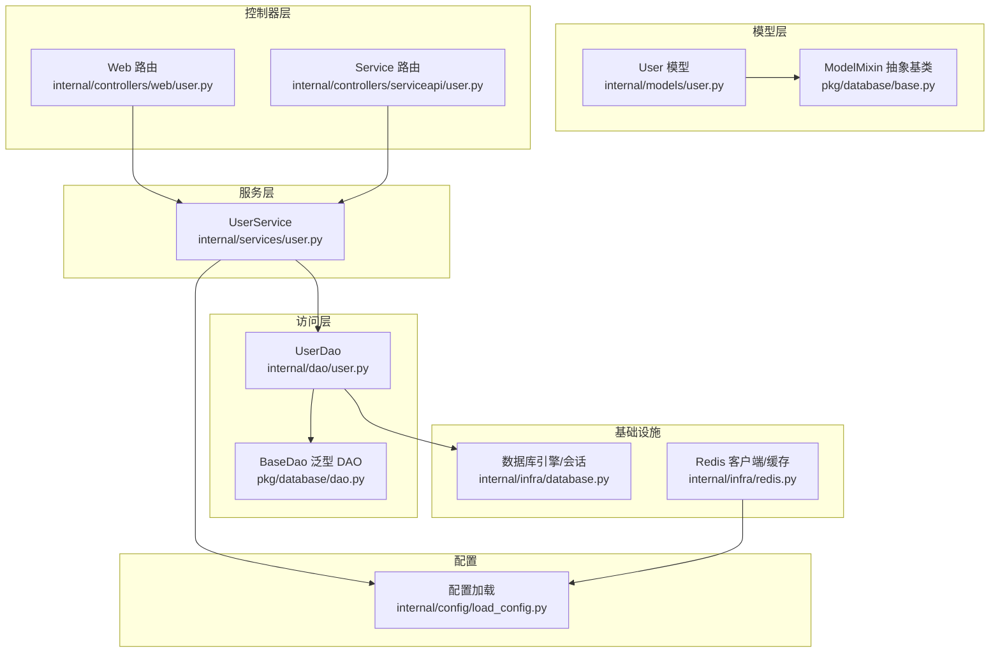
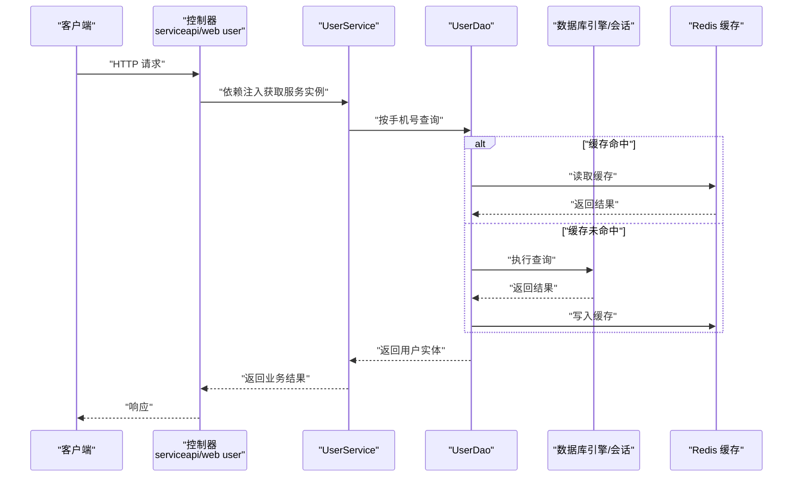
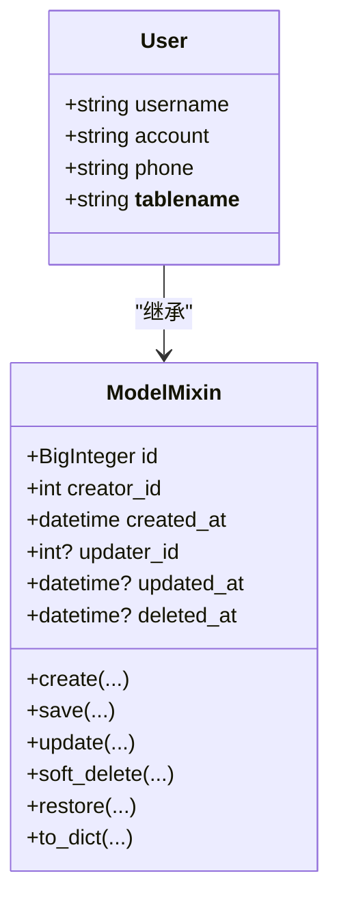
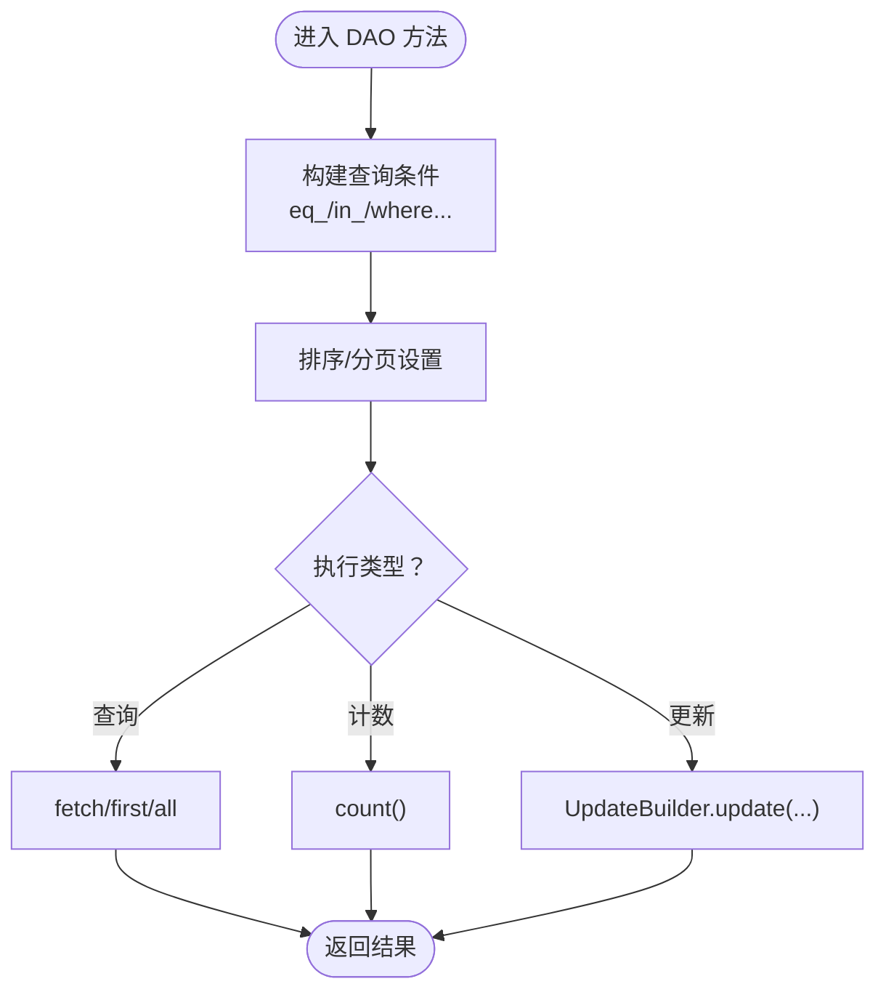
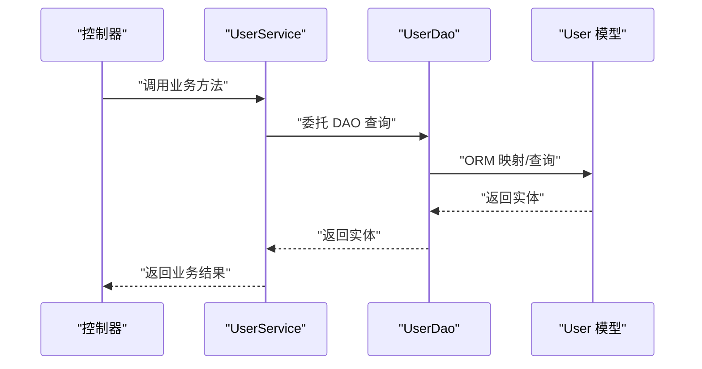
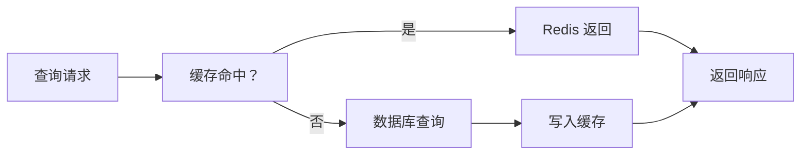
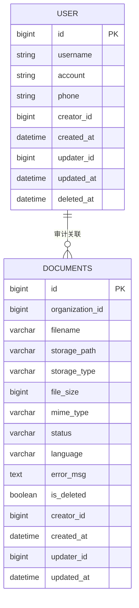
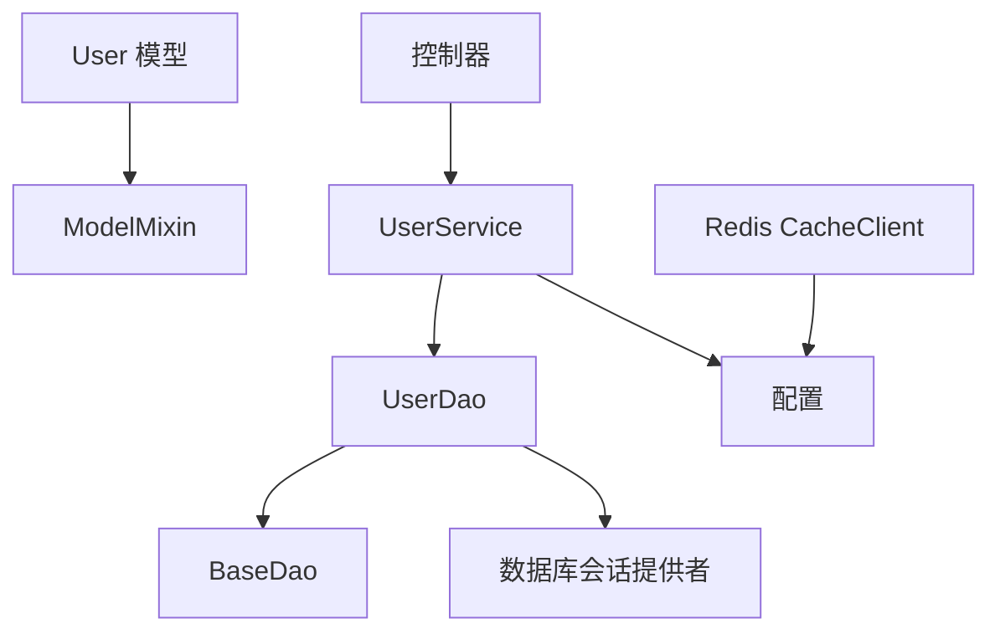

# 数据模型

<cite>
**本文引用的文件**
- [internal/models/user.py](file://internal/models/user.py)
- [pkg/database/base.py](file://pkg/database/base.py)
- [internal/dao/user.py](file://internal/dao/user.py)
- [pkg/database/dao.py](file://pkg/database/dao.py)
- [internal/services/user.py](file://internal/services/user.py)
- [internal/schemas/user.py](file://internal/schemas/user.py)
- [internal/dtos/user.py](file://internal/dtos/user.py)
- [internal/infra/database.py](file://internal/infra/database.py)
- [internal/infra/redis.py](file://internal/infra/redis.py)
- [pkg/toolkit/cache.py](file://pkg/toolkit/cache.py)
- [internal/config/load_config.py](file://internal/config/load_config.py)
- [ddl/1.0.0.sql](file://ddl/1.0.0.sql)
- [tests/orm/test_orm_json_type.py](file://tests/orm/test_orm_json_type.py)
</cite>

## 目录
1. [简介](#简介)
2. [项目结构](#项目结构)
3. [核心组件](#核心组件)
4. [架构总览](#架构总览)
5. [详细组件分析](#详细组件分析)
6. [依赖分析](#依赖分析)
7. [性能考量](#性能考量)
8. [故障排查指南](#故障排查指南)
9. [结论](#结论)
10. [附录](#附录)

## 简介
本文件聚焦于本项目的“用户”实体与其他数据模型的设计与实现，系统性地梳理实体关系、字段定义与数据类型、主键/外键关系、索引与约束、数据验证与业务规则、数据库模式图与示例数据、数据访问模式、缓存策略与性能考虑、数据生命周期与保留策略、迁移路径与版本管理，以及数据安全与隐私、访问控制等问题。文档同时给出面向代码级别的架构图与流程图，帮助读者快速理解与落地。

## 项目结构
围绕数据模型与访问层，项目采用分层组织方式：
- 模型层：基于 SQLAlchemy 2.x 的声明式模型，位于 internal/models 与 pkg/database/base 中的 ModelMixin 抽象基类
- 访问层：DAO 层位于 internal/dao 与 pkg/database/dao，提供查询、计数、更新构建器与事务执行器
- 服务层：internal/services 提供业务编排
- 控制器层：internal/controllers 提供 API 路由与依赖注入
- 基础设施：internal/infra 提供数据库与 Redis 初始化、会话管理与监控
- 配置：internal/config/load_config.py 提供数据库与缓存连接串与环境配置
- DDL：ddl/1.0.0.sql 定义数据库初始模式（非用户表，但体现索引与约束规范）

图表来源
- [internal/models/user.py](file://internal/models/user.py#L1-L13)
- [pkg/database/base.py](file://pkg/database/base.py#L60-L364)
- [internal/dao/user.py](file://internal/dao/user.py#L1-L24)
- [pkg/database/dao.py](file://pkg/database/dao.py#L15-L203)
- [internal/services/user.py](file://internal/services/user.py#L1-L21)
- [internal/controllers/web/user.py](file://internal/controllers/web/user.py#L1-L17)
- [internal/controllers/serviceapi/user.py](file://internal/controllers/serviceapi/user.py#L1-L21)
- [internal/infra/database.py](file://internal/infra/database.py#L1-L154)
- [internal/infra/redis.py](file://internal/infra/redis.py#L1-L98)
- [internal/config/load_config.py](file://internal/config/load_config.py#L118-L174)

章节来源
- [internal/models/user.py](file://internal/models/user.py#L1-L13)
- [pkg/database/base.py](file://pkg/database/base.py#L60-L364)
- [internal/dao/user.py](file://internal/dao/user.py#L1-L24)
- [pkg/database/dao.py](file://pkg/database/dao.py#L15-L203)
- [internal/services/user.py](file://internal/services/user.py#L1-L21)
- [internal/controllers/web/user.py](file://internal/controllers/web/user.py#L1-L17)
- [internal/controllers/serviceapi/user.py](file://internal/controllers/serviceapi/user.py#L1-L21)
- [internal/infra/database.py](file://internal/infra/database.py#L1-L154)
- [internal/infra/redis.py](file://internal/infra/redis.py#L1-L98)
- [internal/config/load_config.py](file://internal/config/load_config.py#L118-L174)

## 核心组件
- 用户实体 User
  - 表名：user
  - 字段：username、account、phone
  - 数据类型：字符串类型，长度限制见模型定义
  - 主键：继承自 ModelMixin 的 BigInteger 类型 id
  - 时间戳与审计字段：created_at、updated_at、deleted_at
  - 审计字段：creator_id、updater_id
- DAO 与查询构建器
  - UserDao 继承 BaseDao[User]，提供按手机号查询与存在性检查
  - BaseDao 提供 QueryBuilder、CountBuilder、UpdateBuilder 与事务执行器
- 服务与控制器
  - UserService 作为业务编排入口，依赖 UserDao
  - 控制器通过依赖注入提供 UserService 实例
- 基础设施
  - 数据库：异步引擎、会话工厂、SQL 监听与慢查询日志
  - Redis：连接池、CacheClient 封装、分布式锁与批处理删除

章节来源
- [internal/models/user.py](file://internal/models/user.py#L7-L13)
- [pkg/database/base.py](file://pkg/database/base.py#L60-L364)
- [internal/dao/user.py](file://internal/dao/user.py#L6-L24)
- [pkg/database/dao.py](file://pkg/database/dao.py#L15-L203)
- [internal/services/user.py](file://internal/services/user.py#L5-L21)
- [internal/infra/database.py](file://internal/infra/database.py#L26-L154)
- [internal/infra/redis.py](file://internal/infra/redis.py#L18-L98)

## 架构总览
下图展示用户相关数据流：控制器接收请求，调用服务，服务通过 DAO 访问数据库，数据库引擎与会话由基础设施提供；Redis 作为可选缓存层参与读写。

图表来源
- [internal/controllers/serviceapi/user.py](file://internal/controllers/serviceapi/user.py#L14-L20)
- [internal/controllers/web/user.py](file://internal/controllers/web/user.py#L13-L16)
- [internal/services/user.py](file://internal/services/user.py#L13-L15)
- [internal/dao/user.py](file://internal/dao/user.py#L9-L17)
- [internal/infra/database.py](file://internal/infra/database.py#L85-L111)
- [internal/infra/redis.py](file://internal/infra/redis.py#L70-L98)
- [pkg/toolkit/cache.py](file://pkg/toolkit/cache.py#L41-L123)

## 详细组件分析

### 用户实体 User
- 继承关系
  - User 继承自 ModelMixin，获得 id、created_at、updated_at、deleted_at、creator_id、updater_id 等通用字段
- 字段定义与数据类型
  - username: 字符串，最大长度见模型定义
  - account: 字符串，最大长度见模型定义
  - phone: 字符串，最大长度见模型定义
- 主键/外键与约束
  - 主键：id（BigInteger，Snowflake ID）
  - 无显式外键字段，遵循 ModelMixin 的审计字段命名
- 索引与约束
  - 本模型未显式定义索引；可在迁移脚本中补充 phone 唯一索引或复合索引
- 数据验证与业务规则
  - 模型层未定义字段校验；建议在 DTO/Schema 层进行长度与格式校验
  - 业务规则可通过服务层实现（例如手机号唯一性检查）
- 示例数据
  - id: 1000000000000000000
  - username: "张三"
  - account: "zhangsan_account"
  - phone: "13800001111"
  - created_at/updated_at/deleted_at: 2025-01-01 00:00:00
  - creator_id/updater_id: 1

图表来源
- [pkg/database/base.py](file://pkg/database/base.py#L60-L364)
- [internal/models/user.py](file://internal/models/user.py#L7-L13)

章节来源
- [internal/models/user.py](file://internal/models/user.py#L7-L13)
- [pkg/database/base.py](file://pkg/database/base.py#L60-L364)

### DAO 与查询构建器
- UserDao
  - 提供按手机号查询与存在性检查
  - 基于 BaseDao 的查询构建器链式 API
- BaseDao
  - 提供 QueryBuilder、CountBuilder、UpdateBuilder
  - 提供 execute_transaction 事务执行器，支持复杂业务逻辑
- 查询链式 API
  - eq_、in_、first、all、count 等
  - 支持 include_deleted 控制软删可见性

图表来源
- [internal/dao/user.py](file://internal/dao/user.py#L9-L17)
- [pkg/database/dao.py](file://pkg/database/dao.py#L47-L91)

章节来源
- [internal/dao/user.py](file://internal/dao/user.py#L6-L24)
- [pkg/database/dao.py](file://pkg/database/dao.py#L15-L203)

### 服务与控制器
- UserService
  - 依赖 UserDao，提供业务方法（如按手机号查询）
- 控制器
  - 通过依赖注入提供 UserService 实例
  - 返回统一的成功响应

图表来源
- [internal/services/user.py](file://internal/services/user.py#L13-L15)
- [internal/dao/user.py](file://internal/dao/user.py#L9-L12)
- [internal/models/user.py](file://internal/models/user.py#L7-L13)

章节来源
- [internal/services/user.py](file://internal/services/user.py#L5-L21)
- [internal/controllers/web/user.py](file://internal/controllers/web/user.py#L10-L16)
- [internal/controllers/serviceapi/user.py](file://internal/controllers/serviceapi/user.py#L11-L20)

### 数据访问模式与缓存策略
- 数据访问模式
  - DAO 层统一提供查询、计数、更新构建器
  - 通过 session_provider 获取会话，确保事务一致性
- 缓存策略
  - Redis 作为可选缓存层，提供键值、哈希、列表等操作
  - 支持分布式锁、TTL、批处理删除
  - 建议在 DAO 层增加缓存读写逻辑（当前示例未内嵌缓存）

图表来源
- [internal/infra/redis.py](file://internal/infra/redis.py#L70-L98)
- [pkg/toolkit/cache.py](file://pkg/toolkit/cache.py#L41-L123)
- [internal/dao/user.py](file://internal/dao/user.py#L9-L17)

章节来源
- [internal/infra/redis.py](file://internal/infra/redis.py#L18-L98)
- [pkg/toolkit/cache.py](file://pkg/toolkit/cache.py#L41-L249)
- [internal/dao/user.py](file://internal/dao/user.py#L9-L17)

### 数据验证与业务规则
- 模型层
  - 未定义字段校验，建议在 Schema/DTO 层补充
- Schema 层
  - UserListReqSchema 对 name 字段进行长度校验
  - UserDetailSchema 定义 id/name/phone 字段
- DTO 层
  - UserListDto 将模型集合转换为响应 Schema
- 业务规则
  - 手机号唯一性：通过 is_phone_exist 实现
  - 软删除：ModelMixin 提供 soft_delete/restore

章节来源
- [internal/schemas/user.py](file://internal/schemas/user.py#L8-L21)
- [internal/dtos/user.py](file://internal/dtos/user.py#L7-L20)
- [internal/dao/user.py](file://internal/dao/user.py#L14-L17)
- [pkg/database/base.py](file://pkg/database/base.py#L202-L216)

### 数据库模式与约束
- 用户表（user）
  - 字段：id、username、account、phone、created_at、updated_at、deleted_at、creator_id、updater_id
  - 主键：id
  - 建议索引：phone 唯一索引（需在迁移脚本中添加）
- 文档表（documents，来自 DDL）
  - 字段：id、organization_id、filename、storage_path、storage_type、file_size、mime_type、status、language、error_msg、is_deleted、creator_id、created_at、updater_id、updated_at
  - 主键：id
  - 索引：organization_id、created_at
  - 约束：status 枚举值集合

图表来源
- [internal/models/user.py](file://internal/models/user.py#L7-L13)
- [ddl/1.0.0.sql](file://ddl/1.0.0.sql#L1-L22)

章节来源
- [internal/models/user.py](file://internal/models/user.py#L7-L13)
- [ddl/1.0.0.sql](file://ddl/1.0.0.sql#L1-L22)

### 数据生命周期、保留策略与归档规则
- 软删除
  - ModelMixin 提供 deleted_at 字段与 soft_delete/restore
- 审计字段
  - created_at/updated_at/creator_id/updater_id 自动维护
- 建议策略
  - 定期清理超过保留期限的软删除记录
  - 归档历史数据至冷存储（如对象存储），并移除数据库冗余

章节来源
- [pkg/database/base.py](file://pkg/database/base.py#L202-L216)
- [tests/orm/test_orm_json_type.py](file://tests/orm/test_orm_json_type.py#L197-L213)

### 数据迁移路径与版本管理
- 版本化 DDL
  - 使用 ddl/1.0.0.sql 作为初始版本
  - 建议后续版本以 1.0.1.sql、1.1.0.sql 等命名
- 迁移策略
  - 新增索引：在迁移脚本中补充 phone 唯一索引
  - 字段变更：使用 ALTER TABLE 与条件迁移
  - 版本回滚：保留备份与增量脚本，必要时执行逆向 SQL

章节来源
- [ddl/1.0.0.sql](file://ddl/1.0.0.sql#L1-L22)

### 数据安全、隐私与访问控制
- 连接串与密钥
  - 通过 internal/config/load_config.py 动态生成数据库与 Redis 连接串
  - 敏感字段（如 DB_PASSWORD、REDIS_PASSWORD）支持解密
- 访问控制
  - 建议在控制器层引入鉴权中间件与权限校验
  - 对敏感字段（如 phone）在响应层进行脱敏处理

章节来源
- [internal/config/load_config.py](file://internal/config/load_config.py#L118-L174)
- [internal/schemas/user.py](file://internal/schemas/user.py#L12-L21)
- [internal/dtos/user.py](file://internal/dtos/user.py#L12-L16)

## 依赖分析
- 组件耦合
  - User 模型依赖 ModelMixin
  - UserDao 依赖 BaseDao 与数据库会话提供者
  - UserService 依赖 UserDao
  - 控制器依赖 UserService
  - Redis 与配置相互独立，通过 session_provider 解耦
- 外部依赖
  - SQLAlchemy 异步引擎与会话
  - Redis 异步客户端
  - Pydantic 用于 Schema 校验

图表来源
- [internal/models/user.py](file://internal/models/user.py#L7-L13)
- [pkg/database/base.py](file://pkg/database/base.py#L60-L364)
- [internal/dao/user.py](file://internal/dao/user.py#L6-L24)
- [pkg/database/dao.py](file://pkg/database/dao.py#L15-L203)
- [internal/services/user.py](file://internal/services/user.py#L5-L21)
- [internal/infra/database.py](file://internal/infra/database.py#L85-L111)
- [internal/infra/redis.py](file://internal/infra/redis.py#L70-L98)
- [internal/config/load_config.py](file://internal/config/load_config.py#L118-L174)

章节来源
- [internal/models/user.py](file://internal/models/user.py#L7-L13)
- [pkg/database/base.py](file://pkg/database/base.py#L60-L364)
- [internal/dao/user.py](file://internal/dao/user.py#L6-L24)
- [pkg/database/dao.py](file://pkg/database/dao.py#L15-L203)
- [internal/services/user.py](file://internal/services/user.py#L5-L21)
- [internal/infra/database.py](file://internal/infra/database.py#L85-L111)
- [internal/infra/redis.py](file://internal/infra/redis.py#L70-L98)
- [internal/config/load_config.py](file://internal/config/load_config.py#L118-L174)

## 性能考量
- 连接池与预热
  - 数据库：启用 pool_pre_ping、合理设置 pool_size 与 max_overflow
  - Redis：连接池最大连接数可配置
- SQL 监控
  - 通过事件监听记录慢查询与调试 SQL
- 缓存命中率
  - 对高频读取（如按手机号查询）增加缓存层，设置合理 TTL
- 批量操作
  - 使用 ModelMixin 的批量插入与 BaseDao 的查询/更新构建器提升吞吐

章节来源
- [internal/infra/database.py](file://internal/infra/database.py#L39-L56)
- [internal/infra/database.py](file://internal/infra/database.py#L116-L154)
- [pkg/toolkit/cache.py](file://pkg/toolkit/cache.py#L41-L123)
- [pkg/database/base.py](file://pkg/database/base.py#L100-L151)
- [pkg/database/dao.py](file://pkg/database/dao.py#L47-L91)

## 故障排查指南
- 数据库连接
  - 确认 init_async_db 已调用且会话提供者有效
  - 检查慢查询日志定位性能瓶颈
- Redis 操作
  - 使用 CacheClient 的装饰器统一异常处理
  - 分布式锁获取失败时检查超时与标识符
- 软删除与审计
  - 测试用例验证软删除与更新构建器逻辑
  - 确保 include_deleted 参数正确控制可见性

章节来源
- [internal/infra/database.py](file://internal/infra/database.py#L26-L111)
- [pkg/toolkit/cache.py](file://pkg/toolkit/cache.py#L23-L38)
- [tests/orm/test_orm_json_type.py](file://tests/orm/test_orm_json_type.py#L197-L213)

## 结论
本项目采用清晰的分层架构与可扩展的数据模型设计：User 实体通过 ModelMixin 获得统一的审计与软删除能力；DAO 层提供强大的查询/更新构建器与事务执行器；服务与控制器分别承担业务编排与接口暴露；基础设施负责数据库与 Redis 的初始化与监控。建议在后续迭代中完善 Schema 校验、缓存策略、索引与约束、迁移脚本与安全策略，以满足生产环境的稳定性与合规性要求。

## 附录
- 示例数据（用户）
  - id: 1000000000000000000
  - username: "张三"
  - account: "zhangsan_account"
  - phone: "13800001111"
  - created_at/updated_at/deleted_at: 2025-01-01 00:00:00
  - creator_id/updater_id: 1
- 响应 Schema（用户详情）
  - id: 整数
  - name: 字符串
  - phone: 字符串

章节来源
- [internal/dtos/user.py](file://internal/dtos/user.py#L12-L16)
- [internal/schemas/user.py](file://internal/schemas/user.py#L12-L21)