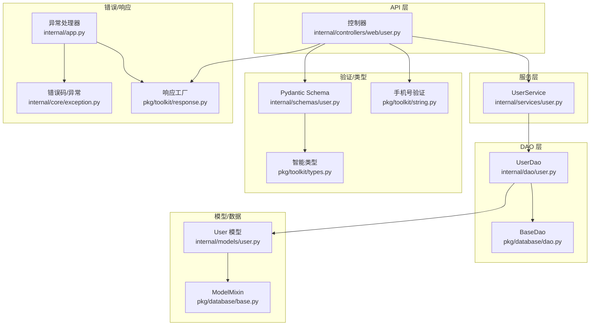
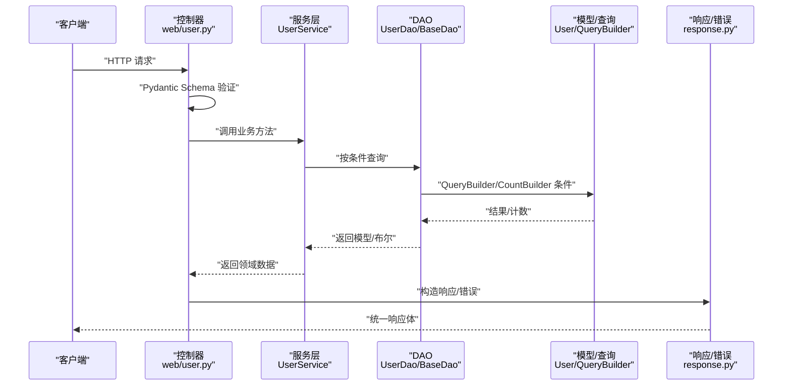
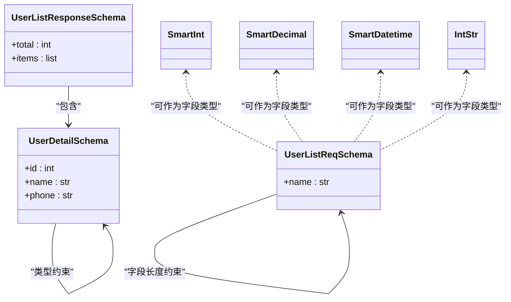
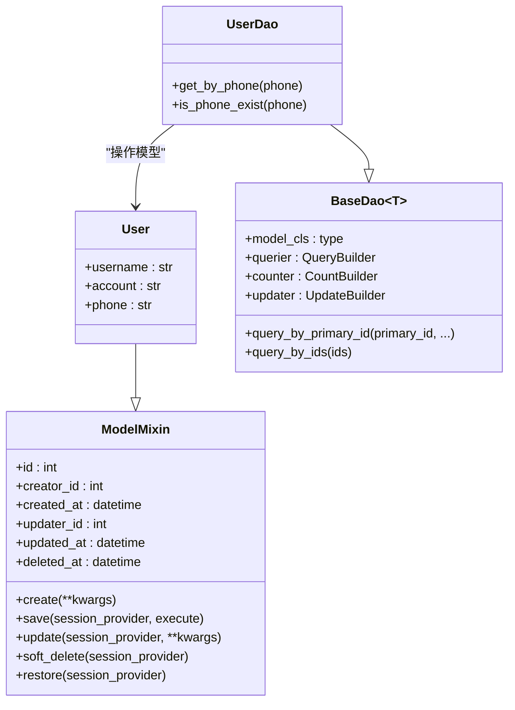
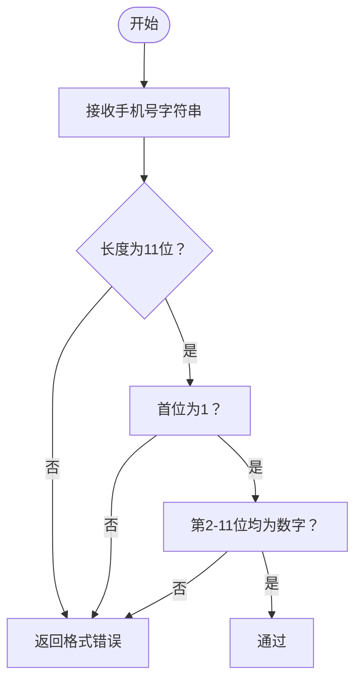
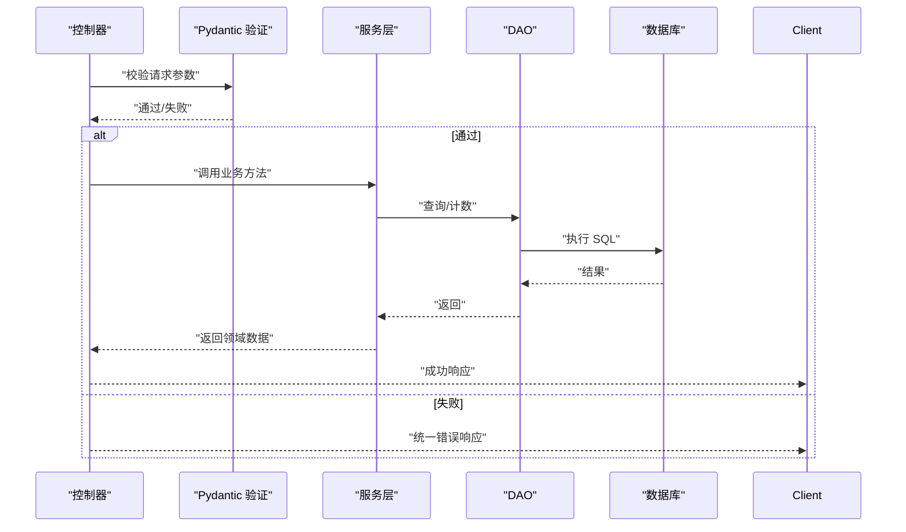
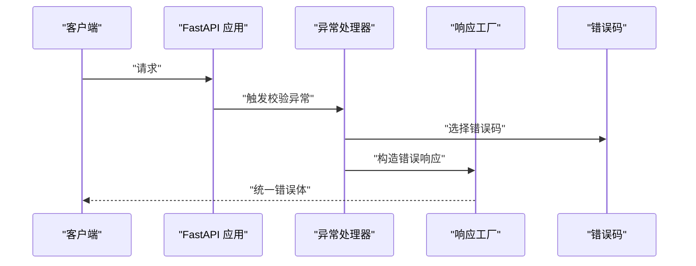
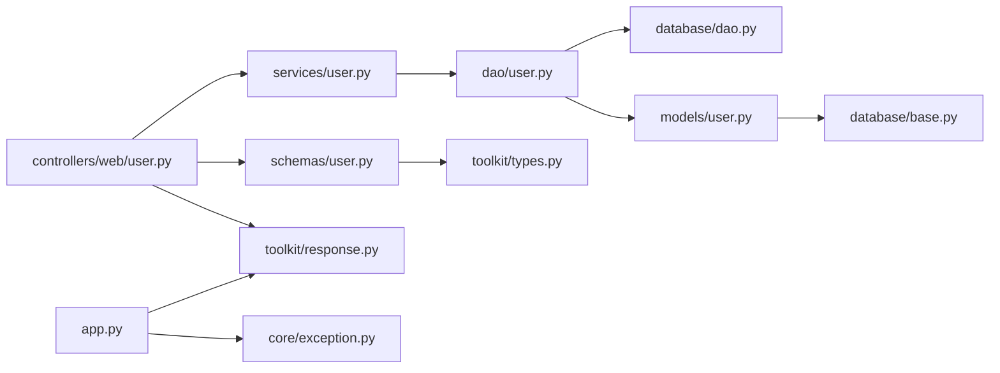

# 数据验证规则

<cite>
**本文引用的文件**
- [internal/models/user.py](file://internal/models/user.py)
- [internal/schemas/user.py](file://internal/schemas/user.py)
- [internal/dtos/user.py](file://internal/dtos/user.py)
- [internal/services/user.py](file://internal/services/user.py)
- [internal/dao/user.py](file://internal/dao/user.py)
- [pkg/database/base.py](file://pkg/database/base.py)
- [pkg/database/dao.py](file://pkg/database/dao.py)
- [pkg/toolkit/string.py](file://pkg/toolkit/string.py)
- [pkg/toolkit/types.py](file://pkg/toolkit/types.py)
- [internal/core/exception.py](file://internal/core/exception.py)
- [pkg/toolkit/response.py](file://pkg/toolkit/response.py)
- [internal/app.py](file://internal/app.py)
- [internal/config/load_config.py](file://internal/config/load_config.py)
</cite>

## 目录
1. [简介](#简介)
2. [项目结构](#项目结构)
3. [核心组件](#核心组件)
4. [架构总览](#架构总览)
5. [详细组件分析](#详细组件分析)
6. [依赖关系分析](#依赖关系分析)
7. [性能考量](#性能考量)
8. [故障排查指南](#故障排查指南)
9. [结论](#结论)
10. [附录](#附录)

## 简介
本文件系统化梳理本项目的“数据验证规则”，覆盖以下层面：
- Pydantic 模型验证规则：字段长度、类型、序列化行为等
- SQLAlchemy 字段约束与模型定义
- 业务逻辑验证：手机号格式校验、智能类型转换与序列化
- API 层、服务层、DAO 层的验证职责划分
- 错误处理与用户友好的错误信息
- 自定义验证器与智能类型（SmartInt、SmartDecimal、SmartDatetime、IntStr）的创建与使用
- 性能优化策略与最佳实践

## 项目结构
围绕用户数据的验证与流转，关键文件分布如下：
- 模型层：SQLAlchemy 模型定义与通用 Mixin
- DTO 层：领域数据传输对象，负责模型与响应 Schema 的桥接
- Schema 层：Pydantic 请求/响应模型，承担字段级验证
- 服务层：业务编排，调用 DAO
- DAO 层：数据访问，封装查询与计数
- 工具层：字符串与智能类型验证器、响应与错误模型
- 应用层：FastAPI 异常处理器与全局错误码

图表来源
- [internal/controllers/web/user.py](file://internal/controllers/web/user.py#L1-L17)
- [internal/services/user.py](file://internal/services/user.py#L1-L21)
- [internal/dao/user.py](file://internal/dao/user.py#L1-L24)
- [pkg/database/dao.py](file://pkg/database/dao.py#L1-L203)
- [internal/models/user.py](file://internal/models/user.py#L1-L13)
- [pkg/database/base.py](file://pkg/database/base.py#L48-L364)
- [internal/schemas/user.py](file://internal/schemas/user.py#L1-L21)
- [pkg/toolkit/types.py](file://pkg/toolkit/types.py#L1-L245)
- [pkg/toolkit/string.py](file://pkg/toolkit/string.py#L52-L64)
- [internal/core/exception.py](file://internal/core/exception.py#L1-L38)
- [pkg/toolkit/response.py](file://pkg/toolkit/response.py#L1-L233)
- [internal/app.py](file://internal/app.py#L48-L53)

章节来源
- [internal/models/user.py](file://internal/models/user.py#L1-L13)
- [internal/schemas/user.py](file://internal/schemas/user.py#L1-L21)
- [internal/dtos/user.py](file://internal/dtos/user.py#L1-L20)
- [internal/services/user.py](file://internal/services/user.py#L1-L21)
- [internal/dao/user.py](file://internal/dao/user.py#L1-L24)
- [pkg/database/base.py](file://pkg/database/base.py#L48-L364)
- [pkg/database/dao.py](file://pkg/database/dao.py#L1-L203)
- [pkg/toolkit/string.py](file://pkg/toolkit/string.py#L52-L64)
- [pkg/toolkit/types.py](file://pkg/toolkit/types.py#L1-L245)
- [internal/core/exception.py](file://internal/core/exception.py#L1-L38)
- [pkg/toolkit/response.py](file://pkg/toolkit/response.py#L1-L233)
- [internal/app.py](file://internal/app.py#L48-L53)

## 核心组件
- 用户模型与字段约束
  - 用户名、账户名、手机号在模型层以固定长度字符串类型定义，体现数据库层面的长度约束与可空性特征。
- Pydantic Schema 验证
  - 列表请求 Schema 对字段长度进行约束；响应 Schema 明确字段类型。
- DTO 与模型映射
  - DTO 将 ORM 模型转换为响应 Schema，确保对外输出的一致性。
- DAO 与 BaseDao
  - DAO 封装查询与计数，基于 QueryBuilder/CountBuilder 实现链式条件构建。
- 工具与智能类型
  - 字符串工具提供手机号格式校验；智能类型（SmartInt、SmartDecimal、SmartDatetime、IntStr）提供输入解析与 JSON 序列化策略。
- 错误与响应
  - 全局错误码与 AppError；统一响应体与错误响应工厂；FastAPI 异常处理器捕获校验错误并返回统一格式。

章节来源
- [internal/models/user.py](file://internal/models/user.py#L10-L12)
- [internal/schemas/user.py](file://internal/schemas/user.py#L8-L20)
- [internal/dtos/user.py](file://internal/dtos/user.py#L7-L19)
- [pkg/database/dao.py](file://pkg/database/dao.py#L15-L91)
- [pkg/toolkit/string.py](file://pkg/toolkit/string.py#L52-L64)
- [pkg/toolkit/types.py](file://pkg/toolkit/types.py#L48-L197)
- [internal/core/exception.py](file://internal/core/exception.py#L19-L37)
- [pkg/toolkit/response.py](file://pkg/toolkit/response.py#L14-L200)
- [internal/app.py](file://internal/app.py#L48-L53)

## 架构总览
下图展示从 API 到 DAO 的数据验证与流转路径，标注各层的验证职责与错误处理。

图表来源
- [internal/controllers/web/user.py](file://internal/controllers/web/user.py#L13-L16)
- [internal/services/user.py](file://internal/services/user.py#L13-L15)
- [internal/dao/user.py](file://internal/dao/user.py#L9-L17)
- [pkg/database/dao.py](file://pkg/database/dao.py#L47-L91)
- [pkg/toolkit/response.py](file://pkg/toolkit/response.py#L134-L169)

## 详细组件分析

### Pydantic 模型与字段验证
- 列表请求 Schema 对字段长度进行约束，确保输入满足最小/最大长度要求。
- 响应 Schema 明确字段类型，便于序列化与前端消费。
- 智能类型注解（SmartInt、SmartDecimal、SmartDatetime、IntStr）提供：
  - 输入前验证器：将前端传入的字符串/数字/时间字符串解析为后端内部类型
  - JSON 序列化器：在 JSON 层面按需返回数字或字符串，兼顾精度与前端兼容性
  - JSON Schema 描述：向 OpenAPI 文档暴露更准确的类型与示例

图表来源
- [internal/schemas/user.py](file://internal/schemas/user.py#L8-L20)
- [pkg/toolkit/types.py](file://pkg/toolkit/types.py#L48-L197)

章节来源
- [internal/schemas/user.py](file://internal/schemas/user.py#L8-L20)
- [pkg/toolkit/types.py](file://pkg/toolkit/types.py#L48-L197)

### SQLAlchemy 字段约束与模型定义
- 用户模型字段采用字符串类型并指定长度，体现数据库层面的长度约束。
- ModelMixin 提供通用字段（如 id、creator_id、created_at、updated_at、deleted_at）与批量插入/更新、软删恢复等能力。
- BaseDao 封装查询、计数、更新构建器，支持链式条件与事务执行。

图表来源
- [pkg/database/base.py](file://pkg/database/base.py#L60-L364)
- [internal/models/user.py](file://internal/models/user.py#L7-L12)
- [pkg/database/dao.py](file://pkg/database/dao.py#L15-L104)
- [internal/dao/user.py](file://internal/dao/user.py#L6-L17)

章节来源
- [internal/models/user.py](file://internal/models/user.py#L10-L12)
- [pkg/database/base.py](file://pkg/database/base.py#L60-L364)
- [pkg/database/dao.py](file://pkg/database/dao.py#L15-L104)
- [internal/dao/user.py](file://internal/dao/user.py#L6-L17)

### 业务逻辑验证：手机号格式
- 工具函数提供中国大陆手机号格式校验，匹配以 1 开头、第二位 3-9、共 11 位数字的规则。
- 建议在服务层或控制器层对手机号进行显式校验，结合全局错误码返回统一错误响应。

图表来源
- [pkg/toolkit/string.py](file://pkg/toolkit/string.py#L52-L64)

章节来源
- [pkg/toolkit/string.py](file://pkg/toolkit/string.py#L52-L64)

### DTO 与模型映射
- DTO 将 ORM 模型集合转换为响应 Schema，确保对外输出字段与类型一致。
- 提供 to_dict 以适配分页等场景的字典结构。

章节来源
- [internal/dtos/user.py](file://internal/dtos/user.py#L7-L19)

### API 层、服务层与 DAO 层的验证职责
- API 层（控制器）：负责请求参数的 Pydantic 验证与统一错误响应；必要时进行业务前置校验（如手机号格式）。
- 服务层：编排业务流程，调用 DAO；可进行领域内业务规则校验。
- DAO 层：执行数据库查询/计数；通过 QueryBuilder/CountBuilder 构建条件，避免重复校验。

图表来源
- [internal/controllers/web/user.py](file://internal/controllers/web/user.py#L13-L16)
- [internal/services/user.py](file://internal/services/user.py#L13-L15)
- [internal/dao/user.py](file://internal/dao/user.py#L9-L17)
- [internal/app.py](file://internal/app.py#L48-L53)

章节来源
- [internal/controllers/web/user.py](file://internal/controllers/web/user.py#L13-L16)
- [internal/services/user.py](file://internal/services/user.py#L13-L15)
- [internal/dao/user.py](file://internal/dao/user.py#L9-L17)
- [internal/app.py](file://internal/app.py#L48-L53)

### 自定义验证器与智能类型使用
- 自定义验证器
  - 使用 Pydantic 的 BeforeValidator 注入输入解析逻辑，如 SmartInt、SmartDecimal、SmartDatetime、IntStr。
  - 结合 PlainSerializer 控制 JSON 输出类型，如超安全整数范围转字符串，高精度小数转字符串。
- 智能类型示例
  - SmartInt：统一解析字符串/整数为整型，JSON 层在 JS 安全范围内返回数字，超出范围返回字符串。
  - SmartDecimal：统一解析字符串/浮点为 Decimal，JSON 层在安全范围内返回浮点，否则返回字符串。
  - SmartDatetime：统一解析 ISO 字符串或 datetime 对象为 UTC 的 naive datetime，JSON 层统一序列化为 ISO 字符串。
  - IntStr：强制序列化为字符串，适用于需要字符串 ID 的场景。

章节来源
- [pkg/toolkit/types.py](file://pkg/toolkit/types.py#L19-L197)

### 错误处理与用户友好信息
- 全局错误码与 AppError：定义统一的状态码与多语言文案。
- 响应工厂：统一成功/错误响应结构，支持 Pydantic 模型自动序列化。
- FastAPI 异常处理器：捕获 RequestValidationError，返回统一错误响应。

图表来源
- [internal/app.py](file://internal/app.py#L48-L53)
- [pkg/toolkit/response.py](file://pkg/toolkit/response.py#L151-L169)
- [internal/core/exception.py](file://internal/core/exception.py#L19-L37)

章节来源
- [internal/app.py](file://internal/app.py#L48-L53)
- [pkg/toolkit/response.py](file://pkg/toolkit/response.py#L151-L169)
- [internal/core/exception.py](file://internal/core/exception.py#L19-L37)

## 依赖关系分析
- 控制器依赖服务层；服务层依赖 DAO；DAO 依赖 BaseDao 与模型；模型依赖 ModelMixin。
- Schema 与智能类型在 API 层被广泛使用，贯穿请求解析与响应序列化。
- 错误处理与响应工厂在应用层集中注册，形成统一出口。

图表来源
- [internal/controllers/web/user.py](file://internal/controllers/web/user.py#L1-L17)
- [internal/services/user.py](file://internal/services/user.py#L1-L21)
- [internal/dao/user.py](file://internal/dao/user.py#L1-L24)
- [pkg/database/dao.py](file://pkg/database/dao.py#L1-L203)
- [internal/models/user.py](file://internal/models/user.py#L1-L13)
- [pkg/database/base.py](file://pkg/database/base.py#L48-L364)
- [internal/schemas/user.py](file://internal/schemas/user.py#L1-L21)
- [pkg/toolkit/types.py](file://pkg/toolkit/types.py#L1-L245)
- [pkg/toolkit/response.py](file://pkg/toolkit/response.py#L1-L233)
- [internal/app.py](file://internal/app.py#L48-L53)
- [internal/core/exception.py](file://internal/core/exception.py#L1-L38)

章节来源
- [internal/controllers/web/user.py](file://internal/controllers/web/user.py#L1-L17)
- [internal/services/user.py](file://internal/services/user.py#L1-L21)
- [internal/dao/user.py](file://internal/dao/user.py#L1-L24)
- [pkg/database/dao.py](file://pkg/database/dao.py#L1-L203)
- [internal/models/user.py](file://internal/models/user.py#L1-L13)
- [pkg/database/base.py](file://pkg/database/base.py#L48-L364)
- [internal/schemas/user.py](file://internal/schemas/user.py#L1-L21)
- [pkg/toolkit/types.py](file://pkg/toolkit/types.py#L1-L245)
- [pkg/toolkit/response.py](file://pkg/toolkit/response.py#L1-L233)
- [internal/app.py](file://internal/app.py#L48-L53)
- [internal/core/exception.py](file://internal/core/exception.py#L1-L38)

## 性能考量
- Pydantic 验证开销
  - 使用 BeforeValidator/PlainSerializer 的智能类型可减少额外转换成本；尽量在 Schema 层一次性完成解析与校验。
- 数据库访问
  - DAO 层使用 QueryBuilder/CountBuilder 链式构建条件，避免手写 SQL 的重复与错误；合理使用计数器减少不必要的全量查询。
- 响应序列化
  - 使用统一的响应工厂与 orjson 序列化，减少序列化开销与一致性问题。
- 事务与批量操作
  - 对于批量插入/更新，优先使用 ModelMixin 的批量接口或 DAO 的批量方法，降低网络往返与事务开销。

## 故障排查指南
- 校验失败
  - FastAPI 的 RequestValidationError 会被统一异常处理器捕获，返回统一错误响应；检查请求体是否满足 Schema 约束与智能类型要求。
- 手机号格式错误
  - 确认手机号长度为 11 位、以 1 开头、第二位为 3-9、其余为数字；在服务层或控制器层显式校验并返回统一错误。
- 响应数据类型不符
  - 确保返回给响应工厂的数据为 dict/list/Pydantic 模型之一；否则会抛出类型错误。

章节来源
- [internal/app.py](file://internal/app.py#L48-L53)
- [pkg/toolkit/response.py](file://pkg/toolkit/response.py#L114-L133)
- [pkg/toolkit/string.py](file://pkg/toolkit/string.py#L52-L64)

## 结论
本项目在多层实现了完善的数据验证与错误处理：
- API 层通过 Pydantic Schema 与智能类型完成字段级与格式级验证
- 模型层通过 SQLAlchemy 字段长度约束保障数据库一致性
- 服务层与 DAO 层通过链式查询与事务控制提升可靠性
- 应用层统一异常处理与响应格式，确保用户体验与可观测性

建议在新增字段时同步补充 Schema 约束与智能类型，保持“输入即验证”的原则，并在服务层补充必要的业务规则校验。

## 附录
- 字段与规则速览
  - 用户名/账户名：长度约束（Schema 层）、字符串类型（模型层）
  - 手机号：长度 11 位、格式校验（工具层）、字符串类型（模型层）
  - 响应字段：明确类型与结构（Schema 层），统一序列化（响应工厂）