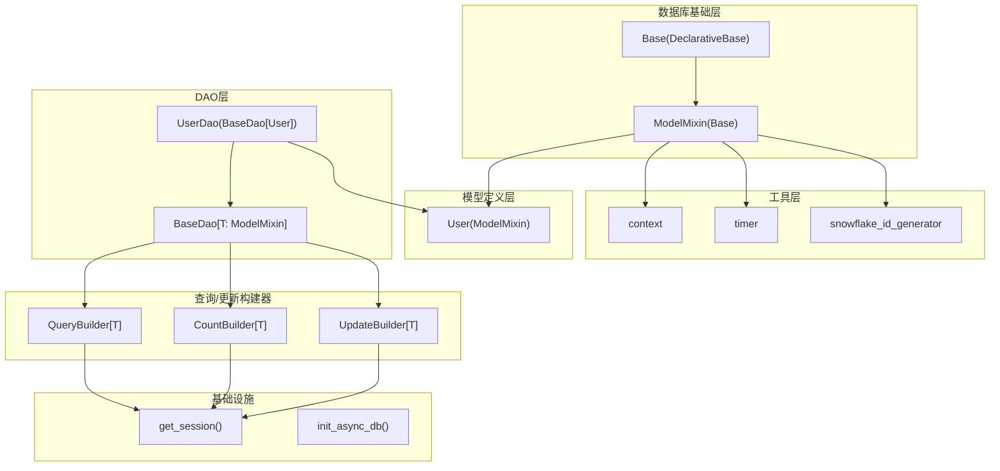
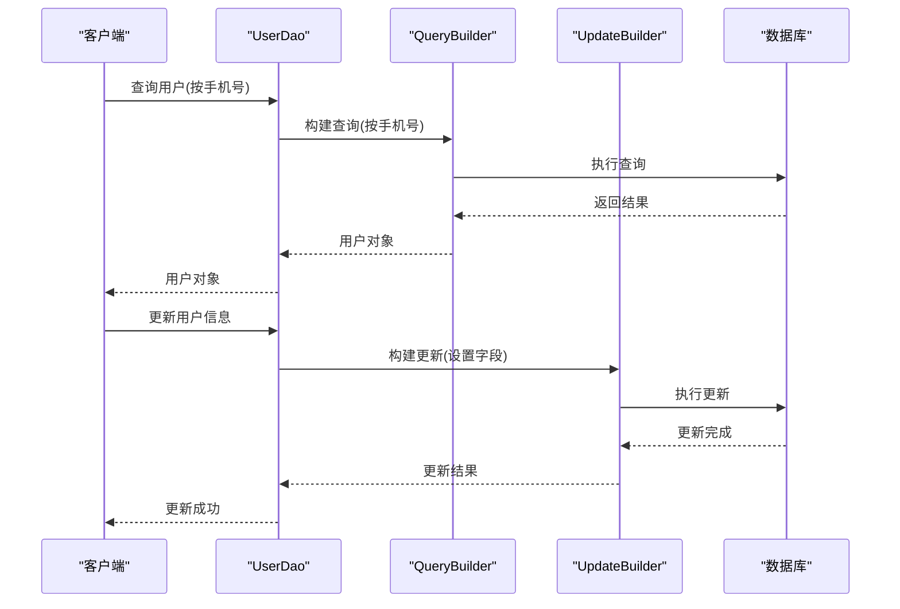
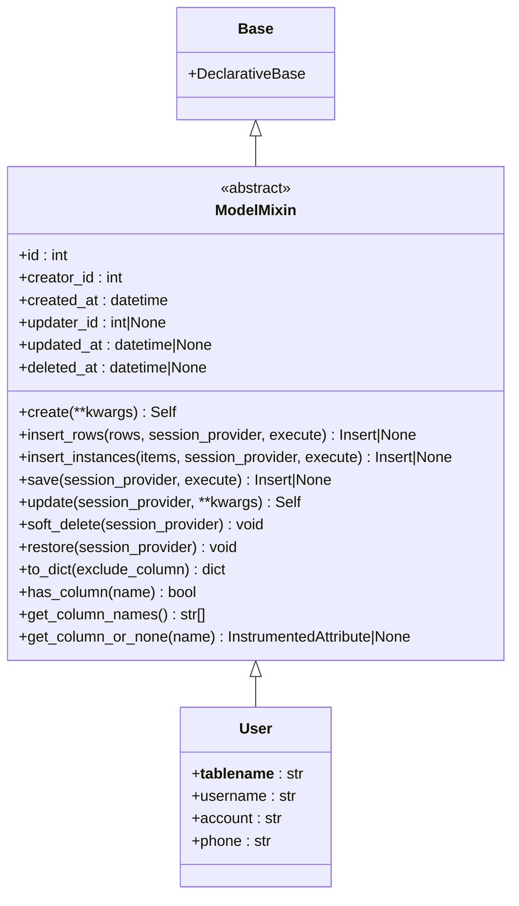
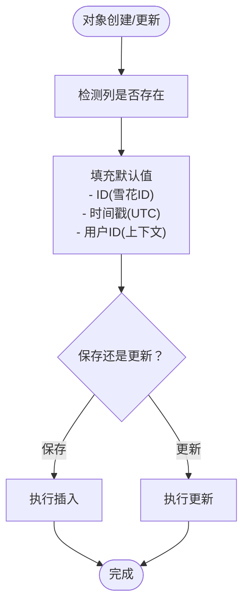
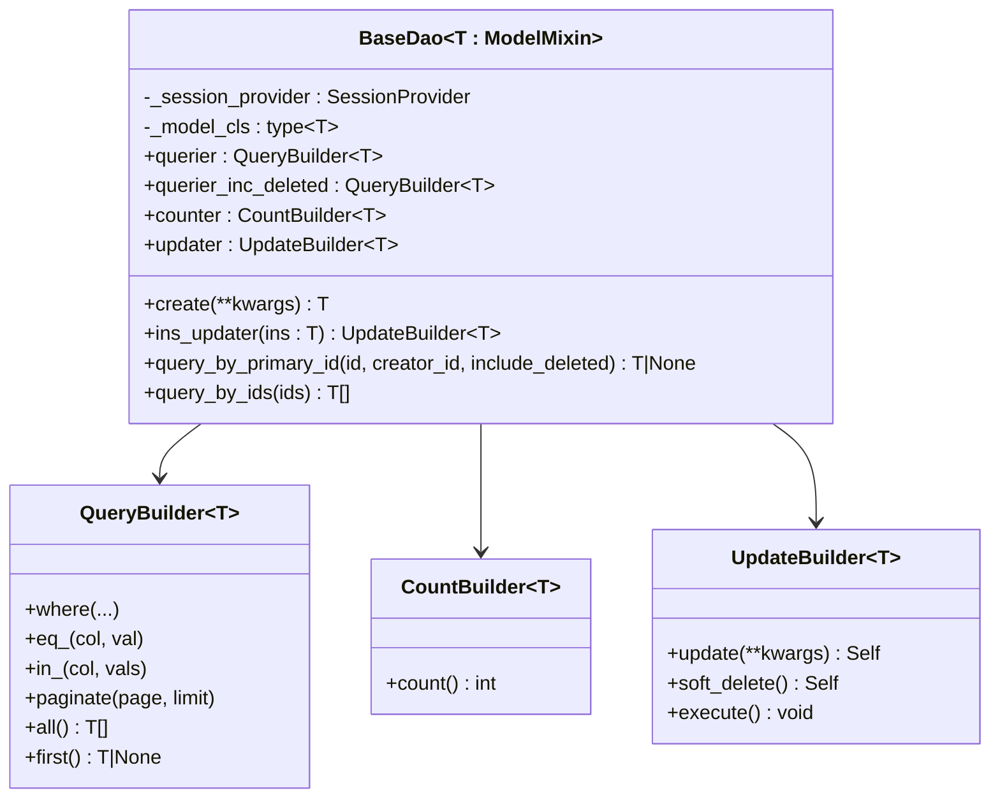
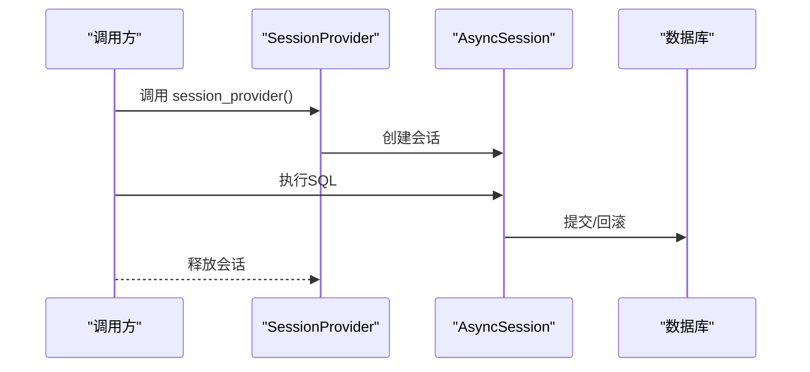
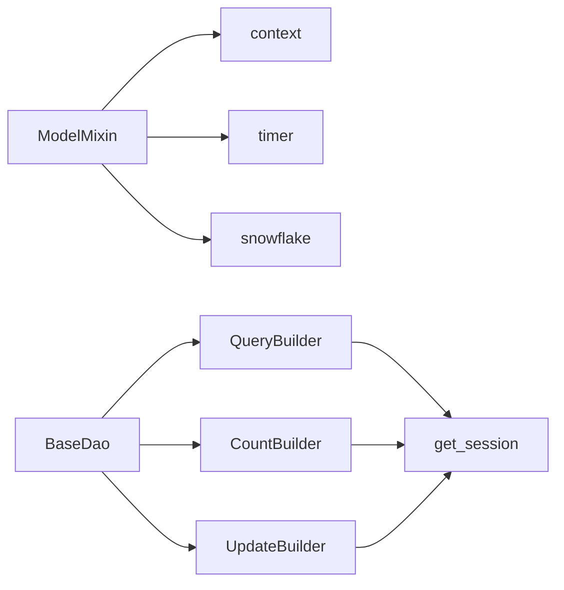

# 模型继承体系

<cite>
**本文档引用的文件**
- [pkg/database/base.py](file://pkg/database/base.py)
- [internal/models/user.py](file://internal/models/user.py)
- [pkg/database/dao.py](file://pkg/database/dao.py)
- [internal/dao/user.py](file://internal/dao/user.py)
- [pkg/database/builder.py](file://pkg/database/builder.py)
- [internal/infra/database.py](file://internal/infra/database.py)
- [pkg/toolkit/context.py](file://pkg/toolkit/context.py)
- [pkg/toolkit/timer.py](file://pkg/toolkit/timer.py)
- [pkg/toolkit/inter.py](file://pkg/toolkit/inter.py)
- [tests/orm/test_orm.py](file://tests/orm/test_orm.py)
</cite>

## 目录
1. [简介](#简介)
2. [项目结构](#项目结构)
3. [核心组件](#核心组件)
4. [架构总览](#架构总览)
5. [详细组件分析](#详细组件分析)
6. [依赖关系分析](#依赖关系分析)
7. [性能考量](#性能考量)
8. [故障排查指南](#故障排查指南)
9. [结论](#结论)
10. [附录](#附录)

## 简介
本文件系统性阐述本项目的模型继承体系，重点围绕 ModelMixin 基类的设计理念与实现机制，解释其如何为所有数据模型提供通用能力（自动时间戳、软删除、雪花ID主键等），并说明子类如何重写或扩展这些功能。同时给出最佳实践、使用示例、安全考虑与性能影响分析，帮助开发者正确创建新的模型类并高效维护模型层。

## 项目结构
模型继承体系主要分布在以下模块：
- 数据库基础层：ModelMixin、Base、SessionProvider 等
- 模型定义层：具体业务模型（如 User）
- DAO 层：统一的数据访问接口，基于泛型与类型约束
- 查询/更新构建器：Query、Count、Update 构建器
- 基础设施：数据库引擎与会话提供者
- 工具层：上下文、时间、雪花ID生成器

图表来源
- [pkg/database/base.py](file://pkg/database/base.py#L48-L364)
- [internal/models/user.py](file://internal/models/user.py#L1-L13)
- [pkg/database/dao.py](file://pkg/database/dao.py#L15-L203)
- [internal/dao/user.py](file://internal/dao/user.py#L1-L24)
- [pkg/database/builder.py](file://pkg/database/builder.py#L18-L273)
- [internal/infra/database.py](file://internal/infra/database.py#L85-L111)
- [pkg/toolkit/context.py](file://pkg/toolkit/context.py#L1-L107)
- [pkg/toolkit/timer.py](file://pkg/toolkit/timer.py#L75-L80)
- [pkg/toolkit/inter.py](file://pkg/toolkit/inter.py#L21-L37)

章节来源
- [pkg/database/base.py](file://pkg/database/base.py#L48-L364)
- [internal/models/user.py](file://internal/models/user.py#L1-L13)
- [pkg/database/dao.py](file://pkg/database/dao.py#L15-L203)
- [internal/dao/user.py](file://internal/dao/user.py#L1-L24)
- [pkg/database/builder.py](file://pkg/database/builder.py#L18-L273)
- [internal/infra/database.py](file://internal/infra/database.py#L85-L111)

## 核心组件
- ModelMixin：声明式ORM模型的抽象基类，提供统一的字段、工厂方法、CRUD、软删除、反射与元数据工具。
- Base：SQLAlchemy 2.x 声明式基类，作为 ModelMixin 的父类。
- BaseDao[T]：DAO 抽象基类，提供查询构建器、计数器、更新器及常用查询方法。
- QueryBuilder/CountBuilder/UpdateBuilder：类型安全的查询、计数与更新构建器，支持软删除过滤。
- SessionProvider：会话提供者类型别名，统一异步会话管理。
- 上下文与工具：context（请求上下文）、timer（UTC时间）、snowflake（雪花ID生成器）。

章节来源
- [pkg/database/base.py](file://pkg/database/base.py#L48-L364)
- [pkg/database/dao.py](file://pkg/database/dao.py#L15-L203)
- [pkg/database/builder.py](file://pkg/database/builder.py#L18-L273)

## 架构总览
ModelMixin 通过统一的字段定义与方法，为所有业务模型提供一致的生命周期管理与操作接口。DAO 层通过泛型约束确保类型安全，查询/更新构建器提供链式条件构造与自动软删除过滤。会话提供者贯穿整个流程，保证事务一致性与资源管理。

图表来源
- [internal/dao/user.py](file://internal/dao/user.py#L9-L17)
- [pkg/database/builder.py](file://pkg/database/builder.py#L111-L162)
- [pkg/database/builder.py](file://pkg/database/builder.py#L192-L261)

## 详细组件分析

### ModelMixin 基类设计与实现
ModelMixin 是所有业务模型的抽象基类，具备以下特性：
- 统一字段：主键、创建/更新/删除时间戳、创建者/更新者标识。
- 工厂方法：create、insert_rows、insert_instances。
- CRUD：save（严格插入）、update（严格更新）、软删除/恢复。
- 字段补全：插入/更新时自动填充时间戳与用户ID。
- 反射与元数据：列名、是否存在某列、列对象获取等。
- 通用序列化：to_dict。

图表来源
- [pkg/database/base.py](file://pkg/database/base.py#L60-L364)
- [internal/models/user.py](file://internal/models/user.py#L7-L13)

章节来源
- [pkg/database/base.py](file://pkg/database/base.py#L60-L364)
- [internal/models/user.py](file://internal/models/user.py#L7-L13)

### 字段与自动时间戳、软删除机制
- 主键：采用 BigInteger 类型的自增主键（在本仓库中使用雪花ID生成器替代数据库自增）。
- 时间戳：created_at/updated_at 在插入/更新时自动填充当前UTC时间（naive）。
- 软删除：通过 deleted_at 字段实现，查询构建器默认过滤 deleted_at IS NULL；UpdateBuilder 支持 soft_delete。
- 用户ID：creator_id/updater_id 从上下文获取，要求中间件初始化上下文。

图表来源
- [pkg/database/base.py](file://pkg/database/base.py#L225-L251)
- [pkg/toolkit/context.py](file://pkg/toolkit/context.py#L82-L86)
- [pkg/toolkit/timer.py](file://pkg/toolkit/timer.py#L75-L80)
- [pkg/toolkit/inter.py](file://pkg/toolkit/inter.py#L29-L33)

章节来源
- [pkg/database/base.py](file://pkg/database/base.py#L68-L74)
- [pkg/database/base.py](file://pkg/database/base.py#L225-L251)
- [pkg/toolkit/context.py](file://pkg/toolkit/context.py#L82-L86)
- [pkg/toolkit/timer.py](file://pkg/toolkit/timer.py#L75-L80)
- [pkg/toolkit/inter.py](file://pkg/toolkit/inter.py#L29-L33)

### DAO 与查询构建器
- BaseDao[T]：通过泛型约束确保 DAO 作用于特定模型类型；提供查询构建器、计数器、更新器与常用查询方法。
- QueryBuilder：支持 where/equal/in/paginate 等链式条件，自动应用软删除过滤。
- CountBuilder：支持 distinct 计数与软删除过滤。
- UpdateBuilder：支持 update 与 soft_delete，自动同步 updated_at/updater_id。

图表来源
- [pkg/database/dao.py](file://pkg/database/dao.py#L15-L203)
- [pkg/database/builder.py](file://pkg/database/builder.py#L111-L162)
- [pkg/database/builder.py](file://pkg/database/builder.py#L164-L189)
- [pkg/database/builder.py](file://pkg/database/builder.py#L192-L261)

章节来源
- [pkg/database/dao.py](file://pkg/database/dao.py#L15-L203)
- [pkg/database/builder.py](file://pkg/database/builder.py#L111-L162)
- [pkg/database/builder.py](file://pkg/database/builder.py#L164-L189)
- [pkg/database/builder.py](file://pkg/database/builder.py#L192-L261)

### 会话提供者与事务管理
- SessionProvider：会话提供者类型别名，统一异步会话管理。
- get_session：上下文管理器，负责创建/回收会话，支持自动回滚。
- init_async_db：初始化数据库引擎与会话工厂，注册SQL监控事件。

图表来源
- [internal/infra/database.py](file://internal/infra/database.py#L85-L111)
- [pkg/database/base.py](file://pkg/database/base.py#L283-L304)

章节来源
- [internal/infra/database.py](file://internal/infra/database.py#L85-L111)
- [pkg/database/base.py](file://pkg/database/base.py#L283-L304)

### 子类重写与扩展
- 在子类中可选择性覆盖字段定义（如增加业务字段），但建议遵循统一命名与类型约束。
- 若需自定义主键策略，可在子类中覆盖 create/save 的默认行为，但需确保与框架其他组件（如 DAO、构建器）兼容。
- 如需扩展软删除逻辑，可通过在子类中新增 deleted_at 字段并配合 QueryBuilder/UpdateBuilder 的软删除过滤。

章节来源
- [internal/models/user.py](file://internal/models/user.py#L7-L13)
- [pkg/database/builder.py](file://pkg/database/builder.py#L106-L108)

## 依赖关系分析
- ModelMixin 依赖上下文、时间工具与雪花ID生成器，确保默认值的正确性与时效性。
- DAO 层依赖构建器与会话提供者，形成清晰的职责分离。
- 查询构建器在查询时自动应用软删除过滤，避免误读已删除数据。
- 会话提供者贯穿所有操作，保证事务一致性与资源回收。

图表来源
- [pkg/database/base.py](file://pkg/database/base.py#L222-L223)
- [pkg/database/dao.py](file://pkg/database/dao.py#L15-L203)
- [pkg/database/builder.py](file://pkg/database/builder.py#L18-L273)
- [internal/infra/database.py](file://internal/infra/database.py#L85-L111)

章节来源
- [pkg/database/base.py](file://pkg/database/base.py#L222-L223)
- [pkg/database/dao.py](file://pkg/database/dao.py#L15-L203)
- [pkg/database/builder.py](file://pkg/database/builder.py#L18-L273)
- [internal/infra/database.py](file://internal/infra/database.py#L85-L111)

## 性能考量
- 雪花ID：避免数据库自增带来的并发瓶颈，提升高并发下的ID生成吞吐。
- 批量操作：insert_rows/insert_instances 提供高性能批量插入，减少网络往返。
- 软删除过滤：查询构建器默认过滤 deleted_at IS NULL，避免扫描全表，提高查询效率。
- 事务管理：统一的会话提供者与上下文管理，减少资源泄漏风险。
- JSON序列化：内置 orjson 配置，降低序列化开销。

章节来源
- [pkg/database/base.py](file://pkg/database/base.py#L100-L150)
- [pkg/database/builder.py](file://pkg/database/builder.py#L125-L126)
- [internal/infra/database.py](file://internal/infra/database.py#L39-L49)

## 故障排查指南
- 严格模式错误：save() 仅适用于新建对象，update() 仅适用于已存在对象。若出现运行时错误，请检查对象状态。
- 会话提供者缺失：当 execute=True 时必须提供 session_provider，否则会抛出异常。
- 上下文未初始化：get_user_id 依赖中间件初始化的上下文，未初始化会抛出异常。
- 软删除查询：默认查询不包含已删除数据，如需查询请使用 include_deleted=True 的查询器。
- 空列表 in_ 条件：in_ 不接受空列表，会抛出 ValueError。

章节来源
- [pkg/database/base.py](file://pkg/database/base.py#L156-L200)
- [pkg/database/base.py](file://pkg/database/base.py#L283-L304)
- [pkg/toolkit/context.py](file://pkg/toolkit/context.py#L82-L86)
- [pkg/database/builder.py](file://pkg/database/builder.py#L74-L82)
- [tests/orm/test_orm.py](file://tests/orm/test_orm.py#L204-L206)

## 结论
ModelMixin 通过统一的字段、方法与工具，为所有业务模型提供了标准化的生命周期管理与操作接口。结合 DAO 与查询/更新构建器，实现了类型安全、事务一致与性能优化的模型层架构。遵循本文的最佳实践与安全考虑，可确保新模型的正确继承与高效维护。

## 附录

### 最佳实践
- 继承规则：所有业务模型均应继承 ModelMixin，避免重复定义通用字段。
- 字段命名：遵循统一命名规范（如 created_at、updated_at、deleted_at），便于框架自动处理。
- 软删除：启用软删除字段并在查询时使用默认过滤，避免误删数据。
- 批量操作：优先使用 insert_rows/insert_instances 进行批量插入，提升性能。
- 事务管理：使用统一的会话提供者与上下文管理，确保事务一致性与资源回收。
- ID策略：推荐使用雪花ID生成器，避免数据库自增带来的并发瓶颈。

章节来源
- [pkg/database/base.py](file://pkg/database/base.py#L68-L74)
- [pkg/database/base.py](file://pkg/database/base.py#L100-L150)
- [pkg/database/builder.py](file://pkg/database/builder.py#L125-L126)
- [internal/infra/database.py](file://internal/infra/database.py#L85-L111)

### 使用示例（步骤说明）
- 定义模型：继承 ModelMixin，设置 __tablename__ 与业务字段。
- 定义 DAO：继承 BaseDao[YourModel]，设置 _model_cls 或在构造函数传入 model_cls。
- 查询数据：使用 userDao.querier.eq_(YourModel.field, value).first()。
- 更新数据：使用 userDao.ins_updater(instance).update(field=value).execute()。
- 软删除：使用 userDao.ins_updater(instance).soft_delete().execute()。
- 批量插入：使用 YourModel.insert_rows(rows, session_provider)。

章节来源
- [internal/models/user.py](file://internal/models/user.py#L7-L13)
- [internal/dao/user.py](file://internal/dao/user.py#L6-L17)
- [pkg/database/dao.py](file://pkg/database/dao.py#L43-L90)
- [pkg/database/builder.py](file://pkg/database/builder.py#L208-L261)
- [pkg/database/base.py](file://pkg/database/base.py#L100-L150)

### 安全考虑
- 上下文注入：确保中间件正确初始化上下文，避免 get_user_id 抛出异常。
- 输入校验：UpdateBuilder 会过滤不存在的列，但仍需在上层进行业务校验。
- 事务边界：使用统一的会话提供者，避免跨事务的数据不一致。
- 软删除滥用：软删除仅适用于可恢复场景，避免对敏感数据使用软删除。

章节来源
- [pkg/toolkit/context.py](file://pkg/toolkit/context.py#L82-L86)
- [pkg/database/builder.py](file://pkg/database/builder.py#L210-L212)
- [internal/infra/database.py](file://internal/infra/database.py#L85-L111)