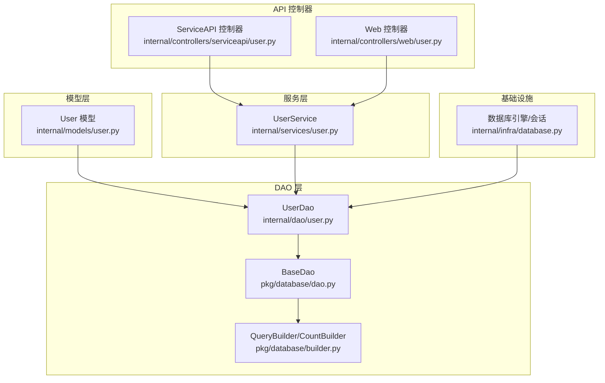
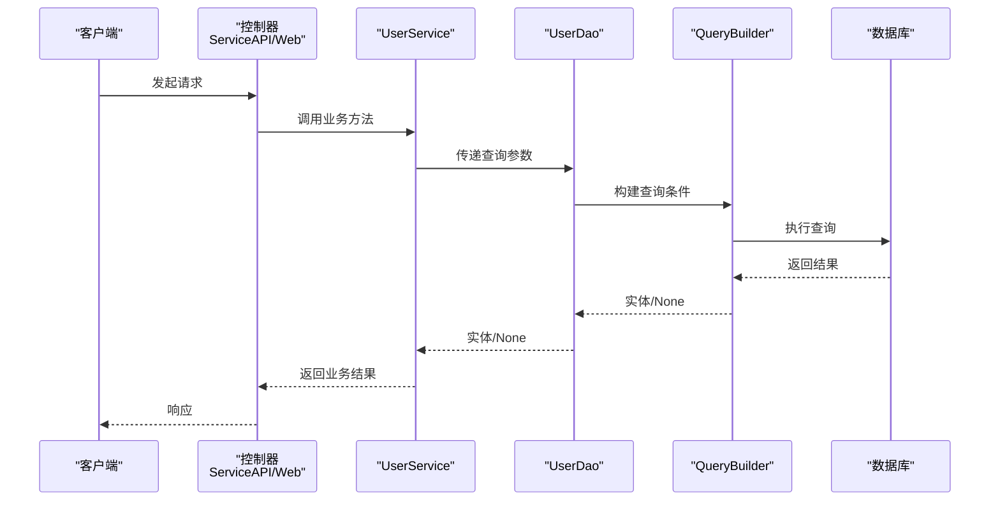
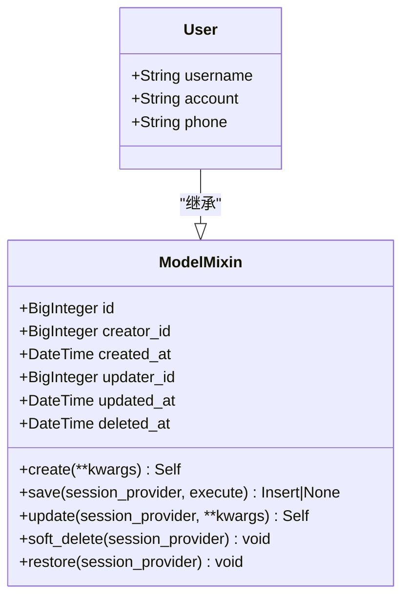
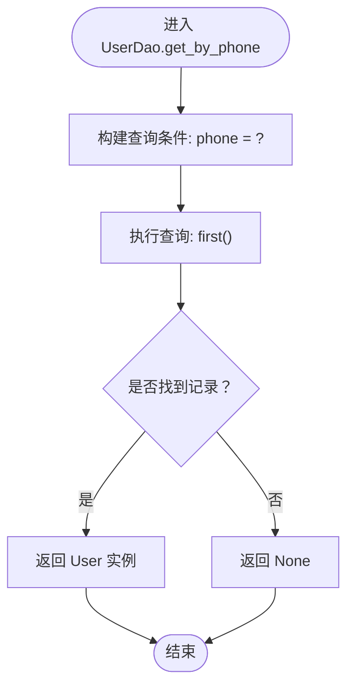
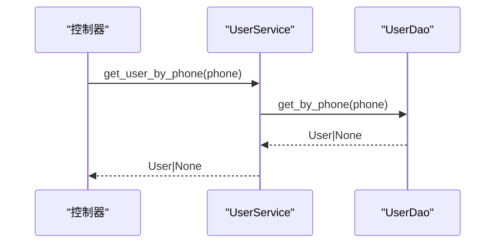
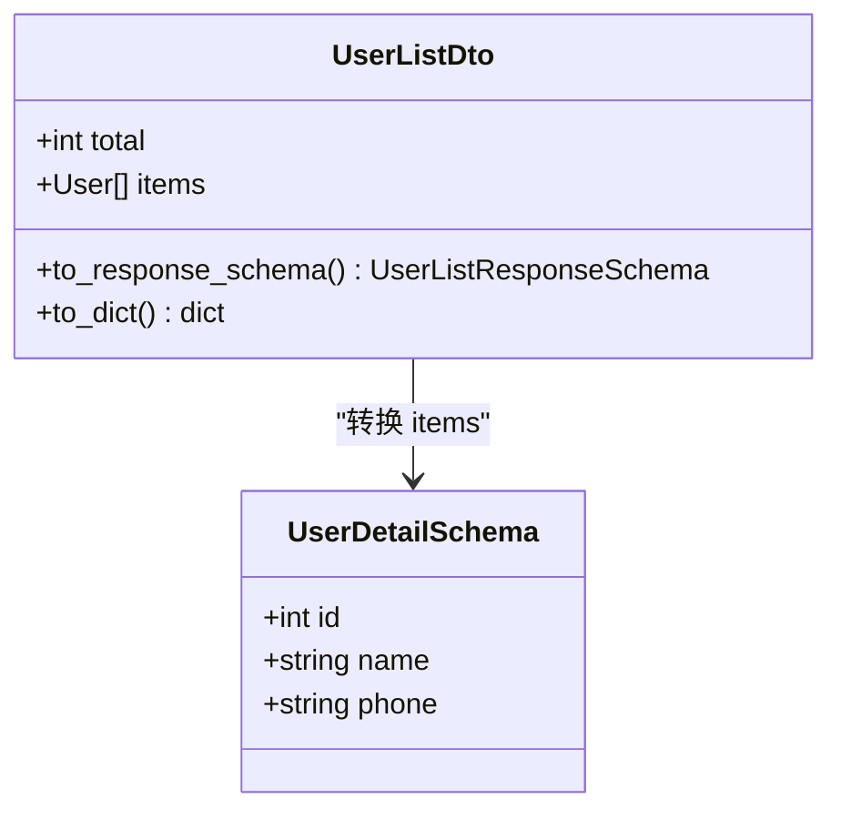

# 用户模型

<cite>
**本文引用的文件**
- [internal/models/user.py](file://internal/models/user.py)
- [pkg/database/base.py](file://pkg/database/base.py)
- [pkg/database/dao.py](file://pkg/database/dao.py)
- [pkg/database/builder.py](file://pkg/database/builder.py)
- [internal/dao/user.py](file://internal/dao/user.py)
- [internal/services/user.py](file://internal/services/user.py)
- [internal/dtos/user.py](file://internal/dtos/user.py)
- [internal/schemas/user.py](file://internal/schemas/user.py)
- [internal/infra/database.py](file://internal/infra/database.py)
- [internal/controllers/serviceapi/user.py](file://internal/controllers/serviceapi/user.py)
- [internal/controllers/web/user.py](file://internal/controllers/web/user.py)
- [tests/orm/test_orm.py](file://tests/orm/test_orm.py)
</cite>

## 目录
1. [简介](#简介)
2. [项目结构](#项目结构)
3. [核心组件](#核心组件)
4. [架构总览](#架构总览)
5. [详细组件分析](#详细组件分析)
6. [依赖分析](#依赖分析)
7. [性能考虑](#性能考虑)
8. [故障排查指南](#故障排查指南)
9. [结论](#结论)
10. [附录](#附录)

## 简介
本文件系统性地文档化用户模型的设计与实现，覆盖字段定义、ORM 映射、数据库表结构、验证规则、业务约束与数据完整性要求，并给出创建、更新、查询、删除操作的实现细节与使用示例路径。同时说明用户模型与 DAO 层、服务层、API 控制器之间的交互方式。

## 项目结构
用户模型位于 internal/models/user.py，采用 SQLAlchemy 2.x 声明式映射，继承通用 ModelMixin 提供统一的 CRUD、软删除、上下文字段填充等能力。DAO 层基于 pkg/database/dao.py 的 BaseDao 封装查询构建器，服务层负责业务编排，API 控制器通过依赖注入使用服务层。



图表来源
- [internal/models/user.py](file://internal/models/user.py#L1-L13)
- [internal/dao/user.py](file://internal/dao/user.py#L1-L24)
- [pkg/database/dao.py](file://pkg/database/dao.py#L1-L203)
- [pkg/database/builder.py](file://pkg/database/builder.py#L1-L200)
- [internal/services/user.py](file://internal/services/user.py#L1-L21)
- [internal/infra/database.py](file://internal/infra/database.py#L1-L154)
- [internal/controllers/serviceapi/user.py](file://internal/controllers/serviceapi/user.py#L1-L21)
- [internal/controllers/web/user.py](file://internal/controllers/web/user.py#L1-L17)

章节来源
- [internal/models/user.py](file://internal/models/user.py#L1-L13)
- [internal/dao/user.py](file://internal/dao/user.py#L1-L24)
- [pkg/database/dao.py](file://pkg/database/dao.py#L1-L203)
- [pkg/database/builder.py](file://pkg/database/builder.py#L1-L200)
- [internal/services/user.py](file://internal/services/user.py#L1-L21)
- [internal/infra/database.py](file://internal/infra/database.py#L1-L154)
- [internal/controllers/serviceapi/user.py](file://internal/controllers/serviceapi/user.py#L1-L21)
- [internal/controllers/web/user.py](file://internal/controllers/web/user.py#L1-L17)

## 核心组件
- 用户模型 User：定义 username、account、phone 三个字段，长度分别为 64、64、11；继承 ModelMixin，具备统一的创建、更新、软删除、上下文字段填充等能力。
- DAO 层 UserDao：基于 BaseDao 封装查询构建器，提供按手机号查询与存在性检查。
- 服务层 UserService：对外暴露业务方法，当前包含按手机号查询。
- DTO/Schemas：UserListDto 与 UserDetailSchema 用于响应序列化与传输。
- 基础设施：数据库引擎与会话管理，提供 SessionProvider。

章节来源
- [internal/models/user.py](file://internal/models/user.py#L1-L13)
- [pkg/database/base.py](file://pkg/database/base.py#L60-L364)
- [internal/dao/user.py](file://internal/dao/user.py#L1-L24)
- [pkg/database/dao.py](file://pkg/database/dao.py#L1-L203)
- [internal/dtos/user.py](file://internal/dtos/user.py#L1-L20)
- [internal/schemas/user.py](file://internal/schemas/user.py#L1-L21)
- [internal/infra/database.py](file://internal/infra/database.py#L1-L154)

## 架构总览
用户模型贯穿“控制器 → 服务层 → DAO 层 → 数据库”的调用链路，使用 SessionProvider 管理会话生命周期，确保事务一致性与资源释放。



图表来源
- [internal/controllers/serviceapi/user.py](file://internal/controllers/serviceapi/user.py#L1-L21)
- [internal/controllers/web/user.py](file://internal/controllers/web/user.py#L1-L17)
- [internal/services/user.py](file://internal/services/user.py#L1-L21)
- [internal/dao/user.py](file://internal/dao/user.py#L1-L24)
- [pkg/database/builder.py](file://pkg/database/builder.py#L111-L163)
- [internal/infra/database.py](file://internal/infra/database.py#L85-L111)

## 详细组件分析

### 用户模型 User
- 字段定义与长度限制
  - username: 字符串，最大长度 64
  - account: 字符串，最大长度 64
  - phone: 字符串，最大长度 11
- ORM 映射与表结构
  - 继承 ModelMixin，自动获得 id、creator_id、created_at、updater_id、updated_at、deleted_at 等通用字段
  - 表名为 user
- 数据完整性与默认值
  - ModelMixin 在创建时填充 id（雪花算法）、created_at、updated_at、creator_id（来自上下文），更新时自动填充 updated_at 与 updater_id
- CRUD 与软删除
  - 支持 save（严格插入）、update（严格更新）、soft_delete（软删除）、restore（恢复）



图表来源
- [internal/models/user.py](file://internal/models/user.py#L1-L13)
- [pkg/database/base.py](file://pkg/database/base.py#L60-L364)

章节来源
- [internal/models/user.py](file://internal/models/user.py#L1-L13)
- [pkg/database/base.py](file://pkg/database/base.py#L60-L364)

### DAO 层：UserDao
- 查询构建器
  - querier：基于 QueryBuilder，按 updated_at 降序排列，排除软删除记录
  - counter：基于 CountBuilder，统计非软删除记录
- 关键方法
  - get_by_phone(phone: str) → User | None：按手机号精确查询第一条
  - is_phone_exist(phone: str) → bool：统计是否存在该手机号



图表来源
- [internal/dao/user.py](file://internal/dao/user.py#L9-L12)
- [pkg/database/dao.py](file://pkg/database/dao.py#L47-L50)
- [pkg/database/builder.py](file://pkg/database/builder.py#L111-L163)

章节来源
- [internal/dao/user.py](file://internal/dao/user.py#L1-L24)
- [pkg/database/dao.py](file://pkg/database/dao.py#L1-L203)
- [pkg/database/builder.py](file://pkg/database/builder.py#L1-L200)

### 服务层：UserService
- 依赖注入
  - 通过 new_user_service() 提供单例 UserService，依赖 UserDao
- 方法
  - get_user_by_phone(phone: str) → User：委托 DAO 查询



图表来源
- [internal/services/user.py](file://internal/services/user.py#L13-L15)
- [internal/dao/user.py](file://internal/dao/user.py#L9-L12)

章节来源
- [internal/services/user.py](file://internal/services/user.py#L1-L21)
- [internal/dao/user.py](file://internal/dao/user.py#L1-L24)

### DTO 与 Schema
- UserListDto：包含 total 与 items（列表元素为 User 实例），提供 to_response_schema() 与 to_dict() 方法
- UserDetailSchema：用于响应序列化，包含 id、name、phone
- 转换逻辑：to_response_schema() 将 User 列表转换为 UserDetailSchema 列表



图表来源
- [internal/dtos/user.py](file://internal/dtos/user.py#L7-L19)
- [internal/schemas/user.py](file://internal/schemas/user.py#L12-L20)

章节来源
- [internal/dtos/user.py](file://internal/dtos/user.py#L1-L20)
- [internal/schemas/user.py](file://internal/schemas/user.py#L1-L21)

### API 控制器
- ServiceAPI 控制器：通过 Depends(new_user_service) 注入 UserService，提供 hello_world 示例接口
- Web 控制器：同样注入 UserService，提供 hello_world 示例接口

章节来源
- [internal/controllers/serviceapi/user.py](file://internal/controllers/serviceapi/user.py#L1-L21)
- [internal/controllers/web/user.py](file://internal/controllers/web/user.py#L1-L17)

### 数据库会话与连接
- init_async_db()/close_async_db()：初始化/关闭数据库引擎与会话工厂
- get_session()：异步上下文管理器，提供会话并处理异常回滚
- BaseDao/ModelMixin：通过 SessionProvider 统一执行 SQL

章节来源
- [internal/infra/database.py](file://internal/infra/database.py#L26-L111)
- [pkg/database/dao.py](file://pkg/database/dao.py#L106-L203)
- [pkg/database/base.py](file://pkg/database/base.py#L283-L304)

## 依赖分析
- 模型与 DAO：UserDao._model_cls 指向 User，BaseDao 提供查询/计数/更新构建器
- 服务与 DAO：UserService 依赖 UserDao
- 控制器与服务：控制器通过依赖注入获取 UserService
- 数据流：控制器 → 服务 → DAO → 查询构建器 → 数据库

```mermaid
graph LR
U["User 模型"] --> UD["UserDao"]
UD --> BD["BaseDao"]
BD --> QB["QueryBuilder/CountBuilder"]
S["UserService"] --> UD
C1["ServiceAPI 控制器"] --> S
C2["Web 控制器"] --> S
DB["数据库"] <- --> QB
```

图表来源
- [internal/models/user.py](file://internal/models/user.py#L1-L13)
- [internal/dao/user.py](file://internal/dao/user.py#L6-L7)
- [pkg/database/dao.py](file://pkg/database/dao.py#L15-L42)
- [pkg/database/builder.py](file://pkg/database/builder.py#L111-L190)
- [internal/services/user.py](file://internal/services/user.py#L6-L7)
- [internal/controllers/serviceapi/user.py](file://internal/controllers/serviceapi/user.py#L11)
- [internal/controllers/web/user.py](file://internal/controllers/web/user.py#L10)

章节来源
- [internal/models/user.py](file://internal/models/user.py#L1-L13)
- [internal/dao/user.py](file://internal/dao/user.py#L1-L24)
- [pkg/database/dao.py](file://pkg/database/dao.py#L1-L203)
- [pkg/database/builder.py](file://pkg/database/builder.py#L1-L200)
- [internal/services/user.py](file://internal/services/user.py#L1-L21)
- [internal/controllers/serviceapi/user.py](file://internal/controllers/serviceapi/user.py#L1-L21)
- [internal/controllers/web/user.py](file://internal/controllers/web/user.py#L1-L17)

## 性能考虑
- 查询构建器：QueryBuilder/CountBuilder 提供链式条件构造与分页，避免一次性加载大量数据
- 事务执行：execute_transaction 支持复杂业务在一个事务内完成，减少往返与锁竞争
- 会话管理：get_session 自动回滚异常，降低资源泄漏风险
- 建议
  - 对高频查询建立合适索引（如 phone）
  - 使用分页参数控制单次查询规模
  - 批量插入使用 ModelMixin.insert_rows/insert_instances

章节来源
- [pkg/database/builder.py](file://pkg/database/builder.py#L111-L163)
- [pkg/database/dao.py](file://pkg/database/dao.py#L106-L203)
- [internal/infra/database.py](file://internal/infra/database.py#L85-L111)

## 故障排查指南
- 插入/更新异常
  - save() 仅用于新对象插入，若对象已存在会抛出异常；update() 仅用于已存在记录更新
- 会话未初始化
  - get_session() 在未调用 init_async_db() 时会抛出异常
- 查询无结果
  - get_by_phone() 返回 None 表示不存在；is_phone_exist() 返回 False
- 事务失败
  - execute_transaction() 会在回调异常时自动回滚并抛出错误

章节来源
- [pkg/database/base.py](file://pkg/database/base.py#L156-L200)
- [internal/infra/database.py](file://internal/infra/database.py#L85-L111)
- [pkg/database/dao.py](file://pkg/database/dao.py#L106-L203)

## 结论
用户模型采用清晰的分层架构：模型层提供字段与通用能力，DAO 层封装查询构建器，服务层编排业务，控制器负责接口接入。通过 SessionProvider 统一会话生命周期，结合查询构建器与事务执行器，保证了数据一致性与可维护性。建议在生产环境中补充字段级校验、索引优化与单元测试覆盖。

## 附录

### 字段定义与约束
- username: 字符串，最大长度 64
- account: 字符串，最大长度 64
- phone: 字符串，最大长度 11
- 通用字段（由 ModelMixin 提供）
  - id: BigInteger 主键（雪花算法）
  - creator_id: BigInteger 创建人
  - created_at: DateTime 创建时间
  - updater_id: BigInteger 更新人
  - updated_at: DateTime 更新时间
  - deleted_at: DateTime 软删除时间

章节来源
- [internal/models/user.py](file://internal/models/user.py#L10-L12)
- [pkg/database/base.py](file://pkg/database/base.py#L68-L74)

### ORM 映射与数据库表结构
- 表名：user
- 字段：id、username、account、phone、creator_id、created_at、updater_id、updated_at、deleted_at
- 约束：id 为主键；建议为 phone 建立唯一索引以满足业务唯一性需求

章节来源
- [internal/models/user.py](file://internal/models/user.py#L8-L12)
- [pkg/database/base.py](file://pkg/database/base.py#L68-L74)

### 验证规则与业务约束
- 字段长度：username、account 最大 64，phone 最大 11
- 唯一性：建议在数据库层面为 phone 建唯一索引
- 软删除：deleted_at 非空表示记录软删除
- 上下文字段：creator_id/updater_id 来源于上下文，默认填充

章节来源
- [internal/models/user.py](file://internal/models/user.py#L10-L12)
- [pkg/database/base.py](file://pkg/database/base.py#L222-L251)

### CRUD 操作实现要点
- 创建
  - 使用 ModelMixin.create(...) 填充默认字段，随后 save(session_provider)
- 更新
  - 使用 update(session_provider, ...) 更新指定字段
- 查询
  - UserDao.get_by_phone(phone) 返回单条记录
  - UserDao.is_phone_exist(phone) 返回布尔值
- 删除
  - 使用 soft_delete(session_provider) 进行软删除
  - 使用 restore(session_provider) 恢复软删除记录

章节来源
- [pkg/database/base.py](file://pkg/database/base.py#L84-L216)
- [internal/dao/user.py](file://internal/dao/user.py#L9-L17)

### 使用示例（代码片段路径）
- 创建用户
  - [创建与保存示例](file://tests/orm/test_orm.py#L122-L134)
- 更新用户
  - [更新示例](file://tests/orm/test_orm.py#L143-L151)
- 查询用户
  - [按主键查询示例](file://tests/orm/test_orm_json_type.py#L124-L129)
  - [按手机号查询示例](file://internal/dao/user.py#L9-L12)
- 服务层调用
  - [服务层方法调用](file://internal/services/user.py#L13-L15)
- 控制器依赖注入
  - [ServiceAPI 控制器](file://internal/controllers/serviceapi/user.py#L11-L20)
  - [Web 控制器](file://internal/controllers/web/user.py#L10-L16)