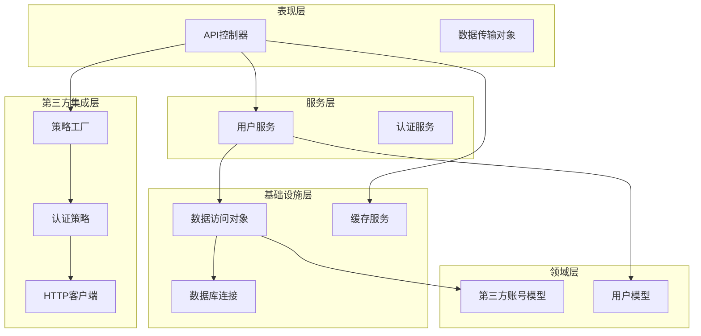
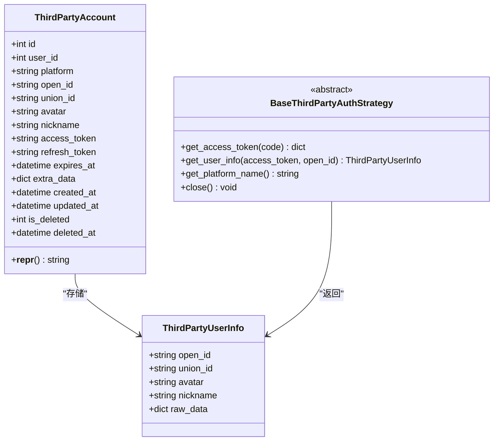
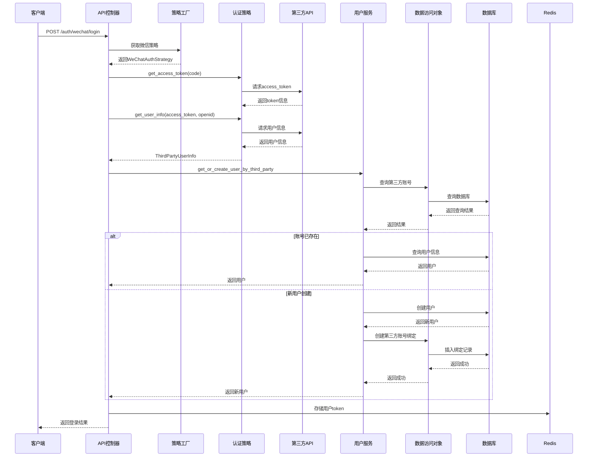
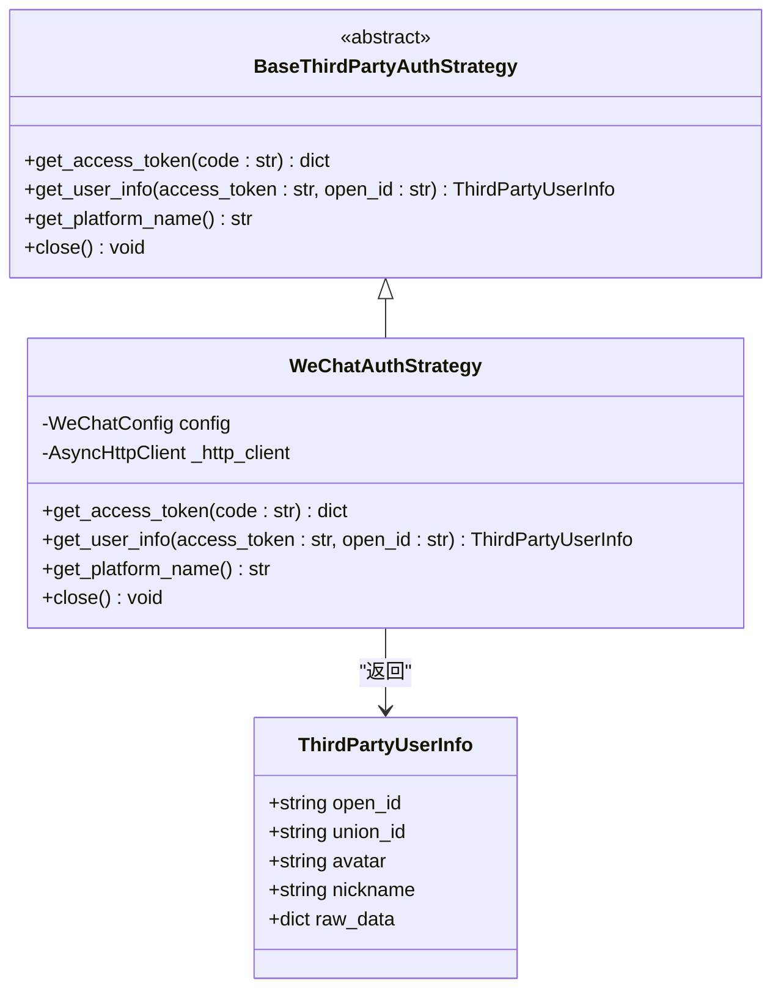
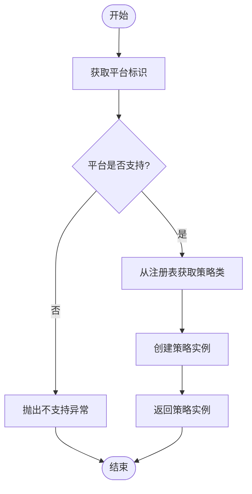
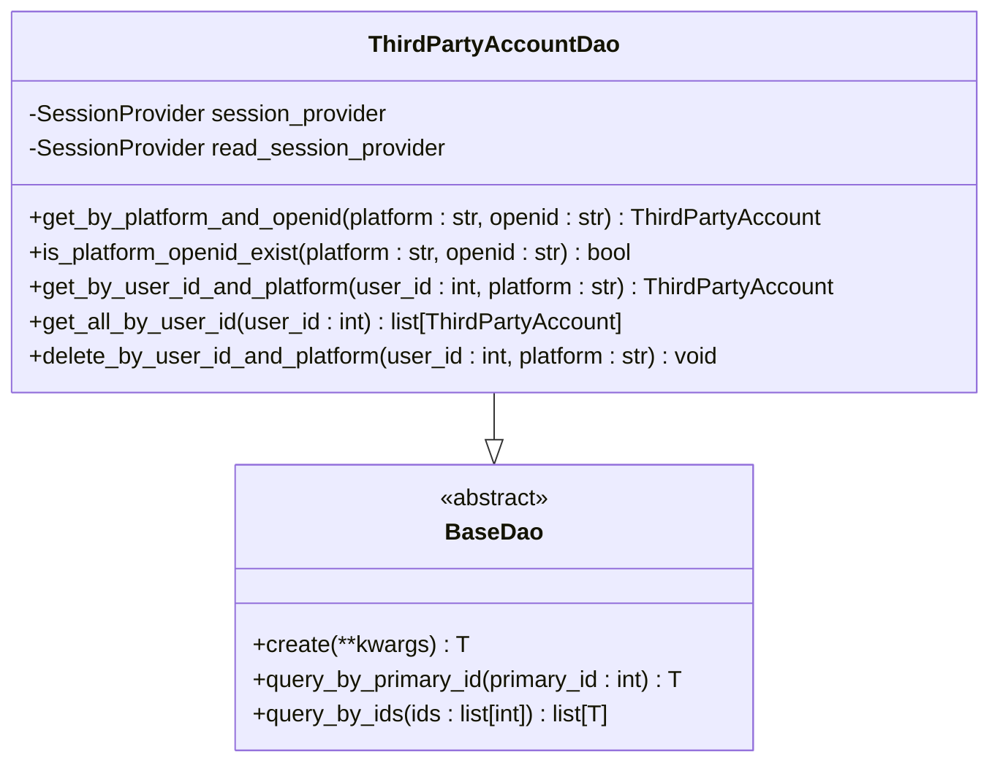
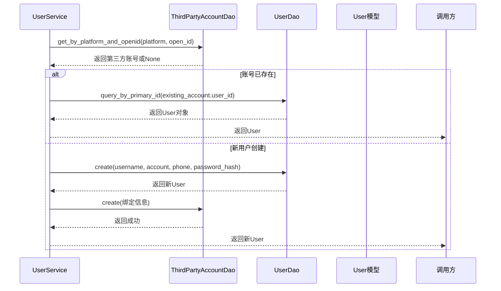
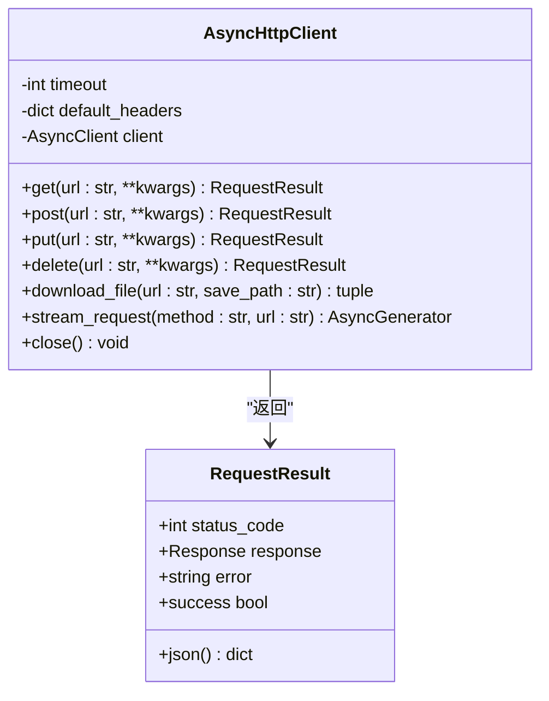
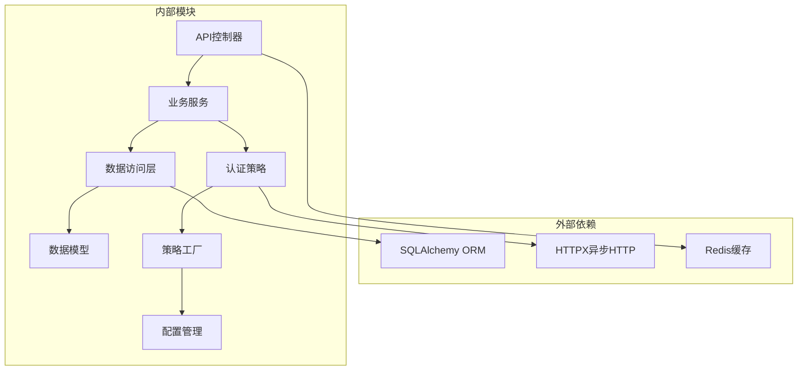

# 第三方账号模型

<cite>
**本文档引用的文件**
- [internal/models/third_party_account.py](file://internal/models/third_party_account.py)
- [pkg/third_party_auth/base.py](file://pkg/third_party_auth/base.py)
- [pkg/third_party_auth/strategies/wechat.py](file://pkg/third_party_auth/strategies/wechat.py)
- [internal/dao/third_party_account.py](file://internal/dao/third_party_account.py)
- [pkg/third_party_auth/factory.py](file://pkg/third_party_auth/factory.py)
- [pkg/third_party_auth/config.py](file://pkg/third_party_auth/config.py)
- [internal/services/user.py](file://internal/services/user.py)
- [internal/controllers/api/auth.py](file://internal/controllers/api/auth.py)
- [pkg/toolkit/http_cli.py](file://pkg/toolkit/http_cli.py)
- [pkg/database/types.py](file://pkg/database/types.py)
- [internal/infra/database.py](file://internal/infra/database.py)
- [internal/models/user.py](file://internal/models/user.py)
</cite>

## 目录
1. [简介](#简介)
2. [项目结构](#项目结构)
3. [核心组件](#核心组件)
4. [架构概览](#架构概览)
5. [详细组件分析](#详细组件分析)
6. [依赖关系分析](#依赖关系分析)
7. [性能考虑](#性能考虑)
8. [故障排除指南](#故障排除指南)
9. [结论](#结论)

## 简介

第三方账号模型是本项目用户认证系统的核心组成部分，负责管理用户与第三方平台（如微信、支付宝、Google、GitHub等）的账号绑定关系。该模型采用分层架构设计，结合策略模式和工厂模式，提供了高度可扩展的第三方登录解决方案。

系统通过统一的抽象接口支持多种第三方认证平台，同时保持各平台实现的独立性和可替换性。数据持久化采用ORM映射，支持跨数据库兼容的JSON类型存储，确保额外信息的灵活扩展。

## 项目结构

项目采用清晰的分层架构，主要分为以下几个层次：

**图表来源**
- [internal/controllers/api/auth.py](file://internal/controllers/api/auth.py#L1-L299)
- [internal/services/user.py](file://internal/services/user.py#L1-L186)
- [internal/models/third_party_account.py](file://internal/models/third_party_account.py#L1-L122)

**章节来源**
- [internal/controllers/api/auth.py](file://internal/controllers/api/auth.py#L1-L299)
- [internal/services/user.py](file://internal/services/user.py#L1-L186)
- [internal/models/third_party_account.py](file://internal/models/third_party_account.py#L1-L122)

## 核心组件

### 第三方账号模型

ThirdPartyAccount模型是整个第三方认证系统的核心数据结构，负责存储用户与第三方平台的绑定关系。

**图表来源**
- [internal/models/third_party_account.py](file://internal/models/third_party_account.py#L10-L122)
- [pkg/third_party_auth/base.py](file://pkg/third_party_auth/base.py#L8-L85)

### 数据库设计

系统采用关系型数据库设计，通过复合索引优化查询性能：

| 索引类型 | 索引名称 | 列组合 | 用途 |
|---------|----------|--------|------|
| 主键 | PRIMARY | id | 唯一标识记录 |
| 唯一索引 | uq_platform_openid | platform, open_id | 确保同一平台用户唯一性 |
| 普通索引 | idx_user_id | user_id | 按用户查询 |
| 普通索引 | idx_platform | platform | 按平台查询 |
| 普通索引 | idx_open_id | open_id | 按open_id查询 |
| 普通索引 | idx_union_id | union_id | 按union_id查询 |
| 复合索引 | idx_user_platform | user_id, platform | 快速查询用户的所有第三方账号 |

**章节来源**
- [internal/models/third_party_account.py](file://internal/models/third_party_account.py#L15-L40)
- [internal/models/third_party_account.py](file://internal/models/third_party_account.py#L112-L118)

## 架构概览

系统采用分层架构，通过策略模式实现第三方认证的可扩展性：

**图表来源**
- [internal/controllers/api/auth.py](file://internal/controllers/api/auth.py#L218-L299)
- [pkg/third_party_auth/factory.py](file://pkg/third_party_auth/factory.py#L76-L107)
- [internal/services/user.py](file://internal/services/user.py#L71-L124)

**章节来源**
- [internal/controllers/api/auth.py](file://internal/controllers/api/auth.py#L218-L299)
- [pkg/third_party_auth/factory.py](file://pkg/third_party_auth/factory.py#L23-L117)
- [internal/services/user.py](file://internal/services/user.py#L71-L124)

## 详细组件分析

### 第三方认证策略基类

BaseThirdPartyAuthStrategy定义了所有第三方认证策略的统一接口，采用抽象基类确保实现的一致性。

**图表来源**
- [pkg/third_party_auth/base.py](file://pkg/third_party_auth/base.py#L27-L85)
- [pkg/third_party_auth/strategies/wechat.py](file://pkg/third_party_auth/strategies/wechat.py#L12-L138)

#### 策略工厂模式

ThirdPartyAuthFactory实现了工厂模式，提供动态注册和获取认证策略的功能：

**图表来源**
- [pkg/third_party_auth/factory.py](file://pkg/third_party_auth/factory.py#L76-L107)

**章节来源**
- [pkg/third_party_auth/base.py](file://pkg/third_party_auth/base.py#L27-L85)
- [pkg/third_party_auth/strategies/wechat.py](file://pkg/third_party_auth/strategies/wechat.py#L12-L138)
- [pkg/third_party_auth/factory.py](file://pkg/third_party_auth/factory.py#L23-L117)

### 数据访问层

ThirdPartyAccountDao提供了针对第三方账号的CRUD操作，基于通用的BaseDao实现：

**图表来源**
- [internal/dao/third_party_account.py](file://internal/dao/third_party_account.py#L6-L44)

**章节来源**
- [internal/dao/third_party_account.py](file://internal/dao/third_party_account.py#L6-L44)
- [pkg/database/dao.py](file://pkg/database/dao.py#L15-L234)

### 用户服务层

UserService封装了用户相关的业务逻辑，特别是第三方账号绑定和用户创建：

**图表来源**
- [internal/services/user.py](file://internal/services/user.py#L71-L124)

**章节来源**
- [internal/services/user.py](file://internal/services/user.py#L71-L124)

### HTTP客户端封装

AsyncHttpClient提供了统一的异步HTTP请求封装，支持错误处理和日志记录：

**图表来源**
- [pkg/toolkit/http_cli.py](file://pkg/toolkit/http_cli.py#L38-L232)

**章节来源**
- [pkg/toolkit/http_cli.py](file://pkg/toolkit/http_cli.py#L38-L232)

## 依赖关系分析

系统采用松耦合的设计，通过接口和抽象类实现模块间的解耦：

**图表来源**
- [internal/controllers/api/auth.py](file://internal/controllers/api/auth.py#L1-L299)
- [internal/services/user.py](file://internal/services/user.py#L1-L186)
- [pkg/third_party_auth/factory.py](file://pkg/third_party_auth/factory.py#L1-L117)

**章节来源**
- [internal/controllers/api/auth.py](file://internal/controllers/api/auth.py#L1-L299)
- [internal/services/user.py](file://internal/services/user.py#L1-L186)
- [pkg/third_party_auth/factory.py](file://pkg/third_party_auth/factory.py#L1-L117)

## 性能考虑

### 数据库性能优化

1. **索引策略**：通过复合索引优化常见查询模式
2. **连接池管理**：配置合适的连接池大小和超时时间
3. **读写分离**：支持主从数据库分离，提升读取性能

### 缓存策略

1. **Redis缓存**：用户认证信息缓存，减少数据库查询
2. **Token管理**：支持批量token管理和失效处理
3. **会话管理**：基于Redis的会话存储方案

### 异步处理

1. **异步HTTP请求**：使用httpx实现非阻塞网络请求
2. **异步数据库操作**：基于SQLAlchemy异步引擎
3. **并发控制**：合理的并发限制和资源管理

## 故障排除指南

### 常见问题及解决方案

1. **第三方API调用失败**
   - 检查网络连接和API可用性
   - 验证配置参数的正确性
   - 查看详细的错误日志信息

2. **数据库连接问题**
   - 确认数据库服务正常运行
   - 检查连接参数和权限设置
   - 验证连接池配置是否合理

3. **认证流程异常**
   - 检查用户状态和账户有效性
   - 验证第三方平台的配置信息
   - 确认回调URL和授权流程正确

**章节来源**
- [pkg/toolkit/http_cli.py](file://pkg/toolkit/http_cli.py#L14-L36)
- [internal/infra/database.py](file://internal/infra/database.py#L122-L178)

## 结论

第三方账号模型通过精心设计的分层架构和策略模式，为多平台认证提供了高度可扩展和可维护的解决方案。系统的关键优势包括：

1. **高度可扩展性**：通过策略模式轻松支持新的第三方平台
2. **强类型安全**：使用Pydantic和类型注解确保数据完整性
3. **性能优化**：合理的索引设计和缓存策略
4. **错误处理**：完善的异常处理和日志记录机制
5. **测试友好**：清晰的接口设计便于单元测试

该模型为构建企业级认证系统奠定了坚实的基础，能够满足复杂的业务需求和高并发场景的要求。