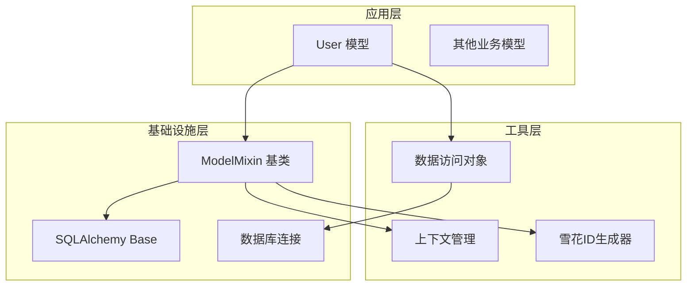
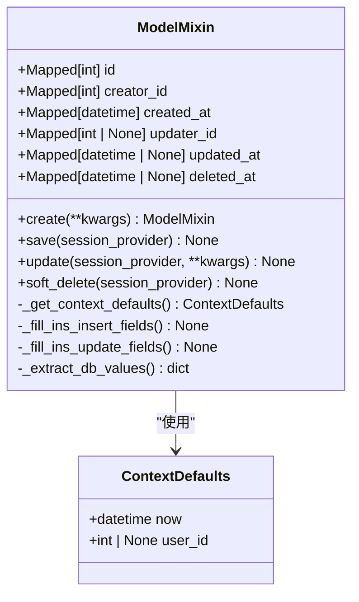
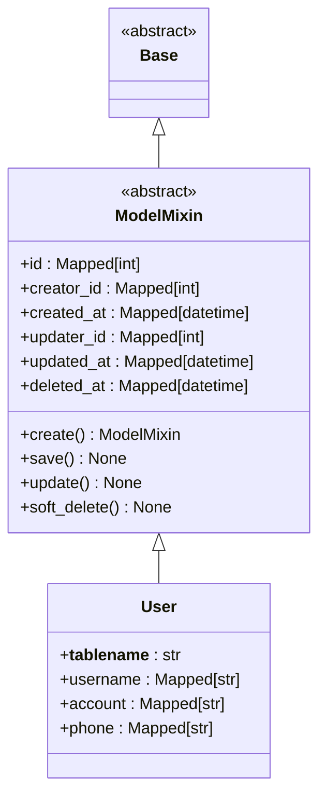
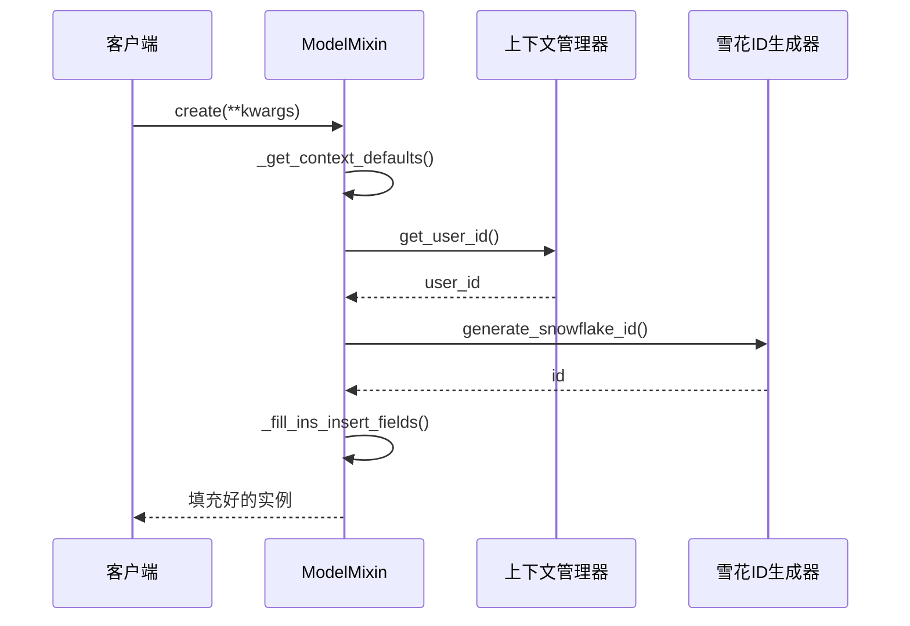

# ORM 模型定义

<cite>
**本文档中引用的文件**
- [internal/models/user.py](file://internal/models/user.py)
- [pkg/database.py](file://pkg/database.py)
- [internal/infra/database.py](file://internal/infra/database.py)
- [pkg/ctx.py](file://pkg/ctx.py)
- [pkg/snowflake_tool.py](file://pkg/snowflake_tool.py)
- [tests/test_orm.py](file://tests/test_orm.py)
</cite>

## 目录
1. [简介](#简介)
2. [项目架构概览](#项目架构概览)
3. [核心组件分析](#核心组件分析)
4. [ModelMixin 深度解析](#modelmixin-深度解析)
5. [User 模型实现](#user-模型实现)
6. [上下文集成机制](#上下文集成机制)
7. [工厂方法与实例方法](#工厂方法与实例方法)
8. [最佳实践指南](#最佳实践指南)
9. [总结](#总结)

## 简介

本文档详细阐述了基于 SQLAlchemy 2.0 的声明式 ORM 模型设计，重点分析 `ModelMixin` 提供的通用功能和 `User` 模型的实现模式。该架构通过继承机制实现了代码复用、自动化字段管理和统一的 CRUD 操作接口。

## 项目架构概览

项目的 ORM 架构采用分层设计，主要包含以下层次：



**图表来源**
- [internal/models/user.py](file://internal/models/user.py#L7-L13)
- [pkg/database.py](file://pkg/database.py#L63-L76)

**章节来源**
- [internal/models/user.py](file://internal/models/user.py#L1-L13)
- [pkg/database.py](file://pkg/database.py#L63-L76)

## 核心组件分析

### SQLAlchemy 2.0 声明式映射

项目使用 SQLAlchemy 2.0 的现代化声明式映射语法，主要特点包括：

#### 基础基类定义
```python
class Base(DeclarativeBase):
    """SQLAlchemy 2.0 声明式基类"""
    pass
```

#### 类型注解语法
```python
# 使用 Mapped 和 mapped_column 进行类型注解
id: Mapped[int] = mapped_column(BigInteger, primary_key=True)
username: Mapped[str] = mapped_column(String(64))
```

### ModelMixin 核心功能

`ModelMixin` 提供了完整的 ORM 模型基础功能，包括：

- **通用字段管理**：id、creator_id、created_at、updater_id、updated_at、deleted_at
- **工厂方法**：create() 用于创建新实例
- **CRUD 操作**：save()、update()、soft_delete()
- **批量操作**：insert_rows()、insert_instances()
- **查询构建**：QueryBuilder、UpdateBuilder、CountBuilder

**章节来源**
- [pkg/database.py](file://pkg/database.py#L63-L76)
- [pkg/database.py](file://pkg/database.py#L74-L200)

## ModelMixin 深度解析

### 通用字段定义

`ModelMixin` 定义了一套标准化的通用字段，这些字段为所有继承的模型提供审计和管理功能：



**图表来源**
- [pkg/database.py](file://pkg/database.py#L80-L87)
- [pkg/database.py](file://pkg/database.py#L68-L72)

### 字段自动化填充机制

#### 上下文默认值获取
```python
@staticmethod
def _get_context_defaults() -> ContextDefaults:
    return ContextDefaults(
        now=get_utc_without_tzinfo(),
        user_id=ctx.get_user_id()
    )
```

#### 插入字段填充
```python
def _fill_ins_insert_fields(self):
    defaults = self._get_context_defaults()
    
    if not self.id:
        self.id = generate_snowflake_id()
    
    if not self.created_at:
        self.created_at = defaults.now
    
    if self.has_creator_id_column() and not self.creator_id and defaults.user_id:
        self.creator_id = defaults.user_id
```

#### 更新字段填充
```python
def _fill_ins_update_fields(self):
    defaults = self._get_context_defaults()
    
    if self.has_updated_at_column():
        setattr(self, self.updated_at_column_name(), defaults.now)
    
    if self.has_updater_id_column():
        setattr(self, self.updater_id_column_name(), defaults.user_id)
```

**章节来源**
- [pkg/database.py](file://pkg/database.py#L204-L209)
- [pkg/database.py](file://pkg/database.py#L211-L228)
- [pkg/database.py](file://pkg/database.py#L229-L237)

## User 模型实现

### 继承关系与表映射

`User` 模型展示了标准的 ORM 模型实现模式：



**图表来源**
- [internal/models/user.py](file://internal/models/user.py#L7-L13)
- [pkg/database.py](file://pkg/database.py#L63-L76)

### 字段定义与约束

User 模型定义了以下业务字段：

| 字段名 | 类型 | 约束 | 说明 |
|--------|------|------|------|
| username | Mapped[str] | String(64) | 用户名，最大长度64字符 |
| account | Mapped[str] | String(64) | 登录账号，最大长度64字符 |
| phone | Mapped[str] | String(11) | 手机号码，最大长度11字符 |

### 表名映射

```python
class User(Base, ModelMixin):
    __tablename__ = "user"
```

**章节来源**
- [internal/models/user.py](file://internal/models/user.py#L1-L13)

## 上下文集成机制

### ContextDefaults 结构

```python
@dataclass(frozen=True, slots=True)
class ContextDefaults:
    now: datetime
    user_id: int | None
```

### 上下文获取流程



**图表来源**
- [pkg/database.py](file://pkg/database.py#L68-L72)
- [pkg/database.py](file://pkg/database.py#L204-L209)
- [pkg/snowflake_tool.py](file://pkg/snowflake_tool.py#L7-L8)

### 上下文管理器功能

上下文管理器提供了完整的请求级状态管理：

- **用户ID管理**：`set_user_id()` 和 `get_user_id()`
- **追踪ID管理**：`set_trace_id()` 和 `get_trace_id()`
- **全局状态维护**：线程安全的上下文变量

**章节来源**
- [pkg/ctx.py](file://pkg/ctx.py#L80-L85)
- [pkg/ctx.py](file://pkg/ctx.py#L98-L105)

## 工厂方法与实例方法

### 工厂方法 create()

```python
@classmethod
def create(cls, **kwargs) -> "ModelMixin":
    """
    创建一个新的、填充好默认值的实例（Transient 状态）。
    """
    valid_cols = set(cls.get_column_names())
    clean_kwargs = {k: v for k, v in kwargs.items() if k in valid_cols}
    
    ins = cls(**clean_kwargs)
    ins._fill_ins_insert_fields()
    return ins
```

### CRUD 操作详解

#### save() 方法
```python
async def save(self, session_provider: SessionProvider) -> None:
    """[Strict Insert] 仅用于保存新对象。"""
    state = inspect(self)
    
    if not state.transient:
        raise RuntimeError(
            f"save() is strictly for INSERT operations. "
            f"Object {self.__class__.__name__}(id={self.id}) is already persistent/detached. "
            f"Please use update() instead."
        )
    
    self._fill_ins_insert_fields()
    data = self._extract_db_values()
    
    try:
        async with session_provider() as sess:
            async with sess.begin():
                await sess.execute(insert(self.__class__).values(data))
    except Exception as e:
        raise RuntimeError(f"{self.__class__.__name__} save(insert) error: {e}") from e
```

#### update() 方法
```python
async def update(self, session_provider: SessionProvider, **kwargs) -> None:
    """[Strict Update] 仅用于更新已存在的对象。"""
    state = inspect(self)
    
    if state.transient:
        raise RuntimeError(
            f"update() is strictly for UPDATE operations on existing records. "
            f"Object {self.__class__.__name__} is new (transient). "
            f"Please use save() or insert_instances() first."
        )
    
    for column_name, value in kwargs.items():
        if self.has_column(column_name):
            setattr(self, column_name, value)
    
    self._fill_ins_update_fields()
    
    try:
        async with session_provider() as sess:
            async with sess.begin():
                sess.add(self)
    except Exception as e:
        raise RuntimeError(f"{self.__class__.__name__} update error: {e}") from e
```

#### soft_delete() 方法
```python
async def soft_delete(self, session_provider: SessionProvider) -> None:
    if self.has_deleted_at_column():
        await self.update(session_provider, **{self.deleted_at_column_name(): get_utc_without_tzinfo()})
```

**章节来源**
- [pkg/database.py](file://pkg/database.py#L96-L106)
- [pkg/database.py](file://pkg/database.py#L150-L169)
- [pkg/database.py](file://pkg/database.py#L171-L193)
- [pkg/database.py](file://pkg/database.py#L195-L199)

## 最佳实践指南

### 自定义新模型的标准范例

基于现有架构，创建新模型的最佳实践：

```python
from sqlalchemy.orm import Mapped, mapped_column
from pkg.database import Base, ModelMixin

class NewModel(Base, ModelMixin):
    """新业务模型示例"""
    
    __tablename__ = "new_model"
    
    # 业务字段
    name: Mapped[str] = mapped_column(String(100))
    description: Mapped[str] = mapped_column(String(500), nullable=True)
    status: Mapped[int] = mapped_column(Integer, default=0)
    
    # 可选的额外业务字段
    extra_data: Mapped[dict] = mapped_column(JSON, default={})
```

### 继承 ModelMixin 的优势

1. **代码复用**：避免重复定义通用字段
2. **一致性**：确保所有模型具有相同的审计字段
3. **自动化**：自动处理创建时间、更新时间、用户ID等
4. **扩展性**：支持软删除、批量操作等功能

### 使用建议

1. **字段验证**：在业务逻辑层添加输入验证
2. **索引策略**：为常用查询字段添加数据库索引
3. **事务管理**：合理使用数据库事务确保数据一致性
4. **性能优化**：对于大批量操作使用批量插入方法

**章节来源**
- [pkg/database.py](file://pkg/database.py#L523-L550)
- [tests/test_orm.py](file://tests/test_orm.py#L65-L68)

## 总结

该项目的 ORM 模型架构展现了现代 SQLAlchemy 2.0 的最佳实践，通过 `ModelMixin` 提供了完整的模型基础功能：

### 核心优势

1. **声明式映射**：使用 SQLAlchemy 2.0 的现代化语法
2. **自动化管理**：智能的字段填充和上下文集成
3. **统一接口**：一致的 CRUD 操作和查询构建
4. **可扩展性**：灵活的继承机制和工厂方法

### 技术特色

- **类型安全**：完整的 Python 类型注解
- **上下文感知**：自动注入当前用户和时间信息
- **性能优化**：支持批量操作和高效查询
- **软删除支持**：透明的逻辑删除机制

这套架构为大型应用提供了稳定、可维护的 ORM 解决方案，特别适合需要严格审计和复杂业务逻辑的企业级应用。