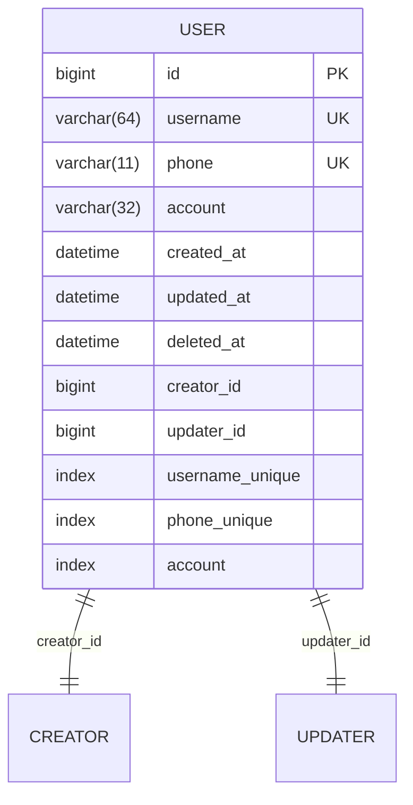
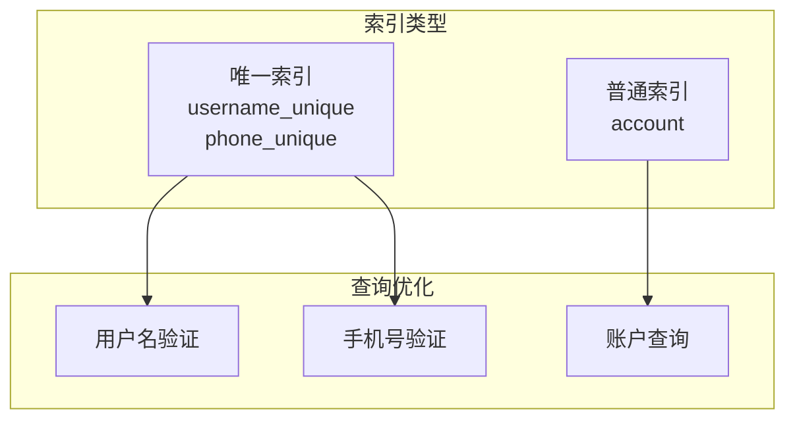
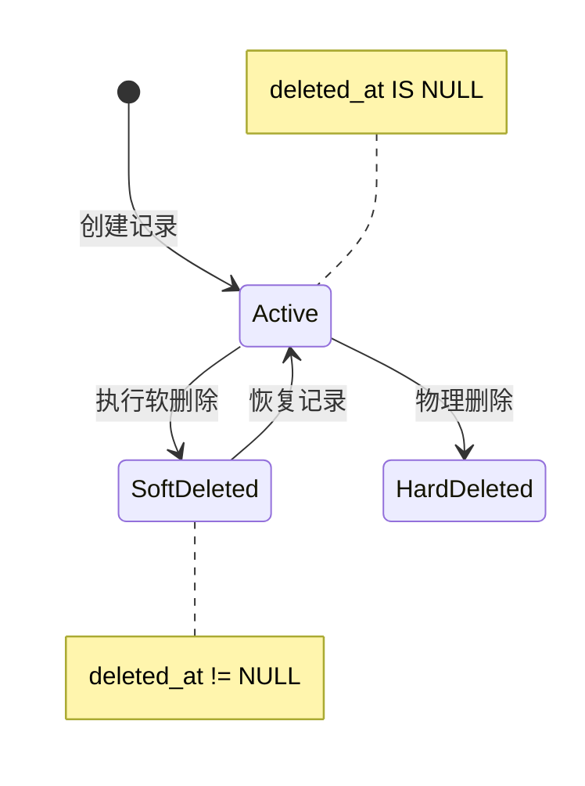
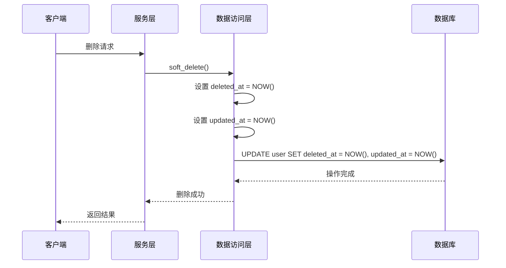
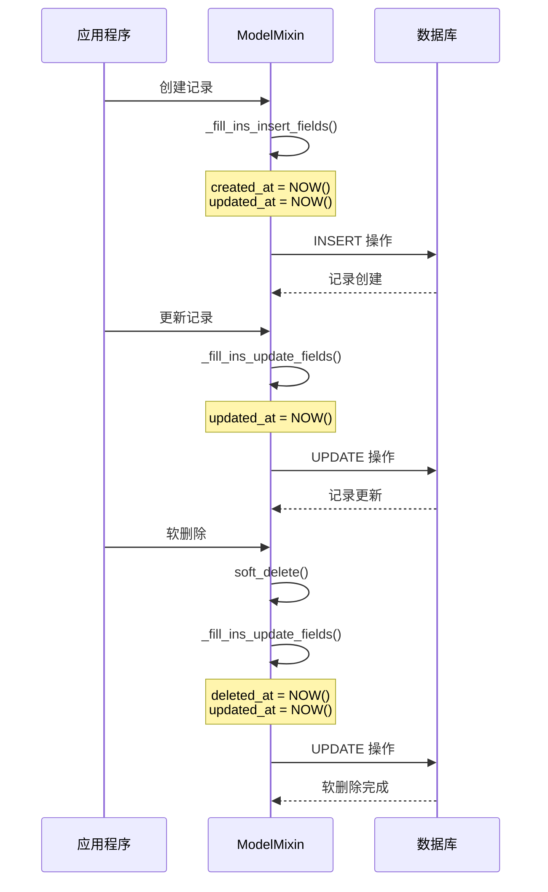
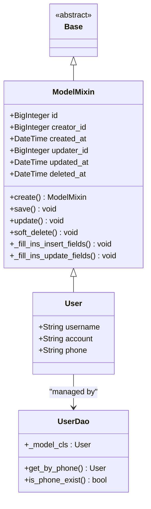
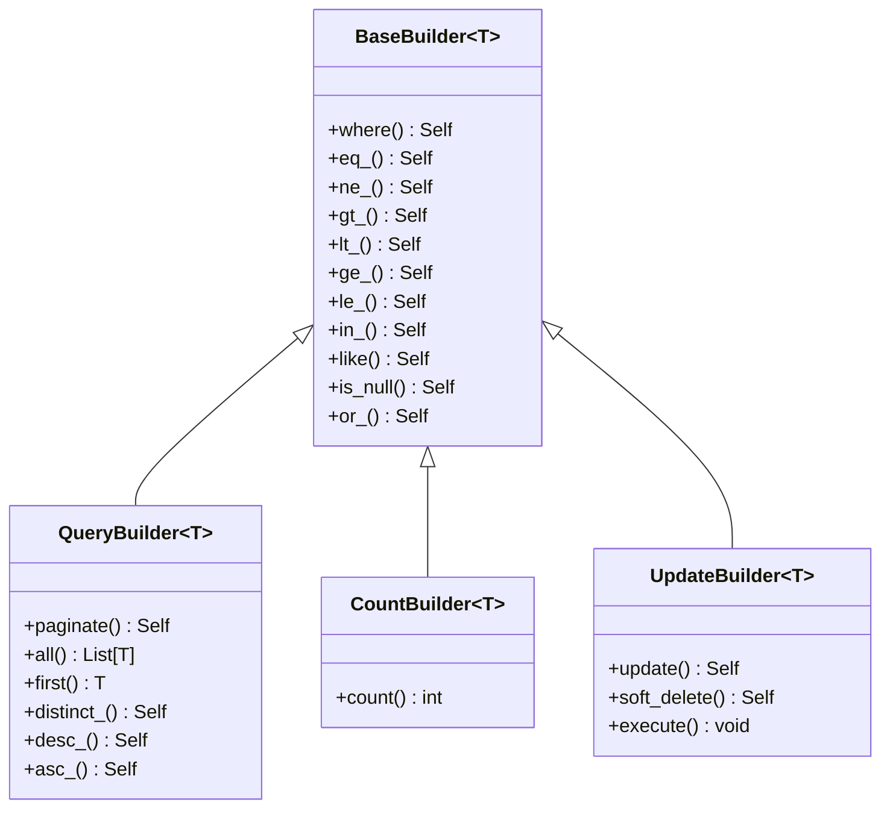
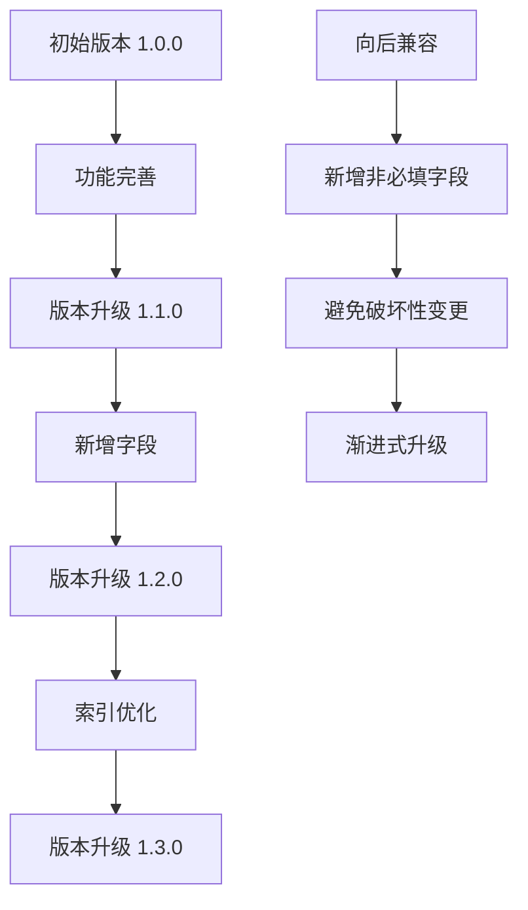
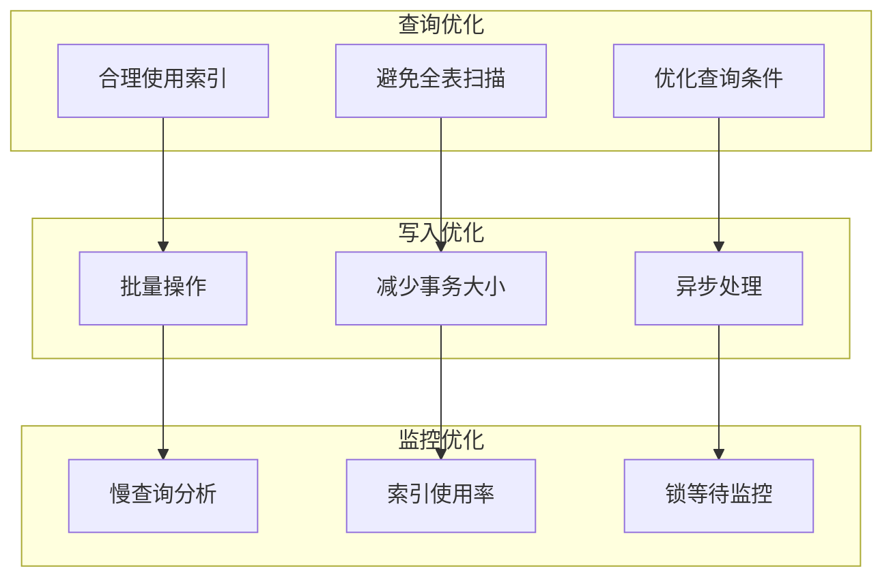

# 数据库 Schema 文档

<cite>
**本文档引用的文件**
- [1.0.0.sql](file://ddl/1.0.0.sql)
- [user.py](file://internal/models/user.py)
- [user.py](file://internal/schemas/user.py)
- [user.py](file://internal/dao/user.py)
- [user.py](file://internal/services/user.py)
- [user.py](file://internal/controllers/web/user.py)
- [database.py](file://pkg/database.py)
</cite>

## 目录
1. [概述](#概述)
2. [表结构设计](#表结构设计)
3. [字段详细说明](#字段详细说明)
4. [索引设计](#索引设计)
5. [软删除机制](#软删除机制)
6. [时间戳管理](#时间戳管理)
7. [ORM 映射关系](#orm-映射关系)
8. [查询优化](#查询优化)
9. [版本管理策略](#版本管理策略)
10. [最佳实践建议](#最佳实践建议)

## 概述

本文档详细描述了 FastAPI 后端项目中的 `user` 表数据库 Schema 设计。该表采用 MySQL InnoDB 存储引擎，支持软删除机制，具备完善的审计字段和查询优化索引。

## 表结构设计

### 建表语句概览

```sql
CREATE TABLE `user`
(
    `id`         bigint unsigned NOT NULL AUTO_INCREMENT,
    `username`   varchar(64) COLLATE utf8mb4_general_ci NOT NULL,
    `phone`      varchar(11) COLLATE utf8mb4_general_ci NOT NULL,
    `account`    varchar(32) COLLATE utf8mb4_general_ci NOT NULL,
    `created_at` datetime                               NOT NULL ON UPDATE CURRENT_TIMESTAMP,
    `updated_at` datetime                               NOT NULL ON UPDATE CURRENT_TIMESTAMP,
    `deleted_at` datetime DEFAULT NULL,
    `creator_id` bigint unsigned NOT NULL,
    `updater_id` bigint unsigned DEFAULT NULL,
    PRIMARY KEY (`id`),
    UNIQUE KEY `username_unique` (`username`) USING BTREE,
    UNIQUE KEY `phone_unique` (`phone`) USING BTREE,
    KEY          `account` (`account`) USING BTREE
) ENGINE=InnoDB DEFAULT CHARSET=utf8mb4 COLLATE=utf8mb4_general_ci;
```

### 架构图



**图表来源**
- [1.0.0.sql](file://ddl/1.0.0.sql#L1-L17)

**章节来源**
- [1.0.0.sql](file://ddl/1.0.0.sql#L1-L17)

## 字段详细说明

### 主键字段

| 字段名 | 数据类型 | 约束 | 描述 |
|--------|----------|------|------|
| `id` | bigint unsigned | PRIMARY KEY, AUTO_INCREMENT | 用户唯一标识符，使用 Snowflake ID 生成 |

### 用户基本信息

| 字段名 | 数据类型 | 约束 | 字符集 | 描述 |
|--------|----------|------|--------|------|
| `username` | varchar(64) | NOT NULL, UNIQUE | utf8mb4_general_ci | 用户名，最大长度64字符，支持多语言 |
| `phone` | varchar(11) | NOT NULL, UNIQUE | utf8mb4_general_ci | 手机号码，固定11位数字 |
| `account` | varchar(32) | NOT NULL | utf8mb4_general_ci | 账户标识，可能用于登录凭证 |

### 审计字段

| 字段名 | 数据类型 | 约束 | 默认值 | 描述 |
|--------|----------|------|--------|------|
| `creator_id` | bigint unsigned | NOT NULL | - | 创建者用户ID |
| `updater_id` | bigint unsigned | DEFAULT NULL | NULL | 更新者用户ID |

### 时间戳字段

| 字段名 | 数据类型 | 约束 | ON UPDATE | 描述 |
|--------|----------|------|-----------|------|
| `created_at` | datetime | NOT NULL | CURRENT_TIMESTAMP | 记录创建时间 |
| `updated_at` | datetime | NOT NULL | CURRENT_TIMESTAMP | 记录最后更新时间 |
| `deleted_at` | datetime | DEFAULT NULL | NULL | 软删除标记时间 |

**章节来源**
- [1.0.0.sql](file://ddl/1.0.0.sql#L4-L16)
- [user.py](file://internal/models/user.py#L7-L13)

## 索引设计

### 唯一索引

#### username_unique
- **字段**: `username`
- **类型**: BTREE
- **用途**: 确保用户名唯一性，防止重复注册
- **查询场景**: 用户名验证、登录认证

#### phone_unique  
- **字段**: `phone`
- **类型**: BTREE
- **用途**: 确保手机号唯一性，支持手机登录
- **查询场景**: 手机号验证、找回密码

### 普通索引

#### account
- **字段**: `account`
- **类型**: BTREE
- **用途**: 加速账户相关查询
- **查询场景**: 账户搜索、登录验证、权限查询

### 索引设计原理



**图表来源**
- [1.0.0.sql](file://ddl/1.0.0.sql#L14-L16)

**章节来源**
- [1.0.0.sql](file://ddl/1.0.0.sql#L14-L16)

## 软删除机制

### 实现原理

系统采用软删除机制，通过 `deleted_at` 字段标记记录状态：



### 软删除流程



**图表来源**
- [database.py](file://pkg/database.py#L195-L199)
- [database.py](file://pkg/database.py#L490-L493)

### 查询过滤机制

系统在查询时自动过滤已软删除的记录：

```python
# 查询构建器自动应用软删除过滤
if include_deleted is False and self._model_cls.has_deleted_at_column:
    self._apply_delete_at_is_none()
```

**章节来源**
- [database.py](file://pkg/database.py#L195-L199)
- [database.py](file://pkg/database.py#L403-L406)
- [database.py](file://pkg/database.py#L552-L557)

## 时间戳管理

### 自动更新机制

MySQL 的 `ON UPDATE CURRENT_TIMESTAMP` 特性确保时间戳的自动维护：

```mermaid
flowchart TD
A[记录创建] --> B[created_at = NOW()]
B --> C[updated_at = NOW()]
C --> D[记录修改]
D --> E[updated_at 自动更新为 NOW()]
E --> F[created_at 保持不变]
G[软删除] --> H[deleted_at = NOW()]
H --> I[updated_at 自动更新为 NOW()]
I --> J[记录状态变更]
```

**图表来源**
- [1.0.0.sql](file://ddl/1.0.0.sql#L8-L10)

### ORM 层时间戳处理

```python
# ModelMixin 中的时间戳字段
created_at: Mapped[datetime] = mapped_column(DateTime(timezone=False))
updated_at: Mapped[datetime | None] = mapped_column(DateTime(timezone=False), default=None)
deleted_at: Mapped[datetime | None] = mapped_column(DateTime(timezone=False), default=None)
```

### 时间戳同步机制



**图表来源**
- [database.py](file://pkg/database.py#L211-L238)

**章节来源**
- [1.0.0.sql](file://ddl/1.0.0.sql#L8-L10)
- [database.py](file://pkg/database.py#L83-L87)

## ORM 映射关系

### SQLAlchemy 模型定义



**图表来源**
- [user.py](file://internal/models/user.py#L7-L13)
- [database.py](file://pkg/database.py#L74-L87)
- [user.py](file://internal/dao/user.py#L6-L24)

### 字段映射关系

| SQL 字段 | ORM 属性 | 数据类型 | 验证规则 |
|----------|----------|----------|----------|
| `id` | `id` | Mapped[int] | BigInteger, primary_key=True |
| `username` | `username` | Mapped[str] | String(64) |
| `phone` | `phone` | Mapped[str] | String(11) |
| `account` | `account` | Mapped[str] | String(32) |
| `creator_id` | `creator_id` | Mapped[int] | BigInteger |
| `created_at` | `created_at` | Mapped[datetime] | DateTime |
| `updater_id` | `updater_id` | Mapped[int \| None] | BigInteger, default=None |
| `updated_at` | `updated_at` | Mapped[datetime \| None] | DateTime, default=None |
| `deleted_at` | `deleted_at` | Mapped[datetime \| None] | DateTime, default=None |

**章节来源**
- [user.py](file://internal/models/user.py#L7-L13)
- [database.py](file://pkg/database.py#L74-L87)

## 查询优化

### 查询构建器模式

系统采用查询构建器模式提供灵活的查询能力：



**图表来源**
- [database.py](file://pkg/database.py#L335-L407)
- [database.py](file://pkg/database.py#L408-L461)
- [database.py](file://pkg/database.py#L463-L517)

### 查询示例

#### 基础查询
```python
# 通过手机号查询用户
user = await user_dao.get_by_phone(phone_number)

# 检查手机号是否存在
exists = await user_dao.is_phone_exist(phone_number)
```

#### 高级查询
```python
# 分页查询活跃用户
users = await user_dao.querier \
    .desc_(User.updated_at) \
    .paginate(page=1, limit=10) \
    .all()

# 统计用户数量
count = await user_dao.counter.count()
```

### 性能优化策略

| 优化策略 | 实现方式 | 效果 |
|----------|----------|------|
| 软删除过滤 | 自动添加 `deleted_at IS NULL` 条件 | 减少无效数据扫描 |
| 索引利用 | 根据查询条件选择合适索引 | 提升查询速度 |
| 分页查询 | 限制单次查询结果数量 | 控制内存使用 |
| 批量操作 | 支持批量插入和更新 | 提高大批量数据处理效率 |

**章节来源**
- [user.py](file://internal/dao/user.py#L9-L17)
- [database.py](file://pkg/database.py#L552-L557)

## 版本管理策略

### DDL 版本控制

当前版本为 `1.0.0`，采用以下版本管理原则：



### 迁移策略

#### 新增字段
```sql
-- 添加新字段（非必填）
ALTER TABLE `user` ADD COLUMN `new_field` VARCHAR(64) DEFAULT NULL;

-- 添加索引
ALTER TABLE `user` ADD INDEX `new_index` (`new_field`);
```

#### 索引优化
```sql
-- 删除旧索引
ALTER TABLE `user` DROP INDEX `old_index`;

-- 添加新索引
ALTER TABLE `user` ADD INDEX `new_index` (`column1`, `column2`);
```

### 版本升级注意事项

| 阶段 | 注意事项 | 风险等级 |
|------|----------|----------|
| 开发环境 | 充分测试新功能 | 低 |
| 测试环境 | 验证迁移脚本 | 中 |
| 生产环境 | 制定回滚计划 | 高 |
| 监控阶段 | 观察性能变化 | 中 |

**章节来源**
- [1.0.0.sql](file://ddl/1.0.0.sql#L1)

## 最佳实践建议

### 数据库设计原则

1. **字段命名规范**
   - 使用小写字母和下划线
   - 保持字段名简洁明确
   - 避免使用保留字

2. **索引设计原则**
   - 唯一索引用于业务唯一性约束
   - 普通索引用于查询优化
   - 避免过多索引影响写入性能

3. **软删除最佳实践**
   - 始终过滤已删除记录
   - 提供恢复功能
   - 定期清理长期未使用的软删除数据

### 性能优化建议



### 安全考虑

1. **数据加密**
   - 敏感字段加密存储
   - 传输过程使用 HTTPS

2. **访问控制**
   - 最小权限原则
   - 审计日志记录

3. **备份策略**
   - 定期备份
   - 异地存储
   - 恢复测试

### 维护建议

| 维护任务 | 频率 | 重要性 |
|----------|------|--------|
| 索引重建 | 每月 | 高 |
| 统计信息更新 | 每周 | 中 |
| 日志清理 | 每日 | 中 |
| 性能监控 | 实时 | 高 |

通过遵循这些最佳实践，可以确保 `user` 表的稳定运行和良好的性能表现。