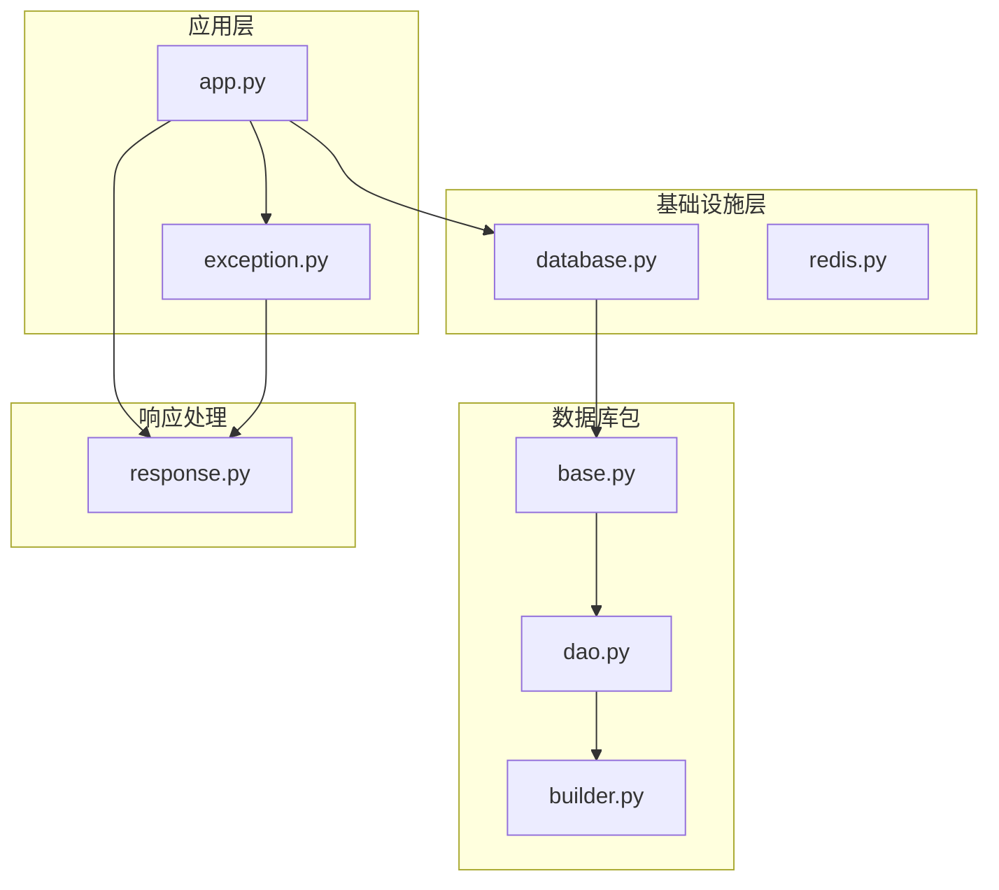
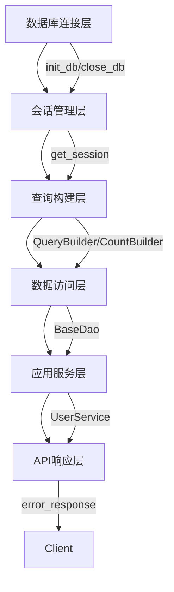
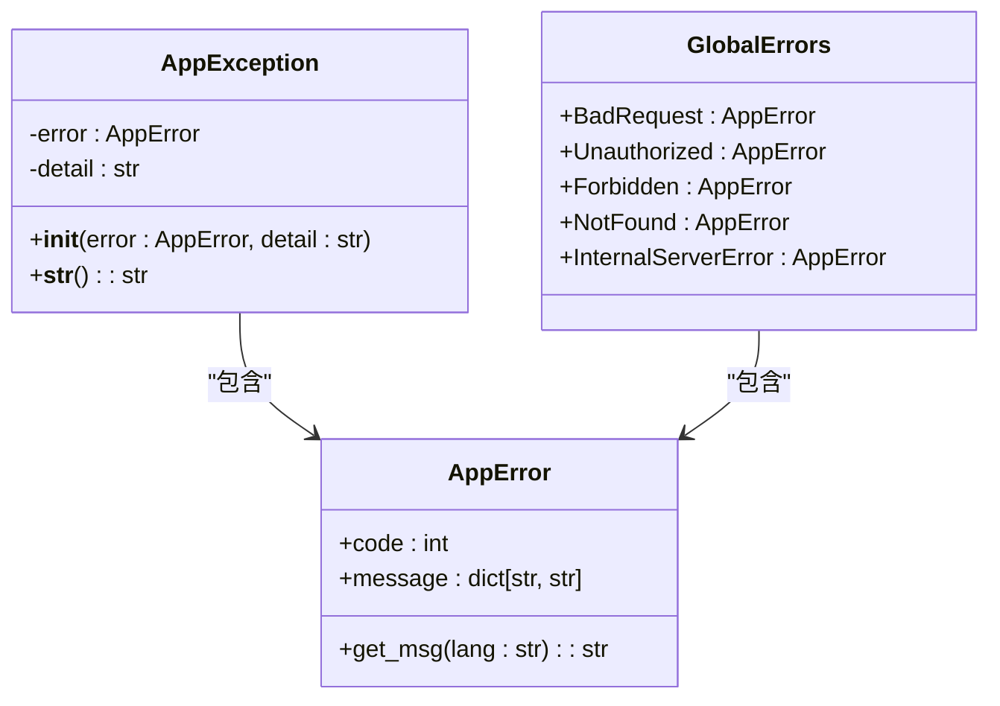
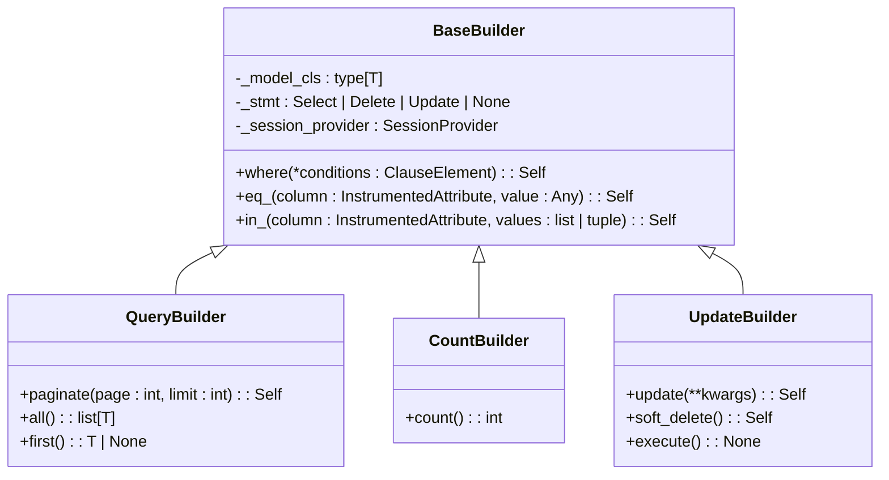
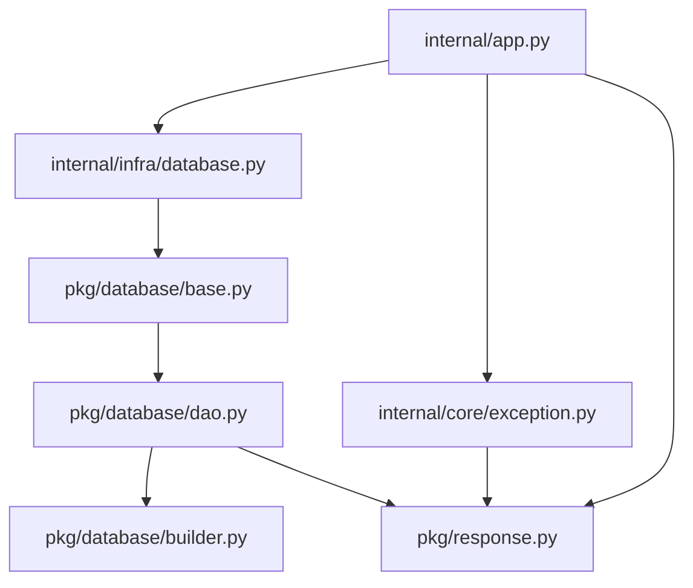

# 数据库错误处理

<cite>
**本文档引用的文件**   
- [exception.py](file://internal/core/exception.py)
- [database.py](file://internal/infra/database.py)
- [base.py](file://pkg/database/base.py)
- [dao.py](file://pkg/database/dao.py)
- [builder.py](file://pkg/database/builder.py)
- [response.py](file://pkg/response.py)
- [app.py](file://internal/app.py)
</cite>

## 目录
1. [简介](#简介)
2. [项目结构](#项目结构)
3. [核心组件](#核心组件)
4. [架构概述](#架构概述)
5. [详细组件分析](#详细组件分析)
6. [依赖分析](#依赖分析)
7. [性能考虑](#性能考虑)
8. [故障排除指南](#故障排除指南)
9. [结论](#结论)

## 简介
本文档详细分析了FastAPI后端项目的数据库错误处理机制。该系统通过分层设计实现了健壮的错误处理，涵盖了从数据库连接、SQL执行到API响应的完整错误处理流程。核心机制包括全局错误码定义、数据库会话管理、SQL执行异常捕获以及统一的API响应格式。

## 项目结构
该项目采用分层架构设计，将数据库相关的功能模块化。核心数据库处理逻辑分布在`internal/infra/database.py`中，而数据库操作的抽象和封装则位于`pkg/database/`包内。错误处理机制贯穿于整个应用层，从底层的数据库操作到顶层的API响应。



**图示来源**
- [app.py](file://internal/app.py#L1-L116)
- [database.py](file://internal/infra/database.py#L1-L141)
- [base.py](file://pkg/database/base.py#L1-L355)
- [dao.py](file://pkg/database/dao.py#L1-L178)
- [builder.py](file://pkg/database/builder.py#L1-L243)
- [response.py](file://pkg/response.py#L1-L245)

**章节来源**
- [app.py](file://internal/app.py#L1-L116)
- [database.py](file://internal/infra/database.py#L1-L141)

## 核心组件
系统的核心组件包括数据库连接管理、会话管理、查询构建器和错误处理机制。`internal/infra/database.py`负责数据库连接的初始化和销毁，`pkg/database/base.py`提供了基础的数据库模型和会话提供者，而`pkg/database/dao.py`和`pkg/database/builder.py`则提供了高级的数据库操作抽象。

**章节来源**
- [database.py](file://internal/infra/database.py#L1-L141)
- [base.py](file://pkg/database/base.py#L1-L355)
- [dao.py](file://pkg/database/dao.py#L1-L178)
- [builder.py](file://pkg/database/builder.py#L1-L243)

## 架构概述
系统的数据库错误处理架构采用分层设计，从下到上分别为：数据库连接层、会话管理层、查询构建层、数据访问层和应用服务层。每一层都有相应的错误处理机制，确保错误能够被正确捕获、处理和传递。



**图示来源**
- [database.py](file://internal/infra/database.py#L26-L67)
- [base.py](file://pkg/database/base.py#L16)
- [dao.py](file://pkg/database/dao.py#L15-L178)
- [builder.py](file://pkg/database/builder.py#L18-L243)
- [response.py](file://pkg/response.py#L207-L212)

## 详细组件分析

### 数据库连接管理分析
数据库连接管理通过`init_db`和`close_db`函数实现，确保了数据库连接的正确初始化和释放。`get_session`函数提供了会话管理，通过上下文管理器确保会话的正确使用和异常处理。

#### 对于数据库连接组件：
```mermaid
classDiagram
class DatabaseManager {
+_engine : AsyncEngine | None
+_session_maker : async_sessionmaker[AsyncSession] | None
+init_db() : None
+close_db() : None
+get_session(autoflush : bool) : AsyncGenerator[AsyncSession, Any]
}
DatabaseManager : +init_db()
DatabaseManager : +close_db()
DatabaseManager : +get_session(autoflush : bool)
```

**图示来源**
- [database.py](file://internal/infra/database.py#L26-L97)

**章节来源**
- [database.py](file://internal/infra/database.py#L1-L141)

### 错误处理机制分析
系统的错误处理机制通过`AppException`类和`GlobalErrors`枚举实现。`AppException`封装了错误码和详细信息，而`GlobalErrors`定义了全局错误码。错误通过中间件被捕获并转换为标准的API响应。

#### 对于错误处理组件：


**图示来源**
- [exception.py](file://internal/core/exception.py#L27-L46)
- [response.py](file://pkg/response.py#L38-L45)

**章节来源**
- [exception.py](file://internal/core/exception.py#L1-L46)
- [response.py](file://pkg/response.py#L1-L245)

### 查询构建器分析
查询构建器通过`QueryBuilder`、`CountBuilder`和`UpdateBuilder`类实现，提供了链式调用的API来构建复杂的SQL查询。每个构建器都包含了错误处理逻辑，确保在执行查询时能够正确捕获和处理异常。

#### 对于查询构建组件：


**图示来源**
- [builder.py](file://pkg/database/builder.py#L18-L243)

**章节来源**
- [builder.py](file://pkg/database/builder.py#L1-L243)

## 依赖分析
系统的各个组件之间存在明确的依赖关系。`internal/app.py`依赖于`internal/infra/database.py`来初始化数据库连接，而`pkg/database/dao.py`依赖于`pkg/database/base.py`提供的基础功能。`pkg/response.py`被多个组件用来生成标准的API响应。



**图示来源**
- [app.py](file://internal/app.py#L7-L15)
- [database.py](file://internal/infra/database.py#L13-L15)
- [base.py](file://pkg/database/base.py#L11-L14)
- [dao.py](file://pkg/database/dao.py#L7-L8)
- [builder.py](file://pkg/database/builder.py#L7-L9)
- [response.py](file://pkg/response.py#L15)

**章节来源**
- [app.py](file://internal/app.py#L1-L116)
- [database.py](file://internal/infra/database.py#L1-L141)
- [base.py](file://pkg/database/base.py#L1-L355)
- [dao.py](file://pkg/database/dao.py#L1-L178)
- [builder.py](file://pkg/database/builder.py#L1-L243)
- [response.py](file://pkg/response.py#L1-L245)

## 性能考虑
系统在性能方面做了多项优化。数据库连接池配置了合理的连接数和超时时间，SQL执行时通过事件监听器监控慢查询。`orjson`库的使用提高了JSON序列化的性能，而`asynccontextmanager`确保了资源的正确释放。

## 故障排除指南
当遇到数据库错误时，首先检查数据库连接是否正常初始化。可以通过查看日志中的"Initializing Database Connection..."和"Database connection initialized successfully."消息来确认。对于SQL执行错误，检查查询构建器的使用是否正确，特别是`in_`方法不能接受空列表。对于事务错误，确保在`execute_transaction`回调中正确处理异常。

**章节来源**
- [database.py](file://internal/infra/database.py#L32-L56)
- [builder.py](file://pkg/database/builder.py#L74-L75)
- [dao.py](file://pkg/database/dao.py#L170-L177)

## 结论
该FastAPI后端项目的数据库错误处理机制设计合理，通过分层架构实现了健壮的错误处理。从数据库连接管理到SQL执行，再到API响应，每个环节都有相应的错误处理逻辑。系统的可扩展性和可维护性良好，为后续的功能开发提供了坚实的基础。