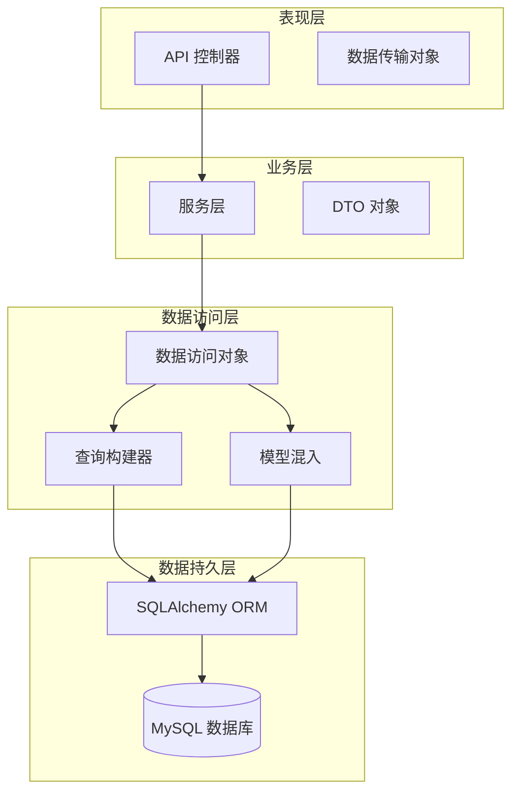
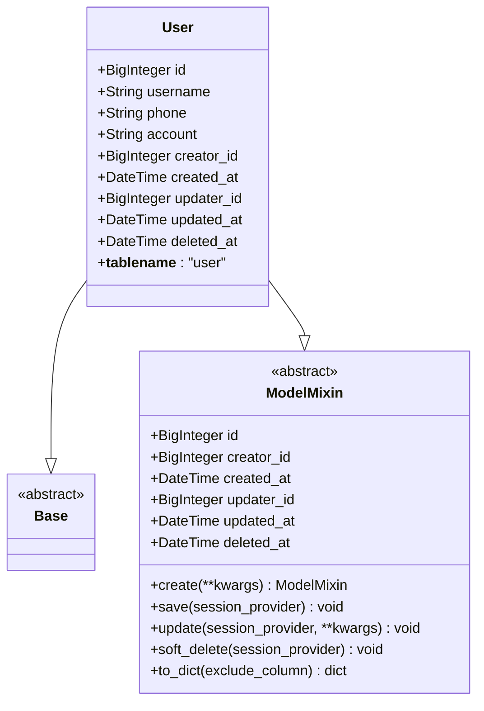
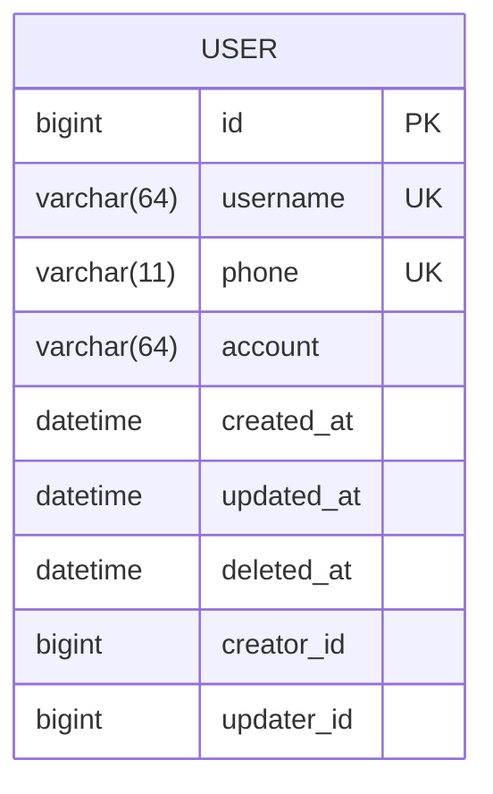
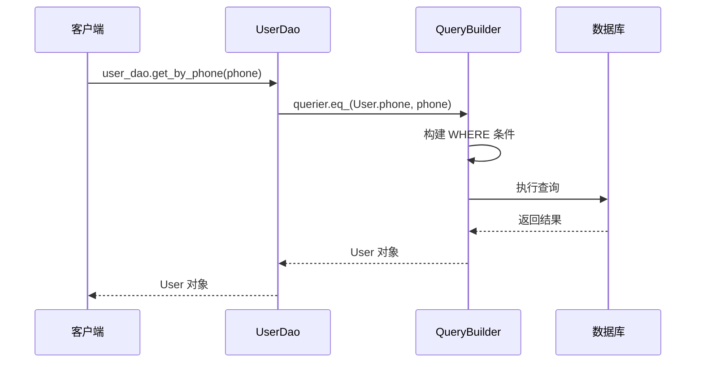
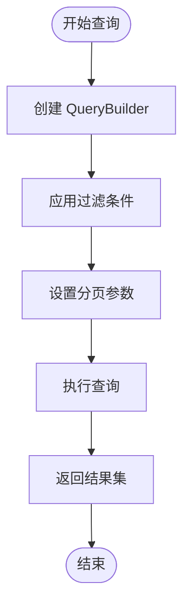
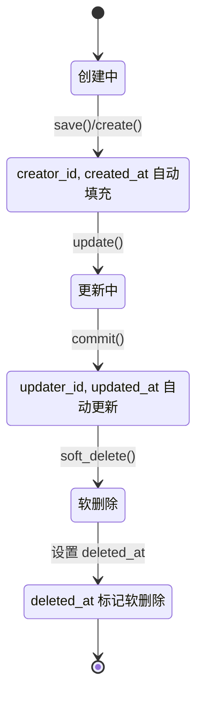
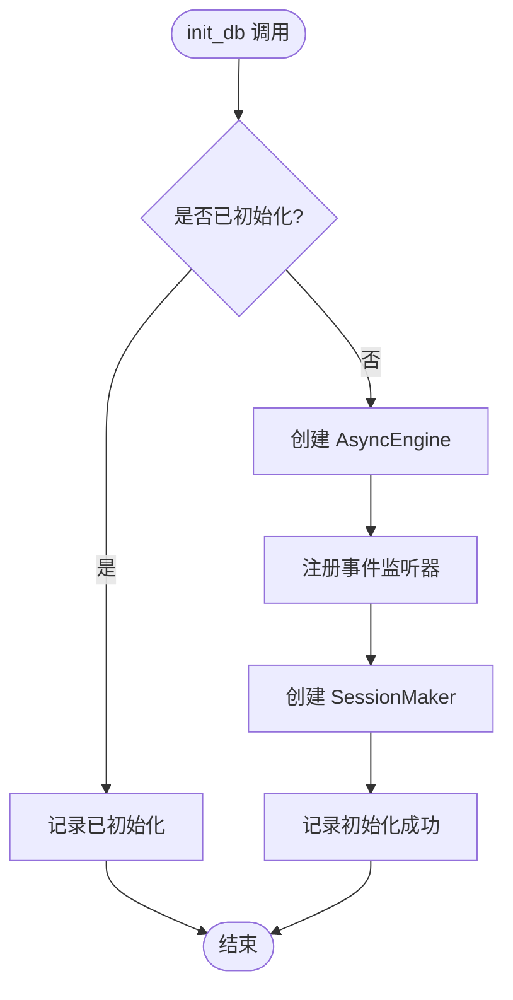
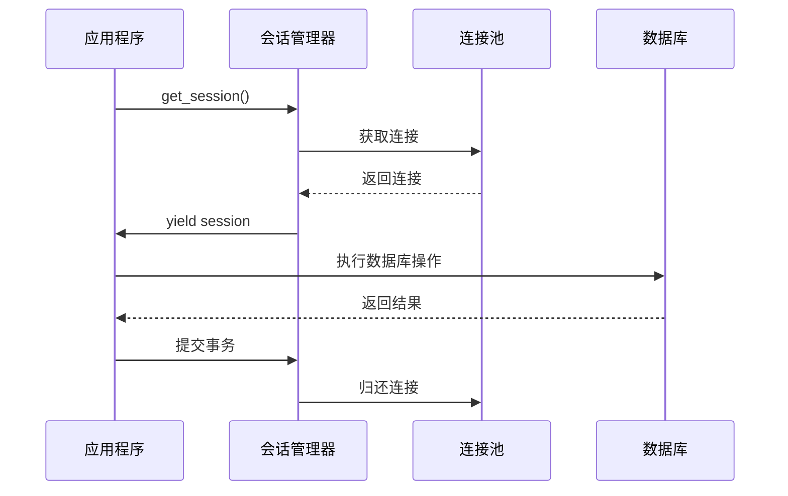

# 数据模型与数据库

<cite>
**本文档引用的文件**
- [internal/models/user.py](file://internal/models/user.py)
- [internal/dao/user.py](file://internal/dao/user.py)
- [ddl/1.0.0.sql](file://ddl/1.0.0.sql)
- [internal/infra/database.py](file://internal/infra/database.py)
- [pkg/database.py](file://pkg/database.py)
- [internal/schemas/user.py](file://internal/schemas/user.py)
- [internal/dtos/user.py](file://internal/dtos/user.py)
- [internal/services/user.py](file://internal/services/user.py)
- [tests/test_orm.py](file://tests/test_orm.py)
- [internal/controllers/publicapi/test.py](file://internal/controllers/publicapi/test.py)
</cite>

## 目录
1. [简介](#简介)
2. [项目架构概览](#项目架构概览)
3. [User 实体数据模型](#user-实体数据模型)
4. [数据库表结构](#数据库表结构)
5. [ORM 映射关系](#orm-映射关系)
6. [BaseDao 查询构建器](#basedao-查询构建器)
7. [ModelMixin 审计字段](#modelmixin-审计字段)
8. [数据库连接池管理](#数据库连接池管理)
9. [DAO 层操作示例](#dao-层操作示例)
10. [最佳实践与优化建议](#最佳实践与优化建议)

## 简介

本项目采用现代化的 FastAPI 架构，实现了完整的数据模型与数据库层设计。通过 SQLAlchemy 2.0 异步 ORM 提供强大的数据持久化能力，结合自定义的 DAO 层和查询构建器，为业务逻辑提供了简洁高效的数据库操作接口。

## 项目架构概览



**图表来源**
- [internal/dao/user.py](file://internal/dao/user.py#L1-L24)
- [pkg/database.py](file://pkg/database.py#L1-L50)
- [internal/models/user.py](file://internal/models/user.py#L1-L13)

## User 实体数据模型

### 字段定义与数据类型

User 实体继承自 Base 和 ModelMixin，包含以下核心字段：

| 字段名 | 数据类型 | 长度限制 | 约束条件 | 描述 |
|--------|----------|----------|----------|------|
| id | BigInteger | - | 主键、自增 | 唯一标识符，使用 Snowflake 算法生成 |
| username | String | 64 | 非空 | 用户名，支持中文字符 |
| phone | String | 11 | 非空 | 手机号码，固定长度 |
| account | String | 64 | 非空 | 账户标识，可能为用户名或邮箱 |

### 字段映射关系



**图表来源**
- [internal/models/user.py](file://internal/models/user.py#L7-L13)
- [pkg/database.py](file://pkg/database.py#L74-L87)

**章节来源**
- [internal/models/user.py](file://internal/models/user.py#L1-L13)
- [pkg/database.py](file://pkg/database.py#L74-L87)

## 数据库表结构

### DDL 定义

根据 `ddl/1.0.0.sql` 文件，User 表的完整结构如下：

| 列名 | 数据类型 | 约束 | 索引类型 | 描述 |
|------|----------|------|----------|------|
| id | bigint unsigned | PRIMARY KEY, AUTO_INCREMENT | 主键 | 唯一标识符 |
| username | varchar(64) | NOT NULL | UNIQUE | 用户名唯一索引 |
| phone | varchar(11) | NOT NULL | UNIQUE | 手机号唯一索引 |
| account | varchar(32) | NOT NULL | INDEX | 账户索引 |
| created_at | datetime | NOT NULL | - | 创建时间 |
| updated_at | datetime | NOT NULL | - | 更新时间 |
| deleted_at | datetime | DEFAULT NULL | - | 软删除标记 |
| creator_id | bigint unsigned | NOT NULL | - | 创建者 ID |
| updater_id | bigint unsigned | DEFAULT NULL | - | 更新者 ID |

### 索引策略

- **主键索引**: `PRIMARY KEY (id)` - 唯一标识记录
- **唯一索引**: `UNIQUE KEY username_unique (username)` - 用户名唯一性保证
- **唯一索引**: `UNIQUE KEY phone_unique (phone)` - 手机号唯一性保证  
- **普通索引**: `KEY account (account)` - 账户查询优化

**章节来源**
- [ddl/1.0.0.sql](file://ddl/1.0.0.sql#L1-L17)

## ORM 映射关系

### SQLAlchemy 配置

项目使用 SQLAlchemy 2.0 的声明式映射，通过 `mapped_column` 进行字段定义：



**图表来源**
- [ddl/1.0.0.sql](file://ddl/1.0.0.sql#L2-L16)
- [internal/models/user.py](file://internal/models/user.py#L8-L12)

### 类型安全映射

每个字段都使用类型注解确保编译时类型检查：

- `username: Mapped[str] = mapped_column(String(64))`
- `phone: Mapped[str] = mapped_column(String(11))`
- `account: Mapped[str] = mapped_column(String(64))`

**章节来源**
- [internal/models/user.py](file://internal/models/user.py#L1-L13)

## BaseDao 查询构建器

### 链式调用语法

BaseDao 提供了强大的查询构建器，支持流畅的链式调用语法：



**图表来源**
- [internal/dao/user.py](file://internal/dao/user.py#L9-L12)
- [pkg/database.py](file://pkg/database.py#L552-L557)

### 查询操作符

QueryBuilder 支持丰富的查询操作符：

| 操作符 | 方法名 | 示例 | 功能 |
|--------|--------|------|------|
| 等于 | `eq_()` | `.eq_(User.id, 1)` | 等值查询 |
| 不等于 | `ne_()` | `.ne_(User.status, 0)` | 非等值查询 |
| 大于 | `gt_()` | `.gt_(User.score, 90)` | 大于比较 |
| 小于 | `lt_()` | `.lt_(User.age, 18)` | 小于比较 |
| 大于等于 | `ge_()` | `.ge_(User.price, 100)` | 大于等于比较 |
| 小于等于 | `le_()` | `.le_(User.weight, 50)` | 小于等于比较 |
| 包含 | `in_()` | `.in_(User.type, [1,2,3])` | IN 查询 |
| 模糊匹配 | `like()` | `.like(User.name, "张%")` | LIKE 查询 |
| 为空 | `is_null()` | `.is_null(User.deleted_at)` | IS NULL 查询 |
| 逻辑或 | `or_()` | `.or_(condition1, condition2)` | OR 条件组合 |

### 分页查询



**图表来源**
- [pkg/database.py](file://pkg/database.py#L425-L433)

**章节来源**
- [pkg/database.py](file://pkg/database.py#L335-L433)
- [internal/dao/user.py](file://internal/dao/user.py#L9-L12)

## ModelMixin 审计字段

### 自动化审计机制

ModelMixin 提供了完整的审计字段自动化处理：

| 字段名 | 类型 | 自动填充 | 描述 |
|--------|------|----------|------|
| id | BigInteger | 自动生成 | 使用 Snowflake 算法生成唯一 ID |
| creator_id | BigInteger | 当前用户 | 创建记录时自动设置 |
| created_at | DateTime | 当前时间 | 记录创建时间戳 |
| updater_id | BigInteger | 当前用户 | 更新记录时自动设置 |
| updated_at | DateTime | 当前时间 | 记录最后更新时间 |
| deleted_at | DateTime | 软删除时设置 | 软删除标记时间 |

### 审计字段生命周期



**图表来源**
- [pkg/database.py](file://pkg/database.py#L211-L238)
- [pkg/database.py](file://pkg/database.py#L240-L257)

### 字段填充逻辑

ModelMixin 在不同场景下自动填充审计字段：

1. **插入时**: 自动生成 ID，设置创建时间和创建者
2. **更新时**: 更新时间戳，设置更新者信息
3. **软删除时**: 设置删除时间戳

**章节来源**
- [pkg/database.py](file://pkg/database.py#L74-L273)

## 数据库连接池管理

### 连接池初始化

系统通过 `init_db()` 函数初始化数据库连接池：



**图表来源**
- [internal/infra/database.py](file://internal/infra/database.py#L24-L54)

### 连接池配置参数

| 参数 | 值 | 说明 |
|------|-----|------|
| pool_size | 10 | 连接池大小 |
| max_overflow | 20 | 最大溢出连接数 |
| pool_timeout | 30 | 连接超时时间(秒) |
| pool_recycle | 1800 | 连接回收时间(秒) |
| pool_pre_ping | true | 连接前检查 |
| echo | false | SQL 日志开关 |

### 异步会话获取

`get_session()` 提供异步上下文管理器，支持自动事务管理和异常回滚：



**图表来源**
- [internal/infra/database.py](file://internal/infra/database.py#L69-L95)

**章节来源**
- [internal/infra/database.py](file://internal/infra/database.py#L24-L95)

## DAO 层操作示例

### 基础查询操作

#### 1. 按手机号查询用户

```python
# 使用链式调用语法
user = await user_dao.get_by_phone(phone_number)
```

#### 2. 条件查询组合

```python
# 复杂查询条件
users = await user_dao.querier \
    .eq_(User.username, "admin") \
    .like(User.phone, "138") \
    .ge_(User.created_at, start_date) \
    .all()
```

#### 3. 分页查询

```python
# 分页查询用户列表
users = await user_dao.querier \
    .paginate(page=1, limit=20) \
    .desc_(User.created_at) \
    .all()
```

### 更新操作示例

#### 1. 单条记录更新

```python
# 使用 UpdateBuilder 进行更新
await user_dao.updater \
    .eq_(User.id, user_id) \
    .update(username=new_username, phone=new_phone) \
    .execute()
```

#### 2. 实例更新

```python
# 使用实例方法进行更新
user.username = new_username
await user.update(session_provider=get_session)
```

#### 3. 软删除操作

```python
# 软删除用户
await user.soft_delete(session_provider=get_session)
```

### 批量操作示例

#### 1. 批量插入

```python
# 批量插入用户数据
await User.insert_rows(
    rows=[
        {"username": "user1", "phone": "13800138000", "account": "user1"},
        {"username": "user2", "phone": "13800138001", "account": "user2"}
    ],
    session_provider=get_session
)
```

#### 2. 批量更新

```python
# 批量更新用户状态
await user_dao.updater \
    .in_(User.id, user_ids) \
    .update(status=1) \
    .execute()
```

**章节来源**
- [internal/dao/user.py](file://internal/dao/user.py#L1-L24)
- [pkg/database.py](file://pkg/database.py#L552-L611)
- [tests/test_orm.py](file://tests/test_orm.py#L203-L227)

## 最佳实践与优化建议

### 性能优化建议

1. **索引优化**
   - 为经常查询的字段添加适当索引
   - 避免过度索引导致写入性能下降
   - 使用复合索引优化多字段查询

2. **查询优化**
   - 使用分页查询处理大数据集
   - 避免 N+1 查询问题
   - 合理使用 JOIN 操作

3. **连接池优化**
   - 根据并发需求调整连接池大小
   - 监控连接池使用情况
   - 设置合适的超时时间

### 安全最佳实践

1. **输入验证**
   - 在业务层进行数据验证
   - 使用 Pydantic 模型进行请求验证
   - 防止 SQL 注入攻击

2. **权限控制**
   - 实现基于角色的访问控制
   - 记录审计日志
   - 限制敏感数据的访问范围

3. **数据保护**
   - 敏感数据加密存储
   - 实施数据备份策略
   - 定期安全审计

### 代码组织建议

1. **模块化设计**
   - 保持 DAO 层与业务逻辑分离
   - 使用依赖注入管理数据库连接
   - 实现统一的错误处理机制

2. **测试覆盖**
   - 编写单元测试覆盖核心功能
   - 使用集成测试验证数据库交互
   - 实施持续集成和部署

3. **文档维护**
   - 保持数据库结构文档同步
   - 记录 API 接口变更
   - 提供清晰的使用示例

通过遵循这些最佳实践，可以构建高性能、安全可靠的数据库应用程序，为业务发展提供稳定的数据支撑。