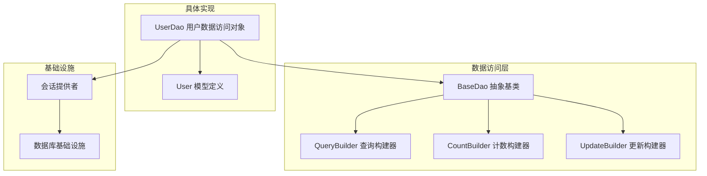
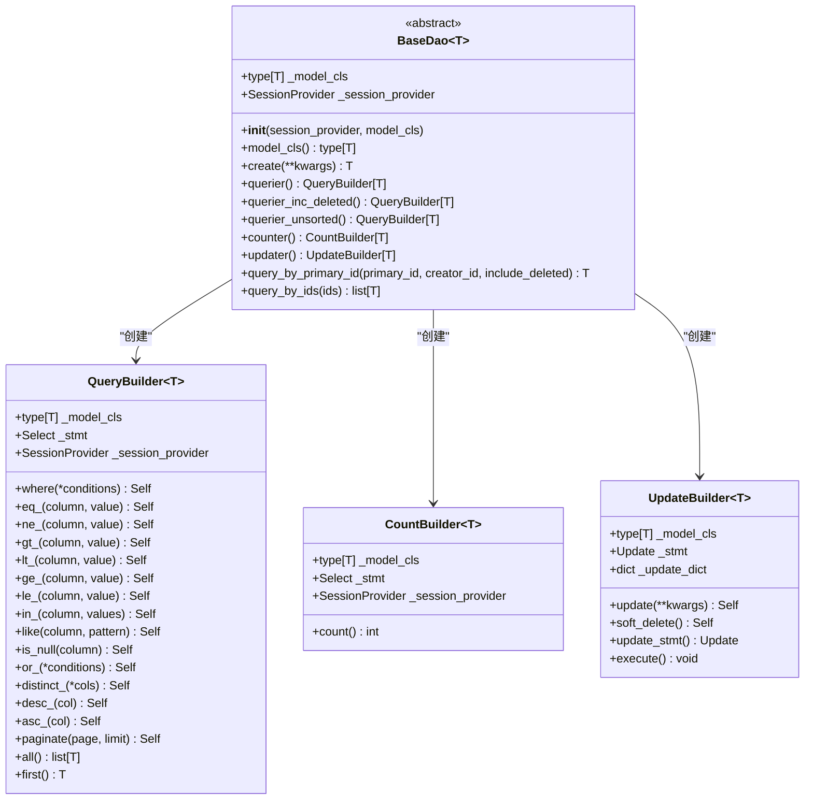
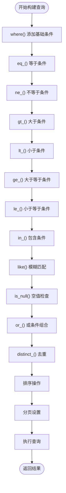
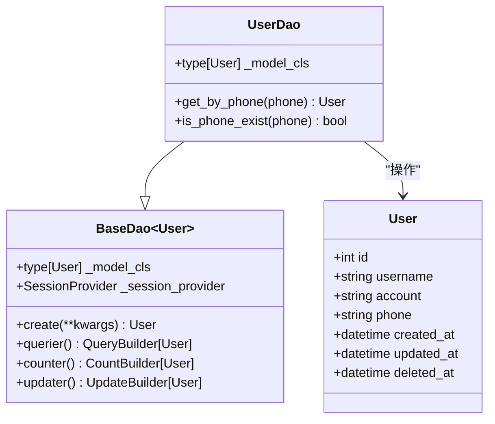
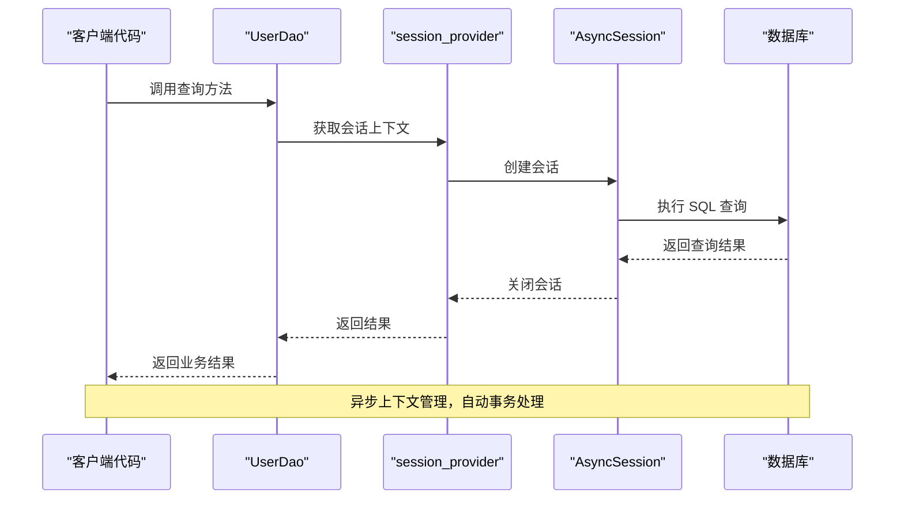
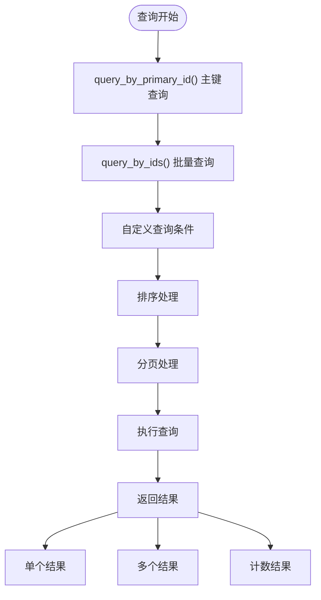
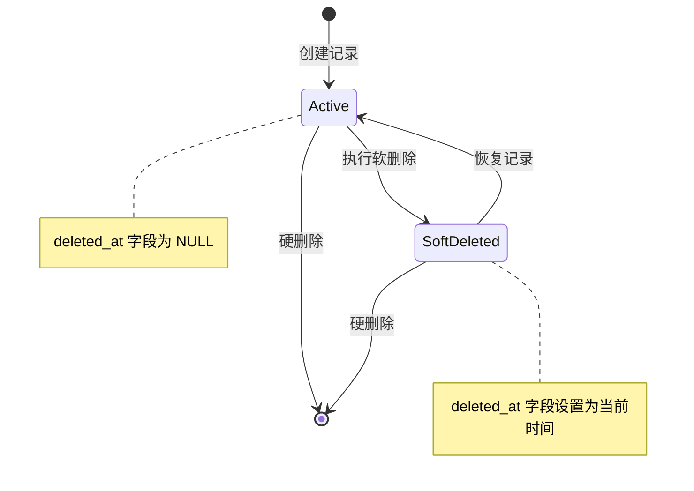
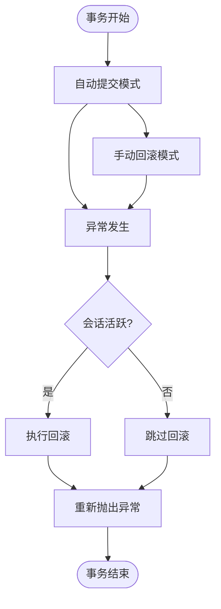

# 数据访问对象（DAO）

<cite>
**本文档中引用的文件**
- [pkg/database.py](file://pkg/database.py)
- [internal/dao/user.py](file://internal/dao/user.py)
- [internal/models/user.py](file://internal/models/user.py)
- [internal/infra/database.py](file://internal/infra/database.py)
- [tests/test_orm.py](file://tests/test_orm.py)
- [internal/controllers/publicapi/test.py](file://internal/controllers/publicapi/test.py)
</cite>

## 目录
1. [简介](#简介)
2. [项目结构概览](#项目结构概览)
3. [BaseDao 抽象基类设计](#basedao-抽象基类设计)
4. [查询构建器系统](#查询构建器系统)
5. [UserDao 实现示例](#userdao-实现示例)
6. [依赖注入与会话管理](#依赖注入与会话管理)
7. [CRUD 操作详解](#crud-操作详解)
8. [高级查询功能](#高级查询功能)
9. [事务边界与异常处理](#事务边界与异常处理)
10. [最佳实践指南](#最佳实践指南)

## 简介

本项目采用分层架构设计，其中 DAO（数据访问对象）层作为业务逻辑与数据库交互的核心抽象层。通过 BaseDao 抽象基类和配套的查询构建器系统，提供了类型安全、链式调用的数据库操作接口，支持复杂的查询组合、批量操作和软删除等企业级功能。

## 项目结构概览

**图表来源**
- [pkg/database.py](file://pkg/database.py#L523-L611)
- [internal/dao/user.py](file://internal/dao/user.py#L6-L23)

## BaseDao 抽象基类设计

### 核心设计理念

BaseDao 采用泛型设计，通过类型参数约束确保类型安全。其设计遵循以下核心原则：

1. **类型安全**：利用 Python 类型注解确保编译时类型检查
2. **链式调用**：提供流畅的 API 设计，支持方法链式调用
3. **依赖注入**：通过 session_provider 实现灵活的会话管理
4. **职责分离**：清晰分离查询、计数、更新等不同功能模块

### 架构图

**图表来源**
- [pkg/database.py](file://pkg/database.py#L523-L611)
- [pkg/database.py](file://pkg/database.py#L335-L444)
- [pkg/database.py](file://pkg/database.py#L446-L494)
- [pkg/database.py](file://pkg/database.py#L463-L517)

### 核心属性与方法

BaseDao 提供了三个主要的属性集合，每个都针对特定的数据库操作模式进行了优化：

#### querier 属性
提供默认排序（按更新时间降序）的查询功能，适用于大多数查询场景。

#### querier_inc_deleted 属性  
包含已软删除记录的查询功能，用于需要查看历史数据的场景。

#### counter 属性  
专门用于统计查询，提供高效的计数功能。

#### updater 属性  
提供通用更新功能，支持批量更新操作。

**章节来源**
- [pkg/database.py](file://pkg/database.py#L551-L595)

## 查询构建器系统

### QueryBuilder 链式调用机制

查询构建器采用了经典的链式调用模式，每个方法都返回当前实例（Self），允许连续调用多个方法。

#### 基础条件操作

**图表来源**
- [pkg/database.py](file://pkg/database.py#L344-L389)

### 高级查询功能

#### 条件组合
支持复杂的条件组合，包括 AND、OR 逻辑运算：

- **AND 组合**：通过连续调用多个条件方法实现
- **OR 组合**：使用 `or_()` 方法支持多条件或运算
- **复合条件**：结合 `where()` 方法支持复杂表达式

#### 分页查询
内置分页功能，支持指定页码和每页大小：

- **参数验证**：确保页码和限制值的有效性
- **偏移计算**：自动计算数据库查询的偏移量
- **限制设置**：设置结果集的最大数量

#### 排序与去重
提供灵活的排序和去重选项：

- **多列排序**：支持多个字段的排序组合
- **升序降序**：提供 ASC 和 DESC 排序选项
- **DISTINCT 支持**：支持单列或多列去重

**章节来源**
- [pkg/database.py](file://pkg/database.py#L408-L444)

### CountBuilder 计数功能

CountBuilder 专门用于高效的数据统计，支持多种计数模式：

#### 基础计数
- **COUNT(*)**：统计所有记录
- **COUNT(column)**：统计指定列的非空值
- **DISTINCT 计数**：统计唯一值的数量

#### 软删除过滤
自动处理软删除记录的过滤，确保统计数据的准确性。

**章节来源**
- [pkg/database.py](file://pkg/database.py#L446-L461)

### UpdateBuilder 更新功能

UpdateBuilder 提供了强大的更新操作能力，支持软删除和批量更新：

#### 自动字段填充
- **updated_at**：自动更新时间戳
- **updater_id**：自动填充操作用户ID
- **deleted_at**：软删除时同步更新时间戳

#### 软删除支持
- **soft_delete()**：标记记录为已删除状态
- **时间同步**：确保 deleted_at 和 updated_at 同步

**章节来源**
- [pkg/database.py](file://pkg/database.py#L463-L517)

## UserDao 实现示例

### 继承关系与类型绑定

UserDao 通过继承 BaseDao 并指定泛型参数 User，获得了完整的数据库操作能力：

**图表来源**
- [internal/dao/user.py](file://internal/dao/user.py#L6-L23)
- [internal/models/user.py](file://internal/models/user.py#L7-L13)

### 特定业务方法

UserDao 实现了两个具体的业务方法，展示了如何扩展 BaseDao 的功能：

#### get_by_phone 方法
实现了基于手机号的用户查询，充分利用了 BaseDao 的 querier 功能：

- **链式调用**：`eq_(User.phone, phone).first()`
- **类型安全**：编译时检查字段类型
- **异常处理**：自动处理查询结果

#### is_phone_exist 方法
实现了手机号存在性检查，展示了计数查询的应用：

- **计数查询**：`counter.eq_(User.phone, phone).count()`
- **布尔结果**：将计数转换为存在性判断
- **性能优化**：使用高效的 COUNT 查询

**章节来源**
- [internal/dao/user.py](file://internal/dao/user.py#L9-L17)

### 单例模式实现

UserDao 采用单例模式设计，通过全局变量 user_dao 提供统一的访问入口：

- **延迟初始化**：session_provider 是工厂函数，避免导入时建立连接
- **线程安全**：Python 全局变量的原子性保证
- **依赖注入**：通过构造函数注入会话提供者

**章节来源**
- [internal/dao/user.py](file://internal/dao/user.py#L20-L23)

## 依赖注入与会话管理

### SessionProvider 设计

session_provider 采用函数式依赖注入模式，提供了灵活的会话管理机制：

**图表来源**
- [internal/dao/user.py](file://internal/dao/user.py#L23)
- [internal/infra/database.py](file://internal/infra/database.py#L69-L95)

### 异步上下文生命周期

session_provider 实现了完整的异步上下文生命周期管理：

#### 上下文管理器
- **自动资源管理**：使用 `asynccontextmanager` 确保资源正确释放
- **异常安全**：捕获异常并自动回滚事务
- **可配置刷新**：支持禁用自动刷新的特殊场景

#### 事务边界
- **自动提交**：正常情况下自动提交事务
- **自动回滚**：异常发生时自动回滚
- **嵌套支持**：支持事务的嵌套和隔离

**章节来源**
- [internal/infra/database.py](file://internal/infra/database.py#L69-L95)

### 数据库连接池管理

数据库基础设施提供了完整的连接池管理功能：

#### 连接池配置
- **预连接检查**：`pool_pre_ping=True` 确保连接有效性
- **动态扩容**：`max_overflow` 支持动态连接扩展
- **超时控制**：`pool_timeout` 防止连接请求阻塞
- **生命周期管理**：`pool_recycle` 自动回收过期连接

#### 初始化流程
- **幂等性检查**：避免重复初始化
- **事件监听**：集成 SQL 性能监控
- **错误处理**：完善的异常处理机制

**章节来源**
- [internal/infra/database.py](file://internal/infra/database.py#L24-L54)

## CRUD 操作详解

### 基础 CRUD 方法

BaseDao 提供了完整的 CRUD 操作支持，每个方法都经过精心设计以确保类型安全和性能优化。

#### 查询操作

**图表来源**
- [pkg/database.py](file://pkg/database.py#L597-L611)

#### 插入操作

BaseDao 支持多种插入模式，满足不同的业务需求：

##### 单对象插入
- **save() 方法**：严格插入新对象，要求对象处于 transient 状态
- **自动字段填充**：自动生成 ID、时间戳等字段
- **事务保证**：确保插入操作的原子性

##### 批量插入
- **insert_instances()**：批量插入对象实例
- **insert_rows()**：批量插入字典数据
- **性能优化**：使用数据库的批量插入特性

**章节来源**
- [pkg/database.py](file://pkg/database.py#L150-L199)
- [pkg/database.py](file://pkg/database.py#L112-L144)

#### 更新操作

UpdateBuilder 提供了灵活的更新功能：

##### 字段更新
- **动态字段**：支持任意字段的更新
- **类型安全**：编译时检查字段类型
- **自动同步**：更新时间戳和操作用户ID

##### 对象更新
- **状态检查**：确保对象处于持久化状态
- **变更检测**：只更新发生变化的字段
- **版本控制**：支持乐观锁机制

**章节来源**
- [pkg/database.py](file://pkg/database.py#L171-L199)

### 软删除机制

系统实现了完整的软删除功能，支持逻辑删除和恢复：

#### 软删除流程

**图表来源**
- [pkg/database.py](file://pkg/database.py#L195-L199)

#### 软删除特性
- **自动时间戳**：自动生成删除时间
- **查询过滤**：默认查询不包含软删除记录
- **恢复支持**：支持软删除记录的恢复

**章节来源**
- [pkg/database.py](file://pkg/database.py#L195-L199)

## 高级查询功能

### 条件组合与逻辑运算

BaseDao 的查询构建器支持复杂的条件组合，满足企业级应用的需求：

#### 多条件组合
- **连续调用**：多个条件方法的连续调用实现 AND 逻辑
- **OR 运算**：`or_()` 方法支持多个条件的 OR 逻辑
- **混合逻辑**：支持 AND 和 OR 的混合使用

#### 条件操作符
- **比较运算**：`eq_`, `ne_`, `gt_`, `lt_`, `ge_`, `le_`
- **集合运算**：`in_` 支持列表包含检查
- **模糊匹配**：`like` 支持通配符匹配
- **空值检查**：`is_null` 检查字段是否为空

**章节来源**
- [pkg/database.py](file://pkg/database.py#L344-L389)

### 分页查询实现

分页查询是现代 Web 应用的基础功能，BaseDao 提供了完整的分页支持：

#### 分页参数验证
- **页码检查**：确保页码大于等于 1
- **限制检查**：确保每页大小大于等于 1
- **边界处理**：处理超出范围的查询请求

#### 偏移计算
- **数学公式**：`(page - 1) * limit` 计算偏移量
- **零边界**：第一页的偏移量为 0
- **大页码处理**：支持任意大小的页码

**章节来源**
- [pkg/database.py](file://pkg/database.py#L425-L433)

### 排序与去重功能

#### 排序机制
- **单字段排序**：支持升序和降序
- **多字段排序**：支持多个字段的排序组合
- **默认排序**：查询器默认按更新时间降序排列

#### 去重功能
- **DISTINCT 支持**：支持单列和多列去重
- **性能优化**：数据库级别的去重处理
- **类型安全**：编译时检查字段类型

**章节来源**
- [pkg/database.py](file://pkg/database.py#L391-L401)

## 事务边界与异常处理

### 事务管理策略

BaseDao 的事务管理采用了多层次的安全保障机制：

**图表来源**
- [internal/infra/database.py](file://internal/infra/database.py#L79-L94)

### 异常处理机制

#### 自动异常处理
- **会话状态检查**：自动检测会话的活跃状态
- **回滚保护**：只有活跃会话才执行回滚
- **异常传播**：确保原始异常信息不丢失

#### 错误恢复
- **资源清理**：确保数据库连接正确释放
- **状态重置**：异常后会话状态的正确重置
- **日志记录**：详细的异常日志记录

**章节来源**
- [internal/infra/database.py](file://internal/infra/database.py#L79-L94)

### 事务边界设计

#### 边界划分
- **方法级别**：每个 DAO 方法都是独立的事务边界
- **批量操作**：批量操作在单个事务中完成
- **嵌套事务**：支持事务的嵌套和隔离

#### 性能考虑
- **连接池复用**：充分利用连接池提高性能
- **延迟提交**：减少不必要的数据库往返
- **异常快速失败**：异常情况下的快速失败机制

**章节来源**
- [pkg/database.py](file://pkg/database.py#L150-L199)

## 最佳实践指南

### 性能优化建议

#### 查询优化
- **索引使用**：确保查询条件字段上有适当的索引
- **字段选择**：只查询需要的字段，避免 SELECT *
- **分页处理**：大数据集必须使用分页查询
- **缓存策略**：合理使用查询结果缓存

#### 批量操作
- **批量大小**：控制批量操作的大小，避免内存溢出
- **事务分割**：大数据量时考虑分批处理
- **连接池配置**：根据业务需求调整连接池参数

### 安全最佳实践

#### SQL 注入防护
- **参数化查询**：所有查询都使用参数化形式
- **输入验证**：对用户输入进行严格的验证
- **权限控制**：实现适当的数据访问权限控制

#### 敏感数据处理
- **字段加密**：敏感字段应进行加密存储
- **访问审计**：记录敏感数据的访问日志
- **传输安全**：确保数据传输过程中的安全性

### 代码组织建议

#### DAO 层设计
- **单一职责**：每个 DAO 只负责特定实体的操作
- **接口隔离**：提供清晰的接口边界
- **依赖倒置**：通过接口而非具体实现编程

#### 测试策略
- **单元测试**：为每个 DAO 方法编写单元测试
- **集成测试**：测试 DAO 与数据库的集成
- **性能测试**：定期进行性能基准测试

### 监控与维护

#### 性能监控
- **查询跟踪**：监控慢查询和异常查询
- **连接池监控**：监控数据库连接池的使用情况
- **错误率统计**：统计和分析错误发生的频率和原因

#### 维护策略
- **定期审查**：定期审查和优化查询语句
- **版本管理**：数据库结构变更的版本控制
- **备份策略**：制定完善的数据备份和恢复策略

**章节来源**
- [tests/test_orm.py](file://tests/test_orm.py#L108-L227)
- [internal/controllers/publicapi/test.py](file://internal/controllers/publicapi/test.py#L130-L244)