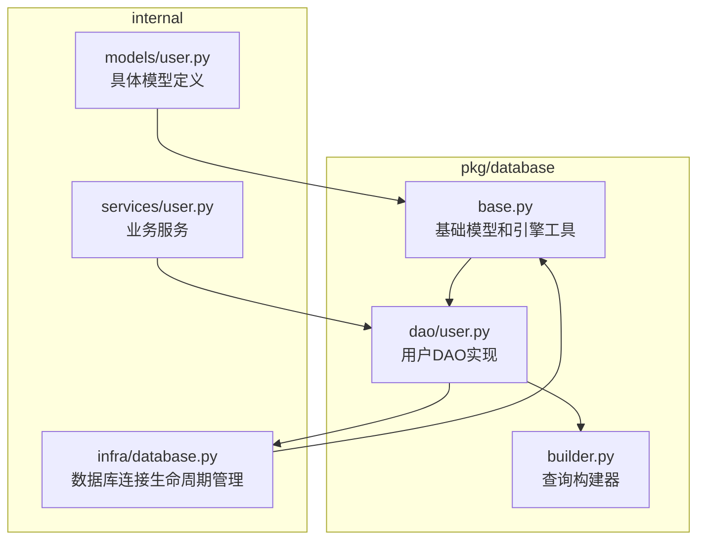
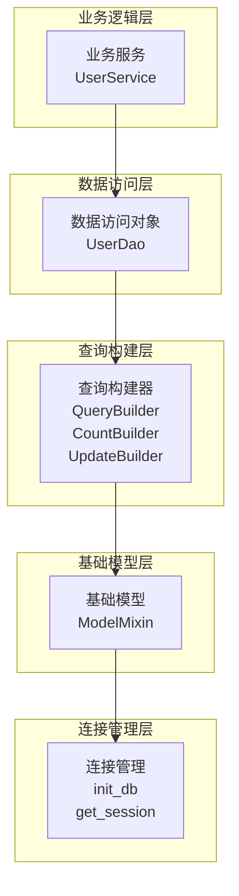
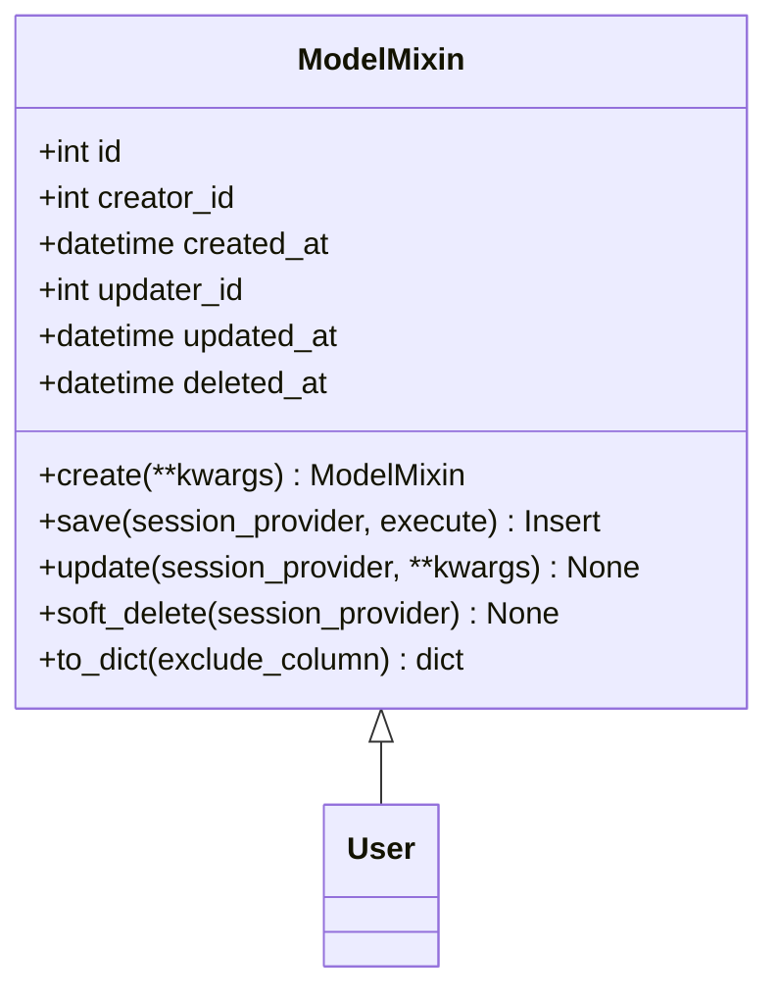
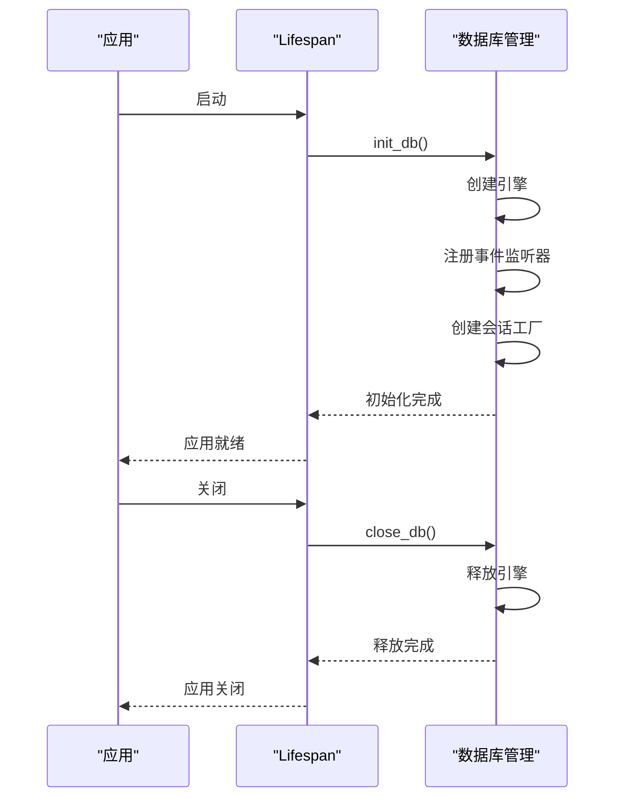
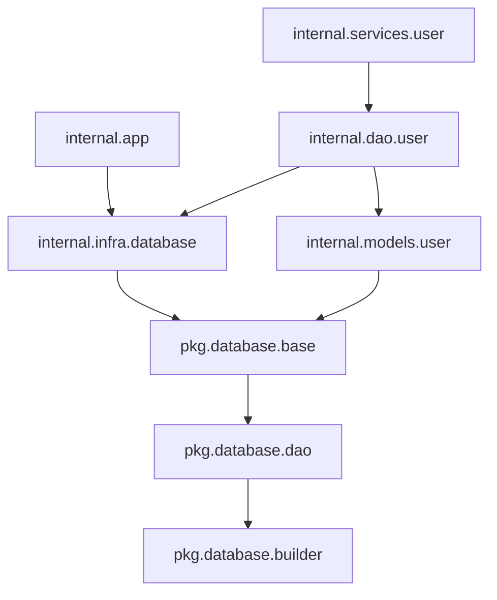

# 模块化数据库ORM

<cite>
**本文档中引用的文件**  
- [database.py](file://internal/infra/database.py)
- [base.py](file://pkg/database/base.py)
- [dao.py](file://pkg/database/dao.py)
- [builder.py](file://pkg/database/builder.py)
- [user.py](file://internal/models/user.py)
- [user.py](file://internal/dao/user.py)
- [user.py](file://internal/services/user.py)
- [load_config.py](file://internal/config/load_config.py)
- [app.py](file://internal/app.py)
- [main.py](file://main.py)
- [test_orm.py](file://tests/test_orm.py)
</cite>

## 目录
1. [简介](#简介)
2. [项目结构](#项目结构)
3. [核心组件](#核心组件)
4. [架构概述](#架构概述)
5. [详细组件分析](#详细组件分析)
6. [依赖分析](#依赖分析)
7. [性能考虑](#性能考虑)
8. [故障排除指南](#故障排除指南)
9. [结论](#结论)

## 简介
本项目实现了一个模块化、可扩展的异步数据库ORM系统，基于SQLAlchemy 2.0构建，专为FastAPI后端应用设计。该ORM系统通过分层架构实现了数据库连接管理、模型定义、数据访问对象（DAO）和查询构建器的完全解耦，提供了高性能、易维护的数据库操作解决方案。系统支持软删除、自动填充创建/更新时间戳、雪花ID生成等企业级特性，并通过构建器模式提供了流畅的查询API。

## 项目结构
项目采用分层架构设计，将ORM相关组件分布在不同的包中，实现了关注点分离。



**图示来源**  
- [base.py](file://pkg/database/base.py)
- [dao.py](file://pkg/database/dao.py)
- [builder.py](file://pkg/database/builder.py)
- [database.py](file://internal/infra/database.py)

## 核心组件
系统的核心ORM组件包括：基础模型类（ModelMixin）、数据访问对象（BaseDao）、查询构建器（QueryBuilder）和数据库连接管理器。这些组件共同构成了一个完整的、类型安全的异步数据库操作框架，支持批量操作、事务处理和复杂的查询构建。

**本节来源**  
- [base.py](file://pkg/database/base.py#L48-L361)
- [dao.py](file://pkg/database/dao.py#L15-L178)
- [builder.py](file://pkg/database/builder.py#L18-L231)
- [database.py](file://internal/infra/database.py#L1-L140)

## 架构概述
系统采用分层架构，从下到上分别为：数据库连接层、基础模型层、构建器层、DAO层和业务服务层。这种设计实现了各层之间的松耦合，使得每个组件可以独立开发和测试。



**图示来源**  
- [user.py](file://internal/services/user.py)
- [user.py](file://internal/dao/user.py)
- [builder.py](file://pkg/database/builder.py)
- [base.py](file://pkg/database/base.py)
- [database.py](file://internal/infra/database.py)

## 详细组件分析

### 基础模型分析
`ModelMixin`类提供了企业级应用所需的基础字段和操作方法，包括ID、创建者、创建时间、更新者、更新时间和软删除时间戳。



**图示来源**  
- [base.py](file://pkg/database/base.py#L59-L361)
- [user.py](file://internal/models/user.py#L7-L13)

### 数据访问对象分析
`BaseDao`类提供了类型安全的数据访问接口，通过泛型确保类型一致性，并提供了查询、计数和更新构建器的便捷访问。

```mermaid
classDiagram
class BaseDao[T] {
+session_provider SessionProvider
+_model_cls type[T]
+model_cls type[T]
+create(**kwargs) T
+querier QueryBuilder[T]
+counter CountBuilder[T]
+updater UpdateBuilder[T]
+query_by_primary_id(primary_id, creator_id, include_deleted) T | None
+query_by_ids(ids) list[T]
}
class QueryBuilder[T] {
+where(*conditions) Self
+eq_(column, value) Self
+in_(column, values) Self
+paginate(page, limit) Self
+all() list[T]
+first() T | None
}
class CountBuilder[T] {
+count() int
}
class UpdateBuilder[T] {
+update(**kwargs) Self
+soft_delete() Self
+execute() None
}
BaseDao <|-- UserDao
UserDao --> QueryBuilder
UserDao --> CountBuilder
UserDao --> UpdateBuilder
```

**图示来源**  
- [dao.py](file://pkg/database/dao.py#L15-L178)
- [builder.py](file://pkg/database/builder.py#L18-L231)
- [user.py](file://internal/dao/user.py#L6-L24)

### 连接管理分析
数据库连接管理实现了单例模式和生命周期管理，确保在整个应用生命周期内数据库连接的正确初始化和释放。



**图示来源**  
- [app.py](file://internal/app.py#L89-L121)
- [database.py](file://internal/infra/database.py#L24-L65)

## 依赖分析
系统通过清晰的依赖关系实现了模块化设计，各组件之间的依赖都是单向且明确的。



**图示来源**  
- [app.py](file://internal/app.py)
- [database.py](file://internal/infra/database.py)
- [base.py](file://pkg/database/base.py)
- [dao.py](file://pkg/database/dao.py)
- [builder.py](file://pkg/database/builder.py)
- [user.py](file://internal/models/user.py)
- [user.py](file://internal/dao/user.py)
- [user.py](file://internal/services/user.py)

## 性能考虑
系统在设计时充分考虑了性能优化，包括连接池配置、SQL执行监控和批量操作支持。

- **连接池配置**：设置了合理的连接池大小（10）、溢出大小（20）和超时时间（30秒），避免了连接耗尽问题
- **SQL监控**：通过事件监听器实现了慢SQL检测，当SQL执行时间超过阈值时会记录警告日志
- **批量操作**：提供了`insert_rows`和`insert_instances`方法，支持高效的大批量数据插入
- **事务管理**：通过`execute_transaction`函数支持手动事务控制，可以处理复杂的业务逻辑

**本节来源**  
- [database.py](file://internal/infra/database.py#L37-L47)
- [database.py](file://internal/infra/database.py#L99-L126)
- [base.py](file://pkg/database/base.py#L98-L149)
- [dao.py](file://pkg/database/dao.py#L106-L178)

## 故障排除指南
以下是一些常见问题及其解决方案：

1. **数据库连接未初始化**：确保在应用启动时调用了`init_db()`函数，通常在FastAPI的lifespan事件中调用
2. **慢SQL问题**：检查查询是否缺少索引，或考虑优化查询条件
3. **类型错误**：由于使用了泛型，确保DAO类正确指定了模型类型
4. **事务回滚**：在`execute_transaction`回调中抛出异常会导致事务自动回滚
5. **ID生成冲突**：系统使用雪花ID生成器确保分布式环境下的ID唯一性

**本节来源**  
- [database.py](file://internal/infra/database.py#L76-L77)
- [base.py](file://pkg/database/base.py#L160-L165)
- [base.py](file://pkg/database/base.py#L180-L185)
- [dao.py](file://pkg/database/dao.py#L170-L177)
- [base.py](file://pkg/database/base.py#L220-L221)

## 结论
该项目实现了一个功能完整、设计良好的模块化ORM系统，具有以下优势：

- **分层清晰**：各组件职责明确，易于维护和扩展
- **类型安全**：充分利用Python类型提示和泛型，减少运行时错误
- **性能优化**：内置连接池、SQL监控和批量操作支持
- **企业级特性**：支持软删除、自动时间戳填充和分布式ID生成
- **易用性**：提供流畅的构建器API和便捷的DAO封装

该ORM系统可以作为FastAPI项目的标准数据库解决方案，适用于中大型企业级应用开发。