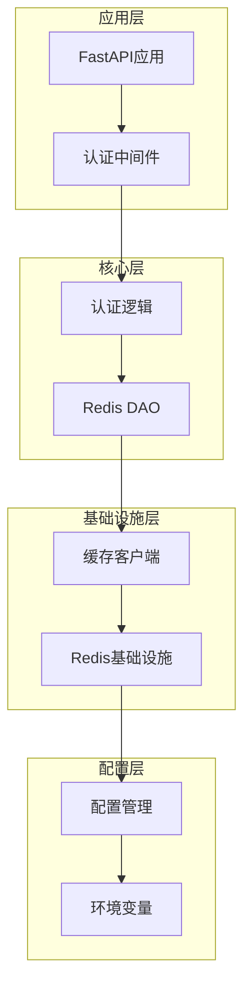
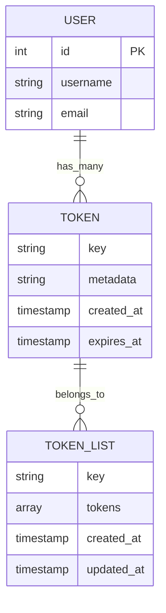
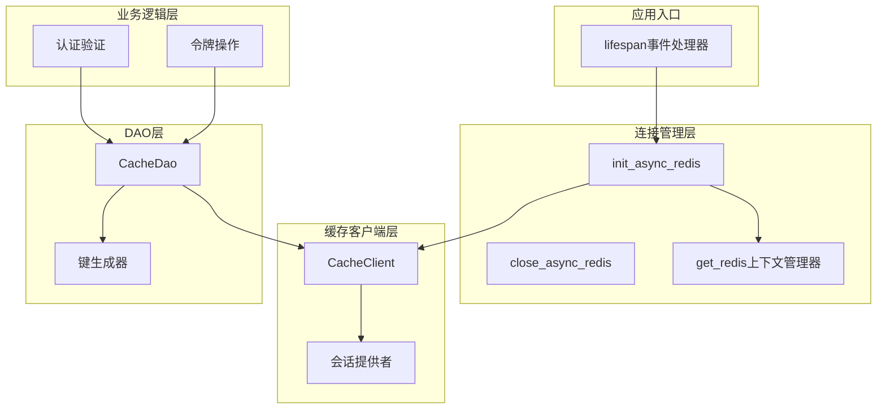
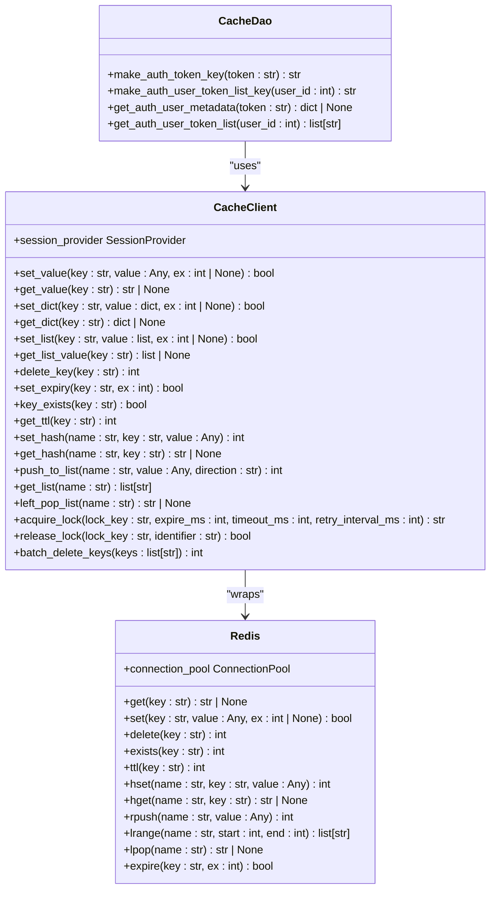
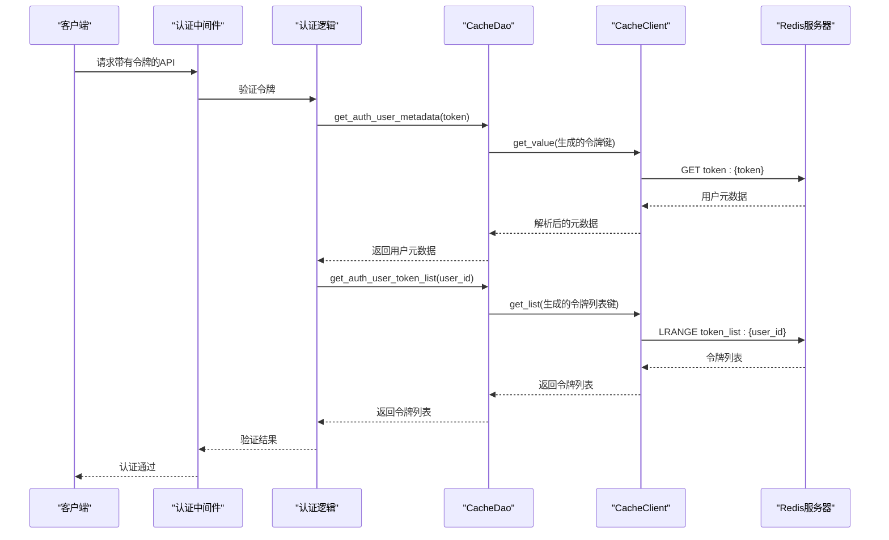
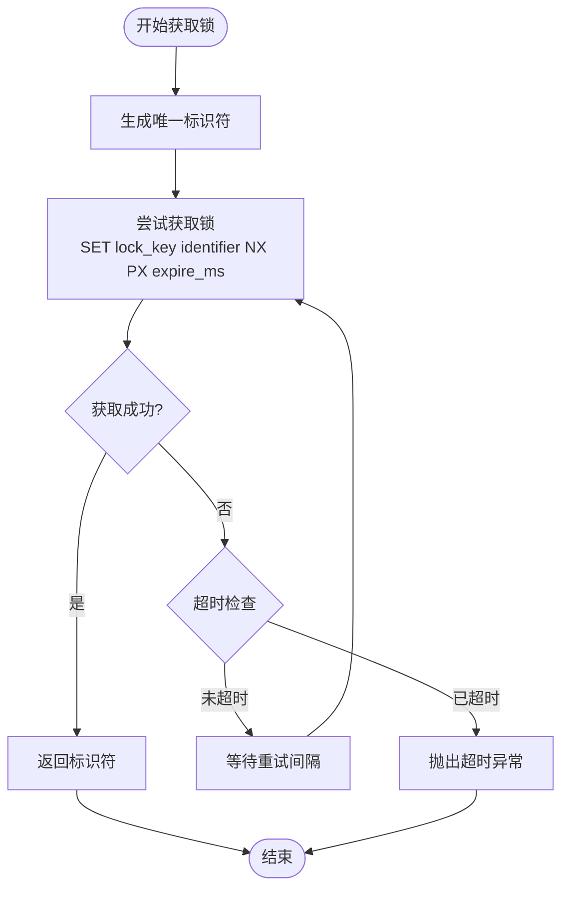
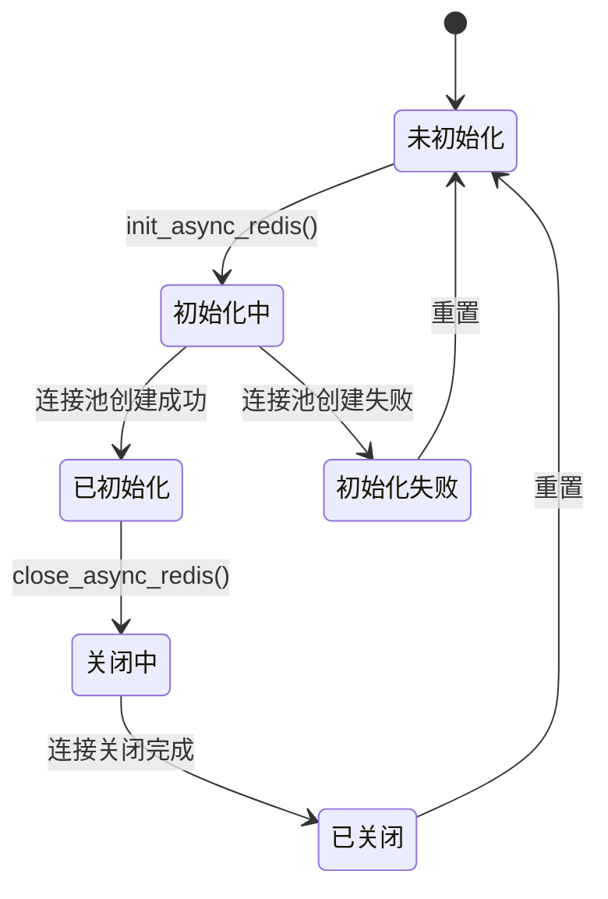
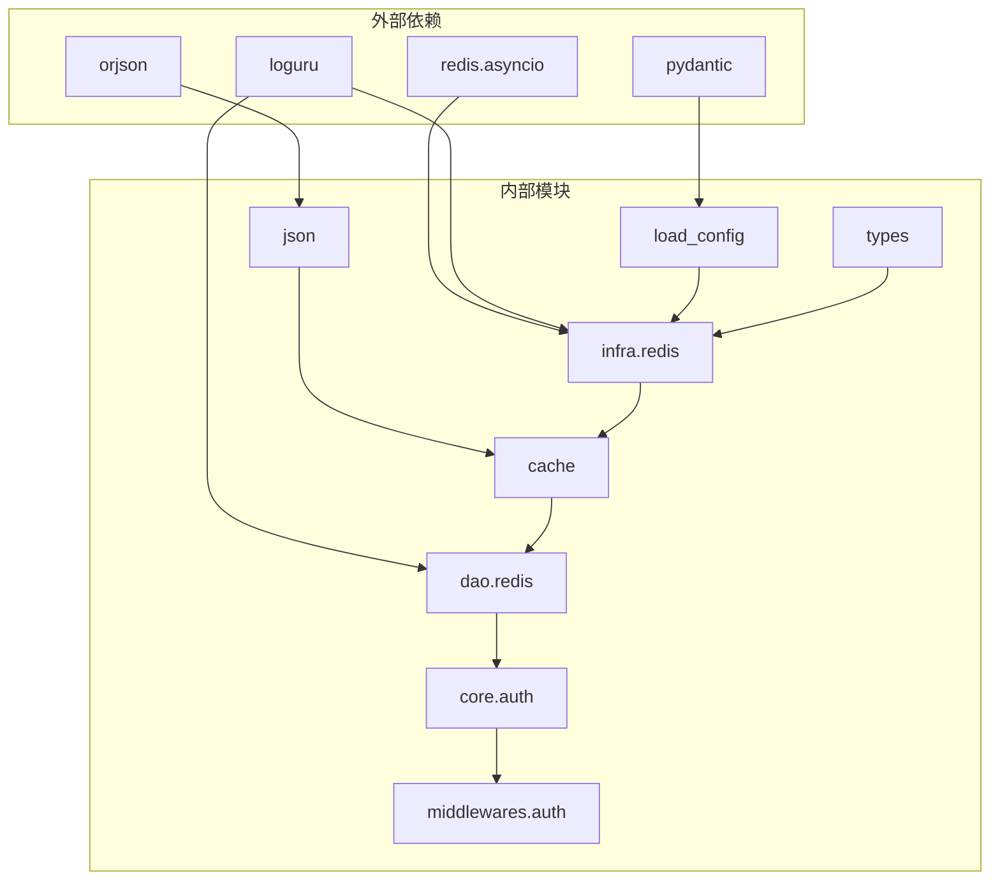

# Redis数据访问对象

<cite>
**本文档引用的文件**
- [internal/dao/redis.py](file://internal/dao/redis.py)
- [internal/infra/redis.py](file://internal/infra/redis.py)
- [pkg/toolkit/cache.py](file://pkg/toolkit/cache.py)
- [internal/config/load_config.py](file://internal/config/load_config.py)
- [internal/app.py](file://internal/app.py)
- [internal/core/auth.py](file://internal/core/auth.py)
- [internal/middlewares/auth.py](file://internal/middlewares/auth.py)
- [pkg/toolkit/json.py](file://pkg/toolkit/json.py)
- [pkg/toolkit/types.py](file://pkg/toolkit/types.py)
- [configs/.env.dev](file://configs/.env.dev)
</cite>

## 目录
1. [简介](#简介)
2. [项目结构](#项目结构)
3. [核心组件](#核心组件)
4. [架构概览](#架构概览)
5. [详细组件分析](#详细组件分析)
6. [依赖关系分析](#依赖关系分析)
7. [性能考虑](#性能考虑)
8. [故障排除指南](#故障排除指南)
9. [结论](#结论)
10. [附录](#附录)

## 简介

本文档详细介绍了FastAPI后端项目中的Redis数据访问对象（DAO）设计与实现。Redis DAO作为缓存层的核心组件，负责管理用户认证令牌的缓存、用户令牌列表的维护以及相关的缓存策略配置。该实现采用异步编程模型，充分利用Redis的高性能特性，为整个应用提供高效的缓存服务。

该系统通过分层架构实现了以下关键功能：
- 异步Redis连接管理与生命周期控制
- 缓存数据的持久化和读取操作
- 用户认证令牌的验证机制
- 分布式锁的获取与释放
- 缓存策略和过期时间的灵活配置

## 项目结构

该项目采用模块化的组织方式，Redis相关的组件分布在不同的层次中：

**图表来源**
- [internal/app.py](file://internal/app.py#L84-L108)
- [internal/middlewares/auth.py](file://internal/middlewares/auth.py#L88-L150)
- [internal/core/auth.py](file://internal/core/auth.py#L4-L18)

**章节来源**
- [internal/app.py](file://internal/app.py#L1-L109)
- [internal/dao/redis.py](file://internal/dao/redis.py#L1-L37)
- [internal/infra/redis.py](file://internal/infra/redis.py#L1-L98)

## 核心组件

### Redis DAO设计原理

Redis DAO采用了面向对象的设计模式，通过静态方法生成特定的缓存键，通过异步方法执行缓存操作。这种设计提供了以下优势：

1. **职责分离**：DAO专注于缓存操作，不关心底层连接管理
2. **键命名规范**：统一的键命名规则便于缓存管理
3. **异步操作**：充分利用Redis的异步特性提升性能
4. **错误处理**：完善的日志记录和错误处理机制

### 缓存数据结构设计

系统使用两种主要的数据结构来管理用户认证信息：

**图表来源**
- [internal/dao/redis.py](file://internal/dao/redis.py#L11-L17)

**章节来源**
- [internal/dao/redis.py](file://internal/dao/redis.py#L6-L36)

## 架构概览

Redis DAO的架构采用分层设计，确保了良好的可维护性和扩展性：

**图表来源**
- [internal/app.py](file://internal/app.py#L84-L108)
- [internal/infra/redis.py](file://internal/infra/redis.py#L18-L97)
- [pkg/toolkit/cache.py](file://pkg/toolkit/cache.py#L41-L249)

## 详细组件分析

### CacheDao类分析

CacheDao是Redis DAO的核心实现，提供了用户认证相关的缓存操作：

**图表来源**
- [internal/dao/redis.py](file://internal/dao/redis.py#L6-L36)
- [pkg/toolkit/cache.py](file://pkg/toolkit/cache.py#L41-L249)

#### 键生成策略

CacheDao实现了两种主要的键生成策略：

1. **令牌键生成**：`token:{token}` - 用于存储用户元数据
2. **用户令牌列表键生成**：`token_list:{user_id}` - 用于存储用户的令牌列表

这些键生成策略确保了缓存数据的组织性和可管理性。

#### 异步操作流程

**图表来源**
- [internal/middlewares/auth.py](file://internal/middlewares/auth.py#L132-L149)
- [internal/core/auth.py](file://internal/core/auth.py#L4-L18)
- [internal/dao/redis.py](file://internal/dao/redis.py#L19-L33)

**章节来源**
- [internal/dao/redis.py](file://internal/dao/redis.py#L6-L36)
- [pkg/toolkit/cache.py](file://pkg/toolkit/cache.py#L41-L249)

### 缓存客户端实现

CacheClient提供了丰富的缓存操作方法，支持多种数据类型和高级功能：

#### 基础数据操作

| 方法 | 功能 | 参数 | 返回值 |
|------|------|------|--------|
| `set_value` | 设置字符串值 | key, value, ex | bool |
| `get_value` | 获取字符串值 | key | str \| None |
| `set_dict` | 设置字典值 | key, value, ex | bool |
| `get_dict` | 获取字典值 | key | dict \| None |
| `set_list` | 设置列表值 | key, value, ex | bool |
| `get_list_value` | 获取列表值 | key | list \| None |

#### 高级操作功能

| 方法 | 功能 | 参数 | 返回值 |
|------|------|------|--------|
| `set_hash` | 设置哈希字段 | name, key, value | int |
| `get_hash` | 获取哈希字段 | name, key | str \| None |
| `push_to_list` | 向列表添加元素 | name, value, direction | int |
| `get_list` | 获取列表所有值 | name | list[str] |
| `left_pop_list` | 从左侧弹出元素 | name | str \| None |
| `acquire_lock` | 获取分布式锁 | lock_key, expire_ms, timeout_ms, retry_interval_ms | str |
| `release_lock` | 释放分布式锁 | lock_key, identifier | bool |

#### 分布式锁实现

CacheClient实现了基于Redis的分布式锁机制，确保在高并发场景下的数据一致性：

**图表来源**
- [pkg/toolkit/cache.py](file://pkg/toolkit/cache.py#L199-L240)

**章节来源**
- [pkg/toolkit/cache.py](file://pkg/toolkit/cache.py#L41-L249)

### 连接管理与生命周期

Redis连接管理采用全局单例模式，确保在整个应用生命周期内的一致性：

**图表来源**
- [internal/infra/redis.py](file://internal/infra/redis.py#L18-L67)

#### 连接池配置

连接池的关键配置参数：

| 参数 | 默认值 | 描述 |
|------|--------|------|
| `max_connections` | 20 | 最大连接数 |
| `encoding` | "utf-8" | 编码格式 |
| `decode_responses` | True | 自动解码响应 |
| `redis_url` | 从配置生成 | Redis连接URL |

**章节来源**
- [internal/infra/redis.py](file://internal/infra/redis.py#L18-L97)
- [internal/config/load_config.py](file://internal/config/load_config.py#L162-L173)

## 依赖关系分析

### 组件依赖图

**图表来源**
- [internal/infra/redis.py](file://internal/infra/redis.py#L1-L9)
- [pkg/toolkit/cache.py](file://pkg/toolkit/cache.py#L1-L12)
- [internal/dao/redis.py](file://internal/dao/redis.py#L1-L3)

### 关键依赖关系

1. **配置依赖**：所有Redis配置都来源于`load_config.Settings`类
2. **类型依赖**：使用`LazyProxy`实现延迟初始化
3. **序列化依赖**：使用`orjson`进行高性能JSON操作
4. **异常处理依赖**：统一的`RedisOperationError`异常处理

**章节来源**
- [internal/infra/redis.py](file://internal/infra/redis.py#L1-L98)
- [pkg/toolkit/cache.py](file://pkg/toolkit/cache.py#L1-L249)
- [internal/dao/redis.py](file://internal/dao/redis.py#L1-L37)

## 性能考虑

### 缓存策略优化

1. **键命名优化**：使用命名空间前缀（如`token:`、`token_list:`）避免键冲突
2. **数据类型选择**：根据数据特点选择合适的Redis数据类型
3. **过期时间设置**：为不同类型的缓存设置合理的过期时间
4. **批量操作**：利用Redis的管道机制减少网络往返

### 内存管理最佳实践

1. **连接池复用**：通过连接池复用TCP连接，减少连接开销
2. **及时释放资源**：在应用关闭时正确关闭Redis连接
3. **监控内存使用**：定期检查Redis内存使用情况
4. **数据压缩**：对大对象进行适当的压缩存储

### 异步操作优化

1. **非阻塞I/O**：充分利用异步特性避免阻塞
2. **批量处理**：合并多个操作到一个事务中
3. **错误重试**：实现智能的错误重试机制
4. **超时控制**：为长时间操作设置合理的超时时间

## 故障排除指南

### 常见问题及解决方案

#### 连接问题

**问题**：Redis连接失败
**原因**：网络问题或配置错误
**解决方案**：
1. 检查Redis服务器状态
2. 验证连接URL配置
3. 确认防火墙设置

#### 认证失败

**问题**：令牌验证失败
**原因**：令牌不存在或不在用户令牌列表中
**解决方案**：
1. 检查令牌是否正确存储
2. 验证用户令牌列表的完整性
3. 确认令牌过期时间设置

#### 性能问题

**问题**：缓存响应缓慢
**原因**：连接池配置不当或查询复杂度过高
**解决方案**：
1. 调整连接池大小
2. 优化键查询逻辑
3. 实施缓存预热策略

**章节来源**
- [internal/infra/redis.py](file://internal/infra/redis.py#L70-L84)
- [internal/core/auth.py](file://internal/core/auth.py#L4-L18)

### 调试技巧

1. **启用详细日志**：在开发环境中开启详细的Redis操作日志
2. **监控连接状态**：定期检查连接池的使用情况
3. **性能基准测试**：对关键缓存操作进行性能测试
4. **错误追踪**：建立完善的错误追踪和报告机制

## 结论

Redis数据访问对象在本项目中展现了优秀的架构设计和实现质量。通过分层架构、异步编程和完善的错误处理机制，该系统为应用提供了高效、可靠的缓存服务。

主要优势包括：
- **模块化设计**：清晰的职责分离和接口定义
- **异步性能**：充分利用Redis的异步特性
- **错误处理**：完善的异常处理和日志记录
- **配置灵活**：支持多种配置选项和环境变量
- **扩展性强**：易于添加新的缓存操作和功能

未来可以考虑的改进方向：
- 添加缓存统计和监控功能
- 实现更复杂的缓存策略（如LRU）
- 增加缓存预热和失效通知机制
- 扩展支持更多Redis数据类型和操作

## 附录

### 配置参考

#### 环境变量配置

| 变量名 | 类型 | 默认值 | 描述 |
|--------|------|--------|------|
| `REDIS_HOST` | string | - | Redis服务器主机地址 |
| `REDIS_PORT` | int | 6379 | Redis服务器端口号 |
| `REDIS_PASSWORD` | string | "" | Redis密码 |
| `REDIS_DB` | int | 0 | Redis数据库编号 |
| `REDIS_MAX_CONNECTIONS` | int | 20 | 最大连接数 |

#### 使用示例

虽然本节不包含具体代码内容，但可以提供使用路径参考：

- **初始化Redis连接**：[internal/infra/redis.py](file://internal/infra/redis.py#L18-L45)
- **创建CacheDao实例**：[internal/dao/redis.py](file://internal/dao/redis.py#L36-L36)
- **获取用户元数据**：[internal/dao/redis.py](file://internal/dao/redis.py#L19-L25)
- **获取用户令牌列表**：[internal/dao/redis.py](file://internal/dao/redis.py#L27-L33)

**章节来源**
- [configs/.env.dev](file://configs/.env.dev#L14-L17)
- [internal/config/load_config.py](file://internal/config/load_config.py#L74-L79)