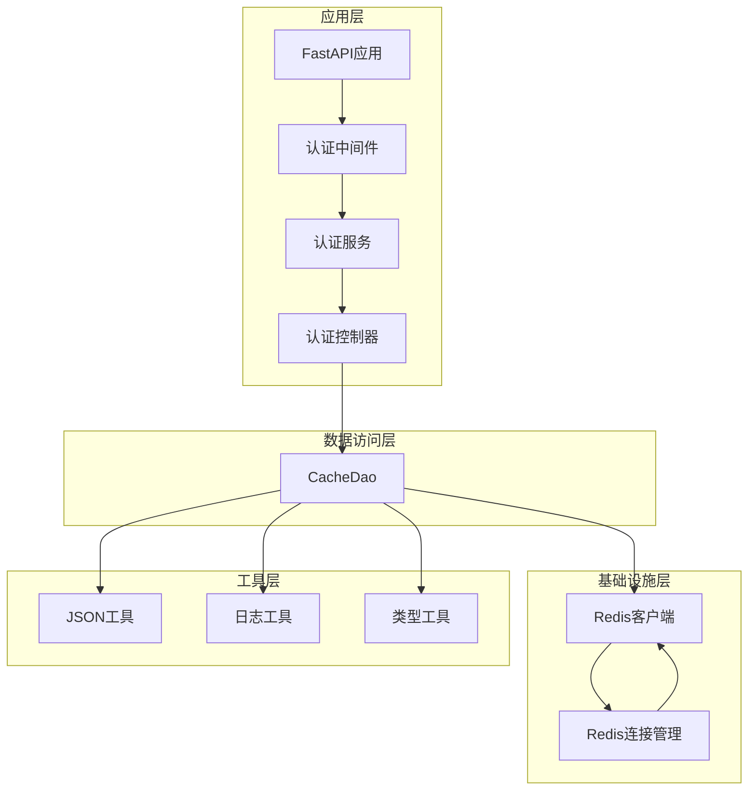
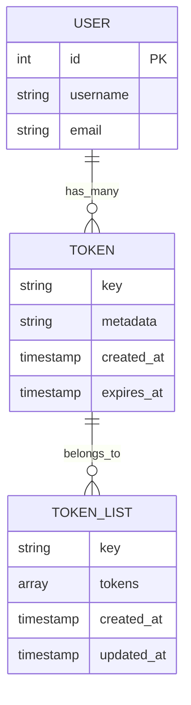
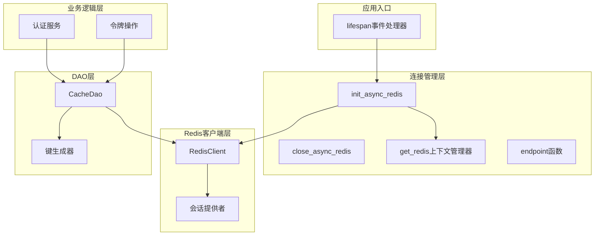
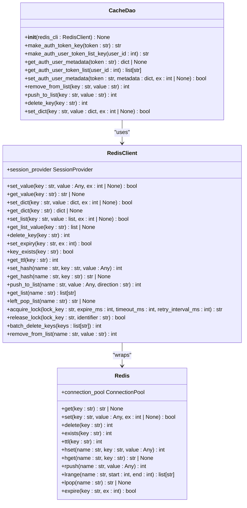
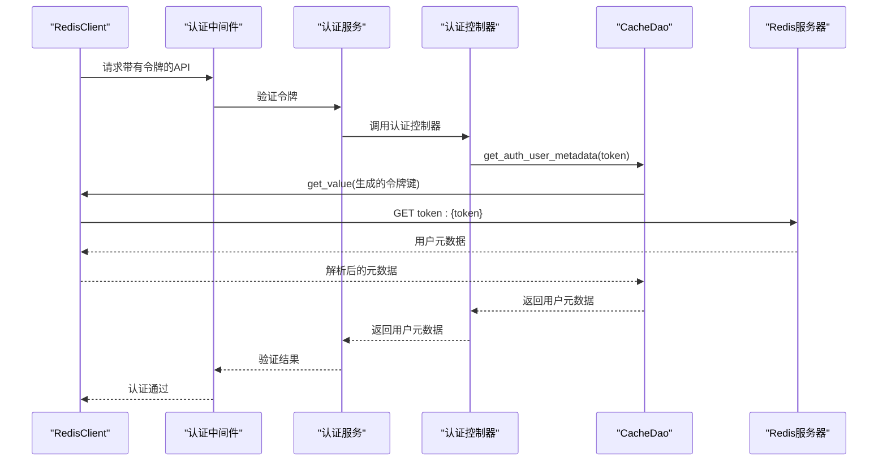
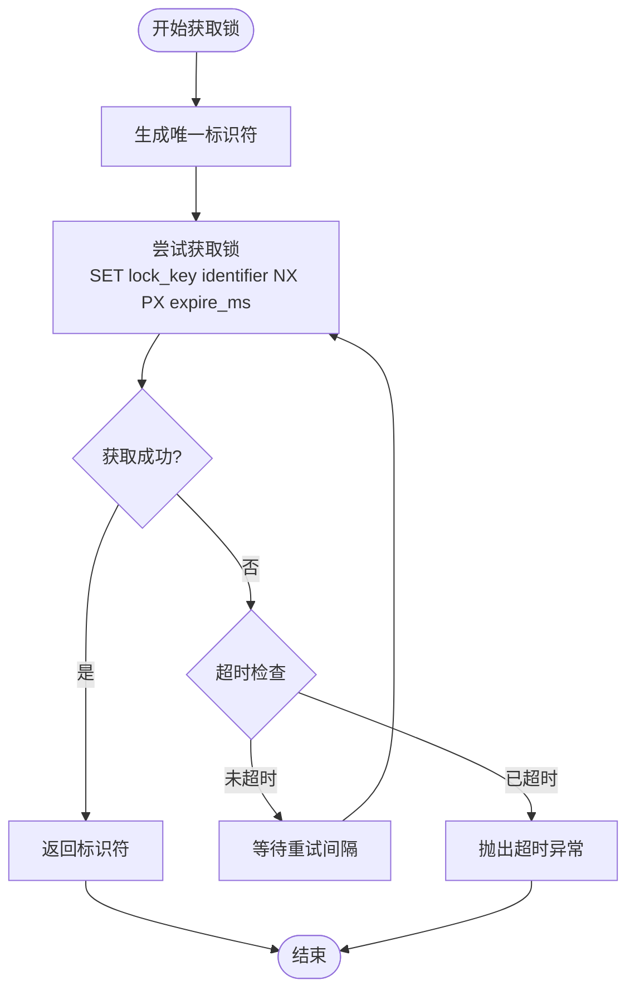
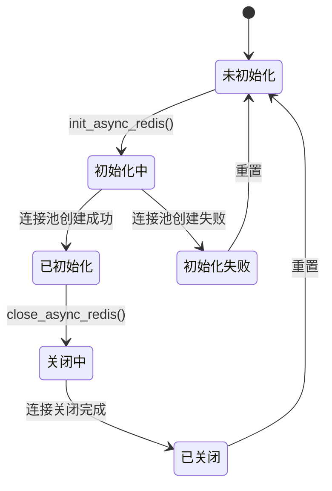
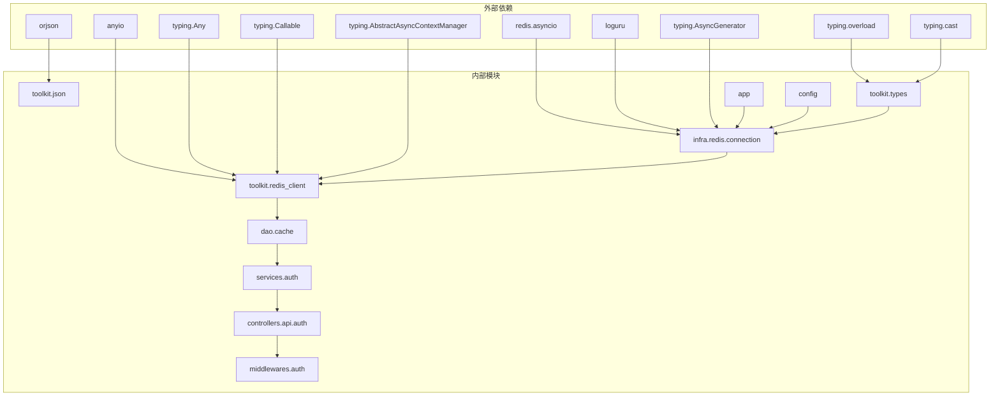

# Redis数据访问对象

<cite>
**本文档引用的文件**
- [internal/dao/cache.py](file://internal/dao/cache.py)
- [internal/infra/redis/connection.py](file://internal/infra/redis/connection.py)
- [pkg/toolkit/redis_client.py](file://pkg/toolkit/redis_client.py)
- [internal/app.py](file://internal/app.py)
- [internal/middlewares/auth.py](file://internal/middlewares/auth.py)
- [internal/services/auth.py](file://internal/services/auth.py)
- [internal/controllers/api/auth.py](file://internal/controllers/api/auth.py)
- [pkg/toolkit/json.py](file://pkg/toolkit/json.py)
- [internal/config.py](file://internal/config.py)
- [pkg/toolkit/types.py](file://pkg/toolkit/types.py)
</cite>

## 更新摘要
**变更内容**
- 更新了Redis DAO层的类型注解改进，确保与基础设施层保持一致的类型安全标准
- 新增了完整的类型注解文档，包括构造函数参数、方法参数和返回值类型
- 增强了类型安全性和代码可维护性

## 目录
1. [简介](#简介)
2. [项目结构](#项目结构)
3. [核心组件](#核心组件)
4. [架构概览](#架构概览)
5. [详细组件分析](#详细组件分析)
6. [类型注解改进](#类型注解改进)
7. [依赖关系分析](#依赖关系分析)
8. [性能考虑](#性能考虑)
9. [故障排除指南](#故障排除指南)
10. [结论](#结论)
11. [附录](#附录)

## 简介

本文档详细介绍了FastAPI后端项目中的Redis数据访问对象（DAO）设计与实现。Redis DAO作为缓存层的核心组件，负责管理用户认证令牌的缓存、用户令牌列表的维护以及相关的缓存策略配置。该实现采用异步编程模型，充分利用Redis的高性能特性，为整个应用提供高效的缓存服务。

**更新** 缓存数据访问对象已重构，原 internal/infra/redis/dao.py 重命名为 internal/dao/cache.py，新增 CacheDao 类提供集中化的 Redis 缓存操作。本次更新重点改进了类型注解，确保与基础设施层保持一致的类型安全标准。

该系统通过分层架构实现了以下关键功能：
- 异步Redis连接管理与生命周期控制
- 缓存数据的持久化和读取操作
- 用户认证令牌的验证机制
- 分布式锁的获取与释放
- 缓存策略和过期时间的灵活配置
- **增强的类型安全性**：完整的类型注解确保编译时类型检查

## 项目结构

该项目采用模块化的组织方式，Redis相关的组件分布在不同的层次中：


```mermaid
graph TB
subgraph "应用层"
APP[FastAPI应用]
MIDDLEWARE[认证中间件]
CONTROLLER[认证控制器]
SERVICE[认证服务]
end
subgraph "数据访问层"
DAO[CacheDao]
end
subgraph "基础设施层"
INFRA[Redis连接管理]
CLIENT[Redis客户端]
end
subgraph "工具层"
JSON[JSON工具]
LOGGER[日志工具]
TYPES[类型工具]
end
APP --> MIDDLEWARE
MIDDLEWARE --> SERVICE
SERVICE --> CONTROLLER
CONTROLLER --> DAO
DAO --> CLIENT
CLIENT --> INFRA
DAO --> JSON
DAO --> LOGGER
DAO --> TYPES
INFRA --> CLIENT
```

**图表来源**
- [internal/app.py](file://internal/app.py#L80-L111)
- [internal/middlewares/auth.py](file://internal/middlewares/auth.py#L129-L147)
- [internal/services/auth.py](file://internal/services/auth.py#L7-L25)
- [internal/controllers/api/auth.py](file://internal/controllers/api/auth.py#L50-L95)

**章节来源**
- [internal/app.py](file://internal/app.py#L80-L111)
- [internal/dao/cache.py](file://internal/dao/cache.py#L1-L68)
- [internal/infra/redis/connection.py](file://internal/infra/redis/connection.py#L1-L92)

## 核心组件

### CacheDao设计原理

CacheDao采用了面向对象的设计模式，通过构造函数注入 RedisClient 实例，通过静态方法生成特定的缓存键，通过异步方法执行缓存操作。这种设计提供了以下优势：

1. **依赖注入**：通过构造函数注入 RedisClient，便于测试和替换
2. **职责分离**：DAO专注于缓存操作，不关心底层连接管理
3. **键命名规范**：统一的键命名规则便于缓存管理
4. **异步操作**：充分利用Redis的异步特性提升性能
5. **错误处理**：完善的日志记录和错误处理机制
6. **类型安全**：完整的类型注解确保编译时类型检查

### 缓存数据结构设计

系统使用两种主要的数据结构来管理用户认证信息：


```mermaid
erDiagram
TOKEN {
string key
string metadata
timestamp created_at
timestamp expires_at
}
TOKEN_LIST {
string key
array tokens
timestamp created_at
timestamp updated_at
}
USER {
int id PK
string username
string email
}
TOKEN ||--o{ TOKEN_LIST : "belongs_to"
USER ||--o{ TOKEN : "has_many"
```

**图表来源**
- [internal/dao/cache.py](file://internal/dao/cache.py#L21-L27)

**章节来源**
- [internal/dao/cache.py](file://internal/dao/cache.py#L9-L68)

## 架构概览

Redis DAO的架构采用分层设计，确保了良好的可维护性和扩展性：


```mermaid
graph TB
subgraph "应用入口"
LIFESPAN[lifespan事件处理器]
end
subgraph "连接管理层"
INIT[init_async_redis]
CLOSE[close_async_redis]
GET[get_redis上下文管理器]
ENDPOINT[endpoint函数]
end
subgraph "Redis客户端层"
REDIS_CLIENT[RedisClient]
SESSION_PROVIDER[会话提供者]
end
subgraph "DAO层"
CACHE_DAO[CacheDao]
KEY_GENERATORS[键生成器]
end
subgraph "业务逻辑层"
AUTH_SERVICE[认证服务]
TOKEN_OPERATIONS[令牌操作]
end
LIFESPAN --> INIT
INIT --> GET
INIT --> REDIS_CLIENT
REDIS_CLIENT --> SESSION_PROVIDER
CACHE_DAO --> REDIS_CLIENT
CACHE_DAO --> KEY_GENERATORS
AUTH_SERVICE --> CACHE_DAO
TOKEN_OPERATIONS --> CACHE_DAO
```

**图表来源**
- [internal/app.py](file://internal/app.py#L80-L111)
- [internal/infra/redis/connection.py](file://internal/infra/redis/connection.py#L32-L91)
- [pkg/toolkit/redis_client.py](file://pkg/toolkit/redis_client.py#L41-L261)

## 详细组件分析

### CacheDao类分析

CacheDao是Redis DAO的核心实现，提供了用户认证相关的缓存操作：


```mermaid
classDiagram
class CacheDao {
+__init__(redis_cli : RedisClient) None
+make_auth_token_key(token : str) str
+make_auth_user_token_list_key(user_id : int) str
+get_auth_user_metadata(token : str) dict | None
+get_auth_user_token_list(user_id : int) list[str]
+set_auth_user_metadata(token : str, metadata : dict, ex : int | None) bool
+remove_from_list(key : str, value : str) int
+push_to_list(key : str, value : str) int
+delete_key(key : str) int
+set_dict(key : str, value : dict, ex : int | None) bool
}
class RedisClient {
+session_provider SessionProvider
+set_value(key : str, value : Any, ex : int | None) bool
+get_value(key : str) str | None
+set_dict(key : str, value : dict, ex : int | None) bool
+get_dict(key : str) dict | None
+set_list(key : str, value : list, ex : int | None) bool
+get_list_value(key : str) list | None
+delete_key(key : str) int
+set_expiry(key : str, ex : int) bool
+key_exists(key : str) bool
+get_ttl(key : str) int
+set_hash(name : str, key : str, value : Any) int
+get_hash(name : str, key : str) str | None
+push_to_list(name : str, value : Any, direction : str) int
+get_list(name : str) list[str]
+left_pop_list(name : str) str | None
+acquire_lock(lock_key : str, expire_ms : int, timeout_ms : int, retry_interval_ms : int) str
+release_lock(lock_key : str, identifier : str) bool
+batch_delete_keys(keys : list[str]) int
+remove_from_list(name : str, value : str) int
}
class Redis {
+connection_pool ConnectionPool
+get(key : str) str | None
+set(key : str, value : Any, ex : int | None) bool
+delete(key : str) int
+exists(key : str) int
+ttl(key : str) int
+hset(name : str, key : str, value : Any) int
+hget(name : str, key : str) str | None
+rpush(name : str, value : Any) int
+lrange(name : str, start : int, end : int) list[str]
+lpop(name : str) str | None
+expire(key : str, ex : int) bool
}
CacheDao --> RedisClient : "uses"
RedisClient --> Redis : "wraps"
```

**图表来源**
- [internal/dao/cache.py](file://internal/dao/cache.py#L9-L68)
- [pkg/toolkit/redis_client.py](file://pkg/toolkit/redis_client.py#L41-L261)

#### 键生成策略

CacheDao实现了两种主要的键生成策略：

1. **令牌键生成**：`token:{token}` - 用于存储用户元数据
2. **用户令牌列表键生成**：`token_list:{user_id}` - 用于存储用户的令牌列表

这些键生成策略确保了缓存数据的组织性和可管理性。

#### 异步操作流程


```mermaid
sequenceDiagram
participant Client as "客户端"
participant Middleware as "认证中间件"
participant Service as "认证服务"
participant Controller as "认证控制器"
participant Dao as "CacheDao"
participant Client as "RedisClient"
participant Redis as "Redis服务器"
Client->>Middleware : 请求带有令牌的API
Middleware->>Service : 验证令牌
Service->>Controller : 调用认证控制器
Controller->>Dao : get_auth_user_metadata(token)
Dao->>Client : get_value(生成的令牌键)
Client->>Redis : GET token : {token}
Redis-->>Client : 用户元数据
Client-->>Dao : 解析后的元数据
Dao-->>Controller : 返回用户元数据
Controller-->>Service : 返回用户元数据
Service-->>Middleware : 验证结果
Middleware-->>Client : 认证通过
```

**图表来源**
- [internal/middlewares/auth.py](file://internal/middlewares/auth.py#L129-L147)
- [internal/services/auth.py](file://internal/services/auth.py#L7-L25)
- [internal/controllers/api/auth.py](file://internal/controllers/api/auth.py#L50-L95)
- [internal/dao/cache.py](file://internal/dao/cache.py#L29-L43)

**章节来源**
- [internal/dao/cache.py](file://internal/dao/cache.py#L9-L68)
- [pkg/toolkit/redis_client.py](file://pkg/toolkit/redis_client.py#L41-L261)

### 缓存客户端实现

RedisClient提供了丰富的缓存操作方法，支持多种数据类型和高级功能：

#### 基础数据操作

| 方法 | 功能 | 参数 | 返回值 |
|------|------|------|--------|
| `set_value` | 设置字符串值 | key: str, value: Any, ex: int | bool |
| `get_value` | 获取字符串值 | key: str | str \| None |
| `set_dict` | 设置字典值 | key: str, value: dict, ex: int | bool |
| `get_dict` | 获取字典值 | key: str | dict \| None |
| `set_list` | 设置列表值 | key: str, value: list, ex: int | bool |
| `get_list_value` | 获取列表值 | key: str | list \| None |

#### 高级操作功能

| 方法 | 功能 | 参数 | 返回值 |
|------|------|------|--------|
| `set_hash` | 设置哈希字段 | name: str, key: str, value: Any | int |
| `get_hash` | 获取哈希字段 | name: str, key: str | str \| None |
| `push_to_list` | 向列表添加元素 | name: str, value: Any, direction: str | int |
| `get_list` | 获取列表所有值 | name: str | list[str] |
| `left_pop_list` | 从左侧弹出元素 | name: str | str \| None |
| `acquire_lock` | 获取分布式锁 | lock_key: str, expire_ms: int, timeout_ms: int, retry_interval_ms: int | str |
| `release_lock` | 释放分布式锁 | lock_key: str, identifier: str | bool |
| `remove_from_list` | 从列表移除元素 | name: str, value: str | int |

#### 分布式锁实现

RedisClient实现了基于Redis的分布式锁机制，确保在高并发场景下的数据一致性：


```mermaid
flowchart TD
START([开始获取锁]) --> GENERATE_ID["生成唯一标识符"]
GENERATE_ID --> ATTEMPT_LOCK["尝试获取锁<br/>SET lock_key identifier NX PX expire_ms"]
ATTEMPT_LOCK --> LOCK_SUCCESS{"获取成功?"}
LOCK_SUCCESS --> |是| RETURN_ID["返回标识符"]
LOCK_SUCCESS --> |否| CHECK_TIMEOUT{"超时检查"}
CHECK_TIMEOUT --> |未超时| WAIT["等待重试间隔"]
WAIT --> ATTEMPT_LOCK
CHECK_TIMEOUT --> |已超时| RAISE_ERROR["抛出超时异常"]
RETURN_ID --> END([结束])
RAISE_ERROR --> END
```

**图表来源**
- [pkg/toolkit/redis_client.py](file://pkg/toolkit/redis_client.py#L200-L242)

**章节来源**
- [pkg/toolkit/redis_client.py](file://pkg/toolkit/redis_client.py#L41-L261)

### 连接管理与生命周期

Redis连接管理采用全局单例模式，确保在整个应用生命周期内的一致性：


```mermaid
stateDiagram-v2
[*] --> 未初始化
未初始化 --> 初始化中 : init_async_redis()
初始化中 --> 已初始化 : 连接池创建成功
初始化中 --> 初始化失败 : 连接池创建失败
初始化失败 --> 未初始化 : 重置
已初始化 --> 关闭中 : close_async_redis()
关闭中 --> 已关闭 : 连接关闭完成
已关闭 --> 未初始化 : 重置
```

**图表来源**
- [internal/infra/redis/connection.py](file://internal/infra/redis/connection.py#L32-L91)

#### 连接池配置

连接池的关键配置参数：

| 参数 | 默认值 | 描述 |
|------|--------|------|
| `max_connections` | 20 | 最大连接数 |
| `encoding` | "utf-8" | 编码格式 |
| `decode_responses` | True | 自动解码响应 |
| `redis_url` | 从配置生成 | Redis连接URL |

**章节来源**
- [internal/infra/redis/connection.py](file://internal/infra/redis/connection.py#L32-L91)

## 类型注解改进

### CacheDao类的类型注解

CacheDao类的构造函数和方法都添加了完整的类型注解，确保类型安全：

```python
class CacheDao:
    def __init__(self, redis_cli: RedisClient):
        """初始化CacheDao
        
        Args:
            redis_cli: RedisClient实例，必须传入
        """
        self._redis = redis_cli
    
    @staticmethod
    def make_auth_token_key(token: str) -> str:
        """生成令牌键
        
        Args:
            token: 用户令牌字符串
            
        Returns:
            令牌键字符串
        """
        return f"token:{token}"
    
    @staticmethod
    def make_auth_user_token_list_key(user_id: int) -> str:
        """生成用户令牌列表键
        
        Args:
            user_id: 用户ID
            
        Returns:
            用户令牌列表键字符串
        """
        return f"token_list:{user_id}"
    
    async def get_auth_user_metadata(self, token: str) -> dict | None:
        """获取用户元数据
        
        Args:
            token: 用户令牌字符串
            
        Returns:
            用户元数据字典或None
        """
        val = await self._redis.get_value(self.make_auth_token_key(token))
        if val is None:
            logger.warning("Token verification failed: token not found")
            return None
        return orjson_loads(val)
    
    async def get_auth_user_token_list(self, user_id: int) -> list[str]:
        """获取用户令牌列表
        
        Args:
            user_id: 用户ID
            
        Returns:
            令牌字符串列表
        """
        val = await self._redis.get_list(self.make_auth_user_token_list_key(user_id))
        if not val:
            logger.warning(f"Token verification failed: token list not found, user_id: {user_id}")
            return []
        return val
    
    async def set_auth_user_metadata(self, token: str, metadata: dict, ex: int | None = None) -> bool:
        """设置用户元数据
        
        Args:
            token: 用户令牌字符串
            metadata: 用户元数据字典
            ex: 过期时间（秒），可选
            
        Returns:
            设置是否成功
        """
        json_str = orjson_dumps(metadata)
        return await self._redis.set_value(self.make_auth_token_key(token), json_str, ex=ex)
    
    async def remove_from_list(self, key: str, value: str) -> int:
        """从列表中移除元素
        
        Args:
            key: 列表键
            value: 要移除的值
            
        Returns:
            移除后的列表长度
        """
        return await self._redis.remove_from_list(key, value)
    
    async def push_to_list(self, key: str, value: str) -> int:
        """向列表添加元素
        
        Args:
            key: 列表键
            value: 要添加的值
            
        Returns:
            添加后的列表长度
        """
        return await self._redis.push_to_list(key, value)
    
    async def delete_key(self, key: str) -> int:
        """删除键
        
        Args:
            key: 要删除的键
            
        Returns:
            删除的键数量
        """
        return await self._redis.delete_key(key)
    
    async def set_dict(self, key: str, value: dict, ex: int | None = None) -> bool:
        """设置字典类型的值，自动 JSON 序列化
        
        Args:
            key: 键名
            value: 字典值
            ex: 过期时间（秒），可选
            
        Returns:
            设置是否成功
        """
        return await self._redis.set_dict(key, value, ex=ex)
```

### RedisClient类的类型注解

RedisClient类的所有方法都具有完整的类型注解：

```python
class RedisClient:
    def __init__(self, session_provider: SessionProvider):
        self.session_provider = session_provider
    
    @handle_redis_exception
    async def set_value(self, key: str, value: Any, ex: int | None = None) -> bool:
        """设置键值对，可选过期时间（秒）"""
        async with self.session_provider() as redis:
            result = await redis.set(key, value, ex=ex)
            return result is True
    
    @handle_redis_exception
    async def get_value(self, key: str) -> str | None:
        """获取键对应的值"""
        async with self.session_provider() as redis:
            value = await redis.get(key)
            if value is None:
                return None
            if isinstance(value, bytes):
                return value.decode("utf-8")
            return value
    
    @handle_redis_exception
    async def set_dict(self, key: str, value: dict, ex: int | None = None) -> bool:
        """设置字典类型的值，自动 JSON 序列化"""
        json_str = orjson_dumps(value)
        return await self.set_value(key, json_str, ex=ex)
    
    @handle_redis_exception
    async def get_dict(self, key: str) -> dict | None:
        """获取字典类型的值，自动 JSON 反序列化"""
        value = await self.get_value(key)
        if value is None:
            return None
        try:
            return orjson_loads(value)
        except json.JSONDecodeError as e:
            raise RedisOperationError(f"Failed to decode dict from key '{key}': {e}") from e
    
    # ... 其他方法都有完整的类型注解
```

### 类型安全的增强

1. **构造函数注入**：通过 `redis_cli: RedisClient` 确保传入正确的客户端类型
2. **方法参数类型**：所有方法参数都有明确的类型注解
3. **返回值类型**：所有方法都有明确的返回值类型注解
4. **可选参数**：使用 `int | None` 表示可选参数
5. **静态方法**：使用 `@staticmethod` 装饰器确保静态方法的类型安全

**章节来源**
- [internal/dao/cache.py](file://internal/dao/cache.py#L9-L68)
- [pkg/toolkit/redis_client.py](file://pkg/toolkit/redis_client.py#L41-L261)

## 依赖关系分析

### 组件依赖图


```mermaid
graph TB
subgraph "外部依赖"
REDIS[redis.asyncio]
ORJSON[orjson]
LOGURU[loguru]
ANYIO[anyio]
ENDC[typing.Any]
ENDC2[typing.Callable]
ENDC3[typing.AbstractAsyncContextManager]
ENDC4[typing.AsyncGenerator]
ENDC5[typing.overload]
ENDC6[typing.cast]
end
subgraph "内部模块"
REDIS_CONNECTION[infra.redis.connection]
REDIS_CLIENT[toolkit.redis_client]
CACHE_DAO[dao.cache]
AUTH_SERVICE[services.auth]
AUTH_CONTROLLER[controllers.api.auth]
AUTH_MIDDLEWARE[middlewares.auth]
JSON_TOOLKIT[toolkit.json]
APP[app]
CONFIG[config]
TYPES[toolkit.types]
end
REDIS --> REDIS_CONNECTION
ORJSON --> JSON_TOOLKIT
LOGURU --> REDIS_CONNECTION
ANYIO --> REDIS_CLIENT
ENDC --> REDIS_CLIENT
ENDC2 --> REDIS_CLIENT
ENDC3 --> REDIS_CLIENT
ENDC4 --> REDIS_CONNECTION
ENDC5 --> TYPES
ENDC6 --> TYPES
REDIS_CONNECTION --> REDIS_CLIENT
REDIS_CLIENT --> CACHE_DAO
CACHE_DAO --> AUTH_SERVICE
AUTH_SERVICE --> AUTH_CONTROLLER
AUTH_CONTROLLER --> AUTH_MIDDLEWARE
APP --> REDIS_CONNECTION
CONFIG --> REDIS_CONNECTION
TYPES --> REDIS_CONNECTION
```

**图表来源**
- [internal/infra/redis/connection.py](file://internal/infra/redis/connection.py#L1-L12)
- [pkg/toolkit/redis_client.py](file://pkg/toolkit/redis_client.py#L1-L14)
- [internal/dao/cache.py](file://internal/dao/cache.py#L1-L6)
- [internal/services/auth.py](file://internal/services/auth.py#L1-L4)
- [internal/controllers/api/auth.py](file://internal/controllers/api/auth.py#L1-L22)

### 关键依赖关系

1. **配置依赖**：所有Redis配置都来源于应用配置系统
2. **类型依赖**：使用`lazy_proxy`实现延迟初始化
3. **序列化依赖**：使用`orjson`进行高性能JSON操作
4. **异常处理依赖**：统一的`RedisOperationError`异常处理
5. **依赖注入**：通过构造函数注入RedisClient实例
6. **类型安全依赖**：完整的类型注解确保编译时类型检查

**章节来源**
- [internal/infra/redis/connection.py](file://internal/infra/redis/connection.py#L1-L92)
- [pkg/toolkit/redis_client.py](file://pkg/toolkit/redis_client.py#L1-L261)
- [internal/dao/cache.py](file://internal/dao/cache.py#L1-L68)

## 性能考虑

### 缓存策略优化

1. **键命名优化**：使用命名空间前缀（如`token:`、`token_list:`）避免键冲突
2. **数据类型选择**：根据数据特点选择合适的Redis数据类型
3. **过期时间设置**：为不同类型的缓存设置合理的过期时间
4. **批量操作**：利用Redis的管道机制减少网络往返
5. **类型优化**：完整的类型注解有助于编译器优化

### 内存管理最佳实践

1. **连接池复用**：通过连接池复用TCP连接，减少连接开销
2. **及时释放资源**：在应用关闭时正确关闭Redis连接
3. **监控内存使用**：定期检查Redis内存使用情况
4. **数据压缩**：对大对象进行适当的压缩存储
5. **类型安全**：类型注解有助于发现潜在的内存泄漏问题

### 异步操作优化

1. **非阻塞I/O**：充分利用异步特性避免阻塞
2. **批量处理**：合并多个操作到一个事务中
3. **错误重试**：实现智能的错误重试机制
4. **超时控制**：为长时间操作设置合理的超时时间
5. **类型安全**：类型注解确保异步操作的类型安全

## 故障排除指南

### 常见问题及解决方案

#### 连接问题

**问题**：Redis连接失败
**原因**：网络问题或配置错误
**解决方案**：
1. 检查Redis服务器状态
2. 验证连接URL配置
3. 确认防火墙设置

#### 认证失败

**问题**：令牌验证失败
**原因**：令牌不存在或不在用户令牌列表中
**解决方案**：
1. 检查令牌是否正确存储
2. 验证用户令牌列表的完整性
3. 确认令牌过期时间设置

#### 性能问题

**问题**：缓存响应缓慢
**原因**：连接池配置不当或查询复杂度过高
**解决方案**：
1. 调整连接池大小
2. 优化键查询逻辑
3. 实施缓存预热策略

#### 类型注解问题

**问题**：类型检查失败
**原因**：类型注解不匹配或缺少类型注解
**解决方案**：
1. 检查构造函数参数类型
2. 验证方法参数和返回值类型
3. 确保所有方法都有完整的类型注解

**章节来源**
- [internal/infra/redis/connection.py](file://internal/infra/redis/connection.py#L61-L91)
- [internal/services/auth.py](file://internal/services/auth.py#L7-L25)

### 调试技巧

1. **启用详细日志**：在开发环境中开启详细的Redis操作日志
2. **监控连接状态**：定期检查连接池的使用情况
3. **性能基准测试**：对关键缓存操作进行性能测试
4. **错误追踪**：建立完善的错误追踪和报告机制
5. **类型检查**：使用mypy等工具进行静态类型检查

## 结论

Redis数据访问对象在本项目中展现了优秀的架构设计和实现质量。通过分层架构、异步编程和完善的错误处理机制，该系统为应用提供了高效、可靠的缓存服务。

**更新** 缓存数据访问对象已重构为集中化的 CacheDao 类，提供了更好的依赖注入和测试支持。本次更新重点改进了类型注解，确保与基础设施层保持一致的类型安全标准。

主要优势包括：
- **模块化设计**：清晰的职责分离和接口定义
- **依赖注入**：通过构造函数注入RedisClient，便于测试和替换
- **异步性能**：充分利用Redis的异步特性
- **错误处理**：完善的异常处理和日志记录
- **配置灵活**：支持多种配置选项和环境变量
- **扩展性强**：易于添加新的缓存操作和功能
- **类型安全**：完整的类型注解确保编译时类型检查
- **代码质量**：遵循现代Python类型注解最佳实践

未来可以考虑的改进方向：
- 添加缓存统计和监控功能
- 实现更复杂的缓存策略（如LRU）
- 增加缓存预热和失效通知机制
- 扩展支持更多Redis数据类型和操作
- 集成类型检查工具到CI/CD流程

## 附录

### 配置参考

#### 环境变量配置

| 变量名 | 类型 | 默认值 | 描述 |
|--------|------|--------|------|
| `REDIS_HOST` | string | - | Redis服务器主机地址 |
| `REDIS_PORT` | int | 6379 | Redis服务器端口号 |
| `REDIS_PASSWORD` | string | "" | Redis密码 |
| `REDIS_DB` | int | 0 | Redis数据库编号 |
| `REDIS_MAX_CONNECTIONS` | int | 20 | 最大连接数 |

#### 使用示例

**初始化Redis连接**：[internal/infra/redis/connection.py](file://internal/infra/redis/connection.py#L32-L58)

**创建CacheDao实例**：[internal/dao/cache.py](file://internal/dao/cache.py#L67-L68)

**获取用户元数据**：[internal/dao/cache.py](file://internal/dao/cache.py#L29-L35)

**获取用户令牌列表**：[internal/dao/cache.py](file://internal/dao/cache.py#L37-L43)

**设置用户元数据**：[internal/dao/cache.py](file://internal/dao/cache.py#L45-L48)

**从列表移除元素**：[internal/dao/cache.py](file://internal/dao/cache.py#L50-L52)

**向列表添加元素**：[internal/dao/cache.py](file://internal/dao/cache.py#L54-L56)

**删除键**：[internal/dao/cache.py](file://internal/dao/cache.py#L58-L60)

**设置字典**：[internal/dao/cache.py](file://internal/dao/cache.py#L62-L64)

### 类型注解参考

#### 主要类型注解

| 类型 | 用途 | 示例 |
|------|------|------|
| `RedisClient` | Redis客户端类型 | `redis_cli: RedisClient` |
| `dict | None` | 可选字典类型 | `metadata: dict | None` |
| `list[str]` | 字符串列表类型 | `token_list: list[str]` |
| `int | None` | 可选整数类型 | `ex: int | None` |
| `Any` | 任意类型 | `value: Any` |

#### 类型注解最佳实践

1. **构造函数参数**：始终使用明确的类型注解
2. **方法返回值**：为所有方法指定返回值类型
3. **可选参数**：使用 `| None` 表示可选类型
4. **静态方法**：使用 `@staticmethod` 装饰器
5. **异步方法**：使用 `async def` 和 `await` 关键字

**章节来源**
- [internal/infra/redis/connection.py](file://internal/infra/redis/connection.py#L32-L91)
- [internal/dao/cache.py](file://internal/dao/cache.py#L1-L68)
- [pkg/toolkit/types.py](file://pkg/toolkit/types.py#L216-L278)