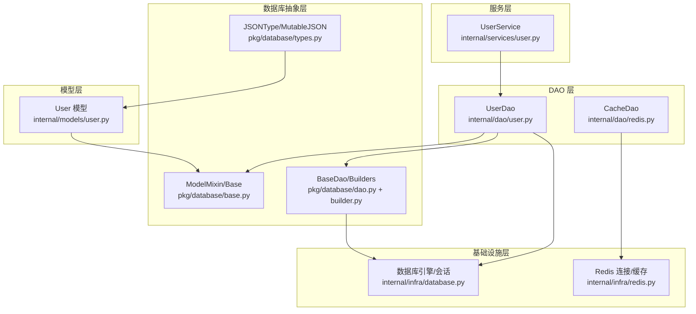
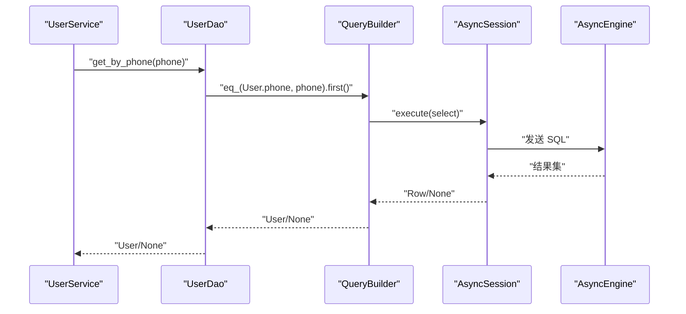
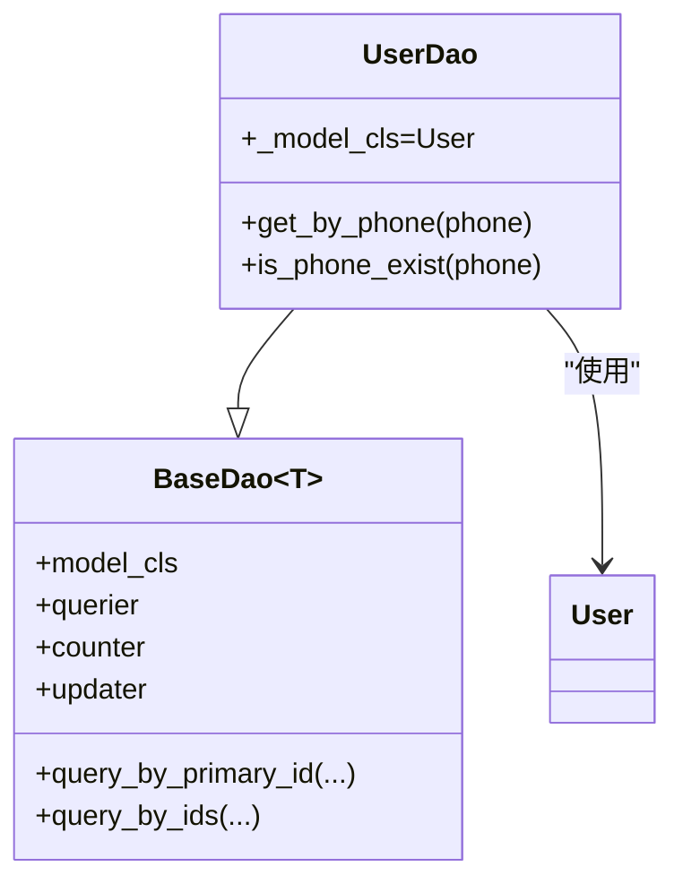
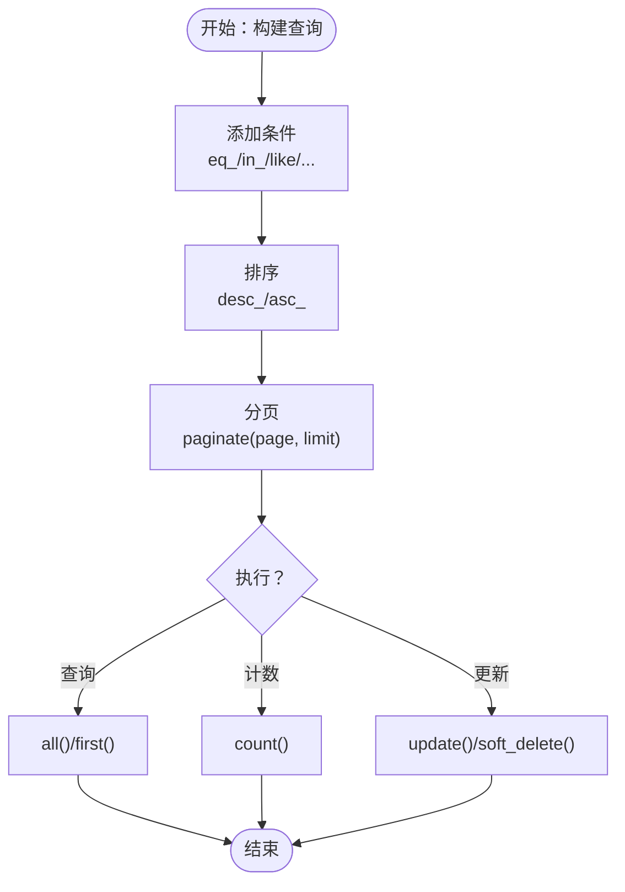
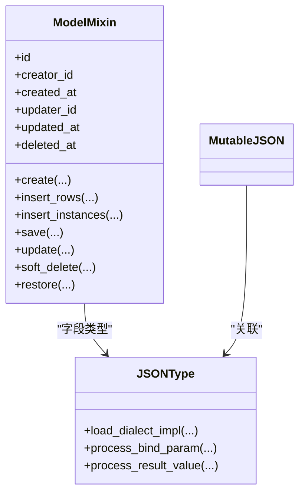
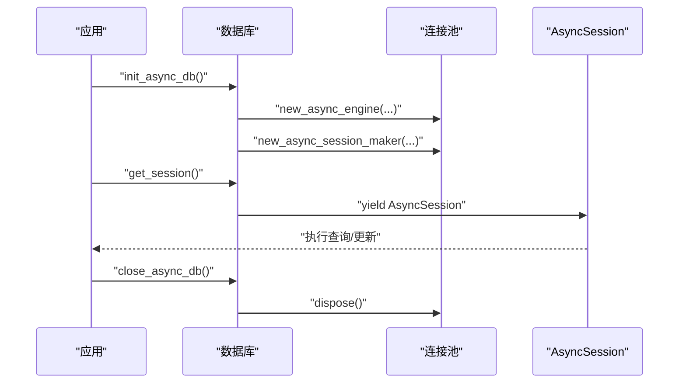
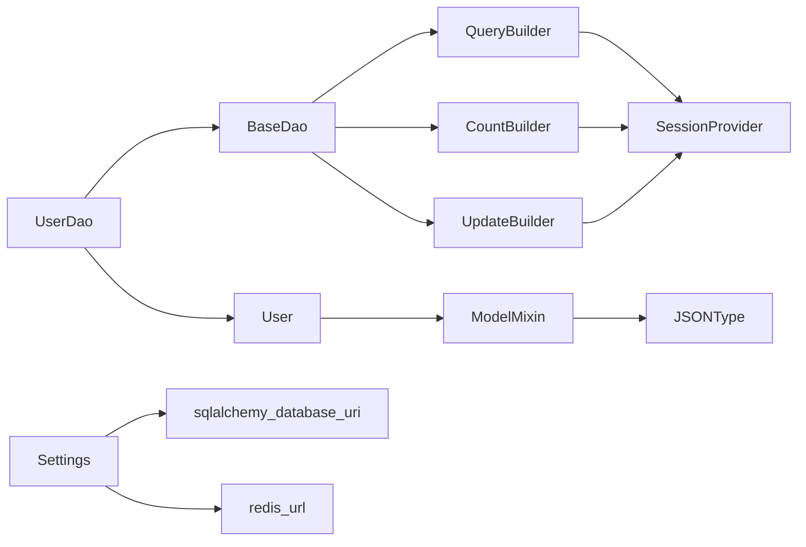

# 数据访问层

<cite>
**本文档引用的文件**
- [internal/dao/user.py](file://internal/dao/user.py)
- [internal/dao/redis.py](file://internal/dao/redis.py)
- [pkg/database/dao.py](file://pkg/database/dao.py)
- [pkg/database/base.py](file://pkg/database/base.py)
- [pkg/database/builder.py](file://pkg/database/builder.py)
- [pkg/database/types.py](file://pkg/database/types.py)
- [internal/infra/database.py](file://internal/infra/database.py)
- [internal/infra/redis.py](file://internal/infra/redis.py)
- [internal/models/user.py](file://internal/models/user.py)
- [internal/services/user.py](file://internal/services/user.py)
- [internal/config/load_config.py](file://internal/config/load_config.py)
- [pkg/toolkit/cache.py](file://pkg/toolkit/cache.py)
</cite>

## 目录
1. [简介](#简介)
2. [项目结构](#项目结构)
3. [核心组件](#核心组件)
4. [架构总览](#架构总览)
5. [组件详解](#组件详解)
6. [依赖关系分析](#依赖关系分析)
7. [性能与优化](#性能与优化)
8. [故障排查指南](#故障排查指南)
9. [结论](#结论)

## 简介
本文件系统性阐述本项目的“数据访问层”设计与实现，涵盖 DAO 模式、数据库操作封装、事务管理、查询优化、性能调优、错误恢复与并发控制、与数据库抽象层的集成关系、缓存策略与数据一致性保障，以及常见问题与性能瓶颈的解决方案。目标是帮助开发者快速理解并高效使用数据访问层，同时为维护与扩展提供清晰的参考。

## 项目结构
数据访问层主要分布在以下模块：
- DAO 层：面向具体实体的访问接口，如用户 DAO
- 数据库抽象层：统一的会话提供者、模型基类、查询/计数/更新构建器
- 基础设施层：数据库引擎与会话生命周期管理、Redis 连接与缓存客户端
- 模型层：ORM 映射模型，继承统一的模型基类
- 服务层：业务编排，依赖 DAO 完成数据访问

图表来源
- [internal/services/user.py](file://internal/services/user.py#L1-L21)
- [internal/dao/user.py](file://internal/dao/user.py#L1-L24)
- [internal/dao/redis.py](file://internal/dao/redis.py#L1-L37)
- [pkg/database/base.py](file://pkg/database/base.py#L48-L364)
- [pkg/database/dao.py](file://pkg/database/dao.py#L15-L203)
- [pkg/database/builder.py](file://pkg/database/builder.py#L18-L273)
- [pkg/database/types.py](file://pkg/database/types.py#L12-L183)
- [internal/infra/database.py](file://internal/infra/database.py#L26-L154)
- [internal/infra/redis.py](file://internal/infra/redis.py#L18-L98)
- [internal/models/user.py](file://internal/models/user.py#L7-L13)

章节来源
- [internal/dao/user.py](file://internal/dao/user.py#L1-L24)
- [pkg/database/dao.py](file://pkg/database/dao.py#L15-L203)
- [pkg/database/base.py](file://pkg/database/base.py#L48-L364)
- [pkg/database/builder.py](file://pkg/database/builder.py#L18-L273)
- [pkg/database/types.py](file://pkg/database/types.py#L12-L183)
- [internal/infra/database.py](file://internal/infra/database.py#L26-L154)
- [internal/infra/redis.py](file://internal/infra/redis.py#L18-L98)
- [internal/models/user.py](file://internal/models/user.py#L7-L13)
- [internal/services/user.py](file://internal/services/user.py#L1-L21)

## 核心组件
- DAO 基类与会话提供者
  - BaseDao：提供统一的查询、计数、更新构建器与常用 CRUD 辅助方法，依赖 SessionProvider 获取会话
  - execute_transaction：手动事务执行器，支持复杂业务在单事务内串行执行
- 查询/计数/更新构建器
  - QueryBuilder：链式条件构造、排序、分页、查询集合/首条记录
  - CountBuilder：链式条件构造、去重计数、聚合统计
  - UpdateBuilder：链式更新字段、软删除、自动同步更新时间与操作人
- 模型与类型
  - ModelMixin：统一主键、创建/更新/删除时间与操作人字段，工厂方法与批量插入
  - JSONType/MutableJSON：跨数据库兼容的 JSON 类型与变更追踪
- 基础设施
  - 数据库：new_async_engine/new_async_session_maker、get_session 上下文管理器、SQL 监听与慢查询日志
  - Redis：连接池、CacheClient 封装、分布式锁与批处理

章节来源
- [pkg/database/dao.py](file://pkg/database/dao.py#L15-L203)
- [pkg/database/builder.py](file://pkg/database/builder.py#L18-L273)
- [pkg/database/base.py](file://pkg/database/base.py#L48-L364)
- [pkg/database/types.py](file://pkg/database/types.py#L12-L183)
- [internal/infra/database.py](file://internal/infra/database.py#L26-L154)
- [internal/infra/redis.py](file://internal/infra/redis.py#L18-L98)

## 架构总览
数据访问层采用“DAO + 构建器 + 抽象模型 + 基础设施”的分层设计，通过会话提供者解耦具体数据库驱动，通过构建器实现链式、可组合的查询/更新逻辑，通过模型基类统一数据结构与默认字段，通过基础设施层集中管理连接池与监控。

图表来源
- [internal/services/user.py](file://internal/services/user.py#L13-L15)
- [internal/dao/user.py](file://internal/dao/user.py#L9-L12)
- [pkg/database/builder.py](file://pkg/database/builder.py#L111-L162)
- [internal/infra/database.py](file://internal/infra/database.py#L85-L111)

## 组件详解

### DAO 层：UserDao
- 角色定位：面向 User 实体的 DAO，继承 BaseDao，提供按手机号查询与存在性检查
- 关键点
  - 通过 session_provider 获取会话，避免在导入阶段建立连接
  - 使用 querier.eq_().first() 实现“按字段精确匹配 + 返回首条”
  - 使用 counter.eq_().count() 实现“存在性检查”
  - 单例 user_dao 便于全局复用

图表来源
- [pkg/database/dao.py](file://pkg/database/dao.py#L15-L104)
- [internal/dao/user.py](file://internal/dao/user.py#L6-L23)
- [internal/models/user.py](file://internal/models/user.py#L7-L13)

章节来源
- [internal/dao/user.py](file://internal/dao/user.py#L1-L24)
- [internal/services/user.py](file://internal/services/user.py#L13-L15)

### 数据库抽象层：BaseDao 与构建器
- BaseDao
  - 统一的会话提供者注入，支持构造时或类属性指定模型类型
  - 提供多种 QueryBuilder/CountBuilder/UpdateBuilder 的便捷属性
  - 常用方法：按主键查询、按 ID 列表查询、带软删过滤的查询器
  - execute_transaction：在单事务内执行复杂业务逻辑，自动提交/回滚
- QueryBuilder
  - 条件：eq_/ne_/gt_/lt_/ge_/le_/in_/like/is_null/or_
  - 排序：desc_/asc_
  - 分页：paginate(page, limit)
  - 结果：all()/first()
- CountBuilder
  - 条件：eq_/ne_/in_/like/is_null/or_
  - 计数：count()，支持 distinct
- UpdateBuilder
  - 更新字段：update(**kwargs)，自动处理时区与字段合法性
  - 软删除：soft_delete()，同步更新 deleted_at 与 updated_at
  - 自动同步：将更新字典同步到模型实例（当提供实例时）

图表来源
- [pkg/database/builder.py](file://pkg/database/builder.py#L28-L143)
- [pkg/database/builder.py](file://pkg/database/builder.py#L164-L190)
- [pkg/database/builder.py](file://pkg/database/builder.py#L192-L261)

章节来源
- [pkg/database/dao.py](file://pkg/database/dao.py#L15-L203)
- [pkg/database/builder.py](file://pkg/database/builder.py#L18-L273)

### 模型与类型：ModelMixin 与 JSONType
- ModelMixin
  - 统一字段：id、creator_id、created_at、updater_id、updated_at、deleted_at
  - 工厂方法：create() 自动填充默认字段
  - 批量操作：insert_rows()/insert_instances()，支持字典与实例
  - 单例操作：save()/update()/soft_delete()/restore()，自动处理时间与操作人
  - 反射工具：has_*、get_column_*、get_column_names 等
- JSONType/MutableJSON
  - 跨数据库兼容：PostgreSQL(JSONB)、MySQL(JSON)、SQLite(JSON)、Oracle(Native/CLOB)、其他(TEXT)
  - 自动序列化/反序列化，容错处理
  - 与 MutableJSON 关联，支持 dict/list 的变更追踪

图表来源
- [pkg/database/base.py](file://pkg/database/base.py#L60-L364)
- [pkg/database/types.py](file://pkg/database/types.py#L12-L183)

章节来源
- [pkg/database/base.py](file://pkg/database/base.py#L60-L364)
- [pkg/database/types.py](file://pkg/database/types.py#L12-L183)
- [internal/models/user.py](file://internal/models/user.py#L7-L13)

### 基础设施：数据库与 Redis
- 数据库
  - new_async_engine/new_async_session_maker：创建异步引擎与会话工厂
  - get_session：上下文管理器，支持自动回滚与 no_autoflush 控制
  - SQL 监听：before/after 回调计算耗时，结合配置输出慢查询日志
  - 生命周期：init_async_db/close_async_db/reset_async_db
- Redis
  - init_async_redis/close_async_redis/reset_async_redis：连接池与客户端生命周期
  - CacheClient：统一的键值/列表/哈希/锁等操作，异常包装与日志
  - CacheDao：基于 CacheClient 的业务键命名与读取封装

图表来源
- [internal/infra/database.py](file://internal/infra/database.py#L26-L111)
- [internal/infra/redis.py](file://internal/infra/redis.py#L18-L98)
- [pkg/toolkit/cache.py](file://pkg/toolkit/cache.py#L41-L249)

章节来源
- [internal/infra/database.py](file://internal/infra/database.py#L26-L154)
- [internal/infra/redis.py](file://internal/infra/redis.py#L18-L98)
- [pkg/toolkit/cache.py](file://pkg/toolkit/cache.py#L41-L249)

## 依赖关系分析
- DAO 依赖
  - UserDao 依赖 BaseDao、ModelMixin、SessionProvider（来自 get_session）
  - 通过构造函数注入 session_provider，避免在导入阶段建立连接
- 构建器依赖
  - QueryBuilder/CountBuilder/UpdateBuilder 依赖 SessionProvider 与模型反射工具
  - BaseDao 提供统一的构建器工厂属性
- 模型与类型
  - User 继承 ModelMixin，使用 JSONType 字段（如适用）
- 基础设施
  - 数据库：Settings.sqlalchemy_database_uri 动态生成连接串
  - Redis：Settings.redis_url 生成连接串，CacheClient 封装 Redis 操作

图表来源
- [internal/dao/user.py](file://internal/dao/user.py#L1-L3)
- [pkg/database/dao.py](file://pkg/database/dao.py#L15-L91)
- [pkg/database/builder.py](file://pkg/database/builder.py#L18-L27)
- [pkg/database/base.py](file://pkg/database/base.py#L60-L364)
- [internal/models/user.py](file://internal/models/user.py#L7-L13)
- [internal/config/load_config.py](file://internal/config/load_config.py#L119-L173)

章节来源
- [internal/dao/user.py](file://internal/dao/user.py#L1-L3)
- [pkg/database/dao.py](file://pkg/database/dao.py#L15-L91)
- [pkg/database/builder.py](file://pkg/database/builder.py#L18-L27)
- [pkg/database/base.py](file://pkg/database/base.py#L60-L364)
- [internal/models/user.py](file://internal/models/user.py#L7-L13)
- [internal/config/load_config.py](file://internal/config/load_config.py#L119-L173)

## 性能与优化
- 连接池与会话
  - 数据库：pool_pre_ping、pool_size、max_overflow、pool_timeout、pool_recycle 等参数优化长连接稳定性与资源占用
  - 会话：expire_on_commit=False，减少对象过期带来的额外开销
- 查询优化
  - 使用 QueryBuilder 的 where/in_/like 等条件组合，避免 N+1 查询
  - 分页 paginate(page, limit) 控制结果规模
  - CountBuilder 支持 distinct 计数，避免不必要的去重
- 事务与并发
  - execute_transaction：在单事务内串行执行复杂逻辑，确保一致性
  - get_session.autoflush 控制 flush 时机，必要时保持 autoflush=True 以获取自增 ID
  - Redis 分布式锁：acquire_lock/release_lock，避免竞态条件
- 监控与诊断
  - SQL 监听：before_cursor_execute/after_cursor_execute 计算耗时，慢查询阈值可配置
  - 日志：DEBUG 开启时输出 SQL，慢查询单独告警
- JSON 类型
  - JSONType 在不同数据库上选择最优存储，减少序列化成本
  - MutableJSON 与变更追踪配合，避免无效更新

章节来源
- [internal/infra/database.py](file://internal/infra/database.py#L38-L56)
- [pkg/database/builder.py](file://pkg/database/builder.py#L135-L143)
- [pkg/database/dao.py](file://pkg/database/dao.py#L106-L203)
- [pkg/toolkit/cache.py](file://pkg/toolkit/cache.py#L199-L241)
- [pkg/database/types.py](file://pkg/database/types.py#L78-L146)

## 故障排查指南
- 数据库连接
  - 未初始化：调用 init_async_db 后再获取会话；若在 Celery 中使用，注意 reset_async_db 避免事件循环绑定冲突
  - 会话异常：get_session 自动回滚 session.is_active 的异常；检查 autoflush 配置
  - 慢查询：查看慢查询日志，结合 SQL 监听定位热点
- 事务执行
  - execute_transaction：回调异常会自动抛出并包装为 RuntimeError；确认回调内使用传入的 AsyncSession
- Redis 操作
  - CacheClient 统一异常包装为 RedisOperationError；检查连接池与网络
  - 分布式锁：超时与标识符校验，确保正确释放
- 模型与类型
  - JSONType：Oracle CLOB 模式需设置 oracle_native_json=False；注意空值与 LOB 对象处理
  - ModelMixin：save/update 前后状态检查，避免对持久化/游离对象误用

章节来源
- [internal/infra/database.py](file://internal/infra/database.py#L59-L111)
- [pkg/database/dao.py](file://pkg/database/dao.py#L106-L203)
- [pkg/toolkit/cache.py](file://pkg/toolkit/cache.py#L17-L38)
- [pkg/database/types.py](file://pkg/database/types.py#L116-L146)
- [pkg/database/base.py](file://pkg/database/base.py#L156-L201)

## 结论
本数据访问层通过 DAO + 构建器 + 抽象模型 + 基础设施的分层设计，实现了高内聚、低耦合、可扩展且易维护的数据访问能力。其核心优势在于：
- 统一的会话提供者与事务执行器，简化了连接管理与一致性保障
- 链式构建器提供了灵活、可组合的查询/更新能力
- 模型基类与 JSON 类型提升了数据结构的一致性与跨数据库兼容性
- 基础设施层集中管理连接池、监控与 Redis 客户端，便于性能调优与运维

建议在实际使用中：
- 优先使用 BaseDao 提供的构建器与常用方法，避免手写复杂 SQL
- 对于批量操作，优先使用 ModelMixin 的批量插入与 UpdateBuilder 的批量更新
- 在复杂业务场景下，使用 execute_transaction 确保事务一致性
- 结合慢查询日志与连接池参数，持续优化性能